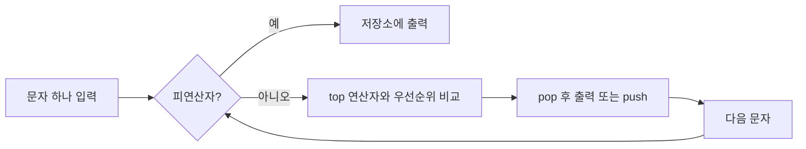

중위 표기는 연산자가 두 피연산자 사이에 있고, 전위 표기는 앞에, 후위 표기는 뒤에 둔다. 자료는 컴파일러가 중위 수식을 후위로 바꾸는 과정을 스택으로 설명한다.

| 중위 | 후위 | 전위 |
| --- | --- | --- |
| A+B | AB+ | +AB |
| A+B−C | AB+C− | +A−BC |
| A+B×C−D | ABC×+D− | −+A×BCD |
| (A+B)/(C−D) | AB+CD−/ | /+AB−CD |



<Tabs>
  <Tab label="피연산자">입력 순서대로 결과 저장소에 보낸다.</Tab>
  <Tab label="연산자">스택 top과 우선순위를 비교해 필요한 연산자를 pop한 뒤 새 연산자를 push한다.</Tab>
  <Tab label="괄호">후위 표기는 괄호 없이도 연산 순서를 보존한다.</Tab>
</Tabs>

```html preview
<div style="font-family:system-ui,sans-serif;padding:20px;color:var(--foreground)">
<label for="amt" style="font-size:14px;font-weight:600">변환 절차</label>
<div id="out" style="font-size:30px;font-weight:700;color:var(--chart-1);margin:6px 0">1단계</div>
<input id="amt" type="range" min="1" max="4" step="1" value="1" style="width:100%;accent-color:var(--primary)" />
<p style="font-size:13px;color:var(--muted-foreground)">원본 주차 순서를 움직여 현재 자료의 핵심을 확인한다.</p>
<script>
var amt=document.getElementById('amt'); var out=document.getElementById('out');
amt.addEventListener('input',function(){out.textContent=Number(amt.value).toLocaleString()+'단계';});
</script>
</div>
```

> [!CAUTION]
> 자료의 비교 규칙은 top 연산자 우선순위가 새 연산자보다 크거나 같은 경우 pop을 반복하는 방식이다. 괄호 규칙을 별도로 처리해야 한다.

<details>
<summary>예제 읽기</summary>

A+B×C−D는 곱셈을 먼저 처리하므로 ABC×+D−가 된다. 각 문자를 왼쪽에서 오른쪽으로 읽으며 스택과 출력 저장소를 함께 추적한다.

</details>

<!-- source: infix/prefix/postfix decks; examples and stack rule preserved -->