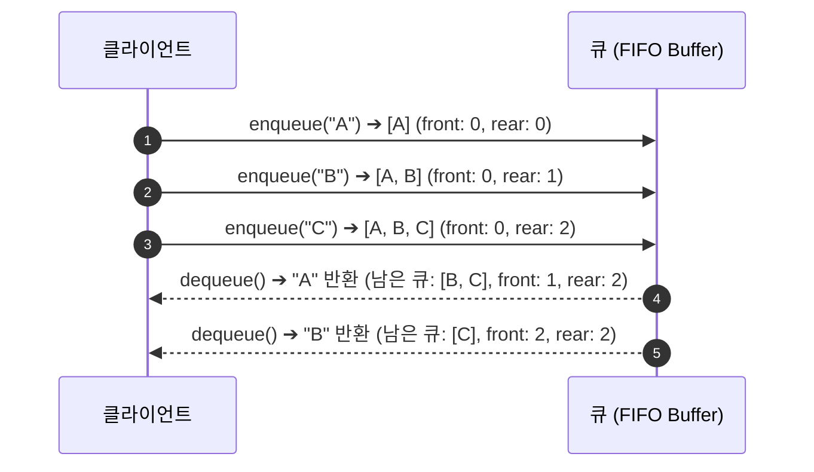
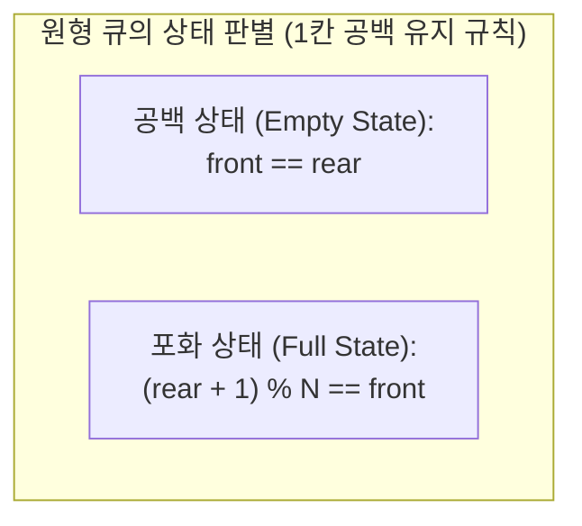
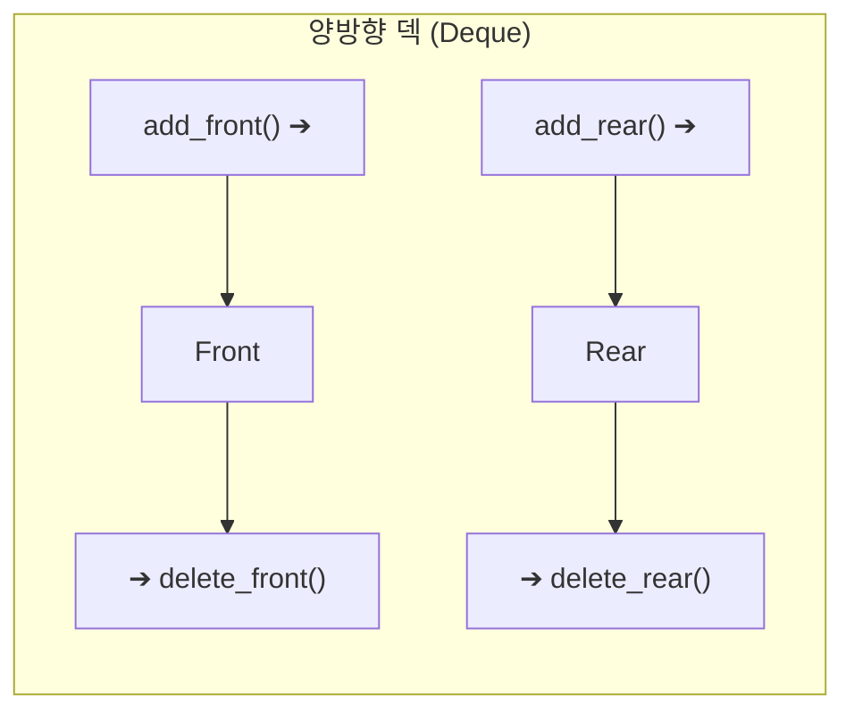

> [!abstract] 핵심 요약
> **큐(Queue)**는 한쪽 끝(`rear`)에서 삽입(`enqueue`)되고 다른 쪽 끝(`front`)에서 삭제(`dequeue`)되는 **선입선출(FIFO, First-In First-Out)** 선형 자료구조이다.
> 고정 배열의 선형 큐는 `rear`가 끝에 도달했을 때 앞쪽의 빈 공간을 재활용하지 못하는 **거짓 포화(False Overflow)**가 발생하므로, 인덱스를 순환시키는 **원형 큐(Circular Queue, Modulo $N$)** 또는 양방향 입출력이 가능한 **덱(Deque)**을 사용하여 $O(1)$ 버퍼를 구성한다.

---

## 1. 큐의 FIFO 동작 메커니즘과 포인터 갱신



---

## 2. 원형 큐(Circular Queue)의 모듈로(%) 인덱싱 수식

크기가 $N$인 배열에서 `front`와 `rear` 포인터는 시계 방향으로 순환한다:

$$\text{Next Rear} = (\text{rear} + 1) \pmod N$$
$$\text{Next Front} = (\text{front} + 1) \pmod N$$



| 연산 명칭 | 포인터 갱신 수식 | 시간 복잡도 | 설명 |
| :-- | :-- | :-- | :-- |
| **`enqueue(x)`** | `rear = (rear + 1) % N`<br/>`queue[rear] = x` | **$O(1)$** | 큐의 뒤쪽에 새 원소 삽입 |
| **`dequeue()`** | `front = (front + 1) % N`<br/>`return queue[front]` | **$O(1)$** | 큐의 앞쪽 원소 반환 및 삭제 |
| **`is_empty()`** | `front == rear` | **$O(1)$** | 큐가 비어있는지 검사 |
| **`is_full()`** | `(rear + 1) % N == front` | **$O(1)$** | 큐가 가득 찼는지 검사 |

---

## 3. 덱(Deque: Double-Ended Queue)의 4대 핵심 연산

덱은 전단(`front`)과 후단(`rear`) 양쪽 모두에서 삽입과 삭제를 자유롭게 수행할 수 있는 범용 큐이다.



---

## 4. 실시간 원형 큐(Circular Queue) 링 버퍼 시뮬레이터

```html preview
<div style="font-family:system-ui,-apple-system,sans-serif;padding:20px;background:var(--card);color:var(--card-foreground);border:1px solid var(--border);border-radius:var(--radius)">
  <div style="font-size:16px;font-weight:700;margin-bottom:14px;color:var(--primary);display:flex;align-items:center;gap:8px">
    <span>🔄 원형 큐 (Circular Queue, N=6) 링 버퍼 시뮬레이터</span>
  </div>

  <div style="display:flex;gap:8px;margin-bottom:14px;flex-wrap:wrap">
    <input id="qItemIn" type="text" placeholder="원소 (예: Q1)" value="Data_1" style="flex:1;min-width:100px;padding:6px 10px;background:var(--background);color:var(--foreground);border:1px solid var(--border);border-radius:var(--radius);font-size:13px" />
    <button id="enqBtn" style="padding:6px 14px;background:var(--primary);color:#fff;border:none;border-radius:var(--radius);font-size:12px;font-weight:700;cursor:pointer">Enqueue (삽입)</button>
    <button id="deqBtn" style="padding:6px 14px;background:var(--destructive);color:#fff;border:none;border-radius:var(--radius);font-size:12px;font-weight:700;cursor:pointer">Dequeue (삭제)</button>
  </div>

  <div style="padding:14px;background:var(--background);border:1px solid var(--border);border-radius:var(--radius);margin-bottom:12px">
    <div style="font-size:11px;font-weight:700;color:var(--chart-1);margin-bottom:10px">배열 메모리 슬롯 (0 ~ 5):</div>
    <div id="qSlots" style="display:grid;grid-template-columns:repeat(6, 1fr);gap:6px"></div>
  </div>

  <div style="display:grid;grid-template-columns:1fr 1fr;gap:10px">
    <div style="padding:8px 12px;background:var(--background);border:1px solid var(--border);border-radius:var(--radius);font-size:12px">
      포인터 상태: <span id="ptrState" style="font-family:monospace;font-weight:700;color:var(--primary)">front=0, rear=0</span>
    </div>
    <div style="padding:8px 12px;background:var(--background);border:1px solid var(--border);border-radius:var(--radius);font-size:12px">
      버퍼 상태: <span id="qStatus" style="font-weight:700;color:var(--chart-2)">EMPTY (비어있음)</span>
    </div>
  </div>

  <script>
    var N = 6;
    var queue = new Array(N).fill(null);
    var front = 0;
    var rear = 0;
    var counter = 1;

    var slotsCont = document.getElementById('qSlots');
    var inVal = document.getElementById('qItemIn');
    var ptrOut = document.getElementById('ptrState');
    var stOut = document.getElementById('qStatus');

    function renderQueue() {
      slotsCont.innerHTML = '';
      for (var i = 0; i < N; i++) {
        var isFront = (i === front);
        var isRear = (i === rear);
        var val = queue[i];

        var slot = document.createElement('div');
        slot.style.cssText = 'padding:8px 4px;text-align:center;border-radius:4px;border:1px solid ' + (val ? 'var(--primary)' : 'var(--border)') + ';background:' + (val ? 'var(--card)' : 'var(--background)') + ';color:var(--foreground)';
        
        var tags = [];
        if (isFront) tags.push('<span style="color:var(--chart-1);font-weight:800">F</span>');
        if (isRear) tags.push('<span style="color:var(--chart-2);font-weight:800">R</span>');

        slot.innerHTML = '<div style="font-size:9px;color:var(--muted-foreground)">[' + i + '] ' + tags.join('/') + '</div><div style="font-size:12px;font-weight:700;margin-top:4px">' + (val !== null ? val : '-') + '</div>';
        slotsCont.appendChild(slot);
      }

      ptrOut.textContent = "front=" + front + ", rear=" + rear;
      if (front === rear) {
        stOut.textContent = "EMPTY (비어있음)";
        stOut.style.color = "var(--muted-foreground)";
      } else if ((rear + 1) % N === front) {
        stOut.textContent = "FULL (가득참)";
        stOut.style.color = "var(--destructive)";
      } else {
        stOut.textContent = "NORMAL (데이터 적재 중)";
        stOut.style.color = "var(--chart-2)";
      }
    }

    document.getElementById('enqBtn').addEventListener('click', function() {
      if ((rear + 1) % N === front) {
        alert("Queue is Full! (원형 큐 포화 상태)");
        return;
      }
      rear = (rear + 1) % N;
      var v = inVal.value.trim() || ("D_" + counter++);
      queue[rear] = v;
      inVal.value = "Data_" + (++counter);
      renderQueue();
    });

    document.getElementById('deqBtn').addEventListener('click', function() {
      if (front === rear) {
        alert("Queue is Empty! (원형 큐 공백 상태)");
        return;
      }
      front = (front + 1) % N;
      queue[front] = null;
      renderQueue();
    });

    renderQueue();
  </script>
</div>
```
