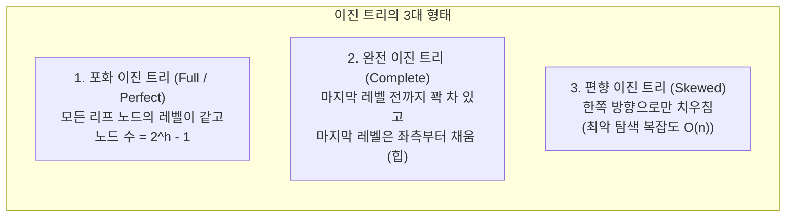
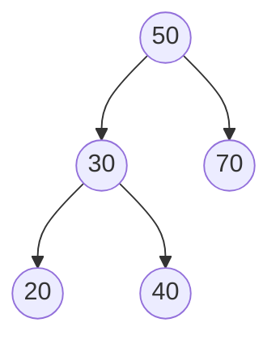
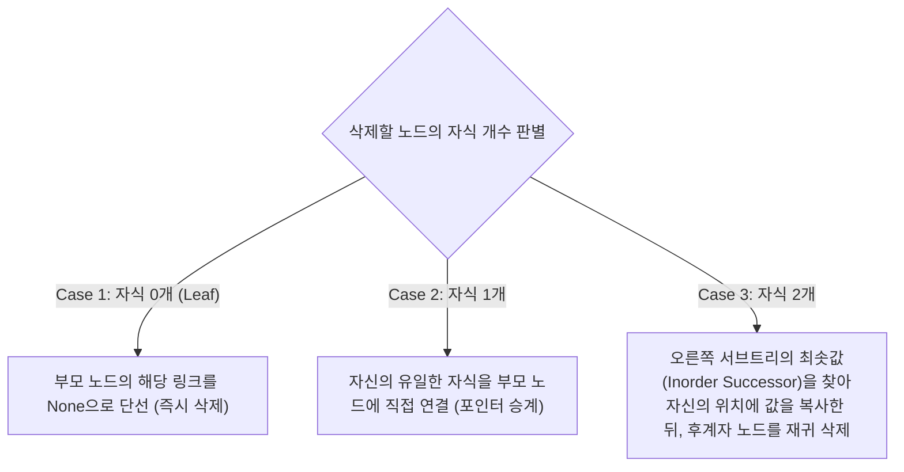

> [!abstract] 핵심 요약
> **트리(Tree)**는 하나의 루트(Root) 노드로부터 부모-자식 관계의 간선(Edge)으로 연결된 사이클이 없는 계층형 비선형 자료구조이다.
> **이진 탐색 트리(BST)**는 '왼쪽 서브트리 < 부모 < 오른쪽 서브트리'의 대소 관계 불변성을 유지하여 평균 $O(\log n)$ 시간에 탐색·삽입·삭제를 수행하며, 중위 순회(Inorder Traversal) 시 항상 오름차순 정렬된 결과를 반환한다.

---

## 1. 이진 트리의 3대 유형과 수식적 성질



$$\text{높이가 } h \text{인 이진 트리의 최대 노드 수} = 2^h - 1$$
$$\text{노드 수가 } n \text{인 완전 이진 트리의 높이} = \lfloor \log_2 n \rfloor + 1$$

---

## 2. 이진 트리의 4대 순회(Traversal) 알고리즘



| 순회 방식 | 방문 순서 (재귀 규칙) | 위 트리의 방문 결과 | 주 응용 분야 |
| :-- | :-- | :-- | :-- |
| **전위 순회 (Preorder)** | $\text{Root} \rightarrow \text{Left} \rightarrow \text{Right}$ | `50 ➔ 30 ➔ 20 ➔ 40 ➔ 70` | 트리 복제, 전위 수식 표기 |
| **중위 순회 (Inorder)** | $\text{Left} \rightarrow \text{Root} \rightarrow \text{Right}$ | `20 ➔ 30 ➔ 40 ➔ 50 ➔ 70` | **BST의 오름차순 정렬 출력** |
| **후위 순회 (Postorder)** | $\text{Left} \rightarrow \text{Right} \rightarrow \text{Root}$ | `20 ➔ 40 ➔ 30 ➔ 70 ➔ 50` | 디렉터리 용량 계산, 트리 소멸(Free) |
| **레벨 순회 (Level-order)**| 큐(Queue)를 이용한 레벨별 BFS | `50 ➔ 30 ➔ 70 ➔ 20 ➔ 40` | 최단 거리 계층 탐색 |

---

## 3. 이진 탐색 트리(BST)의 3단계 노드 삭제 메커니즘



---

## 4. 실시간 이진 탐색 트리(BST) 인터랙티브 시뮬레이터

```html preview
<div style="font-family:system-ui,-apple-system,sans-serif;padding:20px;background:var(--card);color:var(--card-foreground);border:1px solid var(--border);border-radius:var(--radius)">
  <div style="font-size:16px;font-weight:700;margin-bottom:14px;color:var(--primary);display:flex;align-items:center;gap:8px">
    <span>🌳 이진 탐색 트리 (BST) 실시간 동적 구성 및 중위 순회 탐색기</span>
  </div>

  <div style="display:flex;gap:8px;margin-bottom:14px;flex-wrap:wrap">
    <input id="bstValIn" type="number" placeholder="노드 정수값" value="45" style="width:120px;padding:6px 10px;background:var(--background);color:var(--foreground);border:1px solid var(--border);border-radius:var(--radius);font-weight:700;font-size:13px" />
    <button id="insertBstBtn" style="padding:6px 12px;background:var(--primary);color:#fff;border:none;border-radius:var(--radius);font-size:12px;font-weight:700;cursor:pointer">+ 노드 삽입</button>
    <button id="resetBstBtn" style="padding:6px 12px;background:var(--destructive);color:#fff;border:none;border-radius:var(--radius);font-size:12px;font-weight:700;cursor:pointer">초기화</button>
  </div>

  <div style="padding:14px;background:var(--background);border:1px solid var(--border);border-radius:var(--radius);min-height:110px;margin-bottom:12px">
    <div style="font-size:11px;font-weight:700;color:var(--chart-1);margin-bottom:8px">트리 노드 계층 구조:</div>
    <div id="treeTextViz" style="font-family:monospace;font-size:12px;line-height:1.6;color:var(--foreground);white-space:pre-wrap"></div>
  </div>

  <div style="padding:10px;background:var(--background);border:1px solid var(--primary);border-radius:var(--radius);font-size:12px">
    <span style="font-weight:700;color:var(--primary)">중위 순회 (Inorder 오름차순 정렬 결과): </span>
    <span id="inorderResult" style="font-family:monospace;font-weight:700;color:var(--chart-2)"></span>
  </div>

  <script>
    function BNode(val) {
      this.val = val;
      this.left = null;
      this.right = null;
    }

    var root = null;

    function insert(node, val) {
      if (!node) return new BNode(val);
      if (val < node.val) node.left = insert(node.left, val);
      else if (val > node.val) node.right = insert(node.right, val);
      return node;
    }

    function getInorder(node, list) {
      if (!node) return;
      getInorder(node.left, list);
      list.push(node.val);
      getInorder(node.right, list);
    }

    function printTree(node, prefix, isLeft, out) {
      if (!node) return;
      out.push(prefix + (isLeft ? "├── [L] " : "└── [R] ") + node.val);
      var newPrefix = prefix + (isLeft ? "│   " : "    ");
      if (node.left || node.right) {
        if (node.left) printTree(node.left, newPrefix, true, out);
        else out.push(newPrefix + "├── [L] (null)");
        if (node.right) printTree(node.right, newPrefix, false, out);
        else out.push(newPrefix + "└── [R] (null)");
      }
    }

    var inVal = document.getElementById('bstValIn');
    var treeViz = document.getElementById('treeTextViz');
    var inOut = document.getElementById('inorderResult');

    function refreshTree() {
      if (!root) {
        treeViz.textContent = "(트리가 비어있습니다. 숫자를 입력하여 노드를 삽입하세요)";
        inOut.textContent = "[]";
        return;
      }
      var lines = ["[Root] " + root.val];
      if (root.left) printTree(root.left, "", true, lines);
      if (root.right) printTree(root.right, "", false, lines);
      treeViz.textContent = lines.join("\\n");

      var inList = [];
      getInorder(root, inList);
      inOut.textContent = inList.join(" ➔ ");
    }

    document.getElementById('insertBstBtn').addEventListener('click', function() {
      var v = parseInt(inVal.value);
      if (isNaN(v)) return;
      root = insert(root, v);
      inVal.value = Math.floor(Math.random() * 90) + 10;
      refreshTree();
    });

    document.getElementById('resetBstBtn').addEventListener('click', function() {
      root = null;
      refreshTree();
    });

    [50, 30, 70, 20, 40, 60, 80].forEach(function(v) { root = insert(root, v); });
    refreshTree();
  </script>
</div>
```
