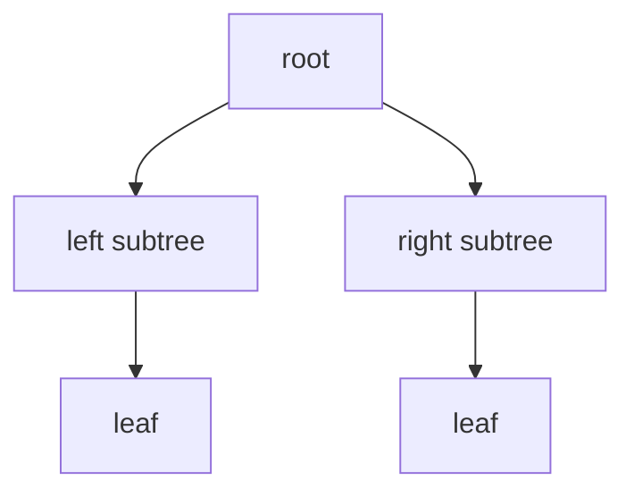

트리는 부모·자식 관계를 가진 비선형 계층 구조다. 파일 시스템, 탐색 트리, 우선순위 큐, 결정 트리의 기반으로 소개된다.



## 1. 용어와 표현

부모, 자식, 형제, 조상, 자손, 단말 노드, 차수, 레벨, 높이를 구분한다. 일반 트리는 자식 수 제한이 없고, 이진 트리는 모든 노드의 자식 수가 최대 2개다. 중첩 집합·들여쓰기·중첩 괄호·왼쪽 자식–오른쪽 형제로 표현할 수 있다.

<Tabs>
  <Tab label="순회">전위·중위·후위·레벨 순회로 노드를 방문한다.</Tab>
  <Tab label="BST 규칙">왼쪽 서브트리는 루트보다 작고 오른쪽 서브트리는 크도록 배치한다.</Tab>
  <Tab label="구현 메소드">insert, search, inorder_print, levelOrder_print 순서로 확장한다.</Tab>
</Tabs>

---

## 2. BST 삽입과 탐색

새 값은 루트와 비교해 왼쪽 또는 오른쪽으로 내려가며 빈 링크 위치에 삽입한다. 중위 순회 출력은 정렬된 순서를 준다. 자료의 35 삽입 예시는 80과 비교한 뒤 60으로 내려가 다시 비교하는 식의 단계적 이동을 보인다.

```html preview
<div style="font-family:system-ui,sans-serif;padding:20px;color:var(--foreground)">
<label for="amt" style="font-size:14px;font-weight:600">트리 주차</label>
<div id="out" style="font-size:30px;font-weight:700;color:var(--chart-1);margin:6px 0">9주차</div>
<input id="amt" type="range" min="9" max="10" step="1" value="9" style="width:100%;accent-color:var(--primary)" />
<p style="font-size:13px;color:var(--muted-foreground)">원본 주차 순서를 움직여 현재 자료의 핵심을 확인한다.</p>
<script>
var amt=document.getElementById('amt'); var out=document.getElementById('out');
amt.addEventListener('input',function(){out.textContent=Number(amt.value).toLocaleString()+'주차';});
</script>
</div>
```

| 구현 단계 | 핵심 불변식 |
| --- | --- |
| Node | value, left, right를 가진다 |
| insert | 비교 결과에 따라 빈 자식 링크를 찾는다 |
| search | 같은 비교 경로를 반복한다 |
| inorder | 왼쪽→루트→오른쪽 순서 |

> [!WARNING]
> 정렬된 값만 입력하면 BST가 연결 리스트처럼 한쪽으로 치우쳐 탐색 이점을 잃는다. 다음 AVL 자료가 이 문제를 다룬다.

<details>
<summary>질문</summary>

노드 차수와 트리 높이를 먼저 세고, 중위 순회 결과가 오름차순인지 확인한다.

</details>

<!-- source: tree and BST decks; terminology, representation and method order preserved -->