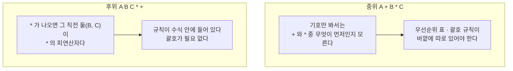
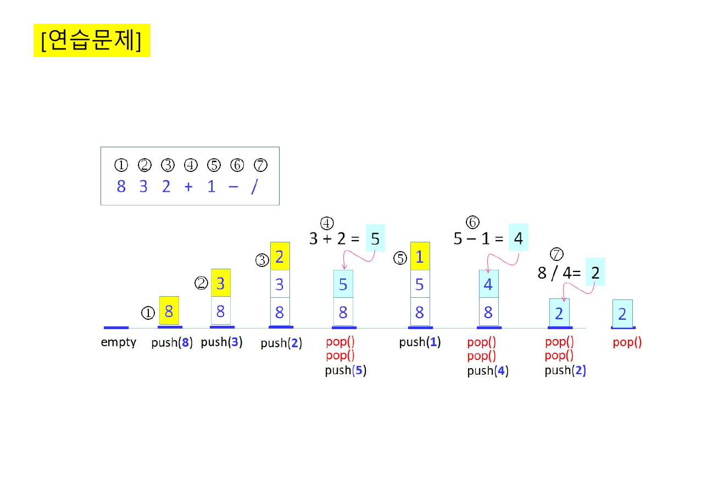
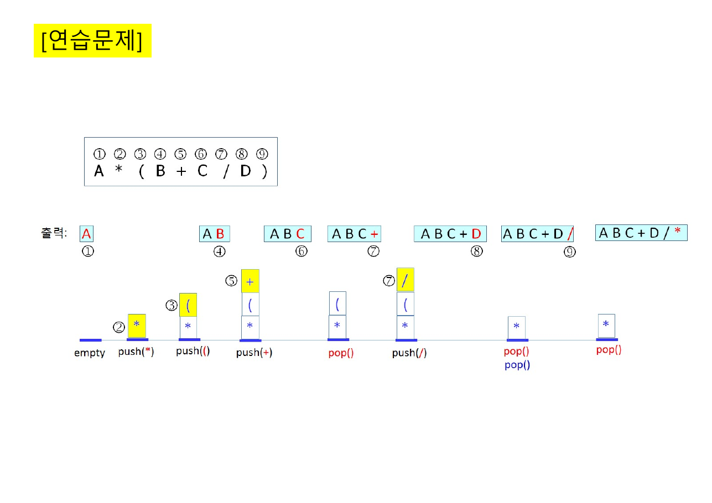
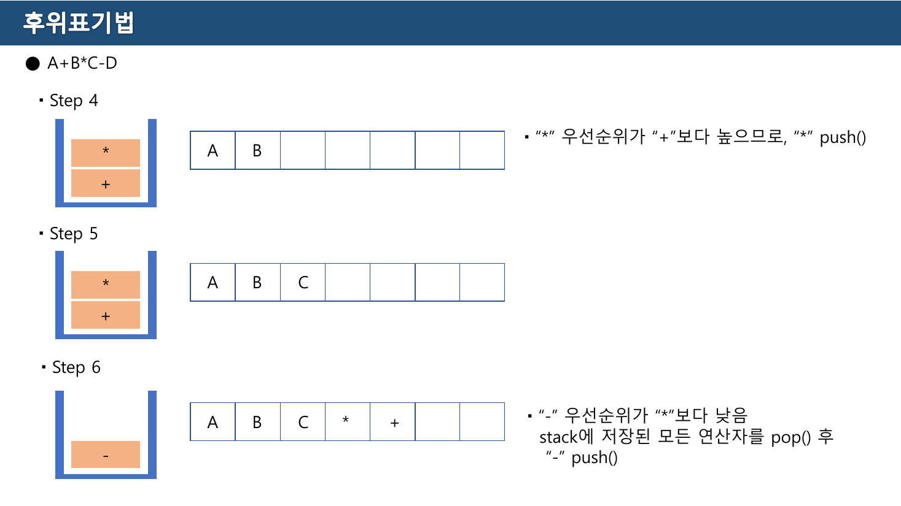
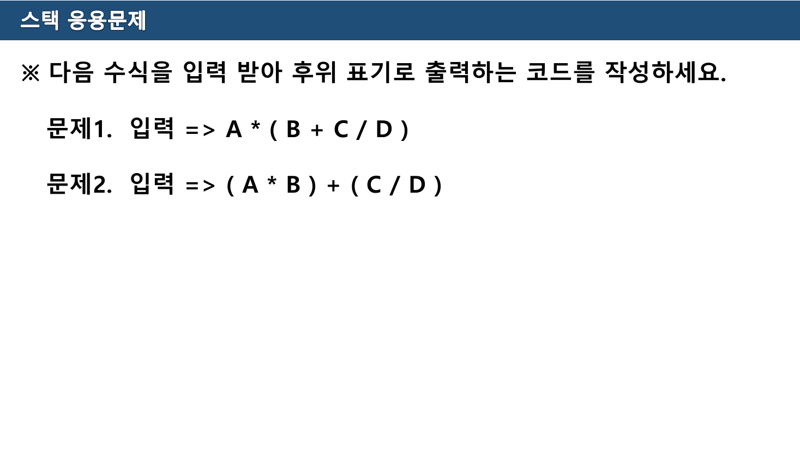
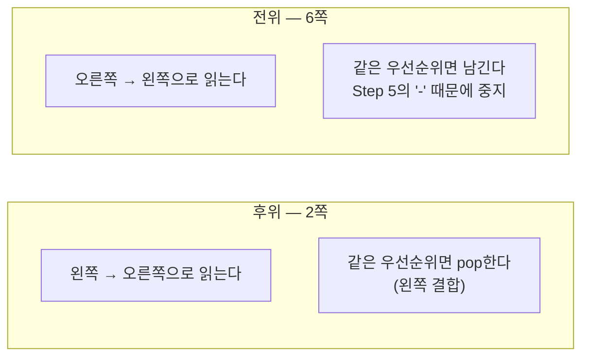
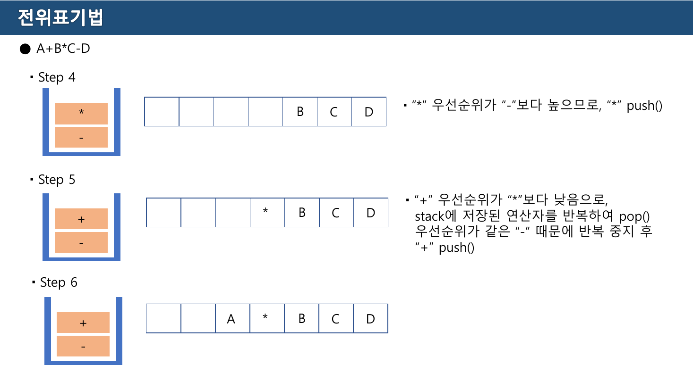

> [!abstract] 같은 내용을 두 자료가 다르게 가르친다
> 표기법 변환은 이 과목에서 **두 번** 나온다. 교재 Part 3의 25~30쪽이 한 번, 교수의 6주차 실습 자료 9쪽이 또 한 번. 다루는 예제도 겹치고 결론도 같아 보이지만, **알고리즘의 서술이 서로 다르다.** 교재는 "자신보다 낮은 연산자가 나올 때까지 pop", 실습 자료는 "스택이 빌 때까지 pop"이라고 적는다.
>
> 그리고 이 장에는 이 과목 전체에서 가장 분명한 **원본 오류**가 있다. 교재 30쪽의 변환 예제 결과가 틀렸다. 이 정리는 원본의 모든 예제를 직접 다시 계산해 대조했고, 어긋난 두 곳을 3절과 4절에서 짚는다.

---

## 1. 왜 표기법을 바꾸는가

교재 25쪽은 세 표기를 정의한다.

> \- 프로그램을 작성할 때 수식에서 `+`, `–`, `*`, `/`와 같은 이항 연산자는 2개의 피연산자 사이에 위치: **중위 표기**(Infix Notation)
> \- 컴파일러는 중위표기 수식을 **후위 표기**(Postfix Notation)으로 바꾼다.
> \- 그 이유는 **후위표기 수식은 괄호 없이 중위 표기 수식을 표현할 수 있기 때문**
> \- **전위 표기**(Prefix Notation): 연산자를 피연산자들 앞에 두는 표기

핵심은 두 번째 항목의 이유다. 중위 표기는 **괄호와 우선순위 규칙 없이는 뜻이 정해지지 않는다.** `A + B * C` 가 `(A+B)*C` 가 아니라 `A+(B*C)` 인 것은 수식 자체가 아니라 **바깥의 약속**이 정한다.

후위와 전위에는 그 약속이 필요 없다. 연산자의 자리가 곧 결합 관계이기 때문이다.



26쪽의 표는 셋을 나란히 놓는다. 6주차(스택응용문제) 자료 2쪽도 **똑같은 표**를 다시 싣는다.

| 중위 표기 | 후위 표기 | 전위 표기 (원본) | 직접 계산한 전위 |
| --- | --- | --- | --- |
| `A+B` | `AB+` | `+AB` | `+AB` ✓ |
| `A+B–C` | `AB+C–` | `+A–BC` | **`–+ABC`** |
| `A+B*C–D` | `ABC*+D–` | `–+A*BCD` | `–+A*BCD` ✓ |
| `(A + B) / (C – D)` | `A B+ C D – /` | `/+AB–CD` | `/+AB–CD` ✓ |

> [!caution] 원본 불일치 — 둘째 줄의 후위와 전위가 서로 다른 수식이다
> `A+B–C` 의 후위 `AB+C–` 는 **`(A+B)–C`** 의 트리를 나타낸다. 그런데 같은 줄의 전위 `+A–BC` 는 **`A+(B–C)`** 의 트리다. 두 칸이 다른 수식을 적고 있다.
>
> 산술적으로는 값이 같아서 눈에 잘 띄지 않는다 — `(A+B)−C` 와 `A+(B−C)` 는 언제나 같은 값이다. 그러나 **표기법 변환 문제의 답으로는 틀렸다.** 나머지 세 줄은 모두 왼쪽부터 결합하는 방식을 지켰고, 6주차 자료의 전위 변환 알고리즘을 그대로 돌려도 `–+ABC` 가 나온다(7절에서 확인). 같은 규칙을 둘째 줄에만 다르게 적용한 셈이다.
>
> 연산자가 `–` 와 `/` 였다면 값까지 달라진다. 예컨대 `A–B/C` 를 `–A/BC` 가 아니라 `/–ABC` 로 적으면 완전히 다른 수식이 된다.

---

## 2. 후위 표기 수식 계산하기

변환보다 계산이 먼저다. 27쪽의 알고리즘은 짧다.

> **[핵심 아이디어] 피연산자는 스택에 push하고, 연산자는 2회 pop하여 계산한 후 push**
>
> 입력을 좌에서 우로 문자를 1개씩 읽고 이를 C라고하면
> \- [1] C가 피연산자이면 C를 push
> \- [2] C가 연산자(op)이면 pop을 2회 수행한다. 먼저 pop된 피연산자가 A이고, 나중에 pop된 피연산자가 B라면, **(A op B)** 를 수행하여 그 결괏값을 push



28쪽 예제의 입력은 `8 3 2 + 1 – /` 일곱 토큰이다. 그림이 보여주는 계산은 이렇다.

| 단계 | 토큰 | 동작 | 스택 (아래→위) |
| --- | --- | --- | --- |
| ① | `8` | push | 8 |
| ② | `3` | push | 8 3 |
| ③ | `2` | push | 8 3 2 |
| ④ | `+` | pop·pop → **3 + 2 = 5** → push | 8 5 |
| ⑤ | `1` | push | 8 5 1 |
| ⑥ | `–` | pop·pop → **5 – 1 = 4** → push | 8 4 |
| ⑦ | `/` | pop·pop → **8 / 4 = 2** → push | 2 |

결과는 **2**이고, 이는 원래 수식 `8 / ((3+2) – 1) = 8/4 = 2` 와 정확히 맞는다. 그림은 옳다.

> [!caution] 원본 오류 — 27쪽의 규칙과 28쪽의 그림이 반대다
> 27쪽은 *"먼저 pop된 피연산자가 A이고, 나중에 pop된 피연산자가 B라면, **(A op B)**"* 라고 적었다. ⑥단계에서 먼저 pop되는 것은 `1`(A), 나중이 `5`(B)이므로 규칙대로면 `1 – 5 = –4` 다. 그런데 28쪽 그림은 `5 – 1 = 4` 라고 쓴다.
>
> ⑦단계도 마찬가지다. 규칙대로면 `4 / 8 = 0.5`, 그림은 `8 / 4 = 2`.
>
> **그림이 맞고 규칙이 틀렸다.** 올바른 서술은 *"나중에 pop된 것이 왼쪽 피연산자"* — 즉 `(B op A)` 다. `+` 와 `*` 는 교환법칙이 성립해 이 오류가 드러나지 않고, `–` 와 `/` 에서만 드러난다. 28쪽 예제가 `–` 와 `/` 를 포함하고 있어 다행히 확인이 가능하다.
>
> 이유는 후위 표기의 구조를 보면 분명하다. `B A op` 순으로 들어오므로 스택에는 B가 먼저, A가 나중에 쌓인다. 꺼낼 때는 A가 먼저 나온다. 왼쪽 피연산자는 **먼저 들어간 B**다.

이 순서를 아래에서 직접 확인할 수 있다.

```html preview
<div id="pf-root">
  <style>
    #pf-root{font-family:system-ui,-apple-system,"Segoe UI",sans-serif;color:var(--foreground);background:var(--card);
      border:1px solid var(--border);border-radius:10px;padding:16px}
    #pf-root h4{margin:0 0 4px;font-size:14px}
    #pf-root .sub{font-size:12px;opacity:.7;margin-bottom:12px}
    #pf-root .bar{display:flex;gap:8px;flex-wrap:wrap;align-items:center;margin-bottom:12px}
    #pf-root button{font:inherit;font-size:12.5px;padding:6px 12px;border-radius:7px;cursor:pointer;
      border:1px solid var(--border);background:transparent;color:var(--foreground)}
    #pf-root button.sel{border-color:var(--chart-1);color:var(--chart-1)}
    #pf-root button:disabled{opacity:.4;cursor:default}
    #pf-root .toks{font-family:ui-monospace,SFMono-Regular,Menlo,monospace;font-size:16px;letter-spacing:.22em;margin:6px 0 12px}
    #pf-root .toks span{padding:2px 3px;border-radius:4px}
    #pf-root .toks span.on{background:var(--chart-1);color:var(--card)}
    #pf-root .toks span.past{opacity:.42}
    #pf-root svg{width:100%;height:auto;display:block}
    #pf-root .say{font-family:ui-monospace,SFMono-Regular,Menlo,monospace;font-size:12.5px;margin-top:10px;
      border-left:3px solid var(--chart-2);padding:7px 0 7px 11px;line-height:1.7;white-space:pre-wrap;min-height:3.4em}
  </style>
  <h4>후위 표기 계산기 — 어느 쪽이 왼쪽 피연산자인가</h4>
  <div class="sub">원본 28쪽의 <code>8 3 2 + 1 – /</code>. 규칙을 바꿔 가며 같은 입력을 계산해 본다.</div>
  <div class="bar">
    <button id="pf-ba" class="sel">28쪽 그림대로 (B op A)</button>
    <button id="pf-bb">27쪽 글대로 (A op B)</button>
    <button id="pf-step">▶ 한 토큰</button>
    <button id="pf-reset">처음으로</button>
  </div>
  <div class="toks" id="pf-toks"></div>
  <svg id="pf-svg" viewBox="0 0 700 160" role="img" aria-label="후위 표기 계산 스택"></svg>
  <div class="say" id="pf-say"></div>
</div>
<script>
(function(){
  var T=["8","3","2","+","1","-","/"];
  var correct=true, i=0, st=[], log=[];
  var A=document.getElementById("pf-ba"), B=document.getElementById("pf-bb");
  A.onclick=function(){ correct=true; reset(); };
  B.onclick=function(){ correct=false; reset(); };
  document.getElementById("pf-step").onclick=step;
  document.getElementById("pf-reset").onclick=reset;
  function reset(){ i=0; st=[]; log=[]; render(); }
  function fmt(x){ return (Math.round(x*100)/100).toString(); }
  function step(){
    if(i>=T.length) return;
    var c=T[i++];
    if("+-*/".indexOf(c)<0){ st.push(parseFloat(c)); log.push("push("+c+")"); }
    else{
      var a=st.pop(), b=st.pop();
      var L = correct? b : a, R = correct? a : b;
      var v = c==="+"? L+R : c==="-"? L-R : c==="*"? L*R : L/R;
      st.push(v);
      log.push("pop()→"+fmt(a)+", pop()→"+fmt(b)+"   ⇒  "+fmt(L)+" "+c+" "+fmt(R)+" = "+fmt(v));
    }
    render();
  }
  function render(){
    A.classList.toggle("sel",correct); B.classList.toggle("sel",!correct);
    document.getElementById("pf-step").disabled = i>=T.length;
    document.getElementById("pf-toks").innerHTML = T.map(function(t,k){
      return '<span class="'+(k===i-1?"on":(k<i?"past":""))+'">'+t+'</span>';
    }).join(" ");
    var S="";
    st.forEach(function(v,k){
      var y=110-k*36;
      S+='<rect x="24" y="'+y+'" width="76" height="30" rx="5" fill="none" stroke="var(--chart-1)" stroke-width="1.6"/>';
      S+='<text x="62" y="'+(y+20)+'" text-anchor="middle" font-size="14" fill="var(--chart-1)">'+fmt(v)+'</text>';
    });
    S+='<line x1="18" y1="142" x2="106" y2="142" stroke="var(--foreground)" stroke-width="2.5"/>';
    S+='<text x="120" y="142" font-size="12" fill="var(--chart-2)">스택 바닥</text>';
    S+='<text x="230" y="30" font-size="12" fill="var(--chart-2)">진행 기록</text>';
    log.forEach(function(l,k){
      S+='<text x="230" y="'+(52+k*17)+'" font-size="11.5" font-family="ui-monospace, monospace" fill="var(--foreground)" opacity="'+(k===log.length-1?1:0.5)+'">'+l+'</text>';
    });
    document.getElementById("pf-svg").innerHTML=S;
    var say;
    if(i<T.length){ say = i===0? "왼쪽 토큰부터 하나씩 읽는다." : log[log.length-1]; }
    else {
      say = "결과: "+fmt(st[0])+"\n원래 수식 8 / ((3+2) − 1) 의 값은 2 이다.";
      say += correct? "\n→ 일치한다. 나중에 pop된 것이 왼쪽 피연산자다."
                    : "\n→ 어긋난다. 27쪽 글대로 (A op B)를 하면 − 와 / 에서 값이 뒤집힌다.";
    }
    document.getElementById("pf-say").textContent=say;
  }
  reset();
})();
</script>
```

---

## 3. 중위 → 후위 — 교재의 알고리즘과 어긋난 예제

29쪽의 알고리즘은 이 장에서 가장 촘촘한 서술이다.

> **[핵심 아이디어] 왼쪽 괄호나 연산자는 스택에 push하고, 피연산자는 출력**
>
> 입력을 좌에서 우로 문자를 1개씩 읽는다. 읽은 문자가
>
> 1. **피연산자**이면, 읽은 문자를 출력
> 2. **왼쪽 괄호**이면, push
> 3. **오른쪽 괄호**이면, 왼쪽 괄호가 나올 때까지 pop하여 출력. 단, 오른쪽이나 왼쪽 괄호는 출력하지 않음
> 4. **연산자**이면, **자신의 우선순위보다 낮은 연산자가 스택 top에 나타날 때까지 pop**하여 출력하고 읽은 연산자를 push
>
> 입력을 모두 읽었으면 스택이 empty될 때까지 pop 출력

네 규칙이 모두 필요하고, 특히 4번의 조건이 이 알고리즘의 전부다. **"자신보다 낮은 것이 나타나면 멈춘다"** — 즉 top이 자신과 같거나 높은 동안만 pop한다.



> [!caution] 원본 오류 — 30쪽 예제의 결과가 틀렸다
> 30쪽의 입력은 `A * ( B + C / D )` 이고, 슬라이드가 내놓은 답은 **`A B C + D / *`** 다. 이 답은 틀렸다.
>
> 어긋나는 지점은 일곱 번째 토큰 `/` 를 읽는 순간이다. 그때 스택 top은 `+` 인데, 슬라이드는 **`+` 를 pop해서 출력**하고(출력이 `A B C` → `A B C +` 로 바뀐다) `/` 를 push한다. 그러나 29쪽 규칙 4는 *"자신의 우선순위보다 **낮은** 연산자가 top에 나타날 때까지 pop"* 이다. `+` 는 `/` 보다 **낮으므로** 그 자리에서 멈춰야 하고, `+` 는 스택에 남아야 한다.
>
> **자기 자료의 규칙을 자기 예제가 어겼다.** 올바른 진행은 아래와 같다.
>
> | 토큰 | 동작 | 출력 | 스택 |
> | --- | --- | --- | --- |
> | `A` | 출력 | `A` | |
> | `*` | push | `A` | `*` |
> | `(` | push | `A` | `* (` |
> | `B` | 출력 | `A B` | `* (` |
> | `+` | top이 `(` 이므로 그냥 push | `A B` | `* ( +` |
> | `C` | 출력 | `A B C` | `* ( +` |
> | `/` | top `+` 는 `/` 보다 낮음 → **pop하지 않고** push | `A B C` | `* ( + /` |
> | `D` | 출력 | `A B C D` | `* ( + /` |
> | `)` | `(` 나올 때까지 pop → `/`, `+` 출력, 괄호는 버림 | `A B C D / +` | `*` |
> | 끝 | 스택이 빌 때까지 pop | **`A B C D / + *`** | |
>
> 검산: `A B C D / + *` 를 2절의 규칙으로 되읽으면 `A * (B + (C/D))` 로, 원래 수식과 같다. 반면 슬라이드의 `A B C + D / *` 를 되읽으면 `A * ((B+C)/D)` 가 되어 **다른 수식**이다. 값으로 확인해도 `A=1, B=2, C=6, D=3` 일 때 원식은 `1*(2+2)=4`, 슬라이드의 답은 `1*((2+6)/3)≈2.67` 이다.

아래에서 두 진행을 나란히 확인할 수 있다.

```html preview
<div id="cv-root">
  <style>
    #cv-root{font-family:system-ui,-apple-system,"Segoe UI",sans-serif;color:var(--foreground);background:var(--card);
      border:1px solid var(--border);border-radius:10px;padding:16px}
    #cv-root h4{margin:0 0 4px;font-size:14px}
    #cv-root .sub{font-size:12px;opacity:.7;margin-bottom:12px}
    #cv-root .bar{display:flex;gap:8px;flex-wrap:wrap;align-items:center;margin-bottom:12px}
    #cv-root button{font:inherit;font-size:12.5px;padding:6px 12px;border-radius:7px;cursor:pointer;
      border:1px solid var(--border);background:transparent;color:var(--foreground)}
    #cv-root button.sel{border-color:var(--chart-1);color:var(--chart-1)}
    #cv-root select{font:inherit;font-size:12.5px;padding:6px 8px;border-radius:7px;border:1px solid var(--border);
      background:transparent;color:var(--foreground)}
    #cv-root table{width:100%;border-collapse:collapse;font-size:12.5px;margin-top:6px}
    #cv-root th,#cv-root td{border:1px solid var(--border);padding:5px 8px;text-align:left}
    #cv-root th{opacity:.85}
    #cv-root td.mono,#cv-root th.mono{font-family:ui-monospace,SFMono-Regular,Menlo,monospace;letter-spacing:.06em}
    #cv-root tr.cur td{border-color:var(--chart-1);color:var(--chart-1)}
    #cv-root .res{font-family:ui-monospace,SFMono-Regular,Menlo,monospace;font-size:14px;margin-top:12px;
      border-left:3px solid var(--chart-2);padding:8px 0 8px 11px;line-height:1.8;white-space:pre-wrap}
  </style>
  <h4>중위 → 후위 변환기 (29쪽 규칙 그대로)</h4>
  <div class="sub">30쪽 예제와 6주차 실습 문제를 골라 한 단계씩 진행한다. 우선순위는 <code>* /</code> = 2, <code>+ –</code> = 1.</div>
  <div class="bar">
    <select id="cv-pick">
      <option value="A*(B+C/D)">A * ( B + C / D )  — 교재 30쪽 · 실습 문제1</option>
      <option value="(A*B)+(C/D)">( A * B ) + ( C / D )  — 실습 문제2</option>
      <option value="A+B*C-D">A + B * C – D  — 6주차 변환 자료</option>
      <option value="A/B*C+D">A / B * C + D  — 중간고사 예시1</option>
      <option value="(A*B-C)/(D+E)">( A * B – C ) / ( D + E )  — 중간고사 예시2</option>
    </select>
    <button id="cv-step">▶ 한 단계</button>
    <button id="cv-all">끝까지</button>
    <button id="cv-reset">처음으로</button>
  </div>
  <table>
    <thead><tr><th style="width:14%">토큰</th><th style="width:36%">동작</th><th class="mono" style="width:28%">출력</th><th class="mono" style="width:22%">스택</th></tr></thead>
    <tbody id="cv-body"></tbody>
  </table>
  <div class="res" id="cv-res"></div>
</div>
<script>
(function(){
  var prec={"+":1,"-":1,"*":2,"/":2};
  var expr="A*(B+C/D)", trace=[], k=0;
  function build(e){
    var out=[], st=[], tr=[];
    for(var i=0;i<e.length;i++){
      var c=e[i], act;
      if(/[A-Za-z0-9]/.test(c)){ out.push(c); act="피연산자 → 출력"; }
      else if(c==="("){ st.push(c); act="왼쪽 괄호 → push"; }
      else if(c===")"){
        var moved=[];
        while(st.length && st[st.length-1]!=="("){ moved.push(st.pop()); out.push(moved[moved.length-1]); }
        st.pop();
        act="오른쪽 괄호 → '(' 까지 pop"+(moved.length?" ("+moved.join(", ")+")":"")+", 괄호는 버림";
      } else {
        var moved2=[];
        while(st.length && st[st.length-1]!=="(" && prec[st[st.length-1]]>=prec[c]){ moved2.push(st.pop()); out.push(moved2[moved2.length-1]); }
        st.push(c);
        act = moved2.length ? "top("+moved2.join(", ")+")이 "+c+"보다 낮지 않음 → pop 후 push("+c+")"
                            : "top이 "+c+"보다 낮음(또는 '(') → 바로 push("+c+")";
      }
      tr.push({tok:c, act:act, out:out.join(" "), st:st.join(" ")});
    }
    var tail=[];
    while(st.length){ tail.push(st[st.length-1]); out.push(st.pop()); }
    tr.push({tok:"(끝)", act:"스택이 빌 때까지 pop"+(tail.length?" ("+tail.join(", ")+")":""), out:out.join(" "), st:""});
    return tr;
  }
  var pick=document.getElementById("cv-pick");
  pick.onchange=function(){ expr=pick.value; reset(); };
  document.getElementById("cv-step").onclick=function(){ if(k<trace.length) k++; render(); };
  document.getElementById("cv-all").onclick=function(){ k=trace.length; render(); };
  document.getElementById("cv-reset").onclick=reset;
  function reset(){ trace=build(expr); k=0; render(); }
  function render(){
    var tb=document.getElementById("cv-body"); tb.innerHTML="";
    for(var i=0;i<k;i++){
      var t=trace[i], tr=document.createElement("tr");
      if(i===k-1) tr.className="cur";
      tr.innerHTML="<td class='mono'>"+t.tok+"</td><td>"+t.act+"</td><td class='mono'>"+t.out+"</td><td class='mono'>"+(t.st||"—")+"</td>";
      tb.appendChild(tr);
    }
    if(k===0){ tb.innerHTML="<tr><td colspan='4' style='opacity:.6'>‘한 단계’ 를 눌러 시작한다.</td></tr>"; }
    var r=document.getElementById("cv-res");
    if(k>=trace.length){
      var fin=trace[trace.length-1].out;
      var msg="입력  "+expr+"\n후위  "+fin;
      if(expr==="A*(B+C/D)"){ msg+="\n\n교재 30쪽이 적은 답은 A B C + D / * 로, 위 결과와 다르다."; }
      r.textContent=msg;
    } else { r.textContent=""; }
  }
  reset();
})();
</script>
```

---

## 4. 실습 자료의 알고리즘 — 같은 일, 다른 서술

6주차 변환 자료 2쪽은 후위 변환을 이렇게 적는다.

> 입력된 데이터를 **왼쪽에서 오른쪽으로** 문자 하나씩 입력 받는다.
> 첫번째 연산자는 무조건 stack에 push
> Stack에 Top이 가르키는 연산자(`top_op`)와 입력 받은 연산자(`new_op`)를 비교
> \- `top_op >= new_op` 인경우: ① **stack이 isEmpty() 일 때까지 반복 pop()** 하여 저장소에 입력 ② `new_op`를 stack에 push()
> \- `top_op < new_op` 인경우: ① `new_op`를 stack에 push()

교재 29쪽 규칙 4와 비교하면 조건의 형태는 같다(`top_op >= new_op` 이면 pop). 그런데 **멈추는 시점이 다르다.**

| | 교재 29쪽 | 실습 2쪽 |
| --- | --- | --- |
| pop을 멈추는 조건 | top이 **자신보다 낮아지면** 멈춤 | **스택이 빌 때까지** |
| 괄호 처리 | 규칙 2·3으로 명시 | **언급 없음** |

3~5쪽의 예제 `A+B*C–D` 에서는 두 서술이 같은 답을 낸다. `–` 를 읽을 때 스택에 `+`, `*` 가 있고 **둘 다 `–` 보다 높거나 같으므로** 어차피 전부 pop되기 때문이다.



```text
Step 4:  "*" 우선순위가 "+"보다 높으므로, "*" push()      저장소: A B      스택: + *
Step 5:  C 를 저장소로                                    저장소: A B C    스택: + *
Step 6:  "-" 우선순위가 "*"보다 낮음
         stack에 저장된 모든 연산자를 pop() 후 "-" push()  저장소: A B C * +  스택: -
Step 7:  D 를 저장소로                                    저장소: A B C * + D
Step 8:  모든 입력을 다 읽었으므로 stack을 반복 pop()      저장소: A B C * + D -
```

결과 `A B C * + D –` 는 26쪽 표의 `ABC*+D–` 와 일치하고, 직접 계산한 값과도 맞는다.

> [!caution] 원본의 빈틈 — "스택이 빌 때까지"는 일반적으로 틀린다
> 실습 2쪽의 서술을 글자 그대로 적용하면, **top이 자신보다 낮은 연산자여도 계속 pop**하게 된다. 예를 들어 `A + B * C` 에서 `*` 를 읽을 때 스택의 `+` 는 `*` 보다 낮으므로 남겨야 하는데, "스택이 빌 때까지"를 따르면 `+` 가 먼저 출력되어 `A B + C *` = `(A+B)*C` 라는 **다른 수식**이 나온다.
>
> 재미있는 것은 같은 자료 6쪽(전위 변환)에는 이 단서가 **들어 있다**는 점이다 — *"(단, 반복시 `top_op < new_op`인 경우 push() 후 중단)"*. 후위 쪽 서술에서만 빠졌다.
>
> 또 하나, 2쪽 알고리즘에는 **괄호 처리가 없다.** 그런데 6주차(스택응용문제) 3쪽의 실습 문제 두 개는 모두 괄호를 포함한다. 교재 29쪽의 규칙 2·3을 함께 봐야 문제를 풀 수 있다.



> ※ 다음 수식을 입력 받아 후위 표기로 출력하는 코드를 작성하세요.
> 문제1. 입력 ⇒ `A * ( B + C / D )`
> 문제2. 입력 ⇒ `( A * B ) + ( C / D )`

| 문제 | 후위 | 전위 |
| --- | --- | --- |
| 1 | `A B C D / + *` | `* A + B / C D` |
| 2 | `A B * C D / +` | `+ * A B / C D` |

문제 1이 교재 30쪽과 같은 수식이라는 점이 눈에 띈다. 30쪽의 답 `A B C + D / *` 와 위의 `A B C D / + *` 중 **뒤의 것이 맞다.**

---

## 5. 전위 변환 — 방향을 뒤집으면 규칙 하나가 바뀐다

6주차 변환 자료 6쪽은 전위 변환을 별도 알고리즘으로 준다.

> 입력된 데이터를 **오른쪽에서 왼쪽으로** 문자 하나씩 입력 받는다.
> 첫번째 연산자는 무조건 stack에 push
> \- `top_op >= new_op` 인경우: ① stack이 isEmpty() 일 때까지 반복 pop() 하여 저장소에 입력 **(단, 반복시 `top_op < new_op`인 경우 push() 후 중단)** ② `new_op`를 stack에 push()
> \- `top_op < new_op` 인경우: ① `new_op`를 stack에 push()

후위 알고리즘과 딱 두 가지가 다르다.



두 번째 차이가 미묘하다. 8쪽 Step 5의 설명이 그것을 직접 말한다.



```text
입력을 오른쪽부터: D, -, C, *, B, +, A

Step 1:  D 저장소로                                  저장소: D
Step 2:  "-" push                                    스택: -
Step 3:  C 저장소로                                  저장소: C D
Step 4:  "*" 우선순위가 "-"보다 높으므로 push        저장소: B? — 아직 C D,  스택: - *
Step 5:  "+" 우선순위가 "*"보다 낮으므로
         stack에 저장된 연산자를 반복하여 pop()
         → "*" 를 저장소로
         우선순위가 같은 "-" 때문에 반복 중지 후 "+" push
                                                     저장소: * B C D,  스택: - +
Step 6:  A 저장소로                                  저장소: + A * B C D  ← + 도 이미 pop된 상태로 그려짐
Step 7:  모든 입력을 다 읽었으므로 반복 pop()        저장소: - + A * B C D
```

결과 `– + A * B C D` 는 26쪽 표의 `–+A*BCD` 와 일치한다.

**왜 전위에서는 같은 우선순위일 때 남기는가.** 왼쪽부터 읽는 후위에서는 같은 우선순위의 연산자가 연달아 나오면 **왼쪽 것이 먼저** 계산되어야 하므로 스택에서 꺼낸다. 오른쪽부터 읽는 전위에서는 순서가 뒤집혀, 같은 우선순위의 것을 꺼내면 **오른쪽 것이 먼저** 계산되는 잘못된 트리가 만들어진다. `A – B – C` 를 두 방식으로 돌려 보면 차이가 즉시 드러난다.

| | 올바른 결과 | 같은 우선순위를 pop했을 때 |
| --- | --- | --- |
| `A – B – C` 전위 | `– – A B C` = `(A–B)–C` | `– A – B C` = `A–(B–C)` — **값이 다르다** |

이것이 [1절의 `A+B–C` 문제](#1-왜-표기법을-바꾸는가)와 정확히 같은 함정이다. 26쪽 표의 둘째 줄은 `+A–BC` 로 적혔는데, 이는 위 표의 오른쪽 열 — **같은 우선순위를 pop해 버린 결과**와 같은 모양이다. `+` 와 `–` 라서 값이 우연히 맞았을 뿐이다.

---

## 6. 세 표기를 한 번에 보기

지금까지의 규칙을 한 표로 모은다. 원본 여러 쪽에 흩어져 있는 내용이다.

| | 중위 | 후위 | 전위 |
| --- | --- | --- | --- |
| 연산자의 자리 | 피연산자 **사이** | 피연산자 **뒤** | 피연산자 **앞** |
| 괄호 | 필요 | 불필요 | 불필요 |
| 우선순위 규칙 | 필요 | 불필요 | 불필요 |
| 읽는 방향 (변환 시) | — | 왼쪽 → 오른쪽 | 오른쪽 → 왼쪽 |
| 같은 우선순위일 때 | — | **pop한다** | **남긴다** |
| 계산할 때 | — | 왼쪽부터, 연산자에서 2회 pop | 오른쪽부터, 연산자에서 2회 pop |
| 계산 시 왼쪽 피연산자 | — | **나중에** pop된 것 | **먼저** pop된 것 |

마지막 줄이 2절의 원본 오류와 연결된다. 후위와 전위는 방향이 반대이므로 피연산자의 좌우도 반대다.

---

## 7. 예상문제

중간고사 예상문제 3쪽은 이 장에서 네 문제를 낸다.

> ※ 다음의 중위표기법을 **후위표기법**으로 변환하세요. (총 2문제, 각 10점)
> 예시1) `A / B * C + D`   예시2) `(A * B – C) / (D + E)`
>
> ※ 다음의 중위표기법을 **전위표기법**으로 변환하세요. (총 2문제, 각 10점)
> 예시1) `A / B * C + D`   예시2) `(A * B – C) / (D + E)`

직접 계산한 답이다.

| 중위 | 후위 | 전위 |
| --- | --- | --- |
| `A / B * C + D` | `A B / C * D +` | `+ * / A B C D` |
| `(A * B – C) / (D + E)` | `A B * C – D E + /` | `/ – * A B C + D E` |

첫 문제가 5절에서 짚은 함정을 정확히 겨냥한다. `/` 와 `*` 는 **우선순위가 같다.** 후위에서는 `*` 를 읽을 때 top의 `/` 를 pop해야 하고(`A B /` 가 먼저 나온다), 전위에서는 반대로 남겨야 한다. 위 인터랙티브의 선택 목록에 이 두 문제를 넣어 두었으니 단계별로 확인할 수 있다.

문제 주의사항에 *"본 문제는 예시이며, 아래 예시로 표기된 문제는 변형될 수 있습니다"* 라고 적혀 있으므로, 답을 외우는 것이 아니라 규칙을 손에 익히는 편이 안전하다.

---

## 다른 장과의 연결

- 여기서 쓰는 스택 자체와 그 두 가지 구현 — [04. 스택](./04.%20%EC%8A%A4%ED%83%9D%20%E2%80%94%20%EC%B6%9C%EC%9E%85%EA%B5%AC%EA%B0%80%20%ED%95%98%EB%82%98%EB%9D%BC%EB%8A%94%20%EC%A0%9C%EC%95%BD%EC%9D%B4%20%EB%A7%8C%EB%93%9C%EB%8A%94%20%EA%B2%83.md)
- 연산자 스택과 데이터 저장소를 동시에 굴리려면 스택이 두 개 필요하다 — 5주차(스택) 자료의 `stack_list` 클래스([04장 2절](./04.%20%EC%8A%A4%ED%83%9D%20%E2%80%94%20%EC%B6%9C%EC%9E%85%EA%B5%AC%EA%B0%80%20%ED%95%98%EB%82%98%EB%9D%BC%EB%8A%94%20%EC%A0%9C%EC%95%BD%EC%9D%B4%20%EB%A7%8C%EB%93%9C%EB%8A%94%20%EA%B2%83.md))
- 수식을 트리로 나타내면 세 표기가 곧 세 가지 순회가 된다 — [07. 트리](./07.%20%ED%8A%B8%EB%A6%AC%20%E2%80%94%20%EC%9E%90%EC%8B%9D%EC%9D%B4%20%EB%91%98%EC%9D%84%20%EB%84%98%EC%9C%BC%EB%A9%B4%20%EA%B0%90%EB%8B%B9%EC%9D%B4%20%EC%95%88%20%EB%90%9C%EB%8B%A4.md) (7주차 자료가 "수식을 트리 형태로 표현하여 계산하는 수식 트리"를 이진 트리의 활용으로 든다)

> [!tip] 세 표기와 세 순회는 같은 것이다
> 수식 `A * (B + C/D)` 를 트리로 그리면, **전위 표기 = 전위 순회**, **후위 표기 = 후위 순회**, **중위 표기 = 중위 순회**(괄호를 붙이면)가 된다. [07장](./07.%20%ED%8A%B8%EB%A6%AC%20%E2%80%94%20%EC%9E%90%EC%8B%9D%EC%9D%B4%20%EB%91%98%EC%9D%84%20%EB%84%98%EC%9C%BC%EB%A9%B4%20%EA%B0%90%EB%8B%B9%EC%9D%B4%20%EC%95%88%20%EB%90%9C%EB%8B%A4.md)에서 이 순회 세 가지를 다시 만나면 이 장을 떠올릴 만하다. 원본 자료들은 두 곳을 명시적으로 잇지 않는다.

---

## 근거 자료

| 원본 | 쪽 | 내용 | 이 문서에서 쓰인 곳 |
| --- | --- | --- | --- |
| 스택과 큐 | 25 | 세 표기의 정의와 변환 이유 | 1절 |
| 스택과 큐 | 26 | 중위·후위·전위 대조표 4행 | 1절 · **원본 불일치** |
| 스택과 큐 | 27 | 후위 수식 계산 알고리즘 | 2절 · **원본 오류** |
| 스택과 큐 | **28** | 계산 예제 `8 3 2 + 1 – /` | 2절 · 인용 · 인터랙티브 |
| 스택과 큐 | 29 | 중위 → 후위 변환 알고리즘 4규칙 | 3절 |
| 스택과 큐 | **30** | 변환 예제 `A * ( B + C / D )` | 3절 · 인용 · **원본 오류** |
| 6주차 변환 | 2 | 후위 변환 알고리즘 (괄호 처리 없음) | 4절 · **원본의 빈틈** |
| 6주차 변환 | 3 · **4** · 5 | `A+B*C–D` 후위 변환 Step 1~8 | 4절 · 인용 |
| 6주차 변환 | 6 | 전위 변환 알고리즘 (중단 조건 포함) | 5절 |
| 6주차 변환 | 7 · **8** · 9 | `A+B*C–D` 전위 변환 Step 1~7 | 5절 · 인용 |
| 6주차 스택응용문제 | 2 | 26쪽과 같은 대조표 | 1절 |
| 6주차 스택응용문제 | **3** | 실습 문제 두 개 | 4절 · 인용 |
| 중간고사 예상문제 | 3 | 후위·전위 변환 각 2문제 | 7절 |

- 이 문서의 모든 변환 결과와 계산값은 파이썬으로 직접 구현해 원본 표와 대조했다. 어긋난 곳은 **26쪽 둘째 줄 · 27쪽 규칙 · 30쪽 예제** 세 곳이다
- 텍스트 0자 페이지: 없음. 다만 28·30쪽은 텍스트가 10자뿐이고 내용이 전부 그림 안에 있어 이미지를 봐야 한다
