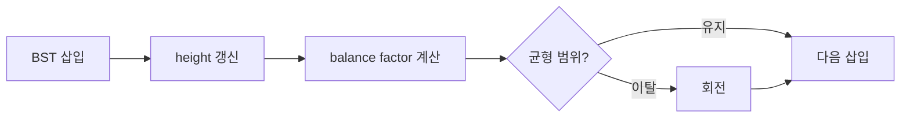

AVL은 삽입할 때마다 높이 균형을 유지하는 이진 탐색 트리다. BST가 순서대로 입력될 때 연결 리스트처럼 퇴화하는 문제를 해결한다.



## 1. 균형 기준

balance factor는 왼쪽 노드 높이에서 오른쪽 노드 높이를 뺀 값으로 설명한다. 삽입 데이터 43, 49, 84, 12, 63, 69, 96, 89를 기준으로 Node는 data, left, right, height를 관리한다.

<Tabs>
  <Tab label="BST">탐색은 빠르지만 입력 순서에 따라 높이가 커질 수 있다.</Tab>
  <Tab label="완전 BST">형태를 유지하려고 삽입 때 재구성해 탐색을 안정화하지만 삽입 비용이 커진다.</Tab>
  <Tab label="AVL">각 삽입 후 balance factor를 검사하고 필요한 회전을 수행한다.</Tab>
</Tabs>

---

## 2. 코드 구현 순서

1. 노드 생성과 height 저장
2. 삽입 후 부모 높이 갱신
3. get_balance로 왼쪽·오른쪽 높이 차이 계산
4. 불균형 유형에 맞는 단일 또는 이중 회전
5. 새 루트 반환

```html preview
<div style="font-family:system-ui,sans-serif;padding:20px;color:var(--foreground)">
<label for="amt" style="font-size:14px;font-weight:600">AVL 자료 단계</label>
<div id="out" style="font-size:30px;font-weight:700;color:var(--chart-1);margin:6px 0">1단계</div>
<input id="amt" type="range" min="1" max="2" step="1" value="1" style="width:100%;accent-color:var(--primary)" />
<p style="font-size:13px;color:var(--muted-foreground)">원본 주차 순서를 움직여 현재 자료의 핵심을 확인한다.</p>
<script>
var amt=document.getElementById('amt'); var out=document.getElementById('out');
amt.addEventListener('input',function(){out.textContent=Number(amt.value).toLocaleString()+'단계';});
</script>
</div>
```

> [!CAUTION]
> 회전은 BST의 왼쪽·오른쪽 정렬 규칙을 보존해야 한다. 높이를 먼저 갱신하지 않으면 balance factor가 틀어진다.

<details>
<summary>복잡도 관점</summary>

AVL은 삽입마다 균형을 관리하는 비용을 부담하는 대신, 한쪽으로 치우친 BST보다 탐색 높이를 제한하는 방향을 취한다. 자료는 삽입이 많을수록 완전 BST의 재구성 비용이 커진다고 비교한다.

</details>

<!-- source: AVL theory and code decks; balance-factor and insertion sequence preserved -->