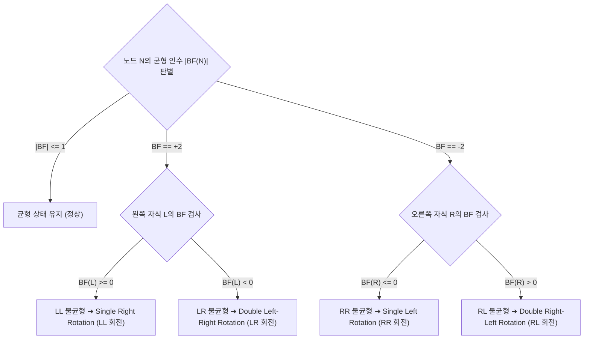

> [!abstract] 핵심 요약
> **AVL 트리(Adelson-Velskii and Landis Tree)**는 모든 노드에서 왼쪽 서브트리와 오른쪽 서브트리의 높이 차이인 **균형 인수(Balance Factor, BF)**를 $\{-1, 0, +1\}$ 범위 내로 엄격히 유지하는 자가 균형 이진 탐색 트리이다.
> 노드 삽입이나 삭제 시 $|\text{BF}| \ge 2$인 불균형이 발생하면 **LL(우회전), RR(좌회전), LR(좌-우 회전), RL(우-좌 회전)** 연산을 수행하여 최악의 경우에도 항상 **$O(\log n)$**의 탐색 성능을 보장한다.

---

## 1. 균형 인수(Balance Factor)와 불균형 판정 기준

$$\text{BF}(N) = \text{height}(\text{Left Subtree}) - \text{height}(\text{Right Subtree})$$



---

## 2. 4대 회전(Rotation) 연산과 포인터 재배치

<Tabs>
  <Tab label="1. LL 회전 (Single Right Rotation)">
    노드 $A$의 왼쪽 자식 $B$를 새로운 루트로 올리고, $A$를 $B$의 오른쪽 자식으로 내림 ($B$의 기존 오른쪽 서브트리 $T_2$는 $A$의 왼쪽 자식으로 이전).
    ```mermaid
    flowchart LR
        subgraph Before["LL 불균형"]
            A1((A)) --> B1((B))
            A1 --> T3_1["T3"]
            B1 --> T1_1["T1"]
            B1 --> T2_1["T2"]
        end
        subgraph After["LL 우회전 후"]
            B2((B)) --> T1_2["T1"]
            B2 --> A2((A))
            A2 --> T2_2["T2"]
            A2 --> T3_2["T3"]
        end
        Before -->|우회전| After
    ```
  </Tab>
  <Tab label="2. RR 회전 (Single Left Rotation)">
    노드 $A$의 오른쪽 자식 $B$를 새로운 루트로 올리고, $A$를 $B$의 왼쪽 자식으로 내림 ($B$의 기존 왼쪽 서브트리 $T_2$는 $A$의 오른쪽 자식으로 이전).
    ```mermaid
    flowchart LR
        subgraph Before_RR["RR 불균형"]
            A3((A)) --> T1_3["T1"]
            A3 --> B3((B))
            B3 --> T2_3["T2"]
            B3 --> T3_3["T3"]
        end
        subgraph After_RR["RR 좌회전 후"]
            B4((B)) --> A4((A))
            B4 --> T3_4["T3"]
            A4 --> T1_4["T1"]
            A4 --> T2_4["T2"]
        end
        Before_RR -->|좌회전| After_RR
    ```
  </Tab>
  <Tab label="3. LR / RL 이중 회전">
    <ul>
      <li><strong>LR 회전</strong>: 왼쪽 자식을 기준으로 좌회전(RR)을 수행하여 LL 형태로 변환한 뒤, 부모 노드를 기준으로 우회전(LL)을 수행.</li>
      <li><strong>RL 회전</strong>: 오른쪽 자식을 기준으로 우회전(LL)을 수행하여 RR 형태로 변환한 뒤, 부모 노드를 기준으로 좌회전(RR)을 수행.</li>
    </ul>
  </Tab>
</Tabs>

---

## 3. 실시간 자가 균형 AVL 트리 인터랙티브 시뮬레이터

```html preview
<div style="font-family:system-ui,-apple-system,sans-serif;padding:20px;background:var(--card);color:var(--card-foreground);border:1px solid var(--border);border-radius:var(--radius)">
  <div style="font-size:16px;font-weight:700;margin-bottom:14px;color:var(--primary);display:flex;align-items:center;gap:8px">
    <span>⚖️ AVL 자가 균형 트리 실시간 회전(LL/RR/LR/RL) 시뮬레이터</span>
  </div>

  <div style="display:flex;gap:8px;margin-bottom:14px;flex-wrap:wrap">
    <input id="avlInVal" type="number" placeholder="삽입할 정수" value="10" style="width:120px;padding:6px 10px;background:var(--background);color:var(--foreground);border:1px solid var(--border);border-radius:var(--radius);font-weight:700;font-size:13px" />
    <button id="avlInsertBtn" style="padding:6px 12px;background:var(--primary);color:#fff;border:none;border-radius:var(--radius);font-size:12px;font-weight:700;cursor:pointer">+ AVL 노드 삽입</button>
    <button id="avlSkewTestBtn" style="padding:6px 12px;background:var(--chart-3);color:#fff;border:none;border-radius:var(--radius);font-size:12px;font-weight:700;cursor:pointer">정렬 데이터 연속 삽입 테스트 (1~6)</button>
    <button id="avlResetBtn" style="padding:6px 12px;background:var(--destructive);color:#fff;border:none;border-radius:var(--radius);font-size:12px;font-weight:700;cursor:pointer">초기화</button>
  </div>

  <div style="padding:14px;background:var(--background);border:1px solid var(--border);border-radius:var(--radius);min-height:120px;margin-bottom:12px">
    <div style="font-size:11px;font-weight:700;color:var(--chart-1);margin-bottom:8px">AVL 트리 계층 구조 및 각 노드별 [높이 / BF]:</div>
    <div id="avlTreeViz" style="font-family:monospace;font-size:12px;line-height:1.6;color:var(--foreground);white-space:pre-wrap"></div>
  </div>

  <div style="padding:10px;background:var(--background);border:1px solid var(--primary);border-radius:var(--radius);font-size:12px">
    <span style="font-weight:700;color:var(--primary)">최근 발생한 회전 연산: </span>
    <span id="avlLogText" style="font-family:monospace;font-weight:700;color:var(--chart-2)">없음 (초기 상태)</span>
  </div>

  <script>
    function AVLNode(key) {
      this.key = key;
      this.left = null;
      this.right = null;
      this.height = 1;
    }

    function height(N) { return N ? N.height : 0; }
    function getBF(N) { return N ? height(N.left) - height(N.right) : 0; }
    function updateHeight(N) { N.height = 1 + Math.max(height(N.left), height(N.right)); }

    var lastOp = "없음";

    function rightRotate(y) {
      var x = y.left;
      var T2 = x.right;
      x.right = y;
      y.left = T2;
      updateHeight(y);
      updateHeight(x);
      return x;
    }

    function leftRotate(x) {
      var y = x.right;
      var T2 = y.left;
      y.left = x;
      x.right = T2;
      updateHeight(x);
      updateHeight(y);
      return y;
    }

    function insertAVL(node, key) {
      if (!node) return new AVLNode(key);
      if (key < node.key) node.left = insertAVL(node.left, key);
      else if (key > node.key) node.right = insertAVL(node.right, key);
      else return node;

      updateHeight(node);
      var bf = getBF(node);

      // LL Case
      if (bf > 1 && key < node.left.key) {
        lastOp = "LL 회전 (Right Rotation on " + node.key + ")";
        return rightRotate(node);
      }
      // RR Case
      if (bf < -1 && key > node.right.key) {
        lastOp = "RR 회전 (Left Rotation on " + node.key + ")";
        return leftRotate(node);
      }
      // LR Case
      if (bf > 1 && key > node.left.key) {
        lastOp = "LR 회전 (Left on " + node.left.key + " ➔ Right on " + node.key + ")";
        node.left = leftRotate(node.left);
        return rightRotate(node);
      }
      // RL Case
      if (bf < -1 && key < node.right.key) {
        lastOp = "RL 회전 (Right on " + node.right.key + " ➔ Left on " + node.key + ")";
        node.right = rightRotate(node.right);
        return leftRotate(node);
      }

      return node;
    }

    var avlRoot = null;
    var vOut = document.getElementById('avlTreeViz');
    var lOut = document.getElementById('avlLogText');
    var inKey = document.getElementById('avlInVal');

    function printAVL(node, prefix, isLeft, out) {
      if (!node) return;
      var bf = getBF(node);
      out.push(prefix + (isLeft ? "├── [L] " : "└── [R] ") + node.key + " (h=" + node.height + ", bf=" + bf + ")");
      var newPrefix = prefix + (isLeft ? "│   " : "    ");
      if (node.left || node.right) {
        if (node.left) printAVL(node.left, newPrefix, true, out);
        else out.push(newPrefix + "├── [L] null");
        if (node.right) printAVL(node.right, newPrefix, false, out);
        else out.push(newPrefix + "└── [R] null");
      }
    }

    function refreshAVL() {
      if (!avlRoot) {
        vOut.textContent = "(AVL 트리가 비어있습니다)";
        lOut.textContent = "없음";
        return;
      }
      var lines = ["[Root] " + avlRoot.key + " (h=" + avlRoot.height + ", bf=" + getBF(avlRoot) + ")"];
      if (avlRoot.left) printAVL(avlRoot.left, "", true, lines);
      if (avlRoot.right) printAVL(avlRoot.right, "", false, lines);
      vOut.textContent = lines.join("\\n");
      lOut.textContent = lastOp;
    }

    document.getElementById('avlInsertBtn').addEventListener('click', function() {
      var v = parseInt(inKey.value);
      if (isNaN(v)) return;
      lastOp = "균형 유지 (회전 미발생)";
      avlRoot = insertAVL(avlRoot, v);
      inKey.value = Math.floor(Math.random() * 90) + 10;
      refreshAVL();
    });

    document.getElementById('avlSkewTestBtn').addEventListener('click', function() {
      avlRoot = null;
      [10, 20, 30, 40, 50, 60].forEach(function(k) {
        avlRoot = insertAVL(avlRoot, k);
      });
      refreshAVL();
    });

    document.getElementById('avlResetBtn').addEventListener('click', function() {
      avlRoot = null;
      lastOp = "초기화됨";
      refreshAVL();
    });

    [30, 20, 40, 10, 25].forEach(function(k) { avlRoot = insertAVL(avlRoot, k); });
    refreshAVL();
  </script>
</div>
```
