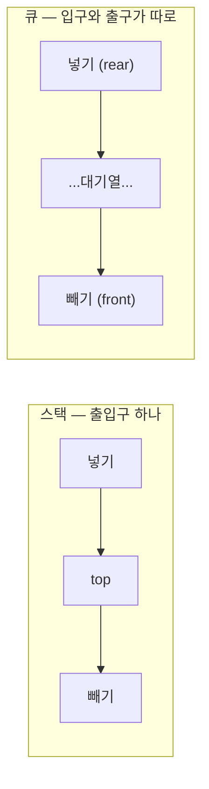
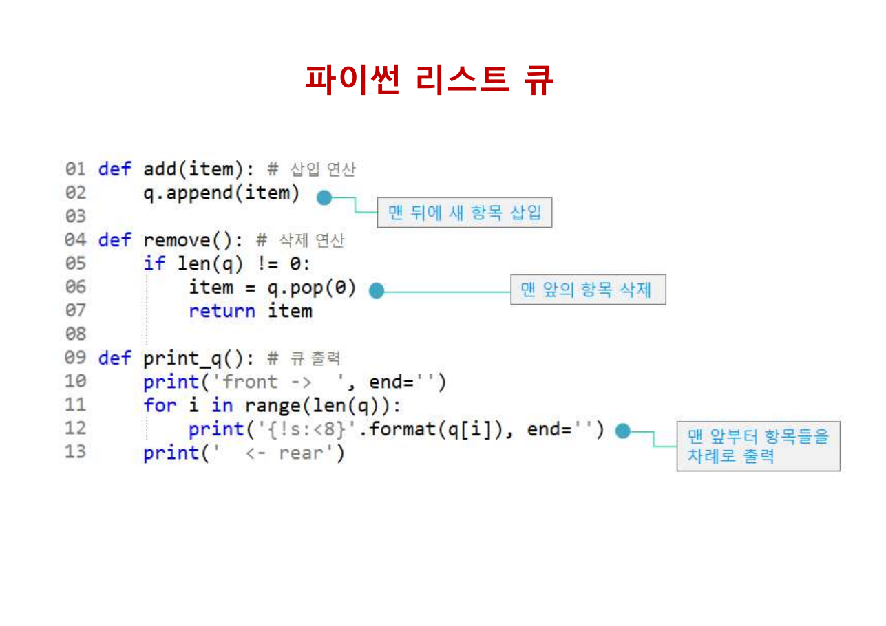
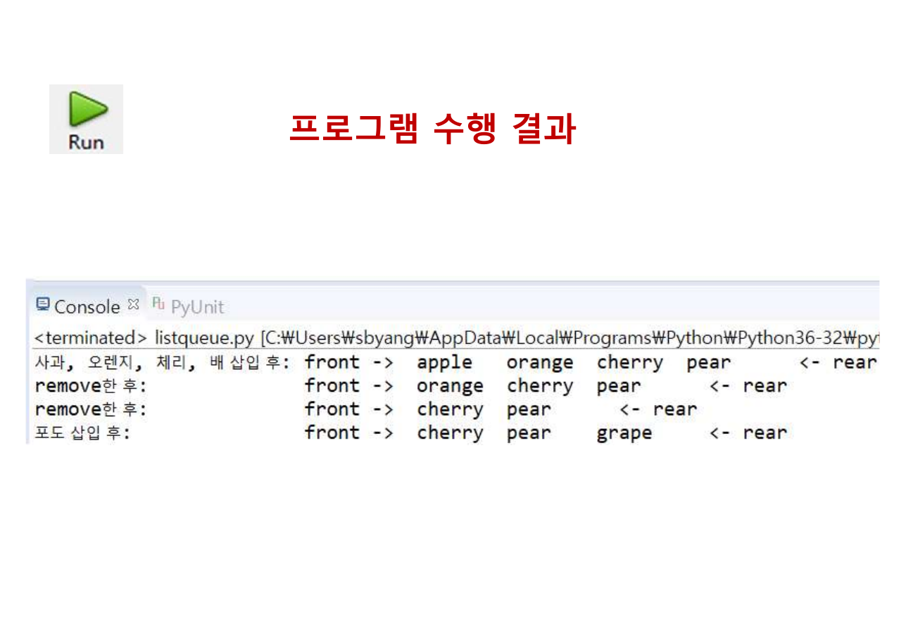
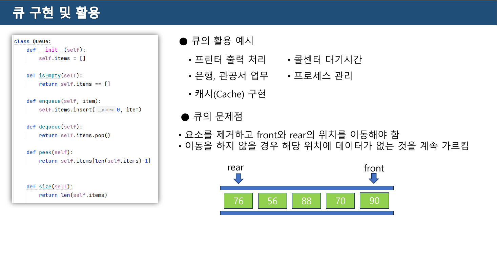
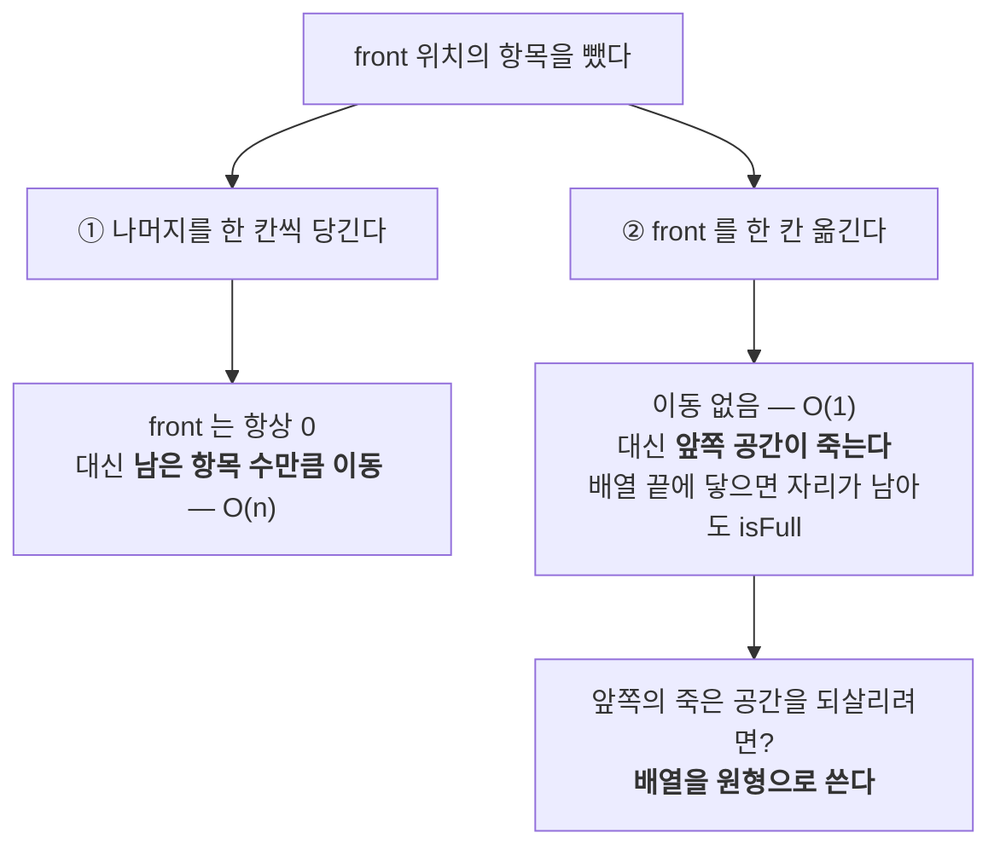
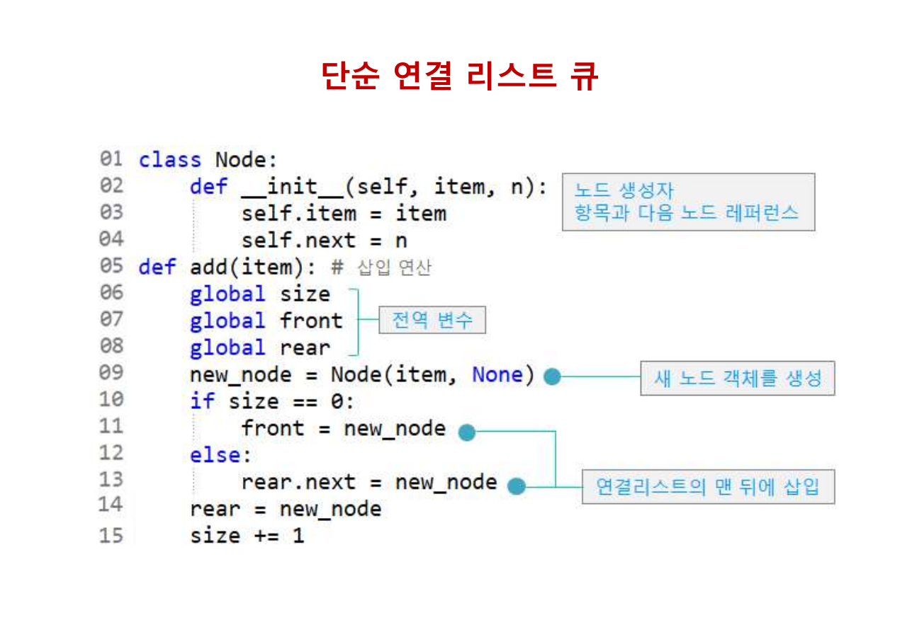
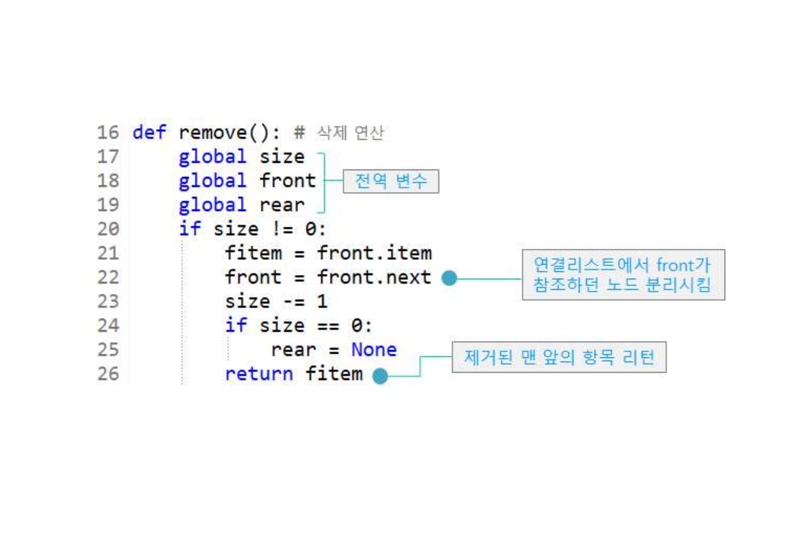
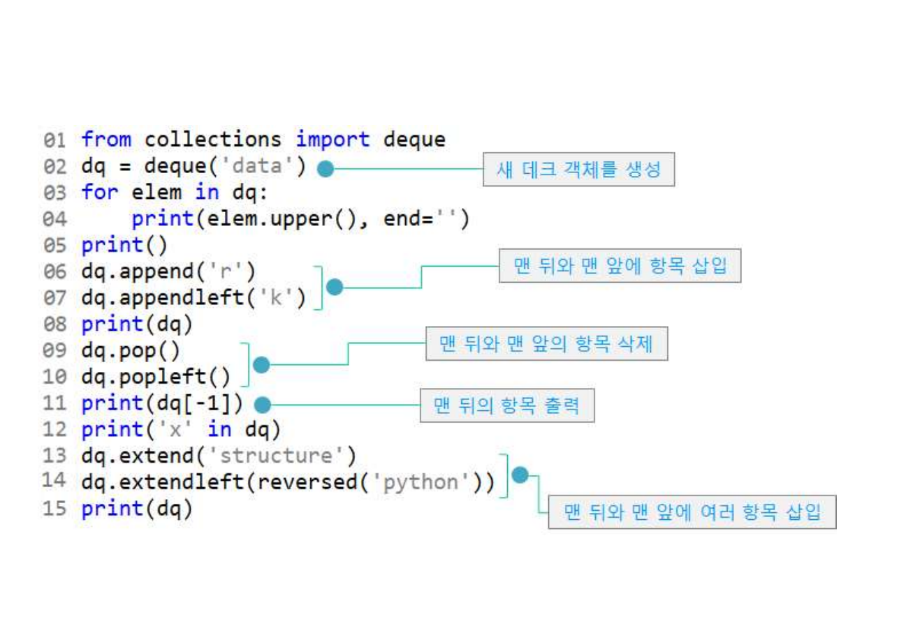
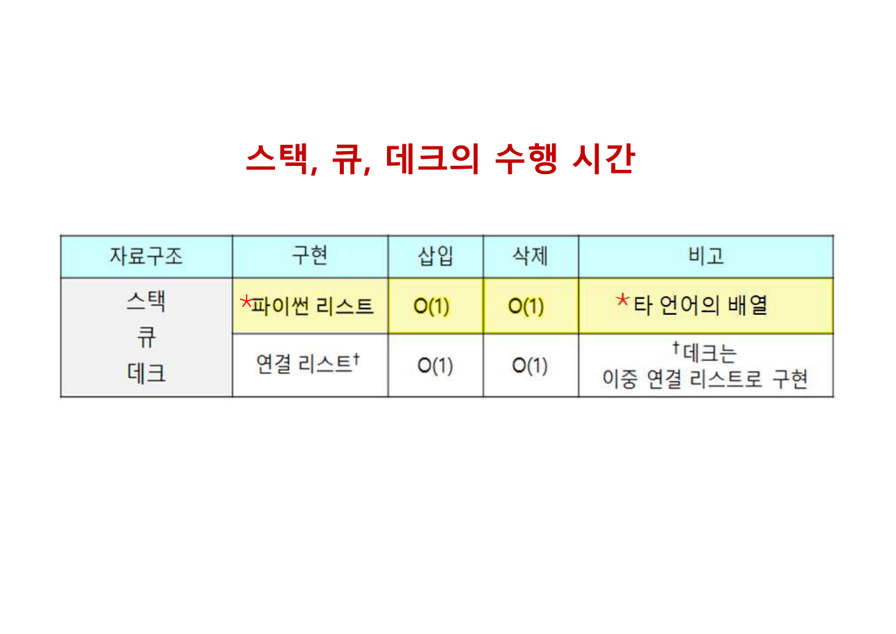
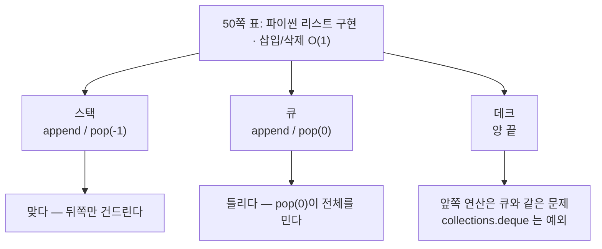

> [!abstract] 두 자료가 같은 코드를 정반대로 평가한다
> 교재 40쪽은 이렇게 적는다 — *"리스트로 구현한 큐의 add와 remove 연산: 각각 **O(1) 시간**"*. 그런데 그 remove의 본체는 32쪽의 `q.pop(0)` 한 줄이다.
>
> 같은 학기 6주차 실습 자료 3쪽은 같은 자리를 **"큐의 문제점"** 이라는 제목 아래 이렇게 적는다 — *"요소를 제거하고 front와 rear의 위치를 이동해야 함"*.
>
> 한쪽은 공짜라 하고 다른 쪽은 문제라 한다. 둘 중 하나는 틀렸다. 이 정리는 그 지점에서 출발한다 — **큐의 어려움은 넣는 쪽이 아니라 빼는 쪽에 있고, 원형 큐와 데크는 전부 그 어려움에 대한 대답**이다.

---

## 1. 스택과 무엇이 다른가

31쪽의 정의는 [04장](./04.%20%EC%8A%A4%ED%83%9D%20%E2%80%94%20%EC%B6%9C%EC%9E%85%EA%B5%AC%EA%B0%80%20%ED%95%98%EB%82%98%EB%9D%BC%EB%8A%94%20%EC%A0%9C%EC%95%BD%EC%9D%B4%20%EB%A7%8C%EB%93%9C%EB%8A%94%20%EA%B2%83.md)의 스택 정의와 한 단어만 다르다.

> 큐(Queue): 삽입과 삭제가 **양 끝에서 각각** 수행되는 자료구조
> 일상생활의 관공서, 은행, 우체국, 병원 등에서 번호표를 이용한 줄서기
> **선입 선출**(First-In First-Out, FIFO)

스택이 "한 쪽 끝에서만"이었다면 큐는 "양 끝에서 각각"이다. 그 한 단어가 데이터의 순서를 완전히 바꾼다.



그리고 이 차이가 [04장 1절](./04.%20%EC%8A%A4%ED%83%9D%20%E2%80%94%20%EC%B6%9C%EC%9E%85%EA%B5%AC%EA%B0%80%20%ED%95%98%EB%82%98%EB%9D%BC%EB%8A%94%20%EC%A0%9C%EC%95%BD%EC%9D%B4%20%EB%A7%8C%EB%93%9C%EB%8A%94%20%EA%B2%83.md)의 철도 측선 문제를 지운다. 스택은 세 개의 입력으로 다섯 가지 출력 순서를 만들 수 있었지만, **큐로는 단 하나**뿐이다 — 들어온 순서 그대로.

| | 스택 | 큐 |
| --- | --- | --- |
| 규약 | LIFO | FIFO |
| 입력 `3 1 2` 로 만들 수 있는 출력 | 5가지 | **1가지** (`3 1 2`) |
| 쓰는 이유 | 순서를 **뒤집기** 위해 | 순서를 **지키기** 위해 |

6주차(큐) 실습 자료 2쪽은 연산 다섯 개의 이름을 정한다. 교재의 `add`/`remove` 보다 일반적인 이름들이다.

| 메소드 | 하는 일 |
| --- | --- |
| `enQueue()` | 큐에 데이터를 넣는다 |
| `deQueue()` | 큐에서 데이터를 빼낸다 |
| `isEmpty()` | 큐가 비어있는지 확인 |
| `isFull()` | 큐가 풀로 차 있는지 확인 |
| `peek()` | 앞에 있는 원소를 삭제하지 않고 반환 |

`isFull()` 이 목록에 있다는 것이 이미 힌트다. **큐를 고정 크기 배열 위에 만들 것**을 전제한 이름이고, 파이썬 리스트로 만들면 나오지 않는 연산이다.

---

## 2. 파이썬 리스트로 만든 큐 — 그리고 `pop(0)`

교재는 스택과 똑같은 방식으로 큐도 두 번 만든다. 먼저 리스트다.



```python
def add(item):                 # 삽입 연산
    q.append(item)             # 맨 뒤에 새 항목 삽입

def remove():                  # 삭제 연산
    if len(q) != 0:
        item = q.pop(0)        # 맨 앞의 항목 삭제
        return item

def print_q():                 # 큐 출력
    print('front -> ', end='')
    for i in range(len(q)):
        print('{!s:<8}'.format(q[i]), end='')   # 맨 앞부터 항목들을 차례로 출력
    print(' <- rear')
```

[04장의 스택](./04.%20%EC%8A%A4%ED%83%9D%20%E2%80%94%20%EC%B6%9C%EC%9E%85%EA%B5%AC%EA%B0%80%20%ED%95%98%EB%82%98%EB%9D%BC%EB%8A%94%20%EC%A0%9C%EC%95%BD%EC%9D%B4%20%EB%A7%8C%EB%93%9C%EB%8A%94%20%EA%B2%83.md)과 비교하면 딱 한 글자가 다르다.

| | 스택(9쪽) | 큐(32쪽) |
| --- | --- | --- |
| 넣기 | `stack.append(item)` | `q.append(item)` |
| 빼기 | `stack.pop(-1)` | `q.pop(**0**)` |

`-1` 이 `0` 으로 바뀌었을 뿐이다. 자료구조로서는 그 한 글자가 LIFO를 FIFO로 바꾼다. 그런데 **비용도 함께 바뀐다.**

33쪽의 사용 코드와 34쪽 출력이다.

```python
q = []
add('apple'); add('orange'); add('cherry'); add('pear')
print('사과, 오렌지, 체리, 배 삽입 후: \t', end=''); print_q()
remove()
print('remove한 후:\t\t', end=''); print_q()
remove()
print('remove한 후:\t\t', end=''); print_q()
add('grape')
print('포도 삽입 후:\t\t', end=''); print_q()
```



```text
사과, 오렌지, 체리, 배 삽입 후: front ->  apple   orange  cherry  pear      <- rear
remove한 후:                   front ->  orange  cherry  pear     <- rear
remove한 후:                   front ->  cherry  pear     <- rear
포도 삽입 후:                   front ->  cherry  pear    grape    <- rear
```

앞에서 둘을 빼고 뒤에 하나를 붙였다. **출력은 조용하지만, 그 두 번의 `pop(0)` 뒤에서 리스트 전체가 한 칸씩 앞으로 밀렸다.**

---

## 3. 실습 자료가 "문제점"이라 부른 것

6주차(큐) 실습 자료 3쪽은 응용 예시를 훑고 나서 곧바로 문제를 지적한다.



> **● 큐의 문제점**
> 요소를 제거하고 front와 rear의 위치를 이동해야 함
> 이동을 하지 않을 경우 해당 위치에 데이터가 없는 것을 계속 가르킴
>
> ```text
>        rear                         front
>          76      56    88    70      90
> ```

그림의 `rear` 와 `front` 가 배열 위에 놓여 있다. 배열 큐에서 항목을 하나 빼면 선택지가 둘이다.



교재 32쪽의 `q.pop(0)` 은 **①번**이다. 파이썬이 알아서 해 주기 때문에 코드에 보이지 않을 뿐, 뒤에서 벌어지는 일은 슬라이드의 "한 칸씩 당기기"와 같다.

> [!caution] 원본 오류 — 리스트 큐의 `remove` 는 O(1)이 아니다
> 교재 40쪽과 50쪽 표는 리스트로 구현한 큐의 삽입·삭제를 모두 **O(1)** 로 적는다. 40쪽의 단서도 크기 조절만 언급한다.
>
> > 리스트로 구현한 큐의 add와 remove 연산: 각각 O(1) 시간
> > \- 리스트 크기를 확대/축소시키는 경우에 큐의 모든 항목을 새 리스트에 복사해야 하므로 O(n) 시간
>
> 그러나 `q.pop(0)` 은 **크기 조절과 무관하게 언제나** 남은 항목 전부를 한 칸씩 옮긴다. 항목이 $n$개면 $n-1$번의 이동이므로 **O(n)** 이다. 스택의 `stack.pop(-1)` 은 맨 뒤를 떼는 것이라 이동이 없어 진짜 O(1)이었고, 교재는 그 서술을 큐에 그대로 옮겨 적은 것으로 보인다.
>
> 결과적으로 리스트 큐에서 $n$개를 전부 빼내면 총 $O(n^2)$ 시간이 든다.

이 주장이 실제로 맞는지 직접 재 보았다.

> [!note] 보충 — 원본에 없는 실측이다
> 파이썬 3.12에서 $n$개를 큐에서 전부 빼내는 데 걸린 시간이다. 세 방식은 각각 리스트의 앞에서 빼기(교재 32쪽), 리스트의 뒤에서 빼기(교재 9쪽의 스택), `collections.deque` 의 앞에서 빼기(교재 45쪽)다.
>
> | $n$ | `list.pop(0)` — 교재의 큐 | `list.pop()` — 교재의 스택 | `deque.popleft()` |
> | --- | --- | --- | --- |
> | 10,000 | 7.9 ms | 0.9 ms | 0.9 ms |
> | 100,000 | 758.5 ms | 7.6 ms | 7.0 ms |
> | 400,000 | **24,248.8 ms** | 30.7 ms | 27.2 ms |
>
> $n$이 4배가 될 때 뒤의 두 열은 4배 가까이 늘지만(선형), 첫 열은 **32배**로 늘었다. $O(n^2)$ 의 모양이다. 40쪽의 O(1) 주장이 성립하지 않는다는 것이 수치로 드러난다.
>
> 이 표는 원본에 없는 보충이며, 측정 환경에 따라 절대값은 달라진다. 중요한 것은 **열 사이의 증가 형태**다.

아래에서 그 이동을 눈으로 볼 수 있다. 항목은 원본 33·34쪽의 값 그대로다.

```html preview
<div id="qs-root">
  <style>
    #qs-root{font-family:system-ui,-apple-system,"Segoe UI",sans-serif;color:var(--foreground);background:var(--card);
      border:1px solid var(--border);border-radius:10px;padding:16px}
    #qs-root h4{margin:0 0 4px;font-size:14px}
    #qs-root .sub{font-size:12px;opacity:.7;margin-bottom:12px}
    #qs-root .bar{display:flex;gap:8px;flex-wrap:wrap;align-items:center;margin-bottom:12px}
    #qs-root button{font:inherit;font-size:12.5px;padding:6px 12px;border-radius:7px;cursor:pointer;
      border:1px solid var(--border);background:transparent;color:var(--foreground)}
    #qs-root button.sel{border-color:var(--chart-1);color:var(--chart-1)}
    #qs-root button:disabled{opacity:.4;cursor:default}
    #qs-root svg{width:100%;height:auto;display:block}
    #qs-root .say{font-size:12.5px;margin-top:10px;line-height:1.65;min-height:3.4em}
    #qs-root .cnt{font-family:ui-monospace,SFMono-Regular,Menlo,monospace;font-size:12.5px;margin-top:8px}
  </style>
  <h4>큐에서 하나 빼면 무슨 일이 벌어지는가</h4>
  <div class="sub">항목은 원본 34쪽의 <code>apple · orange · cherry · pear</code>. 세 가지 방식을 같은 조작으로 비교한다.</div>
  <div class="bar">
    <span id="qs-modes"></span>
    <button id="qs-rm">remove() — 앞에서 빼기</button>
    <button id="qs-add">add('grape') — 뒤에 넣기</button>
    <button id="qs-reset">처음으로</button>
  </div>
  <svg id="qs-svg" viewBox="0 0 700 130" role="img" aria-label="큐의 삭제 방식 비교"></svg>
  <div class="cnt" id="qs-cnt"></div>
  <div class="say" id="qs-say"></div>
</div>
<script>
(function(){
  var INIT=["apple","orange","cherry","pear"];
  var CAP=7;
  var MODES=[
    {k:"shift", label:"① 한 칸씩 당기기 (q.pop(0))"},
    {k:"move",  label:"② front 만 옮기기"},
    {k:"circ",  label:"③ 원형으로 쓰기"}
  ];
  var mode=0, cells, front, rear, moves, extra=0;
  var mb=document.getElementById("qs-modes");
  MODES.forEach(function(M,i){
    var b=document.createElement("button"); b.textContent=M.label; b.style.marginRight="6px";
    b.onclick=function(){ mode=i; reset(); }; mb.appendChild(b);
  });
  document.getElementById("qs-rm").onclick=doRemove;
  document.getElementById("qs-add").onclick=doAdd;
  document.getElementById("qs-reset").onclick=reset;
  function reset(){
    cells=new Array(CAP).fill(null);
    INIT.forEach(function(v,i){ cells[i]=v; });
    front=0; rear=INIT.length-1; moves=0; extra=0; render("");
  }
  function count(){ var n=0; for(var i=0;i<CAP;i++) if(cells[i]) n++; return n; }
  function doRemove(){
    if(count()===0){ render("비어 있다."); return; }
    var M=MODES[mode].k, msg;
    if(M==="shift"){
      var n=count();
      cells[front]=null;
      for(var i=front;i<CAP-1;i++){ cells[i]=cells[i+1]; }
      cells[CAP-1]=null;
      rear--; moves += (n-1);
      msg="앞의 하나를 빼고 <b>남은 "+(n-1)+"개를 한 칸씩 당겼다.</b> 이동 누적 "+moves+"회.";
    } else {
      cells[front]=null;
      front = (M==="circ") ? (front+1)%CAP : front+1;
      msg="앞의 하나를 뺐다. <b>front 만 한 칸 옮겼다 — 이동 0회.</b>"+
          (M==="move" ? " 대신 왼쪽에 <span style='color:var(--chart-3)'>못 쓰는 칸</span>이 생겼다." : " 왼쪽 칸은 나중에 다시 쓴다.");
    }
    render(msg);
  }
  function doAdd(){
    var M=MODES[mode].k, msg;
    if(M==="circ"){
      var nr=(rear+1)%CAP;
      if(cells[nr]){ msg="<span style='color:var(--chart-3)'>가득 찼다.</span>"; render(msg); return; }
      rear=nr; cells[rear]="grape"+(extra?extra:""); extra++;
      msg="뒤에 넣었다. rear 가 배열 끝을 넘어가면 <b>0번 칸으로 돌아온다</b> — 앞쪽의 빈칸이 되살아난다.";
    } else {
      if(rear>=CAP-1){
        msg="<span style='color:var(--chart-3)'>rear 가 배열 끝에 닿아 더 넣을 수 없다 — isFull.</span>"+
            (M==="move"? " 그런데 왼쪽에는 빈칸이 "+front+"개나 있다." : "");
        render(msg); return;
      }
      rear++; cells[rear]="grape"+(extra?extra:""); extra++;
      msg="뒤에 넣었다.";
    }
    render(msg);
  }
  function render(msg){
    Array.prototype.forEach.call(mb.children,function(b,i){ b.classList.toggle("sel",i===mode); });
    var S="", w=94, x0=14, y=44;
    for(var i=0;i<CAP;i++){
      var x=x0+i*w, v=cells[i];
      var dead = (MODES[mode].k==="move" && i<front);
      S+='<rect x="'+x+'" y="'+y+'" width="86" height="38" rx="5" fill="none" stroke="'+
         (v?"var(--chart-1)":(dead?"var(--chart-3)":"var(--border)"))+'" stroke-width="'+(v?1.9:1.1)+'"'+
         (v?"":' stroke-dasharray="4 3"')+'/>';
      if(v){ S+='<text x="'+(x+43)+'" y="'+(y+24)+'" text-anchor="middle" font-size="12" fill="var(--chart-1)">'+v+'</text>'; }
      else if(dead){ S+='<text x="'+(x+43)+'" y="'+(y+24)+'" text-anchor="middle" font-size="11" fill="var(--chart-3)">죽은 칸</text>'; }
      S+='<text x="'+(x+43)+'" y="'+(y+54)+'" text-anchor="middle" font-size="10" fill="var(--border)">'+i+'</text>';
    }
    var fx=x0+(front%CAP)*w+43, rx=x0+((rear+CAP)%CAP)*w+43;
    S+='<text x="'+fx+'" y="'+(y-10)+'" text-anchor="middle" font-size="11.5" fill="var(--chart-2)">front</text>';
    S+='<text x="'+rx+'" y="'+(y-24)+'" text-anchor="middle" font-size="11.5" fill="var(--chart-2)">rear</text>';
    if(MODES[mode].k==="circ"){
      S+='<path d="M'+(x0+CAP*w-8)+' '+(y+46)+' C '+(x0+CAP*w+30)+' '+(y+92)+', '+(x0-30)+' '+(y+92)+', '+(x0+8)+' '+(y+46)+'" fill="none" stroke="var(--chart-2)" stroke-width="1.4" stroke-dasharray="5 4" marker-end="url(#qsA)"/>';
      S+='<defs><marker id="qsA" markerWidth="7" markerHeight="7" refX="6" refY="3" orient="auto"><path d="M0 0 L6 3 L0 6 z" fill="var(--chart-2)"/></marker></defs>';
    }
    document.getElementById("qs-svg").innerHTML=S;
    document.getElementById("qs-cnt").textContent =
      "항목 "+count()+"개   ·   누적 이동 횟수 "+moves+"   ·   방식: "+MODES[mode].label;
    document.getElementById("qs-say").innerHTML = msg ||
      "remove 를 눌러 세 방식의 차이를 비교해 보자. ①은 교재 32쪽의 <code>q.pop(0)</code>, ②는 6주차 3쪽이 지적한 상황, ③이 그 해결책이다.";
  }
  reset();
})();
</script>
```

②를 몇 번 누르고 나서 `add` 를 눌러 보면 6주차 3쪽의 문장이 그대로 재현된다 — **"이동을 하지 않을 경우 해당 위치에 데이터가 없는 것을 계속 가르킴"**. 배열 앞쪽이 텅 비었는데도 뒤가 막혀 더 넣을 수 없다.

③이 그 해결이다. `rear` 가 배열 끝을 넘으면 0으로 되돌아오게 하면(`(rear+1) % 크기`) 죽은 칸이 되살아난다. 이것이 **원형 큐**이고, [02장 41쪽](./02.%20%EB%A6%AC%EC%8A%A4%ED%8A%B8%20%E2%80%94%20%EB%81%9D%EC%9D%84%20%EC%96%B4%EB%96%BB%EA%B2%8C%20%ED%91%9C%EC%8B%9C%ED%95%A0%20%EA%B2%83%EC%9D%B8%EA%B0%80.md)이 원형 연결 리스트의 응용으로 든 *"큐 자료구조 – front, rear 대신 1개의 last로 구현 (Part 3 연습문제)"* 과 같은 발상이다.

> [!note] 원형 큐의 코드는 이 자료들에 없다
> 6주차 3쪽은 문제를 제기하고 끝나고, 교재 Part 3 본문에도 원형 큐 절이 없다(41쪽이 "Part 3 연습문제"로 미룬다). 위 인터랙티브의 ③은 두 자료가 남긴 문제에 대한 **자연스러운 답을 구성한 것**이며, 원본 슬라이드에 그려져 있지는 않다.

---

## 4. 연결 리스트 큐 — `rear` 를 붙잡아 두기

37쪽부터의 두 번째 구현은 이 문제를 다른 방식으로 피한다.



```python
class Node:
    def __init__(self, item, n):
        self.item = item
        self.next = n

def add(item):                     # 삽입 연산
    global size
    global front
    global rear                    # 전역 변수
    new_node = Node(item, None)
    if size == 0:
        front = new_node
    else:
        rear.next = new_node       # 연결리스트의 맨 뒤에 삽입
    rear = new_node
    size += 1
```

여기서 `rear` 를 따로 들고 있는 것이 핵심이다. 그것이 없으면 맨 뒤에 붙이기 위해 매번 처음부터 걸어가야 하고([03장 2절](./03.%20%EC%A7%81%EC%A0%91%20%EC%A7%9C%20%EB%B3%B4%EB%A9%B4%20%EB%8B%AC%EB%9D%BC%EC%A7%80%EB%8A%94%20%EA%B2%83%20%E2%80%94%20%EA%B5%90%EC%88%98%EA%B0%80%20%EB%82%A8%EA%B8%B4%20%EB%8B%A4%EC%84%AF%20%EA%B0%9C%EC%9D%98%20Q.md)의 "마지막 노드 찾아가기"), 삽입이 O(n)이 된다.



```python
def remove():                      # 삭제 연산
    global size
    global front
    global rear
    if size != 0:
        fitem = front.item
        front = front.next         # 연결리스트에서 front가 참조하던 노드 분리시킴
        size -= 1
        if size == 0:
            rear = None
        return fitem               # 제거된 맨 앞의 항목 리턴
```

`if size == 0: rear = None` 이 이 코드에서 가장 신경 쓴 부분이다. 마지막 항목을 빼내면 `front` 는 `None` 이 되지만 `rear` 는 **방금 삭제한 노드를 그대로 가리키고 있다.** 그 상태에서 `add` 를 부르면 `size == 0` 이라 `front` 는 새 노드가 되지만, `rear` 가 죽은 노드를 가리킨 채 남는다. 두 줄이 그것을 막는다.

[02장 `CList.delete`](./02.%20%EB%A6%AC%EC%8A%A4%ED%8A%B8%20%E2%80%94%20%EB%81%9D%EC%9D%84%20%EC%96%B4%EB%96%BB%EA%B2%8C%20%ED%91%9C%EC%8B%9C%ED%95%A0%20%EA%B2%83%EC%9D%B8%EA%B0%80.md)의 `if self.size == 1: self.last = None` 과 정확히 같은 종류의 처리다. **레퍼런스를 두 개 들고 있으면 마지막 하나를 지울 때 반드시 특수 처리가 생긴다.**

38쪽 출력은 34쪽과 **같다**.

```text
사과, 오렌지, 체리, 배 삽입 후: front: apple ->  orange ->  cherry ->  pear  : rear
remove한 후:                   front: orange ->  cherry ->  pear  : rear
remove한 후:                   front: cherry ->  pear  : rear
포도 삽입 후:                   front: cherry ->  pear ->  grape  : rear
```

> [!tip] 스택 때와 달리 두 구현의 출력이 같다
> [04장 2절](./04.%20%EC%8A%A4%ED%83%9D%20%E2%80%94%20%EC%B6%9C%EC%9E%85%EA%B5%AC%EA%B0%80%20%ED%95%98%EB%82%98%EB%9D%BC%EB%8A%94%20%EC%A0%9C%EC%95%BD%EC%9D%B4%20%EB%A7%8C%EB%93%9C%EB%8A%94%20%EA%B2%83.md)에서 리스트 스택과 연결 리스트 스택의 출력은 서로 **역순**이었다. 리스트는 top이 오른쪽 끝, 연결 리스트는 top이 왼쪽 끝이었기 때문이다.
>
> 큐에서는 두 구현 모두 **front가 왼쪽**이다. 리스트에서는 인덱스 0이 front이고, 연결 리스트에서는 `front` 가 첫 노드다. 그래서 출력이 일치한다. 두 자료구조의 "머리"가 어디인지를 비교해 보면 이 차이가 자연스럽다.

40쪽이 정리하는 연결 리스트 큐의 비용은 이번에는 정확하다.

> 단순 연결 리스트 큐의 add와 remove 연산은 각각 O(1) 시간
> \- 삽입 또는 삭제 연산이 **rear 와 front로 인해** 연결 리스트의 다른 노드를 방문할 필요 없음

이유까지 옳게 적혀 있다. 두 레퍼런스를 유지하는 대가로 양 끝을 O(1)에 잡는다.

---

## 5. 데크 — 양쪽 끝을 다 열어 두면

41쪽의 정의는 짧다.

> 데크(Double-ended Queue, Deque): **양쪽 끝에서 삽입과 삭제를 허용**하는 자료구조
> 데크는 스택과 큐 자료구조를 혼합한 자료구조
> 따라서 데크는 **스택과 큐를 동시에 구현**하는데 사용

앞의 두 장을 하나로 합친 셈이다. 한쪽 끝만 쓰면 스택, 양 끝을 넣기/빼기로 나눠 쓰면 큐가 된다.

43쪽이 구현 방식을 정한다.

> \- 데크를 **이중 연결 리스트**로 구현하는 것이 편리
> \- 단순 연결 리스트는 노드의 **이전 노드의 레퍼런스를 알아야 삭제**

두 번째 줄이 이유의 전부다. 데크는 **뒤에서도 삭제**할 수 있어야 하는데, 단순 연결 리스트에서 마지막 노드를 지우려면 그 앞 노드를 알아야 한다. `rear` 를 붙잡고 있어도 소용없다 — `rear` 에서 이전 노드로 갈 방법이 없기 때문이다([03장 Q2](./03.%20%EC%A7%81%EC%A0%91%20%EC%A7%9C%20%EB%B3%B4%EB%A9%B4%20%EB%8B%AC%EB%9D%BC%EC%A7%80%EB%8A%94%20%EA%B2%83%20%E2%80%94%20%EA%B5%90%EC%88%98%EA%B0%80%20%EB%82%A8%EA%B8%B4%20%EB%8B%A4%EC%84%AF%20%EA%B0%9C%EC%9D%98%20Q.md)). [02장 28쪽](./02.%20%EB%A6%AC%EC%8A%A4%ED%8A%B8%20%E2%80%94%20%EB%81%9D%EC%9D%84%20%EC%96%B4%EB%96%BB%EA%B2%8C%20%ED%91%9C%EC%8B%9C%ED%95%A0%20%EA%B2%83%EC%9D%B8%EA%B0%80.md)이 이중 연결 리스트의 응용에 "데크 자료구조"를 넣어 둔 것이 여기서 회수된다.

44쪽은 구현을 만들지 않고 표준 라이브러리로 넘긴다.

> \- 파이썬에는 데크가 **Collections 패키지**에 정의되어 있음
> \- 삽입, 삭제 등의 연산은 파이썬의 리스트의 연산과 매우 유사



```python
from collections import deque
dq = deque('data')                    # 새 데크 객체를 생성
for elem in dq:
    print(elem.upper(), end='')
print()
dq.append('r')                        # 맨 뒤와
dq.appendleft('k')                    #        맨 앞에 항목 삽입
print(dq)
dq.pop()                              # 맨 뒤와
dq.popleft()                          #        맨 앞의 항목 삭제
print(dq[-1])                         # 맨 뒤의 항목 출력
print('x' in dq)
dq.extend('structure')                # 맨 뒤와
dq.extendleft(reversed('python'))     #        맨 앞에 여러 항목 삽입
print(dq)
```

46쪽 출력은 이렇다. 직접 실행해 한 글자까지 대조했고 전부 일치한다.

```text
DATA
deque(['k', 'd', 'a', 't', 'a', 'r'])
a
False
deque(['p', 'y', 't', 'h', 'o', 'n', 'd', 'a', 't', 'a', 's', 't', 'r', 'u', 'c', 't', 'u', 'r', 'e'])
```

읽을 때 걸리는 곳이 두 군데다.

| 줄 | 왜 그렇게 되는가 |
| --- | --- |
| `deque('data')` | 문자열을 넘기면 **글자 하나하나가 항목**이 된다. `['d','a','t','a']` |
| `print(dq[-1])` → `a` | 직전에 `pop()`(r 제거)과 `popleft()`(k 제거)를 했으므로 남은 것은 `['d','a','t','a']`, 맨 뒤는 `a` |
| `print('x' in dq)` → `False` | `'data'` 에 `x` 는 없다 |
| `extendleft(reversed('python'))` | `extendleft` 는 **하나씩 앞에 붙이므로 순서가 뒤집힌다.** 그래서 미리 `reversed` 로 뒤집어 넣어야 `python` 이 제 순서로 들어간다 |

마지막 줄이 이 프로그램에서 가장 배울 만한 곳이다. `extendleft('python')` 이라고만 썼다면 `nohtyp` 이 앞에 붙었을 것이다.

47쪽이 대가를 적는다.

> \- 데크를 배열이나 이중 연결 리스트로 구현한 경우, 스택과 큐의 수행 시간과 동일
> \- **양 끝에서 삽입과 삭제가 가능하므로 프로그램이 다소 복잡**
> \- 이중 연결 리스트로 구현한 경우는 더 복잡함

성능은 같고 코드만 복잡해진다 — 그래서 44쪽이 직접 만들지 않고 표준 라이브러리를 쓴 것이다.

---

## 6. 50쪽의 표를 다시 읽기



| 자료구조 | 구현 | 삽입 | 삭제 | 비고 |
| --- | --- | --- | --- | --- |
| 스택 · 큐 · 데크 | ★파이썬 리스트 | O(1) | O(1) | ★타 언어의 배열 |
| 스택 · 큐 · 데크 | 연결 리스트† | O(1) | O(1) | †데크는 이중 연결 리스트로 구현 |

세 자료구조를 한 칸에 묶어 놓은 표다. [02장 44쪽 표](./02.%20%EB%A6%AC%EC%8A%A4%ED%8A%B8%20%E2%80%94%20%EB%81%9D%EC%9D%84%20%EC%96%B4%EB%96%BB%EA%B2%8C%20%ED%91%9C%EC%8B%9C%ED%95%A0%20%EA%B2%83%EC%9D%B8%EA%B0%80.md)가 세 연결 리스트를 한 칸에 묶었던 것과 같은 형식이고, 같은 함정을 갖고 있다 — **묶여 있다고 해서 같은 것은 아니다.**

3절에서 본 대로 첫 행의 "큐 · 삭제 · O(1)"은 성립하지 않는다. 스택은 맞고, 큐는 틀리고, 데크는 파이썬 리스트로 만들면 앞쪽 연산에서 역시 틀린다(`collections.deque` 는 별개의 자료구조라 맞는다).



40쪽·50쪽의 각주(★타 언어의 배열)가 말하듯 이 표는 **파이썬 리스트를 다른 언어의 배열과 같은 것으로 취급**한다. 그 전제 아래에서도 인덱스 0의 삭제는 O(n)이므로, 각주가 오류를 덮어 주지는 않는다.

---

## 7. 큐가 실제로 쓰이는 곳

39쪽의 목록은 [04장 24쪽](./04.%20%EC%8A%A4%ED%83%9D%20%E2%80%94%20%EC%B6%9C%EC%9E%85%EA%B5%AC%EA%B0%80%20%ED%95%98%EB%82%98%EB%9D%BC%EB%8A%94%20%EC%A0%9C%EC%95%BD%EC%9D%B4%20%EB%A7%8C%EB%93%9C%EB%8A%94%20%EA%B2%83.md)의 스택 응용 목록과 짝을 이룬다. 시험에서 둘을 갈라 묻는다.

| 큐의 응용 (39쪽) | 왜 큐인가 |
| --- | --- |
| CPU의 태스크 스케줄링 | 먼저 요청한 작업이 먼저 |
| 네트워크 프린터 | 먼저 누른 문서가 먼저 |
| 실시간 시스템의 인터럽트 처리 | 도착 순서 보존 |
| **이벤트 구동 방식 컴퓨터 시뮬레이션** | 사건이 일어난 시각 순서 |
| 콜 센터의 전화 서비스 처리 | 대기 순서 |
| **이진 트리의 레벨 순회**(Part 4) | [07장](./07.%20%ED%8A%B8%EB%A6%AC%20%E2%80%94%20%EC%9E%90%EC%8B%9D%EC%9D%B4%20%EB%91%98%EC%9D%84%20%EB%84%98%EC%9C%BC%EB%A9%B4%20%EA%B0%90%EB%8B%B9%EC%9D%B4%20%EC%95%88%20%EB%90%9C%EB%8B%A4.md)에서 실제로 쓴다 |
| 그래프의 너비 우선 탐색(BFS) | 가까운 것부터 |

6주차(큐) 3쪽도 비슷한 목록을 든다 — 프린터 출력 처리 · 콜센터 대기시간 · 은행, 관공서 업무 · 프로세스 관리 · **캐시(Cache) 구현**.

42쪽의 데크 응용은 결이 다르다.

> 스크롤(Scroll) · 문서 편집기 등의 undo 연산 · 웹 브라우저의 방문 기록 등
> \- 웹 브라우저 방문 기록의 경우, 최근 방문한 웹 페이지 주소는 **앞에 삽입**하고, 일정 수의 새 주소들이 앞쪽에서 삽입되면 **뒤에서 삭제**가 수행

이것이 데크가 필요한 정확한 이유다. **넣는 쪽과 버리는 쪽이 다르지만, 꺼내 쓰는 쪽은 넣는 쪽과 같다.** 최근 기록은 앞에서 꺼내 쓰고(스택처럼), 오래된 기록은 뒤에서 버린다(큐처럼). 스택만으로도 큐만으로도 안 된다.

[04장 6절](./04.%20%EC%8A%A4%ED%83%9D%20%E2%80%94%20%EC%B6%9C%EC%9E%85%EA%B5%AC%EA%B0%80%20%ED%95%98%EB%82%98%EB%9D%BC%EB%8A%94%20%EC%A0%9C%EC%95%BD%EC%9D%B4%20%EB%A7%8C%EB%93%9C%EB%8A%94%20%EA%B2%83.md)의 실습 과제(웹 주소 5개를 스택에 push하고 ← 키로 pop)가 스택이었던 것과 비교하면, 42쪽은 그 과제에 "기록 개수 제한"을 붙였을 때 무엇이 필요해지는지를 말하고 있다.

---

## 8. 2차 과제

6주차(큐) 자료 4쪽이 이 학기의 두 번째 과제다.

> ▣ **단순연결리스트로 큐 클래스를 완성**하세요. 큐 클래스를 활용한 큐 실행화면을 출력하세요.
>
> \- 과제 4월 29일(월) 까지 제출 / 제출방법 : `swcberet@naver.com`
> \- [메일제목] `학번_성명_데이터구조_2차과제` / [파일명] 같음
> \- 과제에 포함해야 할 내용: 전체 코드, 실제 동작결과 캡처

"**클래스**로"라는 조건이 붙어 있다. 교재 35·36쪽의 코드는 `global front`, `global rear`, `global size` 를 쓰는 전역 함수 방식이라 **큐를 하나밖에 만들 수 없다.** 클래스로 바꾸면 `self.front`, `self.rear`, `self.size` 가 되고 `global` 선언이 전부 사라진다.

[04장의 `stack_list`](./04.%20%EC%8A%A4%ED%83%9D%20%E2%80%94%20%EC%B6%9C%EC%9E%85%EA%B5%AC%EA%B0%80%20%ED%95%98%EB%82%98%EB%9D%BC%EB%8A%94%20%EC%A0%9C%EC%95%BD%EC%9D%B4%20%EB%A7%8C%EB%93%9C%EB%8A%94%20%EA%B2%83.md)이 같은 변환을 스택에 대해 이미 보여 주었으므로, 그 형태를 따라 2쪽의 다섯 메소드(`enQueue` · `deQueue` · `isEmpty` · `isFull` · `peek`)를 채우면 된다. 연결 리스트 구현에서는 `isFull()` 이 늘 `False` 라는 점만 짚어 두면 된다 — 크기 제한이 없기 때문이다.

---

## 9. 예상문제

중간고사 예상문제 17~20번이 이 장 범위다.

| 문항 | 답과 근거 |
| --- | --- |
| 17. 큐 설명 중 옳지 않은 것 | **④ 후입 선출 자료 구조이다** — 31쪽은 선입 선출(FIFO). 후입 선출은 스택 |
| 18. 연결 리스트 큐에서 새 항목을 삽입하면 갱신되는 레퍼런스 | **③ front와 rear** — 35쪽 `add` 를 보면 `rear = new_node` 는 언제나, `front = new_node` 는 `size == 0` 일 때 실행된다. 첫 삽입에서는 둘 다 바뀐다 |
| 19. 큐의 응용과 거리가 먼 것 | **④ 순환 호출 처리** — [04장 24쪽](./04.%20%EC%8A%A4%ED%83%9D%20%E2%80%94%20%EC%B6%9C%EC%9E%85%EA%B5%AC%EA%B0%80%20%ED%95%98%EB%82%98%EB%9D%BC%EB%8A%94%20%EC%A0%9C%EC%95%BD%EC%9D%B4%20%EB%A7%8C%EB%93%9C%EB%8A%94%20%EA%B2%83.md)의 스택 응용이다. 나머지 셋은 39쪽 목록 그대로 |
| 20. 큐의 운용과 유사하지 **않은** 것 | **④ 웹 브라우저의 '이전 페이지로 돌아가기'** — 42쪽·5주차(스택) 2쪽 모두 이것을 스택(또는 데크)의 예로 든다 |

> [!tip] 18번은 답이 갈릴 수 있다
> "새 항목을 삽입하면 어떤 레퍼런스가 갱신되는가"를 **일반적인 삽입**으로 읽으면 `rear` 만 바뀌므로 ②가 되고, **첫 삽입을 포함**해 읽으면 ③이 된다. 35쪽 코드의 `if size == 0: front = new_node` 가 있으니 ③이 더 정확한 답이지만, 문제 의도가 "빈 큐가 아닌 경우"라면 ②다. 시험장에서는 보기 중 더 포괄적인 쪽을 고르는 편이 안전하다.

---

## 다른 장과의 연결

- 반대 규약(후입 선출)과 그 두 구현 — [04. 스택](./04.%20%EC%8A%A4%ED%83%9D%20%E2%80%94%20%EC%B6%9C%EC%9E%85%EA%B5%AC%EA%B0%80%20%ED%95%98%EB%82%98%EB%9D%BC%EB%8A%94%20%EC%A0%9C%EC%95%BD%EC%9D%B4%20%EB%A7%8C%EB%93%9C%EB%8A%94%20%EA%B2%83.md)
- 데크를 이중 연결 리스트로 만드는 근거 / 원형 큐의 뿌리 — [02. 리스트](./02.%20%EB%A6%AC%EC%8A%A4%ED%8A%B8%20%E2%80%94%20%EB%81%9D%EC%9D%84%20%EC%96%B4%EB%96%BB%EA%B2%8C%20%ED%91%9C%EC%8B%9C%ED%95%A0%20%EA%B2%83%EC%9D%B8%EA%B0%80.md)
- 큐를 실제로 쓰는 곳 — [07. 트리](./07.%20%ED%8A%B8%EB%A6%AC%20%E2%80%94%20%EC%9E%90%EC%8B%9D%EC%9D%B4%20%EB%91%98%EC%9D%84%20%EB%84%98%EC%9C%BC%EB%A9%B4%20%EA%B0%90%EB%8B%B9%EC%9D%B4%20%EC%95%88%20%EB%90%9C%EB%8B%A4.md)의 레벨 순회, [09장 기수 정렬](./09.%20%EC%A0%95%EB%A0%AC%20%E2%91%A0%20%E2%80%94%20%ED%95%9C%20%ED%9A%8C%EC%A0%84%EC%9D%B4%20%EB%AC%B4%EC%97%87%EC%9D%84%20%ED%99%95%EC%A0%95%ED%95%98%EB%8A%94%EA%B0%80.md)의 버킷
- 클래스로 바꾸는 방법 — [03. 직접 짜 보면 달라지는 것](./03.%20%EC%A7%81%EC%A0%91%20%EC%A7%9C%20%EB%B3%B4%EB%A9%B4%20%EB%8B%AC%EB%9D%BC%EC%A7%80%EB%8A%94%20%EA%B2%83%20%E2%80%94%20%EA%B5%90%EC%88%98%EA%B0%80%20%EB%82%A8%EA%B8%B4%20%EB%8B%A4%EC%84%AF%20%EA%B0%9C%EC%9D%98%20Q.md)

---

## 근거 자료

| 원본 | 쪽 | 내용 | 이 문서에서 쓰인 곳 |
| --- | --- | --- | --- |
| 스택과 큐 | 31 | 큐의 정의 · FIFO | 1절 |
| 스택과 큐 | **32** | `listqueue.py` — `q.pop(0)` | 2절 · 인용 · **원본 오류의 근원** |
| 스택과 큐 | 33 · **34** | 사용 코드와 수행 결과 | 2절 · 인용 |
| 스택과 큐 | **35 · 36** | `linkedqueue.py` (36쪽 텍스트 0자) | 4절 · 인용 2장 |
| 스택과 큐 | 37 · 38 | 사용 코드와 수행 결과 | 4절 |
| 스택과 큐 | 39 | 큐 자료구조의 응용 | 7절 |
| 스택과 큐 | 40 | 두 구현의 수행 시간 | 3절 · **원본 오류** |
| 스택과 큐 | 41 · 42 | 데크의 정의와 응용 | 5절 · 7절 |
| 스택과 큐 | 43 · 44 | 이중 연결 리스트 구현 / `collections` | 5절 |
| 스택과 큐 | **45 · 46** | `deque.py` 와 수행 결과 (45쪽 텍스트 0자) | 5절 · 인용 |
| 스택과 큐 | 47 | 데크의 수행 시간 | 5절 |
| 스택과 큐 | 48 · 49 | 요약 | — |
| 스택과 큐 | **50** | 스택·큐·데크 수행 시간 표 | 6절 · 인용 · **원본 오류** |
| 6주차(큐) | 2 | 다섯 메소드의 이름 | 1절 · 8절 |
| 6주차(큐) | **3** | 활용 예시와 **큐의 문제점** | 3절 · 인용 |
| 6주차(큐) | 4 | 2차 과제 | 8절 |
| 중간고사 예상문제 | 3 | 문항 17~20 | 9절 |

- 45쪽 프로그램은 직접 실행해 46쪽 출력과 한 글자까지 대조했고 전부 일치했다
- 3절의 실측 표는 **원본에 없는 보충**이며, 40·50쪽의 O(1) 주장을 검증하기 위해 측정한 것이다
- 텍스트 0자 페이지: 스택과 큐 **36 · 45쪽** — 각각 연결 리스트 큐의 `remove` 와 데크 예제 프로그램이다
