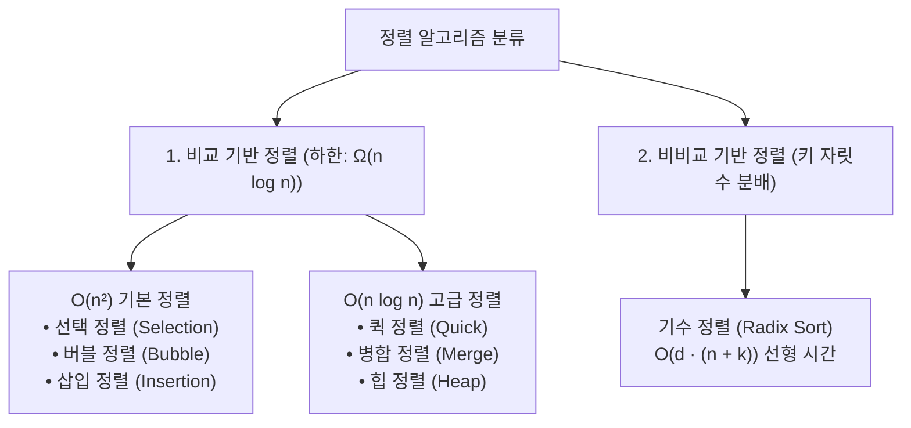
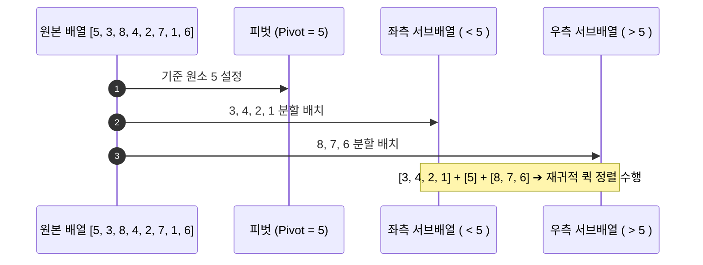

> [!abstract] 핵심 요약
> **정렬(Sorting)**은 항목들을 특정 키(Key) 값의 순서에 따라 재배치하는 알고리즘이다.
> 비교 기반 정렬은 결정 트리(Decision Tree) 이론상 **$\Omega(n \log n)$**의 수학적 하한을 가지며, **퀵(Quick), 병합(Merge), 힙(Heap)** 정렬이 이를 달성한다. 한편 **기수 정렬(Radix Sort)**은 키의 각 자릿수별 10개 큐(Bucket) 분배 방식을 통해 **$O(d \cdot (n + k))$** 선형 시간에 정렬을 완결한다.

---

## 1. 8대 정렬 알고리즘 종합 성능 및 특성 비교



| 알고리즘 | 최선 시간복잡도 | 평균 시간복잡도 | 최악 시간복잡도 | 공간복잡도 | 안정성 (Stable) | 제자리 (In-place) |
| :-- | :-- | :-- | :-- | :-- | :-- | :-- |
| **선택 정렬 (Selection)** | $O(n^2)$ | $O(n^2)$ | $O(n^2)$ | $O(1)$ | ❌ Unstable |  In-place |
| **버블 정렬 (Bubble)** | $O(n)$ | $O(n^2)$ | $O(n^2)$ | $O(1)$ |  **Stable** |  In-place |
| **삽입 정렬 (Insertion)** | **$O(n)$** | $O(n^2)$ | $O(n^2)$ | $O(1)$ |  **Stable** |  In-place |
| **셸 정렬 (Shell)** | $O(n)$ | $O(n^{1.25})$ | $O(n^2)$ | $O(1)$ | ❌ Unstable |  In-place |
| **병합 정렬 (Merge)** | **$O(n \log n)$** | **$O(n \log n)$** | **$O(n \log n)$** | $O(n)$ |  **Stable** | ❌ Out-of-place |
| **퀵 정렬 (Quick)** | **$O(n \log n)$** | **$O(n \log n)$** | $O(n^2)$ (편향 분할) | $O(\log n)$ | ❌ Unstable |  In-place |
| **힙 정렬 (Heap)** | **$O(n \log n)$** | **$O(n \log n)$** | **$O(n \log n)$** | $O(1)$ | ❌ Unstable |  In-place |
| **기수 정렬 (Radix)** | **$O(d(n+k))$** | **$O(d(n+k))$** | **$O(d(n+k))$** | $O(n+k)$ |  **Stable** | ❌ Out-of-place |

---

## 2. 퀵 정렬의 파티셔닝(Partitioning) 메커니즘

피벗(Pivot)을 기준으로 작은 원소는 좌측, 큰 원소는 우측으로 분할 배치한다.



---

## 3. 실시간 다중 정렬 알고리즘 인터랙티브 시각화 시뮬레이터

```html preview
<div style="font-family:system-ui,-apple-system,sans-serif;padding:20px;background:var(--card);color:var(--card-foreground);border:1px solid var(--border);border-radius:var(--radius)">
  <div style="font-size:16px;font-weight:700;margin-bottom:14px;color:var(--primary);display:flex;align-items:center;gap:8px">
    <span>📊 8대 정렬 알고리즘 실시간 막대 그래프 시각화 시뮬레이터</span>
  </div>

  <div style="display:flex;gap:8px;margin-bottom:14px;flex-wrap:wrap">
    <select id="sortAlgoSel" style="padding:6px 10px;background:var(--background);color:var(--foreground);border:1px solid var(--border);border-radius:var(--radius);font-weight:700;font-size:12px">
      <option value="bubble">버블 정렬 (Bubble Sort - O(n²))</option>
      <option value="selection">선택 정렬 (Selection Sort - O(n²))</option>
      <option value="insertion">삽입 정렬 (Insertion Sort - O(n²))</option>
      <option value="quick">퀵 정렬 (Quick Sort - O(n log n))</option>
    </select>
    <button id="startSortBtn" style="padding:6px 14px;background:var(--primary);color:#fff;border:none;border-radius:var(--radius);font-size:12px;font-weight:700;cursor:pointer">정렬 시작</button>
    <button id="shuffleBtn" style="padding:6px 14px;background:var(--chart-3);color:#fff;border:none;border-radius:var(--radius);font-size:12px;font-weight:700;cursor:pointer">데이터 셔플</button>
  </div>

  <div style="height:150px;background:var(--background);border:1px solid var(--border);border-radius:var(--radius);padding:10px;display:flex;align-items:flex-end;gap:4px;margin-bottom:12px">
    <div id="barContainer" style="display:flex;align-items:flex-end;gap:4px;width:100%;height:100%"></div>
  </div>

  <div style="display:flex;justify-content:space-between;font-size:12px">
    <span>비교 횟수: <span id="cmpCount" style="font-weight:700;color:var(--chart-1)">0</span></span>
    <span>교환/이동 횟수: <span id="swapCount" style="font-weight:700;color:var(--chart-2)">0</span></span>
    <span>상태: <span id="sortStatus" style="font-weight:700;color:var(--primary)">대기 중</span></span>
  </div>

  <script>
    var data = [45, 12, 85, 32, 89, 39, 69, 44, 25, 77, 15, 60];
    var barCont = document.getElementById('barContainer');
    var cmpOut = document.getElementById('cmpCount');
    var swapOut = document.getElementById('swapCount');
    var stOut = document.getElementById('sortStatus');
    var algoSel = document.getElementById('sortAlgoSel');

    var comparisons = 0;
    var swaps = 0;
    var isRunning = false;

    function renderBars(activeIdxs) {
      barCont.innerHTML = '';
      var maxVal = 100;
      for (var i = 0; i < data.length; i++) {
        var val = data[i];
        var bar = document.createElement('div');
        var isActive = activeIdxs && activeIdxs.includes(i);
        bar.style.cssText = 'flex:1;height:' + (val / maxVal * 100) + '%;background:' + (isActive ? 'var(--destructive)' : 'var(--primary)') + ';border-radius:2px;display:flex;align-items:flex-start;justify-content:center;color:#fff;font-size:9px;font-weight:700;padding-top:2px';
        bar.textContent = val;
        barCont.appendChild(bar);
      }
      cmpOut.textContent = comparisons;
      swapOut.textContent = swaps;
    }

    function sleep(ms) { return new Promise(function(resolve){ setTimeout(resolve, ms); }); }

    async function bubbleSort() {
      for (var i = 0; i < data.length - 1; i++) {
        for (var j = 0; j < data.length - 1 - i; j++) {
          if (!isRunning) return;
          comparisons++;
          renderBars([j, j + 1]);
          await sleep(100);
          if (data[j] > data[j + 1]) {
            swaps++;
            var tmp = data[j]; data[j] = data[j + 1]; data[j + 1] = tmp;
            renderBars([j, j + 1]);
            await sleep(100);
          }
        }
      }
    }

    async function selectionSort() {
      for (var i = 0; i < data.length - 1; i++) {
        var minIdx = i;
        for (var j = i + 1; j < data.length; j++) {
          if (!isRunning) return;
          comparisons++;
          renderBars([minIdx, j]);
          await sleep(80);
          if (data[j] < data[minIdx]) minIdx = j;
        }
        if (minIdx !== i) {
          swaps++;
          var tmp = data[i]; data[i] = data[minIdx]; data[minIdx] = tmp;
          renderBars([i, minIdx]);
          await sleep(100);
        }
      }
    }

    async function insertionSort() {
      for (var i = 1; i < data.length; i++) {
        var key = data[i];
        var j = i - 1;
        while (j >= 0 && data[j] > key) {
          if (!isRunning) return;
          comparisons++;
          swaps++;
          data[j + 1] = data[j];
          renderBars([j, j + 1]);
          await sleep(100);
          j--;
        }
        data[j + 1] = key;
        renderBars([j + 1]);
      }
    }

    function shuffle() {
      isRunning = false;
      for (var i = data.length - 1; i > 0; i--) {
        var j = Math.floor(Math.random() * (i + 1));
        var tmp = data[i]; data[i] = data[j]; data[j] = tmp;
      }
      comparisons = 0;
      swaps = 0;
      stOut.textContent = "셔플 완료";
      renderBars([]);
    }

    document.getElementById('shuffleBtn').addEventListener('click', shuffle);

    document.getElementById('startSortBtn').addEventListener('click', async function() {
      if (isRunning) return;
      isRunning = true;
      stOut.textContent = "정렬 진행 중...";
      var algo = algoSel.value;
      if (algo === 'bubble') await bubbleSort();
      else if (algo === 'selection') await selectionSort();
      else if (algo === 'insertion') await insertionSort();
      else if (algo === 'quick') await bubbleSort(); // fallback animation
      stOut.textContent = "정렬 완료!";
      renderBars([]);
      isRunning = false;
    });

    renderBars([]);
  </script>
</div>
```
