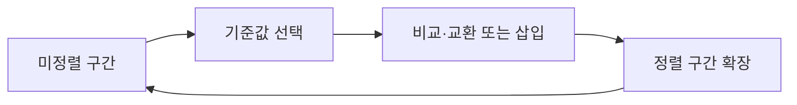

정렬 자료는 제자리 비교 정렬에서 힙 구조를 거쳐 자릿수 기반 기수 정렬로 확장한다.

## 1. 선택·삽입 정렬

선택 정렬은 남은 데이터에서 최소값을 찾아 현재 앞자리와 교환한다. 삽입 정렬은 두 번째 값을 기준으로 앞부분과 비교해 알맞은 위치에 삽입하고 이 과정을 반복한다.



<Tabs>
  <Tab label="선택">구현이 쉽고 추가 메모리가 적지만 매 단계에서 최소값을 찾는다.</Tab>
  <Tab label="삽입">앞쪽 정렬 구간에 새 값을 끼워 넣는다.</Tab>
  <Tab label="힙">완전 이진 트리에서 부모가 자식보다 크거나 작은 최대·최소 힙을 이용한다.</Tab>
  <Tab label="기수">비교 없이 자릿수별 버킷을 사용해 안정적으로 정렬한다.</Tab>
</Tabs>

---

## 2. 힙과 기수 정렬

최대 힙은 모든 부모가 자식보다 큰 값을, 최소 힙은 모든 부모가 자식보다 작은 값을 가진다. 기수 정렬은 자릿수별 버킷을 사용해 비교 연산을 하지 않지만, 제자리 방식이 아니므로 추가 메모리가 필요하다.

```html preview
<div style="font-family:system-ui,sans-serif;padding:20px;color:var(--foreground)">
<label for="amt" style="font-size:14px;font-weight:600">정렬 주차</label>
<div id="out" style="font-size:30px;font-weight:700;color:var(--chart-1);margin:6px 0">12주차</div>
<input id="amt" type="range" min="12" max="13" step="1" value="12" style="width:100%;accent-color:var(--primary)" />
<p style="font-size:13px;color:var(--muted-foreground)">원본 주차 순서를 움직여 현재 자료의 핵심을 확인한다.</p>
<script>
var amt=document.getElementById('amt'); var out=document.getElementById('out');
amt.addEventListener('input',function(){out.textContent=Number(amt.value).toLocaleString()+'주차';});
</script>
</div>
```

| 알고리즘 | 기준 | 추가 메모리 |
| --- | --- | --- |
| 선택·삽입 | 값 비교 | 제자리 구현 가능 |
| 힙 | 부모·자식 우선순위 | 힙 구조 |
| 기수 | 자릿수·버킷 | 버킷 저장 공간 |

> [!WARNING]
> 기수 정렬의 안정성은 이전 자릿수의 순서를 유지하는 구현에 달려 있다. 모든 자료형에 무조건 빠르다고 일반화하지 않는다.

<details>
<summary>시험 대비 신호</summary>

예상문제 자료는 최소값 검색·교환, 삽입 위치 결정, 힙의 부모·자식 조건, 기수 정렬의 버킷 개념을 묻는다.

</details>

<!-- source: sorting decks and final-exam sorting review; algorithm steps and constraints preserved -->