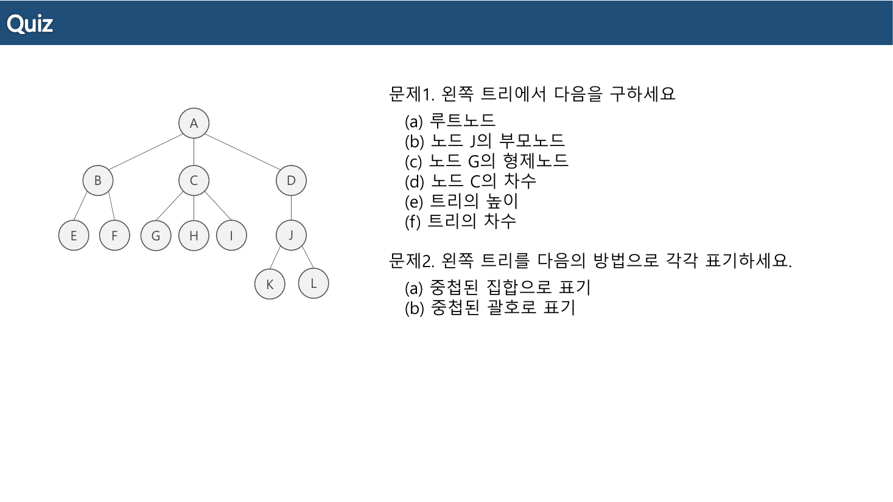
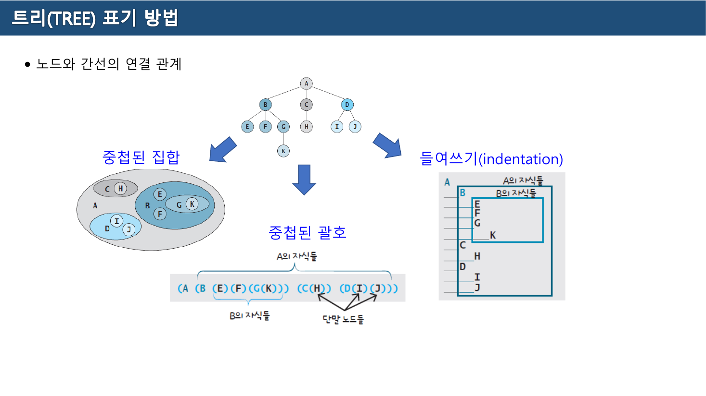
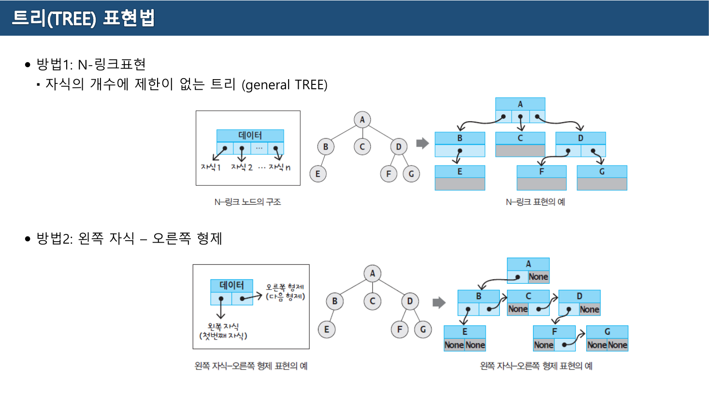
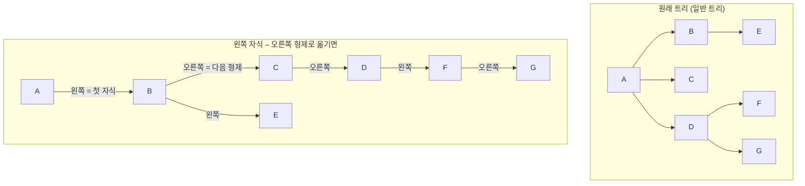
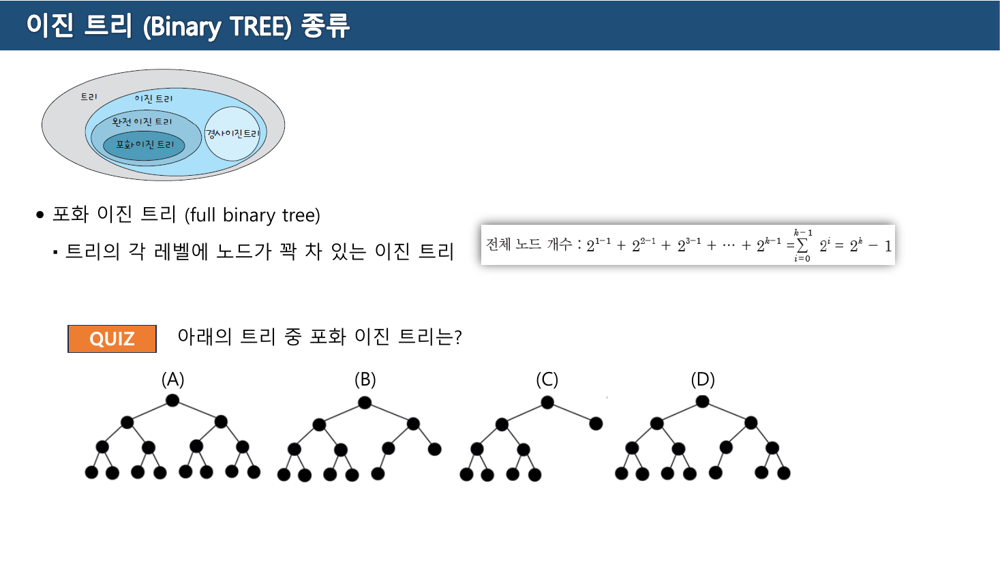
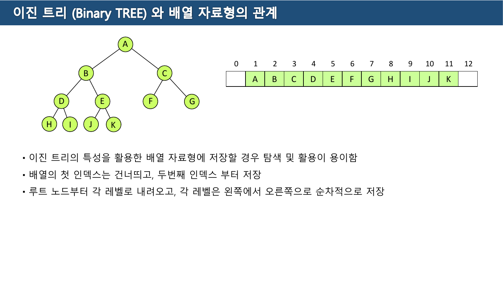
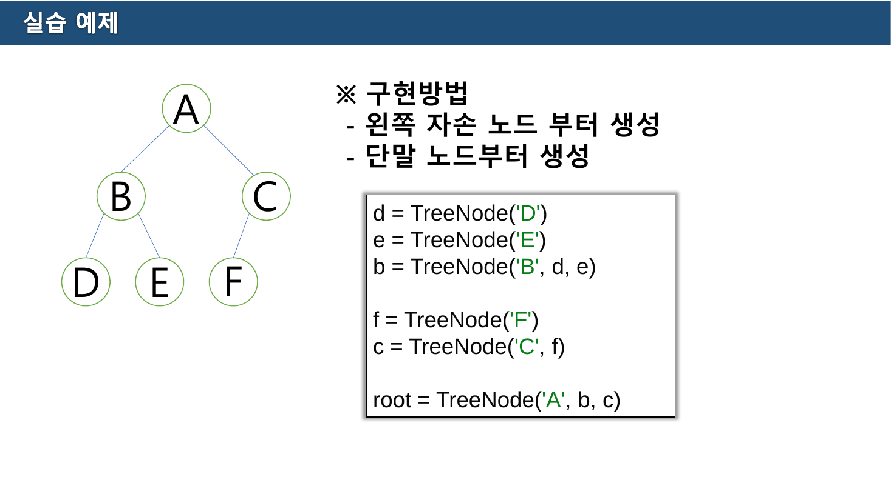
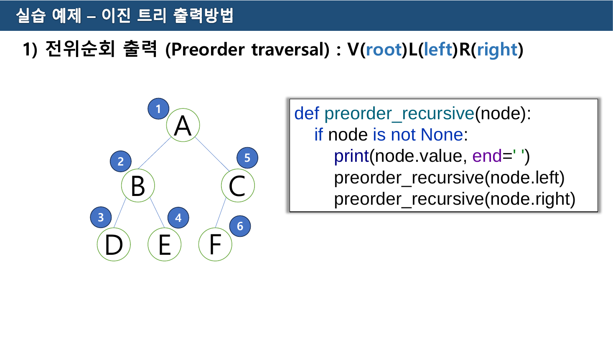
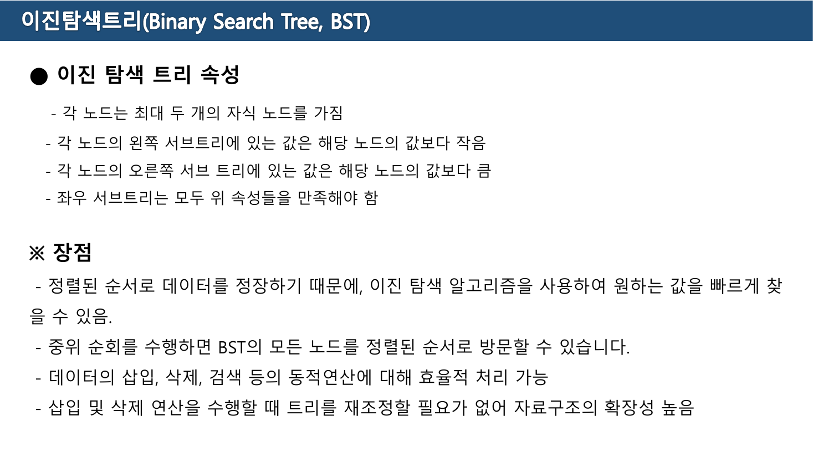

> [!abstract] 여기까지 온 모든 자료구조는 `next` 하나였다
> [02](./02.%20%EB%A6%AC%EC%8A%A4%ED%8A%B8%20%E2%80%94%20%EB%81%9D%EC%9D%84%20%EC%96%B4%EB%96%BB%EA%B2%8C%20%ED%91%9C%EC%8B%9C%ED%95%A0%20%EA%B2%83%EC%9D%B8%EA%B0%80.md)~[06장](./06.%20%ED%81%90%EC%99%80%20%EB%8D%B0%ED%81%AC%20%E2%80%94%20%EA%B5%90%EC%9E%AC%EA%B0%80%20%EA%B3%B5%EC%A7%9C%EB%9D%BC%20%ED%95%9C%20%EC%9E%90%EB%A6%AC%EB%A5%BC%20%EC%8B%A4%EC%8A%B5%EC%9D%80%20%EB%AC%B8%EC%A0%9C%EC%A0%90%EC%9D%B4%EB%9D%BC%20%EB%B6%80%EB%A5%B8%EB%8B%A4.md)의 자료구조는 노드마다 "다음"이 **하나**였다. 이중 연결 리스트가 둘을 가졌지만 그것도 앞뒤 한 줄이었다. 그래서 순회는 언제나 한 가지였고, 코드는 `while p:` 한 줄이면 됐다.
>
> 9주차 2쪽이 트리를 **"비선형 자료구조, 계층구조"** 라고 부르는 순간 그 전제가 깨진다. 자식이 여럿이면 다음 세 가지가 한꺼번에 문제가 된다.
>
> 1. 트리를 **글로 어떻게 적는가** (그림 없이) → 9주차 4쪽
> 2. 노드에 링크를 **몇 개 둘 것인가** → 9주차 5쪽
> 3. 어느 자식부터 **방문할 것인가** → 10주차 5~7쪽
>
> 두 자료를 관통하는 답은 하나다 — **자식 수를 둘로 묶고, 다시 배열 인덱스로 되돌린다.** 이 정리는 그 되돌림의 경로를 따라간다.

---

## 1. 말을 먼저 정하고 시작한다

9주차 3쪽은 이 자료에서 텍스트가 가장 많은 쪽(338자)이고, 용어 열 개를 표로 정의한다. 뒤의 모든 문제가 이 용어로 출제되므로 그대로 옮긴다.

| 용어 | 원본의 정의 |
| --- | --- |
| 부모(Parent) 노드 | 간선으로 직접 연결된 노드 중에 상위 노드 |
| 자식(Child) 노드 | 간선으로 직접 연결된 노드 중에 하위 노드 |
| 형제(sibling) 노드 | 같은 부모 노드를 가진 노드 |
| 조상(ancestor) 노드 | 어떤 노드에서 루트 노드까지의 경로상에 있는 모든 노드 |
| 자손(descendent) 노드 | 어떤 노드 하위에 연결된 모든 노드 |
| 단말(terminal, leaf) 노드 | 자식 노드가 없는 노드, 자식이 있으면 비단말 노드 |
| **노드의 차수(degree)** | 노드가 가지고 있는 **자식의 수**, 단말 노드는 항상 0 |
| **트리의 차수** | 트리에 포함된 모든 노드의 차수 중에서 **가장 큰 수** |
| **레벨(level)** | 트리의 각 층에 번호를 매기는 것, **루트 노드의 레벨은 1** |
| **트리의 높이(height)** | 트리가 가지고 있는 **최대 레벨** |

밑줄 그을 곳은 마지막 셋이다.

- **차수**는 "자식 수"이지 "간선 수"가 아니다. 그리고 **트리의 차수는 평균이 아니라 최댓값**이다. 이 하나 때문에 트리 전체에서 자식이 셋인 노드가 하나만 있어도 트리의 차수는 3이 된다.
- **레벨이 1부터** 시작한다. 0부터 세는 관습도 흔하므로 이 자료를 따를 때는 1을 지켜야 한다. 그래야 "높이 = 최대 레벨"이 성립하고, [기말고사 5번 문제](#8-예상문제)의 답도 맞는다.

이 정의로 6쪽의 Quiz를 풀 수 있다.



트리는 `A → {B, C, D}`, `B → {E, F}`, `C → {G, H, I}`, `D → {J}`, `J → {K, L}` 이다.

| 문제 1 | 답 | 근거 |
| --- | --- | --- |
| (a) 루트노드 | **A** | 부모가 없는 유일한 노드 |
| (b) 노드 J의 부모노드 | **D** | 간선으로 직접 연결된 상위 노드 |
| (c) 노드 G의 형제노드 | **H, I** | G의 부모는 C이고 C의 자식은 G·H·I — **둘**이다 |
| (d) 노드 C의 차수 | **3** | 자식이 G·H·I |
| (e) 트리의 높이 | **4** | A(1) · B C D(2) · E~J(3) · K L(4) |
| (f) 트리의 차수 | **3** | A와 C가 각각 3, 그것이 최댓값 |

(c)를 "H"라고만 답하기 쉽다. 형제는 **같은 부모를 가진 노드 전부**이므로 둘 다 써야 한다.

---

## 2. 그림 없이 트리를 적는 세 가지 방법

4쪽은 같은 트리를 세 가지 표기로 옮긴다. 텍스트는 50자뿐이고 내용이 전부 그림 안에 있다.



원본 그림의 트리는 `A → {B, C, D}`, `B → {E, F, G}`, `G → {K}`, `C → {H}`, `D → {I, J}` 다.

| 표기 | 모양 | 어디서 보는가 |
| --- | --- | --- |
| **중첩된 집합** | 큰 타원 안에 작은 타원이 들어간 그림 | 벤 다이어그램식 설명 |
| **중첩된 괄호** | `(A (B (E)(F)(G(K))) ((C(H)) (D(I)(J))))` | 수식 · S-표현식 · JSON |
| **들여쓰기** | 자식을 한 칸씩 안으로 | **파일 탐색기 · 목차 · YAML** |

셋은 **완전히 같은 정보**를 담는다. 부모-자식 관계를 각각 포함 관계·괄호 짝·들여쓰기 깊이로 표현했을 뿐이다.

세 번째가 가장 익숙할 것이다. 2쪽이 트리의 활용 예시로 든 **운영체제의 파일시스템**이 정확히 이 표기다. 폴더를 열면 안쪽으로 한 칸 들어가는 것 — 그것이 트리다.

두 번째는 [05장](./05.%20%ED%91%9C%EA%B8%B0%EB%B2%95%20%EB%B3%80%ED%99%98%20%E2%80%94%20%EA%B4%84%ED%98%B8%EB%A5%BC%20%EC%97%86%EC%95%A0%EB%8A%94%20%EB%91%90%20%EA%B0%80%EC%A7%80%20%EA%B8%B8.md)과 곧바로 이어진다. 중위 표기 수식의 괄호가 하는 일이 바로 이 "중첩된 괄호" 표기다. 수식이 트리라는 사실은 7쪽이 이진 트리의 활용으로 *"수식을 트리 형태로 표현하여 계산하는 수식 트리"* 를 들 때 명시된다.

> [!note] 6쪽 문제 2의 답
> Quiz 트리(1절)를 두 표기로 옮기면 이렇다.
>
> - **중첩된 괄호**: `(A (B (E)(F)) (C (G)(H)(I)) (D (J (K)(L))))`
> - **중첩된 집합**: A라는 큰 타원 안에 B·C·D 세 타원이 들어가고, B 안에 E·F, C 안에 G·H·I, D 안에 J 타원이, 다시 J 안에 K·L이 들어간다
>
> 원본에는 답이 실려 있지 않다.

---

## 3. 링크를 몇 개 둘 것인가 — 두 표현법

5쪽은 이 장에서 가장 중요한 쪽이다. 텍스트는 62자뿐이지만, 여기서 **일반 트리가 이진 트리로 되돌아간다.**



> **방법1: N-링크표현** — 자식의 개수에 제한이 없는 트리 (general TREE)
> **방법2: 왼쪽 자식 – 오른쪽 형제**

### 방법 1 — 자식 수만큼 링크

노드 구조가 `[자식1 | 데이터 | 자식2 | … | 자식n]` 이다. 자식이 몇이든 담을 수 있지만 대가가 크다.

- **노드 크기가 제각각**이다. 자식이 하나인 노드도 최대 자식 수만큼의 칸을 가져야 하거나(공간 낭비), 노드마다 크기가 달라야 한다(관리 복잡)
- 원본 그림에서 실제로 자식이 없는 노드(E·F·G)의 링크 칸이 **회색으로 비어** 있다

### 방법 2 — 링크를 딱 두 개로

노드 구조가 `[왼쪽 자식 | 데이터 | 오른쪽 형제]` 다. 원본이 괄호로 붙인 설명이 정확하다 — 왼쪽 자식은 **"첫번째 자식"**, 오른쪽 형제는 **"다음 형제"**.



원본 그림에서 A의 오른쪽 칸이 `None` 인 이유가 여기 있다. **루트에는 형제가 없다.** B는 왼쪽에 E(첫 자식), 오른쪽에 C(다음 형제)를 갖고, C는 왼쪽이 `None`(자식 없음), 오른쪽이 D다.

이것이 되돌림의 첫 단계다. **자식이 몇이든 링크는 항상 두 개**로 고정된다. 그리고 링크가 두 개인 트리가 바로 다음 절의 이진 트리다.

> [!tip] 두 링크의 의미가 바뀌었을 뿐 모양은 이진 트리다
> 방법 2로 옮긴 결과는 겉보기에 이진 트리와 구별할 수 없다. 다만 "왼쪽 = 자식, 오른쪽 = 형제"라는 **읽는 규칙**이 다르다. 일반 트리를 다루는 프로그램이 이진 트리 코드를 그대로 쓸 수 있게 되는 것이 이 표현의 값이다. 원본은 이 함의를 명시하지 않고 그림만 보여준다.

---

## 4. 이진 트리 — 제한이 만드는 것

7쪽이 이진 트리를 정의한다.

> **모든 노드가 최대 2개의 자식만을 가질 수 있는 트리**
> \- 모든 노드의 차수가 2 이하로 제한
> \- **자식 노드에도 순서가 존재**
> \- 데이터의 구조적인 관계를 잘 반영 / 효율적인 삽입과 탐색 가능
> \- 일반적인 TREE에 비해 계층적인 관계를 가지는 모든 자료형을 표현하기에는 부족

두 번째 항목이 미묘하다. **자식이 하나뿐인 노드도 "왼쪽 자식"인지 "오른쪽 자식"인지를 구별한다.** 일반 트리에서는 자식이 하나면 그냥 하나지만, 이진 트리에서는 두 트리가 서로 다른 트리다. 10주차 4쪽의 `c = TreeNode('C', f)` 가 F를 **왼쪽**에 붙이는 것도 이 규칙 때문이다.

마지막 항목은 정직한 한계 인정이다 — 그리고 3절의 방법 2가 그 한계를 우회하는 방법이었다.

### 세 가지 종류



8쪽 왼쪽 위의 집합 그림이 관계를 한눈에 보여준다 — 트리 ⊃ 이진 트리 ⊃ {완전 이진 트리 ⊃ 포화 이진 트리, 경사 이진 트리}.

| 종류 | 원본의 정의 | 쪽 |
| --- | --- | --- |
| **포화 이진 트리** (full binary tree) | 트리의 각 레벨에 노드가 꽉 차 있는 이진 트리 | 8 |
| **완전 이진 트리** (complete binary tree) | 마지막 레벨을 제외한 각 레벨이 노드들로 꽉 차 있고, 마지막 레벨에서는 **왼쪽부터 오른쪽으로 순서대로** 채워져 있는 이진 트리 | 9 |
| **균형 이진 트리** (height-balanced) | 모든 노드에서 좌우 서브 트리의 **높이 차이가 1 이하**인 트리 | 10 |
| **경사 트리** | 높이 차이가 1을 초과하는 트리 | 10 |

8쪽 오른쪽 상자의 공식은 포화 이진 트리의 전체 노드 개수다.

$$2^{1-1} + 2^{2-1} + 2^{3-1} + \cdots + 2^{k-1} = \sum_{i=0}^{k-1} 2^{i} = 2^{k} - 1$$

레벨 $i$ 에 노드가 $2^{i-1}$ 개 있고, 높이가 $k$ 이면 전부 더해 $2^k - 1$ 이다. 높이 3이면 7개, 높이 4면 15개다.

**8쪽 Quiz의 답은 (A)** 다. 네 그림 중 (A)만 레벨 4까지 1+2+4+8 = 15개가 모두 차 있다. (B)는 마지막 레벨에 빈자리가 있고, (C)는 루트의 오른쪽 자식이 단말이며, (D)도 마지막 레벨이 비어 있다. (B)와 (D)는 **완전 이진 트리이긴 하지만 포화는 아니다.**

9쪽이 그 관계를 문장으로 못 박는다.

> "**포화 이진 트리는 항상 완전 이진 트리**"는 성립,
> "완전 이진 트리는 항상 포화 이진 트리"는 성립되지 않음

---

## 5. 배열로 되돌리기 — 인덱스가 부모와 자식을 안다

11쪽에서 두 번째 되돌림이 일어난다. 링크를 아예 없애 버린다.



> \- 이진 트리의 특성을 활용한 배열 자료형에 저장할 경우 탐색 및 활용이 용이함
> \- **배열의 첫 인덱스는 건너띄고, 두번째 인덱스 부터 저장**
> \- 루트 노드부터 각 레벨로 내려오고, 각 레벨은 왼쪽에서 오른쪽으로 순차적으로 저장

원본의 트리와 배열은 이렇다.

```text
                    A
          B                   C
     D         E         F         G
  H     I   J     K

인덱스:  0   1   2   3   4   5   6   7   8   9  10  11  12
값:         A   B   C   D   E   F   G   H   I   J   K
```

인덱스 0을 비워 두는 이유는 계산식을 깔끔하게 만들기 위해서다. 12-2주차 자료 4쪽이 그 식을 명시한다.

| | 식 | 예 (D = 인덱스 4) |
| --- | --- | --- |
| 왼쪽 자식 | `2 * index` | 8 → H |
| 오른쪽 자식 | `2 * index + 1` | 9 → I |
| 부모 | `index // 2` | 2 → B |

**링크가 사라졌는데 부모·자식을 찾을 수 있다.** 곱하기 2와 나누기 2가 레벨을 한 칸 내려가고 올라가는 일을 대신한다. 레벨이 하나 내려갈 때마다 노드 수가 두 배가 되므로 인덱스도 두 배가 되는 것이다.

12쪽 Quiz의 답이 그대로 나온다 — **"D"의 부모는 `4 // 2 = 2` 인 B**, **"D"의 왼쪽·오른쪽 자식은 `2×4 = 8`(H)과 `2×4+1 = 9`(I)** 다.

아래에서 두 표현을 나란히 놓고 인덱스를 확인할 수 있다. 값은 11쪽 원본 그대로다.

```html preview
<div id="ar-root">
  <style>
    #ar-root{font-family:system-ui,-apple-system,"Segoe UI",sans-serif;color:var(--foreground);background:var(--card);
      border:1px solid var(--border);border-radius:10px;padding:16px}
    #ar-root h4{margin:0 0 4px;font-size:14px}
    #ar-root .sub{font-size:12px;opacity:.7;margin-bottom:12px}
    #ar-root svg{width:100%;height:auto;display:block;cursor:pointer}
    #ar-root .say{font-family:ui-monospace,SFMono-Regular,Menlo,monospace;font-size:12.5px;margin-top:11px;
      border-left:3px solid var(--chart-2);padding:8px 0 8px 11px;line-height:1.8;white-space:pre-wrap;min-height:5.4em}
  </style>
  <h4>이진 트리 ↔ 배열 — 노드를 눌러 식을 확인한다</h4>
  <div class="sub">원본 9주차 11쪽의 트리와 배열 그대로. 인덱스 0은 비워 둔다.</div>
  <svg id="ar-svg" viewBox="0 0 700 300" role="img" aria-label="이진 트리와 배열의 대응"></svg>
  <div class="say" id="ar-say"></div>
</div>
<script>
(function(){
  var V=[null,"A","B","C","D","E","F","G","H","I","J","K"];
  var POS={1:[350,32],2:[190,86],3:[510,86],4:[110,140],5:[270,140],6:[430,140],7:[590,140],
           8:[70,194],9:[150,194],10:[230,194],11:[310,194]};
  var sel=1;
  function render(){
    var S="";
    // 간선
    for(var i=2;i<=11;i++){
      var p=Math.floor(i/2);
      if(POS[i]&&POS[p]) S+='<line x1="'+POS[p][0]+'" y1="'+(POS[p][1]+13)+'" x2="'+POS[i][0]+'" y2="'+(POS[i][1]-13)+'" stroke="var(--border)"/>';
    }
    for(var i=1;i<=11;i++){
      var on=(i===sel), rel = (i===Math.floor(sel/2)) || (i===sel*2) || (i===sel*2+1);
      var c = on? "var(--chart-1)" : (rel? "var(--chart-2)" : "var(--border)");
      S+='<circle cx="'+POS[i][0]+'" cy="'+POS[i][1]+'" r="14" fill="none" stroke="'+c+'" stroke-width="'+(on?2.4:1.4)+'" data-i="'+i+'"/>';
      S+='<text x="'+POS[i][0]+'" y="'+(POS[i][1]+5)+'" text-anchor="middle" font-size="13" fill="'+(on||rel?c:"var(--foreground)")+'" data-i="'+i+'">'+V[i]+'</text>';
      S+='<text x="'+POS[i][0]+'" y="'+(POS[i][1]-19)+'" text-anchor="middle" font-size="9.5" fill="var(--border)">'+i+'</text>';
    }
    // 배열
    var x0=20, w=52, y=244;
    for(var i=0;i<=12;i++){
      var on=(i===sel), rel=(i===Math.floor(sel/2))||(i===sel*2)||(i===sel*2+1);
      var c = on? "var(--chart-1)" : (rel && V[i]? "var(--chart-2)" : "var(--border)");
      S+='<rect x="'+(x0+i*w)+'" y="'+y+'" width="46" height="32" rx="4" fill="none" stroke="'+c+'" stroke-width="'+(on?2.2:1.1)+'" data-i="'+i+'"/>';
      if(V[i]) S+='<text x="'+(x0+i*w+23)+'" y="'+(y+21)+'" text-anchor="middle" font-size="13" fill="'+(on||rel?c:"var(--foreground)")+'" data-i="'+i+'">'+V[i]+'</text>';
      S+='<text x="'+(x0+i*w+23)+'" y="'+(y-6)+'" text-anchor="middle" font-size="10" fill="var(--border)">'+i+'</text>';
    }
    var svg=document.getElementById("ar-svg");
    svg.innerHTML=S;
    svg.onclick=function(e){
      var i=e.target && e.target.getAttribute && e.target.getAttribute("data-i");
      if(i){ i=parseInt(i,10); if(V[i]){ sel=i; render(); } }
    };
    var p=Math.floor(sel/2), l=sel*2, r=sel*2+1;
    document.getElementById("ar-say").textContent =
      '선택한 노드 : "'+V[sel]+'"  (인덱스 '+sel+')\n'+
      '부모      = '+sel+' // 2 = '+p+'  →  '+(V[p]?'"'+V[p]+'"':'없음 (루트)')+'\n'+
      '왼쪽 자식  = 2 × '+sel+' = '+l+'  →  '+(V[l]?'"'+V[l]+'"':'없음')+'\n'+
      '오른쪽 자식 = 2 × '+sel+' + 1 = '+r+'  →  '+(V[r]?'"'+V[r]+'"':'없음');
  }
  render();
})();
</script>
```

> [!warning] 배열 표현은 완전 이진 트리에서만 값이 있다
> 원본 11쪽의 트리는 마지막 레벨이 왼쪽부터 차 있는 **완전 이진 트리**다. 그래서 배열에 빈칸 없이 들어간다.
>
> [08장의 경사 트리](./08.%20BST%EC%99%80%20AVL%20%E2%80%94%20%EA%B7%A0%ED%98%95%EC%9D%84%20%EC%A7%80%ED%82%A4%EB%A0%A4%EB%A9%B4%20%EB%AC%B4%EC%97%87%EC%9D%84%20%EB%82%B4%EC%96%B4%EC%A3%BC%EC%96%B4%EC%95%BC%20%ED%95%98%EB%8A%94%EA%B0%80.md)처럼 한쪽으로만 뻗은 이진 트리를 같은 방식으로 배열에 넣으면, 노드 $n$개를 담는 데 $2^n - 1$ 칸이 필요하다. 노드 20개짜리 경사 트리에 100만 칸이 넘게 든다. 원본은 이 조건을 명시하지 않는다 — 9쪽·10쪽에서 완전 이진 트리와 균형 이진 트리를 먼저 정의한 뒤 11쪽으로 넘어가는 순서가 그 힌트다.
>
> 이 표현이 실제로 쓰이는 곳은 **언제나 완전 이진 트리임이 보장되는 힙**이다. [10장](./10.%20%EC%A0%95%EB%A0%AC%20%E2%91%A1%20%E2%80%94%20%EC%B2%AB%20%EB%B2%88%EC%A7%B8%20%EB%8B%A8%EA%B3%84%EB%9E%80%20%EB%AC%B4%EC%97%87%EC%9D%B8%EA%B0%80.md)에서 다시 만난다.

---

## 6. 순회 — 방문 순서가 셋이 되는 이유

10주차 자료가 실제 코드로 들어간다. 2쪽의 클래스는 세 줄이면 끝난다.

```python
class TreeNode:
    def __init__(self, value, left=None, right=None):
        self.value = value
        self.left = left
        self.right = right
```

3쪽은 구현 방침을 밝히는데, 읽다 보면 앞뒤가 조금 어긋난다.

> ※ 노드를 이용한 이진 트리 구현은 복잡 → **주로 배열 자료형을 이용**
> → 레벨이 증가할 수록 비교 해야 할 노드가 기하급수적으로 증가
> → 이전(앞) 노드에 대한 정보가 없으므로 매번 root 노드부터 다시 검색
>
> ※ 본 강의에서는 이진 트리 구현을 위한 **별도 클래스 구현 하지 않고, Node 구조를 활용하여** 직접 트리를 설계하여 이진 트리를 이해하려고 한다.

"주로 배열을 이용한다"고 해 놓고 실제로는 노드로 만든다. 배열 방식은 5절에서 이미 보았고, 여기서는 **재귀로 순회를 쓰는 법**을 배우는 것이 목적이기 때문이다. 세 개의 화살표가 나열한 세 가지 어려움은 배열 방식의 이유가 아니라 노드 방식의 어려움을 적은 것으로 읽는 편이 자연스럽다.



4쪽의 구현 방법 두 줄이 실용적이다.

> \- **왼쪽 자손 노드 부터 생성** / **단말 노드부터 생성**

```python
d = TreeNode('D')
e = TreeNode('E')
b = TreeNode('B', d, e)      # 자식을 먼저 만들어야 넘길 수 있다

f = TreeNode('F')
c = TreeNode('C', f)         # F는 C의 왼쪽 자식

root = TreeNode('A', b, c)
```

생성자가 자식을 인자로 받으므로 **자식이 먼저 존재해야 한다.** 그래서 단말부터 거꾸로 올라간다. 트리를 만드는 순서와 트리를 읽는 순서가 반대라는 점이 이미 순회 이야기의 예고다.

### 세 가지 순회



5~7쪽이 세 순회를 한 쪽씩 다룬다. 원본이 붙인 이름표가 정의 그 자체다.

| 순회 | 원본 표기 | 뜻 |
| --- | --- | --- |
| 전위 순회 (Preorder) | **V(root) L(left) R(right)** | 자기 → 왼쪽 → 오른쪽 |
| 중위 순회 (Inorder) | **L(left) V(root) R(right)** | 왼쪽 → 자기 → 오른쪽 |
| 후위 순회 (Postorder) | **L(left) R(right) V(root)** | 왼쪽 → 오른쪽 → 자기 |

세 순회는 **왼쪽이 오른쪽보다 먼저**라는 점은 공통이고, **자기 자신을 언제 처리하느냐**만 다르다. 세 자리(앞·가운데·뒤)가 곧 세 이름이다.

원본이 각 쪽의 트리에 매긴 방문 번호를 그대로 옮기면 순서가 나온다.

| 순회 | 원본 그림의 번호 | 방문 순서 |
| --- | --- | --- |
| 전위 (5쪽) | A①  B②  D③  E④  C⑤  F⑥ | **A B D E C F** |
| 중위 (6쪽) | D①  B②  E③  A④  F⑤  C⑥ | **D B E A F C** |
| 후위 (7쪽) | D①  E②  B③  F④  C⑤  A⑥ | **D E B F C A** |

5쪽만 코드가 실려 있고, 6·7쪽은 **`# 직접 구현해 보세요.`** 로 비워 두었다.

```python
def preorder_recursive(node):        # 원본 5쪽
    if node is not None:
        print(node.value, end=' ')   # V
        preorder_recursive(node.left)   # L
        preorder_recursive(node.right)  # R

def inorder_recursive(node):         # 원본 6쪽 — 비워 둠
    if node is not None:
        inorder_recursive(node.left)
        print(node.value, end=' ')
        inorder_recursive(node.right)

def postorder_recursive(node):       # 원본 7쪽 — 비워 둠
    if node is not None:
        postorder_recursive(node.left)
        postorder_recursive(node.right)
        print(node.value, end=' ')
```

**세 함수의 차이는 `print` 줄의 위치 하나**다. 이 사실이 순회를 외우지 않아도 되게 만든다.

아래에서 같은 트리를 세 순서로 걸어 볼 수 있다. 노드와 번호는 원본 5~7쪽 그대로다.

```html preview
<div id="tv-root">
  <style>
    #tv-root{font-family:system-ui,-apple-system,"Segoe UI",sans-serif;color:var(--foreground);background:var(--card);
      border:1px solid var(--border);border-radius:10px;padding:16px}
    #tv-root h4{margin:0 0 4px;font-size:14px}
    #tv-root .sub{font-size:12px;opacity:.7;margin-bottom:12px}
    #tv-root .bar{display:flex;gap:8px;flex-wrap:wrap;align-items:center;margin-bottom:12px}
    #tv-root button{font:inherit;font-size:12.5px;padding:6px 12px;border-radius:7px;cursor:pointer;
      border:1px solid var(--border);background:transparent;color:var(--foreground)}
    #tv-root button.sel{border-color:var(--chart-1);color:var(--chart-1)}
    #tv-root button:disabled{opacity:.4;cursor:default}
    #tv-root svg{width:100%;height:auto;display:block}
    #tv-root .code{font-family:ui-monospace,SFMono-Regular,Menlo,monospace;font-size:12px;line-height:1.7;
      border-left:3px solid var(--border);padding:6px 0 6px 11px;margin-top:10px;white-space:pre}
    #tv-root .code .hot{color:var(--chart-1);font-weight:600}
    #tv-root .out{font-family:ui-monospace,SFMono-Regular,Menlo,monospace;font-size:14px;margin-top:10px;letter-spacing:.14em}
  </style>
  <h4>세 가지 순회 — print 한 줄의 위치가 전부다</h4>
  <div class="sub">원본 10주차 5·6·7쪽의 트리. A는 B·C를, B는 D·E를, C는 F를(왼쪽) 자식으로 갖는다.</div>
  <div class="bar"><span id="tv-modes"></span>
    <button id="tv-step">▶ 한 노드</button><button id="tv-all">끝까지</button><button id="tv-reset">처음으로</button></div>
  <svg id="tv-svg" viewBox="0 0 620 190" role="img" aria-label="이진 트리 순회"></svg>
  <div class="code" id="tv-code"></div>
  <div class="out" id="tv-out"></div>
</div>
<script>
(function(){
  var POS={A:[310,28],B:[180,90],C:[440,90],D:[110,152],E:[250,152],F:[380,152]};
  var CH={A:["B","C"],B:["D","E"],C:["F",null],D:[null,null],E:[null,null],F:[null,null]};
  var ORDERS={
    pre:{label:"전위 V·L·R", seq:["A","B","D","E","C","F"], code:["def preorder(node):","    if node is not None:","        print(node.value)","        preorder(node.left)","        preorder(node.right)"], hot:2},
    "in":{label:"중위 L·V·R", seq:["D","B","E","A","F","C"], code:["def inorder(node):","    if node is not None:","        inorder(node.left)","        print(node.value)","        inorder(node.right)"], hot:3},
    post:{label:"후위 L·R·V", seq:["D","E","B","F","C","A"], code:["def postorder(node):","    if node is not None:","        postorder(node.left)","        postorder(node.right)","        print(node.value)"], hot:4}
  };
  var keys=["pre","in","post"], cur=0, k=0;
  var mb=document.getElementById("tv-modes");
  keys.forEach(function(key,i){
    var b=document.createElement("button"); b.textContent=ORDERS[key].label; b.style.marginRight="6px";
    b.onclick=function(){ cur=i; k=0; render(); }; mb.appendChild(b);
  });
  document.getElementById("tv-step").onclick=function(){ var s=ORDERS[keys[cur]].seq; if(k<s.length) k++; render(); };
  document.getElementById("tv-all").onclick=function(){ k=ORDERS[keys[cur]].seq.length; render(); };
  document.getElementById("tv-reset").onclick=function(){ k=0; render(); };
  function render(){
    Array.prototype.forEach.call(mb.children,function(b,i){ b.classList.toggle("sel",i===cur); });
    var O=ORDERS[keys[cur]], seq=O.seq, done=seq.slice(0,k);
    document.getElementById("tv-step").disabled = k>=seq.length;
    var S="";
    Object.keys(CH).forEach(function(n){
      CH[n].forEach(function(c){
        if(c) S+='<line x1="'+POS[n][0]+'" y1="'+(POS[n][1]+16)+'" x2="'+POS[c][0]+'" y2="'+(POS[c][1]-16)+'" stroke="var(--border)"/>';
      });
    });
    Object.keys(POS).forEach(function(n){
      var idx=done.indexOf(n), on=(k>0 && seq[k-1]===n);
      var c = on? "var(--chart-1)" : (idx>=0? "var(--chart-2)" : "var(--border)");
      S+='<circle cx="'+POS[n][0]+'" cy="'+POS[n][1]+'" r="17" fill="none" stroke="'+c+'" stroke-width="'+(on?2.6:1.4)+'"/>';
      S+='<text x="'+POS[n][0]+'" y="'+(POS[n][1]+6)+'" text-anchor="middle" font-size="15" fill="'+(idx>=0?c:"var(--foreground)")+'">'+n+'</text>';
      if(idx>=0) S+='<text x="'+(POS[n][0]+22)+'" y="'+(POS[n][1]-14)+'" font-size="11.5" fill="var(--chart-1)">'+(idx+1)+'</text>';
    });
    document.getElementById("tv-svg").innerHTML=S;
    document.getElementById("tv-code").innerHTML = O.code.map(function(l,i){
      return i===O.hot ? '<span class="hot">'+l+'</span>' : l;
    }).join("\n");
    document.getElementById("tv-out").textContent = "출력: "+done.join(" ")+(k>=seq.length?"   ← 원본 "+(cur===0?"5":cur===1?"6":"7")+"쪽의 번호와 일치":"");
  }
  render();
})();
</script>
```

### 순회를 쓰는 두 예제

8·9쪽은 순회 틀을 그대로 써서 다른 값을 계산한다.

```python
def count_node(node):                        # 8쪽 — 전체 노드의 수
    if node is None:
        return 0
    else:
        return count_node(node.left) + count_node(node.right) + 1

def calc_height(node):                       # 9쪽 — 이진 트리의 높이
    if node is None:
        return 0
    # 직접 구현해 보세요.
```

8쪽의 설명 — *"왼쪽 서브 트리의 노드 수와 오른쪽 서브 트리의 노드 수의 합"* — 에 `+ 1`(자기 자신)이 붙는다. 9쪽은 *"좌우 트리의 높이 중에서 **큰 값에 1을 더한 값**"* 이라고 말만 하고 코드를 비워 두었다.

```python
def calc_height(node):
    if node is None:
        return 0
    return max(calc_height(node.left), calc_height(node.right)) + 1
```

두 함수의 구조가 같다. **자식들에게 물어보고, 그 답에 자기 몫을 얹는다.** 다른 것은 `+` 냐 `max` 냐뿐이다. 이것이 후위 순회의 모양이다 — 자기 일을 자식들 다음에 한다.

---

## 7. 이진 탐색 트리 — 값에 규칙을 얹는다

10·11쪽에서 이진 트리에 **값의 규칙**이 추가된다.



> ● 이진 탐색 트리 속성
> \- 각 노드는 최대 두 개의 자식 노드를 가짐
> \- 각 노드의 **왼쪽 서브트리에 있는 값은 해당 노드의 값보다 작음**
> \- 각 노드의 **오른쪽 서브 트리에 있는 값은 해당 노드의 값보다 큼**
> \- **좌우 서브트리는 모두 위 속성들을 만족해야 함**

마지막 줄이 없으면 규칙이 무의미해진다. "루트보다 왼쪽이 작다"만으로는 왼쪽 안쪽이 뒤죽박죽일 수 있다. **모든 노드에서** 성립해야 탐색이 성립한다.

10쪽이 드는 장점 중 하나가 6절과 직접 이어진다.

> **중위 순회를 수행하면 BST의 모든 노드를 정렬된 순서로 방문할 수 있습니다.**

중위 순회는 `왼쪽 → 자기 → 오른쪽` 이고, BST에서 왼쪽은 전부 작고 오른쪽은 전부 크다. 그러니 순회 결과가 오름차순이 된다. **정렬된 배열을 트리로 세워 둔 것**이 BST인 셈이다.

> [!caution] 원본 오류 — 10쪽의 장점과 11쪽의 단점이 정면으로 충돌한다
> 10쪽 마지막 장점:
>
> > 삽입 및 삭제 연산을 수행할 때 **트리를 재조정할 필요가 없어** 자료구조의 확장성 높음
>
> 11쪽 마지막 단점:
>
> > 일부 노드의 삽입 또는 삭제 연산은 **트리의 구조를 재조정해야 하므로** 복잡성 증가
>
> 연속된 두 쪽이 같은 연산에 대해 정반대를 말한다.
>
> 실제로는 **둘 다 부분적으로 맞다.** 삽입은 언제나 새 단말 노드를 붙이는 것으로 끝나므로 재조정이 없다(10쪽이 맞다). 삭제는 자식이 둘인 노드를 지울 때 후계 노드를 찾아 올려야 하므로 재조정이 필요하다(11쪽이 맞다). 두 쪽 모두 "삽입 및 삭제"라고 뭉뚱그린 것이 문제다.
>
> 그리고 11쪽의 나머지 세 항목이 말하는 불균형 문제는 [08장의 AVL 트리](./08.%20BST%EC%99%80%20AVL%20%E2%80%94%20%EA%B7%A0%ED%98%95%EC%9D%84%20%EC%A7%80%ED%82%A4%EB%A0%A4%EB%A9%B4%20%EB%AC%B4%EC%97%87%EC%9D%84%20%EB%82%B4%EC%96%B4%EC%A3%BC%EC%96%B4%EC%95%BC%20%ED%95%98%EB%8A%94%EA%B0%80.md)로 이어지는데, AVL은 **삽입에서도** 재조정을 한다. 그러니 10쪽의 "재조정할 필요가 없어"는 BST에 한정된 이야기다.

같은 쪽에 사소한 것이 하나 더 있다.

> [!note] 10쪽의 오타
> *"정렬된 순서로 데이터를 **정장**하기 때문에"* — `저장`의 오타다.

11쪽의 단점 목록은 다음 장의 문제 제기 그 자체다.

> \- **특정한 순서대로 데이터가 입력되는 경우에는 트리의 높이가 선형적으로 증가**
> \- 데이터가 랜덤하게 입력되지 않거나, 특정한 순서로 입력될 경우 트리가 불균형
> \- 트리가 불균형 할 경우에는 균형을 유지하기 위해 추가적인 연산이 필요

정렬된 데이터를 순서대로 넣으면 BST는 **연결 리스트가 된다.** 그러면 탐색이 $O(\log n)$ 이 아니라 $O(n)$ 이 되어, 트리를 쓴 이유 자체가 사라진다. 12쪽이 BST 클래스 구현을 문제로 내고 자료가 끝나며, [08장](./08.%20BST%EC%99%80%20AVL%20%E2%80%94%20%EA%B7%A0%ED%98%95%EC%9D%84%20%EC%A7%80%ED%82%A4%EB%A0%A4%EB%A9%B4%20%EB%AC%B4%EC%97%87%EC%9D%84%20%EB%82%B4%EC%96%B4%EC%A3%BC%EC%96%B4%EC%95%BC%20%ED%95%98%EB%8A%94%EA%B0%80.md)이 그 문제부터 시작한다.

---

## 8. 예상문제

기말고사 공지용 자료의 객관식 1~5번과 주관식 1번이 이 장 범위다.

| 문항 | 답과 근거 |
| --- | --- |
| 1. 트리의 기본 정의 | **③ 한 개의 루트 노드와 0개 이상의 자식 노드들로 구성된 계층적 자료 구조** — 9주차 2쪽 "계층적인 관계를 가진 자료의 표현" |
| 2. BST의 특징 중 옳지 **않은** 것 | **③ 중복된 값이 허용된다** — 10주차 10쪽 속성은 "작음"과 "큼"만 규정한다. 같은 값의 자리가 정의되지 않는다 |
| 3. 트리 순회 방법이 **아닌** 것 | **④ 순환 순회(Circular Traversal)** — 10주차 5~7쪽에 전위·중위·후위 셋뿐 |
| 4. 완전 이진 트리의 정의 | **③ 마지막 레벨을 제외한 모든 레벨이 완전히 채워져 있다** — 9주차 9쪽. ①은 포화에 가깝고 ②는 다른 개념이다 |
| 5. 높이가 3인 완전 이진 트리의 최대 노드 수 | **② 7** — 9주차 8쪽 공식 $2^k - 1$ 에 $k = 3$. 레벨이 1부터 시작한다는 3쪽 정의가 전제다 |
| 주관식 1 | 배열 인덱스 식 — 5절 참조 |

주관식 1번은 식을 반드시 쓰라고 못 박는다.

> (1) "D"의 부모 노드를 구하는 **수식을 활용하여** 부모노드를 구하세요. (수식 반드시 표기)
> (2) "E"의 왼쪽, 오른쪽 자식 노드를 구하는 **수식을 활용하여** … (수식 반드시 표기)

9주차 11쪽 배열을 기준으로 하면 이렇게 쓴다.

```text
(1) D는 인덱스 4.   부모 = 4 // 2 = 2   →  B
(2) E는 인덱스 5.   왼쪽 자식  = 2 × 5     = 10  →  J
                   오른쪽 자식 = 2 × 5 + 1 = 11  →  K
```

> [!tip] 5번을 헷갈리게 만드는 것
> "높이 3"을 레벨 0부터 세면 네 층이 되어 15개가 답이 된다. 9주차 3쪽이 **"루트 노드의 레벨은 1"** 이라고 정의했으므로 이 과목에서는 세 층, 7개다. 시험이 같은 자료를 근거로 출제되므로 3쪽의 정의를 따르는 것이 맞다.

---

## 다른 장과의 연결

- 여기서 미룬 BST 구현과 불균형 문제의 해결 — [08. BST와 AVL](./08.%20BST%EC%99%80%20AVL%20%E2%80%94%20%EA%B7%A0%ED%98%95%EC%9D%84%20%EC%A7%80%ED%82%A4%EB%A0%A4%EB%A9%B4%20%EB%AC%B4%EC%97%87%EC%9D%84%20%EB%82%B4%EC%96%B4%EC%A3%BC%EC%96%B4%EC%95%BC%20%ED%95%98%EB%8A%94%EA%B0%80.md)
- 배열 인덱스 표현이 실제로 쓰이는 곳(힙) — [10. 정렬 ②](./10.%20%EC%A0%95%EB%A0%AC%20%E2%91%A1%20%E2%80%94%20%EC%B2%AB%20%EB%B2%88%EC%A7%B8%20%EB%8B%A8%EA%B3%84%EB%9E%80%20%EB%AC%B4%EC%97%87%EC%9D%B8%EA%B0%80.md)
- 순회에 쓰이는 스택(재귀)과 큐(레벨 순회) — [04. 스택](./04.%20%EC%8A%A4%ED%83%9D%20%E2%80%94%20%EC%B6%9C%EC%9E%85%EA%B5%AC%EA%B0%80%20%ED%95%98%EB%82%98%EB%9D%BC%EB%8A%94%20%EC%A0%9C%EC%95%BD%EC%9D%B4%20%EB%A7%8C%EB%93%9C%EB%8A%94%20%EA%B2%83.md) · [06. 큐와 데크](./06.%20%ED%81%90%EC%99%80%20%EB%8D%B0%ED%81%AC%20%E2%80%94%20%EA%B5%90%EC%9E%AC%EA%B0%80%20%EA%B3%B5%EC%A7%9C%EB%9D%BC%20%ED%95%9C%20%EC%9E%90%EB%A6%AC%EB%A5%BC%20%EC%8B%A4%EC%8A%B5%EC%9D%80%20%EB%AC%B8%EC%A0%9C%EC%A0%90%EC%9D%B4%EB%9D%BC%20%EB%B6%80%EB%A5%B8%EB%8B%A4.md)
- 중첩된 괄호 표기와 수식 트리 — [05. 표기법 변환](./05.%20%ED%91%9C%EA%B8%B0%EB%B2%95%20%EB%B3%80%ED%99%98%20%E2%80%94%20%EA%B4%84%ED%98%B8%EB%A5%BC%20%EC%97%86%EC%95%A0%EB%8A%94%20%EB%91%90%20%EA%B0%80%EC%A7%80%20%EA%B8%B8.md)
- "연결 리스트의 응용이 아닌 것" 문제에서 파일 시스템이 답이었던 이유 — [02. 리스트](./02.%20%EB%A6%AC%EC%8A%A4%ED%8A%B8%20%E2%80%94%20%EB%81%9D%EC%9D%84%20%EC%96%B4%EB%96%BB%EA%B2%8C%20%ED%91%9C%EC%8B%9C%ED%95%A0%20%EA%B2%83%EC%9D%B8%EA%B0%80.md)

---

## 근거 자료

| 원본 | 쪽 | 내용 | 이 문서에서 쓰인 곳 |
| --- | --- | --- | --- |
| 9주차(트리) | 2 | 트리의 정의와 활용 예시 | 머리말 · 8절 |
| 9주차(트리) | **3** | 용어 10개 정의표 | 1절 |
| 9주차(트리) | **4** | 세 가지 표기 방법 | 2절 · 인용 |
| 9주차(트리) | **5** | N-링크 / 왼쪽 자식–오른쪽 형제 | 3절 · 인용 |
| 9주차(트리) | **6** | Quiz — 용어와 표기 | 1절 · 2절 · 인용 |
| 9주차(트리) | 7 | 이진 트리의 정의와 활용 | 4절 |
| 9주차(트리) | **8** | 포화 이진 트리 · 노드 수 공식 · Quiz | 4절 · 인용 |
| 9주차(트리) | 9 · 10 | 완전 이진 트리 / 균형 이진 트리 | 4절 |
| 9주차(트리) | **11** | 이진 트리와 배열의 관계 | 5절 · 인용 · 인터랙티브 |
| 9주차(트리) | 12 | 배열 인덱스 Quiz | 5절 |
| 10주차 | 2 · 3 | `TreeNode` 클래스 / 구현 방침 | 6절 |
| 10주차 | **4** | 실습 예제 — 단말부터 생성 | 6절 · 인용 |
| 10주차 | **5** · 6 · 7 | 전위 · 중위 · 후위 순회 | 6절 · 인용 · 인터랙티브 |
| 10주차 | 8 · 9 | 노드 수 / 높이 구하기 | 6절 |
| 10주차 | **10** · 11 | BST 속성 · 장점 / 단점 | 7절 · 인용 · **원본 오류** |
| 10주차 | 12 | BST 클래스 구현 문제 | 7절 |
| 기말고사 공지용 | 1 · 7 | 객관식 1~5, 주관식 1 | 8절 |

- 텍스트 0자 페이지: 없음. 다만 9주차 4·5·6·11쪽과 10주차 4쪽은 텍스트가 50~155자에 그치고 **내용이 전부 그림 안에** 있어 이미지를 봐야 한다
- 발견한 원본 문제: 10주차 **10쪽 장점 ↔ 11쪽 단점의 모순**, 10쪽의 `정장`(→저장) 오타
