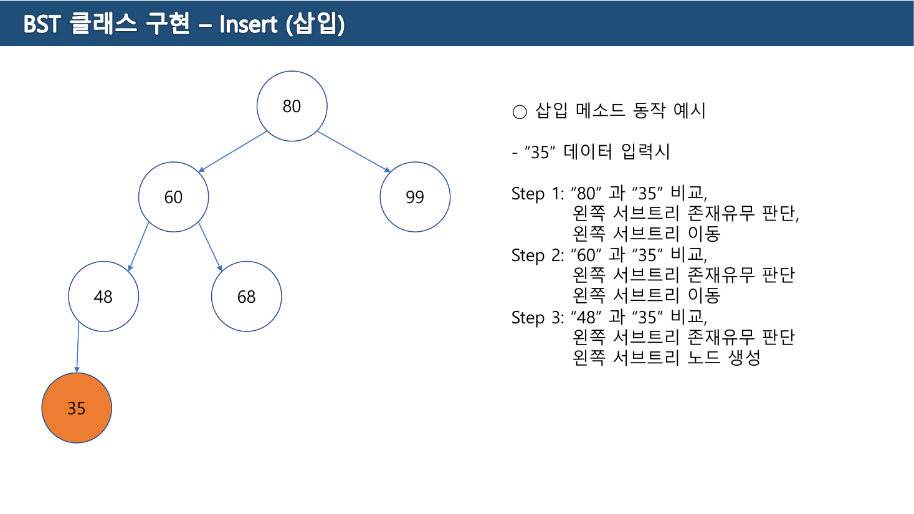
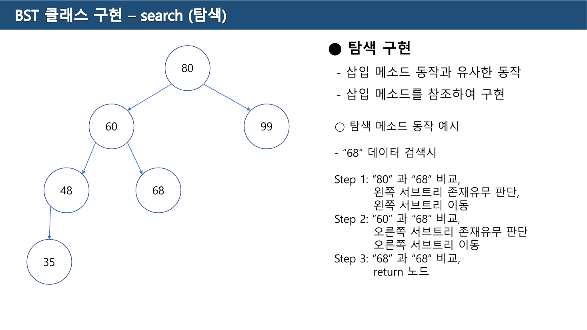
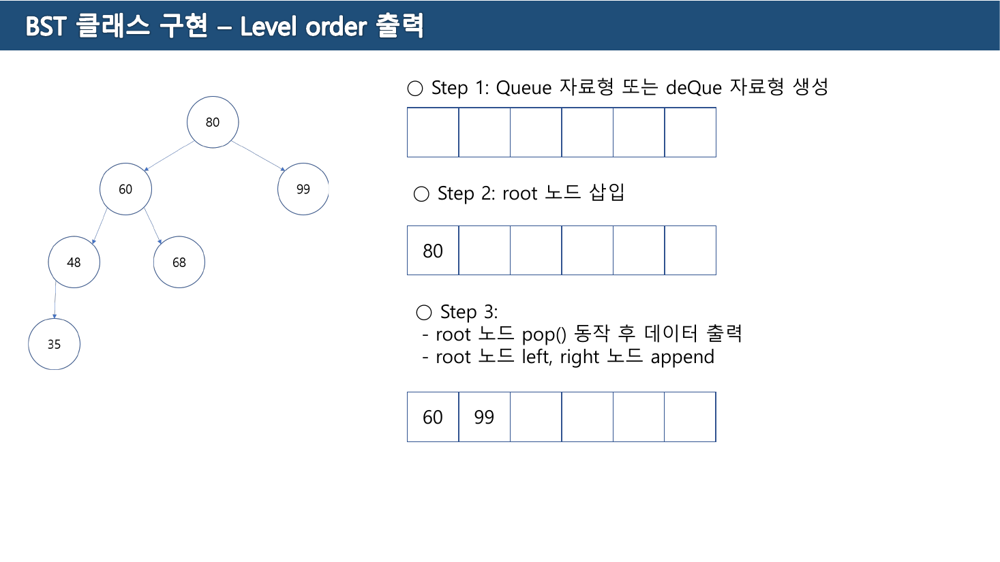
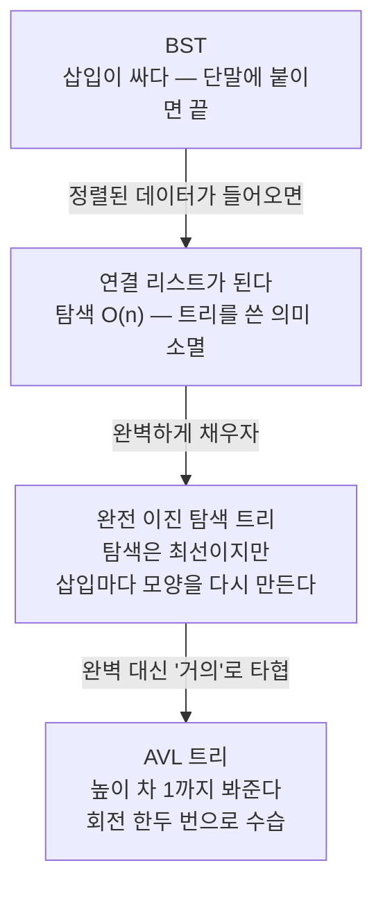
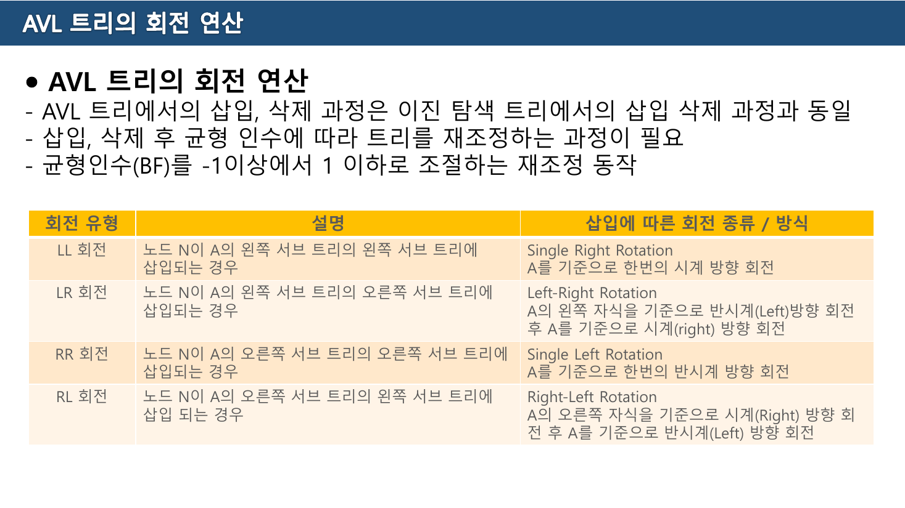
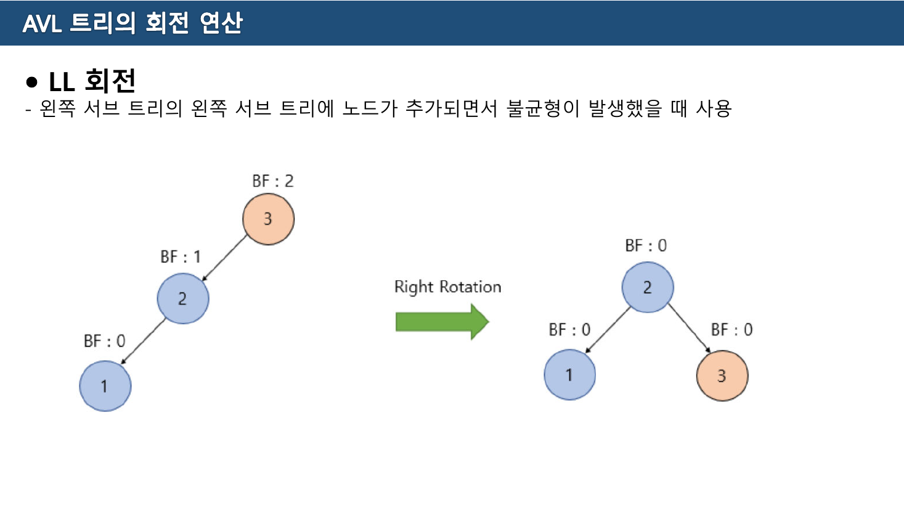
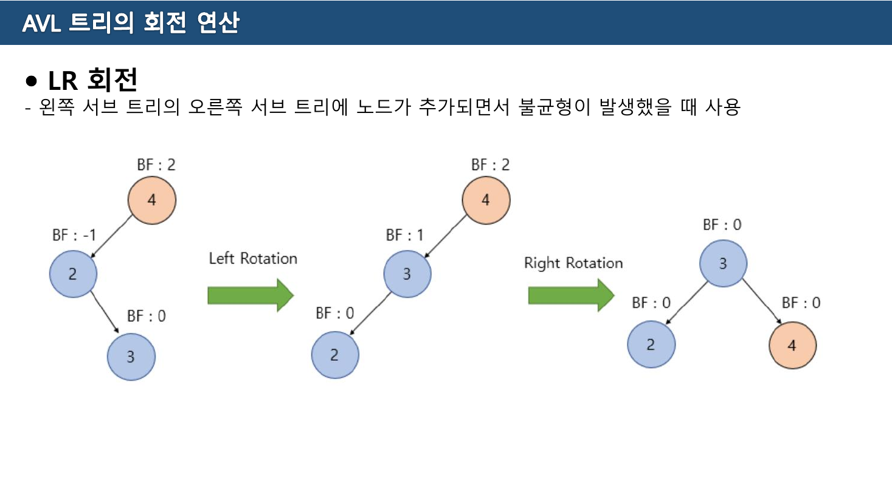
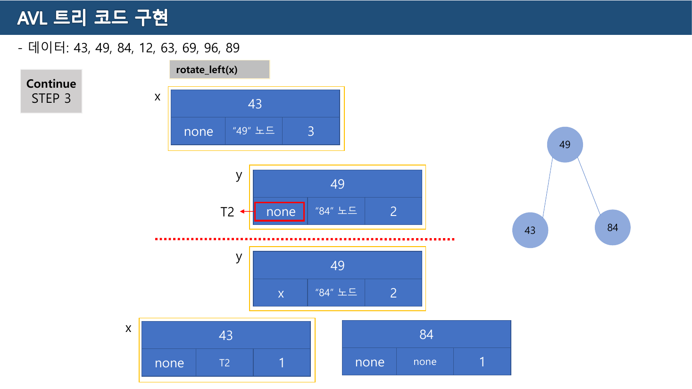
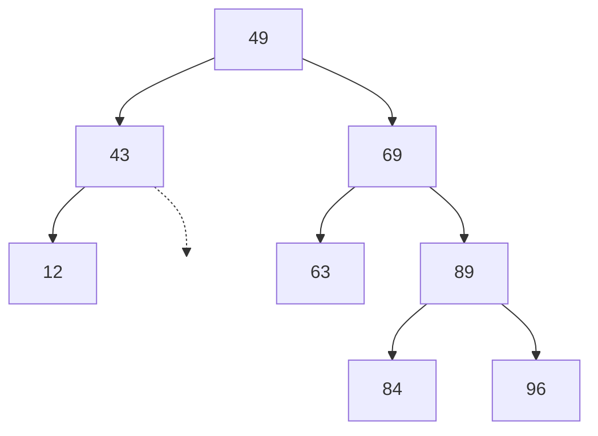

> [!abstract] 슬라이드 두 장이 똑같이 생긴 이유
> 10주차(BST구현) 3쪽은 **삽입**을, 4쪽은 **탐색**을 설명한다. 그런데 두 쪽의 그림이 같고, 단계 서술도 `Step 1: 비교 → Step 2: 비교 → Step 3: …` 로 똑같다. 4쪽은 아예 이렇게 적는다 — *"삽입 메소드 동작과 유사한 동작 / 삽입 메소드를 참조하여 구현"*.
>
> 이것은 슬라이드를 아낀 것이 아니라 사실의 진술이다. **BST에서 무엇을 하든 루트에서 시작해 한 줄기 길을 내려간다.** 삽입은 그 길 끝에 노드를 붙이는 것이고, 탐색은 그 길 위에서 값을 만나는 것이다.
>
> 그러면 모든 비용은 하나의 수로 결정된다 — **그 길의 길이**. 그리고 그 길이는 [07장 11쪽](./07.%20%ED%8A%B8%EB%A6%AC%20%E2%80%94%20%EC%9E%90%EC%8B%9D%EC%9D%B4%20%EB%91%98%EC%9D%84%20%EB%84%98%EC%9C%BC%EB%A9%B4%20%EA%B0%90%EB%8B%B9%EC%9D%B4%20%EC%95%88%20%EB%90%9C%EB%8B%A4.md)이 정의한 트리의 높이다. 11주차의 AVL은 **그 길이에 상한을 씌우기 위한 장치**이고, 이 장은 그 대가가 무엇인지를 따라간다.

---

## 1. 한 줄기 길 — 삽입과 탐색

10주차(BST구현) 2쪽이 만들 메소드 네 개를 나열한다.

```text
1. 삽입 (insert)
2. 탐색 (search)
3. 중위 순회 출력 (inorder_print)
4. (추가) 레벨 별 출력 (levelOrder_print)
```

3쪽의 트리는 `80 → 60, 99` / `60 → 48, 68` 이고, 여기에 `35` 를 넣는다.



> \- "35" 데이터 입력시
> Step 1: "80" 과 "35" 비교, 왼쪽 서브트리 존재유무 판단, 왼쪽 서브트리 이동
> Step 2: "60" 과 "35" 비교, 왼쪽 서브트리 존재유무 판단 왼쪽 서브트리 이동
> Step 3: "48" 과 "35" 비교, 왼쪽 서브트리 존재유무 판단 **왼쪽 서브트리 노드 생성**

각 Step이 하는 일이 정확히 둘이다 — **비교하고, 그쪽 자식이 있는지 본다.** 있으면 내려가고, 없으면 거기가 자리다.



4쪽의 탐색도 똑같다.

> \- "68" 데이터 검색시
> Step 1: "80" 과 "68" 비교, 왼쪽 서브트리 존재유무 판단, 왼쪽 서브트리 이동
> Step 2: "60" 과 "68" 비교, 오른쪽 서브트리 존재유무 판단 오른쪽 서브트리 이동
> Step 3: "68" 과 "68" 비교, **return 노드**

마지막 Step만 다르다. 삽입은 **없는 자리**를 찾아 만들고, 탐색은 **있는 값**을 찾아 돌려준다.

```python
def insert(self, value):                      # 원본 3쪽을 코드로
    if self.root is None:
        self.root = TreeNode(value); return
    cur = self.root
    while True:
        if value < cur.value:
            if cur.left is None:
                cur.left = TreeNode(value); return    # 없으면 여기가 자리
            cur = cur.left                            # 있으면 내려간다
        else:
            if cur.right is None:
                cur.right = TreeNode(value); return
            cur = cur.right

def search(self, value):                      # 원본 4쪽 — "삽입을 참조하여 구현"
    cur = self.root
    while cur is not None:
        if value == cur.value: return cur     # 여기만 다르다
        cur = cur.left if value < cur.value else cur.right
    return None
```

아래에서 두 연산을 같은 트리 위에서 걸어 볼 수 있다. 노드 값은 원본 3~7쪽 그대로다.

```html preview
<div id="bs-root">
  <style>
    #bs-root{font-family:system-ui,-apple-system,"Segoe UI",sans-serif;color:var(--foreground);background:var(--card);
      border:1px solid var(--border);border-radius:10px;padding:16px}
    #bs-root h4{margin:0 0 4px;font-size:14px}
    #bs-root .sub{font-size:12px;opacity:.7;margin-bottom:12px}
    #bs-root .bar{display:flex;gap:8px;flex-wrap:wrap;align-items:center;margin-bottom:12px}
    #bs-root button{font:inherit;font-size:12.5px;padding:6px 12px;border-radius:7px;cursor:pointer;
      border:1px solid var(--border);background:transparent;color:var(--foreground)}
    #bs-root button.sel{border-color:var(--chart-1);color:var(--chart-1)}
    #bs-root button:disabled{opacity:.4;cursor:default}
    #bs-root svg{width:100%;height:auto;display:block}
    #bs-root .say{font-family:ui-monospace,SFMono-Regular,Menlo,monospace;font-size:12.5px;margin-top:11px;
      border-left:3px solid var(--chart-2);padding:8px 0 8px 11px;line-height:1.8;white-space:pre-wrap;min-height:4.2em}
  </style>
  <h4>BST의 한 줄기 길 — 삽입과 탐색은 같은 걸음이다</h4>
  <div class="sub">원본 10주차(BST구현) 3·4쪽의 트리와 값 그대로.</div>
  <div class="bar">
    <button id="bs-ins" class="sel">삽입: 35 (3쪽)</button>
    <button id="bs-sea">탐색: 68 (4쪽)</button>
    <button id="bs-step">▶ Step</button>
    <button id="bs-reset">처음으로</button>
  </div>
  <svg id="bs-svg" viewBox="0 0 620 250" role="img" aria-label="BST 삽입과 탐색"></svg>
  <div class="say" id="bs-say"></div>
</div>
<script>
(function(){
  var POS={80:[310,30],60:[190,92],99:[440,92],48:[120,154],68:[262,154],35:[70,214]};
  var EDGE=[[80,60],[80,99],[60,48],[60,68],[48,35]];
  var CASES={
    ins:{target:35, steps:[
      {at:80, txt:'Step 1: "80" 과 "35" 비교 → 35 < 80, 왼쪽 서브트리 존재 → 이동'},
      {at:60, txt:'Step 2: "60" 과 "35" 비교 → 35 < 60, 왼쪽 서브트리 존재 → 이동'},
      {at:48, txt:'Step 3: "48" 과 "35" 비교 → 35 < 48, 왼쪽 서브트리 없음 → <b>여기에 노드 생성</b>'},
      {at:35, txt:'삽입 완료. 새 노드는 언제나 <b>단말</b>로 붙는다 — 기존 트리는 하나도 안 건드렸다.'}
    ]},
    sea:{target:68, steps:[
      {at:80, txt:'Step 1: "80" 과 "68" 비교 → 68 < 80, 왼쪽 서브트리 존재 → 이동'},
      {at:60, txt:'Step 2: "60" 과 "68" 비교 → 68 > 60, 오른쪽 서브트리 존재 → 이동'},
      {at:68, txt:'Step 3: "68" 과 "68" 비교 → 같다. <b>return 노드</b>'}
    ]}
  };
  var cur="ins", k=0;
  var bi=document.getElementById("bs-ins"), bs=document.getElementById("bs-sea");
  bi.onclick=function(){ cur="ins"; k=0; render(); };
  bs.onclick=function(){ cur="sea"; k=0; render(); };
  document.getElementById("bs-step").onclick=function(){ if(k<CASES[cur].steps.length) k++; render(); };
  document.getElementById("bs-reset").onclick=function(){ k=0; render(); };
  function render(){
    bi.classList.toggle("sel",cur==="ins"); bs.classList.toggle("sel",cur==="sea");
    var C=CASES[cur];
    document.getElementById("bs-step").disabled = k>=C.steps.length;
    var path=C.steps.slice(0,k).map(function(s){return s.at;});
    var newNode = (cur==="ins" && k>=4);
    var S="";
    EDGE.forEach(function(e){
      if(e[1]===35 && !newNode) return;
      var on = path.indexOf(e[0])>=0 && path.indexOf(e[1])>=0;
      S+='<line x1="'+POS[e[0]][0]+'" y1="'+(POS[e[0]][1]+18)+'" x2="'+POS[e[1]][0]+'" y2="'+(POS[e[1]][1]-18)+'" stroke="'+(on?"var(--chart-1)":"var(--border)")+'" stroke-width="'+(on?2.2:1.2)+'"/>';
    });
    Object.keys(POS).forEach(function(kk){
      var v=parseInt(kk,10);
      if(v===35 && !newNode) {
        if(cur==="ins" && k===3){
          S+='<circle cx="'+POS[v][0]+'" cy="'+POS[v][1]+'" r="19" fill="none" stroke="var(--chart-1)" stroke-dasharray="4 3"/>';
          S+='<text x="'+POS[v][0]+'" y="'+(POS[v][1]+5)+'" text-anchor="middle" font-size="13" fill="var(--chart-1)">35?</text>';
        }
        return;
      }
      var on = path.length && path[path.length-1]===v;
      var vis = path.indexOf(v)>=0;
      var c = on? "var(--chart-1)" : (vis? "var(--chart-2)" : "var(--border)");
      S+='<circle cx="'+POS[v][0]+'" cy="'+POS[v][1]+'" r="19" fill="none" stroke="'+c+'" stroke-width="'+(on?2.6:1.4)+'"/>';
      S+='<text x="'+POS[v][0]+'" y="'+(POS[v][1]+5)+'" text-anchor="middle" font-size="13.5" fill="'+(vis?c:"var(--foreground)")+'">'+v+'</text>';
    });
    S+='<text x="14" y="240" font-size="11.5" fill="var(--chart-2)">지나온 길이 굵게 표시된다 — 갈래는 없다</text>';
    document.getElementById("bs-svg").innerHTML=S;
    document.getElementById("bs-say").innerHTML = k===0
      ? "Step 을 눌러 진행한다. "+(cur==="ins"?"35 를 삽입한다.":"68 을 찾는다.")
      : C.steps.slice(0,k).map(function(s){return s.txt;}).join("\n");
  }
  render();
})();
</script>
```

**여기서 나오는 결론 하나.** 삽입은 언제나 단말 자리에 노드를 붙일 뿐, 기존 노드를 하나도 옮기지 않는다. [07장 10쪽](./07.%20%ED%8A%B8%EB%A6%AC%20%E2%80%94%20%EC%9E%90%EC%8B%9D%EC%9D%B4%20%EB%91%98%EC%9D%84%20%EB%84%98%EC%9C%BC%EB%A9%B4%20%EA%B0%90%EB%8B%B9%EC%9D%B4%20%EC%95%88%20%EB%90%9C%EB%8B%A4.md)이 장점으로 든 *"삽입 및 삭제 연산을 수행할 때 트리를 재조정할 필요가 없어"* 는 **삽입에 대해서는 정확히 맞는 말**이다.

---

## 2. 출력 두 가지 — 그리고 큐가 다시 온다

5쪽이 출력 방식을 둘로 나눈다.

> \- **중위순회 방식**을 이용할 경우 정렬 출력, 이진 트리 방식 참조
> \- **레벨 출력 방식**은 실제 입력된 형태로 출력 — **큐 자료형 또는 데크 자료형 활용**

두 출력이 같은 트리에서 서로 다른 목적을 갖는다.

| | 중위 순회 | 레벨 순회 |
| --- | --- | --- |
| 결과 | `35 48 60 68 80 99` | `80 60 99 48 68 35` |
| 보여주는 것 | **값의 순서** | **트리의 모양** |
| 도구 | 재귀 (사실상 스택) | **큐** |
| 근거 | [07장 6절](./07.%20%ED%8A%B8%EB%A6%AC%20%E2%80%94%20%EC%9E%90%EC%8B%9D%EC%9D%B4%20%EB%91%98%EC%9D%84%20%EB%84%98%EC%9C%BC%EB%A9%B4%20%EA%B0%90%EB%8B%B9%EC%9D%B4%20%EC%95%88%20%EB%90%9C%EB%8B%A4.md) L·V·R | [06장](./06.%20%ED%81%90%EC%99%80%20%EB%8D%B0%ED%81%AC%20%E2%80%94%20%EA%B5%90%EC%9E%AC%EA%B0%80%20%EA%B3%B5%EC%A7%9C%EB%9D%BC%20%ED%95%9C%20%EC%9E%90%EB%A6%AC%EB%A5%BC%20%EC%8B%A4%EC%8A%B5%EC%9D%80%20%EB%AC%B8%EC%A0%9C%EC%A0%90%EC%9D%B4%EB%9D%BC%20%EB%B6%80%EB%A5%B8%EB%8B%A4.md) 39쪽 "이진 트리의 레벨 순회" |



6·7쪽이 큐의 상태를 단계별로 그린다.

```text
Step 1: Queue 자료형 또는 deQue 자료형 생성
Step 2: root 노드 삽입                          큐: [80]
Step 3: root 노드 pop() 후 데이터 출력
        root 노드 left, right 노드 append       출력 80    큐: [60, 99]
Step 4: "60" 노드 pop() 후 출력, 자식 append     출력 60    큐: [99, 48, 68]
Step 5: "99" 노드 pop() 후 출력, 자식 append
        ("99" 노드 left, right 가 "none" 이므로 패스)   출력 99    큐: [48, 68]
★ 위 동작을 반복 수행하여 출력
```

```python
from collections import deque

def levelOrder_print(self):
    if self.root is None: return
    q = deque([self.root])
    while q:
        node = q.popleft()          # pop() — 앞에서
        print(node.value, end=' ')
        if node.left:  q.append(node.left)    # append — 뒤에
        if node.right: q.append(node.right)
```

**왜 큐인가.** 레벨 순회는 "먼저 발견한 노드를 먼저 출력"해야 한다. 노드 80을 처리하며 60과 99를 발견했고, 60을 처리하며 48·68을 발견했다면, 출력 순서는 발견 순서와 같아야 한다 — 60, 99, 48, 68. 이것이 [06장](./06.%20%ED%81%90%EC%99%80%20%EB%8D%B0%ED%81%AC%20%E2%80%94%20%EA%B5%90%EC%9E%AC%EA%B0%80%20%EA%B3%B5%EC%A7%9C%EB%9D%BC%20%ED%95%9C%20%EC%9E%90%EB%A6%AC%EB%A5%BC%20%EC%8B%A4%EC%8A%B5%EC%9D%80%20%EB%AC%B8%EC%A0%9C%EC%A0%90%EC%9D%B4%EB%9D%BC%20%EB%B6%80%EB%A5%B8%EB%8B%A4.md)의 FIFO 그 자체다.

스택으로 바꾸면 같은 코드가 **깊이 우선**이 된다. 자료구조 하나 바꾸는 것이 순회 방식을 통째로 바꾼다.

> [!tip] 5쪽의 "실제 입력된 형태로 출력"
> 레벨 순회 결과 `80 60 99 48 68 35` 는 이 트리를 만든 삽입 순서이기도 하다. 삽입 순서를 그대로 다시 넣으면 같은 트리가 만들어진다. 반면 **중위 순회 결과를 그대로 넣으면 한쪽으로 늘어진 트리**가 된다 — 3절이 말하는 최악의 경우다.

---

## 3. 길이 무너질 때

11주차(AVL) 2쪽은 문제 제기부터 시작한다. [07장 11쪽](./07.%20%ED%8A%B8%EB%A6%AC%20%E2%80%94%20%EC%9E%90%EC%8B%9D%EC%9D%B4%20%EB%91%98%EC%9D%84%20%EB%84%98%EC%9C%BC%EB%A9%B4%20%EA%B0%90%EB%8B%B9%EC%9D%B4%20%EC%95%88%20%EB%90%9C%EB%8B%A4.md)의 단점 목록을 이어받는다.

> ※ 이진 탐색 트리
> \- 자료를 탐색하는데 최적화된 트리
> \- 자료가 **오름차순이나 내림차순과 같은 순서대로 입력** 될 경우 **연결리스트와 같은 형태** ⇒ 빠른 검색속도를 이용하지 못함
> → 해결알고리즘 : 완전 이진 탐색 트리
>
> ※ 완전 이진 탐색 트리
> \- 트리에 자료가 삽입될 때 마다 완전 이진 탐색 트리 형태 유지를 위해 **모양 변경 동작 발생**
> \- **삽입할 때 많은 시간 소요** / 삽입이 적고 탐색이 많은 경우 유리
> ⇒ 삽입동작이 빈도수가 높아질수록 효율성 감소
> → 해결알고리즘 : **AVL 트리**

세 단계로 문제를 좁혀 들어간다. 이 흐름이 이 장의 뼈대다.



가운데 상자가 중요하다. **완전 이진 탐색 트리는 실패한 해결책이 아니라 너무 비싼 해결책**이다. 모양을 완벽하게 유지하려면 삽입 하나에 트리 전체가 흔들린다. AVL은 요구를 낮춘다 — 완벽하지 않아도 되고, **모든 노드에서 좌우 높이 차가 1 이하**면 된다.

---

## 4. 균형 인수 — 트리에 숫자를 붙인다

3쪽이 AVL을 정의한다.

> ※ AVL 트리
> \- 1962년 **Adelson-Velskii 와 Landis**에 의해 제안
> \- 트리 내의 모든 노드에 대해 왼쪽 서브 트리의 높이와 오른쪽 서브 트리의 높이가 **1이상 차이가 나지 않는** 균형 이진 트리
> \- 이진 탐색 트리 내의 임의의 노드 N에 대해서 균형 인수 BF(N)가 **-1, 0, 1** 의 값을 갖는 트리
>
> ※ AVL 균형인수
> \- 왼쪽 서브트리의 높이와 오른쪽 서브트리의 높이 차를 말함
> \- **BF(T) = height(left tree) – height(right tree)**

정의 두 줄 사이에 어긋나는 곳이 있다.

> [!caution] 원본 오류 — "1이상 차이가 나지 않는"
> 글자 그대로 읽으면 "차이가 1 이상이면 안 된다", 즉 **차이가 0이어야 한다**는 뜻이 된다. 그러나 바로 다음 줄이 BF가 `-1, 0, 1` 을 갖는다고 하므로, 차이 1은 허용된다.
>
> 올바른 표현은 **"1을 초과해 차이가 나지 않는"** 또는 **"높이 차이가 1 이하인"** 이다. [9주차 10쪽](./07.%20%ED%8A%B8%EB%A6%AC%20%E2%80%94%20%EC%9E%90%EC%8B%9D%EC%9D%B4%20%EB%91%98%EC%9D%84%20%EB%84%98%EC%9C%BC%EB%A9%B4%20%EA%B0%90%EB%8B%B9%EC%9D%B4%20%EC%95%88%20%EB%90%9C%EB%8B%A4.md)이 균형 이진 트리를 정의할 때는 *"높이 차이가 1 이하인 트리"* 라고 정확히 적었다. 같은 개념을 두 주차에서 다르게 적은 것이다.

BF의 부호가 **어느 쪽이 무거운지**를 말한다.

| BF | 뜻 | 상태 |
| --- | --- | --- |
| `+2` 이상 | 왼쪽이 훨씬 높다 | 불균형 — **L**로 시작하는 회전 |
| `+1` | 왼쪽이 하나 높다 | 정상 |
| `0` | 같다 | 정상 |
| `-1` | 오른쪽이 하나 높다 | 정상 |
| `-2` 이하 | 오른쪽이 훨씬 높다 | 불균형 — **R**로 시작하는 회전 |

11주차(AVL코드구현) 2쪽이 이 계산을 노드 그림에 직접 붙여 놓는다 — *"`get_balance()` = -1 / 왼쪽 노드 높이 값 – 오른쪽 노드 높이 값"*.

---

## 5. 네 가지 회전

4쪽은 이 자료에서 텍스트가 가장 많은 쪽(431자)이고, 회전 네 가지를 한 표에 담는다.



> \- AVL 트리에서의 삽입, 삭제 과정은 **이진 탐색 트리에서의 삽입 삭제 과정과 동일**
> \- 삽입, 삭제 후 균형 인수에 따라 트리를 **재조정하는 과정이 필요**
> \- 균형인수(BF)를 -1이상에서 1 이하로 조절하는 재조정 동작

| 회전 유형 | 언제 (원본 설명) | 방식 |
| --- | --- | --- |
| **LL 회전** | 노드 N이 A의 **왼쪽** 서브 트리의 **왼쪽** 서브 트리에 삽입 | Single Right Rotation — A를 기준으로 한번의 **시계 방향** 회전 |
| **LR 회전** | 노드 N이 A의 **왼쪽** 서브 트리의 **오른쪽** 서브 트리에 삽입 | Left-Right Rotation — A의 왼쪽 자식을 기준으로 **반시계** 회전 후 A를 기준으로 **시계** 회전 |
| **RR 회전** | 노드 N이 A의 **오른쪽** 서브 트리의 **오른쪽** 서브 트리에 삽입 | Single Left Rotation — A를 기준으로 한번의 **반시계 방향** 회전 |
| **RL 회전** | 노드 N이 A의 **오른쪽** 서브 트리의 **왼쪽** 서브 트리에 삽입 | Right-Left Rotation — A의 오른쪽 자식 기준 **시계** 회전 후 A 기준 **반시계** 회전 |

이름을 외울 필요가 없다. **이름 두 글자가 새 노드가 내려간 길**이고, **회전 방향은 그 반대**다.

- 왼쪽으로 두 번 내려갔다(LL) → 오른쪽으로 한 번 돌린다
- 오른쪽으로 두 번 내려갔다(RR) → 왼쪽으로 한 번 돌린다
- 방향이 꺾였다(LR·RL) → 먼저 **곧게 펴고**(자식을 회전), 그다음 위와 같이 돌린다



5쪽의 예가 가장 단순하다. `3 → 2 → 1` 로 왼쪽으로만 늘어진 트리에서 3의 BF는 2다. 3을 기준으로 시계 방향으로 한 번 돌리면 2가 루트가 되고 1·3이 자식이 되어 모든 BF가 0이 된다.



7쪽의 LR이 왜 두 번인지를 보여준다. `4 → 2 → 3`(왼쪽 다음 오른쪽)에서 곧바로 4를 시계로 돌리면 균형이 잡히지 않는다. 먼저 2를 반시계로 돌려 `4 → 3 → 2` 라는 **LL 모양**을 만든 뒤, 그 다음에 4를 시계로 돌린다. 원본 그림이 중간 단계의 BF를 `2 / 1 / 0` 으로 표시해 그 사실을 드러낸다.

아래에서 네 경우를 모두 돌려 볼 수 있다. 노드 값과 BF는 원본 5~8쪽 그대로다.

```html preview
<div id="rt-root">
  <style>
    #rt-root{font-family:system-ui,-apple-system,"Segoe UI",sans-serif;color:var(--foreground);background:var(--card);
      border:1px solid var(--border);border-radius:10px;padding:16px}
    #rt-root h4{margin:0 0 4px;font-size:14px}
    #rt-root .sub{font-size:12px;opacity:.7;margin-bottom:12px}
    #rt-root .bar{display:flex;gap:8px;flex-wrap:wrap;align-items:center;margin-bottom:12px}
    #rt-root button{font:inherit;font-size:12.5px;padding:6px 12px;border-radius:7px;cursor:pointer;
      border:1px solid var(--border);background:transparent;color:var(--foreground)}
    #rt-root button.sel{border-color:var(--chart-1);color:var(--chart-1)}
    #rt-root button:disabled{opacity:.4;cursor:default}
    #rt-root svg{width:100%;height:auto;display:block}
    #rt-root .say{font-size:12.5px;margin-top:10px;line-height:1.7;min-height:3.4em}
  </style>
  <h4>네 가지 회전 — 이름이 곧 내려간 길이다</h4>
  <div class="sub">원본 11주차 5~8쪽의 예제 값. 노드 옆 숫자가 BF다.</div>
  <div class="bar"><span id="rt-kinds"></span>
    <button id="rt-step">▶ 회전</button><button id="rt-reset">처음으로</button></div>
  <svg id="rt-svg" viewBox="0 0 640 210" role="img" aria-label="AVL 회전"></svg>
  <div class="say" id="rt-say"></div>
</div>
<script>
(function(){
  // 각 단계: {nodes:{v:[x,y,bf]}, edges:[[a,b]], note}
  function T(list, edges, note){ return {nodes:list, edges:edges, note:note}; }
  var CASES={
    LL:{label:"LL (Right)", frames:[
      T({3:[300,32,2],2:[210,100,1],1:[120,168,0]}, [[3,2],[2,1]], "왼쪽으로 두 번 내려갔다. 3의 BF = 2 → <b>3을 기준으로 시계 방향 1회</b>"),
      T({2:[300,60,0],1:[210,140,0],3:[390,140,0]}, [[2,1],[2,3]], "2가 루트로 올라오고 3이 오른쪽으로 내려갔다. 모든 BF가 0.")
    ]},
    RR:{label:"RR (Left)", frames:[
      T({1:[300,32,-2],2:[390,100,-1],3:[480,168,0]}, [[1,2],[2,3]], "오른쪽으로 두 번 내려갔다. 1의 BF = −2 → <b>1을 기준으로 반시계 방향 1회</b>"),
      T({2:[300,60,0],1:[210,140,0],3:[390,140,0]}, [[2,1],[2,3]], "LL의 거울상이다. 결과 모양은 같다.")
    ]},
    LR:{label:"LR (Left→Right)", frames:[
      T({4:[300,32,2],2:[200,100,-1],3:[290,168,0]}, [[4,2],[2,3]], "왼쪽 다음 오른쪽 — 꺾였다. 먼저 <b>2를 반시계로</b> 돌려 곧게 편다."),
      T({4:[300,32,2],3:[200,100,1],2:[110,168,0]}, [[4,3],[3,2]], "이제 LL 모양이 되었다. 다음은 <b>4를 시계로</b>."),
      T({3:[300,60,0],2:[210,140,0],4:[390,140,0]}, [[3,2],[3,4]], "3이 루트. 두 번 돌아 균형이 맞았다.")
    ]},
    RL:{label:"RL (Right→Left)", frames:[
      T({1:[300,32,-2],4:[400,100,1],3:[310,168,0]}, [[1,4],[4,3]], "오른쪽 다음 왼쪽 — 꺾였다. 먼저 <b>4를 시계로</b> 돌려 곧게 편다."),
      T({1:[300,32,-2],3:[400,100,-1],4:[490,168,0]}, [[1,3],[3,4]], "이제 RR 모양. 다음은 <b>1을 반시계로</b>."),
      T({3:[300,60,0],1:[210,140,0],4:[390,140,0]}, [[3,1],[3,4]], "3이 루트. 결과는 LR과 대칭이다.")
    ]}
  };
  var keys=["LL","RR","LR","RL"], cur=0, f=0;
  var kb=document.getElementById("rt-kinds");
  keys.forEach(function(k,i){
    var b=document.createElement("button"); b.textContent=CASES[k].label; b.style.marginRight="6px";
    b.onclick=function(){ cur=i; f=0; render(); }; kb.appendChild(b);
  });
  document.getElementById("rt-step").onclick=function(){ var F=CASES[keys[cur]].frames; if(f<F.length-1) f++; render(); };
  document.getElementById("rt-reset").onclick=function(){ f=0; render(); };
  function render(){
    Array.prototype.forEach.call(kb.children,function(b,i){ b.classList.toggle("sel",i===cur); });
    var F=CASES[keys[cur]].frames, fr=F[f];
    document.getElementById("rt-step").disabled = f>=F.length-1;
    var S="";
    fr.edges.forEach(function(e){
      var a=fr.nodes[e[0]], b=fr.nodes[e[1]];
      S+='<line x1="'+a[0]+'" y1="'+(a[1]+20)+'" x2="'+b[0]+'" y2="'+(b[1]-20)+'" stroke="var(--border)" stroke-width="1.4"/>';
    });
    Object.keys(fr.nodes).forEach(function(v){
      var n=fr.nodes[v], bad=Math.abs(n[2])>1;
      var c = bad? "var(--chart-3)" : "var(--chart-1)";
      S+='<circle cx="'+n[0]+'" cy="'+n[1]+'" r="20" fill="none" stroke="'+c+'" stroke-width="'+(bad?2.6:1.6)+'"/>';
      S+='<text x="'+n[0]+'" y="'+(n[1]+6)+'" text-anchor="middle" font-size="15" fill="'+c+'">'+v+'</text>';
      S+='<text x="'+(n[0]-30)+'" y="'+(n[1]-16)+'" text-anchor="end" font-size="11.5" fill="'+(bad?"var(--chart-3)":"var(--chart-2)")+'">BF '+(n[2]>0?"+":"")+n[2]+'</text>';
    });
    S+='<text x="16" y="200" font-size="11.5" fill="var(--chart-2)">'+(f+1)+' / '+F.length+' 단계</text>';
    document.getElementById("rt-svg").innerHTML=S;
    document.getElementById("rt-say").innerHTML=fr.note;
  }
  render();
})();
</script>
```

---

## 6. 코드가 노드에 하나를 더 얹는다

11주차(AVL코드구현) 2쪽이 AVL의 진짜 대가를 보여준다. 노드 구조에 칸이 하나 늘었다.

```text
- Node 구조

          DATA
   left  |  right  |  height        ← 이 칸이 새로 생겼다
```

[07장 6절](./07.%20%ED%8A%B8%EB%A6%AC%20%E2%80%94%20%EC%9E%90%EC%8B%9D%EC%9D%B4%20%EB%91%98%EC%9D%84%20%EB%84%98%EC%9C%BC%EB%A9%B4%20%EA%B0%90%EB%8B%B9%EC%9D%B4%20%EC%95%88%20%EB%90%9C%EB%8B%A4.md)의 `TreeNode` 는 `value · left · right` 셋이었다. AVL은 **`height` 를 노드마다 저장한다.**

```python
class AVLNode:
    def __init__(self, value):
        self.value = value
        self.left = None
        self.right = None
        self.height = 1        # 단말 노드의 높이는 1
```

왜 저장하는가. BF를 구하려면 좌우 서브 트리의 높이가 필요한데, 그것을 매번 [07장 9쪽의 `calc_height`](./07.%20%ED%8A%B8%EB%A6%AC%20%E2%80%94%20%EC%9E%90%EC%8B%9D%EC%9D%B4%20%EB%91%98%EC%9D%84%20%EB%84%98%EC%9C%BC%EB%A9%B4%20%EA%B0%90%EB%8B%B9%EC%9D%B4%20%EC%95%88%20%EB%90%9C%EB%8B%A4.md)로 계산하면 **서브 트리 전체를 훑어야 한다** — 삽입 한 번에 O(n)이 든다. 미리 저장해 두면 O(1)에 읽고, 회전할 때만 관련 노드 둘의 값을 고쳐 주면 된다.

**공간을 내주고 시간을 산 것**이다. 2쪽의 STEP 1·2가 그 값을 직접 보여준다.

```text
STEP 1   43 : left=none, right=none, height=1
STEP 2   43 : left=none, right="49" node, height=2      get_balance() = -1
         49 : left=none, right=none, height=1
```

3쪽에서 불균형이 처음 나온다.

```text
STEP 3   43 : left=none, right="49" node, height=3      get_balance() = -2
         49 : left=none, right="84" node, height=2      get_balance() = -1   → 불균형 발생
         84 : left=none, right=none, height=1
                                                        - 음수 값이고, 49 < 84 이므로
                                                        - RR 회전 동작
```

판정 조건 두 개가 여기 다 있다 — **BF의 부호**(음수 → R로 시작)와 **오른쪽 자식과 새 값의 비교**(49 < 84 → 오른쪽의 오른쪽, 즉 RR).



4쪽이 `rotate_left` 를 세 단계 그림으로 쪼갠다. `x` 는 불균형 노드(43), `y` 는 그 오른쪽 자식(49), `T2` 는 **`y` 의 왼쪽 서브 트리**(여기서는 `none`)다.

```python
def rotate_left(self, x):
    y  = x.right
    T2 = y.left        # ← 빨간 상자로 강조된 부분

    y.left  = x        # y 가 위로
    x.right = T2       # x 는 T2 를 데려간다

    x.height = 1 + max(h(x.left), h(x.right))   # 아래쪽부터
    y.height = 1 + max(h(y.left), h(y.right))   # 위쪽 순서로 갱신
    return y
```

`T2` 를 따로 잡아 두는 것이 회전의 핵심이다. `y` 가 위로 올라가면 `y.left` 자리는 `x` 가 차지해야 하는데, 원래 거기 있던 서브 트리를 어딘가에 붙여야 한다. **BST 성질상 `T2` 의 값은 모두 `x` 보다 크고 `y` 보다 작으므로, `x` 의 오른쪽이 정확히 그 자리**다.

높이 갱신 순서도 중요하다. `x` 가 아래로 내려갔으므로 `x` 를 먼저, 그다음 `x` 를 자식으로 갖게 된 `y` 를 갱신해야 한다. 순서를 바꾸면 `y` 가 옛 높이를 보고 계산한다.

5쪽은 `rotate_right` 를 과제로 남긴다.

> \- `rotate_left` 를 참조하여 `rotate_right`를 임의 데이터를 이용하여 도식화 해 보세요. (코드 참조)

좌우를 바꾸면 그대로다.

```python
def rotate_right(self, y):
    x  = y.left
    T2 = x.right
    x.right = y
    y.left  = T2
    y.height = 1 + max(h(y.left), h(y.right))
    x.height = 1 + max(h(x.left), h(x.right))
    return x
```

---

## 7. 과제 데이터를 끝까지 돌려 보면

9쪽이 낸 Try 문제다.

> 다음의 데이터를 AVL트리 알고리즘을 이용하여 트리를 구성하는 과정을 보여라.
> 데이터: **43, 49, 84, 12, 63, 69, 96, 89**

11주차(AVL코드구현) 자료는 이 데이터로 STEP 3까지만 설명하고 멈춘다. 끝까지 돌려 보면 이렇게 된다. 아래 표는 직접 구현해 얻은 결과이며, 원본 2·3·4쪽의 STEP 1~3과 일치한다.

| 삽입 | 회전 | 결과 트리 (부모(왼쪽,오른쪽)) | 높이 | 레벨 순회 |
| --- | --- | --- | --- | --- |
| 43 | — | `43` | 1 | 43 |
| 49 | — | `43(·,49)` | 2 | 43 49 |
| 84 | **43에서 BF=−2 → RR** | `49(43,84)` | 2 | 49 43 84 |
| 12 | — | `49(43(12,·),84)` | 3 | 49 43 84 12 |
| 63 | — | `49(43(12,·),84(63,·))` | 3 | 49 43 84 12 63 |
| 69 | **84에서 BF=+2 → LR** | `49(43(12,·),69(63,84))` | 3 | 49 43 69 12 63 84 |
| 96 | — | `49(43(12,·),69(63,84(·,96)))` | 4 | 49 43 69 12 63 84 96 |
| 89 | **84에서 BF=−2 → RL** | `49(43(12,·),69(63,89(84,96)))` | 4 | 49 43 69 12 63 89 84 96 |

최종 트리는 이렇다.



> [!tip] 이 데이터가 고른 세 가지
> 여덟 번의 삽입에서 회전이 세 번 일어나는데, **RR · LR · RL** 이 하나씩이고 **LL은 한 번도 나오지 않는다.** 4쪽 표의 네 유형 중 셋만 연습되는 셈이다.
>
> LL을 보고 싶다면 반대로 내려가는 값을 넣으면 된다 — 예컨대 `43, 12, 5` 를 순서대로 넣으면 43에서 BF=+2가 되고 5 < 12 이므로 LL(Single Right Rotation)이 발생한다. 이 확인은 원본에 없는 보충이다.

노드 8개짜리 AVL 트리의 높이는 4다. 같은 데이터를 **정렬해서**(12, 43, 49, 63, 69, 84, 89, 96) 그냥 BST에 넣으면 높이가 8인 연결 리스트가 된다. 2쪽이 경고한 바로 그 상황이고, AVL이 회전 세 번으로 막아 낸 것이 그 차이다.

---

## 8. 3차 과제 — 2-3 트리와 B-트리

10쪽이 이 학기 세 번째 과제를 낸다. 앞의 두 과제와 성격이 완전히 다르다.

> ▣ **2-3트리, B-트리에 대해 자료조사** 후 각 트리에 대해 설명(장단점 포함)하고, 실제 예시(삽입 동작)를 작성하여 제출하세요.
>
> \- 작성방법: **수기(자필)** / 분량: **4Page 이상**
> \- 제출마감: 5월 23일 까지 / 제출방법: 5월 23일 강의시작 전 제출
> \- 각 트리에 대한 설명, 장단점, 각 트리 별 실제 예시(그림 표기)
> \- **주의사항: 실제 삽입 동작 예시가 타 학생과 동일할 경우 레포트 점수 0점**

[3주차·6주차 과제](./03.%20%EC%A7%81%EC%A0%91%20%EC%A7%9C%20%EB%B3%B4%EB%A9%B4%20%EB%8B%AC%EB%9D%BC%EC%A7%80%EB%8A%94%20%EA%B2%83%20%E2%80%94%20%EA%B5%90%EC%88%98%EA%B0%80%20%EB%82%A8%EA%B8%B4%20%EB%8B%A4%EC%84%AF%20%EA%B0%9C%EC%9D%98%20Q.md)는 메일로 코드와 캡처를 내는 것이었는데, 이번에는 **손으로 써서 종이로** 낸다. 마지막 줄의 조건이 그 이유를 말한다 — 삽입 예시를 **직접 만들어야** 하고, 남과 같으면 0점이다.

주제가 AVL 다음에 오는 것도 자연스럽다. AVL은 이진 트리를 유지하면서 균형을 맞추는데, 2-3 트리와 B-트리는 **한 노드가 자식을 셋 이상 가질 수 있게 해서** 균형을 맞춘다. [07장 3절](./07.%20%ED%8A%B8%EB%A6%AC%20%E2%80%94%20%EC%9E%90%EC%8B%9D%EC%9D%B4%20%EB%91%98%EC%9D%84%20%EB%84%98%EC%9C%BC%EB%A9%B4%20%EA%B0%90%EB%8B%B9%EC%9D%B4%20%EC%95%88%20%EB%90%9C%EB%8B%A4.md)의 N-링크 표현으로 되돌아가는 셈이다. 원본은 이 연결을 말하지 않는다.

---

## 9. 예상문제

기말고사 공지용 자료 6번이 이 장 범위다.

> 6\. AVL 트리의 주요 특징은 무엇인가?
> ① 각 노드의 왼쪽과 오른쪽 서브트리의 높이 차가 1 이하로 유지된다.
> ② 모든 노드가 최대 두 개의 자식을 가진다.
> ③ 중위 순회를 통해 정렬된 배열을 얻는다.
> ④ 최대 높이가 log(n) 이하로 제한된다.

**답은 ①** 이다. 11주차 3쪽의 정의 그 자체다.

> [!warning] 이 문항은 보기 넷이 모두 참이다
> ②는 AVL도 이진 트리이므로 참이고, ③은 AVL이 BST이므로 참([07장 7절](./07.%20%ED%8A%B8%EB%A6%AC%20%E2%80%94%20%EC%9E%90%EC%8B%9D%EC%9D%B4%20%EB%91%98%EC%9D%84%20%EB%84%98%EC%9C%BC%EB%A9%B4%20%EA%B0%90%EB%8B%B9%EC%9D%B4%20%EC%95%88%20%EB%90%9C%EB%8B%A4.md)), ④도 균형 덕분에 성립하는 참인 성질이다.
>
> 다만 문제가 묻는 것은 **"주요 특징"** — AVL을 다른 트리와 구별해 주는 성질이다. ②③은 일반 이진 트리·BST와 공유하는 성질이라 AVL만의 특징이 아니고, ④는 ①에서 따라 나오는 **결과**다. 정의를 그대로 적은 ①이 답이다.
>
> 보기 전부가 참인 문항이므로, "틀린 것을 지우는" 방식으로는 풀리지 않는다. **원본 슬라이드의 정의 문장과 글자가 가장 가까운 보기**를 고르는 편이 안전하다.

---

## 다른 장과의 연결

- 이진 트리의 정의·순회·배열 표현 — [07. 트리](./07.%20%ED%8A%B8%EB%A6%AC%20%E2%80%94%20%EC%9E%90%EC%8B%9D%EC%9D%B4%20%EB%91%98%EC%9D%84%20%EB%84%98%EC%9C%BC%EB%A9%B4%20%EA%B0%90%EB%8B%B9%EC%9D%B4%20%EC%95%88%20%EB%90%9C%EB%8B%A4.md)
- 레벨 순회에 쓰는 큐 — [06. 큐와 데크](./06.%20%ED%81%90%EC%99%80%20%EB%8D%B0%ED%81%AC%20%E2%80%94%20%EA%B5%90%EC%9E%AC%EA%B0%80%20%EA%B3%B5%EC%A7%9C%EB%9D%BC%20%ED%95%9C%20%EC%9E%90%EB%A6%AC%EB%A5%BC%20%EC%8B%A4%EC%8A%B5%EC%9D%80%20%EB%AC%B8%EC%A0%9C%EC%A0%90%EC%9D%B4%EB%9D%BC%20%EB%B6%80%EB%A5%B8%EB%8B%A4.md)
- 정렬된 입력이 최악이 되는 또 하나의 알고리즘(퀵 정렬) — [10. 정렬 ②](./10.%20%EC%A0%95%EB%A0%AC%20%E2%91%A1%20%E2%80%94%20%EC%B2%AB%20%EB%B2%88%EC%A7%B8%20%EB%8B%A8%EA%B3%84%EB%9E%80%20%EB%AC%B4%EC%97%87%EC%9D%B8%EA%B0%80.md)
- 노드에 값을 하나 더 저장해 재계산을 피하는 발상 — [02. 리스트](./02.%20%EB%A6%AC%EC%8A%A4%ED%8A%B8%20%E2%80%94%20%EB%81%9D%EC%9D%84%20%EC%96%B4%EB%96%BB%EA%B2%8C%20%ED%91%9C%EC%8B%9C%ED%95%A0%20%EA%B2%83%EC%9D%B8%EA%B0%80.md)의 `size` 필드도 같은 종류의 거래다

---

## 근거 자료

| 원본 | 쪽 | 내용 | 이 문서에서 쓰인 곳 |
| --- | --- | --- | --- |
| 10주차(BST구현) | 2 | 구성 메소드 네 개 | 1절 |
| 10주차(BST구현) | **3** | 삽입 동작 예시 (35) | 1절 · 인용 · 인터랙티브 |
| 10주차(BST구현) | **4** | 탐색 동작 예시 (68) | 1절 · 인용 |
| 10주차(BST구현) | 5 | 출력 두 방식 | 2절 |
| 10주차(BST구현) | **6** · 7 | 레벨 출력 — 큐 단계별 | 2절 · 인용 |
| 11주차(AVL) | 2 | BST → 완전 이진 탐색 트리 → AVL | 3절 |
| 11주차(AVL) | 3 | AVL 정의와 균형 인수 | 4절 · **원본 오류** |
| 11주차(AVL) | **4** | 회전 네 가지 표 | 5절 · 인용 |
| 11주차(AVL) | **5** · 6 · **7** · 8 | LL · RR · LR · RL 그림 | 5절 · 인용 2장 · 인터랙티브 |
| 11주차(AVL) | 9 | Try 데이터 | 7절 |
| 11주차(AVL) | 10 | 3차 과제 (2-3트리, B-트리) | 8절 |
| 11주차(AVL코드구현) | 2 · 3 | Node 구조(height 칸) · STEP 1~3 | 6절 |
| 11주차(AVL코드구현) | **4** | `rotate_left(x)` 도해 | 6절 · 인용 |
| 11주차(AVL코드구현) | 5 | `rotate_right` 과제 | 6절 |
| 기말고사 공지용 | 1 | 객관식 6번 | 9절 |

- 7절의 8단계 추적표는 AVL 삽입을 직접 구현해 얻은 것이며, 원본 11주차(AVL코드구현) 2~4쪽의 STEP 1~3과 대조해 일치를 확인했다
- 텍스트 0자 페이지: 없음
- 발견한 원본 문제: 11주차 3쪽의 **"1이상 차이가 나지 않는"** (→ "1 이하"), 기말 6번의 **보기 넷이 모두 참인 구성**
