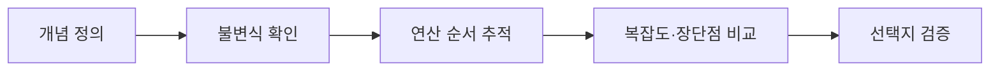

평가 자료는 자료구조의 정의와 연산, 연결 리스트, 트리·BST·순회, 정렬 알고리즘을 객관식으로 점검한다.



<Tabs>
  <Tab label="리스트">삽입·삭제의 링크 갱신, 랜덤 접근 불가, 배열과의 메모리 차이를 확인한다.</Tab>
  <Tab label="트리">부모·자식·차수·높이와 전위·중위·후위 순회를 구분한다.</Tab>
  <Tab label="BST">왼쪽 작음, 오른쪽 큼, 중위 순회 정렬이라는 불변식을 적용한다.</Tab>
  <Tab label="정렬">선택·삽입·힙·기수의 기준과 추가 메모리를 비교한다.</Tab>
</Tabs>

```html preview
<div style="font-family:system-ui,sans-serif;padding:20px;color:var(--foreground)">
<label for="amt" style="font-size:14px;font-weight:600">평가 범위</label>
<div id="out" style="font-size:30px;font-weight:700;color:var(--chart-1);margin:6px 0">1영역</div>
<input id="amt" type="range" min="1" max="4" step="1" value="1" style="width:100%;accent-color:var(--primary)" />
<p style="font-size:13px;color:var(--muted-foreground)">원본 주차 순서를 움직여 현재 자료의 핵심을 확인한다.</p>
<script>
var amt=document.getElementById('amt'); var out=document.getElementById('out');
amt.addEventListener('input',function(){out.textContent=Number(amt.value).toLocaleString()+'영역';});
</script>
</div>
```

| 점검 질문 | 답에 포함할 것 |
| --- | --- |
| 자료구조란? | 효율적인 저장과 연산 |
| BST 옳지 않은 설명은? | 불변식과 중복 처리 |
| 트리 순회인가? | 전위·중위·후위 |
| 정렬 단계는? | 최소값·교환 또는 삽입 위치 |

> [!TIP]
> 선택지에서 “항상” 같은 단정어를 만나면 자료의 조건(입력 순서, 안정성, 추가 공간)을 먼저 대조한다.

<details>
<summary>시험 전 4단계</summary>

정의 암기 → 작은 예제로 링크·스택·큐·트리 상태 추적 → 알고리즘 장단점 비교 → 예상문제의 오답 이유 설명.

</details>

<!-- source: midterm and final assessment decks; tested concepts and question structure preserved -->