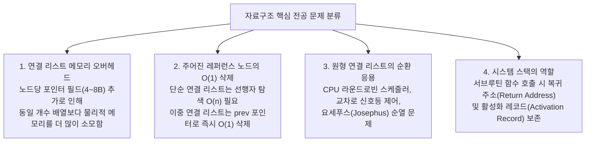

> [!abstract] 핵심 요약
> 자료구조의 선택은 문제의 **시간 복잡도($O(1)$ vs $O(n)$)**와 **공간 오버헤드(포인터 메모리)** 간의 최적 트레이드오프를 결정하는 작업이다.
> 중간·기말고사 기출 문항을 통해 연결 리스트의 $O(1)$ 삭제 조건, 원형 큐의 환형 순환 응용(라운드로빈, 요세푸스), 스택의 재귀 복귀 주소 관리, AVL 트리의 4대 회전 판별, 그리고 8대 정렬 알고리즘의 안정성(Stability)을 총정리한다.

---

## 1. 전공 평가 10대 빈출 핵심 개념 심층 분석



---

## 2. 핵심 기출 문제 5선 및 정답 추론

### [문제 1] 자료구조와 배열의 메모리 특성
**Q. 다음 중 연결 리스트에 관한 설명으로 옳지 않은 것은?**
- ① 연결 리스트의 삽입 또는 삭제는 항목 이동 측면에서 배열보다 효율적이다.
- ② 연결 리스트에서는 인덱스를 통한 랜덤 접근(Random Access)을 허용하지 않는다.
- ③ 연결 리스트는 노드 수를 미리 선언하지 않아도 동적으로 확장된다.
- ④ 연결 리스트는 배열보다 메모리를 덜 사용한다.

> **정답 및 해설: ④번**  
> 연결 리스트는 연속 배열과 달리 각 노드마다 실제 데이터 이외에 다음 노드를 가리키는 **포인터(참조) 필드(32비트 환경 4바이트, 64비트 환경 8바이트)**를 추가로 저장해야 하므로, 동일한 개수의 데이터를 저장할 때 배열보다 **물리적 메모리 소비량이 더 큽니다**.

### [문제 2] 이중 연결 리스트의 결정적 우위
**Q. 다음 중 단순 연결 리스트보다 이중 연결 리스트에서 더 효율적으로 수행되는 연산은?**
- ① 정렬 안 된 리스트에서 임의의 항목 탐색
- ② 리스트의 모든 노드 방문하기
- ③ 레퍼런스(포인터 `p`)가 주어진 노드의 삭제
- ④ 새 노드를 연결 리스트 맨 앞에 삽입

> **정답 및 해설: ③번**  
> 단순 연결 리스트에서 특정 노드 `p`를 삭제하려면 `p`의 바로 이전 노드(선행자)의 `next`를 `p.next`로 변경해야 하므로 헤드부터 `p`의 선행자를 찾는 $O(n)$ 탐색이 강제됩니다. 반면 이중 연결 리스트는 `p.prev` 포인터를 통해 선행자에 즉시 접근할 수 있어 **$O(1)$ 시간**에 삭제가 완결됩니다.

---

## 3. 실시간 자료구조 전공 역량 자가진단 인터랙티브 퀴즈

```html preview
<div style="font-family:system-ui,-apple-system,sans-serif;padding:20px;background:var(--card);color:var(--card-foreground);border:1px solid var(--border);border-radius:var(--radius)">
  <div style="font-size:16px;font-weight:700;margin-bottom:14px;color:var(--primary);display:flex;align-items:center;gap:8px">
    <span>📝 자료구조 중간·기말고사 실전 모의평가 채점기</span>
  </div>

  <div id="quizContainer" style="display:flex;flex-direction:column;gap:12px;margin-bottom:14px">
    <div style="padding:10px;background:var(--background);border:1px solid var(--border);border-radius:var(--radius)">
      <div style="font-size:12px;font-weight:700;margin-bottom:6px">Q1. 함수 호출 시 복귀 주소(Return Address)를 저장하는 자료구조는?</div>
      <label style="display:block;font-size:11px;margin:2px 0"><input type="radio" name="q1" value="queue" /> ① 큐 (Queue)</label>
      <label style="display:block;font-size:11px;margin:2px 0"><input type="radio" name="q1" value="stack" /> ② 스택 (Stack)</label>
      <label style="display:block;font-size:11px;margin:2px 0"><input type="radio" name="q1" value="tree" /> ③ 트리 (Tree)</label>
    </div>

    <div style="padding:10px;background:var(--background);border:1px solid var(--border);border-radius:var(--radius)">
      <div style="font-size:12px;font-weight:700;margin-bottom:6px">Q2. 최악의 경우에도 항상 O(n log n) 시간 복잡도를 보장하는 제자리(In-place) 정렬은?</div>
      <label style="display:block;font-size:11px;margin:2px 0"><input type="radio" name="q2" value="quick" /> ① 퀵 정렬 (Quick Sort)</label>
      <label style="display:block;font-size:11px;margin:2px 0"><input type="radio" name="q2" value="merge" /> ② 병합 정렬 (Merge Sort)</label>
      <label style="display:block;font-size:11px;margin:2px 0"><input type="radio" name="q2" value="heap" /> ③ 힙 정렬 (Heap Sort)</label>
    </div>
  </div>

  <button id="scoreBtn" style="padding:8px 16px;background:var(--primary);color:#fff;border:none;border-radius:var(--radius);font-size:12px;font-weight:700;cursor:pointer">답안 제출 및 해설 보기</button>

  <div id="scoreResult" style="margin-top:12px;padding:10px;background:var(--background);border:1px solid var(--border);border-radius:var(--radius);display:none;font-size:12px;line-height:1.5"></div>

  <script>
    document.getElementById('scoreBtn').addEventListener('click', function() {
      var q1 = document.querySelector('input[name="q1"]:checked');
      var q2 = document.querySelector('input[name="q2"]:checked');

      if (!q1 || !q2) {
        alert("모든 문항의 답안을 선택해주세요.");
        return;
      }

      var score = 0;
      var feedback = [];

      if (q1.value === 'stack') {
        score += 50;
        feedback.push("✅ Q1 정답: 함수 호출 및 복귀 주소 관리는 LIFO 특성의 스택(Call Stack)을 사용합니다.");
      } else {
        feedback.push("❌ Q1 오답: 정답은 ② 스택입니다. 호출된 역순으로 복귀해야 하므로 LIFO가 필수적입니다.");
      }

      if (q2.value === 'heap') {
        score += 50;
        feedback.push("✅ Q2 정답: 힙 정렬은 추가 배열 없이(O(1) 제자리) 최악의 경우에도 O(n log n)을 보장합니다. (병합 정렬은 O(n) 추가 메모리 필요, 퀵 정렬은 최악 O(n²))");
      } else {
        feedback.push("❌ Q2 오답: 정답은 ③ 힙 정렬입니다. 병합 정렬은 Out-of-place이며 퀵 정렬은 편향 분할 시 O(n²)으로 퇴화합니다.");
      }

      var resDiv = document.getElementById('scoreResult');
      resDiv.style.display = 'block';
      resDiv.innerHTML = '<div style="font-weight:800;color:var(--primary);margin-bottom:6px">총 득점: ' + score + ' / 100점</div>' + feedback.join('<br/>');
    });
  </script>
</div>
```
