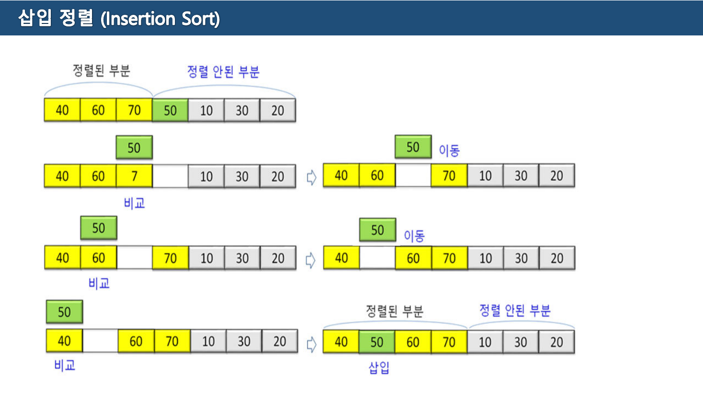
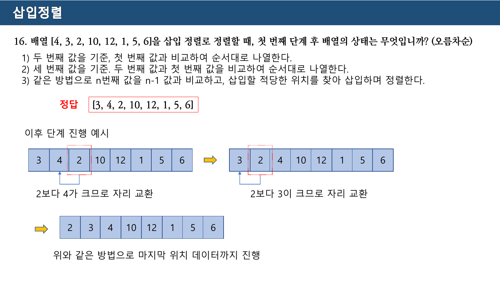
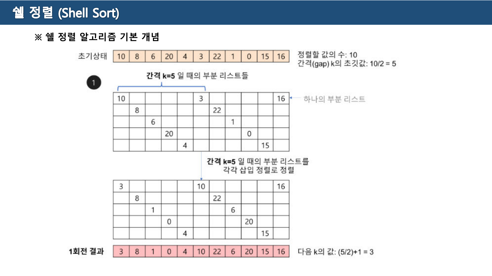
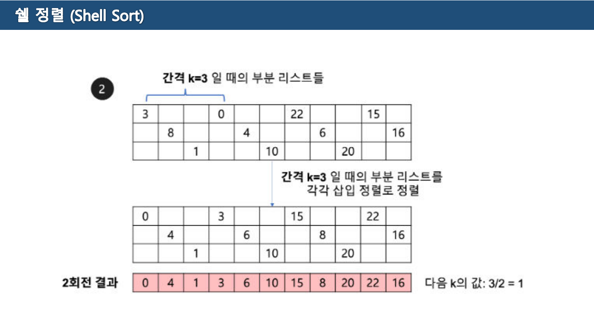
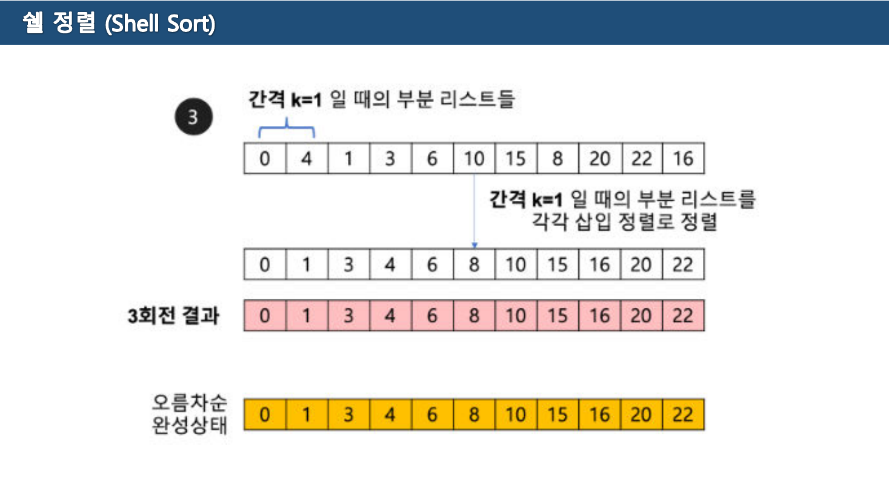
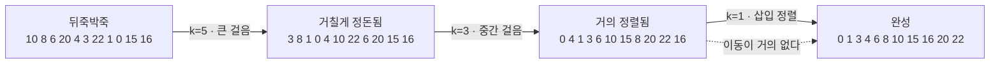

> [!abstract] 14쪽 중 여섯 쪽이 텍스트 0자다
> 12-1주차 자료는 네 가지 정렬을 다루면서 **말과 그림을 완전히 분리**해 놓았다. 홀수 쪽에 알고리즘 설명과 장단점이 있고, **3 · 6 · 7 · 9 · 12 · 13쪽 여섯 쪽은 텍스트가 0자** — 배열의 회전별 추적 그림만 있다. 설명 쪽만 읽으면 "최솟값을 찾아 앞과 바꾼다" 같은 한 줄이 남고, 실제로 무엇이 어떻게 움직이는지는 통째로 빠진다.
>
> 그림 여섯 장을 나란히 놓으면 네 알고리즘을 가르는 질문 하나가 보인다 — **한 회전이 끝났을 때 무엇이 확정되는가.**
>
> | | 한 회전이 확정하는 것 |
> | --- | --- |
> | 선택 정렬 | 맨 앞의 **한 자리**가 최종 값으로 확정 |
> | 버블 정렬 | 맨 뒤의 **한 자리**가 최종 값으로 확정 |
> | 삽입 정렬 | 앞쪽 **정렬된 구간이 한 칸 넓어짐** (값은 아직 최종이 아님) |
> | 쉘 정렬 | **아무것도 확정되지 않는다** |
>
> 마지막 줄이 이 장의 요점이다. 쉘 정렬만 성격이 다르고, 그래서 왜 빠른지도 거기서 설명된다.

---

## 1. 선택 정렬 — 자리를 하나씩 못 박는다

2쪽의 설명은 네 줄이다.

> \- **제자리 정렬**(in-place sorting) 알고리즘의 하나 — 입력 배열(정렬되지 않은 값) 이외에 다른 추가 메모리 요구되지 않음
> \- 정렬되지 않은 데이터 중 최소값을 정렬된 배열의 제일 마지막 위치의 다음 요소와 교환하는 방식
>
> ※ 선택정렬 과정 설명
>
> 1. 주어진 배열 중에서 **최소값을 찾는다**
> 2. 그 값을 **맨 앞에 위치한 값과 교환**
> 3. 맨 처음 위치를 뺀 나머지 리스트를 같은 방법으로 교환
> 4. 하나의 원소만 남을 때 까지 위의 1~3번 과정을 반복

![선택 정렬 — [9,6,7,3,5]의 네 회전 (원본 3쪽, 텍스트 0자)](../assets/ch09-p03-선택정렬.png)

3쪽이 `[9, 6, 7, 3, 5]` 를 끝까지 추적한다. 직접 계산해 대조했고 네 회전 모두 원본과 일치한다.

| 회전 | 원본의 설명 | 결과 |
| --- | --- | --- |
| ① | 최솟값 탐색: **3** / 첫 번째 값 9와 최솟값 3을 교환 | `3 6 7 9 5` |
| ② | 최솟값 탐색: **5** / 두 번째 값 6과 최솟값 5를 교환 | `3 5 7 9 6` |
| ③ | 최솟값 탐색: **6** / 세 번째 값 7과 최솟값 6을 교환 | `3 5 6 9 7` |
| ④ | 최솟값 탐색: **7** / 네 번째 값 9와 최솟값 7을 교환 | `3 5 6 7 9` |

원본 그림이 회전마다 왼쪽부터 분홍색으로 칠해 나가는 것이 **확정된 자리**다. 한 번 분홍이 된 칸은 다시 건드리지 않는다.

4쪽의 특징 정리는 짧다.

> 장점 — **구현이 쉽다.**
> 단점 — 데이터 개수가 많아질 수록 성능 저하

"구현이 쉽다"가 실제로 코드에 드러난다.

```python
def selection_sort(a):
    for i in range(len(a) - 1):
        m = i
        for j in range(i + 1, len(a)):     # 남은 구간에서 최솟값 위치를 찾고
            if a[j] < a[m]: m = j
        a[i], a[m] = a[m], a[i]            # 한 번만 교환한다
```

**교환이 회전당 딱 한 번**이라는 점이 선택 정렬의 유일한 강점이다. 비교는 $n^2/2$ 번 하지만 교환은 $n-1$ 번뿐이다. 값을 옮기는 비용이 비교보다 훨씬 비싼 상황(큰 레코드를 통째로 옮길 때)에서는 이 성질이 값을 한다. 원본은 이 점을 언급하지 않는다.

---

## 2. 버블 정렬 — 큰 값을 뒤로 밀어낸다

5쪽의 설명이다.

> \- 서로 인접한 두 원소를 검사하여 정렬하는 알고리즘 / 선택 정렬과 기본 개념은 유사
>
> ※ 버블정렬 알고리즘 과정
> \- 첫 번째 자료와 두 번째 자료, 두 번째 자료와 세 번째 자료와 같은 방식으로 마지막 자료까지 비교 및 교환
> \- **1회 순환을 마치면 가장 큰 자료가 맨 뒤로 이동**
> \- 2회 순환 부터는 **맨 끝에 있는 자료를 제외**하고 수행

선택 정렬과 반대다. 선택은 **앞에서부터 작은 값**을 못 박고, 버블은 **뒤에서부터 큰 값**을 못 박는다.

![버블 정렬 — [7,4,5,1,3]의 두 회전, 인접 교환이 그대로 그려져 있다 (원본 6쪽, 텍스트 0자)](../assets/ch09-p06-버블정렬.png)

6·7쪽이 `[7, 4, 5, 1, 3]` 을 추적한다.

```text
초기      7  4  5  1  3

1회전   7 4 → 교환    4  7  5  1  3
        7 5 → 교환    4  5  7  1  3
        7 1 → 교환    4  5  1  7  3
        7 3 → 교환    4  5  1  3  7      ← 7이 확정
1회전 결과              4  5  1  3  [7]

2회전   4 5 → 그대로
        5 1 → 교환    4  1  5  3  7
        5 3 → 교환    4  1  3  5  7      ← 5가 확정
2회전 결과              4  1  3  [5] [7]
```

직접 계산해도 같다. 3회전은 `1 3 4 5 7` 로 끝난다.

**한 회전에 교환이 여러 번 일어난다**는 점이 선택 정렬과 결정적으로 다르다. 1회전에서만 네 번 바꿨다. 5쪽이 "선택 정렬과 기본 개념은 유사"라고 적었지만, 비용 구조는 정반대다.

| | 선택 정렬 | 버블 정렬 |
| --- | --- | --- |
| 비교 횟수 | $O(n^2)$ | $O(n^2)$ |
| **교환 횟수** | $n-1$ 번 | 최악 $O(n^2)$ 번 |
| 확정되는 쪽 | 앞 (작은 값) | 뒤 (큰 값) |

```python
def bubble_sort(a):
    n = len(a)
    for i in range(n - 1):
        for j in range(n - 1 - i):        # 확정된 뒤쪽은 제외 — 5쪽의 세 번째 줄
            if a[j] > a[j+1]:
                a[j], a[j+1] = a[j+1], a[j]
```

> [!note] 원본에 없는 보충 — 조기 종료
> 안쪽 반복에서 **교환이 한 번도 없었다면** 이미 정렬이 끝난 것이므로 곧바로 멈출 수 있다. 이 개선을 넣으면 이미 정렬된 입력에 대해 $O(n)$ 이 된다. 12-1주차 자료는 이 변형을 다루지 않지만, 기말고사 문항이 버블 정렬의 "최선의 경우"를 물을 여지가 있다.

---

## 3. 삽입 정렬 — 구간을 넓힌다

8쪽의 설명이 앞의 둘과 다른 점을 짚는다.

> \- 자료 배열의 모든 요소를 처음부터 차례대로 **이미 정렬된 배열과 비교**하여, 자신의 위치를 찾아 삽입함으로써 정렬을 완성하는 알고리즘
> \- 매 순서 마다 해당 원소를 삽입할 수 있는 위치를 찾아 해당 위치에 넣는다.
>
> 장점 — 자료의 수가 적을 경우 구현이 매우 간단 / **이미 정렬되어 있는 경우**나 자료의 수가 적은 정렬에 매우 효율적
> 단점 — 비교적 **많은 레코드들의 이동**을 포함 / 자료의 수가 많고 자료의 크기가 클 경우 적합하지 않음



9쪽 그림은 배열을 처음부터 **"정렬된 부분"과 "정렬 안된 부분"으로 나눠** 그린다. `[40, 60, 70 | 50, 10, 30, 20]` 에서 `50` 을 왼쪽 구간에 끼워 넣는 과정이다.

| 단계 | 하는 일 | 배열 |
| --- | --- | --- |
| 0 | `50` 을 들어낸다 | `40 60 70 _ 10 30 20` |
| 1 | `70` 과 비교 → 50 < 70, **70을 오른쪽으로 이동** | `40 60 _ 70 10 30 20` |
| 2 | `60` 과 비교 → 50 < 60, **60을 오른쪽으로 이동** | `40 _ 60 70 10 30 20` |
| 3 | `40` 과 비교 → 50 > 40, 여기가 자리. **삽입** | `40 50 60 70 10 30 20` |

원본이 각 단계 아래에 붙인 말이 정확히 **비교 · 이동 · 이동 · 삽입** 이다. 이 세 동작의 구별이 8쪽 단점의 "많은 레코드들의 이동"과 연결된다.

**앞의 둘과의 결정적인 차이**가 여기 있다. 선택·버블에서 왼쪽(또는 오른쪽)의 확정 구간은 **최종 값**이었다. 삽입 정렬의 왼쪽 구간은 **그들끼리만 정렬되어 있을 뿐**, 오른쪽에 더 작은 값(10, 20, 30)이 남아 있어 최종 자리가 아니다.

```python
def insertion_sort(a):
    for i in range(1, len(a)):
        key = a[i]                     # 들어낸다
        j = i - 1
        while j >= 0 and a[j] > key:
            a[j+1] = a[j]              # 이동
            j -= 1
        a[j+1] = key                   # 삽입
```

`while` 조건에 **이미 정렬되어 있으면 즉시 거짓**이 되는 성질이 8쪽 장점("이미 정렬되어 있는 경우 매우 효율적")의 근거다. 이 경우 이동이 0번이고 비교만 $n-1$ 번이므로 $O(n)$ 이 된다. 선택 정렬은 어떤 입력에도 항상 $O(n^2)$ 이므로 이 점에서 갈린다.



`정렬관련기말고사예상문제 정리` 3쪽이 삽입 정렬을 다시 설명하고 답을 준다.

> 1) **두 번째 값을 기준**, 첫 번째 값과 비교하여 순서대로 나열한다.
> 2) 세 번째 값을 기준. 두 번째 값과 첫 번째 값을 비교하여 순서대로 나열한다.
> 3) 같은 방법으로 n번째 값을 n-1 값과 비교하고, 삽입할 적당한 위치를 찾아 삽입하며 정렬한다.

`[4, 3, 2, 10, 12, 1, 5, 6]` 에서 **첫 번째 단계**는 두 번째 값 `3` 을 다루는 것이므로 답은 `[3, 4, 2, 10, 12, 1, 5, 6]` 이다. 이어지는 예시도 실려 있다.

```text
3  4  2  10 12 1 5 6   →   3  2  4  10 12 1 5 6   →   2  3  4  10 12 1 5 6
      (2보다 4가 크므로 자리 교환)      (2보다 3이 크므로 자리 교환)
```

**"첫 번째 단계"가 두 번째 원소부터 세는 것**임을 명확히 해 둔 셈이다. 첫 번째 원소 하나는 이미 "정렬된 구간"이므로 할 일이 없다.

아래에서 세 알고리즘을 원본 값 그대로 돌려 볼 수 있다.

```html preview
<div id="s1-root">
  <style>
    #s1-root{font-family:system-ui,-apple-system,"Segoe UI",sans-serif;color:var(--foreground);background:var(--card);
      border:1px solid var(--border);border-radius:10px;padding:16px}
    #s1-root h4{margin:0 0 4px;font-size:14px}
    #s1-root .sub{font-size:12px;opacity:.7;margin-bottom:12px}
    #s1-root .bar{display:flex;gap:8px;flex-wrap:wrap;align-items:center;margin-bottom:12px}
    #s1-root button{font:inherit;font-size:12.5px;padding:6px 12px;border-radius:7px;cursor:pointer;
      border:1px solid var(--border);background:transparent;color:var(--foreground)}
    #s1-root button.sel{border-color:var(--chart-1);color:var(--chart-1)}
    #s1-root button:disabled{opacity:.4;cursor:default}
    #s1-root svg{width:100%;height:auto;display:block}
    #s1-root .say{font-size:12.5px;margin-top:10px;line-height:1.7;min-height:3em}
    #s1-root .cnt{font-family:ui-monospace,SFMono-Regular,Menlo,monospace;font-size:12px;margin-top:6px;opacity:.85}
  </style>
  <h4>한 회전이 확정하는 것 — 세 알고리즘 비교</h4>
  <div class="sub">배열은 원본 3·6·9쪽의 값 그대로. 굵은 테두리가 그 회전에서 <b>확정</b>된 칸이다.</div>
  <div class="bar"><span id="s1-kinds"></span>
    <button id="s1-step">▶ 한 회전</button><button id="s1-reset">처음으로</button></div>
  <svg id="s1-svg" viewBox="0 0 700 190" role="img" aria-label="세 정렬 알고리즘의 회전별 상태"></svg>
  <div class="cnt" id="s1-cnt"></div>
  <div class="say" id="s1-say"></div>
</div>
<script>
(function(){
  function sel(){
    var a=[9,6,7,3,5], fr=[{a:a.slice(),lock:0,note:"초기 상태 — 원본 3쪽"}];
    for(var i=0;i<a.length-1;i++){
      var m=i; for(var j=i+1;j<a.length;j++) if(a[j]<a[m]) m=j;
      var mv=a[m], old=a[i];
      var t=a[i]; a[i]=a[m]; a[m]=t;
      fr.push({a:a.slice(),lock:i+1,note:"최솟값 탐색: <b>"+mv+"</b> / "+(i+1)+"번째 값 "+old+"와 교환 → <b>앞에서 "+(i+1)+"칸이 최종 확정</b>",sw:1});
    }
    return {frames:fr, from:"left", label:"선택 [9,6,7,3,5]"};
  }
  function bub(){
    var a=[7,4,5,1,3], fr=[{a:a.slice(),lock:0,note:"초기 상태 — 원본 6쪽"}], n=a.length;
    for(var i=0;i<n-1;i++){
      var sw=0;
      for(var j=0;j<n-1-i;j++) if(a[j]>a[j+1]){ var t=a[j]; a[j]=a[j+1]; a[j+1]=t; sw++; }
      fr.push({a:a.slice(),lock:i+1,note:"인접 비교로 큰 값을 뒤로 밀었다 — 이 회전의 교환 <b>"+sw+"회</b> / <b>뒤에서 "+(i+1)+"칸이 최종 확정</b>",sw:sw});
    }
    return {frames:fr, from:"right", label:"버블 [7,4,5,1,3]"};
  }
  function ins(){
    var a=[40,60,70,50,10,30,20], fr=[{a:a.slice(),lock:1,note:"초기 상태 — 원본 9쪽. 첫 칸은 이미 '정렬된 구간'이다"}];
    for(var i=1;i<a.length;i++){
      var key=a[i], j=i-1, mv=0;
      while(j>=0 && a[j]>key){ a[j+1]=a[j]; j--; mv++; }
      a[j+1]=key;
      fr.push({a:a.slice(),lock:i+1,note:"<b>"+key+"</b> 를 들어내 왼쪽 구간에 삽입 — 이동 <b>"+mv+"회</b> / 정렬된 구간이 "+(i+1)+"칸으로 넓어짐 (<span style='color:var(--chart-3)'>최종 값은 아니다</span>)",sw:mv});
    }
    return {frames:fr, from:"left", soft:true, label:"삽입 [40,60,70,50,10,30,20]"};
  }
  var ALG=[sel(),bub(),ins()], cur=0, f=0;
  var kb=document.getElementById("s1-kinds");
  ALG.forEach(function(A,i){
    var b=document.createElement("button"); b.textContent=A.label; b.style.marginRight="6px";
    b.onclick=function(){ cur=i; f=0; render(); }; kb.appendChild(b);
  });
  document.getElementById("s1-step").onclick=function(){ if(f<ALG[cur].frames.length-1) f++; render(); };
  document.getElementById("s1-reset").onclick=function(){ f=0; render(); };
  function render(){
    Array.prototype.forEach.call(kb.children,function(b,i){ b.classList.toggle("sel",i===cur); });
    var A=ALG[cur], fr=A.frames[f], n=fr.a.length;
    document.getElementById("s1-step").disabled = f>=A.frames.length-1;
    var w=Math.min(76, 660/n), x0=20, y=60, S="";
    for(var i=0;i<n;i++){
      var locked = A.from==="left" ? (i<fr.lock) : (i>=n-fr.lock);
      var c = locked ? (A.soft? "var(--chart-2)" : "var(--chart-1)") : "var(--border)";
      S+='<rect x="'+(x0+i*w)+'" y="'+y+'" width="'+(w-6)+'" height="44" rx="5" fill="none" stroke="'+c+'" stroke-width="'+(locked?2.4:1.2)+'"/>';
      S+='<text x="'+(x0+i*w+(w-6)/2)+'" y="'+(y+29)+'" text-anchor="middle" font-size="15" fill="'+(locked?c:"var(--foreground)")+'">'+fr.a[i]+'</text>';
    }
    var lab = A.soft? "정렬된 구간 (최종 아님)" : "확정된 자리";
    if(fr.lock>0){
      var lx = A.from==="left" ? x0 : x0+(n-fr.lock)*w;
      S+='<text x="'+lx+'" y="'+(y-12)+'" font-size="11.5" fill="'+(A.soft?"var(--chart-2)":"var(--chart-1)")+'">'+lab+' ('+fr.lock+'칸)</text>';
    }
    S+='<text x="20" y="30" font-size="12" fill="var(--chart-2)">'+(f===0?"초기 상태":f+"회전 결과")+'</text>';
    document.getElementById("s1-svg").innerHTML=S;
    document.getElementById("s1-say").innerHTML=fr.note;
    var tot=0; for(var k=1;k<=f;k++) tot += (A.frames[k].sw||0);
    document.getElementById("s1-cnt").textContent =
      "누적 "+(cur===0?"교환":cur===1?"교환":"이동")+" 횟수: "+tot;
  }
  render();
})();
</script>
```

세 알고리즘을 끝까지 돌려 누적 횟수를 비교해 보면 1절의 표가 눈으로 확인된다 — 선택 정렬은 4회, 버블 정렬은 6회 교환한다.

---

## 4. 쉘 정렬 — 아무것도 확정하지 않는 회전

10쪽이 쉘 정렬의 동기를 정확히 짚는다.

> \- Donald L. Shell 이라는 사람이 제안한 방법으로 **삽입정렬을 보완**한 알고리즘
> 만약, **삽입되어야 할 위치가 현재 위치에서 상당히 멀리 떨어진 곳이라면 많은 이동이 필요**
> \- 삽입 정렬과 다르게 쉘 정렬은 **전체의 리스트를 한번에 정렬하지 않는다.**
>
> ※ 쉘 정렬 과정
>
> 1. 정렬해야 할 리스트를 일정한 기준에 따라 분류
> 2. **연속적이지 않은** 여러 개의 부분 리스트를 생성
> 3. 각 부분 리스트를 **삽입 정렬**을 이용하여 정렬
> 4. 모든 부분 리스트가 정렬되면 다시 전체 리스트를 **더 적은 개수의 부분 리스트**로 만든 후에 알고리즘을 반복
> 5. 1~4까지 과정을 부분 리스트의 개수가 **1이 될 때까지** 반복

핵심은 첫 항목의 진단이다. 3절에서 본 대로 삽입 정렬은 값을 **한 칸씩** 옮긴다. 맨 뒤의 작은 값이 맨 앞으로 가야 한다면 $n$ 번 옮겨야 한다. 쉘 정렬은 **멀리 있는 것끼리 먼저 비교해** 큰 걸음으로 옮겨 놓는다.



11~13쪽이 한 배열을 세 회전에 걸쳐 정렬한다. 직접 계산해 세 회전 결과가 모두 원본과 일치함을 확인했다.

### 1회전 — 간격 5

초기 배열 `10 8 6 20 4 3 22 1 0 15 16`, 간격 $k=5$ 로 부분 리스트를 만든다.

| 부분 리스트 | 인덱스 | 값 | 삽입 정렬 후 |
| --- | --- | --- | --- |
| ① | 0, 5, 10 | `10 · 3 · 16` | `3 · 10 · 16` |
| ② | 1, 6 | `8 · 22` | `8 · 22` |
| ③ | 2, 7 | `6 · 1` | `1 · 6` |
| ④ | 3, 8 | `20 · 0` | `0 · 20` |
| ⑤ | 4, 9 | `4 · 15` | `4 · 15` |

1회전 결과 — `3 8 1 0 4 10 22 6 20 15 16`

한 번의 교환으로 `0` 이 3번 자리에서 8번 자리까지 **다섯 칸을 건너뛰었다.** 삽입 정렬이라면 다섯 번 이동해야 하는 거리다.



### 2회전 — 간격 3

| 부분 리스트 | 인덱스 | 값 | 삽입 정렬 후 |
| --- | --- | --- | --- |
| ① | 0, 3, 6, 9 | `3 · 0 · 22 · 15` | `0 · 3 · 15 · 22` |
| ② | 1, 4, 7, 10 | `8 · 4 · 6 · 16` | `4 · 6 · 8 · 16` |
| ③ | 2, 5, 8 | `1 · 10 · 20` | `1 · 10 · 20` |

2회전 결과 — `0 4 1 3 6 10 15 8 20 22 16`



### 3회전 — 간격 1

간격이 1이면 부분 리스트가 하나이고, **그냥 삽입 정렬**이다. 마지막 회전이 언제나 이렇게 끝나므로 **쉘 정렬은 결국 삽입 정렬로 마무리된다.**

3회전 결과 — `0 1 3 4 6 8 10 15 16 20 22`

여기가 이 장의 요점이다. 마지막에 삽입 정렬을 돌리는데도 빠른 이유는, **그때쯤이면 배열이 이미 거의 정렬되어 있어서** 8쪽이 말한 장점("이미 정렬되어 있는 경우 매우 효율적")이 발휘되기 때문이다.

1·2회전은 **아무 자리도 확정하지 않는다.** 대신 "거의 정렬된 상태"라는, 눈에 보이지 않는 성질을 만든다. 그것이 마지막 회전의 이동 횟수를 줄인다.



아래에서 부분 리스트가 어떻게 잡히는지 확인할 수 있다. 값은 원본 11~13쪽 그대로다.

```html preview
<div id="sh-root">
  <style>
    #sh-root{font-family:system-ui,-apple-system,"Segoe UI",sans-serif;color:var(--foreground);background:var(--card);
      border:1px solid var(--border);border-radius:10px;padding:16px}
    #sh-root h4{margin:0 0 4px;font-size:14px}
    #sh-root .sub{font-size:12px;opacity:.7;margin-bottom:12px}
    #sh-root .bar{display:flex;gap:8px;flex-wrap:wrap;align-items:center;margin-bottom:12px}
    #sh-root button{font:inherit;font-size:12.5px;padding:6px 12px;border-radius:7px;cursor:pointer;
      border:1px solid var(--border);background:transparent;color:var(--foreground)}
    #sh-root button.sel{border-color:var(--chart-1);color:var(--chart-1)}
    #sh-root svg{width:100%;height:auto;display:block}
    #sh-root .say{font-size:12.5px;margin-top:10px;line-height:1.7}
    #sh-root .lists{font-family:ui-monospace,SFMono-Regular,Menlo,monospace;font-size:12px;margin-top:9px;line-height:1.8;white-space:pre-wrap}
  </style>
  <h4>쉘 정렬 — 간격이 만드는 부분 리스트</h4>
  <div class="sub">원본 11~13쪽의 배열 <code>10 8 6 20 4 3 22 1 0 15 16</code>. 간격을 눌러 부분 리스트가 어떻게 갈리는지 본다.</div>
  <div class="bar"><span id="sh-ks"></span><button id="sh-sort">이 간격으로 정렬</button><button id="sh-reset">처음으로</button></div>
  <svg id="sh-svg" viewBox="0 0 700 150" role="img" aria-label="쉘 정렬의 부분 리스트"></svg>
  <div class="lists" id="sh-lists"></div>
  <div class="say" id="sh-say"></div>
</div>
<script>
(function(){
  var INIT=[10,8,6,20,4,3,22,1,0,15,16];
  var KS=[5,3,1], ki=0, a=INIT.slice(), sorted=false;
  var kb=document.getElementById("sh-ks");
  KS.forEach(function(k,i){
    var b=document.createElement("button"); b.textContent="간격 k="+k; b.style.marginRight="6px";
    b.onclick=function(){ ki=i; sorted=false; render(); }; kb.appendChild(b);
  });
  document.getElementById("sh-sort").onclick=function(){
    var k=KS[ki];
    for(var s=0;s<k;s++){
      var sub=[]; for(var i=s;i<a.length;i+=k) sub.push(a[i]);
      sub.sort(function(x,y){return x-y;});
      var t=0; for(var i=s;i<a.length;i+=k) a[i]=sub[t++];
    }
    sorted=true; render();
  };
  document.getElementById("sh-reset").onclick=function(){ a=INIT.slice(); ki=0; sorted=false; render(); };
  function render(){
    Array.prototype.forEach.call(kb.children,function(b,i){ b.classList.toggle("sel",i===ki); });
    var k=KS[ki], n=a.length, w=62, x0=14, y=56, S="";
    var COL=["var(--chart-1)","var(--chart-2)","var(--chart-3)","var(--chart-4)","var(--chart-5)"];
    for(var i=0;i<n;i++){
      var g=i%k, c=COL[g%COL.length];
      S+='<rect x="'+(x0+i*w)+'" y="'+y+'" width="54" height="42" rx="5" fill="none" stroke="'+c+'" stroke-width="2"/>';
      S+='<text x="'+(x0+i*w+27)+'" y="'+(y+28)+'" text-anchor="middle" font-size="15" fill="'+c+'">'+a[i]+'</text>';
      S+='<text x="'+(x0+i*w+27)+'" y="'+(y+58)+'" text-anchor="middle" font-size="10" fill="var(--border)">'+i+'</text>';
      if(i+k<n){
        S+='<path d="M'+(x0+i*w+27)+' '+(y-4)+' C '+(x0+i*w+27)+' '+(y-32)+', '+(x0+(i+k)*w+27)+' '+(y-32)+', '+(x0+(i+k)*w+27)+' '+(y-4)+'" fill="none" stroke="'+c+'" stroke-width="1.2" opacity=".8"/>';
      }
    }
    document.getElementById("sh-svg").innerHTML=S;
    var out=[];
    for(var s=0;s<k;s++){
      var idx=[], val=[];
      for(var i=s;i<n;i+=k){ idx.push(i); val.push(a[i]); }
      out.push("부분 리스트 "+(s+1)+"  인덱스 "+idx.join(",")+"   값 "+val.join(" · "));
    }
    document.getElementById("sh-lists").textContent=out.join("\n");
    document.getElementById("sh-say").innerHTML = sorted
      ? "각 부분 리스트를 삽입 정렬로 정렬했다. 결과 <b>"+a.join(" ")+"</b>"+(k===1?" — 완성.":" — 아직 어느 자리도 최종이 아니다.")
      : (k===1 ? "간격 1이면 부분 리스트가 하나 — <b>그냥 삽입 정렬</b>이다. 다만 이 시점의 배열은 이미 거의 정렬되어 있다."
               : "같은 색이 하나의 부분 리스트다. 서로 <b>"+k+"칸 떨어진</b> 값들끼리만 비교한다.");
  }
  render();
})();
</script>
```

### 원본에서 어긋난 두 곳

> [!caution] 원본 오류 ① — 원소가 11개인데 "값의 수: 10"
> 11쪽 오른쪽 위에 *"정렬할 값의 수: 10 / 간격(gap) k의 초깃값: **10/2 = 5**"* 라고 적혀 있다. 그러나 초기 배열 `10 8 6 20 4 3 22 1 0 15 16` 은 세어 보면 **11개**다.
>
> 그림 자체는 11개 기준으로 정확히 그려져 있다 — 간격 5의 부분 리스트가 다섯 개이고 첫 번째만 원소 셋(인덱스 0·5·10)이다. 값이 10개였다면 첫 부분 리스트도 둘이어야 한다. **개수 표기만 틀렸다.**
>
> 참고로 $k$ 의 초깃값 계산에는 영향이 없다. 11/2 = 5(정수 나눗셈)로 같은 값이 나온다.

어긋난 곳은 하나 더 있다.

> [!caution] 원본 오류 ② — 간격을 줄이는 규칙이 회전마다 다르다
> 11쪽 아래: *"다음 k의 값: **(5/2)+1 = 3**"*
> 12쪽 아래: *"다음 k의 값: **3/2 = 1**"*
>
> 앞에서는 `(k/2)+1`, 뒤에서는 `k/2` 를 썼다. 같은 규칙을 적용했다면 12쪽에서 `(3/2)+1 = 2` 가 나와 회전이 한 번 더 필요했을 것이다.
>
> 어느 쪽도 "틀린 알고리즘"은 아니다 — 쉘 정렬은 **간격 수열을 어떻게 잡든 마지막이 1이면 정렬이 완성된다.** 14쪽 단점이 *"부분리스트 구현을 위한 gap 설정이 잘못될 경우 비효율적 알고리즘이 될 수 있다"* 라고 적은 것이 정확히 이 자유도를 말한다. 다만 **한 예제 안에서 규칙이 바뀌면 따라 계산할 수 없다.**

14쪽의 특징 정리로 이 절을 닫는다.

> 장점 — **멀리 있는 원소들끼리 빠르게 비교 및 교환**이 이루어진다 / 삽입정렬, 버블정렬에 비해 정렬 속도가 빠르다
> 단점 — 삽입정렬에 비해 구현이 어렵다 / 부분리스트 구현을 위한 **gap 설정이 잘못될 경우** 비효율적 알고리즘이 될 수 있다

---

## 5. 네 알고리즘을 한 자리에

원본 여러 쪽에 흩어진 특징을 모으고, 원본이 적지 않은 시간 복잡도를 채워 넣는다.

| | 확정하는 것 | 최선 | 평균·최악 | 제자리 | 안정 | 원본이 든 장점 |
| --- | --- | --- | --- | --- | --- | --- |
| 선택 정렬 | 앞에서 한 자리 | $O(n^2)$ | $O(n^2)$ | ○ | **✗** | 구현이 쉽다 (4쪽) |
| 버블 정렬 | 뒤에서 한 자리 | $O(n^2)$ | $O(n^2)$ | ○ | ○ | — (5쪽은 장단점을 적지 않음) |
| 삽입 정렬 | 정렬 구간 한 칸 | **$O(n)$** | $O(n^2)$ | ○ | ○ | 이미 정렬된 경우 매우 효율적 (8쪽) |
| 쉘 정렬 | **없음** | $O(n\log n)$ 수준 | 간격 수열에 따름 | ○ | **✗** | 멀리 있는 원소를 빠르게 교환 (14쪽) |

> [!note] 시간 복잡도와 안정성은 원본에 없다
> 12-1주차 자료 어디에도 $O(\cdot)$ 표기가 나오지 않는다. 4쪽은 "데이터 개수가 많아질 수록 성능 저하"라고만 적는다. 위 표의 복잡도·제자리·안정 열은 **원본에 없는 보충**이며, 기말고사 객관식이 이 값들을 직접 묻기 때문에 채워 넣었다.
>
> 흥미롭게도 13주차(기수정렬) 자료는 "안정정렬"이라는 말을 명시적으로 쓴다([10장](./10.%20%EC%A0%95%EB%A0%AC%20%E2%91%A1%20%E2%80%94%20%EC%B2%AB%20%EB%B2%88%EC%A7%B8%20%EB%8B%A8%EA%B3%84%EB%9E%80%20%EB%AC%B4%EC%97%87%EC%9D%B8%EA%B0%80.md)). 즉 개념은 학기 안에 등장하는데, 12-1주차에서는 쓰이지 않는다.

**선택 정렬이 왜 불안정한가**(기말 13번이 묻는다). 같은 값이 둘 있을 때, 멀리 있는 최솟값과 교환하는 과정에서 앞의 것이 뒤로 넘어갈 수 있기 때문이다. 예를 들어 `[3a, 3b, 1]` 에서 첫 회전에 `1` 과 `3a` 를 바꾸면 `[1, 3b, 3a]` 가 되어 두 3의 순서가 뒤집힌다.

---

## 6. 예상문제

기말고사 공지용 자료의 객관식 8~19번이 이 장 범위다. 정답의 근거를 원본 쪽과 함께 적는다.

| 문항 | 답 | 근거 |
| --- | --- | --- |
| 8. 선택 정렬 설명 | **② 매 단계에서 가장 작은(또는 큰) 요소를 선택하여 앞쪽으로 이동** | 2쪽 과정 설명 1·2번 |
| 9. 선택 정렬의 일반적 과정 | **③ 가장 작은 요소를 찾아 현재 위치의 요소와 교환** | 8번과 같은 근거 |
| 10. 선택 정렬의 특징 중 옳지 **않은** 것 | **② 안정 정렬이다** | 5절 참조. 선택 정렬은 불안정하다 |
| 11. 선택 정렬의 장점 | **② 적은 메모리 공간을 필요로 한다** | 2쪽 "제자리 정렬 — 추가 메모리 요구되지 않음" |
| 12. `[64,25,12,22,11]` 첫 단계 후 | **① `[11,25,12,22,64]`** | 예상문제 정리 2쪽에 답이 그대로 실려 있다 |
| 13. 선택 정렬이 안정 정렬이 아닌 이유 | **② 동일한 요소의 상대적 순서를 유지하지 않는다** | 5절 참조 |
| 14. 삽입 정렬의 기본 개념 | **③ 정렬된 부분과 정렬되지 않은 부분으로 나누어 …** | 8쪽 · 9쪽 그림의 두 구간 |
| 15. 삽입 정렬의 일반적 과정 | **③ 현재 위치의 요소를 정렬된 부분의 적절한 위치에 삽입** | 8쪽 |
| 16. `[4,3,2,10,12,1,5,6]` 첫 단계 후 | **① `[3,4,2,10,12,1,5,6]`** | 예상문제 정리 3쪽 |
| 17. 삽입 정렬의 특징 중 옳지 **않은** 것 | **④ 항상 $O(n\log n)$** | 삽입 정렬은 최악 $O(n^2)$ |
| 18. 삽입 정렬의 장점 | **② 간단하고 구현이 용이하다** | 8쪽 "구현이 매우 간단" |
| 19. `[5,4,3,2,1]` 삽입 정렬 세 번째 단계 후 | **③ `[2,3,4,5,1]`** | 아래 참조 |

19번을 직접 따라가면 이렇다. 3절에서 확인한 대로 **첫 단계는 두 번째 원소부터** 센다.

```text
초기         5  4  3  2  1
1단계 (4)    4  5  3  2  1
2단계 (3)    3  4  5  2  1
3단계 (2)    2  3  4  5  1     ← 답
4단계 (1)    1  2  3  4  5
```

> [!warning] 10번과 17번은 "옳지 않은 것"을 묻는다
> 두 문항 모두 보기 넷 중 셋이 참이다. 10번의 ①③④는 모두 옳고 ②만 틀리며, 17번의 ①②③은 옳고 ④만 틀리다. 지문에서 **"옳지 않은"** 을 놓치면 정반대를 고르게 된다. 기말고사 자료의 정렬 문항은 대부분 이 형식이다.

---

## 다른 장과의 연결

- 나머지 정렬 네 가지(힙·병합·퀵·기수)와 "첫 번째 단계"의 함정 — [10. 정렬 ②](./10.%20%EC%A0%95%EB%A0%AC%20%E2%91%A1%20%E2%80%94%20%EC%B2%AB%20%EB%B2%88%EC%A7%B8%20%EB%8B%A8%EA%B3%84%EB%9E%80%20%EB%AC%B4%EC%97%87%EC%9D%B8%EA%B0%80.md)
- 정렬된 입력이 최악이 되는 자료구조 — [08. BST와 AVL](./08.%20BST%EC%99%80%20AVL%20%E2%80%94%20%EA%B7%A0%ED%98%95%EC%9D%84%20%EC%A7%80%ED%82%A4%EB%A0%A4%EB%A9%B4%20%EB%AC%B4%EC%97%87%EC%9D%84%20%EB%82%B4%EC%96%B4%EC%A3%BC%EC%96%B4%EC%95%BC%20%ED%95%98%EB%8A%94%EA%B0%80.md) (BST는 반대로 정렬된 입력이 최악, 삽입 정렬은 최선)
- 배열 위에서 값을 밀어내는 비용 — [06. 큐와 데크](./06.%20%ED%81%90%EC%99%80%20%EB%8D%B0%ED%81%AC%20%E2%80%94%20%EA%B5%90%EC%9E%AC%EA%B0%80%20%EA%B3%B5%EC%A7%9C%EB%9D%BC%20%ED%95%9C%20%EC%9E%90%EB%A6%AC%EB%A5%BC%20%EC%8B%A4%EC%8A%B5%EC%9D%80%20%EB%AC%B8%EC%A0%9C%EC%A0%90%EC%9D%B4%EB%9D%BC%20%EB%B6%80%EB%A5%B8%EB%8B%A4.md)의 `pop(0)` 과 삽입 정렬의 "이동"은 같은 동작이다

---

## 근거 자료

| 원본 | 쪽 | 내용 | 이 문서에서 쓰인 곳 |
| --- | --- | --- | --- |
| 12-1주차 | 2 | 선택 정렬 정의와 과정 4단계 | 1절 |
| 12-1주차 | **3** | 선택 정렬 추적 `[9,6,7,3,5]` (텍스트 0자) | 1절 · 인용 · 인터랙티브 |
| 12-1주차 | 4 | 선택 정렬의 장단점 | 1절 |
| 12-1주차 | 5 | 버블 정렬 정의와 과정 | 2절 |
| 12-1주차 | **6 · 7** | 버블 정렬 추적 `[7,4,5,1,3]` (둘 다 텍스트 0자) | 2절 · 인용 |
| 12-1주차 | 8 | 삽입 정렬 정의와 장단점 | 3절 |
| 12-1주차 | **9** | 삽입 정렬 추적 (텍스트 0자) | 3절 · 인용 |
| 12-1주차 | 10 | 쉘 정렬 정의와 과정 5단계 | 4절 |
| 12-1주차 | **11** | 쉘 정렬 1회전 (간격 5) | 4절 · 인용 · **원본 오류** |
| 12-1주차 | **12 · 13** | 쉘 정렬 2·3회전 (둘 다 텍스트 0자) | 4절 · 인용 · **원본 오류** |
| 12-1주차 | 14 | 쉘 정렬의 장단점 | 4절 |
| 정렬 예상문제 | 2 | 기말 12번의 답 | 6절 |
| 정렬 예상문제 | **3** | 기말 16번의 답과 이후 단계 | 3절 · 인용 |
| 기말고사 공지용 | 2 · 3 | 객관식 8~19 | 6절 |

- 선택·버블·삽입·쉘의 **모든 회전 결과를 직접 계산해 원본 그림과 대조**했고, 값은 전부 일치했다. 어긋난 것은 쉘 정렬의 **원소 개수 표기(10 vs 11)** 와 **간격 축소 규칙**뿐이다
- 텍스트 0자 페이지: **3 · 6 · 7 · 9 · 12 · 13쪽** — 여섯 쪽 모두 배열 추적 그림이며, 이 문서의 1~4절 표가 그 내용이다
- 5절의 시간 복잡도·안정성 표는 원본에 없는 보충이다
