> [!abstract] 교수가 직접 "보기에 정답이 없다"고 적은 네 문항
> 기말고사 공지용 자료의 객관식 22 · 27 · 32 · 37번은 **같은 배열 `[4, 3, 2, 10, 12, 1, 5, 6]`** 에 **같은 보기 네 개**를 붙이고, 병합·퀵·힙·기수 정렬의 **"첫 번째 단계 후 배열의 상태"** 를 묻는다.
>
> `정렬관련기말고사예상문제 정리` 자료는 그 답안지인데, 4·5·7·8쪽 **네 쪽 모두** 아래에 같은 문장이 달려 있다.
>
> > ※ 예상문제 보기에는 정답이 없음. 실제 문제에서는 문제 없도록 보기 제출
>
> 왜 이런 일이 생겼는가. [09장](./09.%20%EC%A0%95%EB%A0%AC%20%E2%91%A0%20%E2%80%94%20%ED%95%9C%20%ED%9A%8C%EC%A0%84%EC%9D%B4%20%EB%AC%B4%EC%97%87%EC%9D%84%20%ED%99%95%EC%A0%95%ED%95%98%EB%8A%94%EA%B0%80.md)의 선택·삽입 정렬에서는 "첫 번째 단계"가 분명했다 — 첫 원소를 확정하거나, 두 번째 원소를 끼워 넣거나. 그런데 **이 장의 네 알고리즘에는 그런 경계가 없다.** 병합 정렬은 쪼개기부터 시작하고, 퀵 정렬은 한 번의 분할이 배열 전체를 훑고, 힙 정렬은 정렬을 시작하기도 전에 힙을 만들어야 하고, 기수 정렬은 한 자릿수를 통째로 처리한다.
>
> 그래서 이 정리는 그 네 문항을 목차로 삼는다. 각 알고리즘에서 **"첫 단계"를 어디로 잡아야 하는지**가 곧 그 알고리즘의 구조이기 때문이다.

---

## 1. 힙 정렬 — 정렬 전에 트리를 세운다

### 힙이란 무엇인가

12-2주차 2쪽의 정의는 [07장의 완전 이진 트리](./07.%20%ED%8A%B8%EB%A6%AC%20%E2%80%94%20%EC%9E%90%EC%8B%9D%EC%9D%B4%20%EB%91%98%EC%9D%84%20%EB%84%98%EC%9C%BC%EB%A9%B4%20%EA%B0%90%EB%8B%B9%EC%9D%B4%20%EC%95%88%20%EB%90%9C%EB%8B%A4.md) 위에 값 조건을 얹은 것이다.

> \- **완전이진트리** 일종으로, 부모노드와 자식 노드간에 특정 조건을 만족하는 자료구조
> \- 최대 Heap: 모든 부모 노드가 그 **자식 노드보다 큰** 값을 갖는 특성
> \- 최소 Heap: 모든 부모 노드가 그 **자식 노드보다 작은** 값을 갖는 특성

[BST](./08.%20BST%EC%99%80%20AVL%20%E2%80%94%20%EA%B7%A0%ED%98%95%EC%9D%84%20%EC%A7%80%ED%82%A4%EB%A0%A4%EB%A9%B4%20%EB%AC%B4%EC%97%87%EC%9D%84%20%EB%82%B4%EC%96%B4%EC%A3%BC%EC%96%B4%EC%95%BC%20%ED%95%98%EB%8A%94%EA%B0%80.md)와 헷갈리기 쉬운데, 조건이 걸리는 방향이 다르다.

| | BST | 힙 |
| --- | --- | --- |
| 조건 | 왼쪽 < 자기 < 오른쪽 | 부모 > 두 자식 (최대 힙) |
| 형제 사이 | 왼쪽 서브트리 전체 < 오른쪽 서브트리 전체 | **아무 관계 없음** |
| 모양 | 자유 (그래서 경사질 수 있다) | **반드시 완전 이진 트리** |
| 중위 순회 | 오름차순 | 의미 없음 |
| 잘하는 일 | 임의의 값 찾기 | **최댓값 하나 꺼내기** |

형제 사이에 순서가 없다는 것이 힙의 요점이다. 조건이 느슨하니 유지 비용이 싸고, 대신 "가장 큰 값이 루트에 있다"는 것 하나만 보장한다.

모양이 언제나 완전 이진 트리이므로 [07장 5절](./07.%20%ED%8A%B8%EB%A6%AC%20%E2%80%94%20%EC%9E%90%EC%8B%9D%EC%9D%B4%20%EB%91%98%EC%9D%84%20%EB%84%98%EC%9C%BC%EB%A9%B4%20%EA%B0%90%EB%8B%B9%EC%9D%B4%20%EC%95%88%20%EB%90%9C%EB%8B%A4.md)의 배열 표현이 낭비 없이 들어맞는다. 4쪽이 그 식을 다시 적는다.

> \- 왼쪽 자식 노드: `2 * index`
> \- 오른쪽 자식 노드: `2 * index + 1`
> \- 부모 노드 = `index // 2`

그런데 이 식이 같은 자료 안에서 일관되게 쓰이지 않는다.

> [!caution] 원본 불일치 — 4쪽의 식은 1-기반, 7쪽의 배열은 0-기반이다
> 5쪽의 그림은 배열 `9 8 6 7 4 2 3 5 1` 을 **인덱스 1부터** 채우고 트리 노드에 1~9 번호를 붙인다. 위 식이 성립하는 배치다([07장 11쪽](./07.%20%ED%8A%B8%EB%A6%AC%20%E2%80%94%20%EC%9E%90%EC%8B%9D%EC%9D%B4%20%EB%91%98%EC%9D%84%20%EB%84%98%EC%9C%BC%EB%A9%B4%20%EA%B0%90%EB%8B%B9%EC%9D%B4%20%EC%95%88%20%EB%90%9C%EB%8B%A4.md)도 "첫 인덱스는 건너띄고"라고 적었다).
>
> 그런데 7쪽의 예제 배열은 인덱스 라벨이 **`0 1 2 3 4 5 6 7 8`** 이고 값이 0번부터 들어간다. 이 배치에서는 위 식이 성립하지 않는다 — 0-기반에서는 `2*i+1`, `2*i+2`, `(i-1)//2` 여야 한다.
>
> 실제로 7쪽 그림의 트리는 0-기반으로 그려져 있다(루트 `7` = 인덱스 0, 그 자식이 인덱스 1·2인 `6`·`5`). 두 쪽이 다른 관습을 쓴다.

### 힙 생성 알고리즘

6쪽이 heapify를 설명한다.

> \- 힙 정렬을 수행하기 위해서는 **힙 생성알고리즘**을 사용
> \- 힙 생성 알고리즘은 **특정한 하나의 노드에 대해** 수행
> \- 특정한 노드의 **두 자식 노드 중에서 더 큰 자식과 자신의 위치를 교환**하는 알고리즘
> \- 위치를 바꾼 뒤에도 여전히 자식이 존재하는 경우 반복해서 수행하며, 자식 노드가 더 이상 존재하지 않을 때 까지 반복

```python
def heapify(a, n, i):
    largest = i
    l, r = 2*i + 1, 2*i + 2          # 0-기반
    if l < n and a[l] > a[largest]: largest = l
    if r < n and a[r] > a[largest]: largest = r
    if largest != i:
        a[i], a[largest] = a[largest], a[i]
        heapify(a, n, largest)        # 바꾼 자리에서 다시
```

### 7~8쪽의 예제와 그 어긋남

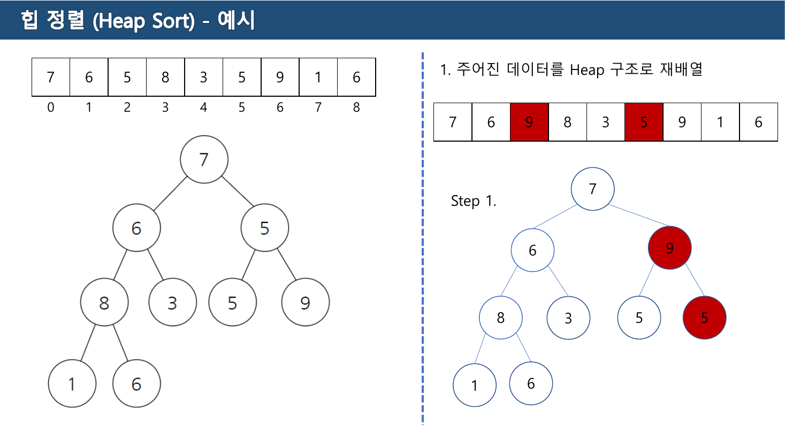

초기 배열은 `7 6 5 8 3 5 9 1 6` 이고, 트리는 루트 `7`, 그 자식 `6`·`5`, `6` 의 자식 `8`·`3`, `5` 의 자식 `5`·`9`, `8` 의 자식 `1`·`6` 이다.

heapify는 **아래쪽 부모 노드부터 거꾸로** 올라가며 적용한다. 세 단계를 직접 계산했다.

| 단계 | 대상 노드 | 하는 일 | 결과 배열 |
| --- | --- | --- | --- |
| Step 1 | 인덱스 2 (`5`) | 자식 `5`·`9` 중 큰 `9` 와 교환 | `7 6 **9** 8 3 5 **5** 1 6` |
| Step 2 | 인덱스 1 (`6`) | 자식 `8`·`3` 중 큰 `8` 과 교환 | `7 **8** 9 **6** 3 5 5 1 6` |
| Step 3 | 인덱스 0 (`7`) | 자식 `8`·`9` 중 큰 `9` 와 교환 | `**9** 8 **7** 6 3 5 5 1 6` |

최종 배열 `9 8 7 6 3 5 5 1 6` 이 유효한 최대 힙인지 확인하면 — 9 ≥ 8·7, 8 ≥ 6·3, 7 ≥ 5·5, 6 ≥ 1·6 — 모두 성립한다.

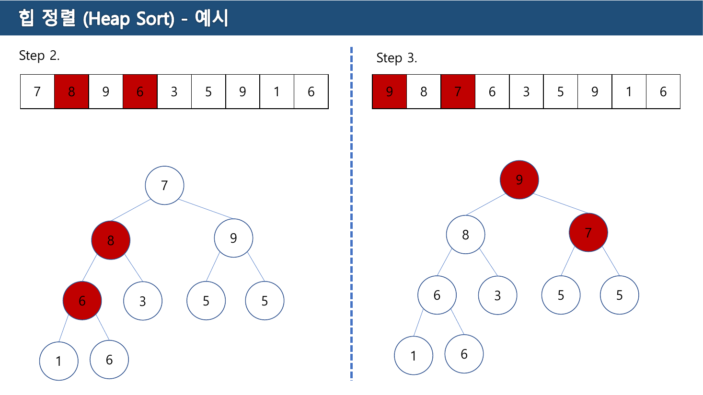

> [!caution] 원본 오류 — 배열의 일곱 번째 칸이 세 단계 내내 갱신되지 않는다
> 원본이 각 Step 위에 그린 배열은 이렇다.
>
> | | 원본이 그린 배열 | 직접 계산한 배열 |
> | --- | --- | --- |
> | Step 1 | `7 6 9 8 3 5 **9** 1 6` | `7 6 9 8 3 5 **5** 1 6` |
> | Step 2 | `7 8 9 6 3 5 **9** 1 6` | `7 8 9 6 3 5 **5** 1 6` |
> | Step 3 | `9 8 7 6 3 5 **9** 1 6` | `9 8 7 6 3 5 **5** 1 6` |
>
> 세 단계 모두 **인덱스 6(0-기반)의 칸만** 어긋난다. Step 1에서 인덱스 2의 `5` 와 인덱스 6의 `9` 를 교환했으므로 인덱스 6은 `5` 가 되어야 하는데, 원본 배열에는 `9` 가 그대로 남아 값 `9` 가 두 번 나온다.
>
> **같은 쪽의 트리 그림은 정확하다.** 7쪽 Step 1의 트리를 보면 오른쪽 서브트리가 `9(5, 5)` 로 제대로 그려져 있고, 8쪽 Step 2·3의 트리도 `5`·`5` 로 유지된다. 배열 행만 옮겨 적는 과정에서 한 칸이 빠진 것으로 보인다.
>
> 또 원본은 Step 1의 붉은 표시를 **인덱스 2와 인덱스 5**에 찍었는데, 실제로 교환된 것은 인덱스 2와 **인덱스 6**이다. 같은 실수의 다른 얼굴이다.

### 정렬 단계

9~11쪽이 본격적인 정렬이다.

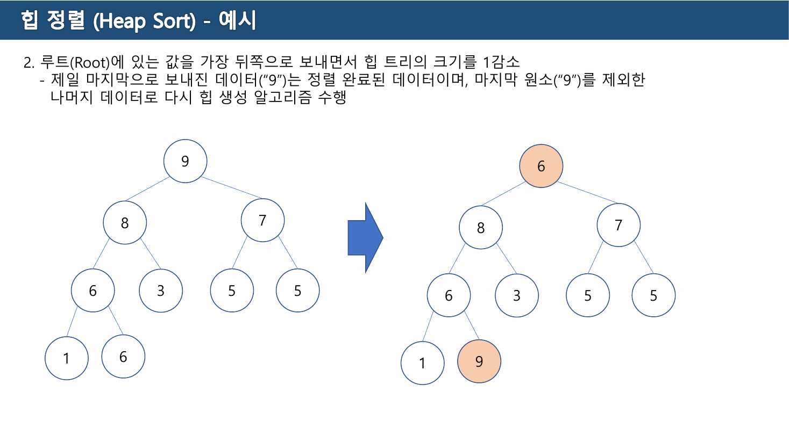

> 2\. 루트(Root)에 있는 값을 가장 뒤쪽으로 보내면서 힙 트리의 크기를 1감소
> \- 제일 마지막으로 보내진 데이터("9")는 **정렬 완료된 데이터**이며, 마지막 원소("9")를 제외한 나머지 데이터로 다시 힙 생성 알고리즘 수행
> 3\. 제일 마지막에 있는 데이터("9")를 제외하고 다시 힙 생성 알고리즘 수행
> 4\. 루트에 있는 값을 가장 뒤쪽으로 보내면서 힙 트리의 크기를 1감소 / 정렬 완료된 데이터를 제외한 나머지 데이터로 다시 힙 생성알고리즘 수행

**루트가 언제나 최댓값**이므로 그것을 배열 맨 뒤로 보내면 그 자리가 확정된다. 힙 크기를 하나 줄이고 새 루트에 heapify를 한 번 돌리면 다시 최댓값이 올라온다. 이 두 동작의 반복이 힙 정렬의 전부다.

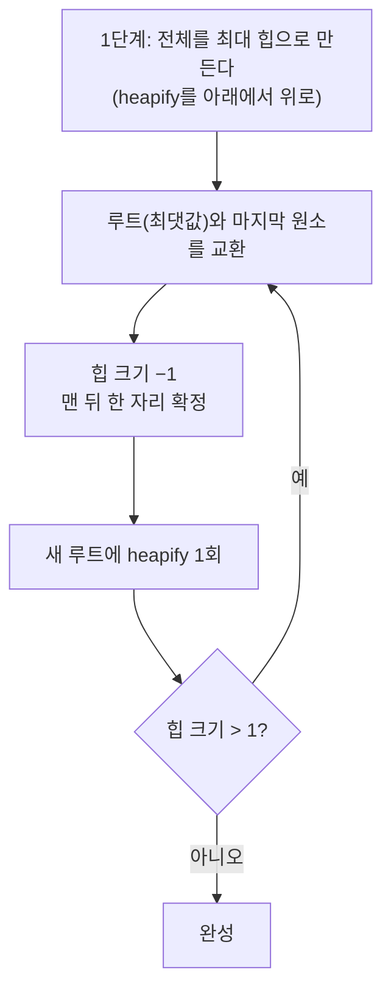

**그래서 "첫 번째 단계"가 애매해진다.** 힙을 만드는 것이 첫 단계인가, 아니면 힙을 만든 뒤 첫 교환이 첫 단계인가.

`정렬관련기말고사예상문제 정리` 6·7쪽이 그 답을 정한다. 6쪽이 `[4,3,2,10,12,1,5,6]` 을 최대 힙으로 재배열해 `12 10 5 6 3 1 2 4` 를 만들고, 7쪽이 그다음을 이렇게 적는다.

> 루트 노드의 값(12)를 제일 마지막 위치와 교환 ⇒ **1단계 완료**
> 정답: `4 10 5 6 3 1 2 12`

즉 **힙 만들기는 준비이고, 첫 교환까지가 1단계**다. 직접 계산해도 같은 값이 나온다.

기말고사 32번의 보기는 `[3,4,2,…]`·`[4,3,2,…]`·`[3,2,4,…]`·`[2,3,4,…]` 넷뿐이므로 **정답이 없다.**

---

## 2. 병합 정렬 — 쪼개는 것은 단계가 아니다

12쪽의 정의다.

> \- 병합 정렬은 **분할정복**(Divide and Conquer)기법과 **재귀 알고리즘**을 이용하는 정렬 알고리즘
> \- 주어진 배열을 **원소가 하나 밖에 남지 않을 때까지 계속 둘로 쪼갠 후**에 다시 크기순으로 재배열 하면서 원래 크기의 배열로 합침
>
> \- 분할(Split) 단계와 합병(Merge) 단계로 나누며, **분할 비용보다 모든 값들을 비교해야 하는 합병 비용이 큼**

마지막 줄이 중요하다. 쪼개는 일은 인덱스를 반으로 나누는 것뿐이라 비교가 한 번도 일어나지 않는다. **일이 벌어지는 것은 합칠 때**다.

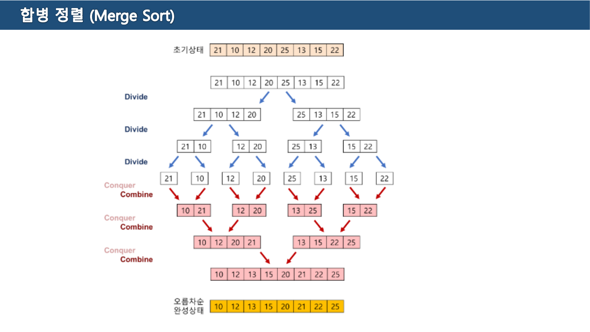

13쪽은 `21 10 12 20 25 13 15 22` 를 그림 하나로 끝까지 보여준다.

```text
초기        21 10 12 20 25 13 15 22
Divide      21 10 12 20 | 25 13 15 22
Divide      21 10 | 12 20 | 25 13 | 15 22
Divide      21 | 10 | 12 | 20 | 25 | 13 | 15 | 22
Combine     10 21 | 12 20 | 13 25 | 15 22        ← 첫 비교가 여기서 일어난다
Combine     10 12 20 21 | 13 15 22 25
Combine     10 12 13 15 20 21 22 25
```

원본이 왼쪽에 붙인 이름표가 `Divide` 세 번, `Conquer/Combine` 세 번이다. 원소 8개를 세 번 쪼개 1개씩 만들고, 세 번 합쳐 되돌린다 — $\log_2 8 = 3$ 이다.

`정렬관련기말고사예상문제 정리` 4쪽이 "첫 번째 단계"를 정한다.

> 1) 전체 데이터를 분할되지 않을 때 까지 분할.
> 2) **첫번째 합병하여 정렬하는 단계를 첫번째 단계로 정하며**, 그 결과를 정답으로 한다.

**분할은 전부 준비**이고, 첫 합병이 1단계다. `[4,3,2,10,12,1,5,6]` 을 여덟 조각으로 쪼갠 뒤 짝끼리 합치면 이렇게 된다. 직접 계산해 4쪽 그림과 대조했고 일치한다.

```text
4 | 3 | 2 | 10 | 12 | 1 | 5 | 6
 └─┬─┘   └──┬──┘   └─┬─┘   └─┬─┘
  3 4      2 10      1 12     5 6      →  [3, 4, 2, 10, 1, 12, 5, 6]
```

보기 ①이 `[3, 4, 2, 10, 12, 1, 5, 6]` 으로 **거의** 맞지만 `12 1` 이 `1 12` 로 바뀌지 않았다. 22번도 정답이 없다.

> [!tip] 보기 ①이 함정인 이유
> 네 문항(22·27·32·37)의 보기 ①은 전부 `[3,4,2,10,12,1,5,6]` — [09장의 삽입 정렬 16번 답](./09.%20%EC%A0%95%EB%A0%AC%20%E2%91%A0%20%E2%80%94%20%ED%95%9C%20%ED%9A%8C%EC%A0%84%EC%9D%B4%20%EB%AC%B4%EC%97%87%EC%9D%84%20%ED%99%95%EC%A0%95%ED%95%98%EB%8A%94%EA%B0%80.md)이다. 네 문항의 보기가 16번에서 그대로 복사되었기 때문에 정답이 들어 있지 않은 것이다.

---

## 3. 퀵 정렬 — 한 번의 분할이 배열 전체를 훑는다

14쪽의 정의다.

> \- 합병 정렬과 마찬가지로 분할기법과 재귀 알고리즘을 이용하는 정렬 알고리즘
> \- **피봇(pivot)** 이라는 임의의 기준값을 사용하여 분할
> \- Pivot 을 기준으로 더 작은 값과 큰 값으로 반복 분할한 후 합침
>
> \- 원소의 개수가 적어질수록 **나쁜 중간값이 선택될 확률이 높아지기 때문에**, 원소의 개수에 따라 퀵 정렬에 다른 정렬을 혼합해서 쓰는 경우 많음
> \- 합병 정렬은 항상 정 중앙을 기준으로 **단순 분할** 후 병합시점에서 값의 비교 연산이 발생하는 반면, 퀵 정렬은 **분할시점부터 비교연산**이 발생하기 때문에 그 이후 병합에 들어가는 비용이 매우 적음

마지막 줄이 두 분할정복의 차이를 정확히 짚는다.

| | 병합 정렬 | 퀵 정렬 |
| --- | --- | --- |
| 나누는 기준 | 위치 (한가운데) | **값** (피벗) |
| 나눌 때 비교 | 없음 | **있다** |
| 합칠 때 비교 | 있다 | **없다** (이미 좌우가 갈려 있다) |
| 분할이 균등한가 | 항상 | 피벗 운에 달림 |

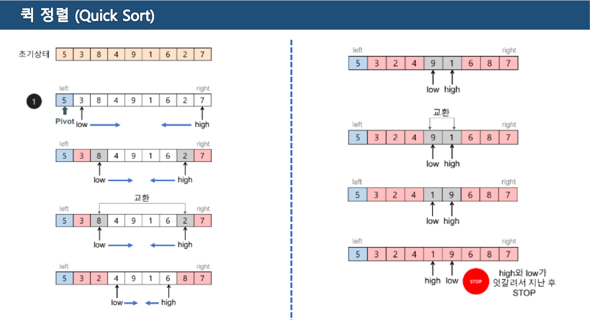

15·16쪽이 `5 3 8 4 9 1 6 2 7` 을 분할한다. 원본이 그린 규칙은 `정렬관련기말고사예상문제 정리` 5쪽에 글로 정리되어 있다.

> 1) 좌측에서 우측으로 **Pivot 값 보다 큰 값**을 찾고, 동시에 우측에서 좌측으로 **Pivot 값보다 작은 값**을 찾아 서로 자리를 교환한다.
> 2) 위 과정을 더 이상 진행할 수 없을 때 또는 **low 와 high 가 교차하거나 같은 위치**를 가르킬 때 까지 계속 반복
>
> low와 high가 같은 위치 / 첫번째 과정 완료
> **low 마지막 위치 이전 값과 피벗 값과 위치 교환**

15·16쪽의 진행은 이렇다.

| 상태 | 배열 |
| --- | --- |
| 초기 (pivot = `5`) | `5 3 8 4 9 1 6 2 7` |
| low가 `8`(큰 값), high가 `2`(작은 값) → 교환 | `5 3 **2** 4 9 1 6 **8** 7` |
| low가 `9`, high가 `1` → 교환 | `5 3 2 4 **1** 9 6 8 7` |
| low와 high가 엇갈림 → **STOP** | `5 3 2 4 1 \| 9 6 8 7` |
| 피벗 `5` 와 high 위치의 `1` 을 교환 | `**1** 3 2 4 **5** 9 6 8 7` |

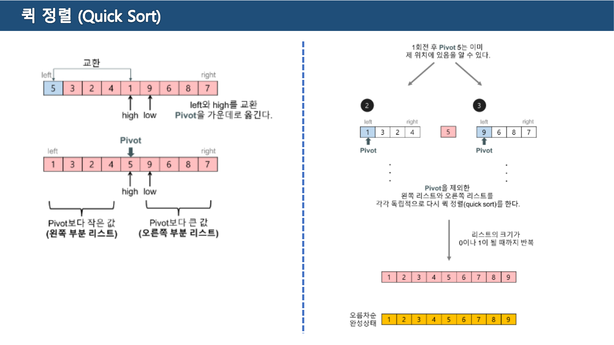

16쪽이 결론을 적는다 — **"1회전 후 Pivot 5는 이미 제 위치에 있음을 알 수 있다."** 왼쪽 `1 3 2 4` 는 전부 5보다 작고 오른쪽 `9 6 8 7` 은 전부 크므로, 5는 다시 움직이지 않는다.

> Pivot을 제외한 왼쪽 리스트와 오른쪽 리스트를 각각 독립적으로 다시 퀵 정렬(quick sort)를 한다.
> 리스트의 크기가 **0이나 1이 될 때까지 반복**

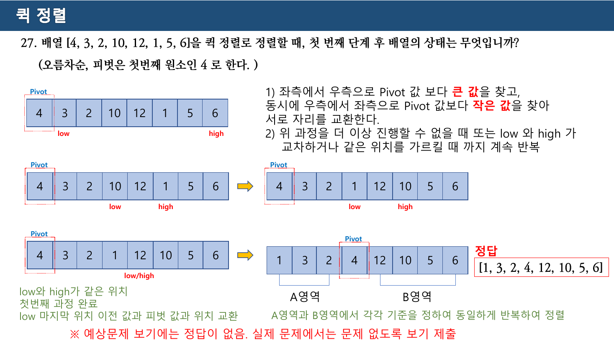

같은 규칙을 `[4,3,2,10,12,1,5,6]`(pivot = `4`)에 적용하면 예상문제 5쪽의 그림이 된다. 직접 계산해 대조했다.

```text
4  3  2  10 12 1  5  6      low → 10(4보다 큼),  high → 1(4보다 작음)
4  3  2  1  12 10 5  6      다시 진행 → low와 high가 만남
1  3  2  4  12 10 5  6      pivot 4 와 교환 — 정답
    A영역           B영역
```

원본이 `A영역`·`B영역`이라 이름 붙인 두 구간을 각각 다시 정렬한다. 답은 `[1, 3, 2, 4, 12, 10, 5, 6]` 이고, 역시 **보기에 없다.**

---

## 4. 기수 정렬 — 비교를 하지 않는다

13주차 자료 2쪽이 앞의 모든 정렬과 갈라서는 지점을 선언한다.

> \- 자릿수를 기준으로 정렬하는 알고리즘으로 **버킷(Bucket)** 을 활용한다.
> \- **데이터 간에 비교 연산을 하지 않고**, 정렬할 수 있는 **안정적인 정렬** 알고리즘의 일부
>
> \- **빠른 속도**: 데이터들을 비교하지 않고 자릿수를 기준으로 한다는 점에서 빠른 정렬속도
> \- **안정정렬**: 기존에 정렬된 자릿수의 값이 같은 경우, 정렬이 바뀌지 않고 기존의 순서를 유지
> \- **추가 메모리**: 제자리 정렬 형태가 아니기 때문에 데이터를 보관하기 위해 추가적인 메모리를 필요로 한다

3쪽이 버킷을 정의하는데, 여기서 [06장](./06.%20%ED%81%90%EC%99%80%20%EB%8D%B0%ED%81%AC%20%E2%80%94%20%EA%B5%90%EC%9E%AC%EA%B0%80%20%EA%B3%B5%EC%A7%9C%EB%9D%BC%20%ED%95%9C%20%EC%9E%90%EB%A6%AC%EB%A5%BC%20%EC%8B%A4%EC%8A%B5%EC%9D%80%20%EB%AC%B8%EC%A0%9C%EC%A0%90%EC%9D%B4%EB%9D%BC%20%EB%B6%80%EB%A5%B8%EB%8B%A4.md)의 큐가 다시 등장한다.

> \- 각 자릿수 (0~9) 별로 버킷(Bucket)이 있고, **각 버킷(Bucket)들은 Queue 로 구성**된다.
> \- 각 버킷들은 Queue로 구현하여 **제일 먼저 추가된 데이터가 제일 먼저 출력**되도록 한다.

**큐가 안정성의 근거다.** 같은 자릿수를 가진 값들이 한 버킷에 들어갈 때 FIFO를 지키면 원래 순서가 보존되고, 그 성질이 다음 자릿수 처리까지 이어져 전체가 안정 정렬이 된다. 스택을 썼다면 매 자릿수마다 순서가 뒤집혀 정렬이 성립하지 않는다.

3쪽은 방향도 둘로 나눈다.

> 1. **MSD** (Most Significant Digit): 가장 큰 자릿수부터 — 정수를 기준으로 왼쪽 자릿수 부터 정렬
> 2. **LSD** (Least Significant Digit): 가장 작은 자릿수부터 — 오른쪽 자릿수 부터 정렬

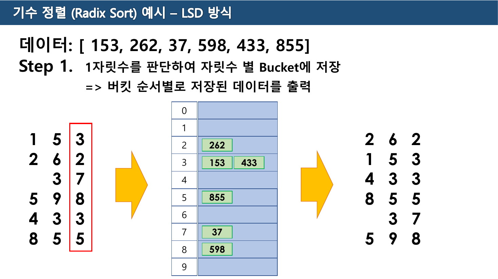

4~6쪽이 `[153, 262, 37, 598, 433, 855]` 를 LSD 방식으로 정렬한다. 세 단계를 직접 계산해 원본과 대조했고 전부 일치한다.

| 단계 | 기준 | 버킷 | 꺼낸 결과 |
| --- | --- | --- | --- |
| Step 1 | **1의 자리** | 2 → `262` / 3 → `153, 433` / 5 → `855` / 7 → `37` / 8 → `598` | `262 153 433 855 37 598` |
| Step 2 | **10의 자리** | 3 → `433, 37` / 5 → `153, 855` / 6 → `262` / 9 → `598` | `433 37 153 855 262 598` |
| Step 3 | **100의 자리** | 0 → `37` / 1 → `153` / 2 → `262` / 4 → `433` / 5 → `598` / 8 → `855` | `37 153 262 433 598 855` |

Step 2의 버킷 3에 `433` 과 `37` 이 함께 들어간 것이 안정성이 작동하는 순간이다. 둘 다 10의 자리가 3인데, Step 1에서 `433` 이 `37` 보다 앞에 있었으므로 그 순서가 유지된다. 만약 뒤집혔다면 Step 3에서 되돌릴 방법이 없다.

`37` 이 두 자리 수라 100의 자리가 `0` 인 것도 짚어 둘 만하다. 없는 자릿수는 0으로 취급되어 자연히 앞쪽 버킷으로 간다.

아래에서 직접 돌려 볼 수 있다.

```html preview
<div id="rx-root">
  <style>
    #rx-root{font-family:system-ui,-apple-system,"Segoe UI",sans-serif;color:var(--foreground);background:var(--card);
      border:1px solid var(--border);border-radius:10px;padding:16px}
    #rx-root h4{margin:0 0 4px;font-size:14px}
    #rx-root .sub{font-size:12px;opacity:.7;margin-bottom:12px}
    #rx-root .bar{display:flex;gap:8px;flex-wrap:wrap;align-items:center;margin-bottom:12px}
    #rx-root button{font:inherit;font-size:12.5px;padding:6px 12px;border-radius:7px;cursor:pointer;
      border:1px solid var(--border);background:transparent;color:var(--foreground)}
    #rx-root button.sel{border-color:var(--chart-1);color:var(--chart-1)}
    #rx-root button:disabled{opacity:.4;cursor:default}
    #rx-root svg{width:100%;height:auto;display:block}
    #rx-root .say{font-size:12.5px;margin-top:10px;line-height:1.7;min-height:3em}
  </style>
  <h4>LSD 기수 정렬 — 버킷은 큐다</h4>
  <div class="sub">원본 13주차 4~6쪽의 데이터 <code>153 262 37 598 433 855</code>.</div>
  <div class="bar">
    <span id="rx-sets"></span>
    <button id="rx-step">▶ 다음 자릿수</button><button id="rx-reset">처음으로</button></div>
  <svg id="rx-svg" viewBox="0 0 700 260" role="img" aria-label="기수 정렬의 버킷"></svg>
  <div class="say" id="rx-say"></div>
</div>
<script>
(function(){
  var SETS=[
    {label:"13주차 예제", data:[153,262,37,598,433,855]},
    {label:"기말 37번 배열", data:[4,3,2,10,12,1,5,6]}
  ];
  var si=0, cur=SETS[0].data.slice(), pass=0;
  var sb=document.getElementById("rx-sets");
  SETS.forEach(function(S,i){
    var b=document.createElement("button"); b.textContent=S.label; b.style.marginRight="6px";
    b.onclick=function(){ si=i; reset(); }; sb.appendChild(b);
  });
  document.getElementById("rx-step").onclick=doStep;
  document.getElementById("rx-reset").onclick=reset;
  var lastBuckets=null;
  function reset(){ cur=SETS[si].data.slice(); pass=0; lastBuckets=null; render("자릿수 버튼을 눌러 진행한다."); }
  function maxDigits(a){ return String(Math.max.apply(null,a)).length; }
  function doStep(){
    if(pass>=maxDigits(SETS[si].data)) return;
    var p=Math.pow(10,pass), b=[];
    for(var i=0;i<10;i++) b.push([]);
    cur.forEach(function(v){ b[Math.floor(v/p)%10].push(v); });
    lastBuckets=b;
    var out=[]; b.forEach(function(q){ q.forEach(function(v){ out.push(v); }); });
    cur=out; pass++;
    var name = pass===1?"1의 자리":pass===2?"10의 자리":"100의 자리";
    render("Step "+pass+" — <b>"+name+"</b> 로 버킷에 넣고 0번부터 순서대로 꺼냈다.<br>결과: <b>"+cur.join(" ")+"</b>"+
           (pass>=maxDigits(SETS[si].data)?"  ← 정렬 완료":""));
  }
  function render(msg){
    Array.prototype.forEach.call(sb.children,function(b,i){ b.classList.toggle("sel",i===si); });
    document.getElementById("rx-step").disabled = pass>=maxDigits(SETS[si].data);
    var S="", x0=18, w=66;
    S+='<text x="'+x0+'" y="22" font-size="12" fill="var(--chart-2)">현재 배열</text>';
    cur.forEach(function(v,i){
      S+='<rect x="'+(x0+i*w)+'" y="30" width="58" height="34" rx="5" fill="none" stroke="var(--chart-1)" stroke-width="1.7"/>';
      S+='<text x="'+(x0+i*w+29)+'" y="53" text-anchor="middle" font-size="14" fill="var(--chart-1)">'+v+'</text>';
    });
    S+='<text x="'+x0+'" y="96" font-size="12" fill="var(--chart-2)">버킷 (각각 큐 — 먼저 들어간 것이 먼저 나온다)</text>';
    for(var d=0;d<10;d++){
      var x=x0+d*68;
      var q = lastBuckets? lastBuckets[d] : [];
      S+='<rect x="'+x+'" y="108" width="60" height="'+(28+Math.max(q.length,1)*24)+'" rx="5" fill="none" stroke="'+(q.length?"var(--chart-2)":"var(--border)")+'" stroke-dasharray="'+(q.length?"0":"4 3")+'"/>';
      S+='<text x="'+(x+30)+'" y="126" text-anchor="middle" font-size="11.5" fill="var(--border)">'+d+'</text>';
      q.forEach(function(v,j){
        S+='<text x="'+(x+30)+'" y="'+(150+j*24)+'" text-anchor="middle" font-size="13" fill="var(--chart-2)">'+v+'</text>';
      });
    }
    document.getElementById("rx-svg").innerHTML=S;
    document.getElementById("rx-say").innerHTML=msg;
  }
  reset();
})();
</script>
```

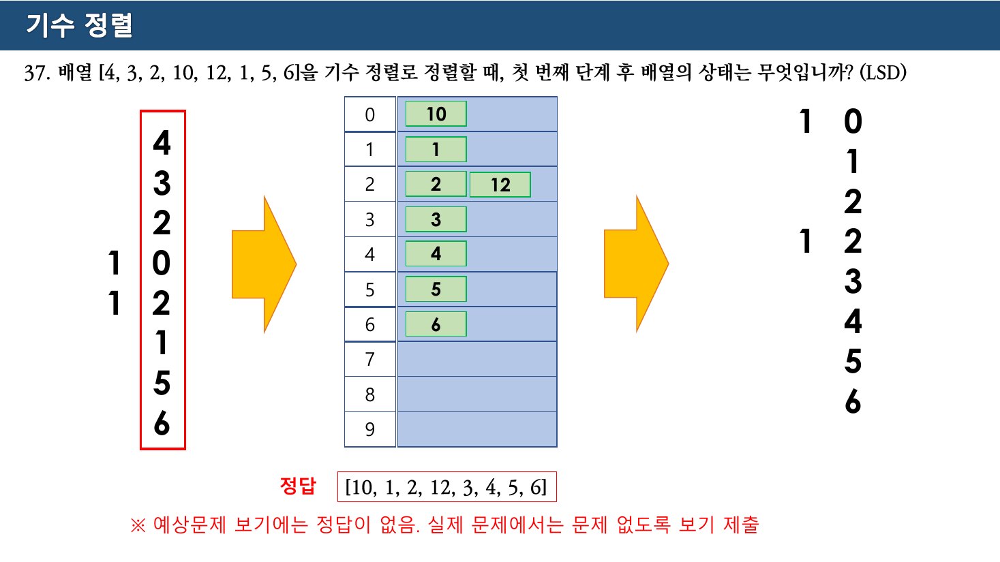

예상문제 8쪽이 `[4,3,2,10,12,1,5,6]` 의 1의 자리 처리를 보여준다. 버킷 0에 `10`, 1에 `1`, 2에 `2`·`12`, 3에 `3`, 4에 `4`, 5에 `5`, 6에 `6` 이 들어가 답은 `[10, 1, 2, 12, 3, 4, 5, 6]` 이다. 역시 **보기에 없다.**

13주차 7쪽은 마지막 과제를 낸다.

> ▣ 강의 중 **LSD 기수정렬 프로그래밍 코드를 기반으로 MSD 기수정렬 프로그래밍을 완성**하세요. (코드 및 실행결과 포함)
> ▣ **Big-O 표기법**에 대해 설명하세요.
> \- 과제 6월 11일 까지 제출 / `학번_성명_데이터구조_4차과제`

MSD는 큰 자릿수부터 처리하므로 LSD처럼 단순 반복으로는 안 된다. 큰 자릿수에서 갈라진 버킷들을 **각각 독립적으로 다시 정렬**해야 하므로 재귀 구조가 되고, 그 점에서 퀵 정렬을 닮는다. 원본은 이 차이를 설명하지 않고 과제로만 남긴다.

---

## 5. 네 알고리즘의 "첫 단계"를 한자리에

이 장의 출발점이었던 네 문항을 정리한다. 모든 값은 직접 계산해 예상문제 답안 자료와 대조했다.

| 문항 | 알고리즘 | 이 자료가 정한 "첫 단계" | 답 | 보기에 있는가 |
| --- | --- | --- | --- | --- |
| 22 | 병합 정렬 | 끝까지 쪼갠 뒤 **첫 합병** | `3 4 2 10 1 12 5 6` | ✗ |
| 27 | 퀵 정렬 | 피벗 하나에 대한 **한 번의 분할 완료** | `1 3 2 4 12 10 5 6` | ✗ |
| 32 | 힙 정렬 | 최대 힙 구성 후 **루트↔마지막 교환** | `4 10 5 6 3 1 2 12` | ✗ |
| 37 | 기수 정렬 | **1의 자리** 한 번 처리 | `10 1 2 12 3 4 5 6` | ✗ |

네 알고리즘의 "첫 단계"가 왜 이렇게 잡혔는지가 곧 각 알고리즘의 구조다.

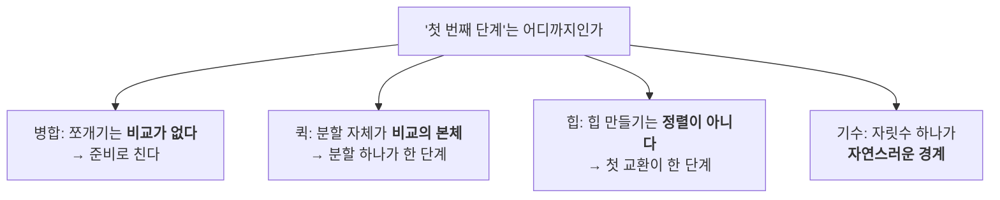

앞의 세 알고리즘은 모두 **"준비"와 "정렬"이 분리**되어 있고, 기수 정렬만 그런 구분이 없다.

---

## 6. 여덟 알고리즘 전체 비교

[09장](./09.%20%EC%A0%95%EB%A0%AC%20%E2%91%A0%20%E2%80%94%20%ED%95%9C%20%ED%9A%8C%EC%A0%84%EC%9D%B4%20%EB%AC%B4%EC%97%87%EC%9D%84%20%ED%99%95%EC%A0%95%ED%95%98%EB%8A%94%EA%B0%80.md)의 넷과 이 장의 넷을 한 표에 놓는다.

| 알고리즘 | 평균 | 최악 | 추가 메모리 | 안정 | 비교 기반 | 원본 근거 |
| --- | --- | --- | --- | --- | --- | --- |
| 선택 | $O(n^2)$ | $O(n^2)$ | O(1) | ✗ | ○ | 12-1 2·4쪽 |
| 버블 | $O(n^2)$ | $O(n^2)$ | O(1) | ○ | ○ | 12-1 5쪽 |
| 삽입 | $O(n^2)$ | $O(n^2)$ | O(1) | ○ | ○ | 12-1 8쪽 |
| 쉘 | 간격 수열에 따름 | 간격 수열에 따름 | O(1) | ✗ | ○ | 12-1 10·14쪽 |
| **힙** | $O(n\log n)$ | $O(n\log n)$ | O(1) | ✗ | ○ | 12-2 2~11쪽 |
| **병합** | $O(n\log n)$ | $O(n\log n)$ | **O(n)** | ○ | ○ | 12-2 12·13쪽 |
| **퀵** | $O(n\log n)$ | **$O(n^2)$** | O(log n) | ✗ | ○ | 12-2 14~16쪽 |
| **기수** | $O(nk)$ | $O(nk)$ | **O(n+k)** | ○ | **✗** | 13주차 2쪽 |

> [!note] 복잡도 열은 원본에 없는 보충이다
> 12-2주차와 13주차 자료 어디에도 $O(\cdot)$ 표기가 나오지 않는다. 13주차 7쪽이 **"Big-O 표기법에 대해 설명하세요"** 를 과제로 낸 것이, 이 개념이 수업에서 따로 다뤄지지 않았음을 보여준다. 위 표의 복잡도·안정성 값은 기말고사 객관식이 직접 묻기 때문에 채워 넣은 것이다.

굵게 표시한 세 칸이 각 알고리즘의 약점이다.

- **병합 정렬의 O(n)** — 합칠 때 결과를 담을 새 배열이 필요하다. 12-2주차 13쪽 그림에서 아래로 내려가는 붉은 배열들이 전부 새 공간이다
- **퀵 정렬의 최악 $O(n^2)$** — 피벗이 매번 최솟값·최댓값으로 뽑히면 분할이 `1 : n-1` 로 갈린다. 14쪽이 *"나쁜 중간값이 선택될 확률"* 이라 말한 그것이다. **이미 정렬된 배열**에 첫 원소를 피벗으로 쓰면 정확히 이 최악이 나온다 — [08장](./08.%20BST%EC%99%80%20AVL%20%E2%80%94%20%EA%B7%A0%ED%98%95%EC%9D%84%20%EC%A7%80%ED%82%A4%EB%A0%A4%EB%A9%B4%20%EB%AC%B4%EC%97%87%EC%9D%84%20%EB%82%B4%EC%96%B4%EC%A3%BC%EC%96%B4%EC%95%BC%20%ED%95%98%EB%8A%94%EA%B0%80.md)의 BST가 정렬된 입력에 무너지는 것과 같은 사고다
- **기수 정렬의 O(n+k)** — 13주차 2쪽이 *"제자리 정렬 형태가 아니기 때문에"* 라고 미리 밝혔다

기수 정렬만 **비교 기반이 아니다.** 비교 기반 정렬은 $O(n\log n)$ 보다 빠를 수 없다는 한계가 있는데, 기수 정렬은 비교를 하지 않으므로 그 한계 밖에 있다. 대신 **자릿수 $k$ 에 비용이 걸린다** — 값의 범위가 크면 $k$ 가 커져 이점이 사라진다.

---

## 7. 예상문제

기말고사 객관식 20~40번과 주관식 2·3·4번이 이 장 범위다.

| 문항 | 답 | 근거 |
| --- | --- | --- |
| 20 · 21. 합병 정렬의 개념·과정 | **① / ③ 배열을 반으로 나눈 뒤 각 부분을 정렬하여 병합** | 12-2 12쪽 |
| 22. 합병 첫 단계 | **보기에 없음** — 정답 `3 4 2 10 1 12 5 6` | 예상문제 4쪽 |
| 23. 합병 정렬의 특징 중 옳지 **않은** 것 | **① 제자리 정렬** | 병합은 O(n) 추가 공간이 필요하다 |
| 24. 합병 정렬의 장점 | **③ 항상 $O(n\log n)$** | 최악에도 보장된다 |
| 25 · 26. 퀵 정렬의 개념·과정 | **② / ③ pivot 을 선택하고 작은 값은 왼쪽, 큰 값은 오른쪽** | 12-2 14쪽 |
| 27. 퀵 첫 단계 | **보기에 없음** — 정답 `1 3 2 4 12 10 5 6` | 예상문제 5쪽 |
| 28. 퀵 정렬의 특징 중 옳지 **않은** 것 | **③ 항상 $O(n\log n)$** | 최악은 $O(n^2)$ |
| 29. 퀵 정렬의 장점 | **① 대규모 데이터 정렬에 적합** | 실측 상수가 작다 |
| 30 · 31. 힙 정렬의 개념·과정 | **③ 최대 힙 또는 최소 힙을 구성한 뒤 루트를 추출** | 12-2 2·6쪽 |
| 32. 힙 첫 단계 | **보기에 없음** — 정답 `4 10 5 6 3 1 2 12` | 예상문제 6·7쪽 |
| 33. 힙 정렬의 특징 중 옳지 **않은** 것 | — (①②③④ 모두 참) | 아래 Callout |
| 34. 힙 정렬의 장점 | **④ 최악의 경우에도 $O(n\log n)$** | 퀵과 갈리는 지점 |
| 35. 기수 정렬의 개념 | **③** (단, 지문에 오류가 있다 — 아래 Callout) | 13주차 2쪽 |
| 36. 기수 정렬의 과정 | **① 각 자릿수를 기준으로 정렬하여 임시 배열에 저장한 뒤 원래 배열에 복사** | 13주차 3쪽 |
| 37. 기수 첫 단계 | **보기에 없음** — 정답 `10 1 2 12 3 4 5 6` | 예상문제 8쪽 |
| 38. 기수 정렬의 특징 중 옳지 **않은** 것 | **①과 ② 둘 다 틀렸다** — 아래 Callout | 13주차 2쪽 |
| 39. 기수 정렬의 장점 | **③ 비교 연산을 사용하지 않기 때문에 일반적인 비교 정렬보다 빠르다** | 13주차 2쪽 |
| 40. 기수 정렬이 우수한 상황 | **① 데이터의 범위가 작은 경우** | 자릿수 $k$ 가 작아야 이득이다 |

> [!caution] 원본 오류 — 35번 지문이 기수 정렬을 "비교 정렬"이라고 한다
> 35번 보기 ③은 이렇게 적혀 있다.
>
> > ③ 각 자릿수(혹은 특정한 자릿수)를 기준으로 정렬하는 **비교 정렬 알고리즘**입니다.
>
> 13주차 2쪽은 정반대로 *"**데이터 간에 비교 연산을 하지 않고**, 정렬할 수 있는 안정적인 정렬 알고리즘"* 이라고 정의했고, 같은 시험지의 **39번 ③** 도 *"비교 연산을 사용하지 않기 때문에 …"* 라고 적는다.
>
> 나머지 세 보기가 명백히 다른 알고리즘을 설명하므로 답은 여전히 ③이지만, **"비교 정렬"이라는 네 글자는 지워야 한다.**

같은 묶음에 문제가 하나 더 있다.

> [!caution] 원본 오류 — 38번은 "옳지 않은 것"이 둘이다
> 38번의 보기 ①과 ②는 이렇다.
>
> > ① 제자리(in-place) 정렬 알고리즘입니다.
> > ② 비교 기반 정렬 알고리즘입니다.
>
> 13주차 2쪽에 따르면 **둘 다 틀렸다** — 기수 정렬은 제자리 정렬이 아니고("추가적인 메모리를 필요로 한다"), 비교 기반도 아니다("비교 연산을 하지 않고"). "옳지 않은 것"을 하나 고르라는 문항에 답이 둘 있다.

힙 쪽에도 같은 종류의 구멍이 있다.

> [!note] 33번도 답이 없다
> 33번은 힙 정렬의 특징 중 **옳지 않은** 것을 묻는데, ① 제자리 · ② 비교 기반 · ③ 항상 $O(n\log n)$ · ④ 힙 자료구조 사용 — **네 보기가 모두 참**이다. 힙 정렬은 실제로 제자리이고, 비교 기반이며, 최악에도 $O(n\log n)$ 이다.
>
> 같은 형식의 23번(합병)과 28번(퀵)에서는 각각 ①과 ③이 거짓이었다. 문항을 복제하면서 힙 정렬만 확인이 빠진 것으로 보인다.

### 주관식

기말고사 주관식 세 문제가 이 장과 [07장](./07.%20%ED%8A%B8%EB%A6%AC%20%E2%80%94%20%EC%9E%90%EC%8B%9D%EC%9D%B4%20%EB%91%98%EC%9D%84%20%EB%84%98%EC%9C%BC%EB%A9%B4%20%EA%B0%90%EB%8B%B9%EC%9D%B4%20%EC%95%88%20%EB%90%9C%EB%8B%A4.md)에 걸쳐 있다.

> 2\. 아래는 배열 자료형에 입력된 데이터를 **합병 정렬**로 정렬하는 과정을 그림과 함께 설명하세요. (15점)
> `13  36  54  23  53  42  12  44`
>
> 3\. 아래의 데이터를 이용하여 기수 정렬의 **LSD 방식**으로 정렬하는 과정을 그림과 함께 설명하세요. (15점)
> 데이터: `[153, 262, 37, 598, 433, 855]`
>
> 4\. **Big-O 표기법**에 대해서 아는 데로 설명하세요. (20점)

2번의 답을 직접 계산했다.

```text
초기      13 36 54 23 53 42 12 44
Divide    13 36 54 23 | 53 42 12 44
Divide    13 36 | 54 23 | 53 42 | 12 44
Divide    13 | 36 | 54 | 23 | 53 | 42 | 12 | 44
Combine   13 36 | 23 54 | 42 53 | 12 44
Combine   13 23 36 54 | 12 42 44 53
Combine   12 13 23 36 42 44 53 54
```

3번은 4절의 표 그대로다 — **기말고사 주관식이 13주차 4~6쪽 예제를 그대로 냈다.** 슬라이드 세 장을 옮겨 그리면 답이 된다.

4번은 13주차 7쪽의 4차 과제와 같은 문제다. 과제로 낸 것을 시험에도 낸 셈이므로, 과제를 제대로 했다면 그대로 쓸 수 있다.

---

## 다른 장과의 연결

- 앞의 네 정렬(선택·버블·삽입·쉘) — [09. 정렬 ①](./09.%20%EC%A0%95%EB%A0%AC%20%E2%91%A0%20%E2%80%94%20%ED%95%9C%20%ED%9A%8C%EC%A0%84%EC%9D%B4%20%EB%AC%B4%EC%97%87%EC%9D%84%20%ED%99%95%EC%A0%95%ED%95%98%EB%8A%94%EA%B0%80.md)
- 힙이 배열 위에 놓이는 근거(완전 이진 트리와 인덱스 식) — [07. 트리](./07.%20%ED%8A%B8%EB%A6%AC%20%E2%80%94%20%EC%9E%90%EC%8B%9D%EC%9D%B4%20%EB%91%98%EC%9D%84%20%EB%84%98%EC%9C%BC%EB%A9%B4%20%EA%B0%90%EB%8B%B9%EC%9D%B4%20%EC%95%88%20%EB%90%9C%EB%8B%A4.md)
- 버킷을 큐로 만드는 이유 — [06. 큐와 데크](./06.%20%ED%81%90%EC%99%80%20%EB%8D%B0%ED%81%AC%20%E2%80%94%20%EA%B5%90%EC%9E%AC%EA%B0%80%20%EA%B3%B5%EC%A7%9C%EB%9D%BC%20%ED%95%9C%20%EC%9E%90%EB%A6%AC%EB%A5%BC%20%EC%8B%A4%EC%8A%B5%EC%9D%80%20%EB%AC%B8%EC%A0%9C%EC%A0%90%EC%9D%B4%EB%9D%BC%20%EB%B6%80%EB%A5%B8%EB%8B%A4.md)
- 정렬된 입력이 최악이 되는 구조 — [08. BST와 AVL](./08.%20BST%EC%99%80%20AVL%20%E2%80%94%20%EA%B7%A0%ED%98%95%EC%9D%84%20%EC%A7%80%ED%82%A4%EB%A0%A4%EB%A9%B4%20%EB%AC%B4%EC%97%87%EC%9D%84%20%EB%82%B4%EC%96%B4%EC%A3%BC%EC%96%B4%EC%95%BC%20%ED%95%98%EB%8A%94%EA%B0%80.md)
- 분할정복과 재귀 — [04. 스택](./04.%20%EC%8A%A4%ED%83%9D%20%E2%80%94%20%EC%B6%9C%EC%9E%85%EA%B5%AC%EA%B0%80%20%ED%95%98%EB%82%98%EB%9D%BC%EB%8A%94%20%EC%A0%9C%EC%95%BD%EC%9D%B4%20%EB%A7%8C%EB%93%9C%EB%8A%94%20%EA%B2%83.md) 24쪽의 "순환 호출도 스택 자료구조를 바탕으로 구현"

---

## 근거 자료

| 원본 | 쪽 | 내용 | 이 문서에서 쓰인 곳 |
| --- | --- | --- | --- |
| 12-2주차 | 2 · 3 | 힙의 정의와 최대/최소 힙 | 1절 |
| 12-2주차 | 4 · 5 | 배열 구현과 인덱스 식 | 1절 · **원본 불일치** |
| 12-2주차 | 6 | 힙 생성 알고리즘(heapify) | 1절 |
| 12-2주차 | **7 · 8** | 힙 재배열 Step 1~3 | 1절 · 인용 2장 · **원본 오류** |
| 12-2주차 | **9** · 10 · 11 | 루트를 뒤로 보내며 정렬 | 1절 · 인용 |
| 12-2주차 | 12 | 병합 정렬 정의와 특징 | 2절 |
| 12-2주차 | **13** | 병합 정렬 전 과정 (텍스트 0자) | 2절 · 인용 |
| 12-2주차 | 14 | 퀵 정렬 정의와 특징 | 3절 |
| 12-2주차 | **15 · 16** | 퀵 정렬 분할 과정 (둘 다 텍스트 0자) | 3절 · 인용 2장 |
| 13주차 | 2 · 3 | 기수 정렬 정의 · 버킷 · MSD/LSD | 4절 |
| 13주차 | **4** · 5 · 6 | LSD 3단계 추적 | 4절 · 인용 · 인터랙티브 |
| 13주차 | 7 | 4차 과제 (MSD, Big-O) | 4절 · 7절 |
| 정렬 예상문제 | 4 | 합병 "첫 단계"의 정의와 답 | 2절 |
| 정렬 예상문제 | **5** | 퀵 분할 규칙과 답 | 3절 · 인용 |
| 정렬 예상문제 | 6 · 7 | 힙 구성과 1단계 완료 | 1절 |
| 정렬 예상문제 | **8** | 기수 1자리 처리와 답 | 4절 · 인용 |
| 기말고사 공지용 | 3~7 | 객관식 20~40, 주관식 2·3·4 | 5절 · 7절 |

- 이 문서의 모든 정렬 결과(힙 3단계, 병합, 퀵 분할, 기수 3단계, 기말 네 문항의 답)는 **직접 구현해 계산한 뒤 원본 그림과 대조**했다
- 텍스트 0자 페이지: 12-2주차 **13 · 15 · 16쪽** — 각각 병합 정렬 전 과정과 퀵 정렬 분할 과정이다
- 발견한 원본 문제: 12-2주차 **7·8쪽 배열의 인덱스 6 미갱신**, **4쪽 식(1-기반)과 7쪽 배열(0-기반)의 불일치**, 기말고사 **35번의 "비교 정렬" 표기**, **38번의 복수 정답**, **33번의 정답 부재**, 그리고 **22·27·32·37번의 보기에 정답이 없다는 것**(교수 본인이 답안 자료에 명시)
