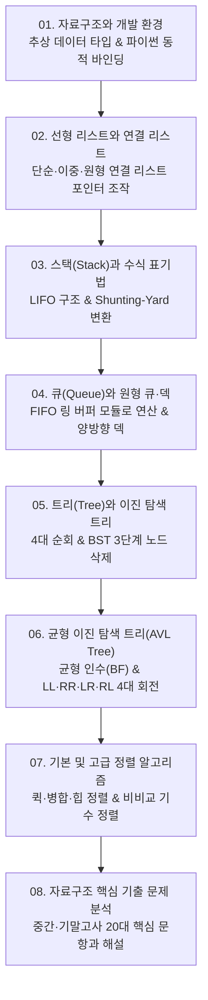

# 📚 데이터 구조 (Data Structures) 전체 강의 로드맵

선형 자료구조(배열, 단순·이중·원형 연결 리스트, 스택, 큐, 덱)부터 비선형 계층 자료구조(이진 트리, BST, 자가 균형 AVL 트리), 8대 정렬 알고리즘(선택·버블·삽입·셸·퀵·병합·힙·기수 정렬), 그리고 전공 시험 실전 문제까지 총망라합니다.

---

## 🗺️ 강의 목차 (Curriculum Overview)

---

## 📑 개별 정리 문서 목록

1. [01. 자료구조와 개발 환경](file:///Users/um-yunsang/work/edu/ComputerScience/01_programming-foundations/data-structures/notes/01.%20%EC%9E%90%EB%A3%8C%EA%B5%AC%EC%A1%B0%EC%99%80%20%EA%B0%9C%EB%B0%9C%20%ED%99%98%EA%B2%BD.md)
   - 추상 데이터 타입(ADT), 시간 복잡도 빅오($O$) 표기법, 알고리즘 수행시간 측정 시뮬레이터
2. [02. 선형 리스트와 연결 리스트(단일·이중·원형)](file:///Users/um-yunsang/work/edu/ComputerScience/01_programming-foundations/data-structures/notes/02.%20%EC%84%A0%ED%98%95%20%EB%A6%AC%EC%8A%A4%ED%8A%B8%EC%99%80%20%EC%97%B0%EA%B2%B0%20%EB%A6%AC%EC%8A%A4%ED%8A%B8(%EB%8B%A8%EC%9D%BC%C2%B7%EC%9D%B4%EC%A4%91%C2%B7%EC%9B%90%ED%98%95).md)
   - 배열 vs 연결 리스트 비교, SList/DList/CList 포인터 조작, 실시간 연결 리스트 시뮬레이터
3. [03. 스택(Stack)과 수식 표기법 변환·괄호 매칭](file:///Users/um-yunsang/work/edu/ComputerScience/01_programming-foundations/data-structures/notes/03.%20%EC%8A%A4%ED%83%9D(Stack)%EA%B3%BC%20%EC%88%98%EC%8B%9D%20%ED%91%9C%EA%B8%B0%EB%B2%95%20%EB%B3%80%ED%99%98%C2%B7%EA%B4%84%ED%98%B8%20%EB%A7%A4%EC%B9%AD.md)
   - LIFO 원리, Shunting-Yard 중위$\rightarrow$후위 변환 알고리즘, 실시간 수식 변환 및 스택 계산기
4. [04. 큐(Queue)와 원형 큐·덱(Deque)](file:///Users/um-yunsang/work/edu/ComputerScience/01_programming-foundations/data-structures/notes/04.%20%ED%81%90(Queue)%EC%99%80%20%EC%9B%90%ED%98%95%20%ED%81%90%C2%B7%EB%8D%B1(Deque).md)
   - FIFO 구조, 선형 큐의 거짓 포화 한계, 원형 큐(Circular Queue, Modulo $N$) 링 버퍼 시뮬레이터
5. [05. 트리(Tree)와 이진 탐색 트리(BST)](file:///Users/um-yunsang/work/edu/ComputerScience/01_programming-foundations/data-structures/notes/05.%20%ED%8A%B8%EB%A6%AC(Tree)%EC%99%80%20%EC%9D%B4%EC%A7%84%20%ED%83%90%EC%83%89%20%ED%8A%B8%EB%A6%AC(BST).md)
   - 전위/중위/후위/레벨 4대 순회, BST의 대소 불변성 및 3단계 노드 삭제, 실시간 동적 BST 시뮬레이터
6. [06. 균형 이진 탐색 트리(AVL Tree)와 회전 연산](file:///Users/um-yunsang/work/edu/ComputerScience/01_programming-foundations/data-structures/notes/06.%20%EA%B7%A0%ED%98%95%20%EC%9D%B4%EC%A7%84%20%ED%83%90%EC%83%89%20%ED%8A%B8%EB%A6%AC(AVL%20Tree)%EC%99%80%20%ED%92%88%EC%A0%84%20%EC%97%B0%EC%82%B0.md)
   - 균형 인수($\text{BF}$), LL·RR 단일 회전 및 LR·RL 이중 회전 알고리즘, 자가 균형 AVL 시뮬레이터
7. [07. 기본 정렬 및 고급 정렬(기수·힙·병합·퀵)](file:///Users/um-yunsang/work/edu/ComputerScience/01_programming-foundations/data-structures/notes/07.%20%EA%B8%B0%EB%B3%B8%20%EC%A0%95%EB%A0%AC%20%EB%B0%8F%20%EA%B3%A0%EA%B8%89%20%EC%A0%95%EB%A0%AC(%EA%B8%B0%EC%88%98%C2%B7%ED%9E%99%C2%B7%EB%B3%91%ED%95%A9%C2%B7%ED%80%B5).md)
   - 비교 하한($\Omega(n \log n)$), 퀵/병합/힙 정렬 분할 정복, 8대 정렬 실시간 막대 그래프 시뮬레이터
8. [08. 자료구조 핵심 기출 및 복합 문제 분석](file:///Users/um-yunsang/work/edu/ComputerScience/01_programming-foundations/data-structures/notes/08.%20%EC%9E%90%EB%A3%8C%EA%B5%AC%EC%A1%B0%20%ED%95%B5%EC%8B%AC%20%EA%B8%B0%EC%B6%9C%20%EB%B0%8F%20%EB%B3%B5%ED%95%A9%20%EB%AC%B8%EC%A0%9C%20%EB%B6%84%EC%84%9D.md)
   - 연결 리스트 메모리 오버헤드, 시스템 스택 복귀 주소 관리, 실전 모의평가 자동 채점 퀴즈기
