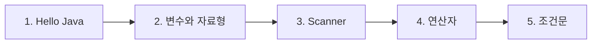

> [!abstract] 이 과목은
> 자바 문법과 객체지향 정리. 학기: extracurricular.

## 학습 경로

번호는 강의 진도 순이다. 앞 문서를 읽었다는 전제로 다음 문서가 쓰인다.

## 정리문서

모두 `notes/` 에 있다. 총 5편.

| 문서 | 다루는 내용 |
| :-- | :-- |
| [1. Hello Java](<./notes/1. Hello Java.md>) | — |
| [2. 변수와 자료형](<./notes/2. 변수와 자료형.md>) | — |
| [3. Scanner](<./notes/3. Scanner.md>) | — |
| [4. 연산자](<./notes/4. 연산자.md>) | — |
| [5. 조건문](<./notes/5. 조건문.md>) | — |

## 관련 과목

*(작성 예정 — 지식그래프 4단계에서 관계 타입과 함께 채운다)*
