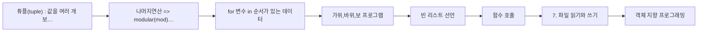

> [!abstract] 이 과목은
> 파이썬 문법과 객체지향. 지뢰찾기 등 구현 과제 포함. 학기: 2-1.

## 학습 경로

번호는 강의 진도 순이다. 앞 문서를 읽었다는 전제로 다음 문서가 쓰인다.

## 정리문서

모두 `notes/` 에 있다. 총 13편.

| 문서 | 다루는 내용 |
| :-- | :-- |
| [튜플(tuple) : 값을 여러 개 보유하는 정보체](<./notes/1. 변수와 자료형.md>) | — |
| [나머지연산 => modular(mod)# 제곱연산 => power(pow)](<./notes/2. 연산자.md>) | — |
| [for 변수 in 순서가 있는 데이터](<./notes/3. 반복문.md>) | — |
| [가위,바위,보 프로그램](<./notes/4. 조건문.md>) | — |
| [빈 리스트 선언](<./notes/5. 리스트, 튜플, 딕셔너리.md>) | — |
| [함수 호출](<./notes/6. 함수.md>) | — |
| [7. 파일 읽기와 쓰기](<./notes/7. 파일 읽기와 쓰기.md>) | — |
| [객체 지향 프로그래밍](<./notes/8. 객체 지향 프로그래밍.md>) | — |
| [각 문자열의 첫 문자와 끝 문자](<./notes/답지.md>) | — |
| [중간시험 범위](<./notes/중간시험 범위.md>) | — |
| [지뢰찾기](<./notes/지뢰찾기.md>) | — |
| [프로그래머스 Python 기초 문제 1-10](<./notes/프로그래머스 Python 기초 문제 1-10.md>) | — |
| [프로그래머스 Python 기초 문제 11-20](<./notes/프로그래머스 Python 기초 문제 11-20.md>) | — |

## 원본 자료

교수가 배포한 자료다. `sources/` 에 있고 수정하지 않는다. 총 4건.

- `23-2 중간고사.pdf`
- `과제 02_지뢰찾기-1.pdf`
- `문제풀이_11_20.pdf`
- `문제풀이_1_10.pdf`

## 관련 과목

> [!note] 아직 비어 있다
> 다른 과목과의 관계는 지식그래프 4단계에서 관계 타입(`prerequisite` · `elaborates` · `contrasts` · `applies` · `evidences`)과 함께 채운다. 근거 없이 미리 이어두지 않는다.
