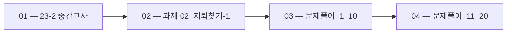

 > [!abstract] 사용법
 > 이 지도는 현재 폴더의 원본 PDF를 파일 순서대로 묶어 **강의 진행 → 핵심 단서 → 점검 포인트**를 연결합니다. 세부 개념은 같은 폴더의 주제 노트와 함께 대조하세요.

## 강의 흐름



<Tabs>
  <Tab label="파일 순서">파일명에 포함된 주차·장·버전 표기를 먼저 읽어 강의의 큰 흐름을 잡습니다.</Tab>
  <Tab label="중복 자료">같은 접두사나 버전이 겹치면 앞 자료를 기준으로 뒤 자료의 보충·실습 여부를 비교합니다.</Tab>
  <Tab label="검증">첫 페이지 단서는 방향만 제시하므로 정의·식·코드·수치는 원본 PDF에서 다시 확인합니다.</Tab>
</Tabs>

## 원본 PDF 목록

| 파일 | 쪽수 | 첫 페이지 단서 |
| :-- | --: | :-- |
| 23-2 중간고사.pdf | 3 | 1. 문자열이 저장된 리스트가 있다. 문자열 중에 5. 1부터 99까지 2자리의 정수로 이루어진 복권 서 “aba”처럼 첫 번째 문자와 마지막 문자가 동 이 있다. 2자리가 전부 당첨 번호와 일치하면 ‘1 일한 문자열 수를 계산하는 코드를 작성하세요. 등상’이고, 2자리 중 하나만 일치하면 ‘2등상’이다. (’aba’, ‘xyz’, ‘abc’, ‘121’) 일치하는 숫자가 없으면 ‘미당첨’이 |
| 과제 02_지뢰찾기-1.pdf | 4 | LAB 지뢰찾기 게임판 지뢰 찾기 게임에서는 M x N 크기의 격자판에서 일부 칸에 지뢰가 숨겨져 있습니다. 각 칸에는 숫자 가 표시되는데, 이 숫자는 주변 8칸(상, 하, 좌, 우, 대각선 4방향)에 있는 지뢰의 수를 나타냅니다. 격자판의 크기와 각 칸에 지뢰가 있는지 없는지의 정보가 주어질 때, 모든 칸에 대한 주변 지뢰의 수 를 계산하는 프로그램을 작성하세요. (입력) (출력) ((-, |
| 문제풀이_1_10.pdf | 10 | 문제 1. 문자열 내 p와 y의 개수 문제 설명 대문자와 소문자가 섞여있는 문자열 s가 주어집니다. s에 'p'의 개수와 'y'의 개수를 비교해 같으면 True, 다르면 False를 return 하는 solution 함수를 완성하세요. 'p', 'y' 모두 하나도 없는 경우는 항상 True를 리턴합니다. 단, 개수를 비교할 때 대문자와 소문자는 구별하지 않습니다. 예를 들어 s가 "pPooo |
| 문제풀이_11_20.pdf | 10 | 문제 11. 직사각형 별찍기 문제 설명 두 개의 정수 n과 m이 주어집니다. 별(*) 문자를 이용해 가로의 길이가 n, 세로의 길이가 m인 직사각형 형태를 출력해보세요. 제한 조건 • n과 m은 각각 1000 이하인 자연수입니다. 입출력 예 n m 출력 ***** 5 3 ***** ***** |

## 원본 단계 인터랙티브

```html preview
<div style="font-family:system-ui,sans-serif;padding:20px;color:var(--foreground)">
  <label for="flow941416771" style="font-size:14px;font-weight:600">원본 자료 단계</label>
  <div id="flow941416771-out" style="font-size:24px;font-weight:700;color:var(--chart-1);margin:6px 0">23-2 중간고사</div>
  <input id="flow941416771" type="range" min="1" max="4" step="1" value="1" style="width:100%;accent-color:var(--primary)" />
  <p style="font-size:13px;color:var(--muted-foreground)">슬라이더를 움직이면 파일명 순서대로 자료의 위치를 확인합니다.</p>
  <script>
    var flow941416771 = document.getElementById('flow941416771');
    var flow941416771Out = document.getElementById('flow941416771-out');
    var flow941416771Steps = ["23-2 중간고사","과제 02_지뢰찾기-1","문제풀이_1_10","문제풀이_11_20"];
    flow941416771.addEventListener('input', function () {
      flow941416771Out.textContent = flow941416771Steps[Number(flow941416771.value) - 1] || '';
    });
  </script>
</div>
```

## 점검 포인트

- **범위:** 4개 PDF, 총 27쪽.
- **근거:** 표의 쪽수와 첫 페이지 단서는 현재 sources/ 파일에서 직접 추출했습니다.
- **학습 순서:** 흐름도와 슬라이더를 먼저 훑은 뒤, 주제 노트의 정의·절차·실습 결과를 순서대로 대조합니다.

> [!warning] 과해석 방지
> 이 지도에는 파일명·쪽수·첫 페이지 추출 단서만 기록했습니다. PDF에 없는 구현 세부, 성능 수치, 권장 설정은 추가하지 않습니다.

<details>
<summary>다음 읽기</summary>

현재 단계의 원본을 열어 제목·절차·도식을 확인한 뒤, 같은 폴더의 주제 노트에 해당 근거가 반영되었는지 점검하세요.

</details>
