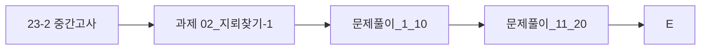

> [!abstract] 사용법
> 이 문서는 원본 PDF의 **순서 → 핵심 단서 → 학습 점검**을 한 번에 보는 지도입니다. 세부 개념은 같은 폴더의 주제 노트와 원본 PDF를 함께 대조하세요.

## 강의 흐름



<Tabs>
  <Tab label="파일 순서">파일명과 주차·장 제목을 강의 진행 신호로 삼아 처음부터 읽습니다.</Tab>
  <Tab label="읽기 전략">이론에서 실습·평가로 이동하며 같은 주제의 중복 PDF는 보조 자료로 비교합니다.</Tab>
  <Tab label="검증">텍스트가 빈약한 자료는 추출되지 않은 도식·수식을 임의로 채우지 않고 원본에서 확인합니다.</Tab>
</Tabs>

## 원본 PDF 목록

| 파일 | 쪽수 | 첫 페이지 단서 |
| :-- | --: | :-- |
| 23-2 중간고사.pdf | — | 1. 문자열이 저장된 리스트가 있다. 문자열 중에 5. 1부터 99까지 2자리의 정수로 이루어진 복권 서 “aba”처럼 첫 번째 문자와 마지막 문자가 동 이 있다. 2자리가 전부 당첨 번호와 일치하면 ‘ |
| 과제 02_지뢰찾기-1.pdf | — | LAB 지뢰찾기 게임판 지뢰 찾기 게임에서는 M x N 크기의 격자판에서 일부 칸에 지뢰가 숨겨져 있습니다. 각 칸에는 숫자 가 표시되는데, 이 숫자는 주변 8칸(상, 하, 좌, 우, 대각선 4방향)에 있는 지뢰의 수를 나타냅니다. 격자판의 크기와 각 칸에 지뢰가 있는지 없는지의 |
| 문제풀이_1_10.pdf | — | 문제 1. 문자열 내 p와 y의 개수 문제 설명 대문자와 소문자가 섞여있는 문자열 s가 주어집니다. s에 'p'의 개수와 'y'의 개수를 비교해 같으면 True, 다르면 False를 return 하는 solution 함수를 완성하세요. 'p', 'y' 모두 하나도 없는 경우는 항상 Tr |
| 문제풀이_11_20.pdf | — | 문제 11. 직사각형 별찍기 문제 설명 두 개의 정수 n과 m이 주어집니다. 별(*) 문자를 이용해 가로의 길이가 n, 세로의 길이가 m인 직사각형 형태를 출력해보세요. 제한 조건 • n과 m은 각각 1000 이하인 자연수입니다. 입출력 예 n m 출력 |

## 원본 단계 인터랙티브

```html preview
<div style="font-family:system-ui,sans-serif;padding:20px;color:var(--foreground)">
  <label for="flow353875" style="font-size:14px;font-weight:600">원본 자료 단계</label>
  <div id="flow353875-out" style="font-size:24px;font-weight:700;color:var(--chart-1);margin:6px 0">23-2 중간고사</div>
  <input id="flow353875" type="range" min="1" max="4" step="1" value="1" style="width:100%;accent-color:var(--primary)" />
  <p style="font-size:13px;color:var(--muted-foreground)">슬라이더를 움직이면 파일명 순서대로 자료의 역할을 확인합니다.</p>
  <script>
    var flow353875 = document.getElementById('flow353875');
    var flow353875Out = document.getElementById('flow353875-out');
    var flow353875Steps = ["23-2 중간고사","과제 02_지뢰찾기-1","문제풀이_1_10","문제풀이_11_20"];
    flow353875.addEventListener('input', function () {
      flow353875Out.textContent = flow353875Steps[Number(flow353875.value) - 1];
    });
  </script>
</div>
```

## 점검 포인트

- **범위:** 4개 PDF, 총 0쪽.
- **근거:** 첫 페이지 추출 단서를 표에 남겨 주제명과 흐름을 확인했습니다.
- **시각 자료:** 0개 파일은 첫 페이지 텍스트가 빈약하므로 필요한 경우 승인된 크롭 후보로만 별도 검토합니다.

> [!warning] 과해석 방지
> 이 지도에는 파일명·쪽수·추출된 첫 페이지 단서만 기록했습니다. PDF에 없는 구현 세부, 성능 수치, 권장 설정은 추가하지 않습니다.

<details>
<summary>다음 읽기</summary>

현재 단계의 파일을 선택한 뒤, 같은 폴더의 주제 노트에서 정의·절차·실습 결과를 대조하세요.

</details>
