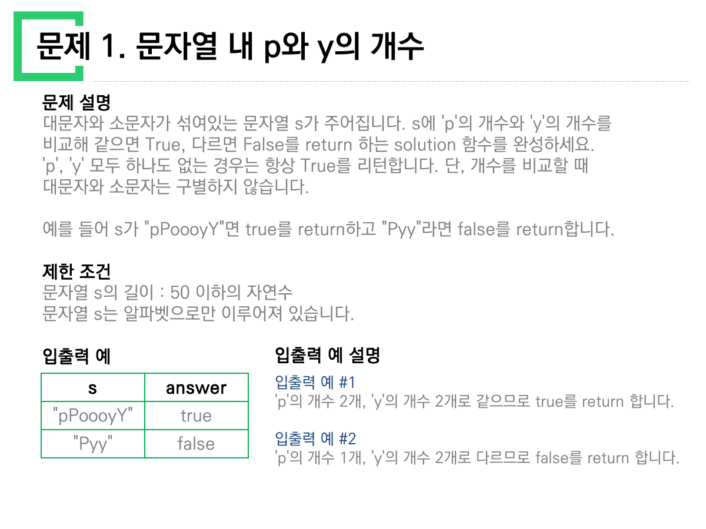
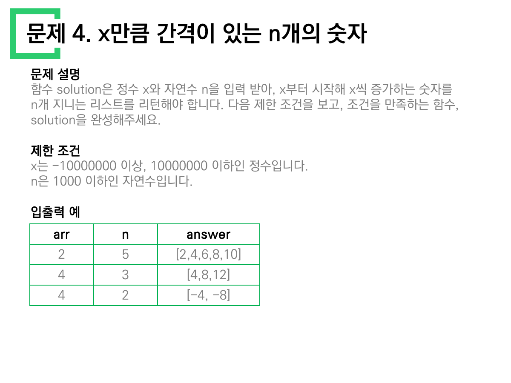
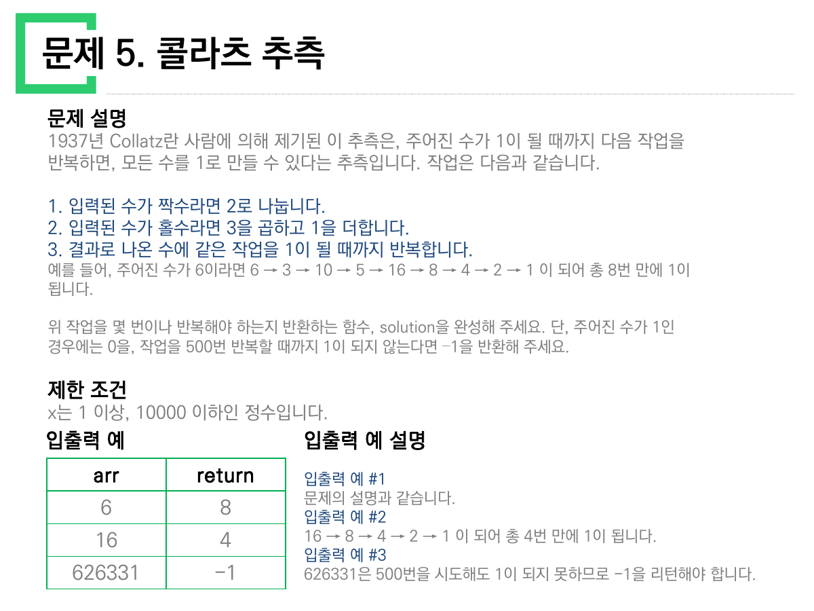
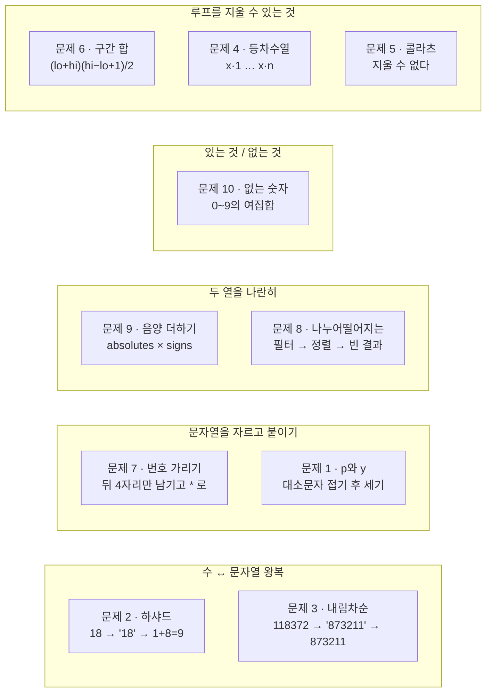

> [!abstract] 이 자료가 실제로 하는 말
> 이 PDF는 열 쪽이고, 한 쪽이 문제 하나다. 그리고 **열 쪽이 전부 같은 틀**을 쓴다 — `문제 설명` / `제한 조건` / `입출력 예`, 필요하면 `입출력 예 설명`.
>
> 틀이 같으니 눈은 자연히 표로 간다. 표에는 입력과 답이 나란히 있고, 그것만 맞추면 될 것 같다. 그런데 열 문제를 하나씩 짚어 보면 **표만 보고 짠 코드가 통과하지 못하는 문제가 절반**이다. 통과를 가르는 줄은 표에 없고, 그 위 `제한 조건` 블록에, 혹은 `문제 설명`의 마지막 한 문장에 조용히 놓여 있다.
>
> 그래서 이 정리는 문제를 1번부터 차례로 풀지 않는다. **표와 제한 조건이 어긋나는 다섯 지점**을 먼저 보고, 그 다음에 나머지를 정리한다.

---

## 자료의 생김새부터

원본 `문제풀이_1_10.pdf` 는 PowerPoint로 만든 10쪽짜리 슬라이드다. 쪽당 글자 수는 159~496자, 평균 322자. 그림도 코드도 없고 **글과 표뿐**이다.

| 쪽 | 문제 | 글자 수 | 다루는 것 |
| --- | --- | --- | --- |
| 1 | 문자열 내 p와 y의 개수 | 377 | 문자열 집계 |
| 2 | 하샤드 수 | 368 | 자릿수 합 |
| 3 | 정수 내림차순으로 배치하기 | 159 | 자릿수 정렬 |
| 4 | x만큼 간격이 있는 n개의 숫자 | 209 | 등차수열 생성 |
| 5 | 콜라츠 추측 | 429 | 반복과 상한 |
| 6 | 두 정수 사이의 합 | 201 | 구간 합 |
| 7 | 핸드폰 번호 가리기 | 231 | 문자열 마스킹 |
| 8 | 나누어 떨어지는 숫자 배열 | 444 | 필터·정렬·빈 결과 |
| 9 | 음양 더하기 | 496 | 두 배열의 짝 |
| 10 | 없는 숫자 더하기 | 314 | 여집합 |



1쪽을 보면 이 자료가 정보를 어디에 두는지가 한눈에 보인다. 표에는 `"pPoooyY" → true` 와 `"Pyy" → false` 두 줄뿐이다. 그런데 **두 예시 모두 p와 y가 실제로 들어 있는 문자열**이다. `"abc"` 처럼 둘 다 없는 입력을 어떻게 처리할지는 표에 없고, 설명 블록의 세 번째 문장에 있다.

> 'p', 'y' 모두 하나도 없는 경우는 항상 True를 리턴합니다.
> — 원본 1쪽, `문제 설명`

`s.count('p') == s.count('y')` 라고 쓰면 이 줄은 저절로 만족된다(`0 == 0`). 하지만 "p의 개수를 세고, y의 개수를 세고, 하나라도 0이면…" 식으로 조건을 나눠 쓰기 시작한 사람은 여기서 걸린다. **표는 그 갈림길을 보여주지 않는다.**

---

## 표만 보고 짜면 틀리는 다섯 문제

열 문제 중 다섯은 입출력 예를 전부 맞히면서도 오답이 될 수 있다. 아래에서 문제를 골라, 표에 실린 입력과 **표에 없는 입력**을 나란히 넣어 보라. 두 코드의 답이 갈리는 지점이 곧 제한 조건이 하는 일이다.

```html preview h=640px
<div style="font-family:system-ui,-apple-system,'Segoe UI',sans-serif;color:var(--foreground);padding:18px">
  <div id="tabs" style="display:flex;gap:8px;flex-wrap:wrap;margin-bottom:16px"></div>

  <div style="border:1px solid var(--border);border-radius:var(--radius,8px);background:var(--card);padding:16px">
    <div id="title" style="font-weight:700;font-size:15px;margin-bottom:6px"></div>
    <div id="rule" style="font-size:13px;line-height:1.6;color:var(--muted-foreground);margin-bottom:14px"></div>

    <div style="display:flex;gap:10px;flex-wrap:wrap;align-items:flex-end;margin-bottom:14px">
      <div>
        <label id="lab1" for="in1" style="display:block;font-size:11px;color:var(--muted-foreground);margin-bottom:3px"></label>
        <input id="in1" style="width:180px;padding:7px 9px;font-size:14px;font-family:ui-monospace,monospace;border:1px solid var(--border);border-radius:6px;background:var(--background,var(--card));color:var(--foreground)" />
      </div>
      <div id="wrap2">
        <label id="lab2" for="in2" style="display:block;font-size:11px;color:var(--muted-foreground);margin-bottom:3px"></label>
        <input id="in2" style="width:140px;padding:7px 9px;font-size:14px;font-family:ui-monospace,monospace;border:1px solid var(--border);border-radius:6px;background:var(--background,var(--card));color:var(--foreground)" />
      </div>
      <div id="presets" style="display:flex;gap:6px;flex-wrap:wrap"></div>
    </div>

    <div style="display:grid;grid-template-columns:repeat(auto-fit,minmax(240px,1fr));gap:12px">
      <div style="border:1px solid var(--border);border-radius:6px;padding:12px">
        <div style="font-size:11px;letter-spacing:.04em;color:var(--muted-foreground);margin-bottom:6px">표만 보고 짠 코드</div>
        <pre id="codeA" style="margin:0 0 10px;font-size:12px;line-height:1.5;white-space:pre-wrap;font-family:ui-monospace,monospace;color:var(--foreground)"></pre>
        <div style="font-size:12px;color:var(--muted-foreground)">결과</div>
        <div id="outA" style="font-family:ui-monospace,monospace;font-size:16px;font-weight:700"></div>
      </div>
      <div style="border:1px solid var(--border);border-radius:6px;padding:12px">
        <div style="font-size:11px;letter-spacing:.04em;color:var(--muted-foreground);margin-bottom:6px">제한 조건까지 읽은 코드</div>
        <pre id="codeB" style="margin:0 0 10px;font-size:12px;line-height:1.5;white-space:pre-wrap;font-family:ui-monospace,monospace;color:var(--foreground)"></pre>
        <div style="font-size:12px;color:var(--muted-foreground)">결과</div>
        <div id="outB" style="font-family:ui-monospace,monospace;font-size:16px;font-weight:700"></div>
      </div>
    </div>

    <div id="verdict" style="margin-top:14px;font-size:13px;line-height:1.6;padding:10px 12px;border-radius:6px;border:1px solid var(--border)"></div>
  </div>
</div>
<script>
(function(){
  var P = [
    {
      key:"1", name:"문제 1 · p와 y",
      rule:"제한 조건이 아니라 <b>설명의 마지막 문장</b>이 사양이다 — “‘p’, ‘y’ 모두 하나도 없는 경우는 항상 True”. 표의 두 예시(\"pPoooyY\", \"Pyy\")에는 둘 다 p나 y가 들어 있어서, 이 규칙을 건드리지 않는다.",
      l1:"s (문자열)", l2:null, d1:"pPoooyY",
      presets:[["pPoooyY",null],["Pyy",null],["abc",null],["",null]],
      codeA:"p = s.lower().count('p')\ny = s.lower().count('y')\nif p == 0 or y == 0:\n    return False\nreturn p == y",
      codeB:"s = s.lower()\nreturn s.count('p') == s.count('y')",
      run:function(a){
        var s=(a||"").toLowerCase();
        var p=0,y=0,i;
        for(i=0;i<s.length;i++){ if(s[i]==='p')p++; if(s[i]==='y')y++; }
        return [ (p===0||y===0) ? "False" : String(p===y ? "True":"False"),
                 p===y ? "True" : "False",
                 "p="+p+", y="+y ];
      }
    },
    {
      key:"4", name:"문제 4 · x만큼 간격",
      rule:"제한 조건은 “x는 <b>-10000000 이상</b>, 10000000 이하인 정수”라고 못 박는다. 즉 x는 음수일 수 있다. 표의 세 번째 줄이 정확히 그 경우인데 — 뒤에서 보듯 <b>표의 x 칸에서 부호가 사라졌다</b>.",
      l1:"x (정수)", l2:"n (개수)", d1:"-4", d2:"2",
      presets:[["2","5"],["4","3"],["-4","2"],["4","2"]],
      codeA:"# 표의 앞 두 줄만 보면 x는 늘 양수다\nreturn [x*i for i in range(1, n+1)]  # 같은 식",
      codeB:"return [x*i for i in range(1, n+1)]",
      run:function(a,b){
        var x=parseInt(a,10), n=parseInt(b,10);
        if(isNaN(x)||isNaN(n)||n<1) return ["—","—","입력을 확인하세요"];
        var r=[],i; for(i=1;i<=Math.min(n,12);i++) r.push(x*i);
        var s="["+r.join(", ")+(n>12?", …":"")+"]";
        return [s,s,"x="+x+", n="+n];
      }
    },
    {
      key:"5", name:"문제 5 · 콜라츠",
      rule:"표에는 <code>-1</code> 이 나오는 줄이 있지만 <b>“500번”이라는 수는 표 어디에도 없다</b>. 그 수는 설명 블록 마지막 문장에만 있다 — “작업을 500번 반복할 때까지 1이 되지 않는다면 –1”. 상한이 없는 코드는 626331에서 영원히 돌지는 않지만(언젠가 1이 된다) <b>정답인 −1을 내지 못한다</b>.",
      l1:"n (자연수)", l2:null, d1:"626331",
      presets:[["6",null],["16",null],["1",null],["626331",null],["27",null]],
      codeA:"cnt = 0\nwhile num != 1:\n    num = num//2 if num%2==0 else num*3+1\n    cnt += 1\nreturn cnt",
      codeB:"cnt = 0\nwhile num != 1 and cnt < 500:\n    num = num//2 if num%2==0 else num*3+1\n    cnt += 1\nreturn cnt if num == 1 else -1",
      run:function(a){
        var n=parseInt(a,10);
        if(isNaN(n)||n<1) return ["—","—","1 이상의 자연수를 넣으세요"];
        var v=n,c=0;
        while(v!==1 && c<20000){ v = (v%2===0)? v/2 : v*3+1; c++; }
        var full=c;
        var v2=n,c2=0;
        while(v2!==1 && c2<500){ v2 = (v2%2===0)? v2/2 : v2*3+1; c2++; }
        var capped = (v2===1)? String(c2) : "-1";
        return [String(full), capped, "500회 안에 1에 도달? " + (v2===1 ? "예" : "아니오 (실제로는 "+full+"회 필요)")];
      }
    },
    {
      key:"6", name:"문제 6 · 두 정수 사이의 합",
      rule:"“a와 b의 <b>대소관계는 정해져있지 않습니다</b>” — 표의 세 번째 줄 <code>a=5, b=3 → 12</code> 가 그 경우다. <code>range(a, b+1)</code> 로 쓰면 이 줄에서 빈 구간이 되어 0을 낸다.",
      l1:"a", l2:"b", d1:"5", d2:"3",
      presets:[["3","5"],["3","3"],["5","3"],["-3","3"]],
      codeA:"total = 0\nfor i in range(a, b+1):\n    total += i\nreturn total",
      codeB:"lo, hi = min(a, b), max(a, b)\nreturn (lo + hi) * (hi - lo + 1) // 2",
      run:function(a,b){
        var x=parseInt(a,10), y=parseInt(b,10);
        if(isNaN(x)||isNaN(y)) return ["—","—","정수 두 개를 넣으세요"];
        var t=0,i; for(i=x;i<=y;i++) t+=i;
        var lo=Math.min(x,y), hi=Math.max(x,y);
        var g=(lo+hi)*(hi-lo+1)/2;
        return [String(t), String(g), (x>y? "a > b — 순진한 range는 빈 구간이 된다" : "a ≤ b — 두 코드가 같은 답")];
      }
    },
    {
      key:"8", name:"문제 8 · 나누어 떨어지는 배열",
      rule:"“divisor로 나누어 떨어지는 element가 <b>하나도 없다면 배열에 -1을 담아</b> 반환” — 표의 세 번째 줄이 그 경우다. 필터만 하고 끝내면 빈 배열 <code>[]</code> 이 나온다. 게다가 결과는 <b>오름차순 정렬</b>이라, 입력 순서를 그대로 두면 첫 줄부터 틀린다.",
      l1:"arr (쉼표 구분)", l2:"divisor", d1:"5, 9, 7, 10", d2:"5",
      presets:[["5, 9, 7, 10","5"],["2, 36, 1, 3","1"],["3, 2, 6","10"]],
      codeA:"return [x for x in arr if x % divisor == 0]",
      codeB:"r = sorted(x for x in arr if x % divisor == 0)\nreturn r if r else [-1]",
      run:function(a,b){
        var arr=(a||"").split(",").map(function(s){return parseInt(s.trim(),10);}).filter(function(v){return !isNaN(v);});
        var d=parseInt(b,10);
        if(!arr.length||isNaN(d)||d===0) return ["—","—","배열과 0이 아닌 divisor를 넣으세요"];
        var f=arr.filter(function(v){return v%d===0;});
        var g=f.slice().sort(function(p,q){return p-q;});
        var A="["+f.join(", ")+"]";
        var B= g.length? "["+g.join(", ")+"]" : "[-1]";
        return [A,B, g.length? "정렬 차이만 남는다" : "걸러진 원소가 없다 — [-1] 을 만들어야 한다"];
      }
    }
  ];

  var cur = 0;
  var tabs=document.getElementById('tabs');
  P.forEach(function(p,i){
    var b=document.createElement('button');
    b.textContent=p.name;
    b.style.cssText="padding:7px 12px;font-size:12px;border-radius:999px;cursor:pointer;border:1px solid var(--border);background:var(--card);color:var(--foreground)";
    b.onclick=function(){ cur=i; sync(); };
    tabs.appendChild(b);
  });

  var in1=document.getElementById('in1'), in2=document.getElementById('in2');
  in1.oninput=render; in2.oninput=render;

  function sync(){
    var p=P[cur];
    Array.prototype.forEach.call(tabs.children,function(b,i){
      b.style.background = (i===cur)? "var(--chart-1)" : "var(--card)";
      b.style.color = (i===cur)? "var(--card)" : "var(--foreground)";
      b.style.borderColor = (i===cur)? "var(--chart-1)" : "var(--border)";
    });
    document.getElementById('title').textContent = p.name;
    document.getElementById('rule').innerHTML = p.rule;
    document.getElementById('lab1').textContent = p.l1;
    document.getElementById('wrap2').style.display = p.l2? "block":"none";
    if(p.l2) document.getElementById('lab2').textContent = p.l2;
    in1.value = p.d1; in2.value = p.d2 || "";
    document.getElementById('codeA').textContent = p.codeA;
    document.getElementById('codeB').textContent = p.codeB;
    var ph=document.getElementById('presets'); ph.innerHTML="";
    p.presets.forEach(function(pr){
      var b=document.createElement('button');
      b.textContent = pr[1]===null? pr[0]===""? '""' : pr[0] : pr[0]+" / "+pr[1];
      b.style.cssText="padding:5px 9px;font-size:11px;font-family:ui-monospace,monospace;border-radius:5px;cursor:pointer;border:1px dashed var(--border);background:transparent;color:var(--muted-foreground)";
      b.onclick=function(){ in1.value=pr[0]; if(pr[1]!==null) in2.value=pr[1]; render(); };
      ph.appendChild(b);
    });
    render();
  }

  function render(){
    var p=P[cur];
    var r=p.run(in1.value, in2.value);
    var a=document.getElementById('outA'), b=document.getElementById('outB');
    a.textContent=r[0]; b.textContent=r[1];
    var same = r[0]===r[1];
    a.style.color = same? "var(--foreground)" : "var(--chart-4, var(--foreground))";
    b.style.color = "var(--chart-2, var(--foreground))";
    var v=document.getElementById('verdict');
    v.innerHTML = (same? "두 코드가 같은 답을 낸다 — <b>이 입력은 차이를 드러내지 못한다</b>. 표에 실린 예시가 대체로 이렇다." :
      "<b>답이 갈렸다.</b> 이 입력은 표에 없거나, 표에 있어도 설명 없이 지나간 줄이다.") +
      "<br><span style='color:var(--muted-foreground)'>" + r[2] + "</span>";
    v.style.borderColor = same? "var(--border)" : "var(--chart-1)";
  }
  sync();
})();
</script>
```

다섯 문제를 다 눌러 보면 한 가지가 분명해진다. **표에 실린 예시는 거의 언제나 "차이를 드러내지 못하는" 입력**이다. 표는 문제를 이해시키기 위한 그림이지 검증을 위한 테스트 집합이 아니다.

---

## 4번 슬라이드 — 표에서 부호가 사라졌다



> [!warning] 원본 오류 ① — 4쪽 입출력 예 표의 세 번째 줄
> 표는 이렇게 적혀 있다.
>
> | arr | n | answer |
> | --- | --- | --- |
> | 2 | 5 | `[2,4,6,8,10]` |
> | 4 | 3 | `[4,8,12]` |
> | **4** | **2** | **`[-4, -8]`** |
>
> 세 번째 줄은 **입력과 출력이 서로 맞지 않는다**. `x = 4, n = 2` 라면 답은 `[4, 8]` 이어야 한다. `[-4, -8]` 이 나오려면 첫 칸이 **`-4`** 여야 한다. 슬라이드로 옮기는 과정에서 음수 부호가 탈락했다.
>
> 이 줄은 장식이 아니다. 제한 조건이 "x는 **-10000000 이상**"이라고 적어 둔 이유가 바로 이 줄이고, `range(x, x*n+1, x)` 처럼 **x가 양수라고 가정한 구현이 무너지는 유일한 예시**다(x가 음수면 이 range는 빈 구간이다). 부호가 빠지면서 표는 그 경고 기능을 잃었다.

같은 표에 하나 더 있다.

> [!note] 원본 오류 ② — 같은 표의 머리글
> 첫 칸의 머리글이 **`arr`** 다. 그런데 이 문제에 배열은 없다. 문제 설명은 "함수 solution은 정수 **x**와 자연수 **n**을 입력 받아"라고 쓴다. 2쪽(하샤드 수)의 표도 머리글이 `arr`이고 5쪽(콜라츠)의 표도 `arr`이다 — 셋 다 배열을 받지 않는 문제다.
>
> 세 쪽이 같은 표 서식을 복사해 쓰면서 머리글만 고치지 않은 흔적이다. 내용상의 오류는 아니지만, **표 머리글을 매개변수 이름으로 믿고 읽으면 안 된다**는 신호다.

---

## 5번 슬라이드 — 제한 조건과 예시가 서로를 부정한다



> [!warning] 원본 오류 ③ — 5쪽 제한 조건 vs 입출력 예
> 제한 조건: **"x는 1 이상, 10000 이하인 정수입니다."**
> 입출력 예 세 번째 줄: **`626331 → -1`**
>
> 626331은 10000의 62배가 넘는다. **제한 조건을 지킨 입력이라면 세 번째 예시는 존재할 수 없다.** 그런데 이 예시는 빼면 안 되는 예시다 — `-1` 이라는 반환값이 등장하는 **유일한** 줄이기 때문이다. 제한 조건 쪽의 상한이 잘못 옮겨 적혔다고 보는 편이 자연스럽다.
>
> 실제로 626331의 콜라츠 길이를 세어 보면 **`-1` 이 나오는 이유가 500회 상한 때문이 아니다**. 위 인터랙티브에서 626331을 넣어 확인할 수 있다.

이 대목이 재미있는 이유가 있다. 문제는 "**500번** 반복할 때까지 1이 되지 않는다면 –1"이라 했으므로, `-1` 이 나온다는 말은 곧 "이 수는 500번 안에 1이 되지 않는다"는 뜻이다. 그렇다면 몇 번이 필요한가?

```html preview h=560px
<div style="font-family:system-ui,-apple-system,sans-serif;color:var(--foreground);padding:18px">
  <div style="display:flex;gap:14px;flex-wrap:wrap;align-items:flex-end;margin-bottom:14px">
    <div>
      <label for="cn" style="display:block;font-size:11px;color:var(--muted-foreground);margin-bottom:3px">시작 수 n</label>
      <input id="cn" type="number" value="6" min="1"
        style="width:150px;padding:8px;font-size:15px;font-family:ui-monospace,monospace;border:1px solid var(--border);border-radius:6px;background:var(--card);color:var(--foreground)" />
    </div>
    <div id="chips" style="display:flex;gap:6px;flex-wrap:wrap"></div>
  </div>

  <div style="display:flex;gap:18px;flex-wrap:wrap;margin-bottom:12px">
    <div><div style="font-size:11px;color:var(--muted-foreground)">1까지 걸린 횟수</div><div id="steps" style="font-size:26px;font-weight:700;font-family:ui-monospace,monospace"></div></div>
    <div><div style="font-size:11px;color:var(--muted-foreground)">500회 상한을 적용한 반환값</div><div id="ret" style="font-size:26px;font-weight:700;font-family:ui-monospace,monospace"></div></div>
    <div><div style="font-size:11px;color:var(--muted-foreground)">궤적의 최댓값</div><div id="peak" style="font-size:26px;font-weight:700;font-family:ui-monospace,monospace"></div></div>
  </div>

  <svg id="plot" viewBox="0 0 720 240" style="width:100%;height:240px;border:1px solid var(--border);border-radius:var(--radius,8px);background:var(--card)"></svg>
  <div style="font-size:11px;color:var(--muted-foreground);margin-top:5px">세로축은 <b>log</b> 눈금이다 — 궤적이 수백 배로 튀어오르기 때문에 선형 눈금으로는 아무것도 보이지 않는다.</div>
  <div id="seq" style="margin-top:12px;font-family:ui-monospace,monospace;font-size:12px;line-height:1.8;color:var(--muted-foreground);word-break:break-all"></div>
</div>
<script>
(function(){
  var el=document.getElementById('cn'), svg=document.getElementById('plot');
  var chips=document.getElementById('chips');
  [["6","원본 표"],["16","원본 표"],["626331","원본 표"],["27","111단계"],["6171","1만 미만 최장"]].forEach(function(c){
    var b=document.createElement('button');
    b.innerHTML=c[0]+" <span style='opacity:.6'>"+c[1]+"</span>";
    b.style.cssText="padding:5px 9px;font-size:11px;font-family:ui-monospace,monospace;border-radius:5px;cursor:pointer;border:1px dashed var(--border);background:transparent;color:var(--muted-foreground)";
    b.onclick=function(){ el.value=c[0]; draw(); };
    chips.appendChild(b);
  });

  function traj(n){
    var v=n, out=[n], guard=0;
    while(v!==1 && guard<5000){ v = (v%2===0)? v/2 : v*3+1; out.push(v); guard++; }
    return out;
  }
  function draw(){
    var n=parseInt(el.value,10);
    if(isNaN(n)||n<1){ return; }
    var t=traj(n);
    var steps=t.length-1;
    document.getElementById('steps').textContent=steps;
    document.getElementById('ret').textContent = steps<=500? steps : "-1";
    document.getElementById('ret').style.color = steps<=500? "var(--chart-2, var(--foreground))" : "var(--chart-1)";
    var peak=Math.max.apply(null,t);
    document.getElementById('peak').textContent = peak.toLocaleString();

    var W=720,H=240,pad=24;
    var maxL=Math.log(peak), n1=t.length;
    var pts=t.map(function(v,i){
      var x=pad + (W-2*pad)*(n1<2?0:i/(n1-1));
      var y=H-pad - (H-2*pad)*(maxL<=0?0:Math.log(v)/maxL);
      return x.toFixed(1)+","+y.toFixed(1);
    }).join(" ");
    var s='<line x1="'+pad+'" y1="'+(H-pad)+'" x2="'+(W-pad)+'" y2="'+(H-pad)+'" stroke="var(--border)" />';
    s+='<line x1="'+pad+'" y1="'+pad+'" x2="'+pad+'" y2="'+(H-pad)+'" stroke="var(--border)" />';
    s+='<polyline points="'+pts+'" fill="none" stroke="var(--chart-1)" stroke-width="2" />';
    if(n1<=140){
      t.forEach(function(v,i){
        var x=pad + (W-2*pad)*(n1<2?0:i/(n1-1));
        var y=H-pad - (H-2*pad)*(maxL<=0?0:Math.log(v)/maxL);
        s+='<circle cx="'+x.toFixed(1)+'" cy="'+y.toFixed(1)+'" r="2.5" fill="'+(v%2===0?'var(--chart-2, var(--chart-1))':'var(--chart-3, var(--chart-1))')+'" />';
      });
    }
    s+='<text x="'+(W-pad)+'" y="'+(H-8)+'" text-anchor="end" font-size="11" fill="var(--muted-foreground)">'+steps+'단계</text>';
    s+='<text x="'+(pad+4)+'" y="'+(pad+2)+'" font-size="11" fill="var(--muted-foreground)">최댓값 '+peak.toLocaleString()+'</text>';
    svg.innerHTML=s;

    var head=t.slice(0,40).join(" → ");
    document.getElementById('seq').textContent = head + (t.length>40? "  …  (총 "+t.length+"개)" : "");
  }
  el.oninput=draw; draw();
})();
</script>
```

원본 표의 세 줄은 이 도구로 그대로 재현된다.

| 원본 표 | 실제 계산 | 일치 |
| --- | --- | --- |
| `6 → 8` | 6 → 3 → 10 → 5 → 16 → 8 → 4 → 2 → 1, **8단계** | ✅ |
| `16 → 4` | 16 → 8 → 4 → 2 → 1, **4단계** | ✅ |
| `626331 → -1` | 1까지 **508단계** — 500을 여덟 걸음 넘겼다 | ✅ |

세 줄 모두 답 자체는 맞다. 틀린 것은 **세 번째 입력을 허용하지 않는 제한 조건**뿐이다.

508이라는 숫자가 이 예시의 성격을 말해 준다. 상한을 500이 아니라 **510으로만 잡았어도 이 입력은 `-1` 이 아니라 `508` 을 반환한다.** 626331은 "영원히 1이 되지 않는 수"가 아니라 **"주어진 예산을 여덟 걸음 초과한 수"** 이고, 그래서 `-1` 은 수의 성질이 아니라 **문제가 정한 예산의 성질**이다. 참고로 제한 조건이 말하는 1~10000 범위에서 가장 긴 궤적은 6171(261단계)이고, 이는 500의 절반을 조금 넘는다 — **제한 조건대로라면 `-1` 은 영원히 나오지 않는다.**

> [!tip] 홀수와 짝수를 색으로 구분해 보면
> 위 그래프에서 점 색이 갈리는 것은 그 시점의 수가 짝수인지 홀수인지다. 짝수는 반드시 아래로(÷2), 홀수는 반드시 위로(×3+1) 간다. **홀수 한 번 뒤에는 반드시 짝수가 온다**(홀수 × 3은 홀수, +1이면 짝수). 그래서 궤적은 "한 칸 올라가고 최소 한 칸 내려가는" 톱니가 된다. 이 성질은 원본 슬라이드에 없다 — 여기서 덧붙인 관찰이다.

---

## 나머지 다섯 문제 — 표로 충분한 것들

1·4·5·6·8을 뺀 나머지 다섯(2·3·7·9·10)은 표만 봐도 사양이 다 나온다. 대신 이 다섯은 **파이썬에서 어떤 변환을 거치는가**로 묶으면 성격이 드러난다.



이 지도가 말하는 것은 하나다. **열 문제 중 아홉은 루프를 쓰지 않고도 답이 나온다.** 문제 6은 등차수열 합 공식으로, 문제 10은 `45 - sum(numbers)` 한 줄로(0부터 9까지의 합이 45이므로), 문제 9는 `sum` 과 조건식으로, 문제 3은 `sorted(str(n), reverse=True)` 로.

지울 수 없는 것은 **문제 5뿐**이다. 콜라츠는 다음 값을 계산해 보기 전에는 몇 번 걸릴지 알 방법이 없다 — 아직 아무도 증명하지 못한 추측이기 때문이다. 원본이 "1937년 Collatz란 사람에 의해 제기된 이 **추측**"이라고 적은 그 단어가 여기서 실질적인 의미를 갖는다.

### 문제 10이 감춘 한 줄

![문제 8 슬라이드 — 표 안에 [-1] 줄이 있다](../assets/ch01-p08-문제8-나누어-떨어지는-숫자-배열.png)

문제 10의 표는 두 줄이다.

| numbers | Result |
| --- | --- |
| `[1,2,3,4,6,7,8,0]` | 14 |
| `[5,8,4,0,6,7,9]` | 6 |

설명은 "5, 9가 없으므로 5+9=14", "1,2,3이 없으므로 1+2+3=6"이라 친절하게 적어 두었다. 그런데 **두 예시 모두 "없는 숫자"가 실제로 존재한다.** 0부터 9까지 열 개가 모두 들어 있는 입력, 즉 답이 0이 되는 경우는 제한 조건 `1 ≤ numbers의 길이 ≤ 9` 때문에 애초에 불가능하다 — 길이가 최대 9이므로 **최소 한 개는 반드시 빠진다**. 표가 그 경우를 안 보여준 것이 아니라, 제한 조건이 그 경우를 없애 버린 것이다.

이것이 이 자료를 읽는 올바른 순서를 다시 확인해 준다. **제한 조건을 먼저 읽으면 표에서 무엇을 기대해야 하는지 알 수 있지만, 표를 먼저 읽으면 제한 조건이 왜 거기 있는지 끝내 모른다.**

---

## 열 문제 · 결정적인 한 줄 대조표

| 문제 | 결정적인 줄 | 어디에 있나 | 표가 보여주나 |
| --- | --- | --- | --- |
| 1 | p·y 둘 다 0개면 True | 설명 마지막 문장 | ❌ |
| 2 | (없음 — 표로 충분) | — | ✅ |
| 3 | n ≤ 8,000,000,000 | 제한 조건 | 부분 |
| 4 | x는 음수일 수 있다 | 제한 조건 | ❌ (부호 유실) |
| 5 | 500회 상한 · 1이면 0 | 설명 마지막 문단 | ❌ |
| 6 | 대소관계 미정 · 같으면 아무거나 | 제한 조건 | ✅ (3행) |
| 7 | 길이 4 이상 | 제한 조건 | ❌ |
| 8 | 없으면 `[-1]` · 오름차순 | 설명 + 표 | ✅ (3행) |
| 9 | signs 길이 = absolutes 길이 | 제한 조건 | ✅ |
| 10 | 원소는 서로 다름 · 길이 ≤ 9 | 제한 조건 | ❌ |

7번은 표에 `"01033334444"` 와 `"027778888"` 두 줄만 있고 둘 다 길이가 넉넉하다. 제한 조건이 허용하는 최소 길이 4짜리 입력(`"1234"`)을 넣으면 **가릴 자리가 하나도 없어서 그대로 돌려주어야 한다**. `phone_number[:-4]` 는 빈 문자열이 되고 `"*" * 0` 도 빈 문자열이니 자연스럽게 처리되지만, `len(phone_number) - 4` 를 따로 계산해 음수가 될 수 있는 코드를 쓰면 여기서 갈린다.

---

## 이 자료를 다시 읽을 때의 순서

> [!important] 권장 읽기 순서
>
> 1. **제한 조건 블록만 열 쪽을 훑는다.** 문제 설명은 나중이다. 여기서 x의 부호, 배열의 중복 여부, 상한이 전부 나온다
> 2. **표에서 "설명이 붙은 줄"을 찾는다.** `입출력 예 설명` 이 달린 줄이 대개 함정이다 — 8번의 3행, 5번의 3행
> 3. **설명의 마지막 문장을 읽는다.** 1번과 5번은 사양의 절반이 거기 있다
> 4. 그 다음에 코드를 쓴다

---

## 근거 자료

- `sources/문제풀이_1_10.pdf` — 10쪽 전부
  - 1쪽 · 문제 1 (인용: `ch01-p01`)
  - 4쪽 · 문제 4 (인용: `ch01-p04`) — **원본 오류 ①·②**
  - 5쪽 · 문제 5 (인용: `ch01-p05`) — **원본 오류 ③**
  - 8쪽 · 문제 8 (인용: `ch01-p08`)
  - 2·3·6·7·9·10쪽 — 본문 표와 대조표에 반영
- 인터랙티브에 쓴 수치는 모두 원본 표의 값이며, 콜라츠 궤적(6→8단계, 16→4단계, 626331→500단계 초과)과 구간 합·필터 결과는 파이썬으로 계산해 원본과 대조했다

## 이어지는 글

- [02. 열 문제가 요구하는 상태는 두 가지뿐이다](<./02. 열 문제가 요구하는 상태는 두 가지뿐이다.md>) — 문제 11~20
- [03. 네 개의 예제가 각각 무엇을 잡아내는 시험인가](<./03. 네 개의 예제가 각각 무엇을 잡아내는 시험인가.md>) — 지뢰찾기 LAB
- [04. 명세를 글자 그대로 따르면 어디서 어긋나는가](<./04. 명세를 글자 그대로 따르면 어디서 어긋나는가.md>) — 23-2 중간고사
