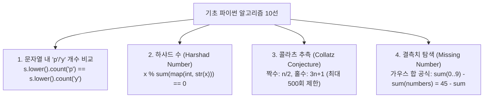

> [!abstract] 핵심 요약
> 파이썬의 풍부한 내장 함수(`sum`, `sorted`, `map`, `filter`)와 슬라이싱(`[::-1]`), 리스트 컴프리헨션(List Comprehension)을 활용하면 복잡한 수학적 명제와 문자열 조작 알고리즘을 간결하고 최적화된 시간 복잡도($O(n)$ 또는 $O(\log n)$)로 구현할 수 있다.

---

## 1. 10대 핵심 기초 수론 및 문자열 알고리즘 분석



---

## 2. 주요 수론 공식 및 복잡도 분석

### 1) 콜라츠 추측 점화식
$$f(n) = \begin{cases} \frac{n}{2} & \text{if } n \equiv 0 \pmod 2 \\ 3n + 1 & \text{if } n \equiv 1 \pmod 2 \end{cases}$$

### 2) 가우스 연속합을 활용한 결측치 탐색
0부터 9까지의 합은 $\frac{9 \times 10}{2} = 45$이므로, 집합 연산($O(n)$) 없이 산술 연산($O(1)$)으로 즉시 계산 가능:
$$\text{Missing Sum} = 45 - \sum_{k \in \text{numbers}} k$$

---

## 3. 실시간 콜라츠 수열(3n+1) 궤적 및 하샤드 수 판별기

```html preview
<div style="font-family:system-ui,-apple-system,sans-serif;padding:20px;background:var(--card);color:var(--card-foreground);border:1px solid var(--border);border-radius:var(--radius)">
  <div style="font-size:16px;font-weight:700;margin-bottom:14px;color:var(--primary);display:flex;align-items:center;gap:8px">
    <span>🔢 콜라츠(3n+1) 궤적 시뮬레이터 & 하샤드 수 판별기</span>
  </div>

  <div style="display:flex;gap:8px;margin-bottom:14px">
    <input id="numInput" type="number" value="27" min="1" max="10000" style="width:140px;padding:8px 12px;background:var(--background);color:var(--foreground);border:1px solid var(--border);border-radius:var(--radius);font-weight:700;font-size:14px" />
    <button id="runCollatzBtn" style="padding:8px 16px;background:var(--primary);color:#fff;border:none;border-radius:var(--radius);font-size:12px;font-weight:700;cursor:pointer">수열 계산 및 분석</button>
  </div>

  <div style="display:grid;grid-template-columns:1fr 1fr;gap:10px;margin-bottom:12px">
    <div style="padding:10px;background:var(--background);border:1px solid var(--border);border-radius:var(--radius)">
      <div style="font-size:11px;color:var(--muted-foreground)">하샤드 수(Harshad) 판정</div>
      <div id="harshadRes" style="font-size:14px;font-weight:700;color:var(--chart-1);margin-top:2px"></div>
    </div>
    <div style="padding:10px;background:var(--background);border:1px solid var(--border);border-radius:var(--radius)">
      <div style="font-size:11px;color:var(--muted-foreground)">콜라츠 도달 단계수 / 최댓값</div>
      <div id="collatzStats" style="font-size:14px;font-weight:700;color:var(--chart-2);margin-top:2px"></div>
    </div>
  </div>

  <div style="padding:10px;background:var(--background);border:1px solid var(--border);border-radius:var(--radius);font-family:monospace;font-size:11px;line-height:1.5;max-height:120px;overflow-y:auto">
    <div style="font-weight:700;color:var(--primary);margin-bottom:4px">콜라츠 수열 궤적:</div>
    <div id="collatzPath" style="color:var(--foreground);word-break:break-all"></div>
  </div>

  <script>
    var inN = document.getElementById('numInput');
    var btn = document.getElementById('runCollatzBtn');
    var hOut = document.getElementById('harshadRes');
    var sOut = document.getElementById('collatzStats');
    var pOut = document.getElementById('collatzPath');

    function checkHarshad(n) {
      var str = n.toString();
      var sum = 0;
      for (var i = 0; i < str.length; i++) sum += parseInt(str[i]);
      var isH = (n % sum === 0);
      return isH ? "True (" + n + "은 자릿수 합 " + sum + "으로 나누어 떨어짐)" : "False (" + n + " % " + sum + " = " + (n % sum) + ")";
    }

    function getCollatz(n) {
      var curr = n;
      var path = [curr];
      var maxVal = curr;
      var steps = 0;

      while (curr !== 1 && steps < 500) {
        if (curr % 2 === 0) curr = Math.floor(curr / 2);
        else curr = 3 * curr + 1;
        path.push(curr);
        if (curr > maxVal) maxVal = curr;
        steps++;
      }
      return { path: path, steps: steps, maxVal: maxVal };
    }

    function run() {
      var n = parseInt(inN.value);
      if (isNaN(n) || n < 1) return;

      hOut.textContent = checkHarshad(n);
      var c = getCollatz(n);
      sOut.textContent = c.steps + " 회 반복 / 최고치: " + c.maxVal;
      pOut.textContent = c.path.join(" ➔ ");
    }

    btn.addEventListener('click', run);
    run();
  </script>
</div>
```
