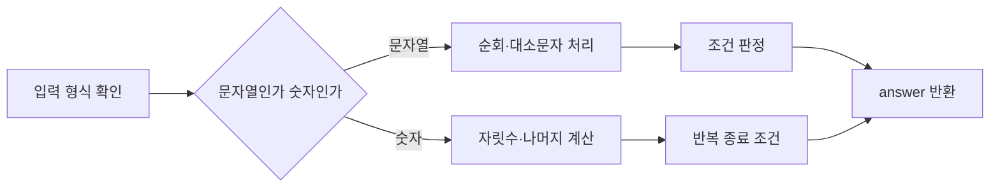

문제 1–10은 문자열을 순회하며 개수를 세고, 정수의 자릿수·약수·반복 규칙을 함수로 표현하는 연습이다.



<Tabs>
  <Tab label="문자열">p와 y 개수 비교, 가운데 글자, 숫자 문자열 여부처럼 길이와 문자를 함께 검사한다.</Tab>
  <Tab label="수와 자릿수">하샤드 판정과 내림차순 정렬은 자릿수 분해와 합·정렬을 사용한다.</Tab>
  <Tab label="반복">콜라츠는 짝수/홀수 규칙을 1까지 반복하며 500회 제한을 지킨다.</Tab>
</Tabs>

| 문제 묶음 | 핵심 자료구조·조건 |
| --- | --- |
| 1, 2 | 문자열 순회와 대소문자 무시 |
| 3, 5 | 자릿수 또는 수열 반복 |
| 4, 6–10 | 구간·누적·조건 분기 |

```html preview
<div style="font-family:system-ui,sans-serif;padding:20px;color:var(--foreground)">
<label for="amt" style="font-size:14px;font-weight:600">연습 문제</label>
<div id="out" style="font-size:30px;font-weight:700;color:var(--chart-1);margin:6px 0">1번</div>
<input id="amt" type="range" min="1" max="10" step="1" value="1" style="width:100%;accent-color:var(--primary)" />
<p style="font-size:13px;color:var(--muted-foreground)">문제 묶음의 번호를 움직여 연습 범위를 확인한다.</p>
<script>
var amt=document.getElementById('amt'); var out=document.getElementById('out');
amt.addEventListener('input',function(){out.textContent=Number(amt.value).toLocaleString()+'번';});
</script>
</div>
```

> [!WARNING]
> 콜라츠 문제는 500번 안에 1이 되지 않으면 -1을 반환한다. 제한 조건을 반복문 종료 조건에 포함해야 한다.

<details>
<summary>대표 입력</summary>

문자열 pPoooyY는 p와 y가 각각 2개라 True이고, 6의 콜라츠 수열은 8번 만에 1에 도달한다. 내림차순 자릿수 예시는 118372에서 873211로 변환된다.

</details>

<!-- source: 문제풀이_1_10.pdf; examples and constraints preserved -->