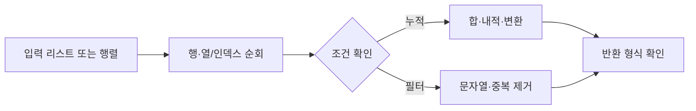

문제 11–20은 반복문으로 출력 형식을 만들고 리스트·행렬을 순회하며 조건에 맞는 결과를 반환하는 연습이다.



<Tabs>
  <Tab label="출력">n×m 별 직사각형은 행 반복과 열 반복을 분리한다.</Tab>
  <Tab label="행렬">같은 행·열 위치를 더하고, 내적은 대응 원소를 곱해 누적한다.</Tab>
  <Tab label="문자열·배열">길이 판정, 짝·홀 인덱스 대소문자, 연속 중복 제거를 순서대로 처리한다.</Tab>
</Tabs>

| 예제 | 핵심 규칙 |
| --- | --- |
| 가운데 글자 | 홀수 길이는 한 글자, 짝수 길이는 가운데 두 글자 |
| 행렬 덧셈 | 같은 위치의 원소를 더함 |
| 내적 | a[i]×b[i]의 합 |
| 같은 숫자는 싫어 | 연속으로 같은 값은 하나만 남김 |

```html preview
<div style="font-family:system-ui,sans-serif;padding:20px;color:var(--foreground)">
<label for="amt" style="font-size:14px;font-weight:600">연습 문제</label>
<div id="out" style="font-size:30px;font-weight:700;color:var(--chart-1);margin:6px 0">11번</div>
<input id="amt" type="range" min="11" max="20" step="1" value="11" style="width:100%;accent-color:var(--primary)" />
<p style="font-size:13px;color:var(--muted-foreground)">문제 묶음의 번호를 움직여 연습 범위를 확인한다.</p>
<script>
var amt=document.getElementById('amt'); var out=document.getElementById('out');
amt.addEventListener('input',function(){out.textContent=Number(amt.value).toLocaleString()+'번';});
</script>
</div>
```

> [!TIP]
> 반환값의 자료형과 순서를 원본 예시와 대조한다. 행렬은 행·열 크기가 같다는 전제가 있다.

<details>
<summary>제약 조건</summary>

문자열 길이, 행렬 행·열 길이, 배열 원소 범위가 문제마다 다르다. 일반화된 최적화보다 각 문제의 제한 조건을 먼저 코드에 반영한다.

</details>

<!-- source: 문제풀이_11_20.pdf; problem statements and examples preserved -->