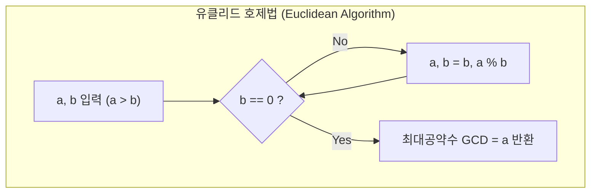

> [!abstract] 핵심 요약
> 다차원 리스트의 내포(List Comprehension)와 `zip()` 함수를 활용하면 2차원 행렬 덧셈과 벡터 내적을 직관적으로 기술할 수 있다.
> 또한 정수론의 핵심인 **유클리드 호제법(Euclidean Algorithm, $O(\log(\min(a, b)))$)**과 알파벳 26진법 순환 구조를 활용한 **시저 암호(Caesar Cipher)**는 모듈로($\%$) 연산자의 강력한 응용 사례이다.

---

## 1. 행렬 덧셈 및 벡터 내적(Dot Product)

### 1) 행렬 덧셈 수식
$$C_{ij} = A_{ij} + B_{ij} \quad (1 \le i \le M, 1 \le j \le N)$$

```python
# 파이썬 리스트 컴프리헨션
result = [[c + d for c, d in zip(row_a, row_b)] for row_a, row_b in zip(arr1, arr2)]
```

### 2) 벡터 내적(Inner Product) 수식
$$\mathbf{a} \cdot \mathbf{b} = \sum_{i=1}^n a_i b_i = a_1 b_1 + a_2 b_2 + \cdots + a_n b_n$$

---

## 2. 유클리드 호제법(GCD)과 시저 암호(Caesar Cipher)



$$\text{lcm}(a, b) = \frac{a \times b}{\gcd(a, b)}$$
$$\text{Caesar Shift}(c, k) = (c - \text{'A'} + k) \pmod{26} + \text{'A'}$$

---

## 3. 실시간 유클리드 호제법 GCD & 시저 암호기

```html preview
<div style="font-family:system-ui,-apple-system,sans-serif;padding:20px;background:var(--card);color:var(--card-foreground);border:1px solid var(--border);border-radius:var(--radius)">
  <div style="font-size:16px;font-weight:700;margin-bottom:14px;color:var(--primary);display:flex;align-items:center;gap:8px">
    <span>📐 유클리드 호제법 (GCD/LCM) 계산기 & 시저 암호 변환기</span>
  </div>

  <div style="display:grid;grid-template-columns:1fr 1fr;gap:12px;margin-bottom:14px">
    <div style="padding:10px;background:var(--background);border:1px solid var(--border);border-radius:var(--radius)">
      <div style="font-size:12px;font-weight:700;color:var(--chart-1);margin-bottom:8px">1. 유클리드 GCD / LCM</div>
      <div style="display:flex;gap:6px;margin-bottom:6px">
        <input id="gcdA" type="number" value="78" style="width:70px;padding:4px 8px;background:var(--card);color:var(--foreground);border:1px solid var(--border);border-radius:var(--radius);font-size:12px" />
        <input id="gcdB" type="number" value="42" style="width:70px;padding:4px 8px;background:var(--card);color:var(--foreground);border:1px solid var(--border);border-radius:var(--radius);font-size:12px" />
        <button id="calcGcdBtn" style="padding:4px 10px;background:var(--chart-1);color:#fff;border:none;border-radius:var(--radius);font-size:11px;font-weight:700;cursor:pointer">계산</button>
      </div>
      <div id="gcdResult" style="font-size:11px;font-family:monospace;color:var(--foreground)"></div>
    </div>

    <div style="padding:10px;background:var(--background);border:1px solid var(--border);border-radius:var(--radius)">
      <div style="font-size:12px;font-weight:700;color:var(--chart-2);margin-bottom:8px">2. 시저 암호 (Caesar Cipher)</div>
      <div style="display:flex;gap:6px;margin-bottom:6px">
        <input id="caesarText" type="text" value="Hello World" style="flex:1;padding:4px 8px;background:var(--card);color:var(--foreground);border:1px solid var(--border);border-radius:var(--radius);font-size:12px" />
        <input id="shiftK" type="number" value="3" min="1" max="25" style="width:45px;padding:4px 6px;background:var(--card);color:var(--foreground);border:1px solid var(--border);border-radius:var(--radius);font-size:12px" />
      </div>
      <div id="caesarResult" style="font-size:11px;font-family:monospace;font-weight:700;color:var(--chart-2)"></div>
    </div>
  </div>

  <script>
    function gcd(a, b) {
      while (b !== 0) {
        var r = a % b;
        a = b;
        b = r;
      }
      return a;
    }

    function runGcd() {
      var a = parseInt(document.getElementById('gcdA').value);
      var b = parseInt(document.getElementById('gcdB').value);
      if (isNaN(a) || isNaN(b)) return;
      var g = gcd(a, b);
      var l = (a * b) / g;
      document.getElementById('gcdResult').innerHTML = "최대공약수(GCD): <b>" + g + "</b><br/>최소공배수(LCM): <b>" + l + "</b>";
    }

    function runCaesar() {
      var txt = document.getElementById('caesarText').value;
      var k = parseInt(document.getElementById('shiftK').value) || 0;
      var out = "";
      for (var i = 0; i < txt.length; i++) {
        var code = txt.charCodeAt(i);
        if (code >= 65 && code <= 90) {
          out += String.fromCharCode(((code - 65 + k) % 26) + 65);
        } else if (code >= 97 && code <= 122) {
          out += String.fromCharCode(((code - 97 + k) % 26) + 97);
        } else {
          out += txt[i];
        }
      }
      document.getElementById('caesarResult').textContent = "암호문: " + out;
    }

    document.getElementById('calcGcdBtn').addEventListener('click', runGcd);
    document.getElementById('caesarText').addEventListener('input', runCaesar);
    document.getElementById('shiftK').addEventListener('input', runCaesar);

    runGcd();
    runCaesar();
  </script>
</div>
```
