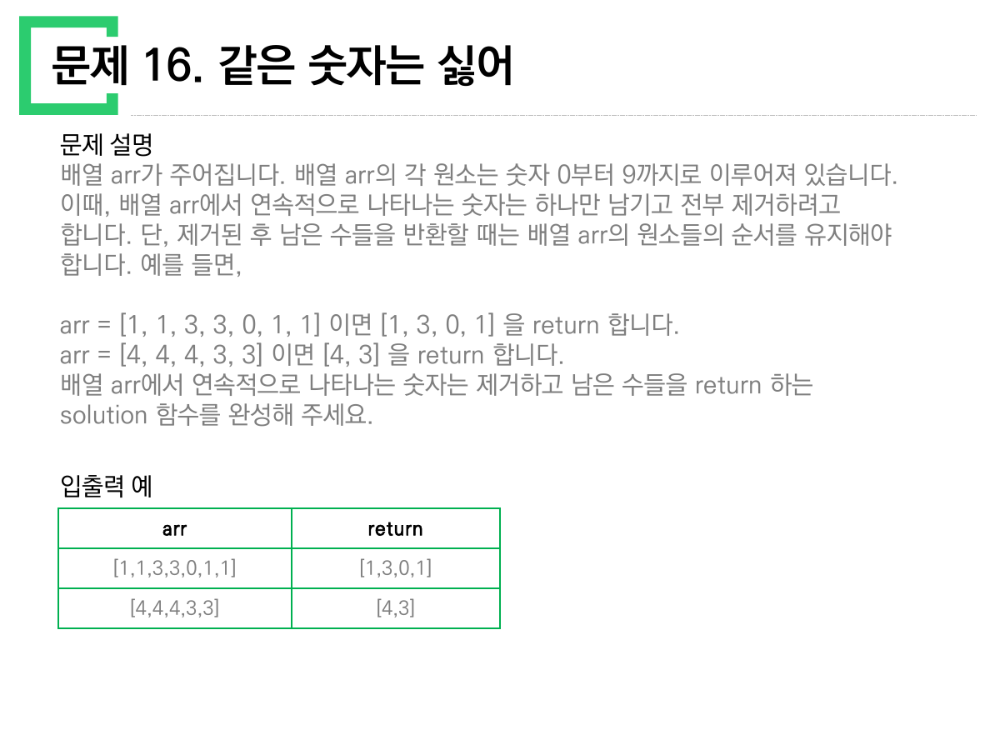
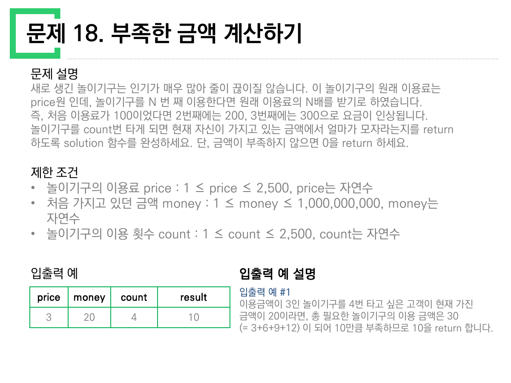
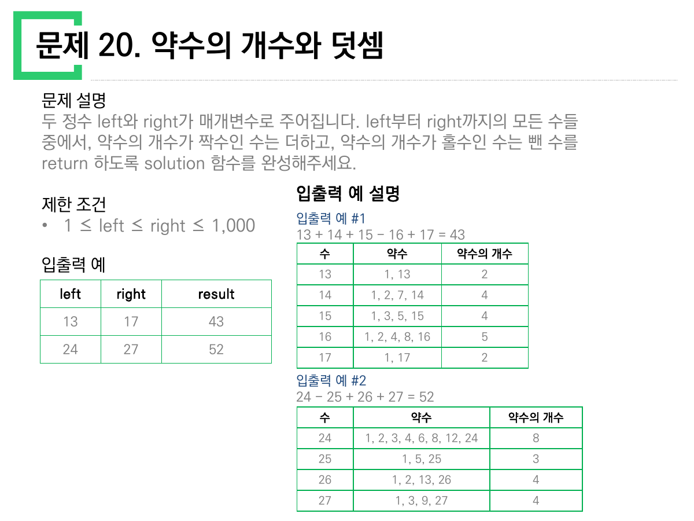
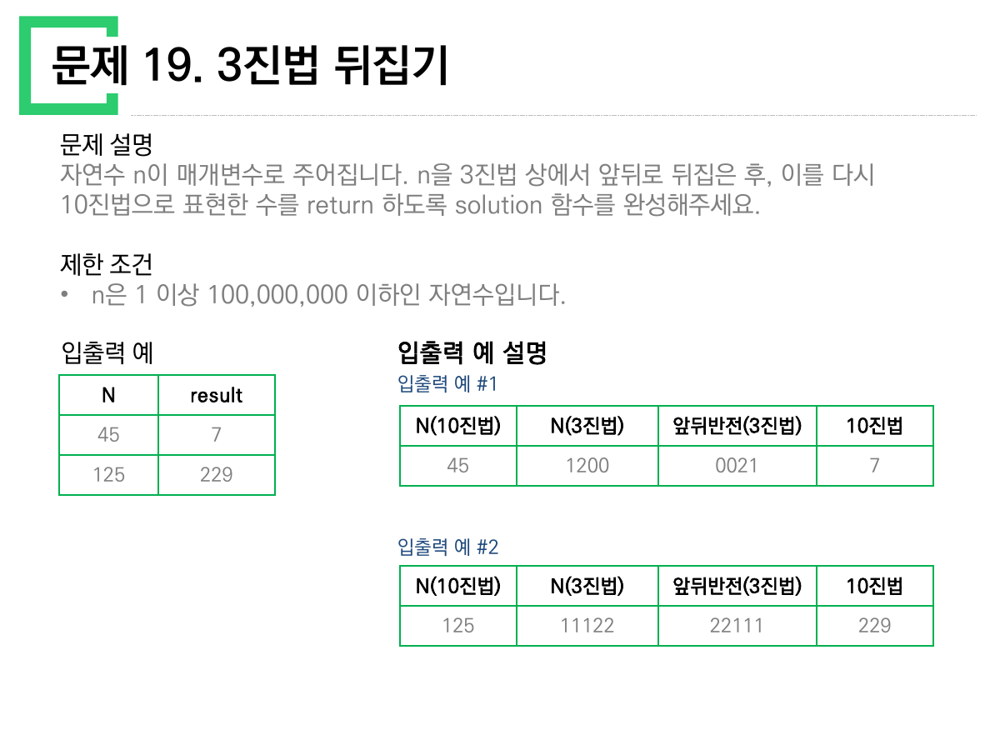
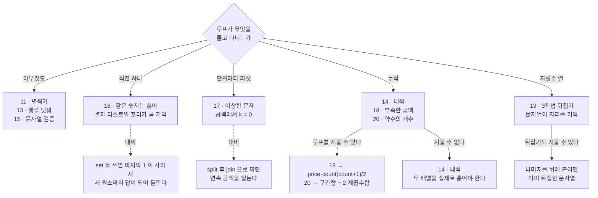

> [!abstract] 이 자료가 실제로 하는 말
> 앞의 열 문제(1~10)가 **입력의 경계**를 물었다면, 이 열 문제(11~20)는 **루프가 무엇을 들고 다니는가**를 묻는다.
>
> 열 문제를 늘어놓고 "이 코드에 변수를 몇 개 두어야 하고, 그 변수는 언제 초기화되는가"만 물으면 셋으로 갈린다. 아무것도 안 들고 다니는 것(11·13·15), 직전 한 개만 들고 다니는 것(16), 그리고 **단위가 바뀔 때 손에 든 것을 버려야 하는 것**(17). 나머지 넷(14·18·19·20)은 들고 다니는 시늉만 하고, 사실은 **루프 없이 한 줄로 끝난다**.
>
> 그중 20번이 이 자료의 중심이다. 원본은 약수를 하나하나 나열한 표를 두 개나 실어 두고도, 그 표가 증명하는 사실 — **약수의 개수가 홀수인 수는 제곱수뿐이다** — 을 끝내 한 번도 적지 않는다.

---

## 열 쪽의 짜임새

| 쪽 | 문제 | 제한 조건 블록 | 손에 드는 것 |
| --- | --- | --- | --- |
| 1 | 11 · 직사각형 별찍기 | 있음 | 없음 (출력만) |
| 2 | 12 · 가운데 글자 가져오기 | 있음 | 길이의 홀짝 |
| 3 | 13 · 행렬의 덧셈 | 있음 | 없음 (자리 대 자리) |
| 4 | 14 · 내적 | **없음** | 누적합 |
| 5 | 15 · 문자열 다루기 기본 | 있음 | 없음 (판정) |
| 6 | 16 · 같은 숫자는 싫어 | **없음** | **직전 값 하나** |
| 7 | 17 · 이상한 문자 만들기 | 있음 | **리셋되는 위치** |
| 8 | 18 · 부족한 금액 계산하기 | 있음 | 누적합 (지울 수 있음) |
| 9 | 19 · 3진법 뒤집기 | 있음 | 자릿수 열 |
| 10 | 20 · 약수의 개수와 덧셈 | 있음 | 누적합 (지울 수 있음) |

먼저 눈에 띄는 것은 **14번과 16번에 `제한 조건` 블록이 아예 없다**는 점이다. 앞 자료(1~10)에서는 열 쪽 전부에 있었다. 이 둘은 문제 설명 다음이 곧바로 입출력 예다.

이게 우연이 아닌 이유가 있다. 14번(내적)과 16번(같은 숫자는 싫어)은 **입력이 이상해질 여지가 거의 없는 문제**다 — 길이가 같은 두 배열의 짝을 곱해 더하는 일, 연속 중복을 접는 일. 반면 제한 조건이 붙은 여덟 문제는 전부 **입력 형태에 함정이 있다**. 특히 17번의 제한 조건은 이 자료에서 가장 중요한 두 줄이다.

---

## 17번 — 유일한 예시가 아무것도 구분하지 못한다

원본 17번의 제한 조건은 이렇게 적혀 있다.

> - 문자열 전체의 짝/홀수 인덱스가 아니라, **단어(공백을 기준)별로 짝/홀수 인덱스를 판단**해야합니다.
> - 첫 번째 글자는 0번째 인덱스로 보아 짝수번째 알파벳으로 처리해야 합니다.
> — 원본 7쪽, `제한 조건`

첫 줄은 두 가지 해석을 명시적으로 갈라 놓는다. 그런데 **입출력 예는 단 한 줄뿐이고, 그 한 줄이 두 해석을 구분하지 못한다.**

| s | return |
| --- | --- |
| `"try hello world"` | `"TrY HeLlO WoRlD"` |

`"try hello world"` 에서 `hello` 는 4번 인덱스에서, `world` 는 10번 인덱스에서 시작한다. **둘 다 짝수**다. 그래서 전체 인덱스로 세든 단어별로 세든 **글자 하나까지 똑같은 답**이 나온다. 제한 조건이 그토록 강조한 구분이, 유일한 예시에서는 아무 차이도 만들지 않는다.

아래에서 직접 확인해 보라. 원본 예시를 넣으면 두 열이 완전히 같고, 단어 하나만 길이를 바꾸면 그때부터 갈린다.

```html preview h=560px
<div style="font-family:system-ui,-apple-system,sans-serif;color:var(--foreground);padding:18px">
  <div style="margin-bottom:12px">
    <label for="src" style="display:block;font-size:11px;color:var(--muted-foreground);margin-bottom:4px">문자열 s</label>
    <input id="src" value="try hello world"
      style="width:100%;max-width:520px;padding:9px 11px;font-size:15px;font-family:ui-monospace,monospace;border:1px solid var(--border);border-radius:6px;background:var(--card);color:var(--foreground)" />
  </div>
  <div id="ex" style="display:flex;gap:6px;flex-wrap:wrap;margin-bottom:16px"></div>

  <div style="display:grid;grid-template-columns:repeat(auto-fit,minmax(280px,1fr));gap:12px">
    <div style="border:1px solid var(--border);border-radius:var(--radius,8px);background:var(--card);padding:14px">
      <div style="font-size:11px;letter-spacing:.04em;color:var(--muted-foreground);margin-bottom:8px">① 전체 인덱스로 셌을 때</div>
      <div id="outA" style="font-family:ui-monospace,monospace;font-size:20px;line-height:1.9;word-break:break-all;margin-bottom:10px"></div>
      <pre style="margin:0;font-size:11.5px;line-height:1.5;color:var(--muted-foreground);font-family:ui-monospace,monospace">r = ""
for i, c in enumerate(s):
    r += c.upper() if i % 2 == 0 else c.lower()
return r</pre>
    </div>
    <div style="border:1px solid var(--border);border-radius:var(--radius,8px);background:var(--card);padding:14px">
      <div style="font-size:11px;letter-spacing:.04em;color:var(--muted-foreground);margin-bottom:8px">② 단어마다 0으로 되돌렸을 때 <span style="color:var(--chart-2, var(--foreground))">← 원본이 요구하는 것</span></div>
      <div id="outB" style="font-family:ui-monospace,monospace;font-size:20px;line-height:1.9;word-break:break-all;margin-bottom:10px"></div>
      <pre style="margin:0;font-size:11.5px;line-height:1.5;color:var(--muted-foreground);font-family:ui-monospace,monospace">r, k = "", 0
for c in s:
    if c == " ":
        k = 0            # ← 여기서 잊는다
        r += c
    else:
        r += c.upper() if k % 2 == 0 else c.lower()
        k += 1
return r</pre>
    </div>
  </div>

  <div id="note" style="margin-top:14px;font-size:13px;line-height:1.7;padding:11px 13px;border-radius:6px;border:1px solid var(--border)"></div>
</div>
<script>
(function(){
  var src=document.getElementById('src');
  [["try hello world","원본의 유일한 예시"],
   ["ab cd","두 글자 두 단어"],
   ["a bb ccc dddd",""],
   ["python  is   fun","공백이 여러 개"],
   ["   leading","앞 공백"]].forEach(function(c){
    var b=document.createElement('button');
    b.innerHTML='"'+c[0]+'"'+(c[1]?" <span style='opacity:.6'>"+c[1]+"</span>":"");
    b.style.cssText="padding:5px 9px;font-size:11px;font-family:ui-monospace,monospace;border-radius:5px;cursor:pointer;border:1px dashed var(--border);background:transparent;color:var(--muted-foreground)";
    b.onclick=function(){ src.value=c[0]; draw(); };
    document.getElementById('ex').appendChild(b);
  });

  function paint(chars, marks){
    return chars.map(function(c,i){
      var sp = c===" ";
      var col = sp? "var(--muted-foreground)" : (marks[i]? "var(--chart-1)" : "var(--foreground)");
      var ch = sp? "␣" : c;
      return '<span style="color:'+col+'">'+ch+'</span>';
    }).join("");
  }

  function draw(){
    var s=src.value;
    var chars=s.split("");
    var a=[], am=[], b=[], bm=[], k=0;
    chars.forEach(function(c,i){
      var up1 = (i%2===0);
      a.push(c===" "? c : (up1? c.toUpperCase() : c.toLowerCase()));
      am.push(c!==" " && up1);
      if(c===" "){ k=0; b.push(c); bm.push(false); }
      else { var up2=(k%2===0); b.push(up2? c.toUpperCase(): c.toLowerCase()); bm.push(up2); k++; }
    });
    document.getElementById('outA').innerHTML = paint(a, am) || "&nbsp;";
    document.getElementById('outB').innerHTML = paint(b, bm) || "&nbsp;";
    var same = a.join("")===b.join("");
    var n=document.getElementById('note');
    n.style.borderColor = same? "var(--border)" : "var(--chart-1)";
    n.innerHTML = same
      ? "두 해석이 <b>같은 답</b>을 낸다. 각 단어의 시작 인덱스가 모두 짝수라서, 리셋을 해도 카운터가 이미 짝수였다. — 원본의 유일한 예시가 정확히 이 경우다."
      : "두 해석이 <b>갈렸다</b>. 어떤 단어가 홀수 인덱스에서 시작하는 순간, 리셋 여부가 그 단어 전체의 대소문자를 뒤집는다.";
    var multi = /\s\s/.test(s);
    if(multi) n.innerHTML += "<br><span style='color:var(--muted-foreground)'>공백이 연속으로 있다. 원본 설명이 “각 단어는 <b>하나 이상의</b> 공백문자로 구분”이라 적은 경우다 — <code>\" \".join(s.split())</code> 로 짜면 이 공백이 하나로 줄어들어 원문과 다른 문자열을 돌려준다.</span>";
  }
  src.oninput=draw; draw();
})();
</script>
```

> [!warning] 원본의 예시가 사양을 검증하지 못한다
> 17번 슬라이드는 제한 조건에 **말로는** 정확히 적어 두었지만, **그것을 확인할 수 있는 예시를 주지 않았다.** `"ab cd"` 한 줄만 추가했어도(전체 인덱스: `"Ab cD"`, 단어별: `"Ab Cd"`) 두 해석이 갈리는 것을 바로 볼 수 있다.
>
> 같은 성격의 문제를 앞 자료에서도 봤다 — [01번 노트](<./01. 제한 조건이 사양이고 입출력 예는 장식이다.md>)의 4번·5번. **이 강의자료 전반에서 표는 사양이 아니라 삽화**다.

### 공백이 "하나 이상"이라는 말

17번 문제 설명에는 조용한 지뢰가 하나 더 있다.

> 문자열 s는 한 개 이상의 단어로 구성되어 있습니다. 각 단어는 **하나 이상의 공백문자**로 구분되어 있습니다.
> — 원본 7쪽, `문제 설명`

가장 자연스러워 보이는 풀이 `" ".join(w 처리 for w in s.split())` 은 여기서 무너진다. `split()` 은 연속 공백을 하나로 접어 버리고, `join` 은 접힌 채로 다시 붙인다. 위 인터랙티브에 `"python  is   fun"` 을 넣어 보면 공백이 몇 개인지 그대로 유지되는 것을 볼 수 있다 — **공백을 지우지 말고 카운터만 0으로 되돌려야** 한다. 이것이 이 문제가 "무엇을 잊는가"를 묻는 문제인 이유다.

---

## 16번 — 기억은 하나면 충분하다



16번은 이 열 문제 중 **유일하게 진짜 상태가 필요한 문제**다. 그리고 필요한 상태는 정확히 하나 — **직전에 내보낸 값**.

```text
arr = [1, 1, 3, 3, 0, 1, 1]   →   [1, 3, 0, 1]
arr = [4, 4, 4, 3, 3]         →   [4, 3]
```

첫 예시의 마지막 `1` 이 이 문제의 전부다. 배열 전체에서 중복을 없애는 문제였다면 답은 `[1, 3, 0]` 이었을 것이다. **`1` 이 두 번 남는 이유는 "이미 나온 적 있는가"가 아니라 "바로 앞이 같은가"만 보기 때문**이다. `set` 을 쓰면 이 줄에서 틀리고, 순서 유지 조건("원소들의 순서를 유지해야 합니다")까지 함께 깨진다.

```python
# 직전 값 하나만 들고 간다
def solution(arr):
    out = []
    for v in arr:
        if not out or out[-1] != v:
            out.append(v)
    return out
```

`out[-1]` 이 곧 그 "직전 값"이다. 별도 변수를 두지 않아도 결과 리스트의 꼬리가 이미 기억 장치 노릇을 한다.

---

## 18·20번 — 기억하는 척하지만, 루프를 지울 수 있다



18번은 이렇다. 이용료 `price`, 가진 돈 `money`, 이용 횟수 `count`. N번째 이용은 `price × N` 원. 표의 한 줄:

| price | money | count | result |
| --- | --- | --- | --- |
| 3 | 20 | 4 | 10 |

설명이 계산까지 적어 준다 — "총 필요한 놀이기구의 이용 금액은 30(= 3+6+9+12)". 이 `3+6+9+12` 를 그대로 옮기면 루프가 된다. 그런데 이건 **등차수열의 합**이고, 뒤에 붙은 괄호가 이미 그 사실을 노출하고 있다.

$$\text{총액} = price \times (1 + 2 + \cdots + count) = price \times \frac{count(count+1)}{2}$$

`3 × 4 × 5 / 2 = 30`. 답은 `max(0, 30 − 20) = 10`. **루프가 사라진다.** 제한 조건이 `count ≤ 2,500` 이니 루프를 돌려도 아무 문제가 없지만, 요점은 성능이 아니라 **표가 이미 공식을 적어 주었다는 것**이다.

20번은 같은 이야기를 훨씬 세게 한다.



원본은 두 개의 예시에 대해 **약수를 전부 나열한 표**를 실었다.

| 수 | 약수 | 약수의 개수 |
| --- | --- | --- |
| 13 | 1, 13 | 2 |
| 14 | 1, 2, 7, 14 | 4 |
| 15 | 1, 3, 5, 15 | 4 |
| **16** | 1, 2, 4, 8, 16 | **5** |
| 17 | 1, 17 | 2 |

`13 + 14 + 15 − 16 + 17 = 43`. 두 번째 표도 같은 형식이고, 거기서는 **25** 하나만 개수가 홀수(3개)라 `24 − 25 + 26 + 27 = 52`.

두 표가 나란히 보여주는 것은 이것이다. **개수가 홀수인 수는 16과 25 — 둘 다 제곱수다.** 원본은 이 말을 한 번도 하지 않는다.

이유는 간단하다. 약수는 언제나 짝을 이룬다. $d$가 $n$의 약수이면 $n/d$도 약수이고, 둘은 서로 다른 수다 — **$d = n/d$, 즉 $n = d^2$ 인 경우만 빼고**. 그 한 경우에만 짝이 없는 약수가 하나 남아 개수가 홀수가 된다.

$$\#\text{divisors}(n) \text{ 가 홀수} \iff n \text{ 이 완전제곱수}$$

그러면 20번은 이렇게 줄어든다.

$$\text{answer} = \sum_{k=left}^{right} k \;-\; 2\sum_{\substack{k=left \\ k=m^2}}^{right} k$$

`13..17` 의 합은 75, 그 안의 제곱수는 16 하나 → `75 − 32 = 43`. `24..27` 의 합은 102, 제곱수는 25 하나 → `102 − 50 = 52`. **두 예시 모두 원본과 일치한다.**

아래에서 구간을 움직이며 확인해 보라. 빨간 칸이 제곱수, 곧 뺄셈 대상이다.

```html preview h=600px
<div style="font-family:system-ui,-apple-system,sans-serif;color:var(--foreground);padding:18px">
  <div style="display:flex;gap:16px;flex-wrap:wrap;align-items:flex-end;margin-bottom:14px">
    <div>
      <label for="L" style="display:block;font-size:11px;color:var(--muted-foreground);margin-bottom:3px">left</label>
      <input id="L" type="number" value="13" min="1" max="1000"
        style="width:110px;padding:8px;font-size:15px;font-family:ui-monospace,monospace;border:1px solid var(--border);border-radius:6px;background:var(--card);color:var(--foreground)" />
    </div>
    <div>
      <label for="R" style="display:block;font-size:11px;color:var(--muted-foreground);margin-bottom:3px">right</label>
      <input id="R" type="number" value="17" min="1" max="1000"
        style="width:110px;padding:8px;font-size:15px;font-family:ui-monospace,monospace;border:1px solid var(--border);border-radius:6px;background:var(--card);color:var(--foreground)" />
    </div>
    <div id="pre" style="display:flex;gap:6px;flex-wrap:wrap"></div>
  </div>

  <div id="grid" style="display:flex;flex-wrap:wrap;gap:5px;margin-bottom:14px;max-height:190px;overflow:auto"></div>

  <div style="display:grid;grid-template-columns:repeat(auto-fit,minmax(190px,1fr));gap:12px">
    <div style="border:1px solid var(--border);border-radius:var(--radius,8px);background:var(--card);padding:13px">
      <div style="font-size:11px;color:var(--muted-foreground);margin-bottom:5px">약수를 하나하나 세어서</div>
      <div id="way1" style="font-size:24px;font-weight:700;font-family:ui-monospace,monospace"></div>
      <div id="ops1" style="font-size:11px;color:var(--muted-foreground);margin-top:4px"></div>
    </div>
    <div style="border:1px solid var(--border);border-radius:var(--radius,8px);background:var(--card);padding:13px">
      <div style="font-size:11px;color:var(--muted-foreground);margin-bottom:5px">구간 합 − 2×(제곱수 합)</div>
      <div id="way2" style="font-size:24px;font-weight:700;font-family:ui-monospace,monospace;color:var(--chart-2, var(--foreground))"></div>
      <div id="ops2" style="font-size:11px;color:var(--muted-foreground);margin-top:4px"></div>
    </div>
    <div style="border:1px solid var(--border);border-radius:var(--radius,8px);background:var(--card);padding:13px">
      <div style="font-size:11px;color:var(--muted-foreground);margin-bottom:5px">구간 안의 제곱수</div>
      <div id="sq" style="font-size:16px;font-weight:700;font-family:ui-monospace,monospace;line-height:1.5"></div>
    </div>
  </div>
  <div id="chk" style="margin-top:12px;font-size:13px;padding:10px 12px;border-radius:6px;border:1px solid var(--border);line-height:1.6"></div>
</div>
<script>
(function(){
  var L=document.getElementById('L'), R=document.getElementById('R');
  [["13","17","원본 예 #1 → 43"],["24","27","원본 예 #2 → 52"],["1","10",""],["1","100",""]].forEach(function(c){
    var b=document.createElement('button');
    b.innerHTML=c[0]+"–"+c[1]+(c[2]?" <span style='opacity:.6'>"+c[2]+"</span>":"");
    b.style.cssText="padding:5px 9px;font-size:11px;font-family:ui-monospace,monospace;border-radius:5px;cursor:pointer;border:1px dashed var(--border);background:transparent;color:var(--muted-foreground)";
    b.onclick=function(){ L.value=c[0]; R.value=c[1]; draw(); };
    document.getElementById('pre').appendChild(b);
  });

  function ndiv(n){ var c=0,i; for(i=1;i<=n;i++) if(n%i===0) c++; return c; }

  function draw(){
    var l=parseInt(L.value,10), r=parseInt(R.value,10);
    if(isNaN(l)||isNaN(r)||l<1||r<l||r>1000){ document.getElementById('chk').textContent="1 ≤ left ≤ right ≤ 1000 범위로 넣으세요"; return; }
    var g=document.getElementById('grid'); g.innerHTML="";
    var s1=0, ops=0, sqs=[], total=0, sqsum=0;
    for(var k=l;k<=r;k++){
      var d=ndiv(k); ops+=k;
      var odd=(d%2===1);
      s1 += odd? -k : k;
      total += k;
      if(odd){ sqs.push(k); sqsum+=k; }
      if(r-l<=220){
        var cell=document.createElement('div');
        cell.innerHTML = k + "<span style='display:block;font-size:9px;opacity:.65'>" + d + "</span>";
        cell.style.cssText="min-width:34px;text-align:center;padding:4px 5px;border-radius:5px;font-family:ui-monospace,monospace;font-size:12px;border:1px solid "+
          (odd? "var(--chart-1)":"var(--border)")+";color:"+(odd?"var(--chart-1)":"var(--foreground)")+";background:var(--card)";
        g.appendChild(cell);
      }
    }
    if(r-l>220) g.innerHTML="<span style='font-size:12px;color:var(--muted-foreground)'>구간이 넓어 격자는 생략했습니다 (220칸 이하일 때 표시)</span>";
    var s2 = total - 2*sqsum;
    document.getElementById('way1').textContent=s1;
    document.getElementById('way2').textContent=s2;
    document.getElementById('ops1').textContent = ops.toLocaleString()+"회의 나눗셈";
    document.getElementById('ops2').textContent = "제곱근 "+Math.floor(Math.sqrt(r))+"까지만 훑으면 된다";
    document.getElementById('sq').textContent = sqs.length? sqs.join(", ") : "없음";
    var c=document.getElementById('chk');
    c.style.borderColor = (s1===s2)? "var(--chart-2, var(--border))":"var(--chart-1)";
    c.innerHTML = (s1===s2)
      ? "두 방법이 <b>"+s1+"</b> 으로 일치한다. 구간 합 <b>"+total+"</b> 에서 제곱수 합 <b>"+sqsum+"</b> 의 두 배를 뺀 값이다."
      : "불일치 — 계산을 확인하세요.";
  }
  L.oninput=draw; R.oninput=draw; draw();
})();
</script>
```

`1–1000` 을 넣어 보면 제곱수가 31개(1²부터 31²까지)라는 것도 바로 보인다. 제한 조건이 `right ≤ 1,000` 인 이유가 여기 있다 — 어차피 나눗셈을 다 해도 50만 번이면 끝나므로 **순진한 풀이도 통과한다**. 원본이 규칙을 말하지 않은 것은 아마 그래서일 것이다. 하지만 표를 두 개나 그려 놓고 그 표가 가리키는 결론을 적지 않은 것은 여전히 아쉬운 대목이다.

---

## 19번 — 자리는 문자열이 기억한다



19번은 상태를 다루는 세 번째 방식을 보여준다. **자릿수의 위치를 변수로 들고 다니지 말고, 문자열의 순서에 맡겨라.**

원본이 실은 설명 표가 이미 그 길을 그려 놓았다.

| N(10진법) | N(3진법) | 앞뒤반전(3진법) | 10진법 |
| --- | --- | --- | --- |
| 45 | 1200 | 0021 | **7** |
| 125 | 11122 | 22111 | **229** |

세 칸의 변환이 각각 무엇인지 보자.

1. `45 → "1200"` — 3으로 나눈 나머지를 앞에 붙여 나간다
2. `"1200" → "0021"` — 문자열 뒤집기. **앞자리에 0이 생긴다**
3. `"0021" → 7` — $0\cdot3^3 + 0\cdot3^2 + 2\cdot3^1 + 1 = 7$

파이썬에서는 세 번째 줄이 `int("0021", 3)` 한 번이다. 앞의 `0` 두 개는 자동으로 무시된다. 검산하면 45 → 7, 125 → 229로 **원본 표와 정확히 일치**한다.

```python
def solution(n):
    digits = ""
    while n:
        digits += str(n % 3)   # 나머지를 뒤에 붙이면 그것이 곧 "뒤집힌" 순서
        n //= 3
    return int(digits, 3)
```

여기서 재미있는 것은, **뒤집는 단계가 사라진다**는 점이다. 3진법 표기를 만들 때는 나머지가 **낮은 자리부터** 나오므로 보통 앞에 붙여 순서를 바로잡는데, 어차피 뒤집을 거라면 **바로잡지 않으면 된다**. 나머지를 나오는 순서대로 뒤에 붙이면 이미 뒤집힌 문자열이다. 원본 표의 두 번째 칸(`1200`)은 결국 **거쳐 갈 필요가 없는 중간역**이다.

---

## 열 문제의 상태 지도



---

## 12번과 15번 — 홀짝이 세 번 나온다

이 자료에서 **홀짝 판정이 세 번** 등장하는데, 매번 다른 것의 홀짝이다.

| 문제 | 무엇의 홀짝인가 | 그 결과 |
| --- | --- | --- |
| 12 · 가운데 글자 | **문자열 길이**의 홀짝 | 가운데가 1글자냐 2글자냐 |
| 17 · 이상한 문자 | **단어 안 인덱스**의 홀짝 | 대문자냐 소문자냐 |
| 20 · 약수의 개수 | **약수 개수**의 홀짝 | 더하느냐 빼느냐 (= 제곱수냐) |

12번은 셋 중 가장 짧게 끝난다. `"abcde"` → `"c"`, `"qwer"` → `"we"`. 길이 $L$에 대해 시작 인덱스는 $(L-1)//2$, 끝은 $L//2$ — 즉 `s[(len(s)-1)//2 : len(s)//2 + 1]` 한 줄이면 홀짝을 나누지 않고도 둘 다 처리된다. 길이가 홀수면 두 인덱스가 같아 한 글자, 짝수면 하나 차이라 두 글자다.

15번은 홀짝이 아니라 **집합 판정**이다 — `len(s) in (4, 6) and s.isdigit()`. 제한 조건이 "s는 영문 알파벳 대소문자 또는 0부터 9까지 숫자로 이루어져 있습니다"라고 못 박아 두어서, 공백이나 부호 같은 `isdigit()` 의 애매한 경우를 걱정할 필요가 없다. 여기서는 **제한 조건이 함정이 아니라 방패로 쓰인다** — 앞 자료(1~10)와 뒤집힌 관계다.

---

## 앞 열 문제와의 대비

[01번 노트](<./01. 제한 조건이 사양이고 입출력 예는 장식이다.md>)에서 6번(두 정수 사이의 합)은 "a와 b의 대소관계는 정해져있지 않습니다"라는 줄 때문에 순진한 `range(a, b+1)` 이 무너졌다. 이 자료의 20번은 정반대다 — 제한 조건이 아예 `1 ≤ left ≤ right ≤ 1,000` 이라고 **순서까지 보장**해 준다.

같은 강의자료 안에서 같은 형태의 구간 문제가 한 번은 순서를 보장하지 않고 한 번은 보장한다. 두 문제를 나란히 놓고 보지 않으면, "구간 문제는 늘 min/max로 정규화해야 한다"거나 "안 해도 된다"거나 **둘 중 하나를 잘못 배우게 된다**. 제한 조건은 문제마다 따로 읽어야 하는 이유다.

---

## 근거 자료

- `sources/문제풀이_11_20.pdf` — 10쪽 전부
  - 6쪽 · 문제 16 (인용: `ch02-p06`)
  - 8쪽 · 문제 18 (인용: `ch02-p08`)
  - 9쪽 · 문제 19 (인용: `ch02-p09`)
  - 10쪽 · 문제 20 (인용: `ch02-p10`)
  - 1·2·3·4·5·7쪽 — 본문 표와 17번 절에 반영
- 인터랙티브의 수치는 전부 원본 값이다. 20번의 `13–17 → 43`, `24–27 → 52` 와 19번의 `45 → 7`, `125 → 229`, 18번의 `3+6+9+12 = 30 → 10` 은 파이썬으로 계산해 원본 표와 대조했다
- "약수의 개수가 홀수 ⟺ 제곱수"와 "나머지를 뒤에 붙이면 뒤집기가 사라진다"는 원본에 없는 관찰이며, 원본 표에서 유도한 것임을 본문에 밝혔다

## 이어지는 글

- [01. 제한 조건이 사양이고, 입출력 예는 장식이다](<./01. 제한 조건이 사양이고 입출력 예는 장식이다.md>) — 문제 1~10
- [03. 네 개의 예제가 각각 무엇을 잡아내는 시험인가](<./03. 네 개의 예제가 각각 무엇을 잡아내는 시험인가.md>) — 지뢰찾기 LAB
- [04. 명세를 글자 그대로 따르면 어디서 어긋나는가](<./04. 명세를 글자 그대로 따르면 어디서 어긋나는가.md>) — 23-2 중간고사
