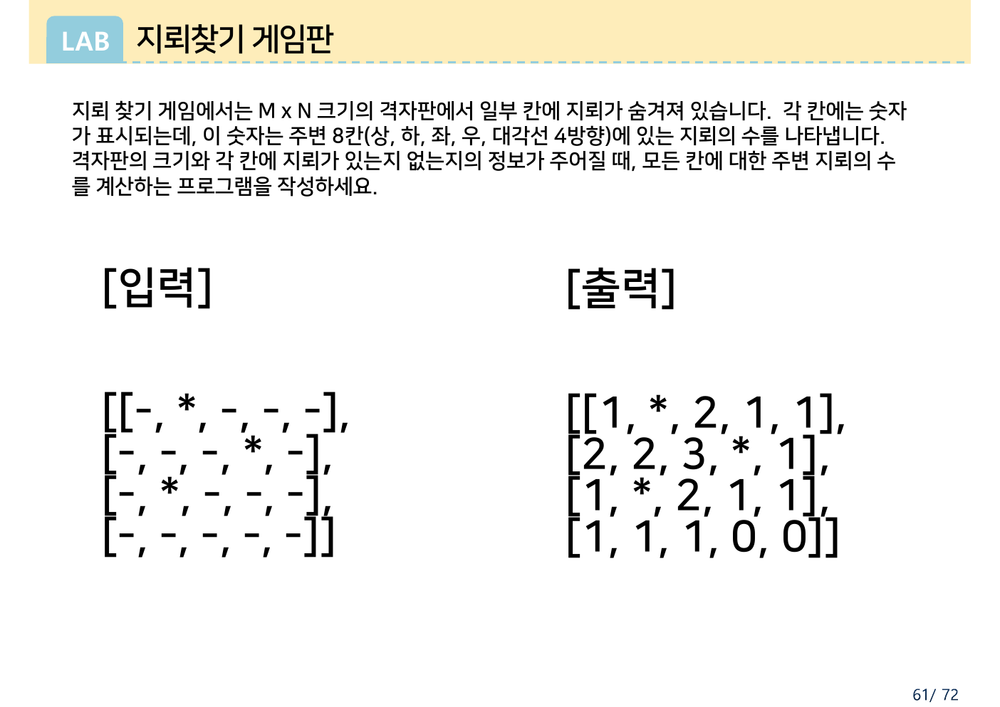
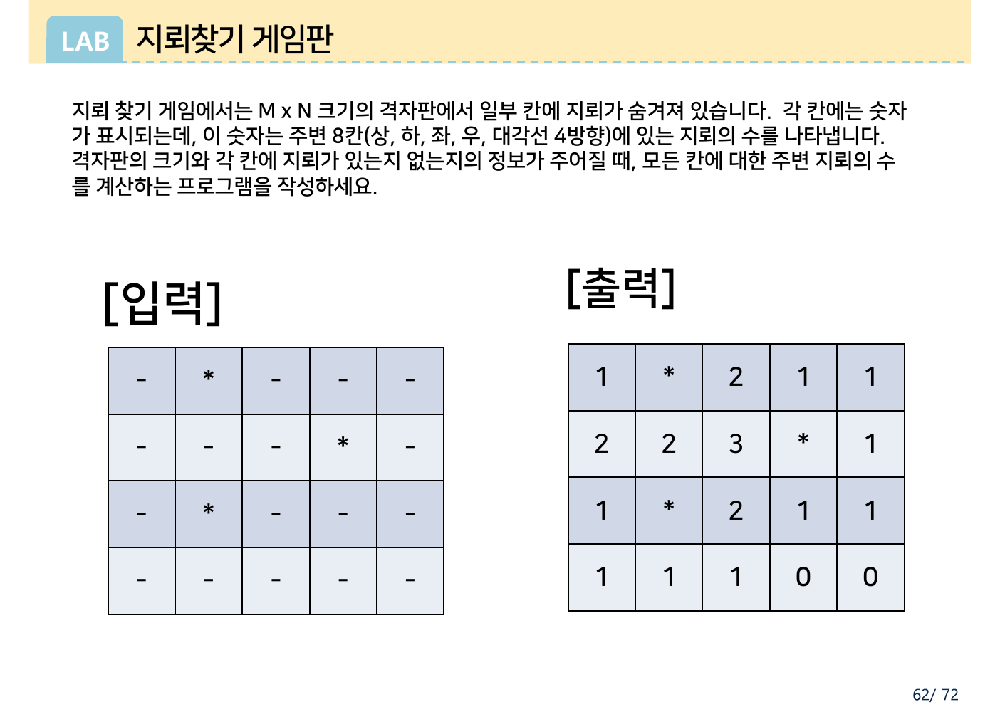
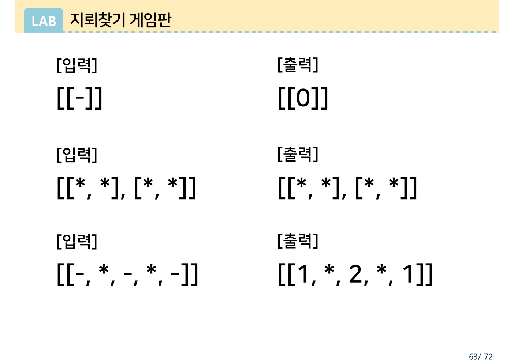
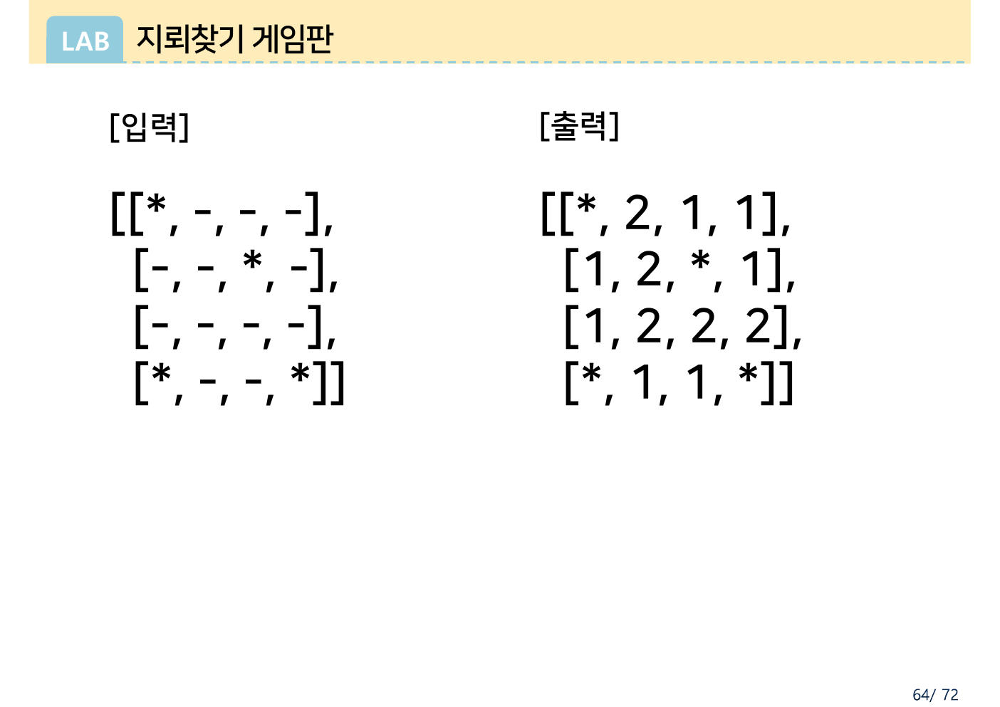
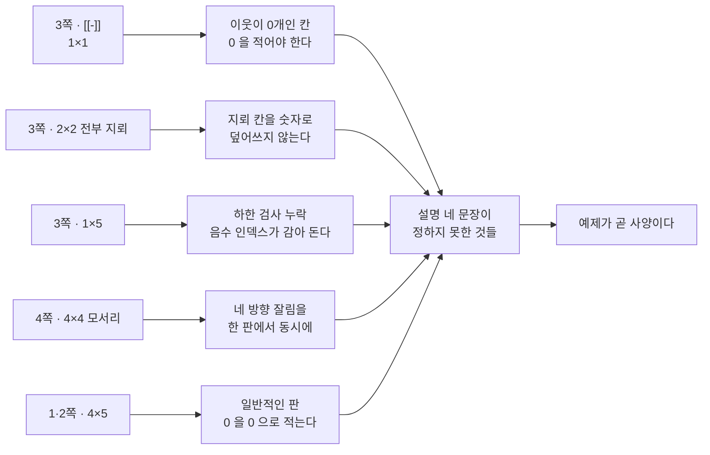

> [!abstract] 이 자료가 실제로 하는 말
> 이 LAB은 네 쪽이고, 그중 **설명은 네 문장뿐**이다. 나머지 지면은 전부 입력과 출력의 쌍 — 모두 **다섯 개**다.
>
> 그런데 네 문장은 문제를 다 정하지 못한다. "각 칸에는 숫자가 표시되는데, 이 숫자는 주변 8칸에 있는 지뢰의 수를 나타냅니다"라고만 했지, **지뢰가 놓인 칸 자체를 어떻게 할지**도, **이웃이 아예 없는 칸을 어떻게 할지**도 말하지 않았다.
>
> 그 빈칸을 예제가 메운다. 3쪽의 `[[*, *], [*, *]] → [[*, *], [*, *]]` 한 줄이 "지뢰 칸은 숫자로 덮지 않는다"를 정하고, `[[-]] → [[0]]` 한 줄이 "이웃이 없으면 0"을 정한다. 즉 **이 자료에서 예제는 삽화가 아니라 사양**이다. 앞선 두 문제풀이 자료와 정확히 반대다.

---

## 자료의 전부

| 쪽 | 내용 | 글자 수 |
| --- | --- | --- |
| 1 | 문제 설명 4문장 + 4×5 예제 (리스트 표기) | 235 |
| 2 | 같은 설명 + 같은 4×5 예제 (격자 표 그림) | 223 |
| 3 | 예제 3개 — `[[-]]`, `[[*,*],[*,*]]`, `[[-,*,-,*,-]]` | 80 |
| 4 | 예제 1개 — 4×4, 모서리 지뢰 | 80 |



설명 네 문장을 그대로 옮기면 이렇다.

> 지뢰 찾기 게임에서는 M x N 크기의 격자판에서 일부 칸에 지뢰가 숨겨져 있습니다. 각 칸에는 숫자가 표시되는데, 이 숫자는 주변 8칸(상, 하, 좌, 우, 대각선 4방향)에 있는 지뢰의 수를 나타냅니다. 격자판의 크기와 각 칸에 지뢰가 있는지 없는지의 정보가 주어질 때, 모든 칸에 대한 주변 지뢰의 수를 계산하는 프로그램을 작성하세요.
> — 원본 1·2쪽

여기서 확정되는 것은 **이웃의 정의**뿐이다. 상·하·좌·우·대각선 4방향 = 8칸. 그 외에는 전부 예제에 맡겨져 있다.

2쪽은 1쪽과 같은 문제를 **격자 표 그림**으로 한 번 더 보여준다. 리스트 표기가 익숙지 않은 사람을 위한 배려다.



---

## 다섯 예제, 다섯 개의 시험

3쪽과 4쪽은 설명 없이 입출력만 던진다. 하지만 아무 격자나 고른 것이 아니다.



### ① `[[-]] → [[0]]` — 이웃이 하나도 없는 칸

1×1 격자다. 이 칸은 여덟 방향이 **전부 판 밖**이다. 이 예제가 잡아내는 결함은 두 가지다.

- 범위 검사를 빼먹은 코드는 `board[-1][-1]` 을 읽는다. 파이썬은 이걸 오류로 보지 않고 **마지막 원소**로 해석한다 — 1×1에서는 자기 자신이다
- `board[1]` 이나 `board[r+1]` 쪽은 `IndexError` 로 즉시 터진다

그리고 답이 `0` 이라는 것이 또 하나를 정한다. **이웃이 없으면 빈칸이나 `-` 가 아니라 숫자 0**이다. 실제 지뢰찾기 게임은 0을 빈칸으로 그리지만, 이 문제는 그렇지 않다.

### ② `[[*, *], [*, *]] → [[*, *], [*, *]]` — 전부 지뢰

출력이 입력과 **한 글자도 다르지 않다**. 이 한 줄이 설명의 가장 큰 구멍을 메운다.

만약 지뢰 칸에도 이웃 지뢰 수를 적는 규칙이었다면, 2×2 전부 지뢰인 판의 답은 `[[3,3],[3,3]]` 이었을 것이다(각 칸의 이웃 세 칸이 모두 지뢰). 실제로 이 예제 없이 코드를 짜면 절반은 그렇게 짠다. **`*` 는 계산 대상이 아니라 그대로 보존되는 값**이라는 규칙이 여기서 확정된다.

### ③ `[[-, *, -, *, -]] → [[1, *, 2, *, 1]]` — 행이 하나뿐인 판

이것이 다섯 중 가장 날카로운 시험이다. `M × N` 에서 `M = 1` 이면 **위 행과 아래 행이 둘 다 없다**.

- `board[r-1]` → `r = 0` 일 때 `board[-1]`, 즉 **자기 자신인 마지막 행**
- `board[r+1]` → `board[1]`, **`IndexError`**

위쪽은 조용히 틀리고 아래쪽은 시끄럽게 터진다. **조용히 틀리는 쪽이 훨씬 위험하다.** 상한만 검사하고 하한(`0 <=`)을 빼먹은 코드는 정확히 이 방식으로 무너진다.

가운데 칸의 답이 `2` 인 것도 의미가 있다. 좌우 두 칸이 모두 지뢰이므로 2다. 자기 행을 두 번 세는 버그가 있으면 여기가 `4` 가 된다 — **틀린 값이 눈에 띄게 커지는 자리**를 예제가 고른 셈이다.

### ④ 4×4, 네 모서리 중 셋에 지뢰



```text
[입력]              [출력]
[[*, -, -, -],     [[*, 2, 1, 1],
 [-, -, *, -],      [1, 2, *, 1],
 [-, -, -, -],      [1, 2, 2, 2],
 [*, -, -, *]]      [*, 1, 1, *]]
```

세 모서리(`(0,0)`, `(3,0)`, `(3,3)`)에 지뢰가 있고 하나는 안쪽(`(1,2)`)에 있다. 모서리 칸은 이웃이 **3칸뿐**이고, 변 위의 칸은 **5칸**, 안쪽 칸만 8칸이다. 이 한 예제가 **네 방향의 잘림을 동시에** 시험한다.

`(2,3)` 칸의 답이 `2` 인 것을 손으로 확인해 보면 잘림이 어떻게 작동하는지 분명해진다 — 오른쪽 변에 붙어 있으므로 이웃은 5칸(`(1,2)`, `(1,3)`, `(2,2)`, `(3,2)`, `(3,3)`)이고 그중 `(1,2)` 와 `(3,3)` 이 지뢰라 2다.

### ⑤ 4×5 (1·2쪽) — 일반적인 판

마지막 행이 `[1, 1, 1, 0, 0]` 으로 끝난다. **오른쪽 아래 두 칸이 0**이다. 지뢰에서 충분히 떨어진 칸이 존재하는 유일한 예제이고, 그래서 "0을 실제로 0으로 적는다"를 다시 한 번 확인해 준다.

---

## 직접 돌려 보기

아래 격자에서 칸을 눌러 지뢰를 놓거나 지울 수 있다. 원본의 다섯 예제는 버튼으로 불러온다.

```html preview h=680px
<div style="font-family:system-ui,-apple-system,sans-serif;color:var(--foreground);padding:18px">
  <div id="presets" style="display:flex;gap:6px;flex-wrap:wrap;margin-bottom:14px"></div>

  <div style="display:flex;gap:16px;flex-wrap:wrap;align-items:flex-start">
    <div>
      <div style="font-size:11px;letter-spacing:.04em;color:var(--muted-foreground);margin-bottom:6px">입력 — 칸을 눌러 지뢰를 토글</div>
      <div id="inBoard"></div>
      <div style="display:flex;gap:8px;margin-top:10px;align-items:center">
        <button id="addR" style="padding:4px 9px;font-size:11px;border-radius:5px;cursor:pointer;border:1px solid var(--border);background:var(--card);color:var(--foreground)">행 +</button>
        <button id="delR" style="padding:4px 9px;font-size:11px;border-radius:5px;cursor:pointer;border:1px solid var(--border);background:var(--card);color:var(--foreground)">행 −</button>
        <button id="addC" style="padding:4px 9px;font-size:11px;border-radius:5px;cursor:pointer;border:1px solid var(--border);background:var(--card);color:var(--foreground)">열 +</button>
        <button id="delC" style="padding:4px 9px;font-size:11px;border-radius:5px;cursor:pointer;border:1px solid var(--border);background:var(--card);color:var(--foreground)">열 −</button>
        <span id="dim" style="font-size:11px;color:var(--muted-foreground);font-family:ui-monospace,monospace"></span>
      </div>
    </div>

    <div>
      <div style="font-size:11px;letter-spacing:.04em;color:var(--muted-foreground);margin-bottom:6px">출력 — 칸에 마우스를 올리면 센 이웃이 표시된다</div>
      <div id="outBoard"></div>
      <div id="hoverInfo" style="font-size:12px;color:var(--muted-foreground);margin-top:10px;font-family:ui-monospace,monospace;min-height:1.6em"></div>
    </div>
  </div>

  <div style="margin-top:16px">
    <div style="font-size:11px;letter-spacing:.04em;color:var(--muted-foreground);margin-bottom:6px">리스트 표기</div>
    <pre id="listOut" style="margin:0;padding:12px;border:1px solid var(--border);border-radius:var(--radius,8px);background:var(--card);font-family:ui-monospace,monospace;font-size:12.5px;line-height:1.7;overflow-x:auto;color:var(--foreground)"></pre>
  </div>
  <div id="match" style="margin-top:10px;font-size:13px;line-height:1.6;padding:10px 12px;border-radius:6px;border:1px solid var(--border)"></div>
</div>
<script>
(function(){
  var PRE = [
    {n:"1·2쪽 · 4×5", g:[[0,1,0,0,0],[0,0,0,1,0],[0,1,0,0,0],[0,0,0,0,0]],
      exp:[["1","*","2","1","1"],["2","2","3","*","1"],["1","*","2","1","1"],["1","1","1","0","0"]]},
    {n:"3쪽 · 1×1", g:[[0]], exp:[["0"]]},
    {n:"3쪽 · 2×2 전부 지뢰", g:[[1,1],[1,1]], exp:[["*","*"],["*","*"]]},
    {n:"3쪽 · 1×5", g:[[0,1,0,1,0]], exp:[["1","*","2","*","1"]]},
    {n:"4쪽 · 4×4", g:[[1,0,0,0],[0,0,1,0],[0,0,0,0],[1,0,0,1]],
      exp:[["*","2","1","1"],["1","2","*","1"],["1","2","2","2"],["*","1","1","*"]]}
  ];
  var g = PRE[0].g.map(function(r){return r.slice();});
  var expected = PRE[0].exp;

  function count(gr,r,c){
    var R=gr.length, C=gr[0].length, n=0, dr, dc;
    for(dr=-1;dr<=1;dr++) for(dc=-1;dc<=1;dc++){
      if(dr===0&&dc===0) continue;
      var rr=r+dr, cc=c+dc;
      if(rr>=0 && rr<R && cc>=0 && cc<C && gr[rr][cc]) n++;
    }
    return n;
  }
  function solve(gr){
    return gr.map(function(row,r){ return row.map(function(v,c){ return v? "*" : String(count(gr,r,c)); }); });
  }

  var hov=null;
  function cellStyle(extra){
    return "width:38px;height:38px;display:flex;align-items:center;justify-content:center;font-family:ui-monospace,monospace;font-size:15px;border:1px solid var(--border);border-radius:4px;"+extra;
  }
  function render(){
    var R=g.length, C=g[0].length;
    document.getElementById('dim').textContent = R+" × "+C;
    var inB=document.getElementById('inBoard'); inB.innerHTML="";
    var outB=document.getElementById('outBoard'); outB.innerHTML="";
    var res=solve(g);
    for(var r=0;r<R;r++){
      var rowI=document.createElement('div'); rowI.style.cssText="display:flex;gap:3px;margin-bottom:3px";
      var rowO=document.createElement('div'); rowO.style.cssText="display:flex;gap:3px;margin-bottom:3px";
      for(var c=0;c<C;c++){
        (function(r,c){
          var a=document.createElement('div');
          a.textContent = g[r][c]? "*" : "-";
          a.style.cssText=cellStyle("cursor:pointer;background:"+(g[r][c]?"var(--chart-1)":"var(--card)")+";color:"+(g[r][c]?"var(--card)":"var(--muted-foreground)"));
          a.onclick=function(){ g[r][c]=g[r][c]?0:1; expected=null; render(); };
          rowI.appendChild(a);

          var b=document.createElement('div');
          var v=res[r][c];
          var isMine=(v==="*");
          var near = hov && Math.abs(hov[0]-r)<=1 && Math.abs(hov[1]-c)<=1 && !(hov[0]===r&&hov[1]===c);
          b.textContent=v;
          b.style.cssText=cellStyle("background:"+(isMine?"var(--chart-1)":(near?"var(--muted, var(--card))":"var(--card)"))+
            ";color:"+(isMine?"var(--card)":(v==="0"?"var(--muted-foreground)":"var(--foreground)"))+
            ";outline:"+(near?"2px solid var(--chart-3, var(--chart-1))":"none")+
            ";outline-offset:-2px;font-weight:"+(isMine?"400":"700"));
          b.onmouseenter=function(){ hov=[r,c]; render();
            var n=g[r][c]? null : count(g,r,c);
            document.getElementById('hoverInfo').textContent =
              g[r][c] ? "("+r+", "+c+") 는 지뢰 칸 — 계산하지 않고 그대로 둔다"
                      : "("+r+", "+c+") 의 이웃 "+neighborCount(r,c)+"칸 중 지뢰 "+n+"개";
          };
          b.onmouseleave=function(){ hov=null; render(); document.getElementById('hoverInfo').textContent=""; };
          rowO.appendChild(b);
        })(r,c);
      }
      inB.appendChild(rowI); outB.appendChild(rowO);
    }
    var body = res.map(function(row){ return " ["+row.map(function(v){return v==="*"?"*":v;}).join(", ")+"]"; }).join(",\n");
    document.getElementById('listOut').textContent = "[" + body.replace(/^ /,"") + "]";

    var m=document.getElementById('match');
    if(expected){
      var ok = JSON.stringify(expected)===JSON.stringify(res);
      m.style.borderColor = ok? "var(--chart-2, var(--border))" : "var(--chart-1)";
      m.innerHTML = ok? "원본 슬라이드에 적힌 출력과 <b>완전히 일치</b>한다." : "원본과 다르다 — 확인이 필요하다.";
    } else {
      m.style.borderColor="var(--border)";
      m.innerHTML="<span style='color:var(--muted-foreground)'>직접 편집한 판이다. 원본 예제를 다시 부르려면 위 버튼을 누르라.</span>";
    }
  }
  function neighborCount(r,c){
    var R=g.length, C=g[0].length, n=0,dr,dc;
    for(dr=-1;dr<=1;dr++) for(dc=-1;dc<=1;dc++){
      if(dr===0&&dc===0) continue;
      if(r+dr>=0&&r+dr<R&&c+dc>=0&&c+dc<C) n++;
    }
    return n;
  }

  var ph=document.getElementById('presets');
  PRE.forEach(function(p){
    var b=document.createElement('button');
    b.textContent=p.n;
    b.style.cssText="padding:6px 11px;font-size:12px;border-radius:999px;cursor:pointer;border:1px solid var(--border);background:var(--card);color:var(--foreground)";
    b.onclick=function(){ g=p.g.map(function(r){return r.slice();}); expected=p.exp; render(); };
    ph.appendChild(b);
  });
  document.getElementById('addR').onclick=function(){ g.push(new Array(g[0].length).fill(0)); expected=null; render(); };
  document.getElementById('delR').onclick=function(){ if(g.length>1){ g.pop(); expected=null; render(); } };
  document.getElementById('addC').onclick=function(){ g.forEach(function(r){r.push(0);}); expected=null; render(); };
  document.getElementById('delC').onclick=function(){ if(g[0].length>1){ g.forEach(function(r){r.pop();}); expected=null; render(); } };
  render();
})();
</script>
```

다섯 프리셋 모두 **원본 슬라이드에 적힌 출력과 정확히 일치**한다. 손으로 검산할 필요 없이 이 도구가 확인해 준다.

---

## 세 가지 구현, 갈리는 지점

이웃을 세는 방법은 크게 셋이다. 셋 다 4×5 예제에서는 같은 답을 내지만, **3쪽의 두 예제에서 갈린다**.

```html preview h=620px
<div style="font-family:system-ui,-apple-system,sans-serif;color:var(--foreground);padding:18px">
  <div id="cases" style="display:flex;gap:6px;flex-wrap:wrap;margin-bottom:14px"></div>
  <div style="display:grid;grid-template-columns:repeat(auto-fit,minmax(230px,1fr));gap:12px">
    <div style="border:1px solid var(--border);border-radius:var(--radius,8px);background:var(--card);padding:13px">
      <div style="font-size:12px;font-weight:700;margin-bottom:4px">A · 상한만 검사</div>
      <pre style="margin:0 0 9px;font-size:11px;line-height:1.5;color:var(--muted-foreground);font-family:ui-monospace,monospace">if rr &lt; R and cc &lt; C:
    if board[rr][cc] == '*': n += 1</pre>
      <div id="rA" style="font-family:ui-monospace,monospace;font-size:13px;line-height:1.7;white-space:pre"></div>
    </div>
    <div style="border:1px solid var(--border);border-radius:var(--radius,8px);background:var(--card);padding:13px">
      <div style="font-size:12px;font-weight:700;margin-bottom:4px">B · 양쪽 다 검사</div>
      <pre style="margin:0 0 9px;font-size:11px;line-height:1.5;color:var(--muted-foreground);font-family:ui-monospace,monospace">if 0 &lt;= rr &lt; R and 0 &lt;= cc &lt; C:
    if board[rr][cc] == '*': n += 1</pre>
      <div id="rB" style="font-family:ui-monospace,monospace;font-size:13px;line-height:1.7;white-space:pre"></div>
    </div>
    <div style="border:1px solid var(--border);border-radius:var(--radius,8px);background:var(--card);padding:13px">
      <div style="font-size:12px;font-weight:700;margin-bottom:4px">C · 테두리를 한 겹 두르기</div>
      <pre style="margin:0 0 9px;font-size:11px;line-height:1.5;color:var(--muted-foreground);font-family:ui-monospace,monospace">pad = [['.'] * (C+2)]
    + [['.'] + row + ['.'] for row in board]
    + [['.'] * (C+2)]
# 검사 자체가 사라진다</pre>
      <div id="rC" style="font-family:ui-monospace,monospace;font-size:13px;line-height:1.7;white-space:pre"></div>
    </div>
  </div>
  <div id="msg" style="margin-top:14px;font-size:13px;line-height:1.7;padding:11px 13px;border-radius:6px;border:1px solid var(--border)"></div>
</div>
<script>
(function(){
  var CASES=[
    {n:"1×1", g:[[0]]},
    {n:"1×5", g:[[0,1,0,1,0]]},
    {n:"4×5 (1·2쪽)", g:[[0,1,0,0,0],[0,0,0,1,0],[0,1,0,0,0],[0,0,0,0,0]]},
    {n:"4×4 (4쪽)", g:[[1,0,0,0],[0,0,1,0],[0,0,0,0],[1,0,0,1]]},
    {n:"2×2 전부 지뢰", g:[[1,1],[1,1]]}
  ];
  var cur=0;

  function refB(gr){
    var R=gr.length,C=gr[0].length;
    return gr.map(function(row,r){ return row.map(function(v,c){
      if(v) return "*";
      var n=0;
      for(var dr=-1;dr<=1;dr++) for(var dc=-1;dc<=1;dc++){
        if(!dr&&!dc) continue;
        var rr=r+dr, cc=c+dc;
        if(rr>=0&&rr<R&&cc>=0&&cc<C&&gr[rr][cc]) n++;
      }
      return String(n);
    });});
  }
  function refA(gr){
    var R=gr.length,C=gr[0].length, err=false;
    var out=gr.map(function(row,r){ return row.map(function(v,c){
      if(v) return "*";
      var n=0;
      for(var dr=-1;dr<=1;dr++) for(var dc=-1;dc<=1;dc++){
        if(!dr&&!dc) continue;
        var rr=r+dr, cc=c+dc;
        if(rr<R && cc<C){
          // 파이썬처럼 음수 인덱스를 뒤에서부터 센다
          var pr = rr<0? R+rr : rr, pc = cc<0? C+cc : cc;
          if(pr<0||pc<0){ err=true; continue; }
          if(gr[pr][pc]) n++;
        }
      }
      return String(n);
    });});
    return {out:out, err:err};
  }

  function fmt(m){ return m.map(function(r){return "["+r.join(", ")+"]";}).join("\n"); }

  function draw(){
    var g=CASES[cur].g;
    var b=refB(g), a=refA(g);
    document.getElementById('rB').textContent=fmt(b);
    document.getElementById('rC').textContent=fmt(b);
    document.getElementById('rA').textContent=fmt(a.out);
    var same = JSON.stringify(a.out)===JSON.stringify(b);
    document.getElementById('rA').style.color = same? "var(--foreground)":"var(--chart-1)";
    var m=document.getElementById('msg');
    m.style.borderColor = same? "var(--border)":"var(--chart-1)";
    m.innerHTML = same
      ? "이 판에서는 <b>세 구현이 같은 답</b>을 낸다. 상한만 검사해도 걸리지 않는다 — 4×5·4×4 같은 일반적인 판이 그렇다."
      : "<b>A가 틀렸다.</b> 음수 인덱스가 판을 반대편으로 감아 돌아, 있지도 않은 이웃을 세고 있다. 3쪽의 1×5 예제가 정확히 이것을 잡아낸다.";
    Array.prototype.forEach.call(document.getElementById('cases').children,function(el,i){
      el.style.background = (i===cur)? "var(--chart-1)":"var(--card)";
      el.style.color = (i===cur)? "var(--card)":"var(--foreground)";
      el.style.borderColor = (i===cur)? "var(--chart-1)":"var(--border)";
    });
  }
  CASES.forEach(function(c,i){
    var b=document.createElement('button');
    b.textContent=c.n;
    b.style.cssText="padding:6px 11px;font-size:12px;border-radius:999px;cursor:pointer;border:1px solid var(--border);background:var(--card);color:var(--foreground)";
    b.onclick=function(){ cur=i; draw(); };
    document.getElementById('cases').appendChild(b);
  });
  draw();
})();
</script>
```

> [!note] 파이썬의 음수 인덱스가 여기서 왜 위험한가
> 다른 많은 언어에서 `board[-1]` 은 즉시 오류다. 파이썬에서는 **뒤에서 첫 번째**를 뜻하는 정상적인 표현이다. 그래서 격자 문제에서 하한 검사를 빼먹으면 **예외도 안 나고, 답만 조용히 틀린다**.
>
> 위 도구에서 `1×5` 를 눌러 보면 A열이 `[2, *, 4, *, 2]` 를 낸다 — 행이 하나라 `board[-1]` 이 자기 자신이고, 좌우 이웃을 두 번 세게 된다. 원본이 요구하는 답은 `[1, *, 2, *, 1]` 이다. **3쪽의 1×5 예제는 이 버그 하나를 잡으려고 놓여 있다.**
>
> 흥미롭게도 같은 쪽의 `1×1` 예제는 A를 통과시킨다. 판에 지뢰가 없어서 감아 돈 자리를 읽어도 지뢰가 아니기 때문이다 — **운으로 맞는다.** 두 예제를 다 통과해야 안심할 수 있다는 뜻이고, 그래서 3쪽이 작은 판 세 개를 굳이 나란히 실어 둔 것이다.

### 어느 것을 쓸 것인가

| 방식 | 코드 길이 | 실수 여지 | 비고 |
| --- | --- | --- | --- |
| A · 상한만 검사 | 짧다 | **높다** | 파이썬에서는 틀린 코드 |
| B · 양쪽 다 검사 | 보통 | 낮다 | 가장 흔한 정답 |
| C · 테두리 두르기 | 준비가 필요 | **가장 낮다** | 검사 자체가 사라진다 |

C는 원본 격자 둘레에 지뢰가 아닌 칸을 한 겹 두르는 방식이다. 4×5 판이 6×7이 되고, 원래 칸의 좌표는 전부 1씩 밀린다. 그 대가로 **모든 칸이 여덟 이웃을 온전히 갖게 되어** 조건문이 통째로 사라진다. 1×1 판도 3×3이 되어 특별 취급이 필요 없다.

```python
def solution(board):
    R, C = len(board), len(board[0])
    pad = [['.'] * (C + 2)]
    for row in board:
        pad.append(['.'] + list(row) + ['.'])
    pad.append(['.'] * (C + 2))

    out = []
    for r in range(1, R + 1):
        line = []
        for c in range(1, C + 1):
            if pad[r][c] == '*':
                line.append('*')            # 지뢰 칸은 그대로 (3쪽 2×2 예제)
                continue
            n = 0
            for dr in (-1, 0, 1):
                for dc in (-1, 0, 1):
                    if pad[r + dr][c + dc] == '*':
                        n += 1              # 자기 자신은 '*' 가 아니므로 세지 않는다
            line.append(n)
        out.append(line)
    return out
```

가운데 이중 루프에서 `dr == 0 and dc == 0` 을 걸러내지 않았다는 점에 주의하라. 그래도 되는 이유는 **이 지점에 도달했다는 것 자체가 `pad[r][c] != '*'` 를 뜻하기** 때문이다. 지뢰 칸은 위에서 이미 `continue` 로 빠져나갔다. 3쪽의 `[[*,*],[*,*]]` 예제가 강제한 규칙이 여기서 코드를 한 줄 줄여 준다.

---

## 다섯 예제와 결함의 대응



---

## 2쪽 슬라이드에 숨어 있는 것

> [!warning] 원본 오류 — 2쪽 텍스트 레이어에 잘못된 답 한 벌이 깔려 있다
> 2쪽은 화면상으로는 격자 표 그림 두 개만 보인다. 그런데 PDF의 **텍스트 레이어**에는 그 그림 아래에 리스트 표기의 답이 한 벌 더 들어 있고, **그 답이 틀렸다**. `pdftotext -bbox` 로 좌표까지 확인한 결과는 이렇다.
>
> | | 화면에 보이는 표 (= 1쪽의 답) | 그림 밑에 깔린 텍스트 |
> | --- | --- | --- |
> | 1행 | `[1, *, 2, 1, 1]` | `[1, *, 1, 0, 0]` |
> | 2행 | `[2, 2, 3, *, 1]` | `[2, 2, 1, *, 1]` |
> | 3행 | `[1, *, 2, 1, 1]` | `[1, *, 2, 1, 1]` |
> | 4행 | `[1, 1, 1, 0, 0]` | `[0, 1, 1, 1, 0]` |
>
> 네 행 중 **셋이 다르다**. 위 인터랙티브로 확인했듯 정답은 왼쪽 열이다. 오른쪽 열은 이 슬라이드를 만드는 도중의 잘못된 초안이 지워지지 않고 그림에 덮인 채 남은 것으로 보인다.
>
> **화면으로 슬라이드를 보는 학생에게는 아무 영향이 없다.** 다만 PDF에서 텍스트를 긁어 쓰거나 화면 낭독기로 읽는 경우에는 잘못된 답이 나온다. 이 정리를 만들 때도 텍스트 추출본에서 4행이 `[0, 1, 1, 1, 0]` 으로 나와 한 차례 혼선이 있었다.

---

## 근거 자료

- `sources/과제 02_지뢰찾기-1.pdf` — 4쪽 전부
  - 1쪽 · 문제 설명과 4×5 예제 (인용: `ch03-p01`)
  - 2쪽 · 같은 예제의 격자 표 (인용: `ch03-p02`) — **원본 오류**
  - 3쪽 · 경계 예제 셋 (인용: `ch03-p03`)
  - 4쪽 · 4×4 모서리 예제 (인용: `ch03-p04`)
- 다섯 예제의 출력은 모두 파이썬으로 재계산해 원본과 대조했고, 위 인터랙티브에도 같은 값이 들어 있다
- 2쪽 텍스트 레이어의 내용은 `pdftotext -f 2 -l 2 -bbox` 로 각 단어의 좌표까지 확인해 두 겹을 분리한 것이다

## 이어지는 글

- [01. 제한 조건이 사양이고, 입출력 예는 장식이다](<./01. 제한 조건이 사양이고 입출력 예는 장식이다.md>) — 문제 1~10
- [02. 무엇을 기억하고, 언제 잊는가](<./02. 무엇을 기억하고 언제 잊는가.md>) — 문제 11~20
- [04. 명세를 글자 그대로 따르면 어디서 어긋나는가](<./04. 명세를 글자 그대로 따르면 어디서 어긋나는가.md>) — 23-2 중간고사
