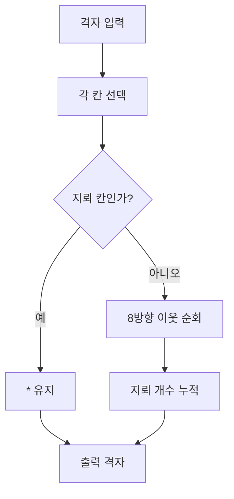

지뢰찾기 과제는 M×N 격자에서 각 칸의 주변 8칸에 있는 지뢰 수를 계산한다. 중간고사 자료는 문자열·리스트 공통 항목, 로또·복권 난수, 주사위 누적, 순서도 구현을 묻는다.



<Tabs>
  <Tab label="경계 처리">행·열 범위를 벗어난 이웃은 건너뛴다.</Tab>
  <Tab label="지뢰 칸">지뢰는 별표를 유지하고 숫자를 덮어쓰지 않는다.</Tab>
  <Tab label="시험 문제">난수 생성, 중복 없는 6개 로또, 복권 등수, 주사위 규칙을 각각 함수로 분리한다.</Tab>
</Tabs>

| 입력 | 출력 원칙 |
| --- | --- |
| 한 칸 빈 판 | 0 |
| 전부 지뢰 | 별표 유지 |
| 행·열 혼합 | 비지뢰 칸에 주변 지뢰 수 |

```html preview
<div style="font-family:system-ui,sans-serif;padding:20px;color:var(--foreground)">
<label for="amt" style="font-size:14px;font-weight:600">평가 범위</label>
<div id="out" style="font-size:30px;font-weight:700;color:var(--chart-1);margin:6px 0">1영역</div>
<input id="amt" type="range" min="1" max="3" step="1" value="1" style="width:100%;accent-color:var(--primary)" />
<p style="font-size:13px;color:var(--muted-foreground)">문제 묶음의 번호를 움직여 연습 범위를 확인한다.</p>
<script>
var amt=document.getElementById('amt'); var out=document.getElementById('out');
amt.addEventListener('input',function(){out.textContent=Number(amt.value).toLocaleString()+'영역';});
</script>
</div>
```

> [!CAUTION]
> 8방향을 세는 동안 현재 칸 자체는 제외한다. 행과 열의 경계 조건을 먼저 검사하지 않으면 인덱스 오류가 난다.

<details>
<summary>중간고사 점검</summary>

로또는 1–45에서 중복 없는 6개를 생성하고, 복권은 두 자리 일치 수로 1등·2등·미당첨을 결정한다. 주사위 문제는 1이면 다음 점수를 제외하고, 6이면 다음 점수를 두 배로 더한다.

</details>

<!-- source: Minesweeper lab and 23-2 midterm PDFs; grid rule and assessment examples preserved -->