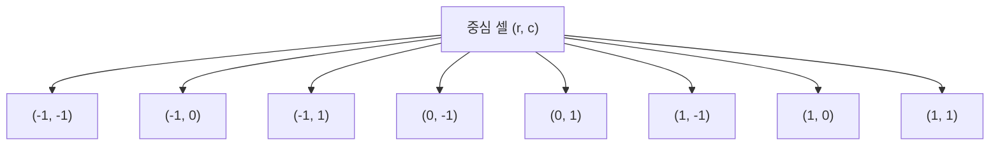

> [!abstract] 핵심 요약
> **2차원 격자 탐색(Grid Traversal)**은 행렬의 $M \times N$ 좌표계에서 8방향 델타 오프셋을 적용하고 인덱스 경계(Boundary Condition)를 검사하는 대표적인 공간 알고리즘이다.
> 또한 **닐라칸타(Nilakantha) 무한급수**는 분모가 $2k(2k+1)(2k+2)$인 교대급수를 누적하여 원주율 $\pi$에 매우 빠른 속도로 수렴하는 수치해석적 반복 구조를 보여준다.

---

## 1. 2D 격자 8방향 델타(Delta) 탐색 알고리즘



```python
def count_mines(grid, r, c, M, N):
    if grid[r][c] == '*':
        return '*'
    
    # 8방향 델타 오프셋
    deltas = [(-1, -1), (-1, 0), (-1, 1),
              (0, -1),           (0, 1),
              (1, -1),  (1, 0),  (1, 1)]
    
    mine_count = 0
    for dr, dc in deltas:
        nr, nc = r + dr, c + dc
        # 경계 검사 (Boundary Check)
        if 0 <= nr < M and 0 <= nc < N:
            if grid[nr][nc] == '*':
                mine_count += 1
    return mine_count
```

---

## 2. 닐라칸타(Nilakantha) 무한급수 원주율($\pi$) 근사 공식

$$\pi = 3 + \sum_{k=1}^\infty (-1)^{k-1} \frac{4}{2k(2k+1)(2k+2)} = 3 + \frac{4}{2 \cdot 3 \cdot 4} - \frac{4}{4 \cdot 5 \cdot 6} + \frac{4}{6 \cdot 7 \cdot 8} - \frac{4}{8 \cdot 9 \cdot 10} + \cdots$$

---

## 3. 실시간 2D 지뢰찾기 8방향 컨볼루션 시뮬레이터

```html preview
<div style="font-family:system-ui,-apple-system,sans-serif;padding:20px;background:var(--card);color:var(--card-foreground);border:1px solid var(--border);border-radius:var(--radius)">
  <div style="font-size:16px;font-weight:700;margin-bottom:14px;color:var(--primary);display:flex;align-items:center;gap:8px">
    <span>💣 2D 지뢰찾기 (4x5 격자) 실시간 8방향 이웃 탐색 시뮬레이터</span>
  </div>

  <div style="margin-bottom:12px;font-size:12px;color:var(--muted-foreground)">
    칸을 클릭하여 지뢰(💣)를 토글하면 모든 칸의 8방향 지뢰 수가 실시간 재계산됩니다.
  </div>

  <div id="mineGrid" style="display:grid;grid-template-columns:repeat(5, 1fr);gap:6px;max-width:320px;margin-bottom:14px"></div>

  <div style="padding:10px;background:var(--background);border:1px solid var(--border);border-radius:var(--radius);font-family:monospace;font-size:11px;color:var(--foreground)">
    현재 총 지뢰 수: <span id="totalMines" style="font-weight:700;color:var(--destructive)">3</span> 개 | 알고리즘 복잡도: <b>O(M × N × 8)</b>
  </div>

  <script>
    var R = 4, C = 5;
    var grid = [
      ['.', '*', '.', '.', '.'],
      ['.', '.', '.', '*', '.'],
      ['.', '*', '.', '.', '.'],
      ['.', '.', '.', '.', '.']
    ];

    var gCont = document.getElementById('mineGrid');
    var tMines = document.getElementById('totalMines');

    function renderGrid() {
      gCont.innerHTML = '';
      var mineCount = 0;
      var dr = [-1, -1, -1, 0, 0, 1, 1, 1];
      var dc = [-1, 0, 1, -1, 1, -1, 0, 1];

      for (var r = 0; r < R; r++) {
        for (var c = 0; c < C; c++) {
          if (grid[r][c] === '*') mineCount++;
        }
      }
      tMines.textContent = mineCount;

      for (var r = 0; r < R; r++) {
        for (var c = 0; c < C; c++) {
          var cell = document.createElement('button');
          cell.style.cssText = 'height:50px;border-radius:4px;border:1px solid var(--border);font-weight:800;font-size:14px;cursor:pointer;display:flex;align-items:center;justify-content:center';

          if (grid[r][c] === '*') {
            cell.style.background = 'var(--destructive)';
            cell.style.color = '#fff';
            cell.textContent = '💣';
          } else {
            var n = 0;
            for (var k = 0; k < 8; k++) {
              var nr = r + dr[k], nc = c + dc[k];
              if (nr >= 0 && nr < R && nc >= 0 && nc < C) {
                if (grid[nr][nc] === '*') n++;
              }
            }
            cell.style.background = 'var(--background)';
            cell.style.color = (n > 0) ? 'var(--chart-1)' : 'var(--muted-foreground)';
            cell.textContent = (n > 0) ? n : '';
          }

          (function(row, col) {
            cell.onclick = function() {
              grid[row][col] = (grid[row][col] === '*') ? '.' : '*';
              renderGrid();
            };
          })(r, c);

          gCont.appendChild(cell);
        }
      }
    }

    renderGrid();
  </script>
</div>
```
