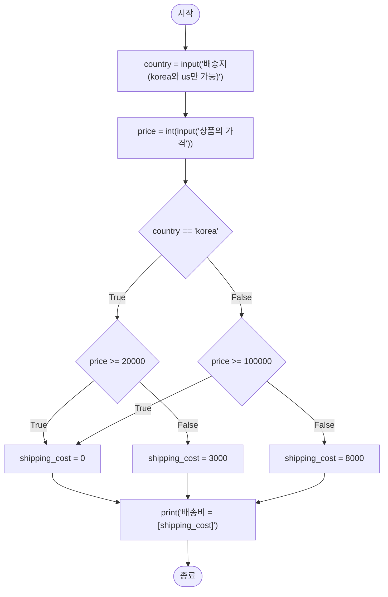
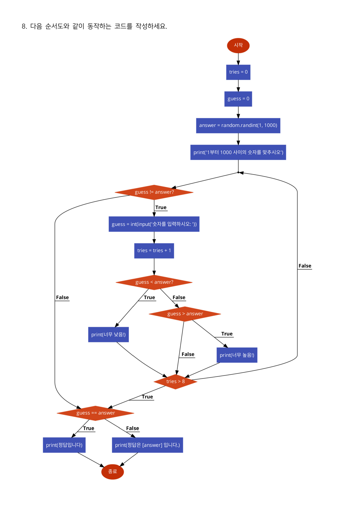
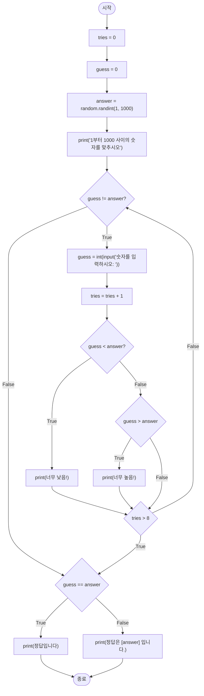

> [!abstract] 이 시험지가 실제로 하는 말
> 세 쪽에 여덟 문제. 그런데 **문제를 주는 방식이 두 가지**다. 1~6번은 한국어 문장으로, 7~8번은 **순서도 그림**으로 준다.
>
> 말로 주는 쪽은 사람이 알아서 메워 읽으라고 기대하고, 그림으로 주는 쪽은 **그대로 옮기라고** 요구한다. 이 시험지가 흥미로운 지점은, 두 방식 모두 **글자 그대로 따르면 어긋난다**는 것이다.
>
> 7번 순서도를 한 글자도 고치지 않고 옮기면 `배송비 = [shipping_cost]` 라는 문자열이 그대로 화면에 찍힌다. 8번 순서도를 그대로 옮기면 **정답을 아무리 잘 좁혀 나가도 절반 가까이는 맞힐 수 없는 게임**이 나온다. 5번은 "1부터 99까지 **2자리**의 정수"라고 적어 두었는데 1부터 9는 두 자리가 아니다.
>
> 이 정리는 여덟 문제를 순서대로 풀지 않는다. **명세와 실제가 어긋나는 네 지점**을 먼저 보고, 나머지를 짧게 정리한다.

---

## 시험지의 구조

| 쪽 | 문항 | 주는 방식 | 글자 수 |
| --- | --- | --- | --- |
| 1 | 1~6번 | 한국어 문장 + 실행 예 상자 | 701 |
| 2 | 7번 | **순서도** | 23 (제목만) |
| 3 | 8번 | **순서도** | 23 (제목만) |

2·3쪽은 텍스트가 23자뿐이다. "다음 순서도와 같이 동작하는 코드를 작성하세요." 한 줄이 전부이고, 나머지는 전부 그림이다. **텍스트 추출로는 이 시험지의 4분의 3을 놓친다.**


여덟 문제가 겨냥한 것을 한 줄씩 정리하면 이렇다.

| 번호 | 겨냥한 것 | 핵심 |
| --- | --- | --- |
| 1 | 문자열 인덱싱 + 리스트 순회 | `s[0] == s[-1]` |
| 2 | 이중 반복문 (문제가 명시적으로 요구) | 조기 반환 |
| 3 | 난수 + **중복 배제** | `while len(set) < 6` |
| 4 | 부호가 번갈아 바뀌는 급수 | **수렴** |
| 5 | 자릿수 분해 + 3단 분기 | 위치별 비교 |
| 6 | **직전 값이 다음 항에 영향** | 상태를 가진 누적 |
| 7 | 중첩 분기 (순서도) | 4갈래 |
| 8 | 조건 반복 + 이중 탈출 (순서도) | 시도 횟수 상한 |

여덟 개가 겹치지 않는다. 4번(급수)과 6번(상태 있는 누적)과 8번(이중 탈출)이 서로 다른 종류의 반복을 요구하고, 1·5번이 각각 문자열과 수의 분해를 요구한다. **문항 배치 자체는 잘 짜여 있다.** 어긋나는 것은 개별 문항의 문면이다.

---

## 4번 — 시험지가 끝내 이름을 말하지 않는 것

4번은 문장이 딱 한 줄이다. "다음의 규칙을 갖는 수식을 계산하는 코드를 작성하세요." 그리고 수식이 나온다.

$$3 + \frac{4}{2\times3\times4} - \frac{4}{4\times5\times6} + \frac{4}{6\times7\times8} - \frac{4}{8\times9\times10} + \cdots$$

규칙을 읽어 보면 이렇다.

- 분자는 항상 **4**
- 분모는 연속한 세 정수의 곱이고, 시작이 2, 4, 6, 8… 로 **2씩 는다**
- 부호가 `+ − + −` 로 **번갈아 바뀐다**
- 첫 항은 분수가 아니라 **3**

이 급수에는 이름이 있다. **닐라칸타(Nilakantha) 급수**이고, 수렴값은 **원주율 $\pi$** 다. 15세기 인도의 수학자 닐라칸타 소마야지가 정리한 형태로 알려져 있다.

$$\pi = 3 + \sum_{k=1}^{\infty} \frac{(-1)^{k+1} \cdot 4}{2k(2k+1)(2k+2)}$$

**시험지는 이 사실을 한 번도 말하지 않는다.** "수식을 계산하는 코드"라고만 했다. 그래서 이 문제에는 답이 없다 — 어디까지 더해야 하는지 정해 주지 않았기 때문이다. 항 100개인지, 오차가 $10^{-9}$ 이하가 될 때까지인지, 학생이 정해야 한다.

수렴 속도를 직접 보면 그 판단이 왜 필요한지 알 수 있다.

```html preview h=620px
<div style="font-family:system-ui,-apple-system,sans-serif;color:var(--foreground);padding:18px">
  <div style="display:flex;gap:16px;flex-wrap:wrap;align-items:flex-end;margin-bottom:14px">
    <div style="flex:1;min-width:260px">
      <label for="terms" style="display:block;font-size:11px;color:var(--muted-foreground);margin-bottom:4px">더할 분수 항의 개수 k</label>
      <input id="terms" type="range" min="0" max="60" value="4" style="width:100%" />
    </div>
    <div style="font-family:ui-monospace,monospace;font-size:13px;color:var(--muted-foreground)">k = <span id="kv" style="color:var(--foreground);font-weight:700"></span></div>
  </div>

  <div style="display:grid;grid-template-columns:repeat(auto-fit,minmax(180px,1fr));gap:12px;margin-bottom:14px">
    <div style="border:1px solid var(--border);border-radius:var(--radius,8px);background:var(--card);padding:13px">
      <div style="font-size:11px;color:var(--muted-foreground);margin-bottom:4px">부분합</div>
      <div id="sum" style="font-size:20px;font-weight:700;font-family:ui-monospace,monospace"></div>
    </div>
    <div style="border:1px solid var(--border);border-radius:var(--radius,8px);background:var(--card);padding:13px">
      <div style="font-size:11px;color:var(--muted-foreground);margin-bottom:4px">π</div>
      <div style="font-size:20px;font-weight:700;font-family:ui-monospace,monospace;color:var(--muted-foreground)">3.14159265358979</div>
    </div>
    <div style="border:1px solid var(--border);border-radius:var(--radius,8px);background:var(--card);padding:13px">
      <div style="font-size:11px;color:var(--muted-foreground);margin-bottom:4px">오차 |합 − π|</div>
      <div id="err" style="font-size:20px;font-weight:700;font-family:ui-monospace,monospace;color:var(--chart-1)"></div>
    </div>
    <div style="border:1px solid var(--border);border-radius:var(--radius,8px);background:var(--card);padding:13px">
      <div style="font-size:11px;color:var(--muted-foreground);margin-bottom:4px">맞는 소수 자리</div>
      <div id="dig" style="font-size:20px;font-weight:700;font-family:ui-monospace,monospace;color:var(--chart-2, var(--foreground))"></div>
    </div>
  </div>

  <svg id="sv" viewBox="0 0 720 250" style="width:100%;height:250px;border:1px solid var(--border);border-radius:var(--radius,8px);background:var(--card)"></svg>
  <div style="font-size:11px;color:var(--muted-foreground);margin-top:5px">가로축은 항의 개수, 세로축은 부분합. 점선이 π다. 부분합이 <b>위·아래로 번갈아 넘나들며</b> 좁혀진다 — 부호가 교대하는 급수의 특징이다.</div>

  <div id="expr" style="margin-top:12px;font-family:ui-monospace,monospace;font-size:12.5px;line-height:1.9;color:var(--muted-foreground);word-break:break-all"></div>
</div>
<script>
(function(){
  var PI=Math.PI, r=document.getElementById('terms'), sv=document.getElementById('sv');
  function partials(K){
    var out=[3], s=3, sign=1, n=2, i;
    for(i=0;i<K;i++){ s += sign*4/(n*(n+1)*(n+2)); out.push(s); sign*=-1; n+=2; }
    return out;
  }
  function draw(){
    var K=parseInt(r.value,10);
    document.getElementById('kv').textContent=K;
    var P=partials(Math.max(K,1));
    var s=P[K];
    document.getElementById('sum').textContent = s.toFixed(14);
    var e=Math.abs(s-PI);
    document.getElementById('err').textContent = e===0? "0" : e.toExponential(3);
    var d = e===0? 15 : Math.max(0, Math.floor(-Math.log10(e)));
    document.getElementById('dig').textContent = d;

    var all=partials(60);
    var W=720,H=250,pad=32;
    var lo=Math.min.apply(null,all.slice(0,Math.max(K+1,3))), hi=Math.max.apply(null,all.slice(0,Math.max(K+1,3)));
    var span=Math.max(hi-lo, 1e-6)*1.25, mid=(hi+lo)/2;
    lo=mid-span/2; hi=mid+span/2;
    function Y(v){ return H-pad-(H-2*pad)*(v-lo)/(hi-lo); }
    function X(i){ return pad+(W-2*pad)*(K<1?0:i/Math.max(K,1)); }
    var out='';
    out+='<line x1="'+pad+'" y1="'+Y(PI)+'" x2="'+(W-pad)+'" y2="'+Y(PI)+'" stroke="var(--muted-foreground)" stroke-dasharray="5 4" />';
    out+='<text x="'+(W-pad)+'" y="'+(Y(PI)-6)+'" text-anchor="end" font-size="11" fill="var(--muted-foreground)">π</text>';
    var pts=[];
    for(var i=0;i<=K;i++) pts.push(X(i).toFixed(1)+","+Y(all[i]).toFixed(1));
    out+='<polyline points="'+pts.join(" ")+'" fill="none" stroke="var(--chart-1)" stroke-width="2" />';
    for(var j=0;j<=K;j++){
      out+='<circle cx="'+X(j).toFixed(1)+'" cy="'+Y(all[j]).toFixed(1)+'" r="3" fill="'+(all[j]>PI?"var(--chart-3, var(--chart-1))":"var(--chart-2, var(--chart-1))")+'" />';
    }
    out+='<line x1="'+pad+'" y1="'+(H-pad)+'" x2="'+(W-pad)+'" y2="'+(H-pad)+'" stroke="var(--border)" />';
    sv.innerHTML=out;

    var parts=["3"], sign=1, n=2;
    for(var t=0;t<Math.min(K,6);t++){ parts.push((sign>0?"+":"−")+" 4/("+n+"·"+(n+1)+"·"+(n+2)+")"); sign*=-1; n+=2; }
    document.getElementById('expr').textContent = parts.join(" ") + (K>6? "  …  (총 "+K+"개 항)" : "");
  }
  r.oninput=draw; draw();
})();
</script>
```

k = 4일 때 부분합은 원본 수식이 화면에 적어 둔 그대로다 — `3 + 4/(2·3·4) − 4/(4·5·6) + 4/(6·7·8) − 4/(8·9·10)`. 수렴은 **느리다.** 항 20개를 더해도 소수 넷째 자리에서 어긋나고(3.141565…), 항 60개로도 여섯째 자리 근처다. "계산하는 코드"라는 말만으로는 어디서 멈춰야 할지 알 수 없는 이유가 이것이다.

> [!tip] 부호가 교대하는 급수의 좋은 성질
> 그래프에서 점 색이 π 위/아래로 번갈아 바뀌는 것이 보인다. 이것이 교대급수의 유용한 성질이다 — **참값은 언제나 연속한 두 부분합 사이에 있다.** 그래서 "다음 항의 크기가 $\varepsilon$ 보다 작아지면 멈춘다"는 종료 조건이 곧 "오차가 $\varepsilon$ 이하"를 보장한다. 시험지가 종료 조건을 주지 않았으니, 답안에 이 조건을 스스로 적어 넣는 것이 가장 방어적인 선택이다.
>
> 이 관찰은 원본에 없다 — 여기서 덧붙인 것이다.

---

## 7번 순서도 — 그대로 옮기면 문자열이 그대로 나온다


순서도를 구조만 옮기면 이렇게 생겼다.



구조 자체는 깔끔하다. 두 개의 판정이 겹쳐 네 갈래를 만들고, 그중 두 갈래가 같은 결과(`0`)로 합류한다.

| 배송지 | 가격 | 배송비 |
| --- | --- | --- |
| korea | 20000 이상 | 0 |
| korea | 20000 미만 | 3000 |
| 그 외 | 100000 이상 | 0 |
| 그 외 | 100000 미만 | 8000 |

> [!warning] 원본 오류 ① — 마지막 상자를 글자 그대로 옮기면 값이 나오지 않는다
> 순서도의 출력 상자는 이렇게 적혀 있다.
>
> ```python
> print('배송비 = [shipping_cost]')
> ```
>
> 파이썬에서 이것은 **`배송비 = [shipping_cost]` 라는 아홉 글자짜리 문자열을 그대로 찍는다.** 변수 값이 들어가지 않는다. 대괄호는 파이썬의 보간 문법이 아니고, 보간을 하려면 f-문자열이어야 한다.
>
> ```python
> print(f'배송비 = {shipping_cost}')   # 또는
> print('배송비 =', shipping_cost)
> ```
>
> 순서도에서 `[변수]` 로 값이 들어갈 자리를 표시하는 것은 흔한 관례다. 문제는 이 순서도의 **다른 상자들은 전부 실행 가능한 파이썬 코드**라는 점이다 — `country = input(...)`, `price = int(input(...))`, `shipping_cost = 3000` 은 그대로 붙여 넣어도 돌아간다. 표기 층위가 한 상자에서만 바뀌어서, "그대로 옮기라"는 지시와 충돌한다.
>
> 8번 순서도에서는 같은 흔들림이 더 크게 나타난다. 첫 안내는 `print('1부터 1000 사이의 숫자를 맞추시오')` 로 따옴표가 제대로 있는데, 뒤의 네 출력 상자 `print(너무 낮음!)` · `print(너무 높음!)` · `print(정답입니다)` · `print(정답은 [answer] 입니다.)` 에는 **따옴표가 아예 없다.** 한 순서도 안에서 같은 `print` 를 두 가지 표기로 적은 셈이다.

7번 순서도에는 또 하나가 있다.

> [!note] 원본 오류 ② — 입력 안내와 실제 분기가 다르다
> 입력 상자는 `'배송지(korea와 us만 가능)'` 이라고 안내한다. 그런데 분기는 `country == 'korea'` 하나뿐이고, **거짓이면 전부 미국 요금**이 적용된다. `japan` 을 입력해도, `Korea` 를 대문자로 입력해도, 빈 문자열을 넣어도 미국 배송으로 처리된다.
>
> 안내가 "korea와 us만 가능"이라고 약속한 것을 순서도가 지키지 않는다. 이것은 오타가 아니라 **명세가 검증 단계를 생략한 것**이고, 답안을 쓸 때 `elif country == 'us'` 를 넣을지 말지가 갈리는 지점이다. 순서도를 그대로 옮기는 것이 지시이므로 **넣지 않는 쪽이 지시에 충실**하지만, 그러면 안내문이 거짓말이 된다.

---

## 8번 순서도 — 그대로 옮기면 이길 수 없는 게임이 된다



이 순서도는 이 시험지에서 가장 복잡하다. 상자가 열넷, 판정이 다섯, 그리고 **되돌아가는 화살표가 둘**이다.



구조를 읽어 보면 이렇다.

- `guess = 0` 으로 시작하므로 `guess != answer` 는 **첫 회에 반드시 참**이다(정답은 1 이상). 즉 최소 한 번은 반드시 입력을 받는다
- 낮음/높음을 알린 뒤 `tries > 8` 을 검사한다. 거짓이면 루프로 돌아가고, 참이면 빠져나온다
- 빠져나온 뒤 `guess == answer` 를 **한 번 더** 검사해 메시지를 고른다. 루프를 정상 종료했든 횟수 초과로 나왔든 같은 곳에서 판정한다 — 깔끔한 설계다

문제는 숫자다. `tries` 가 9가 되는 순간 `tries > 8` 이 참이 되어 빠져나오므로, **플레이어가 던질 수 있는 추측은 최대 9번**이다. 그런데 정답의 범위는 **1부터 1000**이다.

$$\lceil \log_2 1000 \rceil = 10$$

이진 탐색으로 완벽하게 좁혀 나가도 **최악의 경우 10번**이 필요하다. 9번으로는 부족하다.

```html preview h=600px
<div style="font-family:system-ui,-apple-system,sans-serif;color:var(--foreground);padding:18px">
  <div style="display:flex;gap:16px;flex-wrap:wrap;align-items:flex-end;margin-bottom:16px">
    <div>
      <label for="cap" style="display:block;font-size:11px;color:var(--muted-foreground);margin-bottom:4px">순서도의 상한 — tries &gt; <span id="capv" style="color:var(--foreground);font-weight:700">8</span></label>
      <input id="cap" type="range" min="3" max="14" value="8" style="width:230px" />
    </div>
    <div>
      <label for="hi" style="display:block;font-size:11px;color:var(--muted-foreground);margin-bottom:4px">정답 범위 1 ~ <span id="hiv" style="color:var(--foreground);font-weight:700">1000</span></label>
      <input id="hi" type="range" min="10" max="2000" step="10" value="1000" style="width:230px" />
    </div>
  </div>

  <div style="display:grid;grid-template-columns:repeat(auto-fit,minmax(180px,1fr));gap:12px;margin-bottom:16px">
    <div style="border:1px solid var(--border);border-radius:var(--radius,8px);background:var(--card);padding:13px">
      <div style="font-size:11px;color:var(--muted-foreground)">허용되는 추측 횟수</div>
      <div id="allow" style="font-size:22px;font-weight:700;font-family:ui-monospace,monospace"></div>
    </div>
    <div style="border:1px solid var(--border);border-radius:var(--radius,8px);background:var(--card);padding:13px">
      <div style="font-size:11px;color:var(--muted-foreground)">최악의 경우 필요한 횟수</div>
      <div id="need" style="font-size:22px;font-weight:700;font-family:ui-monospace,monospace"></div>
    </div>
    <div style="border:1px solid var(--border);border-radius:var(--radius,8px);background:var(--card);padding:13px">
      <div style="font-size:11px;color:var(--muted-foreground)">완벽히 플레이해도 못 맞히는 정답</div>
      <div id="fail" style="font-size:22px;font-weight:700;font-family:ui-monospace,monospace"></div>
    </div>
  </div>

  <div style="font-size:11px;color:var(--muted-foreground);margin-bottom:6px">이진 탐색으로 정답 하나를 맞히는 데 걸리는 추측 횟수의 분포 — 회색 선 오른쪽이 시간 초과다</div>
  <svg id="bars" viewBox="0 0 720 210" style="width:100%;height:210px;border:1px solid var(--border);border-radius:var(--radius,8px);background:var(--card)"></svg>
  <div id="verdict" style="margin-top:12px;font-size:13px;line-height:1.7;padding:11px 13px;border-radius:6px;border:1px solid var(--border)"></div>
</div>
<script>
(function(){
  var cap=document.getElementById('cap'), hi=document.getElementById('hi'), sv=document.getElementById('bars');
  function guesses(ans, H){
    var lo=1, h=H, n=0;
    while(lo<=h){ var m=Math.floor((lo+h)/2); n++; if(m===ans) return n; if(m<ans) lo=m+1; else h=m-1; }
    return n;
  }
  function draw(){
    var C=parseInt(cap.value,10), H=parseInt(hi.value,10);
    document.getElementById('capv').textContent=C;
    document.getElementById('hiv').textContent=H;
    var allow=C+1;                       // tries 가 C+1 이 되는 순간 빠져나온다
    var dist={}, worst=0, fail=0;
    for(var a=1;a<=H;a++){
      var g=guesses(a,H);
      dist[g]=(dist[g]||0)+1;
      if(g>worst) worst=g;
      if(g>allow) fail++;
    }
    document.getElementById('allow').textContent=allow+"회";
    document.getElementById('need').textContent=worst+"회";
    var fe=document.getElementById('fail');
    fe.textContent = fail+" / "+H + "  (" + (100*fail/H).toFixed(1) + "%)";
    fe.style.color = fail? "var(--chart-1)" : "var(--chart-2, var(--foreground))";

    var W=720,Hh=210,pad=28, keys=[];
    for(var k=1;k<=worst;k++) keys.push(k);
    var maxv=Math.max.apply(null,keys.map(function(k){return dist[k]||0;}));
    var bw=(W-2*pad)/keys.length;
    var out='';
    keys.forEach(function(k,i){
      var v=dist[k]||0;
      var h=(Hh-2*pad)*(v/maxv);
      var x=pad+i*bw+2, y=Hh-pad-h;
      var over = k>allow;
      out+='<rect x="'+x.toFixed(1)+'" y="'+y.toFixed(1)+'" width="'+(bw-4).toFixed(1)+'" height="'+h.toFixed(1)+'" rx="3" fill="'+(over?"var(--chart-1)":"var(--chart-2, var(--chart-1))")+'" />';
      out+='<text x="'+(x+(bw-4)/2).toFixed(1)+'" y="'+(Hh-pad+13)+'" text-anchor="middle" font-size="10" fill="var(--muted-foreground)">'+k+'</text>';
      if(v) out+='<text x="'+(x+(bw-4)/2).toFixed(1)+'" y="'+(y-4).toFixed(1)+'" text-anchor="middle" font-size="10" fill="var(--muted-foreground)">'+v+'</text>';
    });
    var lx=pad+allow*bw;
    if(allow<worst) out+='<line x1="'+lx.toFixed(1)+'" y1="'+(pad-8)+'" x2="'+lx.toFixed(1)+'" y2="'+(Hh-pad)+'" stroke="var(--muted-foreground)" stroke-dasharray="4 3" />';
    sv.innerHTML=out;

    var vd=document.getElementById('verdict');
    vd.style.borderColor = fail? "var(--chart-1)":"var(--chart-2, var(--border))";
    vd.innerHTML = fail
      ? "<b>"+fail+"개의 정답은 완벽하게 플레이해도 맞힐 수 없다.</b> 순서도가 정한 상한("+allow+"회)이 이 범위에 필요한 최악값("+worst+"회)보다 작다."
      : "이 상한이면 <b>어떤 정답이든 맞힐 수 있다.</b> 완벽한 이진 탐색 기준이며, 사람이 실제로 그렇게 두지는 않는다.";
  }
  cap.oninput=draw; hi.oninput=draw; draw();
})();
</script>
```

> [!warning] 원본 오류 ③ — 8회 상한과 1~1000 범위가 맞지 않는다
> 순서도가 정한 대로 **9번**의 추측이 허용된다. 1부터 1000 사이의 정수 1000개를 완벽한 이진 탐색으로 좁힐 때 필요한 횟수의 분포는 다음과 같다.
>
> | 필요 횟수 | 1 | 2 | 3 | 4 | 5 | 6 | 7 | 8 | 9 | **10** |
> | --- | --- | --- | --- | --- | --- | --- | --- | --- | --- | --- |
> | 정답 개수 | 1 | 2 | 4 | 8 | 16 | 32 | 64 | 128 | 256 | **489** |
>
> 9회 이내에 맞힐 수 있는 정답은 **511개**, 나머지 **489개(48.9%)** 는 어떻게 해도 시간 초과다. 즉 이 게임은 **완벽하게 플레이해도 절반 가까이 진다.**
>
> 위 인터랙티브에서 상한 슬라이더를 9로 올리면(= 10회 허용) 실패가 0이 되는 것을 볼 수 있다. 혹은 범위를 1~500으로 줄여도 마찬가지다. **`tries > 8` 이 아니라 `tries > 9` 였거나, 범위가 1~512 이하였다면 아귀가 맞았다.**
>
> 이것은 순서도를 코드로 옮기는 일 자체에는 영향을 주지 않는다 — 지시는 "순서도와 같이 동작하는 코드"이므로 8을 그대로 쓰면 된다. 다만 **완성된 프로그램을 실행해 보면 이유 없이 지는 게임**이 나오고, 그때 학생이 자기 코드를 의심하게 된다는 점에서 기록해 둔다.

---

## 1~6번을 짧게

### 1번 — 첫 글자와 끝 글자

```text
['aba', 'xyz', 'abc', '121']  →  문자열의 개수 = 2
```

`'aba'` 와 `'121'` 이 세어진다. `s[0] == s[-1]` 한 줄이면 끝이고, `s[-1]` 을 `s[len(s)-1]` 로 쓸 필요가 없다는 것이 파이썬 인덱싱의 요점이다. 예시가 정하지 않은 것은 **길이 1인 문자열**(`'a'`)이다 — 첫 글자와 끝 글자가 같은 글자이므로 세어지는 것이 자연스럽다.

### 2번 — 반복문을 쓰라고 명시한 문제

```text
list1 = [1, 2, 3, 4, 5, 6]
list2 = [6, 7, 8, 9, 10]
True
```

문제가 괄호 안에 **"(반복문을 활용하세요.)"** 라고 못 박아 두었다. `set(list1) & set(list2)` 나 `any(x in list2 for x in list1)` 을 막으려는 장치다. 이런 지시가 붙는 이유는 이 시점의 학습 목표가 **이중 반복문과 조기 반환**이기 때문이다.

```python
def has_common(a, b):
    for x in a:
        for y in b:
            if x == y:
                return True     # 찾는 즉시 빠져나온다
    return False                # 이 줄이 두 반복문 밖에 있어야 한다
```

`return False` 의 위치가 이 문제의 전부다. 안쪽 반복문 안에 두면 첫 비교에서 곧장 끝나 버린다.

### 3번 — 중복 없는 여섯 개

문제가 힌트까지 준다 — "1에서 45까지의 난수는 `random.randint(1, 45)` 로 만들면 됩니다." 그래서 `random.sample` 을 쓰지 말라는 뜻으로 읽힌다. 중복 배제를 직접 구현해야 한다.

```python
nums = []
while len(nums) < 6:
    n = random.randint(1, 45)
    if n not in nums:
        nums.append(n)
```

예시 출력 `[1, 42, 37, 22, 14, 20]` 은 **정렬되어 있지 않다**. 뽑은 순서 그대로 두어도 된다는 신호다.

### 5번 — 두 자리를 자리별로 비교

```text
복권 번호(1-99)를 입력하시오: 28      복권 번호(1-99)를 입력하시오: 32
당첨 번호는 83입니다.                  당첨 번호는 33입니다.
미당첨                                2등상
```

두 실행 예가 규칙을 확정한다. `32` 와 `33` 은 십의 자리 `3` 이 같아 **2등상**. `28` 과 `83` 은 숫자 `8` 이 양쪽에 있지만 **자리가 달라서 미당첨**이다. 즉 "일치"는 **자리별 비교**다 — 집합으로 비교하면 두 번째 예가 틀린다.

> [!warning] 원본 오류 ④ — "1부터 99까지 2자리의 정수"
> 문제 첫 줄은 **"1부터 99까지 2자리의 정수로 이루어진 복권"** 이라고 적혀 있고, 입력 안내도 `복권 번호(1-99)를 입력하시오` 다. 그런데 1부터 9까지는 **한 자리**다.
>
> 이 모순은 그냥 두면 코드에서 터진다. 사용자가 `7` 을 입력하고 당첨 번호가 `70` 이면, 자리별로 비교하려 할 때 `'7'` 과 `'70'` 의 길이가 달라 십의 자리가 없다. 앞을 0으로 채워 `'07'` 로 볼 것인지, 1~9를 애초에 배제할 것인지 명세가 정해 주지 않는다.
>
> 범위를 **10~99** 로 적었다면 아무 문제가 없었다. 자리 수를 말해 놓고 범위를 그에 맞추지 않은 대목이다.

### 6번 — 직전 값이 다음 값을 바꾼다

이 시험지에서 유일하게 **상태를 가진 누적**을 요구하는 문제다.

> 주사위를 3번 굴려서 나오는 점수를 모두 합하여 출력 (…) 1이 나오면 다음 숫자는 합계에서 제외합니다. (…) 6이 나오면 다음 숫자를 2배로 더합니다.
> — 원본 1쪽, 6번

```text
1, 2, 3  →  1 + 0 + 3 = 4
6, 3, 2  →  6 + 6 + 2 = 14
```

두 예시는 규칙을 정확히 보여준다. 첫 예에서 `2` 가 제외되고, 둘째 예에서 `3` 이 두 배가 되어 `6` 이 된다. 구현은 **직전 눈을 기억하는 변수 하나**면 된다.

```python
total, mult = 0, 1
for v in rolls:
    total += v * mult
    mult = 0 if v == 1 else (2 if v == 6 else 1)
```

> [!note] 원본 오류 ⑤ — 오타와, 규칙이 겹칠 때의 미정
> 두 가지가 있다.
>
> 1. **오타** — "1 + 0 + 3이 되어 **합게**가 4입니다" (→ 합계). 바로 다음 문장에서는 "합계가 14가 됩니다"로 바르게 적혀 있다
> 2. **규칙 충돌이 정의되지 않았다** — 두 규칙이 동시에 걸리는 경우를 명세가 다루지 않는다. `6, 1, 3` 을 굴렸다면? `6` 때문에 다음(`1`)은 2배가 되어 2점. 그런데 그 `1` 은 "제외"의 방아쇠이기도 하다. **2배로 세어진 1이 다음을 제외시키는가?** 위 코드는 그렇다고 본다(`v == 1` 로 판정하므로). 반대로 `1, 6, 3` 이라면 `6` 이 합계에서 빠지는데, **빠진 6이 다음을 2배로 만드는가?** 위 코드는 그렇다고 본다.
>
> 어느 쪽도 원본이 정해 주지 않았다. 예시 두 개(`1,2,3` 과 `6,3,2`)는 **규칙이 한 번씩만 걸리는 경우**만 보여준다 — [01번 노트](<./01. 제한 조건이 사양이고 입출력 예는 장식이다.md>)에서 본 것과 같은 패턴이다. 답안에는 어느 해석을 택했는지 주석으로 밝혀 두는 편이 안전하다.

---

## 이 시험지에서 확인한 다섯 가지

| # | 문항 | 무엇이 어긋나는가 |
| --- | --- | --- |
| ① | 7번 순서도 | `print('배송비 = [shipping_cost]')` — 값이 아니라 문자열이 찍힌다. 8번은 같은 순서도 안에서 `print` 의 따옴표가 있다 없다 한다 |
| ② | 7번 순서도 | 입력 안내는 "korea와 us만 가능"인데 분기는 `korea` 여부 하나뿐 — 그 외 전부 미국 요금 |
| ③ | 8번 순서도 | `tries > 8`(=9회 허용) 대 1~1000 범위. 완벽히 플레이해도 **489/1000이 시간 초과** |
| ④ | 5번 | "1부터 99까지 **2자리**의 정수" — 1~9는 두 자리가 아니다 |
| ⑤ | 6번 | "합**게**" 오타 + 두 규칙이 동시에 걸릴 때가 미정 |

다섯 중 셋(①②③)이 **순서도 쪽**이다. 흥미로운 대비다. 말로 쓴 1~6번은 사람이 알아서 읽어 주기를 기대하므로 어긋나도 티가 잘 안 나지만, **순서도는 "그대로 옮기라"고 요구하기 때문에 어긋남이 곧바로 코드로 드러난다.** 정확한 명세일수록 그 안의 오차도 정확하게 전달된다.

---

## 근거 자료

- `sources/23-2 중간고사.pdf` — 3쪽 전부
  - 1쪽 · 1~6번 (인용: `ch04-p01`) — **원본 오류 ④·⑤**
  - 2쪽 · 7번 순서도 (인용: `ch04-p02`) — **원본 오류 ①·②**
  - 3쪽 · 8번 순서도 (인용: `ch04-p03`) — **원본 오류 ③**
- 2·3쪽은 텍스트가 23자뿐이라 **렌더링한 이미지를 직접 읽어** 순서도의 상자·판정·화살표를 옮겼다. 위의 두 Mermaid 도해가 그 결과다
- 닐라칸타 급수의 부분합(항 4개·20개·60개)과 이진 탐색 횟수 분포(511 대 489)는 파이썬으로 계산해 확인했다
- 급수의 이름(닐라칸타), 교대급수의 오차 성질, 이진 탐색 하한 $\lceil \log_2 1000 \rceil = 10$ 은 원본에 없는 보충이며 본문에 그렇게 밝혔다

## 이어지는 글

- [01. 제한 조건이 사양이고, 입출력 예는 장식이다](<./01. 제한 조건이 사양이고 입출력 예는 장식이다.md>) — 문제 1~10
- [02. 무엇을 기억하고, 언제 잊는가](<./02. 무엇을 기억하고 언제 잊는가.md>) — 문제 11~20
- [03. 네 쪽이 전부 테스트 케이스다](<./03. 네 쪽이 전부 테스트 케이스다.md>) — 지뢰찾기 LAB
