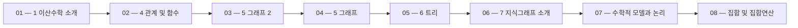

 > [!abstract] 사용법
 > 이 지도는 현재 폴더의 원본 PDF를 파일 순서대로 묶어 **강의 진행 → 핵심 단서 → 점검 포인트**를 연결합니다. 세부 개념은 같은 폴더의 주제 노트와 함께 대조하세요.

## 강의 흐름



<Tabs>
  <Tab label="파일 순서">파일명에 포함된 주차·장·버전 표기를 먼저 읽어 강의의 큰 흐름을 잡습니다.</Tab>
  <Tab label="중복 자료">같은 접두사나 버전이 겹치면 앞 자료를 기준으로 뒤 자료의 보충·실습 여부를 비교합니다.</Tab>
  <Tab label="검증">첫 페이지 단서는 방향만 제시하므로 정의·식·코드·수치는 원본 PDF에서 다시 확인합니다.</Tab>
</Tabs>

## 원본 PDF 목록

| 파일 | 쪽수 | 첫 페이지 단서 |
| :-- | --: | :-- |
| 1 이산수학 소개.pdf | 24 | 이산수학 Discrete Mathematics 컴퓨터AI공학부 천세진 |
| 4 관계 및 함수.pdf | 125 | 4 관계(Relation)와 함수(Functions) 컴퓨터AI공학부 천세진 |
| 5 그래프 2.pdf | 65 | 5 트리와 그래프 2024-2 컴퓨터AI공학부 천세진 1 목차 7.1 Basic concept of graphs 7.2 여러 가지 그래프 7.3 평면 그래프 7.4 정점의 착색 2/99 2 1 |
| 5 그래프.pdf | 65 | 5 트리와 그래프 2024-2 컴퓨터AI공학부 천세진 1 목차 7.1 Basic concept of graphs 7.2 여러 가지 그래프 7.3 평면 그래프 7.4 정점의 착색 2/99 2 1 |
| 6 트리.pdf | 38 | 6 트리(Tree) 컴퓨터AI공학부 천세진 1 목차 8.1 트리의 기본 개념 8.2 레이블을 갖는 트리와 최소 스패닝 트리 8.3 트리 탐방 알고리즘 2/72 2 1 |
| 7 지식그래프 소개.pdf | 12 | 7 지식 그래프(Knowledge Graph) 에 대한 소개 컴퓨터AI공학부 천세진 1 Goals ◼ Graph 기반 지식 표현에 대한 기본 개념 이해 ◼ 그래프 데이터 관리 접근법과 Query Language 대한 기초 학습 2021 2 동아대학교 2 1 |
| 수학적 모델과 논리.pdf | 91 | 수학적 모델과 논리 컴퓨터AI공학부 천세진 |
| 집합 및 집합연산.pdf | 46 | 3 집합 및 집합 연산 컴퓨터AI공학부 천세진 |
| Appendix 1 Floyd Warshall Algorithm.pdf | 10 | Floyd-Warshall 이산수학 천세진 1 Floyd-Warshall 플로이드-워셜 알고리즘 • Directed, weighted graph G=(V,E)가 주어졌을 때, • Negative-weight edges 가 존재할 수 있음 • 예로, -4, -1 • 그래프 내 vertices의 모든 상간에 최소 경로비용을 계산 • 이용 사례: 도로망(Road map) • 각 위치는 vertex |
| Appendix 2 Welch-Powell Algorithms.pdf | 7 | Welch-Powell Algorithms Sejin Chun 1 알고리즘 • ① 그래프 𝐺의 정점의 차수가 내림차순(descending order)이 되게 배열한다(이 배열은 차수가 같은 정점이 여러 개 있을 수 있으므로 몇 가지 다른 순서가 존재할 수 있다). • ② 배열의 첫 번째 정점은 첫 번째 색으로 착색하고 계속해서 배열의 순서대로 이미 착색된 정점과 인접하지 않은 정점을 모두 |
| Discrete_Mathematics__Homework_I (1).pdf | 4 | Discrete Mathematics: Homework I Prof. Chun November 4, 2024 Before solving problems, 본 과제는 총 18문항으로 각 문제당 10점(총 180점)입니다. 각 문제에 대해서 적절한 답을 작성하시면 됩니다. 답안지는 수기로 작성된 (전자)문서 혹은 그와 유사한 형태로 작성할 수 있으며, 답안지만 최종 결과물로 LMS에 제출하시면 |

## 원본 단계 인터랙티브

```html preview
<div style="font-family:system-ui,sans-serif;padding:20px;color:var(--foreground)">
  <label for="flow3213018334" style="font-size:14px;font-weight:600">원본 자료 단계</label>
  <div id="flow3213018334-out" style="font-size:24px;font-weight:700;color:var(--chart-1);margin:6px 0">1 이산수학 소개</div>
  <input id="flow3213018334" type="range" min="1" max="11" step="1" value="1" style="width:100%;accent-color:var(--primary)" />
  <p style="font-size:13px;color:var(--muted-foreground)">슬라이더를 움직이면 파일명 순서대로 자료의 위치를 확인합니다.</p>
  <script>
    var flow3213018334 = document.getElementById('flow3213018334');
    var flow3213018334Out = document.getElementById('flow3213018334-out');
    var flow3213018334Steps = ["1 이산수학 소개","4 관계 및 함수","5 그래프 2","5 그래프","6 트리","7 지식그래프 소개","수학적 모델과 논리","집합 및 집합연산","Appendix 1 Floyd Warshall Algorithm","Appendix 2 Welch-Powell Algorithms","Discrete_Mathematics__Homework_I (1)"];
    flow3213018334.addEventListener('input', function () {
      flow3213018334Out.textContent = flow3213018334Steps[Number(flow3213018334.value) - 1] || '';
    });
  </script>
</div>
```

## 점검 포인트

- **범위:** 11개 PDF, 총 487쪽.
- **근거:** 표의 쪽수와 첫 페이지 단서는 현재 sources/ 파일에서 직접 추출했습니다.
- **학습 순서:** 흐름도와 슬라이더를 먼저 훑은 뒤, 주제 노트의 정의·절차·실습 결과를 순서대로 대조합니다.

> [!warning] 과해석 방지
> 이 지도에는 파일명·쪽수·첫 페이지 추출 단서만 기록했습니다. PDF에 없는 구현 세부, 성능 수치, 권장 설정은 추가하지 않습니다.

<details>
<summary>다음 읽기</summary>

현재 단계의 원본을 열어 제목·절차·도식을 확인한 뒤, 같은 폴더의 주제 노트에 해당 근거가 반영되었는지 점검하세요.

</details>
