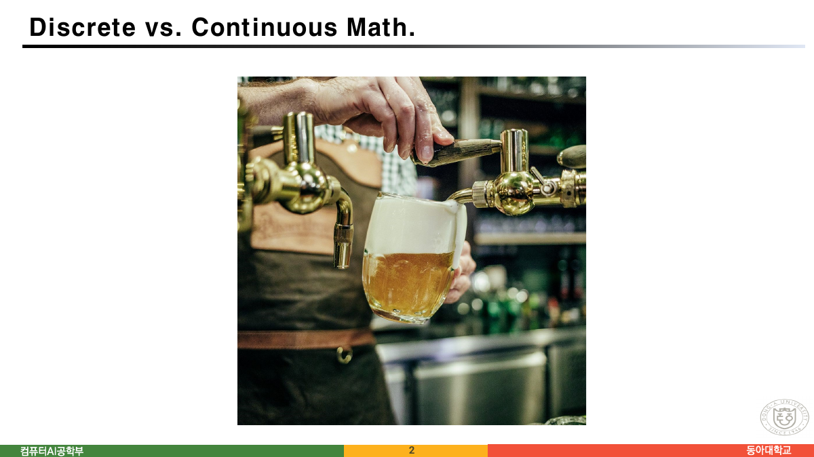
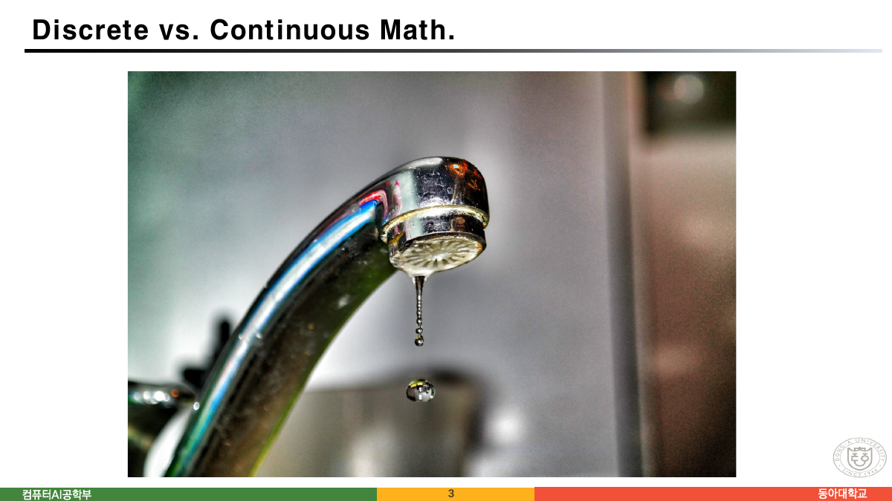
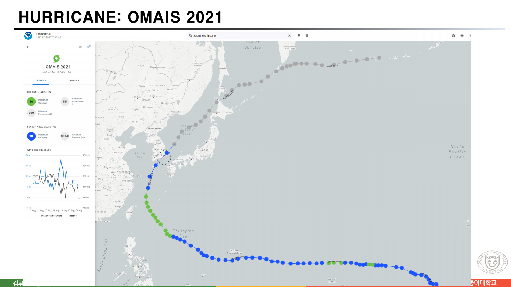
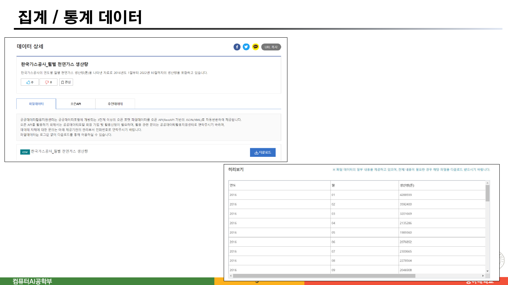
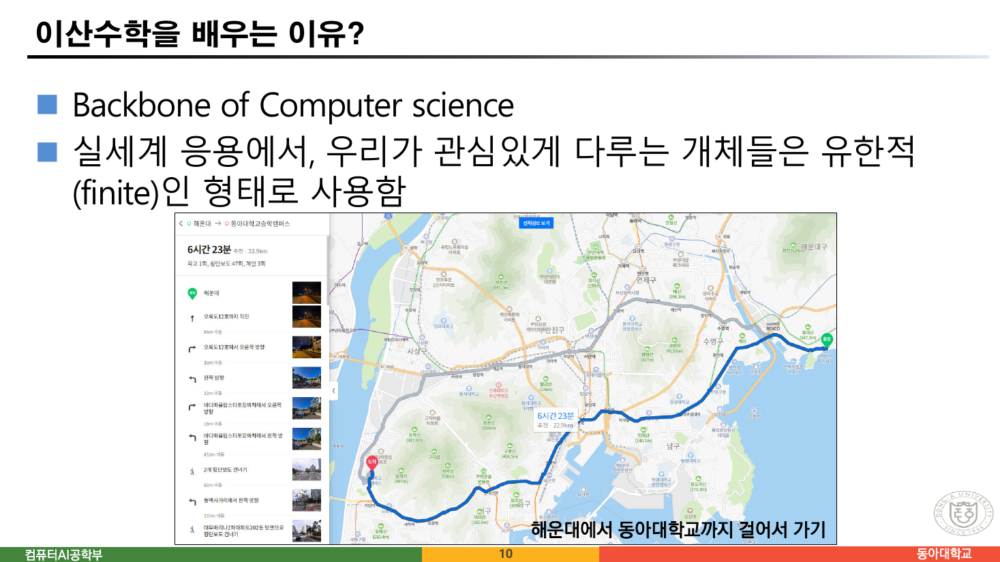
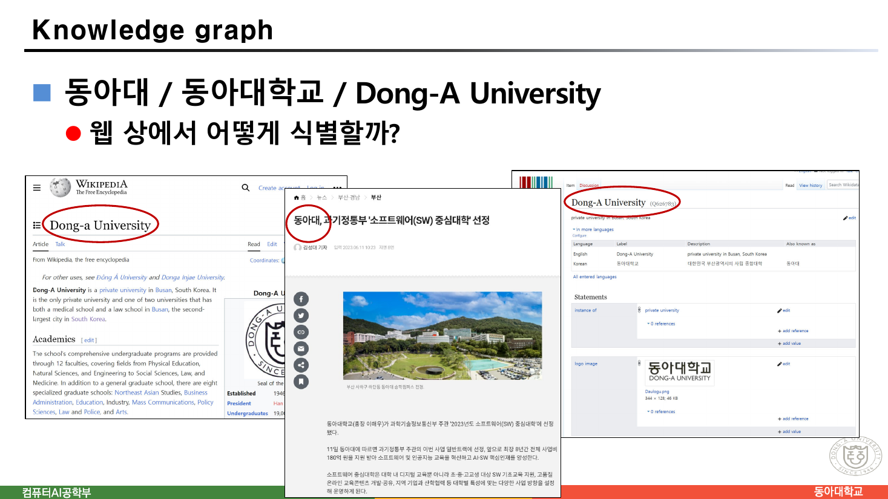
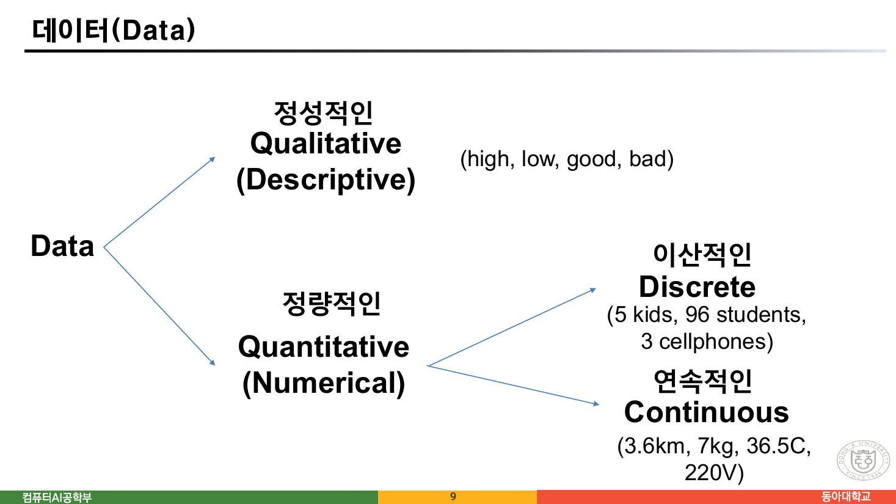
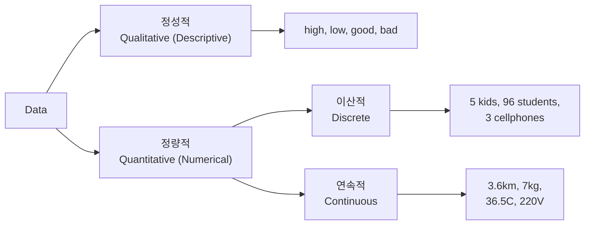
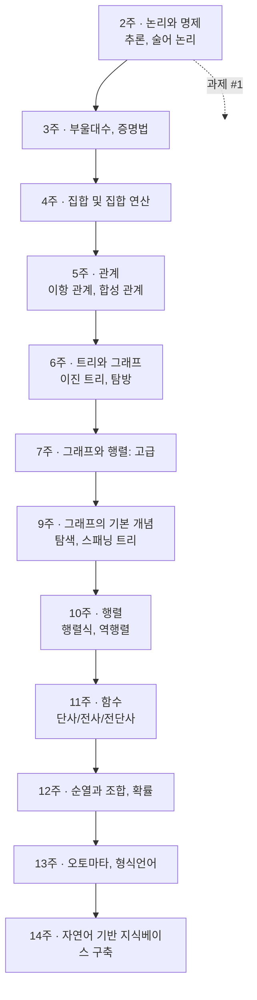

> [!abstract] 이 자료가 실제로 하는 말
> 스물네 쪽 중 **열다섯 쪽 이후는 강의 운영 안내**다. 성적 비율, 이메일 주소, 면담 시간. 실제로 이산수학에 관한 이야기는 **앞의 열 쪽**뿐이고, 그중 여섯 쪽에는 **글이 거의 없다.** 2쪽과 3쪽은 사진 한 장씩이 전부다 — 제목 `Discrete vs. Continuous Math.` 아래에 캡션도 설명도 없이.
>
> 그 여섯 쪽을 나란히 놓으면 하나의 동작이 반복되는 것이 보인다. **연속적으로 일어나는 것을 유한한 개수의 기록으로 접는다.** 태풍의 경로는 점 몇십 개가 되고, 24시간 흐르는 가스는 월별 숫자 한 줄이 되고, 22.9km의 길은 마흔일곱 번의 횡단보도가 된다.
>
> 그래서 이 정리는 "이산수학이란 무엇인가"로 시작하지 않는다. **접히는 순간을 먼저 본다.**

---

## 캡션 없는 두 장

2쪽과 3쪽은 제목이 똑같다 — `Discrete vs. Continuous Math.` 그리고 각각 사진 한 장.





맥주는 흐르고, 물은 방울진다. 슬라이드는 이 대비에 아무 설명도 붙이지 않는다. 붙일 필요가 없다고 본 것이다.

그런데 두 장을 한 번 더 들여다보면 이야기가 조금 달라진다. **맥주도 분자다.** 충분히 확대하면 흐름은 사라지고 낱개가 남는다. 반대로 물방울도 멀리서 보면 연속한 물줄기다 — 3쪽 사진의 아래쪽에 이미 두 번째 방울이 맺혀 있고, 그것이 조금만 빨라지면 2쪽이 된다.

즉 **이산이냐 연속이냐는 대상의 성질이 아니라 우리가 어느 배율에서 보기로 했는가의 문제**다. 이 강의가 다루는 것은 세계의 어떤 부류가 아니라, **다루기로 한 방식**이다. 4·5·10쪽이 이 점을 세 번 더 반복한다.

---

## 같은 동작, 세 번 더

### 태풍 — 스물다섯 날의 궤적이 점 몇십 개로



4쪽은 NOAA의 태풍 경로 조회 화면을 그대로 붙인 것이다. 슬라이드에서 읽을 수 있는 값은 이렇다.

| 항목 | 값 |
| --- | --- |
| 태풍 | OMAIS 2021 |
| 기간 | Aug 07, 2021 ~ Aug 31, 2021 |
| 최대 등급 | TS (Tropical Storm) |
| 최대 풍속 | 55 kt |
| 최저 기압 | 990 mb |

그리고 지도 위에는 **점들의 열**이 그려져 있다. 태풍은 25일 동안 태평양 한가운데에서 오호츠크해까지 끊김 없이 움직였지만, 우리가 가진 것은 그 사이 어느 시점들에 찍힌 **유한한 개수의 관측점**이다. 선은 그 점들을 이어 놓은 것일 뿐, 관측된 적이 없다.

관측 간격을 바꾸면 남는 기록이 얼마나 달라지는지 직접 확인해 보라.

```html preview h=620px
<div style="font-family:system-ui,-apple-system,sans-serif;color:var(--foreground);padding:18px">
  <div style="display:flex;gap:18px;flex-wrap:wrap;align-items:flex-end;margin-bottom:14px">
    <div style="flex:1;min-width:280px">
      <label for="iv" style="display:block;font-size:11px;color:var(--muted-foreground);margin-bottom:4px">관측 간격 — <span id="ivv" style="color:var(--foreground);font-weight:700">6</span>시간마다 한 번</label>
      <input id="iv" type="range" min="1" max="72" value="6" style="width:100%" />
    </div>
  </div>

  <div style="display:grid;grid-template-columns:repeat(auto-fit,minmax(160px,1fr));gap:12px;margin-bottom:14px">
    <div style="border:1px solid var(--border);border-radius:var(--radius,8px);background:var(--card);padding:12px">
      <div style="font-size:11px;color:var(--muted-foreground)">관측 기간 (원본)</div>
      <div style="font-size:17px;font-weight:700;font-family:ui-monospace,monospace">Aug 07 – Aug 31</div>
      <div style="font-size:11px;color:var(--muted-foreground)">= 25일 = 600시간</div>
    </div>
    <div style="border:1px solid var(--border);border-radius:var(--radius,8px);background:var(--card);padding:12px">
      <div style="font-size:11px;color:var(--muted-foreground)">기록되는 점의 개수</div>
      <div id="npts" style="font-size:26px;font-weight:700;font-family:ui-monospace,monospace;color:var(--chart-1)"></div>
    </div>
    <div style="border:1px solid var(--border);border-radius:var(--radius,8px);background:var(--card);padding:12px">
      <div style="font-size:11px;color:var(--muted-foreground)">꺾은선이 실제 경로에서 벗어나는 최대 폭</div>
      <div id="errv" style="font-size:26px;font-weight:700;font-family:ui-monospace,monospace"></div>
    </div>
  </div>

  <svg id="track" viewBox="0 0 720 260" style="width:100%;height:260px;border:1px solid var(--border);border-radius:var(--radius,8px);background:var(--card)"></svg>
  <div style="font-size:11px;color:var(--muted-foreground);margin-top:6px">
    옅은 곡선이 “실제로 일어난 일”, 굵은 꺾은선과 점이 “기록에 남는 것”이다.
    경로 모양은 설명을 위해 그린 것이며 <b>원본에서 가져온 값은 관측 기간(25일)뿐</b>이다.
  </div>
  <div id="say" style="margin-top:12px;font-size:13px;line-height:1.7;padding:11px 13px;border-radius:6px;border:1px solid var(--border)"></div>
</div>
<script>
(function(){
  var iv=document.getElementById('iv'), sv=document.getElementById('track');
  var W=720,H=260,pad=26, HOURS=600;
  function path(t){ // t: 0..1
    var x = pad + (W-2*pad)*t;
    var y = H/2 + 62*Math.sin(t*5.4) - 46*t + 18*Math.sin(t*13.0);
    return [x,y];
  }
  function draw(){
    var step=parseInt(iv.value,10);
    document.getElementById('ivv').textContent=step;
    var n=Math.floor(HOURS/step)+1;
    document.getElementById('npts').textContent=n;

    var fine=[], i;
    for(i=0;i<=600;i++) fine.push(path(i/600));
    var pts=[];
    for(i=0;i<n;i++) pts.push(path(Math.min(i*step,HOURS)/HOURS));
    if(pts.length<2) pts.push(path(1));

    // 꺾은선과 실제 곡선 사이의 최대 수직 거리
    var maxd=0;
    for(i=0;i<=600;i++){
      var t=i/600, x=fine[i][0], y=fine[i][1];
      var seg=Math.min(Math.floor(t*HOURS/step), pts.length-2);
      var a=pts[seg], b=pts[seg+1];
      var u=(x-a[0])/((b[0]-a[0])||1);
      var yy=a[1]+(b[1]-a[1])*u;
      var d=Math.abs(yy-y);
      if(d>maxd) maxd=d;
    }
    document.getElementById('errv').textContent = maxd.toFixed(1)+" px";
    document.getElementById('errv').style.color = maxd>20? "var(--chart-1)":"var(--chart-2, var(--foreground))";

    var s='<polyline points="'+fine.map(function(p){return p[0].toFixed(1)+","+p[1].toFixed(1);}).join(" ")+
          '" fill="none" stroke="var(--muted-foreground)" stroke-width="1" opacity="0.45" />';
    s+='<polyline points="'+pts.map(function(p){return p[0].toFixed(1)+","+p[1].toFixed(1);}).join(" ")+
       '" fill="none" stroke="var(--chart-1)" stroke-width="2.2" />';
    if(pts.length<=160) pts.forEach(function(p){
      s+='<circle cx="'+p[0].toFixed(1)+'" cy="'+p[1].toFixed(1)+'" r="3.2" fill="var(--chart-1)" />';
    });
    sv.innerHTML=s;

    var say=document.getElementById('say');
    say.innerHTML = "25일을 <b>"+step+"시간</b>마다 한 번 적으면 남는 것은 <b>"+n+"줄</b>이다. "+
      (step<=6? "촘촘해서 꺾은선이 곡선과 거의 겹친다 — 그래도 <b>사이의 순간들은 기록에 없다.</b>"
              : "간격이 벌어질수록 경로는 직선 몇 개로 뭉개진다. 잃어버린 것은 태풍이 아니라 <b>기록</b>이다.");
  }
  iv.oninput=draw; draw();
})();
</script>
```

간격을 아무리 좁혀도 점의 개수는 유한하다. 1시간 간격이어도 601줄이다. **연속을 다 담는 기록은 없다.** 그리고 그 601줄로 무엇을 할 수 있는지를 다루는 것이 이산수학이다.

6쪽은 그 지점을 질문으로 남겨 둔다.

> **생각해 볼 점**
>
> - 태풍이 이동지점에서 선제조치 / 대응 방안을 설계
> - 태풍의 이동경로 혹은 도달시간 예측
> — 원본 6쪽

두 질문 모두 **점들 사이를 메우는 일**이다. 기록에 없는 시각의 위치를 추정하고(보간), 기록 밖의 시각을 추정한다(예측).

### 생산량 — 흐르는 것을 월별 한 줄로



5쪽은 공공데이터포털의 화면이다. `한국가스공사_월별 천연가스 생산량`, 2016년 1월부터 2022년 10월까지. 미리보기 표는 이렇게 시작한다.

| 연도 | 월 | 생산량(톤) |
| --- | --- | --- |
| 2016 | 01 | 4288593 |
| 2016 | 02 | 3592400 |
| 2016 | 03 | 3201669 |
| 2016 | 04 | 2135286 |
| 2016 | 05 | 1989360 |
| 2016 | 06 | 2076852 |
| 2016 | 07 | 2300665 |
| 2016 | 08 | 2278564 |
| 2016 | 09 | 2046908 |

가스는 초 단위로 끊김 없이 흐른다. 그러나 **기록은 월 단위 정수 하나**다. 4,288,593톤이라는 숫자 안에서 1월 3일과 1월 17일은 구분되지 않는다. 태풍 슬라이드와 정확히 같은 접기다 — 다만 여기서는 접는 축이 공간이 아니라 시간이고, 접는 방식이 표본이 아니라 **합계**다.

슬라이드 제목이 `집계 / 통계 데이터` 인 이유가 이것이다. **집계는 이산화의 다른 이름**이다.

### 걷기 — 22.9km가 마흔일곱 번의 횡단보도로



10쪽은 두 줄의 문장과 지도 한 장이다.

> - Backbone of Computer science
> - 실세계 응용에서, 우리가 관심있게 다루는 개체들은 **유한적(finite)인 형태로 사용함**
> — 원본 10쪽

지도의 경로 요약이 그 "유한한 형태"를 그대로 보여준다.

| 항목 | 값 |
| --- | --- |
| 소요 시간 | 6시간 23분 |
| 거리 | 22.9 km |
| 육교 | 1회 |
| 횡단보도 | 47회 |
| 계단 | 3회 |

`22.9 km` 는 연속량이다. 그런데 그 아래 세 줄은 전부 **세는 수**다 — 육교 1, 횡단보도 47, 계단 3. 그리고 왼쪽 패널은 경로를 **번호가 붙은 명령의 목록**으로 바꿔 놓았다. "오륙도12호까지 직진", "왼쪽 방향", "2개 횡단보도 건너기"…

지도 위의 파란 선은 연속이지만, **실제로 따라 걸을 수 있는 형태로 바뀐 순간 그것은 유한한 목록**이 된다. 그리고 그 목록에 대해서만 "가장 짧은 경로", "가장 적게 건너는 경로" 같은 질문을 물을 수 있다.

---

## 이름도 접힌다

7·8쪽은 앞의 이야기를 **개체**로 옮긴다.



슬라이드는 세 화면을 나란히 붙이고 각각의 이름을 빨간 원으로 표시해 두었다.

- Wikipedia — `Dong-a University`
- 뉴스 기사 — `동아대`
- Wikidata — `Dong-A University` **(Q626789)**

그리고 질문 한 줄. **"웹 상에서 어떻게 식별할까?"**

세 이름은 문자열로는 전부 다르다. `동아대`와 `동아대학교`는 글자 수부터 다르고, `Dong-a`와 `Dong-A`는 대문자 한 글자가 다르다. 사람은 셋이 같은 것임을 안다. 기계는 모른다.

Wikidata의 화면이 그 해법을 보여준다. 이름이 아니라 **키**를 정체로 삼는다.

| 항목 | 값 (원본 8쪽 Wikidata 화면) |
| --- | --- |
| 식별자 | `Q626789` |
| English label | Dong-A University |
| English description | private university in Busan, South Korea |
| Korean label | 동아대학교 |
| Korean description | 대한민국 부산광역시의 사립 종합대학 |
| Korean also known as | 동아대 |
| instance of | private university |

이름은 여럿이고 키는 하나다. 아래에서 두 방식의 차이를 확인해 보라.

```html preview h=560px
<div style="font-family:system-ui,-apple-system,sans-serif;color:var(--foreground);padding:18px">
  <div style="font-size:11px;color:var(--muted-foreground);margin-bottom:6px">원본 8쪽에 나온 표기들 — 줄을 눌러 켜고 끌 수 있다</div>
  <div id="chips" style="display:flex;gap:7px;flex-wrap:wrap;margin-bottom:16px"></div>

  <div style="display:grid;grid-template-columns:repeat(auto-fit,minmax(260px,1fr));gap:12px">
    <div style="border:1px solid var(--border);border-radius:var(--radius,8px);background:var(--card);padding:14px">
      <div style="font-size:12px;font-weight:700;margin-bottom:8px">① 문자열로 묶었을 때</div>
      <div id="byname" style="font-size:13px;line-height:1.9;font-family:ui-monospace,monospace"></div>
      <div id="nname" style="margin-top:10px;font-size:12px;color:var(--muted-foreground)"></div>
    </div>
    <div style="border:1px solid var(--border);border-radius:var(--radius,8px);background:var(--card);padding:14px">
      <div style="font-size:12px;font-weight:700;margin-bottom:8px">② 키(Q626789)로 묶었을 때</div>
      <div id="bykey" style="font-size:13px;line-height:1.9;font-family:ui-monospace,monospace"></div>
      <div id="nkey" style="margin-top:10px;font-size:12px;color:var(--muted-foreground)"></div>
    </div>
  </div>
  <div id="msg" style="margin-top:14px;font-size:13px;line-height:1.7;padding:11px 13px;border-radius:6px;border:1px solid var(--border)"></div>
</div>
<script>
(function(){
  var ITEMS=[
    {s:"Dong-a University", src:"Wikipedia 제목", on:true},
    {s:"Dong-A University", src:"Wikidata English label", on:true},
    {s:"동아대", src:"뉴스 기사 · Wikidata also known as", on:true},
    {s:"동아대학교", src:"Wikidata Korean label", on:true},
    {s:"동아대학교(총장 이해우)", src:"기사 본문 안의 표기", on:false}
  ];
  var chips=document.getElementById('chips');
  ITEMS.forEach(function(it,i){
    var b=document.createElement('button');
    b.innerHTML='"'+it.s+'" <span style="opacity:.6">'+it.src+'</span>';
    b.style.cssText="padding:6px 10px;font-size:11.5px;border-radius:6px;cursor:pointer;border:1px solid var(--border);text-align:left";
    b.onclick=function(){ it.on=!it.on; draw(); };
    it.el=b; chips.appendChild(b);
  });
  function norm(s){ return s.toLowerCase(); }
  function draw(){
    ITEMS.forEach(function(it){
      it.el.style.background = it.on? "var(--chart-1)":"transparent";
      it.el.style.color = it.on? "var(--card)":"var(--muted-foreground)";
      it.el.style.borderColor = it.on? "var(--chart-1)":"var(--border)";
    });
    var live=ITEMS.filter(function(it){return it.on;});
    var groups={};
    live.forEach(function(it){ (groups[norm(it.s)] = groups[norm(it.s)] || []).push(it.s); });
    var keys=Object.keys(groups);
    document.getElementById('byname').innerHTML =
      keys.map(function(k,i){ return "<span style='color:var(--chart-1)'>그룹 "+(i+1)+"</span> · "+groups[k].join(" = "); }).join("<br>") || "—";
    document.getElementById('nname').textContent = "서로 다른 개체로 세어진 것: " + keys.length + "개";

    document.getElementById('bykey').innerHTML = live.length
      ? "<span style='color:var(--chart-2, var(--chart-1))'>Q626789</span> · " + live.map(function(it){return it.s;}).join("<br>&nbsp;&nbsp;&nbsp;&nbsp;&nbsp;&nbsp;&nbsp;&nbsp;&nbsp;&nbsp;&nbsp;· ")
      : "—";
    document.getElementById('nkey').textContent = "서로 다른 개체로 세어진 것: " + (live.length?1:0) + "개";

    var m=document.getElementById('msg');
    m.style.borderColor = keys.length>1? "var(--chart-1)":"var(--border)";
    m.innerHTML = keys.length>1
      ? "문자열로 묶으면 <b>같은 학교가 "+keys.length+"개로 갈라진다.</b> 대문자 한 글자, 조사 두 글자 차이가 그대로 다른 개체가 된다."
      : "지금은 표기가 하나뿐이라 두 방식이 같아 보인다. 표기를 더 켜 보라.";
  }
  draw();
})();
</script>
```

여기서 무슨 일이 일어났는지 다시 보자. **`동아대학교`라는 실체는 연속도 이산도 아니다.** 이산화된 것은 그 실체가 아니라, 웹이 그것을 가리키는 **방식**이다. 문자열이라는 무한하고 흐릿한 공간에서, `Q626789` 라는 **유한한 이름표**로 옮겨 붙인 것.

7쪽이 미리 그 어휘를 준비해 둔다.

> **Knowledge base**
>
> - A store of information or data
> - A set of facts, assumptions, and rules
> — 원본 7쪽

`A set of` — 이산수학의 첫 번째 구조가 이 자료의 일곱 번째 쪽에서 이미 등장한다.

---

## 9쪽의 분류표, 그리고 그 안의 빈칸



9쪽은 데이터를 이렇게 나눈다.



이 그림에서 **`이산적`은 `정량적`의 아래에만 달려 있다.** 정성적 데이터는 이산도 연속도 아닌 채로 남는다.

> [!tip] 그림이 그리지 않은 것 (보충)
> 이 관찰은 원본에 없다. 하지만 짚어 둘 만하다 — **`good`, `bad`, `high`, `low` 야말로 완전히 이산적이다.** 값이 네 개뿐이고, 그 사이에 아무것도 없다. `good`과 `bad` 사이의 중간값을 물을 수 없다는 점에서 3.6km와 7kg 사이보다 훨씬 더 이산적이다.
>
> 그림이 그것을 가지에 달지 않은 이유는 아마도, 이 분류가 **측정 척도**의 관습적 분류(명목/순서/구간/비율)를 단순화한 것이기 때문이다. 그 관습에서 `이산 대 연속`은 수치형 안에서만 묻는 질문이다. 다만 이 강의의 맥락 — "우리가 다루는 개체들은 유한적인 형태로 사용함"(10쪽) — 에서는 정성적 데이터가 오히려 대표적인 이산 구조다. 실제로 이 학기의 뒷부분이 다루는 집합·관계·그래프는 전부 `good/bad` 쪽에 가깝다.

---

## 15주가 어디로 가는가

11·12쪽은 강의계획표다. 이 자료에서 유일하게 글자가 빽빽한 두 쪽이고, 학기 전체의 지도이기도 하다.



과제는 2주부터 13주까지 매주 하나씩(#1~#10) 배정되어 있다. 그런데 20쪽은 **"2개의 개별 과제 (10%)"** 라고 적는다. 계획표의 `과제 #1`~`#10`은 실제 제출물이 아니라 주차별 연습 문제로 보아야 앞뒤가 맞는다.

> [!warning] 원본 불일치 ① — 12쪽 표와 12쪽 마지막 줄이 다르다
> 12쪽 표는 이렇게 적는다.
>
> | 주 | 학습목표 |
> | --- | --- |
> | 12 | 순열과 조합, 확률 |
> | 13 | 오토마타 |
> | 14 | 고급: 자연어 기반 지식베이스 구축 |
>
> 그런데 같은 쪽 표 바로 아래에 이 한 줄이 있다.
>
> > **12-14주에는 지식그래프, RDF 모델링, RDF/SPARQL 기초에 대해 학습**
>
> 표의 12주와 13주는 지식그래프와 아무 상관이 없다. 표대로라면 지식그래프는 **14주 한 주**뿐이다. 한 쪽 안에서 같은 주차를 두 가지로 적었다.
>
> `sources/` 에 실제로 `7 지식그래프 소개.pdf` 가 따로 있는 것을 보면 지식그래프 분량이 한 주를 넘었을 가능성이 높다. 어느 쪽이 실제 진행이었는지는 이 자료만으로 판단할 수 없다.

같은 표에 한 줄이 더 걸린다.

> [!warning] 원본 불일치 ② — 11쪽 7주차의 학습목표와 학습내용이 서로 다른 이야기
>
> | 주 | 학습목표 | 학습내용 |
> | --- | --- | --- |
> | 7 | **그래프와 행렬: 고급** | **-파라미터 최적화** |
>
> 그래프와 행렬을 배우는 주의 학습내용이 "파라미터 최적화"다. 나머지 열한 개 주차는 모두 학습목표와 학습내용이 같은 주제를 가리킨다(예: `함수` / `-함수의 정의, 단사/전사/전단사 함수, 함수 그래프`). 7주차만 두 칸이 서로 다른 과목처럼 읽힌다.

나머지 둘은 운영 안내 쪽이다.

> [!note] 원본 불일치 ③ — 22쪽과 23쪽의 제목이 같다
> 두 쪽 모두 제목이 **`협력과 학업의 진정성 (1)`** 이다. 22쪽은 금지 사항(복사 금지, 출처 표기, 파일 공유 금지)이고 23쪽은 허용 사항(토의, 상위 수준 pseudocode, 디버깅 도움)이라 내용이 확실히 나뉘어 있다. 23쪽이 `(2)` 여야 한다.

바로 앞 쪽에도 비슷한 어긋남이 있다.

> [!note] 원본 불일치 ④ — 21쪽 성적 규정의 제목과 항목이 어긋난다
> 21쪽은 이렇게 적혀 있다.
>
> > **과제 2개 미제출시**: 받을 수 있는 성적이 제한됨
> >
> > - 과제 **1개** 미제출이더라도, A+ 부여
> > - 과제 **2개** 미제출시 우수한 성적이라도 A
>
> 굵은 제목은 "2개 미제출"에 관한 것인데, 첫 항목은 "1개 미제출"을 말한다. 항목 둘을 함께 읽으면 규정 자체는 통한다(1개는 상한 없음, 2개는 A가 상한). 다만 **제목이 두 항목 중 하나만 덮는다.** 제목이 `과제 미제출 시` 였다면 어긋나지 않았을 것이다.

강의계획표에는 **1주, 8주, 15주가 없다.** 16쪽이 "15주 동안"이라 적고 있으니 빠진 세 주가 있는 셈인데, 1주는 이 오리엔테이션 자체이고 8주와 15주는 20쪽이 말하는 중간시험·기말시험 자리로 보는 것이 자연스럽다. 자료가 명시하지는 않는다.

---

## 이 자료가 학기에 대해 약속한 것

13·14쪽은 강의 목표를 네 갈래로 적어 두었다. 나중에 각 장이 어느 약속을 지키는지 확인할 수 있도록 옮겨 둔다.

| 목표 | 원본의 표현 | 어느 자료에서 |
| --- | --- | --- |
| 수학적 추론 | "수학적인 논증(argument)와 증명(proof)를 읽고, 이해하고, 생성할 수 있다" | `수학적 모델과 논리` |
| 조합적 분석 | "다른 종류의 개체를 세기 위한 방법론" | 12주 (순열과 조합) |
| 이산 구조 | "Set, Permutation, Relations, Graphs, Trees" | `집합 및 집합연산`, `4 관계 및 함수`, `5 그래프`, `6 트리` |
| 알고리즘 사고력 | "알고리즘 실행을 위한 시간과 메모리를 분석하는 것, 알고리즘이 올바른 정답을 생성하는지를 증명하는 것" | `Appendix 1 · 2` |
| 응용과 모델링 | "지식그래프 기초와 사용" | `7 지식그래프 소개` |

16쪽은 이 목록이 왜 필요한지를 한 문단으로 적는다.

> 앞으로 다루는 주제는 다음 단계 학습에 있어 매우 중요
>
> - **Computer Science**: Computer Architecture, Data Structures, Algorithms, Programming Languages, Compilers, Computer Security, Databases, Artificial Intelligence, Networking, Graphics, Game Design, Theory of Computation
> - **Mathematics**: Logic, Set Theory, Probability, Number Theory, Abstract Algebra, Combinatorics, Graph Theory, Game Theory, Network Optimization
> — 원본 16쪽

이 목록의 앞쪽 넷([자료구조](../../../01_programming-foundations/data-structures/README.md), 알고리즘, [프로그래밍 언어](../../../05_software-engineering/programming-languages/README.md), 컴파일러)은 이 저장소에 이미 과목으로 들어와 있다. 10쪽의 "Backbone of Computer science"라는 표현이 은유가 아니라는 뜻이다.

---

## 그래서, 이 강의가 다루는 것

앞의 열 쪽을 한 줄로 접으면 이렇다.

> **세계가 이산인 것이 아니라, 기록이 유한한 것이다.** 그 유한한 기록 위에서 셀 수 있고, 이을 수 있고, 증명할 수 있는 것들을 다루는 것이 이산수학이다.

그리고 학기의 나머지는 그 "유한한 기록"의 형태를 하나씩 정한다 — 참·거짓 두 값(논리), 원소의 모임(집합), 짝의 모임(관계), 점과 선의 모임(그래프).

---

## 근거 자료

- `sources/1 이산수학 소개.pdf` — 24쪽 전부
  - 2·3쪽 · Discrete vs. Continuous (인용: `ch01-p02`, `ch01-p03`)
  - 4쪽 · OMAIS 2021 태풍 궤적 (인용: `ch01-p04`)
  - 5쪽 · 월별 천연가스 생산량 (인용: `ch01-p05`)
  - 8쪽 · 동아대 식별 문제 (인용: `ch01-p08`)
  - 9쪽 · 데이터 분류 (인용: `ch01-p09`)
  - 10쪽 · 해운대→동아대 도보 (인용: `ch01-p10`)
  - 6·7·11~24쪽 — 본문의 인용문과 표에 반영. **원본 불일치 ①②③④** 는 11·12·21·22·23쪽
- 인터랙티브에 쓴 값은 원본 슬라이드에서 읽은 것이다 — 관측 기간(Aug 07~Aug 31, 2021), 도보 경로 수치(6시간 23분·22.9km·육교 1·횡단보도 47·계단 3), Wikidata 표기 다섯 가지와 식별자 `Q626789`. 태풍 궤적 인터랙티브의 **곡선 모양은 설명을 위해 그린 것**이며 원본 지도를 옮긴 것이 아니다(본문에 명시)
- "맥주도 분자다", "정성적 데이터야말로 이산적이다"는 원본에 없는 보충 관찰이며 그렇게 밝혔다

## 이어지는 글

- [02. 함축은 인과가 아니다](<./02. 함축은 인과가 아니다.md>) — 명제 논리와 진리표
- [03. 논증을 기계에게 넘기려면](<./03. 논증을 기계에게 넘기려면.md>) — 술어 논리에서 추론 기관까지
