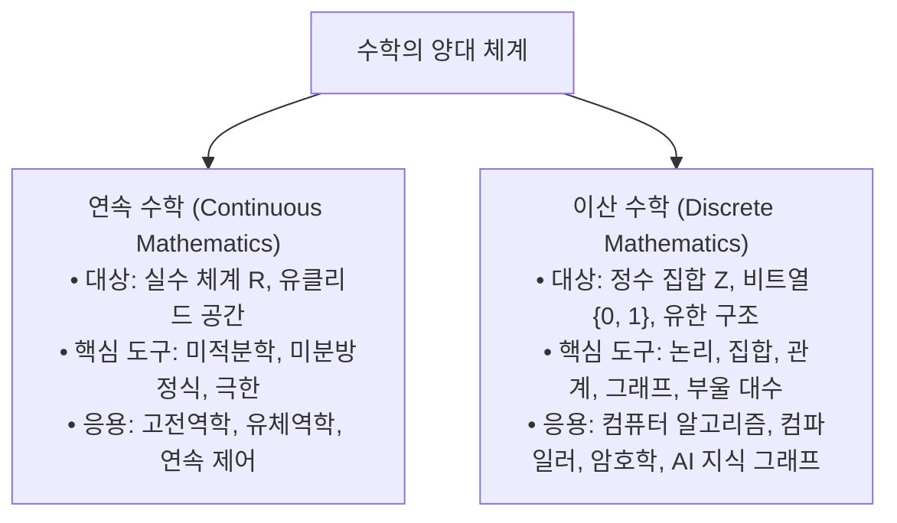

> [!abstract] 핵심 요약
> **이산수학(Discrete Mathematics)**은 분절되고 셀 수 있는(Countable) 이산적 수학 객체를 다루는 학문이다.
> 미적분학 중심의 **연속 수학(Continuous Math)**이 실수의 연속적 변화를 다룬다면, **이산 수학**은 디지털 컴퓨터의 이진 비트(0과 1), 유한 상태 머신, 그래프 네트워크 및 지식 베이스(Knowledge Base)의 엄밀한 수학적 토대를 제공한다.

---

## 1. 연속 수학 vs 이산 수학 비교



---

## 2. 컴퓨터 과학을 지탱하는 7대 이산 구조

| 순번 | 이산 구조 (Discrete Structure) | 핵심 수학적 정의 | CS 및 AI 실세계 응용 |
| :--: | :-- | :-- | :-- |
| **1** | **명제·술어 논리 (Logic)** | 진리값($\{T, F\}$)과 추론 규칙($\vdash$) | 자동 정리 증명, 불 대수 논리 회로, Prolog |
| **2** | **집합론 (Set Theory)** | 소속 관계($\in$)와 부분집합($\subseteq$) | 데이터베이스 RDBMS 관계 모델, 집합 연산 |
| **3** | **이항 관계 (Relations)** | 순서쌍 부분집합($R \subseteq A \times B$) | 객체 간 연관성 모델링, 동치 분할, Poset |
| **4** | **함수 (Functions)** | 정의역 $\to$ 공역 1:1 유일 사상 | 해시 함수, 암호화 키 매핑, 람다 대수 |
| **5** | **그래프 (Graphs)** | 정점과 간선($G = (V, E)$) | 소셜 네트워크 분석, 라우팅 최단경로, 지식그래프 |
| **6** | **트리 (Trees)** | 비순환 연결 그래프($e = v - 1$) | 파일 시스템, DOM 트리, 파싱 트리, MST |
| **7** | **부울 대수 (Boolean Algebra)** | 2진 연산 체계($\land, \lor, \neg$) | CPU ALU 연산기, 디지털 논리 게이트 설계 |

---

## 3. 실시간 연속 신호의 이산화(Sampling & Quantization) 시뮬레이터

```html preview
<div style="font-family:system-ui,-apple-system,sans-serif;padding:20px;background:var(--card);color:var(--card-foreground);border:1px solid var(--border);border-radius:var(--radius)">
  <div style="font-size:16px;font-weight:700;margin-bottom:14px;color:var(--primary);display:flex;align-items:center;gap:8px">
    <span>📈 연속 아날로그 함수(sin)의 이산 표본화(Sampling) 시각화기</span>
  </div>

  <div style="display:flex;gap:12px;margin-bottom:12px;align-items:center">
    <label style="font-size:12px;font-weight:700">샘플링 주기 N (이산 분할 수):</label>
    <input id="sampleSlider" type="range" min="4" max="32" value="12" style="flex:1" />
    <span id="sampleVal" style="font-size:13px;font-weight:800;color:var(--chart-1);width:30px">12</span>
  </div>

  <canvas id="samplingCanvas" width="400" height="150" style="width:100%;max-width:400px;background:var(--background);border:1px solid var(--border);border-radius:var(--radius);display:block;margin-bottom:12px"></canvas>

  <div style="font-size:11px;color:var(--muted-foreground)">
    💡 연속 공간($\mathbb{R}$)의 곡선이 샘플링 점들의 집합($S = \{(x_k, y_k)\}$)인 **이산 데이터**로 변환되어 컴퓨터 메모리에 저장됩니다.
  </div>

  <script>
    var slider = document.getElementById('sampleSlider');
    var valOut = document.getElementById('sampleVal');
    var cvs = document.getElementById('samplingCanvas');
    var ctx = cvs.getContext('2d');

    function draw() {
      var n = parseInt(slider.value);
      valOut.textContent = n;

      var w = cvs.width;
      var h = cvs.height;
      ctx.clearRect(0, 0, w, h);

      // 중심축
      ctx.strokeStyle = '#666';
      ctx.lineWidth = 1;
      ctx.beginPath();
      ctx.moveTo(20, h / 2);
      ctx.lineTo(w - 20, h / 2);
      ctx.stroke();

      // 연속 곡선 (회색 점선)
      ctx.strokeStyle = '#888';
      ctx.setLineDash([3, 3]);
      ctx.beginPath();
      for (var x = 20; x <= w - 20; x++) {
        var t = ((x - 20) / (w - 40)) * Math.PI * 2;
        var y = h / 2 - Math.sin(t) * 50;
        if (x === 20) ctx.moveTo(x, y);
        else ctx.lineTo(x, y);
      }
      ctx.stroke();
      ctx.setLineDash([]);

      // 이산 샘플링 바 및 점
      ctx.fillStyle = 'var(--primary)';
      ctx.strokeStyle = 'var(--primary)';
      ctx.lineWidth = 2;

      for (var i = 0; i <= n; i++) {
        var sx = 20 + (i / n) * (w - 40);
        var t = (i / n) * Math.PI * 2;
        var sy = h / 2 - Math.sin(t) * 50;

        ctx.beginPath();
        ctx.moveTo(sx, h / 2);
        ctx.lineTo(sx, sy);
        ctx.stroke();

        ctx.beginPath();
        ctx.arc(sx, sy, 4, 0, Math.PI * 2);
        ctx.fill();
      }
    }

    slider.addEventListener('input', draw);
    draw();
  </script>
</div>
```
