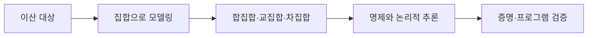

이산수학은 연속적으로 변하는 양보다 컴퓨터가 다루는 유한·분리된 대상을 다룬다. 자료는 이산/연속 비교 뒤 집합, 집합 연산, 수학적 모델과 논리적 추론으로 확장한다.



<Tabs>
  <Tab label="집합">원소와 부분집합을 정의하고 합집합, 교집합, 차집합, 여집합을 계산한다.</Tab>
  <Tab label="모델">자연·공학·사회 현상을 수학적 식으로 단순화한다.</Tab>
  <Tab label="논리">명제의 참·거짓과 추론 규칙으로 결론을 검증한다.</Tab>
</Tabs>

| 흐름 | 핵심 질문 |
| --- | --- |
| 이산·연속 | 값을 셀 수 있는가, 연속적으로 변하는가 |
| 집합 | 어떤 원소가 묶음에 속하는가 |
| 모델 | 현실의 어떤 관계를 식으로 남길 것인가 |
| 검증 | 가정에서 결론이 논리적으로 따라오는가 |

```html preview
<div style="font-family:system-ui,sans-serif;padding:20px;color:var(--foreground)">
<label for="amt" style="font-size:14px;font-weight:600">기초 장</label>
<div id="out" style="font-size:30px;font-weight:700;color:var(--chart-1);margin:6px 0">1장</div>
<input id="amt" type="range" min="1" max="3" step="1" value="1" style="width:100%;accent-color:var(--primary)" />
<p style="font-size:13px;color:var(--muted-foreground)">원본 장·절 순서를 움직여 현재 개념 묶음을 확인한다.</p>
<script>
var amt=document.getElementById('amt'); var out=document.getElementById('out');
amt.addEventListener('input',function(){out.textContent=Number(amt.value).toLocaleString()+'장';});
</script>
</div>
```

> [!IMPORTANT]
> 수학적 모델은 현실을 모두 복사하는 것이 아니라 문제 해결에 필요한 변수와 관계만 남긴다.

<details>
<summary>증명·검증 연결</summary>

자료는 논리적 추론, 수학적 귀납법, 프로그램 검증, 지식 베이스 시스템을 하나의 응용 흐름으로 제시한다. 명제와 집합 연산은 뒤의 관계·그래프 표현으로 이어진다.

</details>

<!-- source: introduction, set operations and mathematical model/logic decks; chapter progression preserved -->