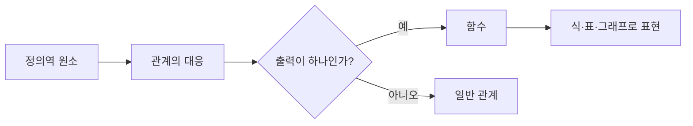

관계는 두 집합 원소 사이의 대응을 표현하고, 함수는 한 입력이 하나의 출력으로 정해지는 특별한 관계다. 자료는 일상어의 function 의미와 변수 표현, Python 함수 예시를 함께 보여 준다.



<Tabs>
  <Tab label="관계">두 집합 사이의 순서쌍을 모아 대응을 정의한다.</Tab>
  <Tab label="함수">정의역의 각 원소가 공역의 정확히 한 원소에 대응한다.</Tab>
  <Tab label="구현">Python 함수는 입력 매개변수를 받아 본문을 실행하고 반환값을 돌려준다.</Tab>
</Tabs>

| 표현 | 읽는 법 |
| --- | --- |
| 순서쌍 | (입력, 출력) 대응 |
| 식 | 변수 사이 규칙 |
| 표 | 입력별 출력 기록 |
| 그래프 | 좌표 평면의 점 또는 곡선 |

```html preview
<div style="font-family:system-ui,sans-serif;padding:20px;color:var(--foreground)">
<label for="amt" style="font-size:14px;font-weight:600">관계·함수 절</label>
<div id="out" style="font-size:30px;font-weight:700;color:var(--chart-1);margin:6px 0">1절</div>
<input id="amt" type="range" min="1" max="4" step="1" value="1" style="width:100%;accent-color:var(--primary)" />
<p style="font-size:13px;color:var(--muted-foreground)">원본 장·절 순서를 움직여 현재 개념 묶음을 확인한다.</p>
<script>
var amt=document.getElementById('amt'); var out=document.getElementById('out');
amt.addEventListener('input',function(){out.textContent=Number(amt.value).toLocaleString()+'절';});
</script>
</div>
```

> [!WARNING]
> 함수인지 확인할 때는 정의역의 한 입력이 서로 다른 두 출력으로 연결되는지 먼저 본다. 공역의 모든 원소가 사용되는지는 함수 여부와 별개다.

<details>
<summary>Python 연결</summary>

함수 정의 → 매개변수 전달 → 본문 계산 → return의 순서로 읽는다. 반환값이 없는 호출은 관계의 출력이 없다는 뜻이 아니라 프로그램 결과를 돌려주지 않는 구현이다.

</details>

<!-- source: 4 관계 및 함수.pdf; relation/function definitions and Python example preserved -->