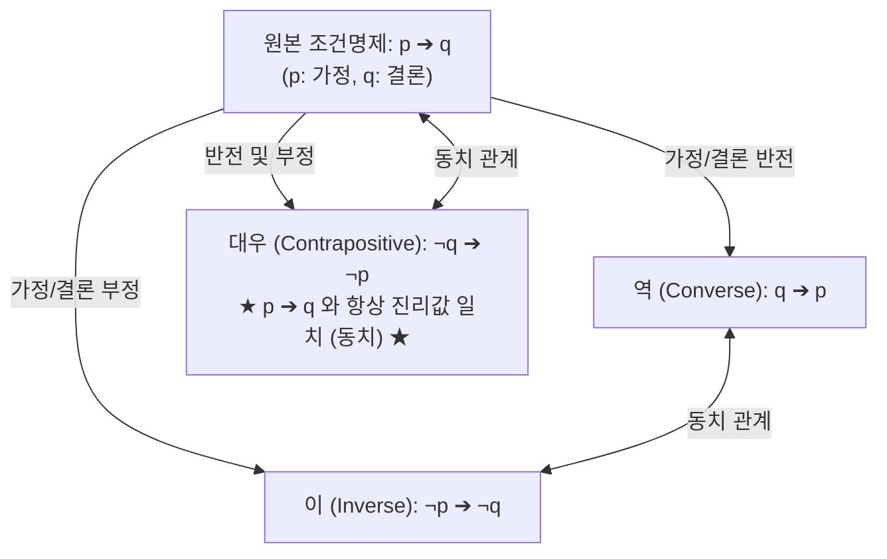
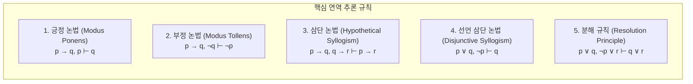

> [!abstract] 핵심 요약
> **수학적 논리(Mathematical Logic)**는 컴퓨터 과학과 AI 지식 표현(Knowledge Representation)의 형식적 토대이다.
> 조건명제 $p \to q$의 대우($\neg q \to \neg p$) 동치율, 술어 한정사($\forall, \exists$)의 드모르간 변환, 그리고 추론 규칙인 **긍정 논법(Modus Ponens)**과 **분해 규칙(Resolution, $p \lor q, \neg p \lor r \vdash q \lor r$)**은 Prolog 및 자동 정리 증명(Automated Theorem Proving)의 핵심 메커니즘으로 기능한다.

---

## 1. 조건명제의 4대 변형과 논리적 동치성



### 1) 조건문 진리표 정의 및 동치 변환
$$p \to q \equiv \neg p \lor q$$
$$p \leftrightarrow q \equiv (p \to q) \land (q \to p) \equiv (p \land q) \lor (\neg p \land \neg q)$$

| $p$ | $q$ | $\neg p$ | $p \land q$ | $p \lor q$ | $p \oplus q$ | $p \to q$ | $\neg q \to \neg p$ (대우) | $p \leftrightarrow q$ |
| :-: | :-: | :-: | :-: | :-: | :-: | :-: | :-: | :-: |
| **T** | **T** | F | **T** | **T** | F | **T** | **T** | **T** |
| **T** | **F** | F | F | **T** | **T** | **F** | **F** | F |
| **F** | **T** | T | F | **T** | **T** | **T** | **T** | F |
| **F** | **F** | T | F | F | F | **T** | **T** | **T** |

---

## 2. 5대 핵심 유효 추론 규칙(Rules of Inference)



---

## 3. 술어 한정사($\forall, \exists$)와 수학적 귀납법

### 1) 한정사의 부정 법칙 (드모르간 확장)
$$\neg \forall x P(x) \equiv \exists x \neg P(x)$$
$$\neg \exists x P(x) \equiv \forall x \neg P(x)$$

### 2) 수학적 귀납법(Mathematical Induction) 3단계
1. **기저 단계 (Basis Step)**: $P(1)$이 참임을 증명한다.
2. **귀납 가정 (Inductive Hypothesis)**: 임의의 $k \ge 1$에 대해 $P(k)$가 참이라고 가정한다.
3. **귀납 단계 (Inductive Step)**: $P(k)$의 참을 이용하여 $P(k+1)$이 참임을 유도한다.
$$\therefore \forall n \in \mathbb{N}, P(n) \text{은 참이다.}$$

---

## 4. 실시간 명제 논리 진리표 생성기 및 추론 검증기

```html preview
<div style="font-family:system-ui,-apple-system,sans-serif;padding:20px;background:var(--card);color:var(--card-foreground);border:1px solid var(--border);border-radius:var(--radius)">
  <div style="font-size:16px;font-weight:700;margin-bottom:14px;color:var(--primary);display:flex;align-items:center;gap:8px">
    <span>⚖️ 명제 논리 진리표 실시간 분석기 & 대우 동치 검증기</span>
  </div>

  <div style="display:flex;gap:12px;margin-bottom:14px;align-items:center;flex-wrap:wrap">
    <div style="display:flex;align-items:center;gap:6px">
      <span style="font-size:13px;font-weight:700">명제 P:</span>
      <select id="selP" style="padding:4px 8px;background:var(--background);color:var(--foreground);border:1px solid var(--border);border-radius:var(--radius);font-weight:700">
        <option value="true">True (참 / 1)</option>
        <option value="false">False (거짓 / 0)</option>
      </select>
    </div>
    <div style="display:flex;align-items:center;gap:6px">
      <span style="font-size:13px;font-weight:700">명제 Q:</span>
      <select id="selQ" style="padding:4px 8px;background:var(--background);color:var(--foreground);border:1px solid var(--border);border-radius:var(--radius);font-weight:700">
        <option value="true">True (참 / 1)</option>
        <option value="false" selected>False (거짓 / 0)</option>
      </select>
    </div>
  </div>

  <div style="display:grid;grid-template-columns:repeat(4, 1fr);gap:8px;margin-bottom:14px">
    <div style="padding:8px;background:var(--background);border:1px solid var(--border);border-radius:var(--radius);text-align:center">
      <div style="font-size:11px;color:var(--muted-foreground)">논리곱 (P ∧ Q)</div>
      <div id="resAnd" style="font-size:15px;font-weight:700;margin-top:2px"></div>
    </div>
    <div style="padding:8px;background:var(--background);border:1px solid var(--border);border-radius:var(--radius);text-align:center">
      <div style="font-size:11px;color:var(--muted-foreground)">논리합 (P ∨ Q)</div>
      <div id="resOr" style="font-size:15px;font-weight:700;margin-top:2px"></div>
    </div>
    <div style="padding:8px;background:var(--background);border:1px solid var(--border);border-radius:var(--radius);text-align:center">
      <div style="font-size:11px;color:var(--muted-foreground)">조건문 (P → Q)</div>
      <div id="resImp" style="font-size:15px;font-weight:700;margin-top:2px"></div>
    </div>
    <div style="padding:8px;background:var(--background);border:1px solid var(--border);border-radius:var(--radius);text-align:center">
      <div style="font-size:11px;color:var(--muted-foreground)">대우 (¬Q → ¬P)</div>
      <div id="resContra" style="font-size:15px;font-weight:700;margin-top:2px"></div>
    </div>
  </div>

  <div style="padding:10px;background:var(--background);border:1px solid var(--primary);border-radius:var(--radius);font-size:12px">
    <span style="font-weight:700;color:var(--primary)">논리적 동치성(Equivalence) 검증: </span>
    <span id="equivProof" style="font-family:monospace;font-weight:700;color:var(--chart-2)"></span>
  </div>

  <script>
    var pSel = document.getElementById('selP');
    var qSel = document.getElementById('selQ');

    function evalLogic() {
      var p = (pSel.value === 'true');
      var q = (qSel.value === 'true');

      var andVal = p && q;
      var orVal = p || q;
      var impVal = (!p) || q;
      var contraVal = (!(!q)) || (!p); // q || !p

      document.getElementById('resAnd').textContent = andVal ? "TRUE" : "FALSE";
      document.getElementById('resAnd').style.color = andVal ? "var(--chart-2)" : "var(--destructive)";

      document.getElementById('resOr').textContent = orVal ? "TRUE" : "FALSE";
      document.getElementById('resOr').style.color = orVal ? "var(--chart-2)" : "var(--destructive)";

      document.getElementById('resImp').textContent = impVal ? "TRUE" : "FALSE";
      document.getElementById('resImp').style.color = impVal ? "var(--chart-2)" : "var(--destructive)";

      document.getElementById('resContra').textContent = contraVal ? "TRUE" : "FALSE";
      document.getElementById('resContra').style.color = contraVal ? "var(--chart-2)" : "var(--destructive)";

      var isEq = (impVal === contraVal);
      document.getElementById('equivProof').textContent = "(P → Q) = " + impVal + " <=> (¬Q → ¬P) = " + contraVal + " (완벽한 진리값 일치)";
    }

    pSel.addEventListener('change', evalLogic);
    qSel.addEventListener('change', evalLogic);
    evalLogic();
  </script>
</div>
```
