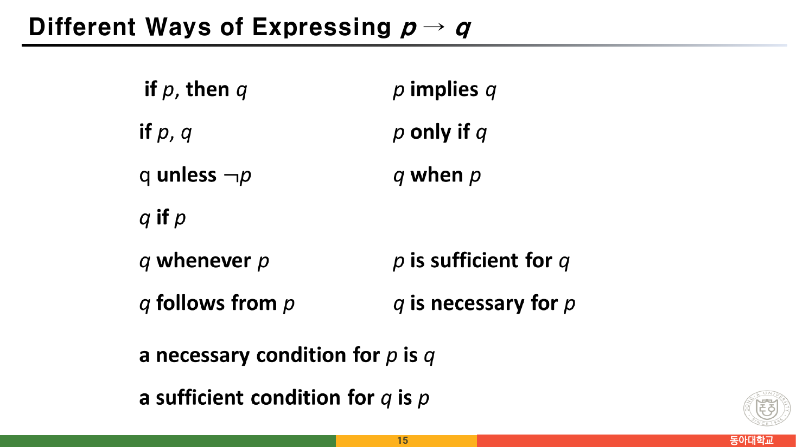
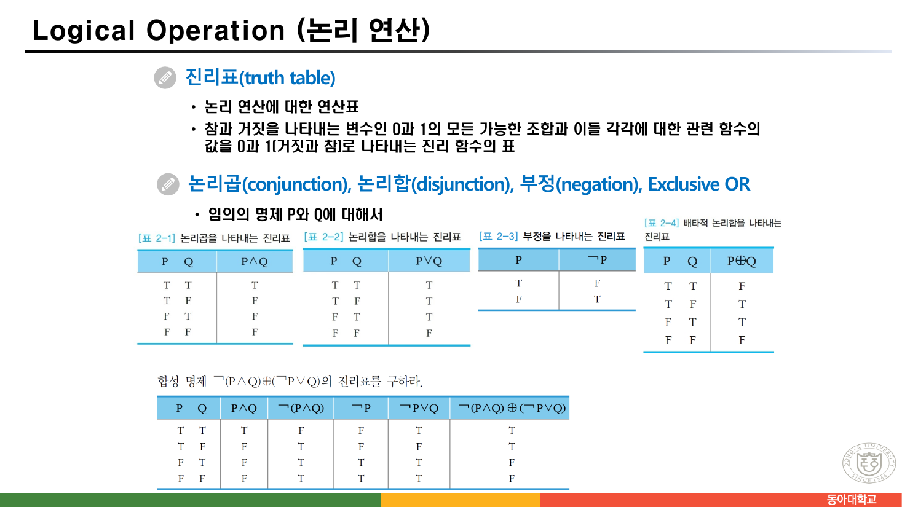
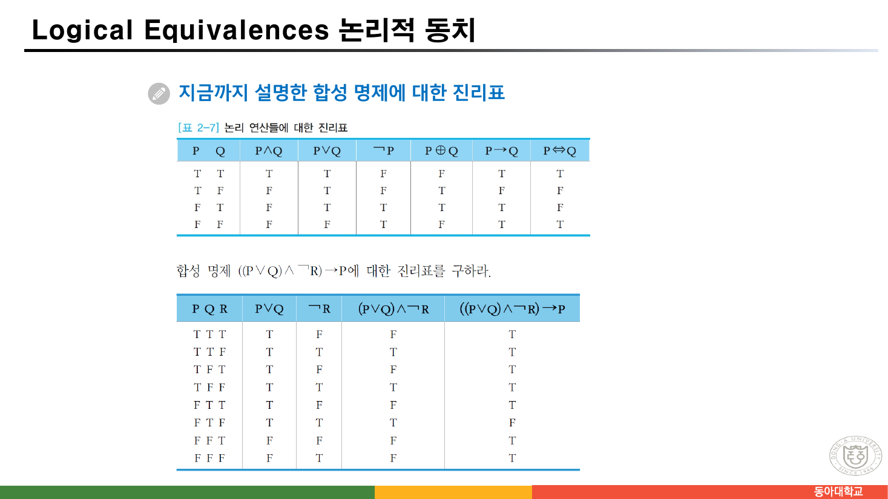
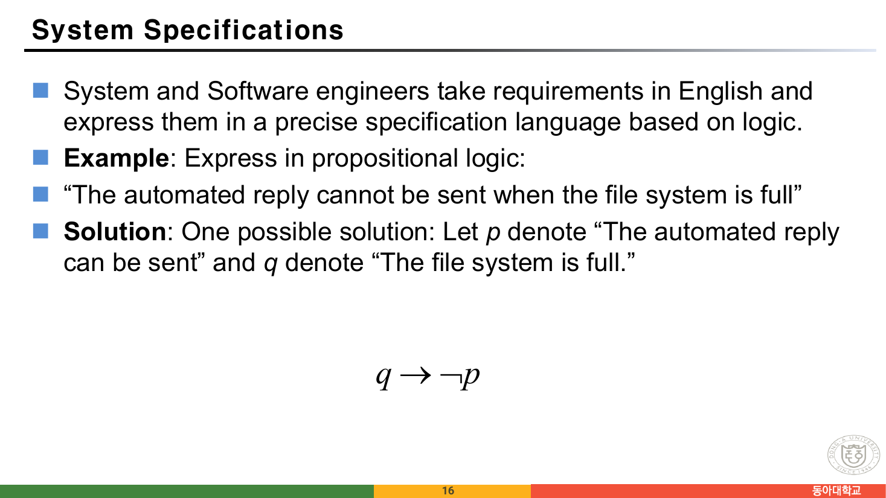
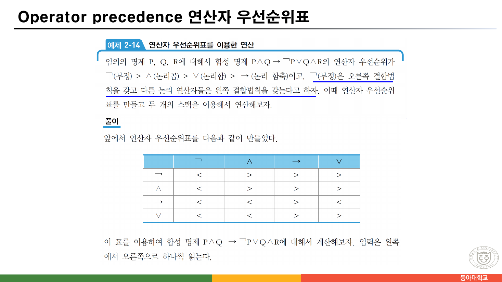
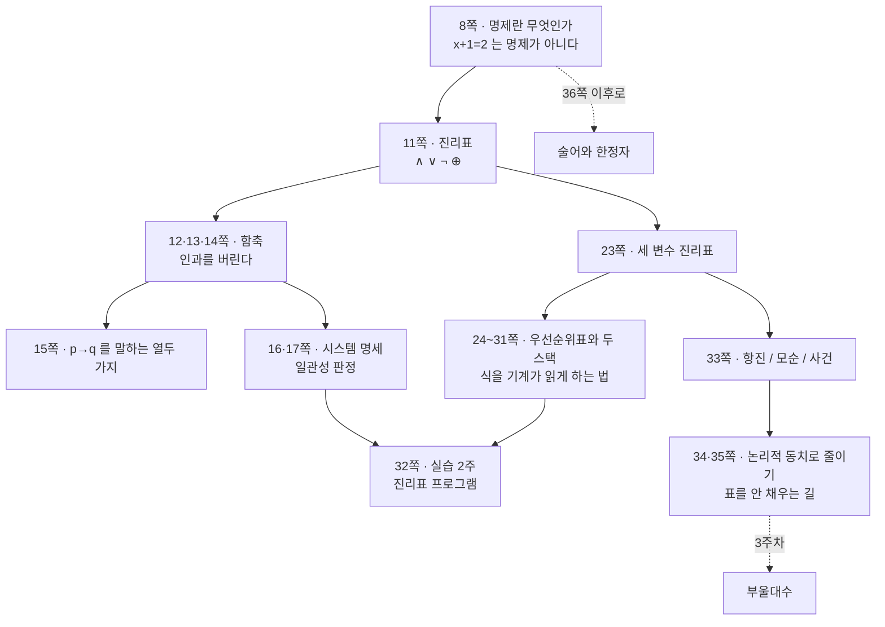

> [!abstract] 이 절이 실제로 하는 말
> 91쪽짜리 자료의 앞 35쪽은 명제 논리를 다룬다. 그 35쪽을 관통하는 결정은 **13쪽 한 문단**에 적혀 있다.
>
> > 수학적 논리에서의 논리 함축 P → Q는 **P와 Q가 서로 연관이 없을지라도** 임의의 두 명제를 결합할 수 있다. 왜냐하면 명제에서는 명제의 의미나 구조와 관계없이 **오직 명제들의 진리값만을** 다루기 때문이다.
>
> 의미를 버렸으니 남는 것은 진리값뿐이고, 진리값뿐이니 **모든 판단은 표를 채우는 일**이 된다. 그래서 이 절의 실질적인 도착점은 정의도 법칙도 아니라 **32쪽의 실습** — "일반적인 합성 명제에 대해 진리표를 구하는 프로그램을 작성하라. (2주)" — 이고, 24~31쪽의 여덟 쪽이 통째로 **그 프로그램을 짜는 데 필요한 도구**(연산자 우선순위표와 두 개의 스택)에 쓰인다.
>
> 이 정리는 그 순서를 따라간다. 무엇을 버렸는지 → 그래서 무엇이 남는지 → 그것을 기계에게 시키려면 무엇이 더 필요한지.

---

## 먼저, 무엇이 명제가 아닌가

8쪽은 명제를 정의하는 대신 **명제가 아닌 것**을 넷 든다.

| 명제인 것 | 명제가 아닌 것 |
| --- | --- |
| The Moon is made of green cheese. | Sit down! |
| Trenton is the capital of New Jersey. | What time is it? |
| Toronto is the capital of Canada. | **x + 1 = 2** |
| 1 + 0 = 1 | **x + y = z** |
| 0 + 0 = 2 | |

왼쪽 열에 `0 + 0 = 2` 와 "달은 초록 치즈로 되어 있다"가 들어 있는 것이 중요하다. **명제는 참일 필요가 없다.** 참이거나 거짓이기만 하면 된다.

오른쪽 열의 앞 둘은 쉽다 — 명령문과 의문문에는 진리값이 없다. 문제는 뒤의 둘이다. `x + 1 = 2` 는 평서문이고 참·거짓을 물을 수 있을 것 같은데, 명제가 아니다. **`x` 가 무엇인지 정해지지 않았기 때문**이다.

이 두 줄이 이 자료의 후반부(36쪽 이후, 술어 논리)를 예고한다. 명제 논리는 `x + 1 = 2` 를 다룰 수 없고, 그것을 다루려면 술어와 한정자가 필요하다. 그 이야기는 [다음 글](<./03. 논증을 기계에게 넘기려면.md>)에서 이어진다.

7쪽은 어휘를 정리한다.

- **진리값(truth value)** — 참과 거짓. `T`(또는 1), `F`(또는 0)
- **명제 변수(propositional variable)** — 진리값이 아직 밝혀지지 않은 임의의 명제. `P`, `Q`, `R`, …
- **합성 명제** — 주어진 명제들을 합성하여 새로운 명제를 만드는 것

---

## 버린 것 — 함축과 인과

12쪽이 함축의 정의를 준다.

> 논리 함축 P → Q의 진리값은 **P가 참이고 Q가 거짓일 경우에만 거짓**이 되고, 그 이외의 경우에는 모두 참이 된다.
> — 원본 12쪽

이 정의가 이상하게 느껴지는 지점은 언제나 같다. **P가 거짓이면 Q가 무엇이든 참**이라는 부분. 12쪽은 그 자리를 자연어의 예 하나로 부드럽게 지나간다 — "비가 오면 우산을 가지고 간다".

그런데 13·14쪽은 그 부드러움을 걷어낸다.

> 자연 언어에서는 "오늘 비가 오면, 야구 경기는 연기한다"라는 것은 가정과 결론 사이의 **인과 관계**를 나타내지만, 수학적 논리에서의 논리 함축 P → Q는 P와 Q가 **서로 연관이 없을지라도** 임의의 두 명제를 결합할 수 있다.
> — 원본 13쪽

그리고 14쪽은 아예 웃기는 예를 셋 든다.

> These implications are perfectly fine, but would not be used in ordinary English.
>
> - "If the moon is made of green cheese, then I have more money than Bill Gates."
> - "If the moon is made of green cheese then I'm on welfare."
> - "If 1 + 1 = 3, then your grandma wears combat boots."
> — 원본 14쪽

세 문장 모두 **참**이다. 앞부분이 거짓이므로. 그리고 첫 두 문장은 결론이 서로 모순인데도 둘 다 참이다 — 빌 게이츠보다 부자이면서 동시에 생활보호 대상자일 수는 없지만, 함축으로는 문제가 없다.

이것이 이 절 전체를 결정하는 거래다. **인과를 포기하는 대신, 계산 가능성을 얻는다.** 진리값 두 개만 다루면 되므로, 아무리 복잡한 합성 명제라도 유한한 표로 판정이 끝난다.

### 그러면 자연어는 어떻게 옮기는가

15쪽은 `p → q` 를 말하는 열두 가지 영어 표현을 한 쪽에 몰아 놓는다.



| 왼쪽 열 | 오른쪽 열 |
| --- | --- |
| if *p*, then *q* | *p* implies *q* |
| if *p*, *q* | *p* only if *q* |
| *q* unless ¬*p* | *q* when *p* |
| *q* if *p* | |
| *q* whenever *p* | *p* is sufficient for *q* |
| *q* follows from *p* | *q* is necessary for *p* |
| a necessary condition for *p* is *q* | |
| a sufficient condition for *q* is *p* | |

이 표에서 반드시 걸리는 줄이 둘이다.

**`p only if q`.** "p인 경우에만 q"라고 읽으면 `q → p` 로 뒤집게 된다. 실제로는 `p → q` 다. `only if` 는 **q가 필요조건**임을 말한다 — p가 성립하려면 q가 반드시 있어야 한다. 그래서 같은 표의 `q is necessary for p` 와 짝을 이룬다.

**`q unless ¬p`.** unless는 "~가 아니라면"이므로 `¬(¬p) → q`, 즉 `p → q`. 이중 부정이 겹쳐 있어 가장 읽기 어려운 줄이다.

이 두 줄이 20쪽 예제에서 곧바로 쓰인다.

> "You can access the Internet from campus **only if** you are a computer science major **or** you are not a freshman."
> → `a → (c ∨ ¬f)`
> — 원본 20쪽

`only if` 가 있으므로 화살표는 `a` 에서 나간다. 자연어의 순서와 화살표의 방향이 어긋나는 자리다.

---

## 남은 것 — 표를 채우는 일

11쪽이 네 연산자의 진리표를 나란히 놓는다.



그리고 같은 쪽 아래에서 첫 합성 명제를 계산한다 — `¬(P∧Q) ⊕ (¬P∨Q)`.

| P | Q | P∧Q | ¬(P∧Q) | ¬P | ¬P∨Q | ¬(P∧Q) ⊕ (¬P∨Q) |
| --- | --- | --- | --- | --- | --- | --- |
| T | T | T | F | F | T | **T** |
| T | F | F | T | F | F | **T** |
| F | T | F | T | T | T | **F** |
| F | F | F | T | T | T | **F** |

23쪽은 세 변수짜리로 넘어간다 — `((P∨Q) ∧ ¬R) → P`.



| P | Q | R | P∨Q | ¬R | (P∨Q)∧¬R | ((P∨Q)∧¬R)→P |
| --- | --- | --- | --- | --- | --- | --- |
| T | T | T | T | F | F | T |
| T | T | F | T | T | T | T |
| T | F | T | T | F | F | T |
| T | F | F | T | T | T | T |
| F | T | T | T | F | F | T |
| F | T | F | T | T | T | **F** |
| F | F | T | F | F | F | T |
| F | F | F | F | T | F | T |

여덟 줄 중 **딱 한 줄만 거짓**이다 — `P=F, Q=T, R=F`. 이 한 줄이 왜 이 자리에 있는지 손으로 따라가면 함축의 정의가 몸에 남는다. `Q`가 참이라 `P∨Q`가 참이고, `R`이 거짓이라 `¬R`이 참이니 앞부분이 참인데, `P`가 거짓이라 뒷부분이 거짓이다. **참 → 거짓**, 유일한 거짓 조합.

두 표는 파이썬으로 다시 계산해 원본과 한 칸도 다르지 않음을 확인했다.

### 32쪽 실습을 여기서 돌려 보기

32쪽의 실습은 이렇다.

> 일반적인 합성 명제에 대해 진리표를 구하는 프로그램을 작성하라. **(2주)**
>
> - 명제 변수는 많아야 3개로 제한하고, 논리 연산자도 많아야 4종류만 허용한다
> - 세 개의 명제 P, Q, R이 있고, 논리연산자는 and, or, not, implication 네 가지
> - 단, 현재 우리가 사용하고 있는 논리 연산자의 **우선 순위와 결합 법칙**대로 작성한다
> - 합성 명제 `P∧Q → ¬P∨Q∧R` 에 대해 진리표를 만들라
> — 원본 32쪽

아래가 그 프로그램이다. 원본이 지정한 우선순위(`¬` > `∧` > `∨` > `→`)와 결합법칙(`¬` 는 오른쪽, 나머지는 왼쪽)을 그대로 구현했다. 식을 여러 개 넣으면 **17쪽의 일관성(consistency) 판정**까지 함께 해 준다.

```html preview h=680px
<div style="font-family:system-ui,-apple-system,sans-serif;color:var(--foreground);padding:18px">
  <div style="margin-bottom:10px">
    <label for="fx" style="display:block;font-size:11px;color:var(--muted-foreground);margin-bottom:4px">합성 명제 — 여러 개는 세미콜론(;)으로 구분. 연산자는 <code>~ &amp; | -&gt;</code> 또는 <code>¬ ∧ ∨ →</code></label>
    <input id="fx" value="P & Q -> ~P | Q & R"
      style="width:100%;padding:10px 12px;font-size:15px;font-family:ui-monospace,monospace;border:1px solid var(--border);border-radius:6px;background:var(--card);color:var(--foreground)" />
  </div>
  <div id="pre" style="display:flex;gap:6px;flex-wrap:wrap;margin-bottom:14px"></div>

  <div id="paren" style="font-size:12.5px;color:var(--muted-foreground);font-family:ui-monospace,monospace;margin-bottom:12px;line-height:1.8"></div>

  <div style="overflow-x:auto;border:1px solid var(--border);border-radius:var(--radius,8px);background:var(--card)">
    <table id="tt" style="border-collapse:collapse;width:100%;font-family:ui-monospace,monospace;font-size:13px"></table>
  </div>
  <div id="verdict" style="margin-top:13px;font-size:13px;line-height:1.7;padding:11px 13px;border-radius:6px;border:1px solid var(--border)"></div>
</div>
<script>
(function(){
  var fx=document.getElementById('fx');
  [["P & Q -> ~P | Q & R","32쪽 실습 과제"],
   ["~(P & Q) + (~P | Q)","11쪽"],
   ["(P | Q) & ~R -> P","23쪽"],
   ["P | Q ; ~P ; P -> Q","17쪽 · 일관적"],
   ["P | Q ; ~P ; P -> Q ; ~Q","17쪽 · 비일관적"],
   ["P -> Q ; ~Q -> ~P","대우는 같은 표"]].forEach(function(c){
    var b=document.createElement('button');
    b.innerHTML=c[1]+" <span style='opacity:.55;font-family:ui-monospace,monospace'>"+c[0]+"</span>";
    b.style.cssText="padding:5px 9px;font-size:11px;border-radius:5px;cursor:pointer;border:1px dashed var(--border);background:transparent;color:var(--muted-foreground)";
    b.onclick=function(){ fx.value=c[0]; run(); };
    document.getElementById('pre').appendChild(b);
  });

  // ── 어휘 분석 ─────────────────────────────
  function lex(s){
    s=s.replace(/¬/g,"~").replace(/∧/g,"&").replace(/∨/g,"|").replace(/⊕/g,"+")
       .replace(/→/g,">").replace(/->/g,">").replace(/⇔/g,"=").replace(/<->/g,"=");
    var out=[],i=0;
    while(i<s.length){
      var c=s[i];
      if(/\s/.test(c)){ i++; continue; }
      if(/[A-Za-z]/.test(c)){ out.push({t:"var",v:c.toUpperCase()}); i++; continue; }
      if("~&|+>=()".indexOf(c)>=0){ out.push({t:c}); i++; continue; }
      throw new Error("알 수 없는 기호: " + c);
    }
    return out;
  }
  // 우선순위 (원본 24쪽): ~ > & > | > > (함축) > = (동치). ⊕ 는 | 와 같은 자리에 둔다.
  var PREC={"&":4,"|":3,"+":3,">":2,"=":1};
  function parse(tok){
    var pos=0;
    function peek(){ return tok[pos]; }
    function unary(){
      var t=peek();
      if(!t) throw new Error("식이 갑자기 끝났습니다");
      if(t.t==="~"){ pos++; return {op:"~", a:unary()}; }        // 오른쪽 결합
      if(t.t==="("){ pos++; var e=bin(0); if(!peek()||peek().t!==")") throw new Error("괄호가 닫히지 않았습니다"); pos++; return e; }
      if(t.t==="var"){ pos++; return {v:t.v}; }
      throw new Error("여기에 올 수 없는 기호입니다");
    }
    function bin(min){
      var left=unary();
      while(peek() && PREC[peek().t]!==undefined && PREC[peek().t]>=min){
        var op=peek().t; pos++;
        var right=bin(PREC[op]+1);                                 // 왼쪽 결합
        left={op:op,a:left,b:right};
      }
      return left;
    }
    var e=bin(0);
    if(pos<tok.length) throw new Error("남는 기호가 있습니다");
    return e;
  }
  function vars(n,set){ if(n.v) set[n.v]=1; else { vars(n.a,set); if(n.b) vars(n.b,set); } return set; }
  function evl(n,env){
    if(n.v!==undefined) return env[n.v];
    var a=evl(n.a,env);
    if(n.op==="~") return !a;
    var b=evl(n.b,env);
    switch(n.op){
      case "&": return a&&b;
      case "|": return a||b;
      case "+": return a!==b;
      case ">": return (!a)||b;
      case "=": return a===b;
    }
  }
  function show(n,top){
    if(n.v!==undefined) return n.v;
    if(n.op==="~") return (top?"":"")+"¬"+show(n.a,false);
    var sym={"&":"∧","|":"∨","+":"⊕",">":"→","=":"⇔"}[n.op];
    var s=show(n.a,false)+" "+sym+" "+show(n.b,false);
    return top? s : "("+s+")";
  }

  function run(){
    var tbl=document.getElementById('tt'), vd=document.getElementById('verdict');
    try{
      var parts=fx.value.split(";").map(function(s){return s.trim();}).filter(function(s){return s.length;});
      if(!parts.length) throw new Error("식을 입력하세요");
      var trees=parts.map(function(p){ return parse(lex(p)); });
      var vset={}; trees.forEach(function(t){ vars(t,vset); });
      var vs=Object.keys(vset).sort();
      if(vs.length>4) throw new Error("변수는 4개까지만 표시합니다");

      document.getElementById('paren').innerHTML =
        trees.map(function(t,i){ return "식 "+(i+1)+" 을 우선순위대로 괄호 치면 &nbsp;<b style='color:var(--foreground)'>"+show(t,true)+"</b>"; }).join("<br>");

      var head="<tr>"+vs.map(function(v){return "<th style='padding:7px 12px;border-bottom:1px solid var(--border);text-align:center;color:var(--muted-foreground);font-weight:600'>"+v+"</th>";}).join("")+
        trees.map(function(t,i){return "<th style='padding:7px 14px;border-bottom:1px solid var(--border);border-left:1px solid var(--border);text-align:center'>"+show(t,true)+"</th>";}).join("")+
        (trees.length>1? "<th style='padding:7px 12px;border-bottom:1px solid var(--border);border-left:1px solid var(--border);color:var(--muted-foreground)'>모두 참?</th>":"")+"</tr>";
      var body="", nAll=0, nTrue=0, total=1<<vs.length;
      for(var m=0;m<total;m++){
        var env={};
        vs.forEach(function(v,j){ env[v] = ((m>>(vs.length-1-j))&1)===0; });   // T 를 먼저
        var vals=trees.map(function(t){ return evl(t,env); });
        var all=vals.every(function(x){return x;});
        if(all) nAll++;
        if(vals[0]) nTrue++;
        body+="<tr style='background:"+(all&&trees.length>1?"var(--muted, transparent)":"transparent")+"'>"+
          vs.map(function(v){return "<td style='padding:6px 12px;text-align:center;color:var(--muted-foreground)'>"+(env[v]?"T":"F")+"</td>";}).join("")+
          vals.map(function(x){return "<td style='padding:6px 14px;text-align:center;border-left:1px solid var(--border);font-weight:700;color:"+(x?"var(--chart-2, var(--foreground))":"var(--chart-1)")+"'>"+(x?"T":"F")+"</td>";}).join("")+
          (trees.length>1? "<td style='padding:6px 12px;text-align:center;border-left:1px solid var(--border);font-weight:700'>"+(all?"✔":"")+"</td>":"")+
          "</tr>";
      }
      tbl.innerHTML=head+body;

      vd.style.borderColor="var(--border)";
      if(trees.length>1){
        vd.innerHTML = nAll
          ? "네 식을 <b>동시에 참으로 만드는 대입이 "+nAll+"개</b> 있다 → 이 명세는 <b>일관적(consistent)</b>이다."
          : "<b>어떤 대입으로도 전부 참이 되지 않는다</b> → 이 명세는 <b>비일관적</b>이다.";
        vd.style.borderColor = nAll? "var(--chart-2, var(--border))":"var(--chart-1)";
      } else {
        var kind = nTrue===total? "<b>항진 명제(tautology)</b> — 언제나 참"
                 : nTrue===0? "<b>모순 명제(contradiction)</b> — 언제나 거짓"
                 : "<b>사건 명제(contingency)</b> — 항진도 모순도 아니다";
        vd.innerHTML = total+"줄 중 참인 줄이 "+nTrue+"개다. 33쪽의 분류로는 " + kind + ".";
      }
    }catch(e){
      tbl.innerHTML=""; vd.style.borderColor="var(--chart-1)";
      vd.textContent = "입력을 확인하세요 — " + e.message;
    }
  }
  fx.oninput=run; run();
})();
</script>
```

기본값 `P∧Q → ¬P∨Q∧R` 의 결과를 32쪽이 요구한 대로 옮기면 이렇다. **여덟 줄 중 거짓은 한 줄**(`P=T, Q=T, R=F`)이다.

| P | Q | R | P∧Q | ¬P∨Q∧R | P∧Q → ¬P∨Q∧R |
| --- | --- | --- | --- | --- | --- |
| T | T | T | T | T | T |
| T | T | F | T | F | **F** |
| T | F | T | F | F | T |
| T | F | F | F | F | T |
| F | T | T | F | T | T |
| F | T | F | F | T | T |
| F | F | T | F | T | T |
| F | F | F | F | T | T |

---

## 17쪽 — 함축이 실제로 일하는 자리

16·17쪽은 이 절에서 가장 실용적인 두 쪽이다. 소프트웨어 명세를 논리식으로 옮긴다.



> "The automated reply **cannot** be sent **when** the file system is full"
> p: The automated reply **can** be sent / q: The file system is full
> → **`q → ¬p`**
> — 원본 16쪽

`when` 이 `→` 가 되고, `cannot` 의 부정이 화살표 **오른쪽**에 붙는다. `p` 를 "보낼 수 있다"의 **긍정**으로 잡아 둔 덕분에 부정이 한 번만 나온다 — 명제 변수를 긍정형으로 잡는 것이 이런 번역에서 늘 유리하다.

17쪽은 한 걸음 더 간다. **일관성(consistency)** 이다.

> **정의**: 명제들의 목록이 일관적(consistent)이라는 것은, 각 명제가 모두 참이 되도록 명제 변수에 진리값을 배정하는 것이 가능하다는 뜻이다.
> — 원본 17쪽

예제의 세 명세는 이렇다.

- "The diagnostic message is stored in the buffer or it is retransmitted." → `p ∨ q`
- "The diagnostic message is **not** stored in the buffer." → `¬p`
- "If the diagnostic message is stored in the buffer, then it is retransmitted." → `p → q`

| p | q | p∨q | ¬p | p→q | 모두 참? |
| --- | --- | --- | --- | --- | --- |
| T | T | T | F | T | |
| T | F | T | F | F | |
| **F** | **T** | T | T | T | **✔** |
| F | F | F | T | T | |

**`p=F, q=T` 한 줄뿐**이다. 그래서 일관적이다. 그리고 여기에 "The diagnostic message is not retransmitted"(`¬q`)를 더하면 그 유일한 줄마저 죽는다 — 비일관적. 위 진리표 도구의 프리셋 두 개가 정확히 이 두 경우다.

> [!tip] 왜 이것이 중요한 절인가
> 일관성 판정은 **명세를 만족하는 시스템이 존재할 수 있는가**를 묻는 것이다. 비일관적인 명세는 구현이 게을러서 못 만드는 것이 아니라 **어떤 구현으로도 만족시킬 수 없다.** 그래서 코드를 한 줄도 쓰기 전에 판정할 수 있고, 판정 방법은 (변수가 적다면) 진리표를 다 채워 보는 것이다.
>
> 명제 변수가 $n$ 개면 표는 $2^n$ 줄이다. 이 자료가 32쪽 실습에서 "명제 변수는 많아야 3개"로 제한한 이유가 여기 있다.

---

## 기계에게 시키려면 — 24~31쪽의 여덟 쪽

진리표를 채우는 일 자체는 단순하다. 어려운 것은 **식을 읽는 일**이다. `P∧Q → ¬P∨Q∧R` 에는 괄호가 하나도 없으므로, 어디부터 묶을지를 기계가 알아야 한다.

24쪽이 규칙을 준다.

> 논리 연산자들의 우선 순위: **¬ > ∧ > ∨ > → > ⇔**
> ¬(부정)은 **오른쪽** 결합법칙을, 나머지 연산자들은 **왼쪽** 결합법칙을 갖는다고 하자.
> 그러면 합성 명제 `P∧Q → ¬P∨Q∧R` 에 괄호를 이용해서 표시하면 `(P∧Q) → ((¬P)∨(Q∧R))` 다.
> — 원본 24쪽

그리고 25~31쪽은 이 규칙을 **표**로 바꾼다. 왜 표로 바꾸는가? 스택 두 개(연산자용·피연산자용)로 식을 왼쪽에서 오른쪽으로 한 번만 훑어 계산하려면, "지금 스택 위에 있는 연산자"와 "지금 입력으로 들어온 연산자" 중 **누구를 먼저 처리할지**를 매번 즉시 판정해야 하기 때문이다. 그 판정을 미리 계산해 둔 것이 우선순위표다.



원본이 완성한 표는 이렇다(`>` 는 스택 쪽이 먼저, `<` 는 입력 쪽이 먼저).

| 스택 \\ 입력 | ¬ | ∧ | → | ∨ |
| --- | --- | --- | --- | --- |
| **¬** | < | > | > | > |
| **∧** | < | > | > | > |
| **→** | < | < | > | < |
| **∨** | < | < | > | > |

이 열여섯 칸이 정말 24쪽의 규칙에서 나오는지, 규칙만 가지고 표를 다시 만들어 대조해 보자.

```html preview h=620px
<div style="font-family:system-ui,-apple-system,sans-serif;color:var(--foreground);padding:18px">
  <div style="display:flex;gap:22px;flex-wrap:wrap;align-items:flex-start;margin-bottom:16px">
    <div>
      <div style="font-size:11px;color:var(--muted-foreground);margin-bottom:6px">우선순위 — 위가 강하다. 눌러서 순서를 바꿔 보라</div>
      <div id="order" style="display:flex;flex-direction:column;gap:4px"></div>
    </div>
    <div>
      <div style="font-size:11px;color:var(--muted-foreground);margin-bottom:6px">결합법칙 — 눌러서 바꿀 수 있다</div>
      <div id="assoc" style="display:flex;flex-direction:column;gap:4px"></div>
    </div>
  </div>

  <div style="display:flex;gap:20px;flex-wrap:wrap">
    <div>
      <div style="font-size:12px;font-weight:700;margin-bottom:7px">규칙에서 생성한 표</div>
      <table id="gen" style="border-collapse:collapse;font-family:ui-monospace,monospace;font-size:14px"></table>
    </div>
    <div>
      <div style="font-size:12px;font-weight:700;margin-bottom:7px">원본 29쪽의 표</div>
      <table id="orig" style="border-collapse:collapse;font-family:ui-monospace,monospace;font-size:14px"></table>
    </div>
  </div>
  <div id="cmp" style="margin-top:14px;font-size:13px;line-height:1.7;padding:11px 13px;border-radius:6px;border:1px solid var(--border)"></div>
</div>
<script>
(function(){
  var OPS=["¬","∧","→","∨"];                    // 원본 표의 나열 순서 그대로
  var ORIG={ "¬":{"¬":"<","∧":">","→":">","∨":">"},
             "∧":{"¬":"<","∧":">","→":">","∨":">"},
             "→":{"¬":"<","∧":"<","→":">","∨":"<"},
             "∨":{"¬":"<","∧":"<","→":">","∨":">"} };
  var order=["¬","∧","∨","→"];                  // 원본 24쪽의 우선순위
  var assoc={"¬":"R","∧":"L","∨":"L","→":"L"};  // 원본 24쪽의 결합법칙

  function rank(o){ return order.indexOf(o); }  // 작을수록 강하다
  function cell(stack,input){
    if(stack===input) return assoc[stack]==="R" ? "<" : ">";
    return rank(stack) < rank(input) ? ">" : "<";
  }
  function table(el, get){
    var h="<tr><th style='padding:6px 10px;border:1px solid var(--border);color:var(--muted-foreground);font-size:11px'>스택＼입력</th>"+
      OPS.map(function(o){return "<th style='padding:6px 14px;border:1px solid var(--border)'>"+o+"</th>";}).join("")+"</tr>";
    var b=OPS.map(function(s){
      return "<tr><th style='padding:6px 12px;border:1px solid var(--border);text-align:left'>"+s+"</th>"+
        OPS.map(function(i){
          var v=get(s,i), same = ORIG[s][i]===v;
          return "<td style='padding:6px 16px;border:1px solid var(--border);text-align:center;font-weight:700;color:"+
            (same? "var(--foreground)":"var(--chart-1)")+";background:"+(same?"transparent":"var(--muted, transparent)")+"'>"+v+"</td>";
        }).join("")+"</tr>";
    }).join("");
    el.innerHTML=h+b;
  }
  function draw(){
    var oh=document.getElementById('order'); oh.innerHTML="";
    order.forEach(function(o,i){
      var b=document.createElement('button');
      b.innerHTML=(i+1)+". "+o;
      b.style.cssText="padding:5px 14px;font-size:14px;font-family:ui-monospace,monospace;border-radius:5px;cursor:pointer;border:1px solid var(--border);background:var(--card);color:var(--foreground);text-align:left";
      b.onclick=function(){ if(i>0){ var t=order[i-1]; order[i-1]=order[i]; order[i]=t; draw(); } };
      b.title="위로 올리기";
      oh.appendChild(b);
    });
    var ah=document.getElementById('assoc'); ah.innerHTML="";
    OPS.forEach(function(o){
      var b=document.createElement('button');
      b.innerHTML=o+" : "+(assoc[o]==="R"?"오른쪽":"왼쪽");
      b.style.cssText="padding:5px 14px;font-size:12.5px;border-radius:5px;cursor:pointer;border:1px solid var(--border);background:var(--card);color:var(--foreground);text-align:left";
      b.onclick=function(){ assoc[o]=assoc[o]==="R"?"L":"R"; draw(); };
      ah.appendChild(b);
    });
    table(document.getElementById('gen'), cell);
    table(document.getElementById('orig'), function(s,i){ return ORIG[s][i]; });

    var diff=0;
    OPS.forEach(function(s){ OPS.forEach(function(i){ if(cell(s,i)!==ORIG[s][i]) diff++; }); });
    var c=document.getElementById('cmp');
    c.style.borderColor = diff? "var(--chart-1)":"var(--chart-2, var(--border))";
    c.innerHTML = diff
      ? "<b>"+diff+"칸이 원본과 다르다.</b> 지금 설정은 우선순위 "+order.join(" > ")+" 이다."
      : "<b>열여섯 칸이 모두 일치한다.</b> 원본 29쪽의 표는 24쪽이 정한 규칙(¬ > ∧ > ∨ > →, ¬만 오른쪽 결합)에서 한 칸도 어긋나지 않는다.";
  }
  draw();
})();
</script>
```

처음 화면 그대로 두면 **열여섯 칸이 전부 일치**한다. 규칙 두 줄이 표 하나를 완전히 결정한다는 뜻이고, 그렇다면 표를 손으로 만들 필요도 없다 — 프로그램이 규칙에서 즉석에서 계산하면 된다. 25~31쪽의 일곱 쪽이 손으로 채워 나가는 과정을 보여주는 것은, **그 과정을 코드로 옮기게 하려는 것**이다.

우선순위를 한 칸씩 바꿔 보면 어느 칸이 어느 규칙에서 나왔는지도 드러난다. `∨` 와 `→` 의 순서를 뒤집으면 딱 두 칸이 바뀐다.

> [!note] 표를 읽을 때 걸리는 곳 — 행과 열
> 26쪽은 이렇게 적는다. "이 표에서 **열**에 있는 연산자들은 **스택** 속에 있는 연산자들이고, **행**에 있는 연산자들은 **입력**에 있는 연산자들이다." 그런데 같은 쪽의 그림에서는 화살표가 **표 위쪽 머리글**에 `[행] 입력 연산자`, **표 왼쪽 머리글**에 `[열] 스택 연산자` 로 붙어 있다.
>
> 보통 표에서 위쪽 머리글은 **열**을 이름 짓고 왼쪽 머리글은 **행**을 이름 짓는다. 원본의 표기는 그 반대다. "가로로 늘어선 것을 행이라 부른 것"으로 읽으면 통하지만, `1행 1열` 같은 표현이 뒤따르기 때문에 한 번은 걸린다.
>
> **어느 쪽으로 읽어도 표의 내용은 같다.** 위 도구가 확인해 주듯 열여섯 칸이 규칙과 정확히 맞고, 표는 대각선 대칭이 아니므로 축을 바꾸면 답이 달라진다 — 그래서 이 정리에서는 위 도구의 검증에 따라 **왼쪽 머리글 = 스택, 위쪽 머리글 = 입력**으로 읽었다.

---

## 마지막으로, 표를 안 채우고 끝내는 법

33쪽은 명제를 세 종류로 나눈다.

| 종류 | 정의 | 진리표에서 |
| --- | --- | --- |
| 항진(tautology) 명제 | 항상 참의 진리값을 가지는 명제 | 결과 열이 전부 T |
| 모순(contradiction) 명제 | 항상 거짓의 진리값을 가지는 명제 | 결과 열이 전부 F |
| 사건(contingency) 명제 | 항진도 모순도 아닌 명제 | 섞여 있다 |

그리고 34·35쪽은 **표를 채우지 않고** 식을 줄이는 법을 보인다. 논리적 동치를 이용한 대수적 변형이다. 35쪽 예제가 그 정점이다.

$$[(A \to B) \lor (A \to D)] \to (B \lor D)$$

아홉 단계를 거쳐 이렇게 줄어든다.

| 단계 | 식 | 근거 |
| --- | --- | --- |
| | `[(A→B)∨(A→D)]→(B∨D)` | |
| 1 | `[(¬A∨B)∨(¬A∨D)]→(B∨D)` | 18 (함축의 정의) |
| 2 | `[(¬A∨¬A)∨(B∨D)]→(B∨D)` | 5, 3 (교환·결합) |
| 3 | `[¬A∨(B∨D)]→(B∨D)` | 1 (멱등) |
| 4 | `¬[¬A∨(B∨D)]∨(B∨D)` | 18 |
| 5 | `[¬(¬A)∧¬(B∨D)]∨(B∨D)` | 7 (드 모르간) |
| 6 | `[A∧¬(B∨D)]∨(B∨D)` | 17 (이중 부정) |
| 7 | `[A∨(B∨D)]∧[¬(B∨D)∨(B∨D)]` | 10 (분배) |
| 8 | `(A∨B∨D)∧1` | 15 (보원) |
| 9 | **`A∨B∨D`** | 12 (항등) |

세 변수라 진리표는 여덟 줄뿐이지만, 변수가 열 개면 1024줄이다. **대수적 변형은 표가 감당 못 하는 크기를 다루는 길**이고, 그래서 3주차 학습목표가 "부울대수"인 것이다.

이 등식이 정말 성립하는지는 진리표로 확인할 수 있다. 위 진리표 도구에 `(A -> B) | (A -> D) -> B | D ; A | B | D` 를 넣으면 두 열이 여덟 줄 내내 같다. 파이썬으로도 여덟 조합을 모두 대조했다.

한 줄로 확인하는 방법도 있다. `A` 가 거짓이면 앞부분 `(A→B)∨(A→D)` 는 참이 되므로 전체는 `B∨D` 와 같아지고, `A` 가 참이면 앞부분이 `B∨D` 가 되어 `(B∨D)→(B∨D)`, 즉 항상 참이다. 두 경우를 합치면 `A∨B∨D`.

---

## 이 절의 지도



---

## 원본에서 걸리는 곳

> [!note] 9쪽 — 연산자 목록에 연산자가 아닌 것이 섞여 있다
> 9쪽의 제목 줄은 **"논리 연산자(and, or, not, exclusive or, imply, equal)"** — 여섯 개다. 그런데 바로 아래 항목 목록은 열 개다.
>
> `논리곱` `논리합` `부정` `배타적 논리합` `논리 함축` — 여기까지는 연산자다. 그 다음이 `전제(premise)` `결론(conclusion)` `역(converse)` `대우(contraposition)` `이(inverse)` `동치(equivalence, ⇔)` 다.
>
> **전제·결론·역·대우·이는 연산자가 아니다.** 전제와 결론은 함축의 두 자리를 부르는 이름이고, 역·이·대우는 하나의 함축에서 만들어 낸 **다른 함축**의 이름이다. 같은 목록에 나란히 두면 `¬` 같은 기호가 따로 있는 것처럼 읽힌다. 13쪽이 역·이·대우를 다시 제대로 정의하므로 실질적인 오해는 오래가지 않지만, 9쪽만 떼어 보면 헷갈리는 배치다.

---

## 근거 자료

- `sources/수학적 모델과 논리.pdf` — 1~35쪽 (전체 91쪽 중 명제 논리 부분)
  - 11쪽 · 네 연산자의 진리표 (인용: `ch02-p11`)
  - 15쪽 · p→q의 열두 가지 표현 (인용: `ch02-p15`)
  - 16쪽 · 시스템 명세 `q → ¬p` (인용: `ch02-p16`)
  - 23쪽 · 종합 진리표와 세 변수 예제 (인용: `ch02-p23`)
  - 29쪽 · 연산자 우선순위표 (인용: `ch02-p29`)
  - 4·6~10·12~14·17·19·20·22·24~28·30~35쪽 — 본문의 인용문과 표에 반영
- 본문의 진리표 세 개(11쪽 `¬(P∧Q)⊕(¬P∨Q)`, 23쪽 `((P∨Q)∧¬R)→P`, 32쪽 `P∧Q→¬P∨Q∧R`)와 17쪽 일관성 예제, 35쪽 아홉 단계 변형의 최종 결과는 **파이썬으로 모두 계산해 원본과 대조**했다. 한 칸도 다르지 않았다
- 29쪽 우선순위표의 열여섯 칸은 24쪽이 정한 규칙에서 다시 생성해 대조했으며, 그 대조 자체가 위 인터랙티브다
- 진리표 계산기는 원본 32쪽 실습이 요구하는 사양(변수 3개, 연산자 4종, 지정된 우선순위와 결합법칙)을 그대로 구현한 것이다. ⊕ 와 ⇔ 는 11쪽과 22쪽을 확인할 수 있도록 덧붙였다

## 이어지는 글

- [01. 연속을 유한한 기록으로 접는 순간](<./01. 연속을 유한한 기록으로 접는 순간.md>) — 이산수학 소개
- [03. 논증을 기계에게 넘기려면](<./03. 논증을 기계에게 넘기려면.md>) — 같은 자료 36~91쪽
