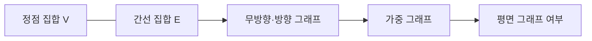

그래프는 정점과 간선으로 대상 사이의 연결을 표현한다. 두 그래프 PDF는 기본 개념, 여러 가지 그래프, 평면 그래프를 중심으로 구성된다. 두 파일의 동일한 장은 하나의 흐름으로 합쳤다.



<Tabs>
  <Tab label="기본">정점, 간선, 인접, 차수와 경로를 구분한다.</Tab>
  <Tab label="유형">방향·무방향, 단순·다중, 가중 그래프를 조건과 함께 비교한다.</Tab>
  <Tab label="평면">간선 교차 없이 평면에 그릴 수 있는지 판단한다.</Tab>
</Tabs>

| 용어 | 핵심 |
| --- | --- |
| 정점 | 관계의 대상을 나타내는 점 |
| 간선 | 두 정점 사이 연결 |
| 경로 | 연속된 간선으로 이동하는 순서 |
| 차수 | 정점에 연결된 간선 수 |

```html preview
<div style="font-family:system-ui,sans-serif;padding:20px;color:var(--foreground)">
<label for="amt" style="font-size:14px;font-weight:600">그래프 절</label>
<div id="out" style="font-size:30px;font-weight:700;color:var(--chart-1);margin:6px 0">1절</div>
<input id="amt" type="range" min="1" max="3" step="1" value="1" style="width:100%;accent-color:var(--primary)" />
<p style="font-size:13px;color:var(--muted-foreground)">원본 장·절 순서를 움직여 현재 개념 묶음을 확인한다.</p>
<script>
var amt=document.getElementById('amt'); var out=document.getElementById('out');
amt.addEventListener('input',function(){out.textContent=Number(amt.value).toLocaleString()+'절';});
</script>
</div>
```

> [!CAUTION]
> 방향 그래프에서는 간선의 출발·도착 방향이 차수와 경로 해석을 바꾼다. 무방향 그래프의 인접 개념을 그대로 복사하지 않는다.

<details>
<summary>다음 장과 연결</summary>

그래프의 경로와 가중치는 Floyd–Warshall 최단 경로 알고리즘으로, 정점의 인접 조건은 Welch–Powell 색칠로 이어진다.

</details>

<!-- source: duplicated graph decks consolidated; graph concepts and planar section preserved -->