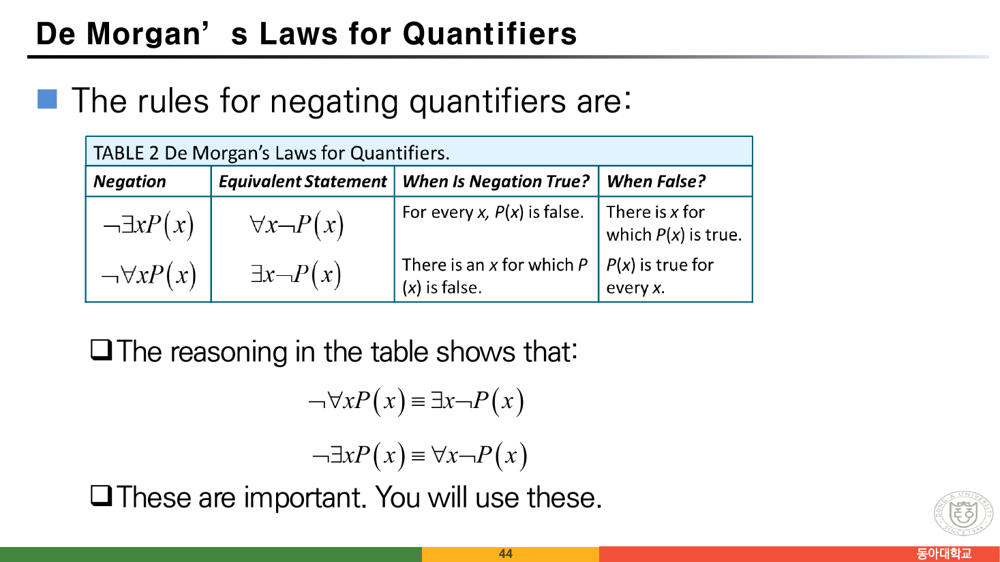
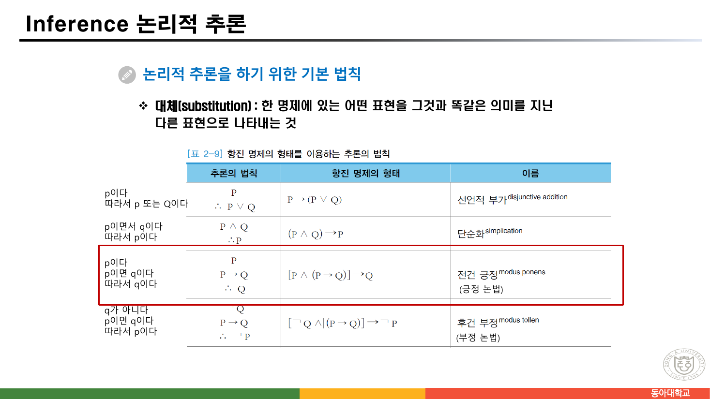
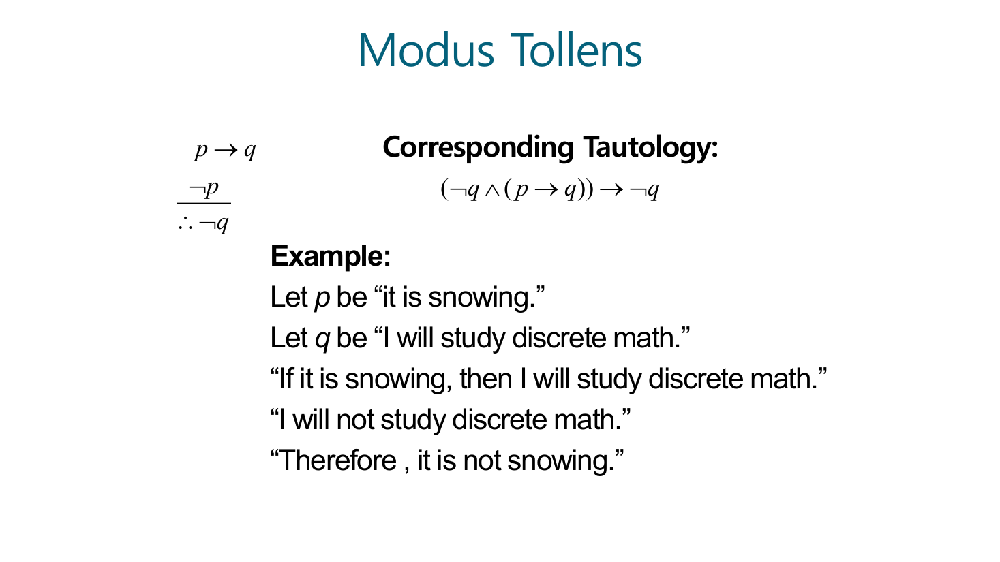
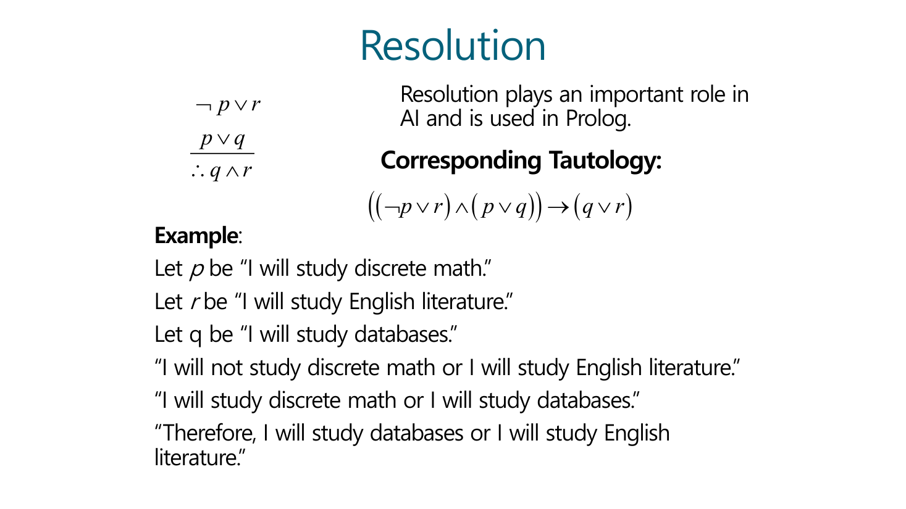
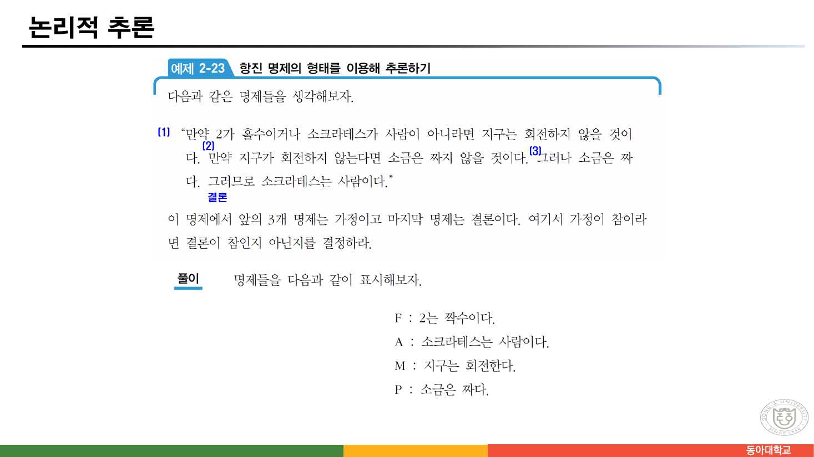
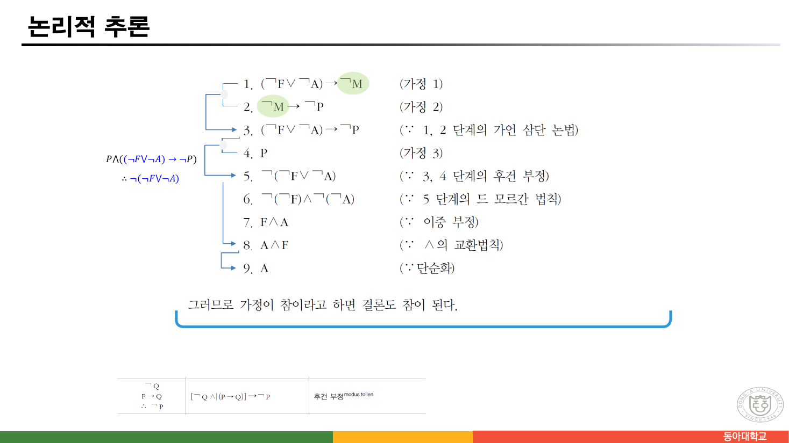
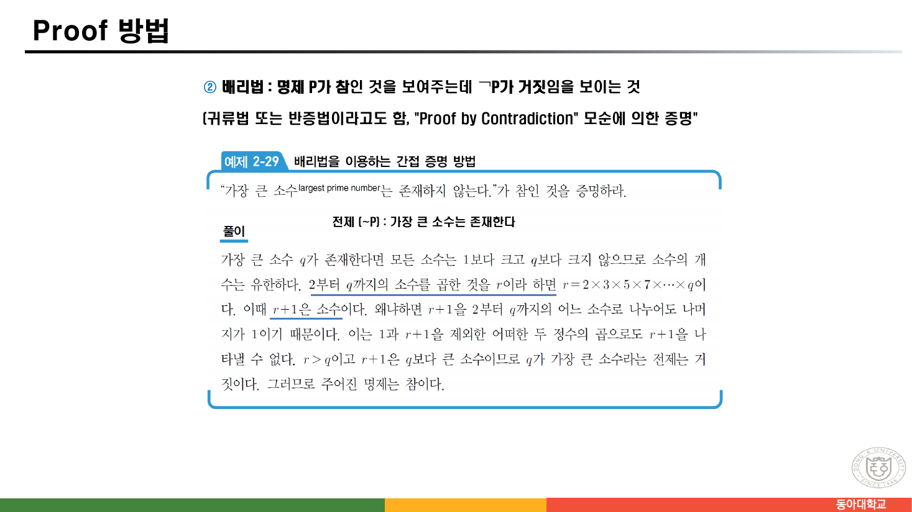
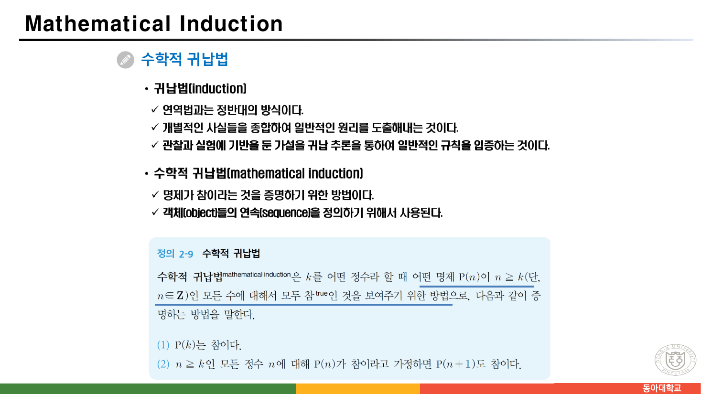
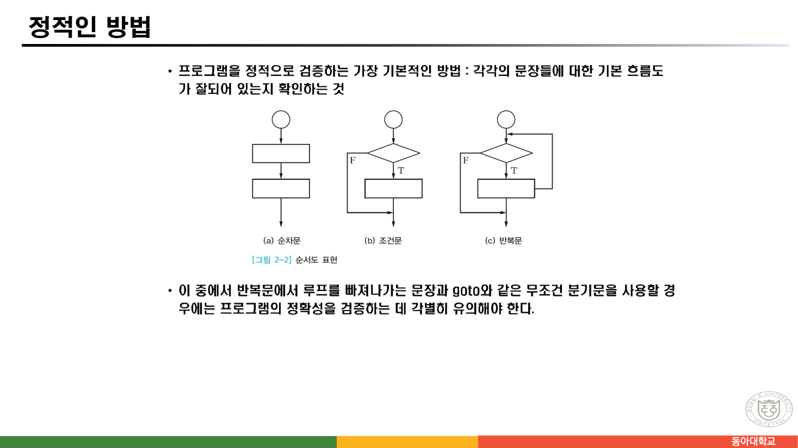
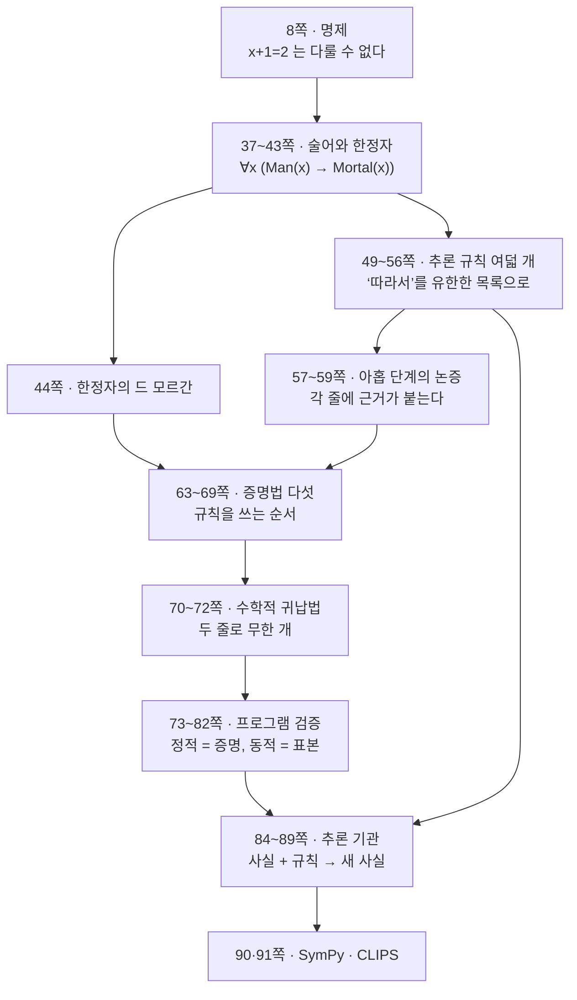

> [!abstract] 이 절이 실제로 하는 말
> 91쪽 자료의 뒤쪽 절반(36~91쪽)은 겉으로는 다섯 덩어리다 — 술어와 한정자, 추론 규칙, 증명 방법, 프로그램 검증, 지식 베이스 시스템. 목차 번호로는 2.2·2.3·2.4에 걸쳐 있어서 서로 다른 주제처럼 보인다.
>
> 그런데 순서대로 놓고 보면 **한 방향**이다. 사람이 머릿속에서 하던 논증을, 한 칸씩 기계가 할 수 있는 형태로 옮겨 놓는다.
>
> 1. 문장 안의 변수를 다룰 수 있게 한다 (술어와 한정자)
> 2. "따라서"를 **유한한 개수의 규칙**으로 바꾼다 (추론 규칙)
> 3. 그 규칙들을 어떤 순서로 적용할지 절차로 만든다 (증명 방법)
> 4. 같은 일을 프로그램에 한다 (프로그램 검증)
> 5. 사실과 규칙을 저장해 두고 기계가 돌리게 한다 (추론 기관)
>
> 그리고 마지막 두 쪽이 `Appendix — SymPy` 와 `Appendix — CLIPS` 다. **소프트웨어 이름 두 개로 끝난다.** 이 절이 어디를 향하고 있었는지를 마지막 쪽이 말해 준다.

---

## 1. 명제 논리로는 소크라테스를 다룰 수 없다

[앞 절](<./02. 함축은 인과가 아니다.md>)의 8쪽은 `x + 1 = 2` 가 **명제가 아니라고** 못 박았다. `x` 가 정해지지 않았으므로 참·거짓을 말할 수 없다.

48쪽은 그 제약이 얼마나 답답한지를 고전적인 예로 보인다.

> 모든 사람은 죽는다 / 소크라테스는 사람이다 / **따라서 소크라테스는 죽는다**

이 논증은 누가 봐도 타당하다. 그런데 명제 논리로 옮기면 세 명제 `A`, `B`, `C` 가 되고, **셋 사이에 아무 관계도 없다.** `A ∧ B → C` 는 항진 명제가 아니다. "모든 사람"의 `모든` 과, 소크라테스가 그 "모든" 안에 들어간다는 사실이 기호에서 사라졌기 때문이다.

48쪽이 제시하는 해법은 이렇다.

$$\frac{\forall x\,(\mathrm{Man}(x) \to \mathrm{Mortal}(x)) \qquad \mathrm{Man}(\text{Socrates})}{\therefore\ \mathrm{Mortal}(\text{Socrates})}$$

명제 하나가 **술어와 개별 변수와 한정자**로 쪼개졌다. 이제 문장 안이 들여다보인다.

### 술어 — 문장에 구멍을 낸다

37쪽의 정의는 이렇다.

> "$x$ is tall."이라는 문장에서 $x$를 변수라고 하고 tall을 술어라고 한다. (…) `T(x)` 라고 표현할 수 있는데 여기서 `T` 를 술어라 하고 `x` 를 **개별 변수(individual variable)** 라 한다.
> — 원본 37쪽

40쪽은 이것을 함수처럼 다룬다.

> `P(x)` 가 "x > 0"을 나타내고 정의역이 정수라 하자.
>
> - `P(-3)` is **false**
> - `P(0)` is **false**
> - `P(3)` is **true**
> — 원본 40쪽

`P` 자체는 명제가 아니다. **값을 넣으면 명제가 된다.** 그래서 원본은 이것을 `propositional function`(명제 함수)이라 부른다.

38쪽이 술어를 명제로 되돌리는 두 가지 길을 정리한다.

- 개별 변수를 **한 개의 값으로** 한정한다 → `P(3)`
- 개별 변수를 **한정자로** 한정한다 → `∀x P(x)`, `∃x P(x)`

### 한정자 셋

41쪽은 한정자를 셋 든다. 보통 교재가 둘만 드는데 여기서는 유일 한정자까지 넣었다.

| 기호 | 이름 | 읽는 법 | 뜻 |
| --- | --- | --- | --- |
| `∀` | 전체 한정자 | "임의의", "모든" | x의 모든 값들에 대해서 P(x)는 참이다 |
| `∃` | 존재 한정자 | "어떤", "적어도 하나에 대해서" | P(x)가 참이 되는 x의 값이 존재한다 |
| `∃!` | 유일 한정자 | "~에 대한 유일한 x가 존재한다" | P(x)가 참이 되는 x의 값이 유일하게 존재한다 |

44쪽은 이 절에서 실제로 가장 많이 쓰게 되는 두 줄을 준다.



$$\lnot\forall x\,P(x) \equiv \exists x\,\lnot P(x) \qquad\qquad \lnot\exists x\,P(x) \equiv \forall x\,\lnot P(x)$$

원본의 표가 이것을 말로 풀어 둔 것이 좋다.

| 부정 | 동치인 문장 | 부정이 참일 때 | 거짓일 때 |
| --- | --- | --- | --- |
| `¬∃x P(x)` | `∀x ¬P(x)` | 모든 x에 대해 P(x)가 거짓이다 | P(x)가 참인 x가 있다 |
| `¬∀x P(x)` | `∃x ¬P(x)` | P(x)가 거짓인 x가 하나 있다 | 모든 x에 대해 P(x)가 참이다 |

그리고 슬라이드는 한 줄을 덧붙인다 — **"These are important. You will use these."**

실제로 이 두 줄은 곧바로 69쪽에서 쓰인다. `∀x P(x)` 를 반박하려면 `∃x ¬P(x)` 를 보이면 되고, 그 `x` 를 **반례**라 부른다.

> [!note] 43·46쪽 — 서로 다른 세 단어가 나란히 놓인다
> 이 자료의 41~46쪽에는 비슷하게 생긴 말이 셋 나온다.
>
> | 쪽 | 슬라이드의 표현 | 실제로 가리키는 것 |
> | --- | --- | --- |
> | 41·43 | **quantifier** (한정자) | `∀`, `∃`, `∃!` — 논리학의 한정자 |
> | 43 (오른쪽 위) | "C#, 접근 한정자 (**Access quantifier**)" | C#의 `public`/`private` — 영어 원어는 access **modifier** |
> | 46 | **qualifier** (수식어) | `A.C.F` 같은 이름의 한정 표기 |
>
> 43쪽의 `Access quantifier` 는 **영어 표기가 잘못되었다.** 한국어 마이크로소프트 문서가 access modifier를 "액세스 한정자"로 옮기기 때문에, 한국어 "한정자"를 영어로 되돌리면서 quantifier가 되어 버린 것으로 보인다. 논리학의 quantifier와 C#의 modifier는 이름만 겹칠 뿐 다른 개념이다.
>
> 46쪽의 `qualifier`(수식어)는 또 다른 것이다. 레코드 `A` 안에 `B`·`C`가 있고 `C` 안에 `F`가 있을 때, `F` 를 `A, C, F` 로 부르는 것이 **완전 수식어**, 그냥 `F` 로 부르는 것이 **부분 수식어**다. 이것은 이름의 모호함을 없애는 장치이지 한정자가 아니다 — 오히려 [1장](<./01. 연속을 유한한 기록으로 접는 순간.md>)의 "동아대 / 동아대학교 / Dong-A University를 웹에서 어떻게 식별할까"와 같은 문제다.
>
> 세 개념이 세 쪽 안에 붙어 있고 한국어 이름이 둘씩 겹치므로, 읽을 때 **기호(`∀`, `∃`)가 나오는 쪽만 한정자**라고 붙들고 가는 편이 안전하다.

---

## 2. "따라서"를 유한한 규칙으로

49·50쪽(한국어)과 51~56쪽(영어)이 같은 내용을 두 번 다룬다. 한국어 쪽은 표로 여덟 개, 영어 쪽은 한 쪽에 하나씩 여섯 개다.



핵심 착상은 표의 가운데 열에 있다 — **`항진 명제의 형태`**. 추론 규칙은 마법이 아니라, **대응하는 항진 명제 하나**를 다르게 적은 것이다. 예를 들어 "p이고 p→q이면 q" 라는 규칙은 `[P ∧ (P→Q)] → Q` 라는 항진 명제와 같은 말이다.

그래서 어떤 추론이 타당한지는 **진리표로 판정할 수 있다.** 아래에서 원본에 실린 여섯 규칙을 하나씩 검사해 보라.

```html preview h=680px
<div style="font-family:system-ui,-apple-system,sans-serif;color:var(--foreground);padding:18px">
  <div id="rules" style="display:flex;gap:7px;flex-wrap:wrap;margin-bottom:16px"></div>

  <div style="display:grid;grid-template-columns:repeat(auto-fit,minmax(300px,1fr));gap:12px">
    <div style="border:1px solid var(--border);border-radius:var(--radius,8px);background:var(--card);padding:15px">
      <div style="font-size:11px;letter-spacing:.04em;color:var(--muted-foreground);margin-bottom:9px">원본 슬라이드에 적힌 형태</div>
      <div id="formA" style="font-family:ui-monospace,monospace;font-size:15px;line-height:2"></div>
      <div id="tautA" style="font-family:ui-monospace,monospace;font-size:12.5px;color:var(--muted-foreground);margin-top:8px"></div>
      <div id="verdA" style="margin-top:11px;font-size:13px;font-weight:700"></div>
      <div id="cexA" style="margin-top:5px;font-size:12px;color:var(--muted-foreground);font-family:ui-monospace,monospace"></div>
    </div>
    <div style="border:1px solid var(--border);border-radius:var(--radius,8px);background:var(--card);padding:15px">
      <div style="font-size:11px;letter-spacing:.04em;color:var(--muted-foreground);margin-bottom:9px">교과서의 표준 형태</div>
      <div id="formB" style="font-family:ui-monospace,monospace;font-size:15px;line-height:2"></div>
      <div id="tautB" style="font-family:ui-monospace,monospace;font-size:12.5px;color:var(--muted-foreground);margin-top:8px"></div>
      <div id="verdB" style="margin-top:11px;font-size:13px;font-weight:700"></div>
    </div>
  </div>

  <div style="margin-top:14px;overflow-x:auto;border:1px solid var(--border);border-radius:var(--radius,8px);background:var(--card)">
    <table id="tt" style="border-collapse:collapse;width:100%;font-family:ui-monospace,monospace;font-size:12.5px"></table>
  </div>
  <div style="font-size:11px;color:var(--muted-foreground);margin-top:5px">전제가 모두 참인 줄만 굵게 표시했다. 그 줄에서 결론이 거짓이면 규칙은 무효다.</div>
</div>
<script>
(function(){
  var T=true,F=false;
  var RULES=[
    {n:"51쪽 · Modus Ponens", vs:["p","q"],
     A:{prem:["p → q","p"], con:"q", pf:[function(e){return !e.p||e.q;},function(e){return e.p;}], cf:function(e){return e.q;},
        taut:"(q ∧ (p → q)) → q"},
     B:{prem:["p → q","p"], con:"q", pf:[function(e){return !e.p||e.q;},function(e){return e.p;}], cf:function(e){return e.q;},
        taut:"(p ∧ (p → q)) → q"}},
    {n:"52쪽 · Modus Tollens", vs:["p","q"],
     A:{prem:["p → q","¬p"], con:"¬q", pf:[function(e){return !e.p||e.q;},function(e){return !e.p;}], cf:function(e){return !e.q;},
        taut:"(¬q ∧ (p → q)) → ¬q"},
     B:{prem:["p → q","¬q"], con:"¬p", pf:[function(e){return !e.p||e.q;},function(e){return !e.q;}], cf:function(e){return !e.p;},
        taut:"(¬q ∧ (p → q)) → ¬p"}},
    {n:"53쪽 · Hypothetical Syllogism", vs:["p","q","r"],
     A:{prem:["p → q","q → r"], con:"p → r", pf:[function(e){return !e.p||e.q;},function(e){return !e.q||e.r;}], cf:function(e){return !e.p||e.r;},
        taut:"((p → q) ∧ (q → r)) → (p → r)"},
     B:{prem:["p → q","q → r"], con:"p → r", pf:[function(e){return !e.p||e.q;},function(e){return !e.q||e.r;}], cf:function(e){return !e.p||e.r;},
        taut:"((p → q) ∧ (q → r)) → (p → r)"}},
    {n:"54쪽 · Simplification", vs:["p","q"],
     A:{prem:["p ∧ q"], con:"p", pf:[function(e){return e.p&&e.q;}], cf:function(e){return e.p;}, taut:"(p ∧ q) → p"},
     B:{prem:["p ∧ q"], con:"p", pf:[function(e){return e.p&&e.q;}], cf:function(e){return e.p;}, taut:"(p ∧ q) → p"}},
    {n:"55쪽 · Conjunction", vs:["p","q"],
     A:{prem:["p","q"], con:"p ∧ q", pf:[function(e){return e.p;},function(e){return e.q;}], cf:function(e){return e.p&&e.q;}, taut:"(p ∧ q) → (p ∧ q)"},
     B:{prem:["p","q"], con:"p ∧ q", pf:[function(e){return e.p;},function(e){return e.q;}], cf:function(e){return e.p&&e.q;}, taut:"(p ∧ q) → (p ∧ q)"}},
    {n:"56쪽 · Resolution", vs:["p","q","r"],
     A:{prem:["¬p ∨ r","p ∨ q"], con:"q ∧ r", pf:[function(e){return !e.p||e.r;},function(e){return e.p||e.q;}], cf:function(e){return e.q&&e.r;},
        taut:"((¬p ∨ r) ∧ (p ∨ q)) → (q ∨ r)"},
     B:{prem:["¬p ∨ r","p ∨ q"], con:"q ∨ r", pf:[function(e){return !e.p||e.r;},function(e){return e.p||e.q;}], cf:function(e){return e.q||e.r;},
        taut:"((¬p ∨ r) ∧ (p ∨ q)) → (q ∨ r)"}}
  ];
  var cur=1;

  function check(side, vs){
    var n=vs.length, bad=[];
    for(var m=0;m<(1<<n);m++){
      var e={}; vs.forEach(function(v,i){ e[v]=((m>>(n-1-i))&1)===0; });
      if(side.pf.every(function(f){return f(e);}) && !side.cf(e)) bad.push(vs.map(function(v){return v+"="+(e[v]?"T":"F");}).join(", "));
    }
    return bad;
  }

  function draw(){
    var R=RULES[cur];
    Array.prototype.forEach.call(document.getElementById('rules').children,function(b,i){
      b.style.background=(i===cur)?"var(--chart-1)":"var(--card)";
      b.style.color=(i===cur)?"var(--card)":"var(--foreground)";
      b.style.borderColor=(i===cur)?"var(--chart-1)":"var(--border)";
    });
    function render(side,idF,idT,idV,idC){
      document.getElementById(idF).innerHTML =
        side.prem.map(function(p){return "<div>"+p+"</div>";}).join("")+
        "<div style='border-top:1px solid var(--border);padding-top:5px;margin-top:3px'>∴ "+side.con+"</div>";
      document.getElementById(idT).textContent = "대응 항진 명제: " + side.taut;
      var bad=check(side,R.vs);
      var v=document.getElementById(idV);
      v.textContent = bad.length? "무효 — 전제가 참인데 결론이 거짓인 줄이 있다" : "유효 — 전제가 참인 모든 줄에서 결론도 참";
      v.style.color = bad.length? "var(--chart-1)":"var(--chart-2, var(--foreground))";
      if(idC) document.getElementById(idC).textContent = bad.length? "반례: "+bad.join(" / ") : "";
      return bad.length;
    }
    render(R.A,'formA','tautA','verdA','cexA');
    render(R.B,'formB','tautB','verdB',null);

    // 진리표 (원본 형태 기준)
    var vs=R.vs, n=vs.length;
    var head="<tr>"+vs.map(function(v){return "<th style='padding:6px 11px;border-bottom:1px solid var(--border);color:var(--muted-foreground)'>"+v+"</th>";}).join("")+
      R.A.prem.map(function(p){return "<th style='padding:6px 13px;border-bottom:1px solid var(--border);border-left:1px solid var(--border)'>"+p+"</th>";}).join("")+
      "<th style='padding:6px 13px;border-bottom:1px solid var(--border);border-left:1px solid var(--border)'>∴ "+R.A.con+"</th></tr>";
    var body="";
    for(var m=0;m<(1<<n);m++){
      var e={}; vs.forEach(function(v,i){ e[v]=((m>>(n-1-i))&1)===0; });
      var pv=R.A.pf.map(function(f){return f(e);});
      var allp=pv.every(function(x){return x;});
      var cv=R.A.cf(e);
      body+="<tr style='opacity:"+(allp?1:0.42)+"'>"+
        vs.map(function(v){return "<td style='padding:5px 11px;text-align:center;color:var(--muted-foreground)'>"+(e[v]?"T":"F")+"</td>";}).join("")+
        pv.map(function(x){return "<td style='padding:5px 13px;text-align:center;border-left:1px solid var(--border);font-weight:"+(allp?700:400)+"'>"+(x?"T":"F")+"</td>";}).join("")+
        "<td style='padding:5px 13px;text-align:center;border-left:1px solid var(--border);font-weight:700;color:"+
          (allp&&!cv?"var(--chart-1)":(cv?"var(--chart-2, var(--foreground))":"var(--muted-foreground)"))+"'>"+(cv?"T":"F")+"</td></tr>";
    }
    document.getElementById('tt').innerHTML=head+body;
  }
  RULES.forEach(function(R,i){
    var b=document.createElement('button');
    b.textContent=R.n;
    b.style.cssText="padding:6px 11px;font-size:11.5px;border-radius:999px;cursor:pointer;border:1px solid var(--border);background:var(--card);color:var(--foreground)";
    b.onclick=function(){ cur=i; draw(); };
    document.getElementById('rules').appendChild(b);
  });
  draw();
})();
</script>
```

여섯 규칙 중 **셋에서 왼쪽과 오른쪽이 갈린다.**

> [!warning] 원본 오류 ① — 52쪽 Modus Tollens가 논리적 오류를 규칙으로 적었다
> 슬라이드의 규칙 상자는 이렇다.
>
> $$\frac{p \to q \qquad \lnot p}{\therefore\ \lnot q}$$
>
> **이것은 modus tollens가 아니다.** modus tollens는 `p→q` 와 `¬q` 에서 `¬p` 를 얻는다. 슬라이드는 두 번째 전제와 결론을 **서로 바꿔 적었고**, 그렇게 만들어진 형태는 이름이 따로 있는 **부당한 추론** — 전건 부정(denying the antecedent) — 이다.
>
> 반례가 하나 있다. `p = F, q = T`. 그러면 `p→q` 는 참, `¬p` 도 참인데 `¬q` 는 거짓이다. "눈이 오지 않았다. 눈이 오면 이산수학을 공부한다. 따라서 이산수학을 공부하지 않는다" — 눈이 안 와도 공부할 수 있다.
>
> 대응 항진 명제도 함께 어긋나 있다. 슬라이드는 `(¬q ∧ (p → q)) → ¬q` 라고 적는데, 이 식은 **항진 명제이긴 하다** — 다만 `A ∧ B → A` 라는 단순화(54쪽)일 뿐이고 modus tollens와는 아무 관계가 없다. 올바른 것은 `(¬q ∧ (p → q)) → ¬p` 다.
>
> **결정적인 것은 같은 슬라이드 아래쪽의 영어 예문이 정확하다는 점이다.** "I will not study discrete math."(¬q) → "Therefore, it is not snowing."(¬p). 예문은 `¬q` 에서 `¬p` 로 가는데, 그 위의 기호는 `¬p` 에서 `¬q` 로 간다. **한 쪽 안에서 서로 반대다.**
>
> 게다가 **같은 자료 59쪽 아래쪽 표는 이 규칙을 올바르게 적어 두었다** — `¬Q / P→Q / ∴ ¬P`, 이름은 `후건 부정 modus tollen`. 49쪽 표의 기호 열도 마찬가지로 `∴ ¬P` 다. 즉 **한국어 슬라이드는 맞고 영어 슬라이드만 틀렸다.**



> [!warning] 원본 오류 ② — 56쪽 Resolution의 결론이 `∧` 로 적혀 있다
> $$\frac{\lnot p \lor r \qquad p \lor q}{\therefore\ q \color{red}{\land} r}$$
>
> 결론이 `q ∧ r` 이다. 도출(resolution)의 결론은 **`q ∨ r`** 이어야 한다. 반례는 두 개다 — `p=F, q=T, r=F` 와 `p=T, q=F, r=T`.
>
> 이번에도 **같은 쪽의 다른 두 곳이 옳다.** 바로 오른쪽의 대응 항진 명제는 `((¬p ∨ r) ∧ (p ∨ q)) → (q ∨ r)` 로 `∨` 이고, 아래 예문도 "Therefore, I will study databases **or** I will study English literature." 다. 기호 한 글자만 틀렸다.
>
> 이 규칙은 아무 규칙이 아니다. 슬라이드가 직접 적어 두었듯 **"Resolution plays an important role in AI and is used in Prolog."** 도출은 자동 정리 증명의 기본 연산이고, 이 절의 종착지인 추론 기관(87·88쪽)이 실제로 돌리는 것이 이 규칙이다.



> [!note] 원본 오류 ③ — 51쪽 Modus Ponens의 대응 항진 명제
> 규칙 상자(`p→q`, `p` ∴ `q`)는 맞다. 그런데 오른쪽의 대응 항진 명제가 `(q ∧ (p → q)) → q` 로 적혀 있다. 첫 항이 `q` 다. **`p` 여야 한다** — `(p ∧ (p → q)) → q`.
>
> 슬라이드의 식도 항진 명제이기는 하다(`A ∧ B → A` 꼴). 다만 그것은 modus ponens가 아니라 단순화이고, 49쪽 한국어 표는 이 자리를 `[P ∧ (P→Q)] → Q` 로 정확히 적어 두었다.

같은 규칙이 한국어 표에서는 반대 방향으로 어긋난다.

> [!note] 원본 오류 ④ — 49쪽 표의 한국어 설명과 기호가 다르다
> 49쪽 `후건 부정` 행의 왼쪽 한국어 설명은 이렇게 적혀 있다.
>
> > q가 아니다 / p이면 q이다 / **따라서 p이다**
>
> 그런데 같은 행의 기호 열은 `∴ ¬P` 이고, 항진 명제 열도 `→ ¬P` 다. **한국어 설명에서 부정이 빠졌다** — "따라서 p가 아니다"여야 한다. 이 행은 기호가 맞고 말이 틀렸으니, 52쪽(말이 맞고 기호가 틀림)과 정확히 반대 방향의 실수다.
>
> 같은 표에는 사소한 것도 둘 있다. 첫 행의 한국어가 "따라서 p 또는 **Q**이다"로 대소문자가 섞여 있고, 항진 명제 열의 `[¬Q ∧|(P→Q)] → ¬P` 에 **의미 없는 세로줄 `|`** 이 끼어 있다(59쪽 아래 표에도 같은 자국이 남아 있다).

---

## 3. 규칙을 이어 붙이면 증명이 된다

57~59쪽은 규칙 아홉 개를 실제로 이어 붙인다. 예제 2-23이다.



> "만약 2가 홀수이거나 소크라테스가 사람이 아니라면 지구는 회전하지 않을 것이다. 만약 지구가 회전하지 않는다면 소금은 짜지 않을 것이다. 그러나 소금은 짜다. **그러므로 소크라테스는 사람이다.**"
> — 원본 57쪽

기호는 이렇게 정한다.

| 기호 | 명제 |
| --- | --- |
| `F` | 2는 짝수이다 |
| `A` | 소크라테스는 사람이다 |
| `M` | 지구는 회전한다 |
| `P` | 소금은 짜다 |

"2가 홀수"는 `¬F`, "소크라테스가 사람이 아니라면"은 `¬A` 다. 첫 명제는 `(¬F ∨ ¬A) → ¬M`.

59쪽이 아홉 단계를 보인다. 아래에서 한 단계씩 진행해 보라.



```html preview h=600px
<div style="font-family:system-ui,-apple-system,sans-serif;color:var(--foreground);padding:18px">
  <div style="display:flex;gap:9px;align-items:center;margin-bottom:16px;flex-wrap:wrap">
    <button id="prev" style="padding:7px 15px;font-size:13px;border-radius:6px;cursor:pointer;border:1px solid var(--border);background:var(--card);color:var(--foreground)">← 이전</button>
    <button id="next" style="padding:7px 15px;font-size:13px;border-radius:6px;cursor:pointer;border:1px solid var(--chart-1);background:var(--chart-1);color:var(--card)">다음 →</button>
    <button id="all" style="padding:7px 15px;font-size:13px;border-radius:6px;cursor:pointer;border:1px solid var(--border);background:var(--card);color:var(--foreground)">전부 보기</button>
    <span id="pos" style="font-size:12px;color:var(--muted-foreground);font-family:ui-monospace,monospace"></span>
  </div>
  <div id="steps" style="font-family:ui-monospace,monospace;font-size:14px;line-height:1"></div>
  <div id="why" style="margin-top:16px;font-size:13px;line-height:1.75;padding:12px 14px;border-radius:6px;border:1px solid var(--border);min-height:3.6em"></div>
</div>
<script>
(function(){
  var S=[
    {f:"(¬F ∨ ¬A) → ¬M", r:"가정 1", w:"“2가 홀수이거나 소크라테스가 사람이 아니라면 지구는 회전하지 않을 것이다.” <b>F = 2는 짝수이다</b> 이므로 “2가 홀수”는 ¬F 가 된다."},
    {f:"¬M → ¬P", r:"가정 2", w:"“지구가 회전하지 않는다면 소금은 짜지 않을 것이다.”"},
    {f:"(¬F ∨ ¬A) → ¬P", r:"1, 2 단계의 가언 삼단 논법", w:"두 함축을 이어 붙였다 — 53쪽의 <b>hypothetical syllogism</b>. 가운데의 ¬M 이 사라진다."},
    {f:"P", r:"가정 3", w:"“그러나 소금은 짜다.”"},
    {f:"¬(¬F ∨ ¬A)", r:"3, 4 단계의 후건 부정", w:"3단계는 X → ¬P 꼴이고 4단계는 P, 즉 ¬(¬P) 다. <b>후건 부정(modus tollens)</b> 으로 ¬X 를 얻는다. — 52쪽의 기호가 아니라 <b>49·59쪽의 올바른 형태</b>를 써야 이 단계가 성립한다."},
    {f:"¬(¬F) ∧ ¬(¬A)", r:"5 단계의 드 모르간 법칙", w:"부정이 괄호 안으로 들어가면서 ∨ 가 ∧ 로 바뀐다."},
    {f:"F ∧ A", r:"이중 부정", w:"¬(¬X) = X."},
    {f:"A ∧ F", r:"∧ 의 교환법칙", w:"자리를 바꾼다. 다음 단계에서 <b>앞쪽</b>을 떼어 내기 위한 준비다."},
    {f:"A", r:"단순화", w:"54쪽의 <b>simplification</b>. 결론에 도착했다 — <b>소크라테스는 사람이다.</b>"}
  ];
  var k=1;
  function draw(){
    document.getElementById('pos').textContent = k + " / " + S.length + " 단계";
    document.getElementById('steps').innerHTML = S.map(function(s,i){
      var on = i<k;
      return "<div style='display:flex;gap:14px;align-items:baseline;padding:7px 10px;border-radius:5px;opacity:"+(on?1:0.25)+
        ";background:"+(i===k-1?"var(--muted, transparent)":"transparent")+"'>"+
        "<span style='width:1.6em;color:var(--muted-foreground)'>"+(i+1)+".</span>"+
        "<span style='min-width:12em;font-weight:"+(i===k-1?700:400)+";color:"+(i===S.length-1&&on?"var(--chart-2, var(--foreground))":"var(--foreground)")+"'>"+s.f+"</span>"+
        "<span style='font-size:12px;color:var(--muted-foreground)'>("+s.r+")</span></div>";
    }).join("");
    document.getElementById('why').innerHTML = "<b>"+k+"단계</b> · " + S[k-1].w;
  }
  document.getElementById('next').onclick=function(){ if(k<S.length){k++;draw();} };
  document.getElementById('prev').onclick=function(){ if(k>1){k--;draw();} };
  document.getElementById('all').onclick=function(){ k=S.length; draw(); };
  draw();
})();
</script>
```

이 아홉 줄이 이 절 전체의 축소판이다. **"그러므로"가 아홉 번의 규칙 적용으로 분해되었고, 각 줄 옆에 어느 규칙을 썼는지가 적혀 있다.** 사람은 이 논증을 한 번에 "당연하지" 하고 넘길 수 있지만, 기계는 이런 목록으로만 받을 수 있다.

5단계가 특히 중요하다. **후건 부정(modus tollens)** 을 쓴다 — 방금 본 52쪽의 잘못된 형태로는 이 단계를 만들 수 없다. 자료 자체가 자기 슬라이드의 오류를 두 쪽 뒤에서 스스로 반증하는 셈이다.

---

## 4. 규칙을 어떤 순서로 쓸 것인가 — 다섯 가지 증명법

63~69쪽은 증명 방법을 다섯으로 나눈다. `P → Q` 를 증명하는 것이 대부분이라는 전제에서 출발한다.

| # | 방법 | 무엇을 보이면 되나 | 왜 그것으로 충분한가 |
| --- | --- | --- | --- |
| 1 | **vacuous 증명** | `P`가 거짓임만 | `P`가 거짓이면 `P→Q`는 무조건 참 |
| 2 | **trivial 증명** | `Q`가 참임만 | `Q`가 참이면 `P→Q`는 무조건 참 |
| 3 | **직접 증명** | `P`가 참일 때 `Q`도 참임 | 정의 그대로 |
| 4 | **간접 증명** | 대우 / 배리법 / 존재 증명 | 아래 참조 |
| 5 | **반증** | 반례 / 모순 | 명제가 **거짓**임을 보인다 |

1번과 2번이 이 목록에 있는 이유가 흥미롭다. 둘 다 **`P`와 `Q`의 관계를 전혀 보지 않고 끝낸다.** [앞 절](<./02. 함축은 인과가 아니다.md>)에서 함축이 인과를 버렸기 때문에 가능한 증명법이고, 실제로 14쪽의 "If the moon is made of green cheese, then I have more money than Bill Gates"가 vacuous 증명으로 참이 되는 문장이다. **의미를 버린 대가로 얻은 지름길** 두 개가 증명법 목록의 맨 앞에 놓여 있다.

### 65쪽 — 직접 증명 예제

$$6x + 9y = 101 \;\longrightarrow\; x \text{ 또는 } y \text{ 가 정수가 아님}$$

왼쪽을 묶으면 $3(2x + 3y)$ 다. `x`와 `y`가 둘 다 정수라면 좌변은 **3의 배수**여야 한다. 그런데 $101 = 3 \times 33 + 2$ 로 3의 배수가 아니다. 따라서 둘 중 하나는 정수가 아니다.

### 66쪽 — 대우를 이용하는 방법

`P→Q` 와 `¬Q→¬P` 가 논리적으로 동치이므로, 뒤쪽을 증명해도 된다. 슬라이드는 예제로 **완전수** 목록을 붙여 두었다 — `(6, 28, 496, 8128, ....)`.

### 67쪽 — 배리법



원본의 논증을 그대로 옮기면 이렇다.

> **전제 (~P)**: 가장 큰 소수는 존재한다
>
> 가장 큰 소수 $q$가 존재한다면 모든 소수는 1보다 크고 $q$보다 크지 않으므로 소수의 개수는 유한하다. 2부터 $q$까지의 소수를 곱한 것을 $r$이라 하면 $r = 2×3×5×7×⋯×q$이다. 이때 **$r+1$은 소수이다.** 왜냐하면 $r+1$을 2부터 $q$까지의 어느 소수로 나누어도 나머지가 1이기 때문이다. 이는 1과 $r+1$을 제외한 어떠한 두 정수의 곱으로도 $r+1$을 나타낼 수 없다. $r > q$이고 $r+1$은 $q$보다 큰 소수이므로 $q$가 가장 큰 소수라는 전제는 거짓이다.
> — 원본 67쪽

이 논증에는 한 군데 짚고 넘어갈 곳이 있다.

> [!tip] 굵게 표시한 문장을 조심해서 읽어야 하는 이유
> "**$r+1$은 소수이다**"라는 주장은 이 증명 안에서는 성립한다. 다만 **그 근거는 슬라이드가 적은 것만으로는 부족하다.**
>
> 슬라이드가 든 근거는 "2부터 $q$까지의 어느 소수로도 나누어지지 않는다"뿐이다. 이 말이 일반적으로 소수임을 뜻하지는 않는다. 실제로 $2×3×5×7×11×13 + 1 = 30031$ 은 13까지의 어떤 소수로도 나누어지지 않지만 소수가 아니다 — $30031 = 59 × 509$ 다.
>
> 이 증명에서 그 결론이 통하는 이유는 **바로 앞의 가정 때문**이다. "$q$가 가장 큰 소수"라고 가정했으므로 세상의 모든 소수는 $q$ 이하이고, 그중 무엇도 $r+1$을 나누지 못하니 $r+1$은 소인수를 하나도 갖지 못한다 — 따라서 자기 자신이 소수여야 한다. 즉 **귀류법의 가정이 근거의 일부**다.
>
> 슬라이드는 그 연결을 적지 않았다. 이 문장만 떼어 외우면 "소수들의 곱에 1을 더하면 소수"라는 **틀린 명제**를 배우게 된다. 그것을 피하려면, 배리법의 표준 형태 — "$r+1$은 소수이거나, $q$보다 큰 소인수를 갖는다. 어느 쪽이든 $q$보다 큰 소수가 존재한다" — 로 읽는 편이 안전하다.

### 69쪽 — 반례라는 이름

> ① 반례에 의한 반증의 방법 : `∀x P(x)` 의 형태를 가진 명제가 거짓임을 증명하는데 편리한 방법으로서 명제의 부정 `∃x ¬P(x)` 가 참임을 보이면 된다. 이때 $x$를 **반례**라 한다.
> — 원본 69쪽

44쪽의 드 모르간 법칙이 여기서 쓰인다. `¬∀x P(x) ≡ ∃x ¬P(x)`. 슬라이드가 44쪽에서 "You will use these"라고 한 것이 스물다섯 쪽 뒤에서 회수된다.

---

## 5. 그리고 귀납법 — 무한을 두 줄로

70~72쪽. 71쪽의 정의는 이렇다.



> 수학적 귀납법은 $k$를 어떤 정수라 할 때 어떤 명제 $P(n)$이 $n \ge k$인 모든 수에 대해서 모두 참인 것을 보여주기 위한 방법으로, 다음과 같이 증명하는 방법을 말한다.
>
> 1. $P(k)$는 참이다.
> 2. $n \ge k$인 모든 정수 $n$에 대해 $P(n)$이 참이라고 가정하면 $P(n+1)$도 참이다.
> — 원본 71쪽

70쪽이 귀납법을 **연역법과 대비**해 소개하는 것이 좋은 배치다.

> - 귀납법(induction): 개별적인 사실들을 종합하여 일반적인 원리를 도출해내는 것
> - 관찰과 실험에 기반을 둔 가설을 귀납 추론을 통하여 일반적인 규칙을 입증하는 것

그런데 **수학적 귀납법은 그런 의미의 귀납이 아니다.** 백 개를 확인해서 "아마 다 될 것"이라고 하는 것이 아니라, 두 줄로 **무한 개를 확정**한다. 여기서 이 방법이 앞의 추론 규칙들과 이어진다 — 2번 조건이 `∀n (P(n) → P(n+1))` 이고, 1번과 2번에서 modus ponens를 무한히 이어 붙이는 장치가 곧 귀납법이다.

72쪽의 예제는 가우스 합이다.

$$1 + 2 + \cdots + n = \frac{n(n+1)}{2} \quad (n \ge 1)$$

- **기초 단계**: 좌변 = 1, 우변 = $\frac{1(1+1)}{2}$ = 1. 그러므로 $P(1)$은 참
- **귀납적 단계**:

$$1+2+\cdots+n+(n+1) = \frac{n(n+1)}{2} + (n+1) = \frac{n(n+1)+2(n+1)}{2} = \frac{(n+1)(n+2)}{2}$$

마지막 식이 $P(n+1)$ 의 우변 형태 그대로다.

이 등식은 [python-programming 01번 노트](../../../01_programming-foundations/python-programming/notes/01.%20제한%20조건이%20사양이고%20입출력%20예는%20장식이다.md)에서 "두 정수 사이의 합"을 루프 없이 계산할 때 쓴 바로 그 공식이다. 거기서는 결과를 썼고, 여기서는 그 결과가 왜 참인지를 증명한다.

---

## 6. 같은 일을 프로그램에 — 73~83쪽

프로그램 검증은 73쪽부터 시작하는데, 첫 줄이 겸손하다.

> 프로그램 검증(program verification) : **매우 어려운 문제**
> — 원본 73·74쪽 (같은 문장이 두 쪽 연속)

방법은 둘로 나뉜다.



**정적(static)인 방법** — 프로그램을 실행하지 않고 코드를 본다. 76쪽은 가장 기본적인 형태로 "각각의 문장들에 대한 기본 흐름도가 잘되어 있는지 확인하는 것"을 든다. 순서도로 그릴 수 있는 구조는 셋뿐이다.

| (a) 순차문 | (b) 조건문 | (c) 반복문 |
| --- | --- | --- |
| 상자를 위에서 아래로 | 마름모에서 T/F로 갈라졌다 합류 | 마름모의 F가 뒤로 되돌아간다 |

그리고 경고 한 줄.

> 이 중에서 반복문에서 **루프를 빠져나가는 문장**과 **goto와 같은 무조건 분기문**을 사용할 경우에는 프로그램의 정확성을 검증하는 데 각별히 유의해야 한다.
> — 원본 76쪽

세 구조만 쓰면 흐름이 나무처럼 닫히지만, `break`나 `goto`가 들어오면 화살표가 어디로든 갈 수 있어 **경우의 수가 폭발한다.** 정적 분석이 어려워지는 지점이 바로 여기다.

**동적(dynamic)인 방법** — 실제로 실행해 보고 판단한다. 82쪽이 둘을 비교한다.

| | 정적 | 동적 |
| --- | --- | --- |
| 실행 | 하지 않는다 | 한다 |
| 경로 | **모든 경로에 대해 분석**하므로 테스트 케이스에 영향 없음 | 실행된 경로만 |
| 비용 | 케이스 작성 소요 시간과 비용 절감 | 동적 분석 도구 연결 인터페이스가 필요(파일, 시리얼 등) |

이 대비가 앞 절과 정확히 이어진다. **정적 분석은 증명이고, 동적 분석은 진리표의 몇 줄만 확인하는 것**이다. 모든 줄을 확인하면 확실하지만 줄이 너무 많고, 몇 줄만 보면 싸지만 못 본 줄에 반례가 있을 수 있다.

---

## 7. 도착지 — 사실과 규칙을 저장해 두는 기계

84~89쪽은 지식 베이스 시스템으로 끝난다. 87쪽이 전문가 시스템의 구성을 넷으로 나눈다.

> 전문가 시스템은 **사실(fact)들을 저장하는 데이터베이스**, **추론 규칙(rule)을 가지고 있는 지식 기반 시스템**, 사실들과 규칙으로부터 **새로운 사실을 추론하는 추론 기관(inference engine)**, 사용자들의 요구 사항들을 받는 **사용자 인터페이스** 등으로 구성되어 있다. 추론 기관은 전문가 시스템에게 문제를 풀 수 있는 능력을 부여한다.
> — 원본 87쪽

88쪽이 동작을 세 줄로 적는다.

1. 사용자가 추론 기관에 요구 사항을 전달한다
2. 추론 기관은 지식 기반 시스템의 규칙과 데이터베이스의 사실을 탐색하고 **새로운 사실들을 추론**한다
3. 얻어진 새로운 사실들을 사용자에게 돌려준다

이 세 줄에서 이 절 전체가 회수된다.

| 전문가 시스템의 구성 요소 | 이 절 어디에서 나왔나 |
| --- | --- |
| 사실(fact) | 명제 · 술어 (7·37쪽) |
| 추론 규칙(rule) | 49~56쪽의 여덟 규칙 |
| 추론 기관(inference engine) | 57~59쪽의 아홉 단계를 사람 대신 도는 것 |
| **도출(resolution)** | 56쪽 — "used in Prolog" |

그리고 마지막 두 쪽, 90·91쪽은 부록이다. 제목이 각각 `Appendix — SymPy`, `Appendix — CLIPS`. 하나는 파이썬의 기호 수학 라이브러리이고 하나는 NASA에서 만든 규칙 기반 전문가 시스템 셸이다. **91쪽짜리 논리 강의가 소프트웨어 이름 두 개로 끝난다.**



---

## 이 절에서 확인한 원본 오류

| # | 쪽 | 내용 | 어떻게 확정했나 |
| --- | --- | --- | --- |
| ① | 52 | Modus Tollens의 전제와 결론이 뒤바뀌어 **전건 부정**(부당한 추론)이 되었다. 대응 항진 명제도 `→ ¬q` (`→ ¬p` 여야 함) | 반례 `p=F, q=T` · 같은 쪽 영어 예문 · 49·59쪽의 올바른 표기 |
| ② | 56 | Resolution의 결론이 `q ∧ r` (`q ∨ r` 여야 함) | 반례 `p=F,q=T,r=F` 와 `p=T,q=F,r=T` · 같은 쪽의 항진 명제와 예문 |
| ③ | 51 | Modus Ponens의 대응 항진 명제가 `(q ∧ (p→q)) → q` (`(p ∧ …)` 여야 함) | 49쪽 한국어 표의 `[P ∧ (P→Q)] → Q` |
| ④ | 49 | `후건 부정` 행의 한국어가 "따라서 p이다" (같은 행의 기호는 `∴ ¬P`) | 같은 행의 기호 열·항진 명제 열 |
| ⑤ | 43 | C#의 access **modifier** 를 `Access quantifier` 로 표기 | 논리학의 quantifier와 다른 개념 |
| ⑥ | 67 | 배리법 예제에서 "$r+1$은 소수이다"의 근거가 불충분하게 적혔다 | $2·3·5·7·11·13+1 = 30031 = 59×509$ |

①②③④가 모두 **추론 규칙**에 몰려 있다는 점이 눈에 띈다. 그리고 넷 다 **같은 자료 안에 올바른 판본이 함께 있다** — 한국어 표(49·59쪽)와 영어 슬라이드(51~56쪽)가 같은 규칙을 두 번 적는데, 어긋나는 자리가 각각 다르다. 두 계열을 대조하면서 읽어야 하는 자료다.

> [!important] 실질적인 위험
> ①은 그냥 오타가 아니다. `p→q, ¬p ⊢ ¬q` 는 **가장 흔한 논리적 오류의 이름**(전건 부정)을 가진 형태다. 시험에서 "다음 중 타당한 추론이 아닌 것"으로 나오면 정답이 되는 바로 그 꼴이고, 슬라이드는 그것을 `Modus Tollens` 라는 제목 아래 규칙으로 적어 두었다.
>
> 같은 쪽 아래의 영어 예문과 49·59쪽 표를 함께 읽으면 바로 잡히지만, 52쪽 한 장만 캡처해서 외우면 정확히 반대로 배우게 된다.

---

## 근거 자료

- `sources/수학적 모델과 논리.pdf` — 36~91쪽 (전체 91쪽 중 술어 논리 이후)
  - 44쪽 · 한정자의 드 모르간 법칙 (인용: `ch03-p44`)
  - 49쪽 · 추론의 법칙 표 (인용: `ch03-p49`) — **원본 오류 ④**
  - 52쪽 · Modus Tollens (인용: `ch03-p52`) — **원본 오류 ①**
  - 56쪽 · Resolution (인용: `ch03-p56`) — **원본 오류 ②**
  - 57쪽 · 예제 2-23 문제 (인용: `ch03-p57`)
  - 59쪽 · 아홉 단계 추론 (인용: `ch03-p59`)
  - 67쪽 · 배리법 (인용: `ch03-p67`) — **원본 오류 ⑥**
  - 71쪽 · 수학적 귀납법 (인용: `ch03-p71`)
  - 76쪽 · 정적 검증의 흐름도 (인용: `ch03-p76`)
  - 37~43·48·50·51·53~55·58·63~66·68~70·72~74·82·84~91쪽 — 본문의 인용문과 표에 반영. **원본 오류 ③·⑤** 는 51·43쪽
- 여섯 추론 규칙의 타당성은 파이썬으로 전 조합을 검사해 확정했다. 52쪽 형태의 반례 `p=F, q=T`, 56쪽 형태의 반례 `p=F,q=T,r=F`·`p=T,q=F,r=T` 는 계산 결과 그대로이며, 위 인터랙티브도 같은 검사를 브라우저에서 다시 수행한다
- 65쪽 직접 증명($101 \bmod 3 = 2$)과 72쪽 귀납법 예제의 대수 전개, 그리고 $30031 = 59 \times 509$ 는 모두 계산으로 확인했다
- 43쪽 `Access quantifier` 에 대한 지적과 67쪽 논증의 틈에 대한 설명은 원본에 없는 보충이며 본문에 그렇게 밝혔다

## 이어지는 글

- [01. 연속을 유한한 기록으로 접는 순간](<./01. 연속을 유한한 기록으로 접는 순간.md>) — 이산수학 소개
- [02. 함축은 인과가 아니다](<./02. 함축은 인과가 아니다.md>) — 같은 자료 1~35쪽
