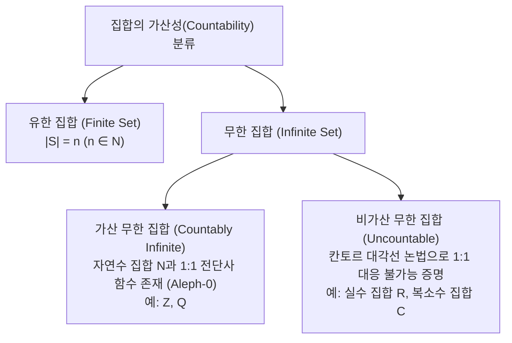
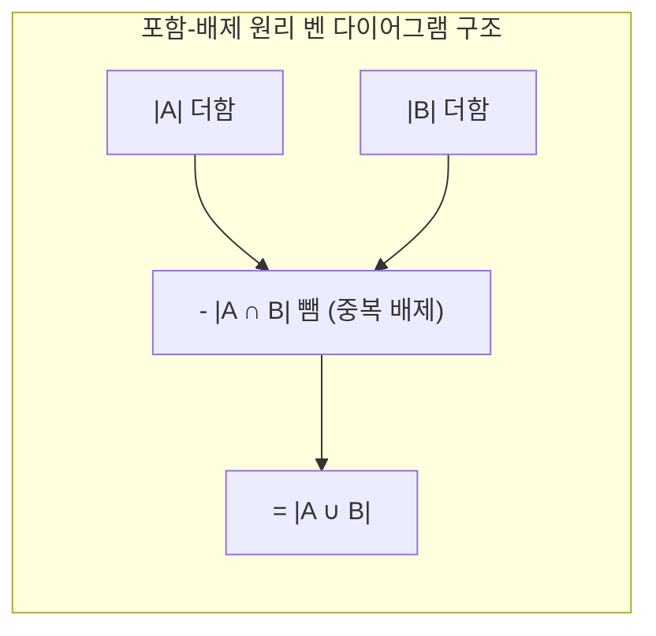

> [!abstract] 핵심 요약
> **집합론(Set Theory)**은 모든 이산 구조(관계, 함수, 그래프, 데이터베이스 릴레이션)의 기반 언어이다.
> 원소 수가 $n$인 유한 집합의 멱집합 크기는 $|\mathcal{P}(S)| = 2^n$이며, 자연수와 일대일 대응되는 **가산 집합(Countable: $\mathbb{N}, \mathbb{Z}, \mathbb{Q}$)**과 대응 불가능한 **비가산 집합(Uncountable: $\mathbb{R}$)**으로 구분된다. 또한 **포함-배제 원리(Principle of Inclusion-Exclusion)**는 교집합의 중복을 배제하여 합집합의 기수를 계산하는 기본 공식이다.

---

## 1. 집합의 기수성과 멱집합(Power Set)



$$|\mathcal{P}(S)| = 2^{|S|}$$

---

## 2. 포함-배제 원리(Principle of Inclusion-Exclusion)



### 1) 2개 집합
$$|A \cup B| = |A| + |B| - |A \cap B|$$

### 2) 3개 집합
$$|A \cup B \cup C| = |A| + |B| + |C| - (|A \cap B| + |B \cap C| + |C \cap A|) + |A \cap B \cap C|$$

---

## 3. 실시간 3개 집합 포함-배제 원리 계산기 및 벤 다이어그램

```html preview
<div style="font-family:system-ui,-apple-system,sans-serif;padding:20px;background:var(--card);color:var(--card-foreground);border:1px solid var(--border);border-radius:var(--radius)">
  <div style="font-size:16px;font-weight:700;margin-bottom:14px;color:var(--primary);display:flex;align-items:center;gap:8px">
    <span>📊 3개 집합 포함-배제 원리(PIE) 실시간 계산기</span>
  </div>

  <div style="display:grid;grid-template-columns:repeat(3, 1fr);gap:10px;margin-bottom:12px">
    <div>
      <label style="font-size:11px;font-weight:700;color:var(--chart-1)">|A| 기수:</label>
      <input id="inA" type="number" value="30" style="width:100%;padding:4px 8px;background:var(--background);color:var(--foreground);border:1px solid var(--border);border-radius:var(--radius);font-weight:700" />
    </div>
    <div>
      <label style="font-size:11px;font-weight:700;color:var(--chart-2)">|B| 기수:</label>
      <input id="inB" type="number" value="25" style="width:100%;padding:4px 8px;background:var(--background);color:var(--foreground);border:1px solid var(--border);border-radius:var(--radius);font-weight:700" />
    </div>
    <div>
      <label style="font-size:11px;font-weight:700;color:var(--chart-3)">|C| 기수:</label>
      <input id="inC" type="number" value="20" style="width:100%;padding:4px 8px;background:var(--background);color:var(--foreground);border:1px solid var(--border);border-radius:var(--radius);font-weight:700" />
    </div>
  </div>

  <div style="display:grid;grid-template-columns:repeat(4, 1fr);gap:8px;margin-bottom:14px">
    <div>
      <label style="font-size:10px;color:var(--muted-foreground)">|A ∩ B|:</label>
      <input id="inAB" type="number" value="10" style="width:100%;padding:4px 6px;background:var(--background);color:var(--foreground);border:1px solid var(--border);border-radius:var(--radius)" />
    </div>
    <div>
      <label style="font-size:10px;color:var(--muted-foreground)">|B ∩ C|:</label>
      <input id="inBC" type="number" value="8" style="width:100%;padding:4px 6px;background:var(--background);color:var(--foreground);border:1px solid var(--border);border-radius:var(--radius)" />
    </div>
    <div>
      <label style="font-size:10px;color:var(--muted-foreground)">|C ∩ A|:</label>
      <input id="inCA" type="number" value="6" style="width:100%;padding:4px 6px;background:var(--background);color:var(--foreground);border:1px solid var(--border);border-radius:var(--radius)" />
    </div>
    <div>
      <label style="font-size:10px;color:var(--muted-foreground)">|A ∩ B ∩ C|:</label>
      <input id="inABC" type="number" value="3" style="width:100%;padding:4px 6px;background:var(--background);color:var(--foreground);border:1px solid var(--border);border-radius:var(--radius)" />
    </div>
  </div>

  <div style="padding:12px;background:var(--background);border:1px solid var(--primary);border-radius:var(--radius)">
    <div style="font-size:11px;color:var(--muted-foreground)">합집합 크기 계산식 및 결과:</div>
    <div id="pieFormulaOut" style="font-family:monospace;font-size:13px;font-weight:700;color:var(--chart-1);margin:4px 0"></div>
    <div id="pieResultOut" style="font-size:16px;font-weight:800;color:var(--primary)"></div>
  </div>

  <script>
    function calcPIE() {
      var a = parseInt(document.getElementById('inA').value) || 0;
      var b = parseInt(document.getElementById('inB').value) || 0;
      var c = parseInt(document.getElementById('inC').value) || 0;
      var ab = parseInt(document.getElementById('inAB').value) || 0;
      var bc = parseInt(document.getElementById('inBC').value) || 0;
      var ca = parseInt(document.getElementById('inCA').value) || 0;
      var abc = parseInt(document.getElementById('inABC').value) || 0;

      var union = (a + b + c) - (ab + bc + ca) + abc;

      document.getElementById('pieFormulaOut').textContent = "(" + a + " + " + b + " + " + c + ") - (" + ab + " + " + bc + " + " + ca + ") + " + abc;
      document.getElementById('pieResultOut').textContent = "|A ∪ B ∪ C| = " + union;
    }

    var inputs = ['inA', 'inB', 'inC', 'inAB', 'inBC', 'inCA', 'inABC'];
    inputs.forEach(function(id) {
      document.getElementById(id).addEventListener('input', calcPIE);
    });
    calcPIE();
  </script>
</div>
```
