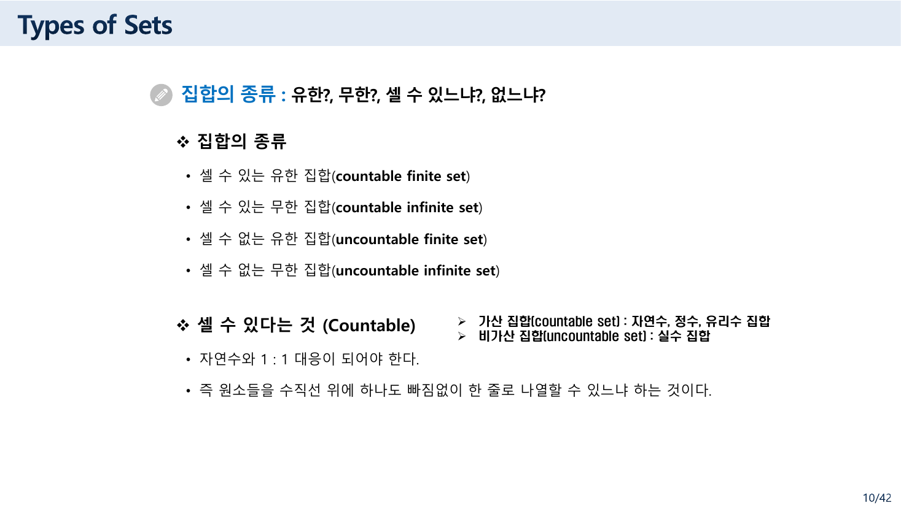
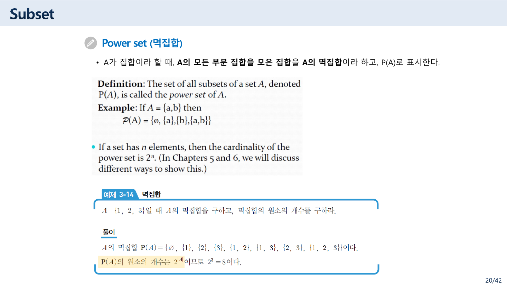
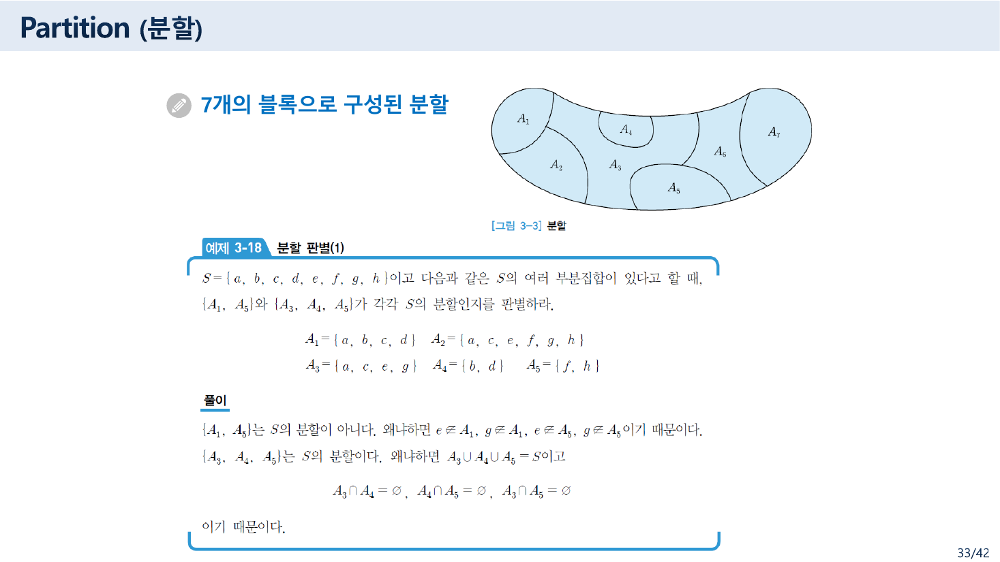
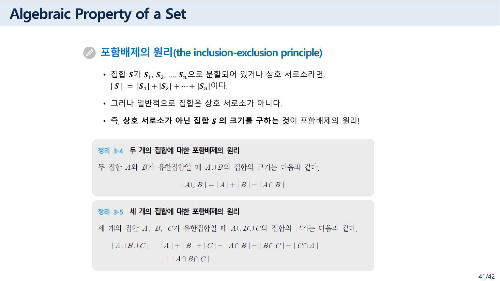
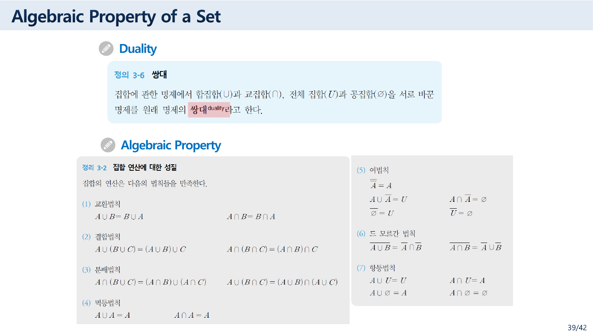
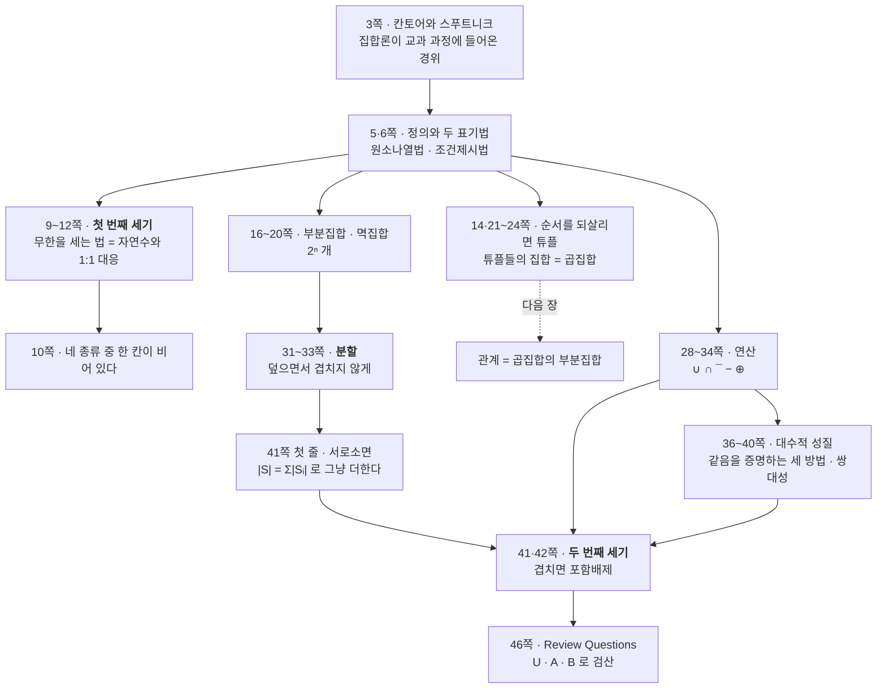
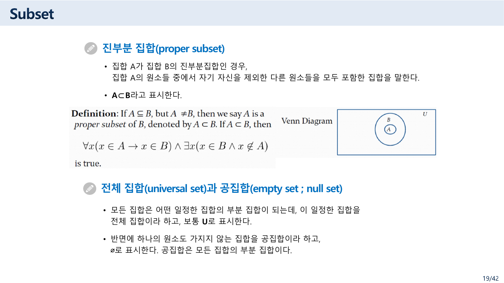
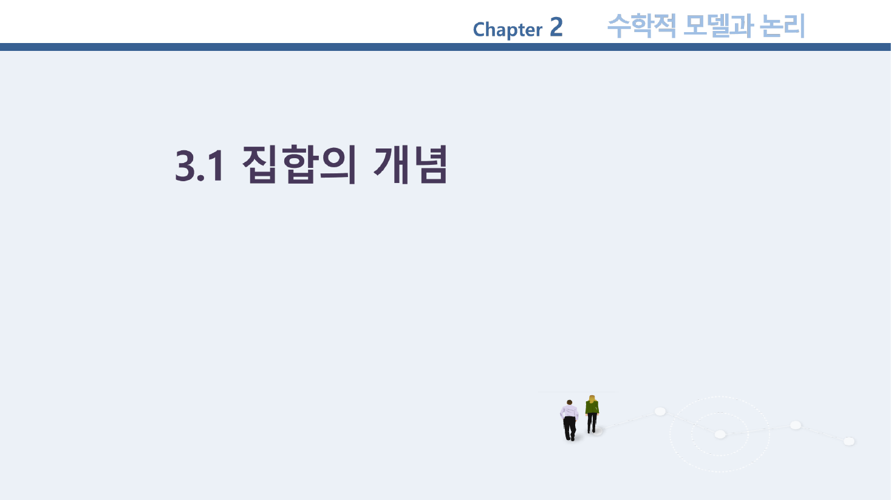

> [!abstract] 이 장이 실제로 하는 말
> 목차는 셋으로 나뉜다 — 집합의 개념 / 집합의 연산 / 집합의 대수적 성질. 그런데 마흔여섯 쪽을 통과하고 나면 **같은 동사가 두 번, 서로 다른 뜻으로 다시 정의된 것**이 남는다.
>
> **첫 번째 세기(9~12쪽)** — 무한을 어떻게 세는가. 답은 "자연수와 일대일 대응이 되면 셀 수 있다"이고, 이 정의가 정수와 유리수를 자연수와 같은 크기로 만든다.
>
> **두 번째 세기(30·41·42쪽)** — 겹치는 유한 집합을 어떻게 세는가. 답은 포함배제의 원리이고, 겹친 것을 두 번 세지 않으려고 더하고 빼기를 번갈아 한다.
>
> 그 사이에 놓인 부분집합·멱집합·분할·연산은 전부 **"무엇을 한 번씩 셀 것인가"** 를 정하는 장치다. 특히 **분할(32·33쪽)** 이 두 세기를 잇는 다리다 — 겹치지 않게 나누면 그냥 더하면 되고(41쪽 첫 줄), 겹치면 포함배제가 필요하다(41쪽 셋째 줄).
>
> 그리고 첫 번째 세기의 정의는 **10쪽 분류에 원소가 하나도 들어갈 수 없는 칸 하나**를 남긴다. 이 정리는 거기서 시작한다.

---

## 원소가 들어갈 수 없는 칸

10쪽은 집합을 네 종류로 나눈다.



> **집합의 종류**
>
> - 셀 수 있는 유한 집합(countable finite set)
> - 셀 수 있는 무한 집합(countable infinite set)
> - **셀 수 없는 유한 집합(uncountable finite set)**
> - 셀 수 없는 무한 집합(uncountable infinite set)
> — 원본 10쪽

`유한/무한` 과 `가산/비가산` 을 곱해 넷을 만든 것이다. 형식은 깔끔하다. 문제는 셋째 칸이다.

> [!warning] 원본 오류 ① — `셀 수 없는 유한 집합` 은 존재할 수 없다
> 같은 쪽이 "셀 수 있다"를 이렇게 정의한다.
>
> > **셀 수 있다는 것 (Countable)**
> >
> > - 자연수와 1 : 1 대응이 되어야 한다
> > - 즉 원소들을 수직선 위에 하나도 빠짐없이 한 줄로 나열할 수 있느냐 하는 것이다
>
> 유한 집합은 원소가 $n$개이므로 $1, 2, \ldots, n$ 과 대응시켜 한 줄로 세울 수 있다. **모든 유한 집합은 셀 수 있다.** 따라서 `셀 수 없는 유한 집합` 이라는 칸에는 어떤 집합도 들어갈 수 없다.
>
> 슬라이드가 2×2 격자를 만들려다 빈칸을 채워 넣은 것으로 보인다. 실제로 존재하는 것은 **세 종류**다.
>
> 11쪽 자신이 이 점을 반쯤 말하고 있다는 것이 재미있다. "가장 많이 혼동하는 개념은 무한집합을 셀 수 없는 집합으로 생각하는 것이다. **무한 집합과 셀 수 없다는 것은 전혀 다른 측도**"라고 적어 두었다. 두 축이 독립이라는 것을 강조하려다 실제로는 하나만 종속인 칸을 만들었다.

11쪽이 이어서 드는 예가 이 절에서 가장 기억에 남는다.

> 대천 앞바다의 모래알은 셀 수 있나요?
> → **당연히 셀 수 있지요. 시간이 조금 걸릴 뿐이죠.**
> — 원본 11쪽

"셀 수 있다"는 실제로 세어 낼 수 있다는 뜻이 아니다. **번호를 매길 수 있다**는 뜻이다.

아래에서 네 칸을 직접 채워 보라. 셋째 칸에 넣을 집합은 없다.

```html preview h=640px
<div style="font-family:system-ui,-apple-system,sans-serif;color:var(--foreground);padding:18px">
  <div style="font-size:11px;color:var(--muted-foreground);margin-bottom:8px">집합을 하나 눌러 어느 칸에 들어가는지 보라 — 원본 7·10·11쪽에 나온 집합들이다</div>
  <div id="pick" style="display:flex;gap:6px;flex-wrap:wrap;margin-bottom:16px"></div>

  <table style="border-collapse:collapse;width:100%;max-width:640px;font-size:13px">
    <tr>
      <th style="padding:8px;border:1px solid var(--border)"></th>
      <th style="padding:8px 14px;border:1px solid var(--border);color:var(--muted-foreground);font-weight:600">유한 (finite)</th>
      <th style="padding:8px 14px;border:1px solid var(--border);color:var(--muted-foreground);font-weight:600">무한 (infinite)</th>
    </tr>
    <tr>
      <th style="padding:8px 12px;border:1px solid var(--border);text-align:left;color:var(--muted-foreground);font-weight:600">셀 수 있다<br/>countable</th>
      <td id="c-fc" style="padding:10px 14px;border:1px solid var(--border);vertical-align:top;min-height:80px"></td>
      <td id="c-ic" style="padding:10px 14px;border:1px solid var(--border);vertical-align:top"></td>
    </tr>
    <tr>
      <th style="padding:8px 12px;border:1px solid var(--border);text-align:left;color:var(--muted-foreground);font-weight:600">셀 수 없다<br/>uncountable</th>
      <td id="c-fu" style="padding:10px 14px;border:1px solid var(--border);vertical-align:top;background:var(--muted, transparent)"></td>
      <td id="c-iu" style="padding:10px 14px;border:1px solid var(--border);vertical-align:top"></td>
    </tr>
  </table>

  <div id="why" style="margin-top:14px;font-size:13px;line-height:1.7;padding:11px 13px;border-radius:6px;border:1px solid var(--border);min-height:3.4em"></div>

  <div style="margin-top:18px">
    <div style="font-size:12px;font-weight:700;margin-bottom:6px">번호를 매겨 보기 — 자연수와 나란히 세우기</div>
    <div style="font-size:11px;color:var(--muted-foreground);margin-bottom:8px">10쪽의 “원소들을 하나도 빠짐없이 한 줄로 나열할 수 있느냐”를 그대로 해 본다</div>
    <div id="pairing" style="font-family:ui-monospace,monospace;font-size:13px;line-height:2;overflow-x:auto;white-space:nowrap"></div>
    <div id="rule" style="margin-top:8px;font-size:12px;color:var(--muted-foreground)"></div>
  </div>
</div>
<script>
(function(){
  var SETS=[
    {n:"{1, 3, 5, 7, 9}", cell:"fc", w:"원본 6쪽의 원소나열법 예. 원소가 다섯 개이므로 1~5 로 번호를 매기면 끝난다.", seq:null},
    {n:"대천 앞바다의 모래알", cell:"fc", w:"원본 11쪽. “당연히 셀 수 있지요. 시간이 조금 걸릴 뿐이죠.” — 유한하면 무조건 셀 수 있다.", seq:null},
    {n:"N = {0,1,2,3,…}", cell:"ic", w:"자연수 자신. 정의상 1:1 대응이 된다.", seq:function(k){ return String(k); }, rule:"n → n"},
    {n:"Z = {…,−2,−1,0,1,2,…}", cell:"ic", w:"원본 10쪽이 가산 집합으로 든 집합. 양쪽으로 뻗어 있지만 <b>번갈아 집으면</b> 한 줄이 된다.", seq:function(k){ return String(k%2===0? k/2 : -(k+1)/2); }, rule:"0, −1, 1, −2, 2, … 로 번갈아 집는다"},
    {n:"Q = 유리수", cell:"ic", w:"원본 10쪽이 가산 집합으로 든 집합. 분모+분자가 작은 것부터 훑으면 모든 분수에 번호가 붙는다.", seq:null, rule:"분모와 분자의 합이 작은 것부터 대각선으로 훑는다"},
    {n:"짝수 전체", cell:"ic", w:"원본 11쪽의 무한 정의 — “집합 A의 적당한 <b>진부분집합</b> S가 존재해서 A와 S 사이에 일대일 대응이 존재하면 A를 무한집합”. 짝수는 자연수의 진부분집합인데 자연수와 같은 크기다.", seq:function(k){ return String(2*k); }, rule:"n → 2n"},
    {n:"R = 실수", cell:"iu", w:"원본 10쪽이 비가산 집합으로 든 유일한 집합. 어떻게 줄을 세워도 빠지는 수가 남는다.", seq:null},
    {n:"∅", cell:"fc", w:"원본 19쪽의 공집합. 원소가 0개인 유한 집합이므로 셀 수 있다.", seq:null}
  ];
  var cur=3;
  var ph=document.getElementById('pick');
  SETS.forEach(function(s,i){
    var b=document.createElement('button');
    b.textContent=s.n;
    b.style.cssText="padding:6px 11px;font-size:12px;border-radius:6px;cursor:pointer;border:1px solid var(--border);background:var(--card);color:var(--foreground)";
    b.onclick=function(){ cur=i; draw(); };
    ph.appendChild(b);
  });
  function draw(){
    Array.prototype.forEach.call(ph.children,function(b,i){
      var on=(i===cur);
      b.style.background=on?"var(--chart-1)":"var(--card)";
      b.style.color=on?"var(--card)":"var(--foreground)";
      b.style.borderColor=on?"var(--chart-1)":"var(--border)";
    });
    ["fc","ic","fu","iu"].forEach(function(c){ document.getElementById("c-"+c).innerHTML=""; });
    var s=SETS[cur];
    document.getElementById("c-"+s.cell).innerHTML =
      "<span style='display:inline-block;padding:5px 10px;border-radius:5px;background:var(--chart-1);color:var(--card);font-weight:600'>"+s.n+"</span>";
    document.getElementById("c-fu").innerHTML =
      "<span style='color:var(--chart-1);font-weight:700'>영원히 비어 있다</span><br><span style='font-size:11.5px;color:var(--muted-foreground)'>유한하면 언제나 번호를 다 매길 수 있다</span>";
    document.getElementById('why').innerHTML = "<b>"+s.n+"</b> · " + s.w;

    var p=document.getElementById('pairing');
    if(s.seq){
      var rows=[[],[]];
      for(var k=0;k<12;k++){ rows[0].push(String(k).padStart(4)); rows[1].push(String(s.seq(k)).padStart(4)); }
      p.innerHTML = "<div style='color:var(--muted-foreground)'>n     "+rows[0].join(" ")+"  …</div>"+
                    "<div style='color:var(--muted-foreground)'>      "+rows[0].map(function(){return "  ↓ ";}).join(" ")+"</div>"+
                    "<div style='color:var(--chart-1);font-weight:700'>f(n)  "+rows[1].join(" ")+"  …</div>";
      document.getElementById('rule').innerHTML = "대응 규칙: <b>"+s.rule+"</b> — 어느 원소를 집어도 언젠가 번호가 온다.";
    } else {
      p.innerHTML = "<span style='color:var(--muted-foreground)'>이 집합에는 표로 보이기 좋은 간단한 규칙이 없다 — "+
        (s.cell==="iu"? "실수는 <b>어떤</b> 규칙으로도 줄을 세울 수 없다." : "유한하므로 그냥 하나씩 번호를 붙이면 된다.")+"</span>";
      document.getElementById('rule').innerHTML = s.rule? "훑는 방법: <b>"+s.rule+"</b>" : "";
    }
  }
  draw();
})();
</script>
```

`짝수 전체` 를 눌러 보면 11쪽의 무한 정의가 왜 그렇게 생겼는지 알 수 있다.

> 원소의 개수가 무한히 많다는 것으로 집합 A의 적당한 **진부분 집합(proper subset) S**가 존재해서, A와 S 사이에 **일대일 대응이 존재하면** A를 무한집합이라고 한다.
> — 원본 11쪽

유한 집합에서는 절대 일어날 수 없는 일이다 — 원소 다섯 개짜리 집합의 진부분집합은 원소가 넷 이하이므로 대응이 안 된다. **자기보다 작은 부분과 같은 크기가 될 수 있다는 것, 그것이 무한의 정의**다.

---

## 3쪽 — 집합론이 교과서에 들어온 이유

이 장의 세 번째 쪽은 뜻밖의 역사를 적어 둔다.

> 집합이란 개념은 19세기 말에 독일의 수학자 **칸토르(Georg Cantor)** 에 의해 최초로 제안되었다. 이러한 집합론이 주목받기 시작한 것은 **1957년 소련이 미국보다 먼저 최초의 인공위성인 스푸트니크(Sputnik) 1호를 발사**하면서부터이다. 이 사건 이후 미국에서 과학 및 수학 교육의 혁신을 위해 집합론이 대두되었다.
> — 원본 3쪽

집합론이 학부 교과 과정의 앞자리에 놓인 것은 수학 내부의 필요 때문만이 아니라 **냉전기 교육 개편의 결과**라는 이야기다. 그리고 같은 쪽이 컴퓨터 쪽 이유를 덧붙인다 — "처리 대상이 되는 자료를 집합으로 명확하게 표현하면 컴퓨터가 자료를 처리하기에 편리하기 때문이다."

---

## 사이에 놓인 것들 — 한 번씩 세기 위한 장치

### 순서가 없다는 것

14쪽이 짧지만 중요한 한 줄을 남긴다.

> 집합의 원소들은 순서에 상관없다. 즉, 집합의 원소들은 **순서를 갖지 않는다.**
> 〔Note〕 집합의 원소들이 **순서를 가진다면?**
> — 원본 14쪽

그 물음에 21·22쪽이 답한다 — **튜플(tuple)** 이다. 그리고 23·24쪽의 **곱집합(Cartesian product)** 이 튜플들의 집합이다. 데카르트(René Descartes, 1596-1650)의 초상이 23쪽에 붙어 있다.

이 흐름이 [다음 장](<./05. 짝이 먼저이고 관계는 그 부분집합이다.md>)의 출발점이다. **관계는 곱집합의 부분집합**으로 정의되므로, 순서를 되살린 튜플이 있어야 관계를 말할 수 있다.

15쪽은 초보자가 반드시 한 번 걸리는 두 가지를 못 박는다.

> - Sets can be elements of sets. → `{{1,2,3}, a, {b,c}}`, `{N, Z, Q, R}`
> - The empty set is different from a set containing the empty set. → **`∅ ≠ {∅}`**
> — 원본 15쪽

`∅` 은 원소가 0개이고 `{∅}` 은 원소가 **1개**다. 그 하나가 공집합일 뿐이다.

### 멱집합 — 부분집합을 다 세면 몇 개인가



> A가 집합이라 할 때, A의 **모든 부분 집합을 모은 집합**을 A의 멱집합이라 하고, `P(A)` 로 표시한다.
> — 원본 20쪽

원소가 $n$개면 각 원소마다 "넣는다/안 넣는다" 두 갈래이므로 $|P(A)| = 2^n$ 이다. 46쪽의 `A = {1,2,3,4,5}` 라면 부분집합이 **32개**다. 이것이 이 장의 세기 중 가장 단순한 형태 — **곱해서 세기**다.

### 분할 — 겹치지 않게 나누기

31~33쪽. 이 대목이 두 세기를 잇는 다리다.



> 분할이란 어떤 집합을 **공집합이 아닌 상호 서로소인 부분 집합**으로 나누는 것을 말한다.
> — 원본 32쪽

33쪽의 예제 3-18이 판별 기준을 두 갈래로 보여준다. $S = \{a,b,c,d,e,f,g,h\}$ 이고

$$A_1=\{a,b,c,d\},\quad A_2=\{a,c,e,f,g,h\},\quad A_3=\{a,c,e,g\},\quad A_4=\{b,d\},\quad A_5=\{f,h\}$$

- `{A₁, A₅}` 는 분할이 **아니다** — $e \notin A_1$, $g \notin A_1$, $e \notin A_5$, $g \notin A_5$. 겹치지는 않지만 **다 덮지 못한다**
- `{A₃, A₄, A₅}` 는 분할이다 — $A_3 \cup A_4 \cup A_5 = S$ 이고 $A_3 \cap A_4 = A_4 \cap A_5 = A_3 \cap A_5 = \varnothing$

분할이 되려면 **덮어야 하고(union = S) 겹치지 않아야 한다(pairwise disjoint)** — 두 조건이 모두 필요하다. 그리고 그 두 조건이 충족되는 순간 세기가 덧셈이 된다.

$$|S| = |A_3| + |A_4| + |A_5| = 4 + 2 + 2 = 8 \;\checkmark$$

41쪽의 첫 줄이 이것을 일반화한다.

> 집합 $S$가 $S_1, S_2, \ldots, S_n$ 으로 분할되어 있거나 상호 서로소라면, $|S| = |S_1| + |S_2| + \cdots + |S_n|$ 이다.
> — 원본 41쪽

---

## 두 번째 세기 — 겹치면 어떻게 하는가

41쪽의 둘째·셋째 줄이 문제를 던진다.

> - 그러나 일반적으로 집합은 상호 서로소가 아니다
> - 즉, **상호 서로소가 아닌 집합 $S$의 크기를 구하는 것**이 포함배제의 원리!
> — 원본 41쪽



| | 식 |
| --- | --- |
| 정리 3-4 (두 집합) | $\lvert A \cup B \rvert = \lvert A \rvert + \lvert B \rvert - \lvert A \cap B \rvert$ |
| 정리 3-5 (세 집합) | $\lvert A \cup B \cup C \rvert = \lvert A \rvert + \lvert B \rvert + \lvert C \rvert - \lvert A \cap B \rvert - \lvert B \cap C \rvert - \lvert C \cap A \rvert + \lvert A \cap B \cap C \rvert$ |

42쪽은 정리 3-5를 정리 3-4에서 유도한다. 다섯 줄인데, 각 줄의 근거가 옆에 붙어 있다.

| | 식 | 근거 |
| --- | --- | --- |
| | $\lvert A \cup (B \cup C) \rvert$ | 결합법칙 |
| 1 | $= \lvert A \rvert + \lvert B \cup C \rvert - \lvert A \cap (B \cup C) \rvert$ | 정리 3-4 |
| 2 | $= \lvert A \rvert + \lvert B \rvert + \lvert C \rvert - \lvert B \cap C \rvert - \lvert A \cap (B\cup C) \rvert$ | 정리 3-4 |
| 3 | $= \cdots - \lvert (A\cap B) \cup (A \cap C) \rvert$ | 분배법칙 |
| 4 | $= \cdots - \lvert A\cap B\rvert - \lvert A\cap C\rvert + \lvert (A\cap B)\cap(A\cap C)\rvert$ | 정리 3-4 |
| 5 | $= \lvert A\rvert+\lvert B\rvert+\lvert C\rvert - \lvert A\cap B\rvert - \lvert B\cap C\rvert - \lvert C\cap A\rvert + \lvert A\cap B\cap C\rvert$ | 교환·멱등법칙 |

마지막 줄에서 $(A\cap B)\cap(A\cap C)$ 가 $A \cap B \cap C$ 로 줄어드는 것이 **멱등법칙**($A \cap A = A$) 이다. 39쪽의 대수적 성질 표가 여기서 쓰인다.

### 46쪽 값으로 확인하기

46쪽의 Review Questions가 구체적인 값을 준다.

$$U = \{0,1,\ldots,10\}, \qquad A = \{1,2,3,4,5\}, \qquad B = \{4,5,6,7,8\}$$

아래에서 원소를 눌러 두 집합의 소속을 바꿔 가며 여섯 연산과 포함배제를 동시에 확인할 수 있다.

```html preview h=680px
<div style="font-family:system-ui,-apple-system,sans-serif;color:var(--foreground);padding:18px">
  <div style="display:flex;gap:8px;flex-wrap:wrap;align-items:center;margin-bottom:8px">
    <span style="font-size:11px;color:var(--muted-foreground)">전체집합 U의 원소를 눌러 A · B 소속을 돌려 본다 (없음 → A → A와 B → B → 없음)</span>
    <button id="reset" style="padding:4px 10px;font-size:11px;border-radius:5px;cursor:pointer;border:1px solid var(--border);background:var(--card);color:var(--foreground)">원본 46쪽 값으로</button>
  </div>
  <div id="univ" style="display:flex;gap:6px;flex-wrap:wrap;margin-bottom:16px"></div>

  <div style="display:flex;gap:18px;flex-wrap:wrap;align-items:flex-start">
    <svg id="venn" viewBox="0 0 330 210" style="width:330px;height:210px;border:1px solid var(--border);border-radius:var(--radius,8px);background:var(--card)"></svg>
    <div style="flex:1;min-width:270px">
      <table style="border-collapse:collapse;width:100%;font-size:13px;font-family:ui-monospace,monospace">
        <tbody id="ops"></tbody>
      </table>
    </div>
  </div>

  <div style="margin-top:16px;border:1px solid var(--border);border-radius:var(--radius,8px);background:var(--card);padding:14px">
    <div style="font-size:12px;font-weight:700;margin-bottom:8px">정리 3-4 · 포함배제로 세어 보기</div>
    <div id="pie" style="font-family:ui-monospace,monospace;font-size:14px;line-height:2"></div>
  </div>
</div>
<script>
(function(){
  var U=[0,1,2,3,4,5,6,7,8,9,10];
  var st={};                                   // 0 없음, 1 A만, 2 A와 B, 3 B만
  function reset(){ U.forEach(function(x){ st[x] = (x>=1&&x<=3)?1 : (x>=4&&x<=5)?2 : (x>=6&&x<=8)?3 : 0; }); }
  reset();

  function setOf(k){ return U.filter(function(x){ return k==="A" ? (st[x]===1||st[x]===2) : (st[x]===2||st[x]===3); }); }
  function fmt(a){ return "{" + a.join(", ") + "}"; }

  function draw(){
    var uh=document.getElementById('univ'); uh.innerHTML="";
    U.forEach(function(x){
      var b=document.createElement('button');
      var lab = st[x]===0? "·" : st[x]===1? "A" : st[x]===2? "AB" : "B";
      b.innerHTML = x + "<span style='display:block;font-size:9px;opacity:.75'>"+lab+"</span>";
      var bg = st[x]===0? "var(--card)" : st[x]===1? "var(--chart-1)" : st[x]===2? "var(--chart-3, var(--chart-1))" : "var(--chart-2, var(--chart-1))";
      b.style.cssText="min-width:38px;padding:5px 6px;border-radius:6px;cursor:pointer;font-family:ui-monospace,monospace;font-size:13px;border:1px solid var(--border);background:"+bg+
        ";color:"+(st[x]===0?"var(--muted-foreground)":"var(--card)");
      b.onclick=function(){ st[x]=(st[x]+1)%4; draw(); };
      uh.appendChild(b);
    });

    var A=setOf("A"), B=setOf("B");
    var inter=A.filter(function(x){return B.indexOf(x)>=0;});
    var uni=U.filter(function(x){return A.indexOf(x)>=0||B.indexOf(x)>=0;});
    var ac=U.filter(function(x){return A.indexOf(x)<0;});
    var bc=U.filter(function(x){return B.indexOf(x)<0;});
    var amb=A.filter(function(x){return B.indexOf(x)<0;});
    var bma=B.filter(function(x){return A.indexOf(x)<0;});
    var sym=amb.concat(bma).sort(function(p,q){return p-q;});

    var rows=[["A","{"+A.join(", ")+"}"],["B","{"+B.join(", ")+"}"],
      ["A ∪ B",fmt(uni)],["A ∩ B",fmt(inter)],["Ā",fmt(ac)],["B̄",fmt(bc)],
      ["A − B",fmt(amb)],["B − A",fmt(bma)],["A ⊕ B",fmt(sym)]];
    document.getElementById('ops').innerHTML = rows.map(function(r,i){
      return "<tr><td style='padding:4px 10px;color:var(--muted-foreground);white-space:nowrap;border-bottom:1px solid var(--border)'>"+r[0]+
        "</td><td style='padding:4px 10px;border-bottom:1px solid var(--border)'>"+r[1]+"</td></tr>";
    }).join("");

    // 벤 다이어그램
    var s='<rect x="6" y="6" width="318" height="198" rx="6" fill="none" stroke="var(--border)"/>';
    s+='<text x="14" y="22" font-size="11" fill="var(--muted-foreground)">U</text>';
    s+='<circle cx="130" cy="105" r="72" fill="var(--chart-1)" opacity="0.22" stroke="var(--chart-1)"/>';
    s+='<circle cx="205" cy="105" r="72" fill="var(--chart-2, var(--chart-1))" opacity="0.22" stroke="var(--chart-2, var(--chart-1))"/>';
    s+='<text x="80" y="42" font-size="13" fill="var(--foreground)">A</text>';
    s+='<text x="248" y="42" font-size="13" fill="var(--foreground)">B</text>';
    function place(list,cx,cy,wid){
      return list.map(function(v,i){
        var per=Math.max(1,Math.ceil(Math.sqrt(list.length)));
        var col=i%per, row=Math.floor(i/per);
        var x=cx+(col-(per-1)/2)*wid, y=cy+(row-(Math.ceil(list.length/per)-1)/2)*16;
        return '<text x="'+x.toFixed(0)+'" y="'+y.toFixed(0)+'" font-size="12" text-anchor="middle" fill="var(--foreground)">'+v+'</text>';
      }).join("");
    }
    s+=place(amb,100,105,17);
    s+=place(inter,167,105,17);
    s+=place(bma,236,105,17);
    var out=U.filter(function(x){return A.indexOf(x)<0 && B.indexOf(x)<0;});
    s+=place(out,167,188,17);
    document.getElementById('venn').innerHTML=s;

    var lhs=uni.length, rhs=A.length+B.length-inter.length;
    document.getElementById('pie').innerHTML =
      "|A| = "+A.length+" , |B| = "+B.length+" , |A ∩ B| = "+inter.length+"<br>"+
      "|A| + |B| − |A ∩ B| = "+A.length+" + "+B.length+" − "+inter.length+" = <b style='color:var(--chart-1)'>"+rhs+"</b><br>"+
      "직접 센 |A ∪ B| = <b style='color:var(--chart-2, var(--foreground))'>"+lhs+"</b>"+
      "<div style='font-size:12px;color:var(--muted-foreground);margin-top:6px'>"+
      (lhs===rhs? "두 값이 같다. 교집합의 "+inter.length+"개를 두 번 세었기 때문에 한 번 빼 준다." : "불일치 — 계산을 확인하세요.")+"</div>";
  }
  document.getElementById('reset').onclick=function(){ reset(); draw(); };
  draw();
})();
</script>
```

처음 화면이 46쪽의 값이다. 여섯 답이 원본과 정확히 일치한다.

| 문항 | 원본의 답 |
| --- | --- |
| 1. `A ∪ B` | `{1,2,3,4,5,6,7,8}` |
| 2. `A ∩ B` | `{4,5}` |
| 3. `Ā` | `{0,6,7,8,9,10}` |
| 4. `B̄` | `{0,1,2,3,9,10}` |
| 5. `A − B` | `{1,2,3}` |
| 6. `B − A` | `{6,7,8}` |

그리고 포함배제가 맞아떨어진다 — $|A|+|B|-|A\cap B| = 5+5-2 = 8 = |A \cup B|$.

34쪽의 **대칭 차집합** $A \oplus B$ 도 여기서 읽힌다. $\{1,2,3\} \cup \{6,7,8\} = \{1,2,3,6,7,8\}$, 크기 6. 이것은 $|A \cup B| - |A \cap B| = 8 - 2$ 이기도 하다 — 합집합에서 겹친 부분을 **한 번 더** 빼면 대칭 차집합이 된다.

---

## 같다는 것을 증명하는 세 가지 길

36~38쪽은 두 집합이 같음을 증명하는 방법을 셋 든다. 예제는 셋 다 같은 명제 — 드 모르간 법칙 $\overline{A \cup B} = \bar{A} \cap \bar{B}$ 이다.

| 방법 | 쪽 | 어떻게 |
| --- | --- | --- |
| ① 벤 다이어그램 | 36 | 두 그림의 색칠된 영역이 같음을 보인다 |
| ② 서로 부분집합임을 보이기 | 37 | $\subseteq$ 와 $\supseteq$ 를 각각 증명 |
| ③ 진리표 | 38 | 원소가 A·B에 속하는지의 네 경우를 표로 |

②가 이 셋 중 가장 논리적인 방법이고, 37쪽의 증명이 [앞 장](<./03. 논증을 기계에게 넘기려면.md>)의 도구를 그대로 쓴다.

> (1) $x \in \overline{A \cup B}$ 라 가정하자. 그러면 $x \notin A \cup B$ 이므로 $x \notin A$ 이고 $x \notin B$ 이다. (왜냐하면 만일 $x \in A$ 혹은 $x \in B$ 라면 $x \in A \cup B$ 이기 때문이다.) 또한, $x \in \bar{A}$ 이고 $x \in \bar{B}$ 이다. 그러므로 $x \in \bar{A} \cap \bar{B}$ 이다.
> — 원본 37쪽

괄호 안의 문장이 **대우를 이용한 간접 증명**(원본 66쪽)이다. "x∉A∪B ⟹ x∉A"를 직접 보이는 대신 "x∈A ⟹ x∈A∪B"를 보였다.

③의 진리표 방법은 더 직접적이다. 원소 하나가 A와 B에 속하는지를 T/F로 놓으면 네 경우뿐이고, 그것은 [명제 논리](<./02. 함축은 인과가 아니다.md>)의 드 모르간 법칙과 **같은 표**다. 집합의 `∪ ∩ ¯` 이 논리의 `∨ ∧ ¬` 와 한 글자씩 대응한다.

### 쌍대성 — 법칙이 반씩만 있으면 되는 이유



> **정의 3-6 쌍대**: 집합에 관한 명제에서 **합집합(∪)과 교집합(∩), 전체 집합(U)과 공집합(∅)을 서로 바꾼** 명제를 원래 명제의 쌍대(duality)라고 한다.
> — 원본 39쪽

39쪽의 표가 왜 두 열씩 나란한지가 이 정의로 설명된다. 왼쪽을 증명하면 오른쪽은 **덤으로 따라온다**.

| | 왼쪽 | 오른쪽 (쌍대) |
| --- | --- | --- |
| 교환법칙 | $A\cup B = B\cup A$ | $A\cap B = B\cap A$ |
| 결합법칙 | $A\cup(B\cup C)=(A\cup B)\cup C$ | $A\cap(B\cap C)=(A\cap B)\cap C$ |
| 분배법칙 | $A\cap(B\cup C)=(A\cap B)\cup(A\cap C)$ | $A\cup(B\cap C)=(A\cup B)\cap(A\cup C)$ |
| 멱등법칙 | $A\cup A = A$ | $A\cap A = A$ |
| 여법칙 | $A\cup\bar A = U$ | $A\cap\bar A = \varnothing$ |
| 드 모르간 | $\overline{A\cup B}=\bar A\cap\bar B$ | $\overline{A\cap B}=\bar A\cup\bar B$ |
| 항등법칙 | $A\cup U = U$, $A\cup\varnothing = A$ | $A\cap U = A$, $A\cap\varnothing=\varnothing$ |

40쪽이 그중 한 줄을 짚어 준다 — "합집합의 **항등원은 ∅** 이고, 교집합의 **항등원은 전체집합 U**".

> [!note] 39쪽 `(7) 항등법칙` 이라는 이름
> 표의 (7)번 네 줄 중 $A\cup\varnothing = A$ 와 $A\cap U = A$ 는 항등법칙이 맞다 — 연산 결과가 원래 집합 그대로다. 그런데 나머지 둘, $A\cup U = U$ 와 $A\cap\varnothing = \varnothing$ 은 성격이 다르다. 결과가 **원래 집합과 무관하게** U 또는 ∅으로 눌린다. 영어권 교재는 이 둘을 보통 **지배법칙(domination law)** 으로 따로 부른다.
>
> 네 줄이 한 이름으로 묶여 있어도 계산에는 지장이 없지만, 40쪽이 "항등원"을 정확한 뜻으로 다시 쓰기 때문에 두 이름을 구분해 두는 편이 헷갈리지 않는다.

---

## 이 장의 지도



---

## 원본에서 발견한 것

| # | 쪽 | 내용 |
| --- | --- | --- |
| ① | 10 | **`셀 수 없는 유한 집합(uncountable finite set)`** — 같은 쪽의 정의상 원소가 하나도 들어갈 수 없는 범주 |
| ② | 19 | 진부분집합의 한국어 설명이 그 자체로 뜻이 통하지 않고, 바로 아래 영어 정의와도 다르다 |
| ③ | 4·27 등 | 절 표지 슬라이드의 머리글이 **`Chapter 2 수학적 모델과 논리`** — 3장 자료인데 2장 머리글이 남아 있다 |
| ④ | 43·44·45 | 쪽 번호가 **`43/42`, `44/42`, `45/42`** — 분모가 42인데 실제로는 46쪽 |
| ⑤ | 11 vs 19 | 기호 `⊂` 가 11쪽에서는 부분집합, 19쪽에서는 진부분집합을 뜻한다 |
| ⑥ | 45 | 집합 장 한복판에 **시스템 프로그래머와 응용 프로그래머 비교**가 한 쪽 통째로 들어 있다 |

> [!warning] ② — 19쪽 진부분집합의 한국어 설명
> 
>
> > 집합 A가 집합 B의 진부분집합인 경우, **집합 A의 원소들 중에서 자기 자신을 제외한 다른 원소들을 모두 포함한 집합**을 말한다.
>
> 이 문장은 그대로는 읽히지 않는다. "집합 A의 원소들 중에서 자기 자신을 제외한"이 무엇을 제외한다는 것인지 — 원소를? 집합 A를? — 가 정해지지 않고, 그렇게 만든 집합이 무엇인지도 불분명하다.
>
> **바로 아래에 붙은 영어 정의는 정확하다.**
>
> > **Definition**: If $A \subseteq B$, but $A \neq B$, then we say $A$ is a *proper subset* of $B$, denoted by $A \subset B$. If $A \subset B$, then $\forall x(x \in A \to x \in B) \land \exists x(x \in B \land x \notin A)$ is true.
>
> 그리고 **11쪽의 각주도 정확하다** — "집합 A가 집합 B의 부분집합이지만, 서로 같지 않을 때, 즉 A⊂B이고 A≠B일 때". 즉 이 자료 안에 올바른 정의가 두 군데 있고, 19쪽의 한국어 한 줄만 어긋난다.
>
> 참고로 영어 정의의 뒷부분 $\exists x(x \in B \land x \notin A)$ 이 "$A \neq B$"를 술어 논리로 옮긴 것이다 — [앞 장](<./03. 논증을 기계에게 넘기려면.md>)의 한정자가 여기서 쓰인다.

다음 둘은 내용이 아니라 자료를 만드는 과정에서 생긴 자국이다.

> [!note] ③ — 절 표지에 남은 2장 머리글
> 
>
> 4쪽의 본문은 `3.1 집합의 개념` 인데 오른쪽 위 머리글은 `Chapter 2  수학적 모델과 논리` 다. 27쪽(`3.2 집합의 연산`)도 같다. 1쪽 표지는 `3 집합 및 집합 연산` 으로 제대로 되어 있으니, **2장 파일을 복사해 만들면서 절 표지의 머리글만 남은 것**으로 보인다.
>
> 이 두 쪽은 텍스트 추출에서 **0자**로 나온다(제목이 이미지로 되어 있다). [진행대장](../../../../docs/정리문서%20재작성%20진행대장.md)이 강조하는 "0자 페이지를 먼저 보라"는 원칙이 여기서는 손글씨가 아니라 **머리글 오류**를 찾아냈다.

기호 쪽에도 한 가지가 더 있다.

> [!note] ⑤ — `⊂` 가 두 가지 뜻으로 쓰인다
>
> - **11쪽**: "집합 A가 집합 B의 부분집합이지만, 서로 같지 않을 때, 즉 `A⊂B` **이고** `A≠B` 일 때" → 여기서 `⊂` 는 그냥 **부분집합**(`⊆`)이다. 그래서 `A≠B` 를 따로 붙였다
> - **19쪽**: 진부분집합을 "`A⊂B` 라고 표시한다" → 여기서 `⊂` 는 그 자체로 **진부분집합**이다
>
> 두 쪽의 규칙이 다르므로, `A⊂B` 라는 표기만 보고는 같음이 허용되는지 알 수 없다. 19쪽의 영어 정의가 쓰는 `⊆` / `⊂` 구분이 명확하니 그쪽을 기준으로 읽는 편이 안전하다.

마지막 하나는 오류라기보다 자리를 잘못 찾은 슬라이드다.

> [!note] ⑥ — 45쪽의 프로그래머 분류
> 집합의 대수적 성질을 다루는 자리에 갑자기 "시스템 프로그래머와 응용 프로그래머 비교 설명"이 한 쪽 들어 있다. 운영체제·컴파일러를 만드는 사람과 한글·오피스·크롬·포토샵을 만드는 사람의 차이를 설명한다. **집합에 관한 언급이 한 줄도 없다.**
>
> 굳이 이 장과 잇는다면 32·33쪽의 **분할**이 다리가 된다 — 프로그래머 전체를 겹치지 않게 두 부류로 나눈 것이 곧 분할이고, 슬라이드가 "최근에는 게임/웹/모바일/보안 프로그래머 등 매우 다양하게 분류하기도 하지만"이라 덧붙인 것은 그 분할이 유일하지 않다는 이야기다. 다만 **원본이 그 연결을 적지는 않았다** — 여기서 붙인 해석이다.

---

## 근거 자료

- `sources/집합 및 집합연산.pdf` — 46쪽 전부
  - 4쪽 · 절 표지 (인용: `ch04-p04`) — **원본 문제 ③**
  - 10쪽 · 집합의 네 종류 (인용: `ch04-p10`) — **원본 오류 ①**
  - 19쪽 · 진부분집합 (인용: `ch04-p19`) — **원본 오류 ②·⑤**
  - 20쪽 · 멱집합 (인용: `ch04-p20`)
  - 33쪽 · 분할과 예제 3-18 (인용: `ch04-p33`)
  - 39쪽 · 쌍대와 대수적 성질 (인용: `ch04-p39`)
  - 41쪽 · 포함배제의 원리 (인용: `ch04-p41`)
  - 3·5~9·11~18·21~32·34~38·40·42~46쪽 — 본문의 인용문과 표에 반영. **원본 문제 ④·⑥** 은 43~45쪽
- 46쪽 Review Questions의 여섯 답, 33쪽 예제 3-18의 분할 판별, 42쪽 정리 3-5 유도의 각 줄, 포함배제 $5+5-2=8$ 은 모두 계산으로 대조했다. 위 인터랙티브는 46쪽의 값을 초기 상태로 그대로 쓴다
- 33쪽 도형의 블록 라벨이 $A_1 \sim A_7$ 로 빠짐없이 붙어 있는지는 고해상도로 다시 렌더링해 확인했다(저해상도에서는 $A_6$ 이 $A_5$ 로 보인다)
- ⑥의 "분할로 읽으면 이어진다"는 해석과 39쪽 (7)번의 이름에 대한 지적은 원본에 없는 보충이며 그렇게 밝혔다

## 이어지는 글

- [03. 논증을 기계에게 넘기려면](<./03. 논증을 기계에게 넘기려면.md>) — 술어 논리와 증명
- [05. 짝이 먼저이고 관계는 그 부분집합이다](<./05. 짝이 먼저이고 관계는 그 부분집합이다.md>) — 관계
