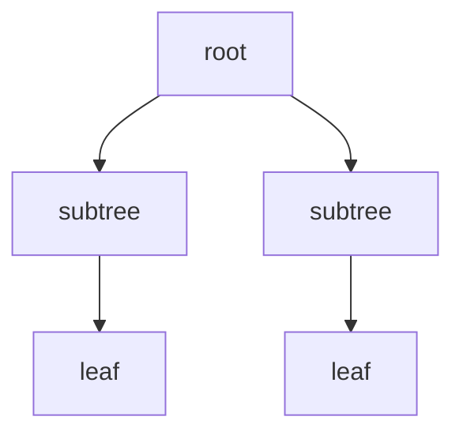

트리는 사이클이 없는 연결 그래프의 계층적 형태로 이해하며, 자료는 기본 개념 → 레이블을 갖는 트리와 최소 스패닝 트리 → 트리 탐방 알고리즘 순으로 전개한다.



<Tabs>
  <Tab label="기본 개념">루트, 부모·자식, 잎, 깊이와 높이를 구분한다.</Tab>
  <Tab label="최소 스패닝">가중 그래프의 모든 정점을 연결하면서 간선 가중치 합을 최소화한다.</Tab>
  <Tab label="탐방">정해진 시작점에서 방문 순서를 관리해 모든 노드를 확인한다.</Tab>
</Tabs>

| 구조 | 확인 |
| --- | --- |
| 트리 | 연결되고 사이클이 없음 |
| 서브트리 | 한 노드와 그 아래 descendants |
| 레이블 | 노드 또는 간선에 부여된 값 |
| 탐방 | 방문·미방문 상태와 순서 |

```html preview
<div style="font-family:system-ui,sans-serif;padding:20px;color:var(--foreground)">
<label for="amt" style="font-size:14px;font-weight:600">트리 절</label>
<div id="out" style="font-size:30px;font-weight:700;color:var(--chart-1);margin:6px 0">1절</div>
<input id="amt" type="range" min="1" max="3" step="1" value="1" style="width:100%;accent-color:var(--primary)" />
<p style="font-size:13px;color:var(--muted-foreground)">원본 장·절 순서를 움직여 현재 개념 묶음을 확인한다.</p>
<script>
var amt=document.getElementById('amt'); var out=document.getElementById('out');
amt.addEventListener('input',function(){out.textContent=Number(amt.value).toLocaleString()+'절';});
</script>
</div>
```

> [!WARNING]
> 최소 스패닝 트리는 경로 하나의 최단거리와 목적이 다르다. 모든 정점을 연결하는 간선 집합의 총 가중치를 비교한다.

<details>
<summary>탐방 체크</summary>

시작 노드, 방문 표시, 다음 후보 선택, 종료 조건을 순서대로 기록한다. 트리에서는 부모 방향과 자식 방향을 구분하면 중복 방문을 피할 수 있다.

</details>

<!-- source: 6 트리.pdf; chapter sequence preserved -->