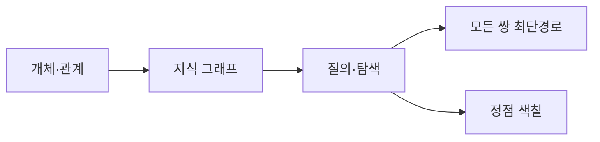

지식그래프는 그래프 기반 지식 표현과 그래프 데이터 관리, 질의 언어의 기초를 목표로 한다. 부록은 같은 그래프 관점을 최단 경로와 색칠 알고리즘으로 확장한다.



<Tabs>
  <Tab label="Floyd–Warshall">방향·가중 그래프에서 음의 간선도 허용하며 모든 정점 쌍의 최소 경로 비용을 계산한다.</Tab>
  <Tab label="Welch–Powell">정점 차수를 내림차순으로 배열하고, 인접하지 않은 정점을 같은 색으로 반복 착색한다.</Tab>
  <Tab label="지식그래프">노드를 개체, 간선을 관계로 보고 데이터 관리와 질의를 연결한다.</Tab>
</Tabs>

| 알고리즘 | 입력 관점 | 반복 규칙 |
| --- | --- | --- |
| Floyd–Warshall | 가중 방향 그래프 | 중간 정점을 허용해 거리 갱신 |
| Welch–Powell | 정점과 인접 관계 | 차수 순서·색 충돌 회피 |

```html preview
<div style="font-family:system-ui,sans-serif;padding:20px;color:var(--foreground)">
<label for="amt" style="font-size:14px;font-weight:600">응용 주제</label>
<div id="out" style="font-size:30px;font-weight:700;color:var(--chart-1);margin:6px 0">1단계</div>
<input id="amt" type="range" min="1" max="3" step="1" value="1" style="width:100%;accent-color:var(--primary)" />
<p style="font-size:13px;color:var(--muted-foreground)">원본 장·절 순서를 움직여 현재 개념 묶음을 확인한다.</p>
<script>
var amt=document.getElementById('amt'); var out=document.getElementById('out');
amt.addEventListener('input',function(){out.textContent=Number(amt.value).toLocaleString()+'단계';});
</script>
</div>
```

> [!IMPORTANT]
> Floyd–Warshall의 예시는 도로망에서 위치를 정점, 도로를 간선으로 모델링한다. 음의 가중치 간선이 가능하다는 원본 조건을 유지한다.

<details>
<summary>Welch–Powell 절차</summary>

① 차수 내림차순 배열 → ② 첫 색으로 첫 정점과 비인접 정점 착색 → ③ 다음 미착색 정점에서 새 색 시작 → ④ 모든 정점이 착색될 때까지 반복.

</details>

<!-- source: knowledge graph, Floyd–Warshall and Welch–Powell decks; algorithm steps preserved -->