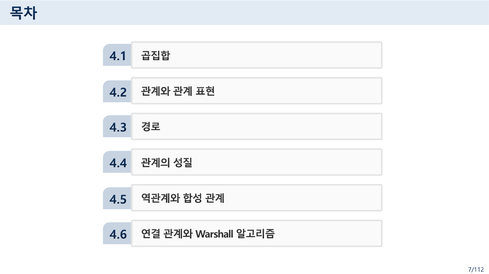
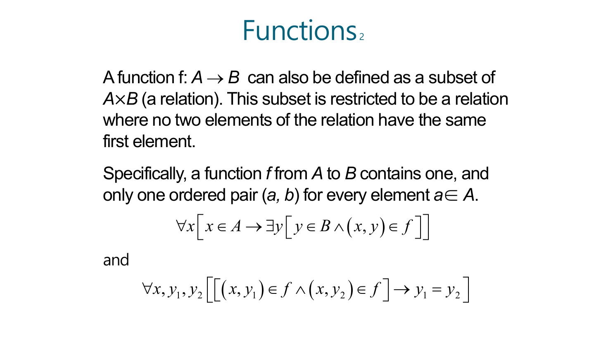
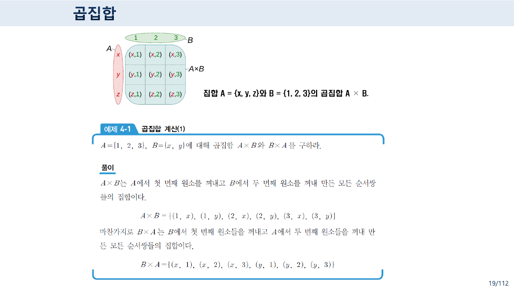
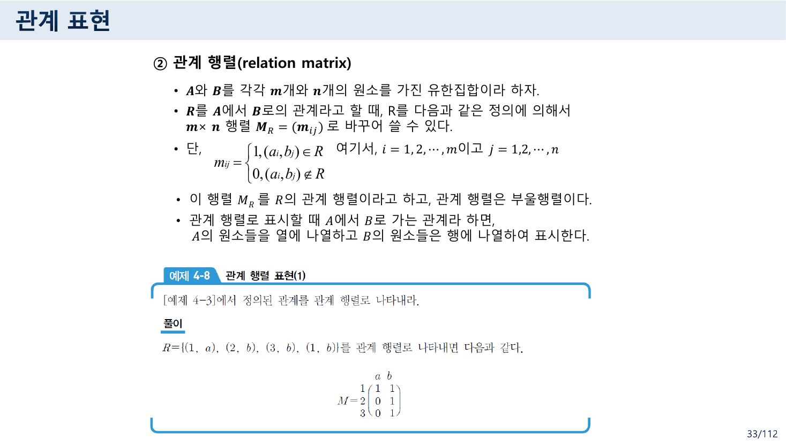
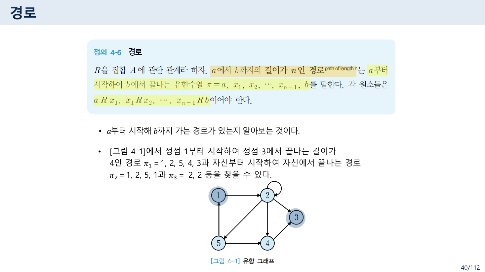
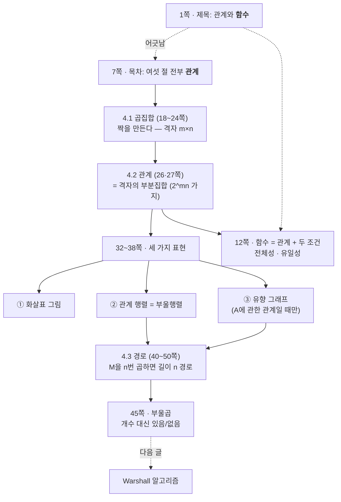

> [!abstract] 이 자료가 실제로 하는 말
> 표지는 **`4 관계(Relation)와 함수(Functions)`** 다. 그런데 7쪽 목차에는 여섯 절이 있고 **그중 함수를 다루는 절이 하나도 없다.**
>
> `4.1 곱집합` · `4.2 관계와 관계 표현` · `4.3 경로` · `4.4 관계의 성질` · `4.5 역관계와 합성 관계` · `4.6 연결 관계와 Warshall 알고리즘`
>
> 절 표지 슬라이드의 오른쪽 위 머리글도 `Chapter 4 **관계**` 다. 함수 이야기는 2·5·6·11~16·25쪽에 **영어 원서 슬라이드가 낱장으로 끼어 있는 형태**로만 나오고, 한국어 본문에는 없다.
>
> 이 어긋남은 실수가 아니다. **12쪽이 직접 해소한다.**
>
> > A function f: A → B can also be defined as **a subset of A×B (a relation)**.
>
> 함수는 관계의 특수한 경우이므로, 관계를 제대로 다루면 함수는 그 안에 이미 들어 있다. 9쪽도 같은 말을 한국어로 적어 두었다 — "근현대 수학의 중요한 개념인 **함수도 이항 관계의 특별한 경우**이다."
>
> 그래서 이 정리는 세 겹의 포함 관계를 척추로 삼는다. **짝(순서쌍) ⊃ 곱집합 ⊃ 관계 ⊃ 함수.** 안쪽으로 갈수록 조건이 하나씩 붙는다.

---

## 목차에 없는 함수



자료 전체에서 함수를 다루는 쪽은 이렇게 흩어져 있다.

| 쪽 | 내용 | 언어 |
| --- | --- | --- |
| 2 | `function` 이라는 영어 단어의 사전 뜻 두 가지 | 영어 |
| 5 | Python function | (그림) |
| 6 | What is Instagram? — "Main functions?" | 영어 |
| 11~16 | 함수의 정의·표현·연습 문제 | 영어 (Rosen 슬라이드) |
| 25 | 11쪽과 **똑같은 슬라이드** | 영어 |

2쪽이 이 배치의 의도를 드러낸다. 사전에서 `function` 을 찾으면 두 가지 뜻이 나온다는 것부터 시작한다.

> - "an activity or purpose natural to or intended for a person or thing." — 사람이나 사물에 자연스럽거나 의도된 **활동이나 목적**
> - "a relationship or expression involving one or more variables." — 한 개 이상의 변수를 포함하는 **관계나 표현**
> - Synonyms: behavior, task, activity, action
> — 원본 2쪽

첫 번째 뜻이 5·6쪽으로 이어진다 — 파이썬의 `function`, 인스타그램의 "main functions". **일상어의 '기능'** 이다. 두 번째 뜻이 11쪽 이후로 이어진다 — **수학의 '함수'**. 그리고 두 번째 뜻의 정의 안에 이미 `relationship` 이라는 단어가 들어 있다.

> [!note] 원본 문제 ① — 25쪽은 11쪽의 중복이다
> 25쪽 `Functions 1` 은 11쪽 `Functions 1` 과 제목·본문·그림이 모두 같다. 24쪽이 `4.2 관계와 관계 표현` 의 절 표지이므로, 관계 절이 시작되는 자리에 함수 정의를 한 번 더 붙여 놓은 셈이다.
>
> 의도된 반복일 수 있다 — 관계를 정의하기 직전에 함수를 다시 보여 주면 12쪽의 "함수는 관계의 부분집합"이 살아난다. 다만 **26쪽에서 곧바로 이항 관계의 정의역·치역·공변역이 나오는데 그 용어들이 13쪽(영어)에서 이미 domain·codomain·range로 정의되어 있어서**, 같은 개념이 두 언어로 두 번 정의되고 그 사이에 중복 슬라이드가 하나 낀 모양이 된다.

---

## 함수를 관계로 다시 쓰기 — 두 개의 조건

11쪽의 정의는 보통의 교과서 문장이다.

> **Definition**: Let A and B be nonempty sets. A function f from A to B, denoted `f: A → B` is an assignment of **each** element of A to **exactly one** element of B.
> — 원본 11쪽

`each` 와 `exactly one` — 이 두 단어가 조건 두 개다. 12쪽이 그것을 술어 논리로 옮긴다.



$$\forall x\,\bigl[\,x \in A \to \exists y\,[\,y \in B \land (x,y) \in f\,]\,\bigr]$$

$$\forall x, y_1, y_2\,\bigl[\,[\,(x,y_1) \in f \land (x,y_2) \in f\,] \to y_1 = y_2\,\bigr]$$

첫 줄이 **전체성** — A의 모든 원소가 짝을 가진다. 둘째 줄이 **유일성** — 짝이 둘일 수 없다. [앞 장](<./03. 논증을 기계에게 넘기려면.md>)의 한정자 `∀`·`∃` 가 여기서 실제로 일한다.

같은 쪽의 영어 산문이 더 짧게 말한다.

> This subset is restricted to be a relation where **no two elements of the relation have the same first element.**
> — 원본 12쪽

아래에서 화살표를 직접 그어 보라. 언제 관계에서 함수로 넘어가는지가 보인다. 처음 화면은 **15·16쪽의 예제** 그대로다.

```html preview h=660px
<div style="font-family:system-ui,-apple-system,sans-serif;color:var(--foreground);padding:18px">
  <div style="display:flex;gap:8px;flex-wrap:wrap;margin-bottom:12px">
    <button id="orig" style="padding:5px 11px;font-size:11.5px;border-radius:5px;cursor:pointer;border:1px dashed var(--border);background:transparent;color:var(--muted-foreground)">원본 15·16쪽의 f 로</button>
    <button id="clear" style="padding:5px 11px;font-size:11.5px;border-radius:5px;cursor:pointer;border:1px dashed var(--border);background:transparent;color:var(--muted-foreground)">전부 지우기</button>
    <button id="two" style="padding:5px 11px;font-size:11.5px;border-radius:5px;cursor:pointer;border:1px dashed var(--border);background:transparent;color:var(--muted-foreground)">a 에 짝을 하나 더 (유일성 깨기)</button>
    <button id="miss" style="padding:5px 11px;font-size:11.5px;border-radius:5px;cursor:pointer;border:1px dashed var(--border);background:transparent;color:var(--muted-foreground)">b 의 짝을 지우기 (전체성 깨기)</button>
  </div>
  <div style="font-size:11px;color:var(--muted-foreground);margin-bottom:10px">A×B 의 열두 칸을 눌러 순서쌍을 넣고 뺀다 — 이 표 자체가 <b>곱집합</b>이고, 켜진 칸들의 모임이 <b>관계</b>다</div>

  <div style="display:flex;gap:22px;flex-wrap:wrap;align-items:flex-start">
    <table style="border-collapse:collapse;font-family:ui-monospace,monospace;font-size:14px">
      <tbody id="grid"></tbody>
    </table>
    <svg id="arrows" viewBox="0 0 250 200" style="width:250px;height:200px;border:1px solid var(--border);border-radius:var(--radius,8px);background:var(--card)"></svg>
    <div style="flex:1;min-width:250px">
      <div id="checks" style="font-size:13px;line-height:2"></div>
      <div id="answers" style="margin-top:12px;font-size:12.5px;line-height:1.9;font-family:ui-monospace,monospace;color:var(--muted-foreground)"></div>
    </div>
  </div>
</div>
<script>
(function(){
  var A=["a","b","c","d"], B=["x","y","z"];
  var R={};
  function setOrig(){ R={}; R["a|z"]=1; R["b|y"]=1; R["c|z"]=1; R["d|z"]=1; }
  setOrig();

  function pairsOf(a){ return B.filter(function(b){ return R[a+"|"+b]; }); }

  function draw(){
    var g=document.getElementById('grid');
    var h="<tr><th style='padding:5px 9px;border:1px solid var(--border);color:var(--muted-foreground);font-size:11px'>A＼B</th>"+
      B.map(function(b){return "<th style='padding:5px 16px;border:1px solid var(--border)'>"+b+"</th>";}).join("")+"</tr>";
    var body=A.map(function(a){
      return "<tr><th style='padding:5px 12px;border:1px solid var(--border);text-align:left'>"+a+"</th>"+
        B.map(function(b){
          var on=!!R[a+"|"+b];
          return "<td data-k='"+a+"|"+b+"' style='padding:6px 16px;border:1px solid var(--border);text-align:center;cursor:pointer;background:"+
            (on?"var(--chart-1)":"var(--card)")+";color:"+(on?"var(--card)":"var(--muted-foreground)")+"'>"+(on?"("+a+", "+b+")":"·")+"</td>";
        }).join("")+"</tr>";
    }).join("");
    g.innerHTML=h+body;
    Array.prototype.forEach.call(g.querySelectorAll("td[data-k]"),function(td){
      td.onclick=function(){ var k=td.getAttribute('data-k'); if(R[k]) delete R[k]; else R[k]=1; draw(); };
    });

    // 화살표 그림
    var s='';
    var ay=[38,72,106,140], by=[55,100,145];
    s+='<ellipse cx="62" cy="97" rx="40" ry="80" fill="none" stroke="var(--border)"/>';
    s+='<ellipse cx="190" cy="100" rx="34" ry="66" fill="none" stroke="var(--border)"/>';
    s+='<text x="62" y="14" text-anchor="middle" font-size="11" fill="var(--muted-foreground)">A</text>';
    s+='<text x="190" y="24" text-anchor="middle" font-size="11" fill="var(--muted-foreground)">B</text>';
    A.forEach(function(a,i){ s+='<circle cx="62" cy="'+ay[i]+'" r="3" fill="var(--foreground)"/><text x="50" y="'+(ay[i]+4)+'" font-size="12" fill="var(--foreground)">'+a+'</text>'; });
    B.forEach(function(b,j){ s+='<circle cx="190" cy="'+by[j]+'" r="3" fill="var(--foreground)"/><text x="200" y="'+(by[j]+4)+'" font-size="12" fill="var(--foreground)">'+b+'</text>'; });
    A.forEach(function(a,i){ B.forEach(function(b,j){
      if(R[a+"|"+b]) s+='<line x1="66" y1="'+ay[i]+'" x2="186" y2="'+by[j]+'" stroke="var(--chart-1)" stroke-width="1.6" marker-end="url(#ah)"/>';
    });});
    s='<defs><marker id="ah" markerWidth="7" markerHeight="7" refX="6" refY="3" orient="auto"><path d="M0,0 L6,3 L0,6 z" fill="var(--chart-1)"/></marker></defs>'+s;
    document.getElementById('arrows').innerHTML=s;

    // 판정
    var noPair=A.filter(function(a){ return pairsOf(a).length===0; });
    var many=A.filter(function(a){ return pairsOf(a).length>1; });
    var total = noPair.length===0, uniq = many.length===0;
    function line(ok,txt){
      return "<div style='color:"+(ok?"var(--chart-2, var(--foreground))":"var(--chart-1)")+"'>"+(ok?"✔":"✘")+" "+txt+"</div>";
    }
    var c=document.getElementById('checks');
    c.innerHTML =
      "<div style='font-weight:700;margin-bottom:4px'>이것은 <b>관계</b>인가?</div>"+
      line(true,"A×B 의 부분집합이면 무조건 관계다 — 순서쌍 "+Object.keys(R).length+"개")+
      "<div style='font-weight:700;margin:10px 0 4px'>이것은 <b>함수</b>인가?</div>"+
      line(total,"전체성 — A의 모든 원소가 짝을 가진다"+(total?"":" (없는 것: "+noPair.join(", ")+")"))+
      line(uniq,"유일성 — 첫 원소가 같은 순서쌍이 둘 이상 없다"+(uniq?"":" (겹치는 것: "+many.join(", ")+")"))+
      "<div style='margin-top:9px;font-weight:700;font-size:14px;color:"+((total&&uniq)?"var(--chart-2, var(--foreground))":"var(--chart-1)")+"'>"+
      ((total&&uniq)? "→ 함수다" : "→ 관계이지만 함수는 아니다")+"</div>";

    // 15·16쪽 문항
    var img=function(a){ var p=pairsOf(a); return p.length?p.join(", "):"—"; };
    var range=B.filter(function(b){ return A.some(function(a){return R[a+"|"+b];}); });
    var pre=function(b){ var p=A.filter(function(a){return R[a+"|"+b];}); return p.length? "{"+p.join(",")+"}" : "∅"; };
    var fS=function(list){ var out=B.filter(function(b){ return list.some(function(a){return R[a+"|"+b];}); }); return "{"+out.join(",")+"}"; };
    document.getElementById('answers').innerHTML =
      "<div style='color:var(--foreground);font-family:system-ui;font-weight:700;margin-bottom:5px'>15·16쪽 문항을 지금 상태로 답하면</div>"+
      "f(a) = "+img("a")+"<br>the image of d = "+img("d")+
      "<br>the domain of f = A &nbsp;&nbsp; the codomain of f = B"+
      "<br>the preimage of y = "+pre("y")+
      "<br>f(A) = "+fS(A)+
      "<br>the preimage(s) of z = "+pre("z")+
      "<br>f({a,b,c}) = "+fS(["a","b","c"])+" &nbsp;&nbsp; f({c,d}) = "+fS(["c","d"]);
  }
  document.getElementById('orig').onclick=function(){ setOrig(); draw(); };
  document.getElementById('clear').onclick=function(){ R={}; draw(); };
  document.getElementById('two').onclick=function(){ R["a|y"]=1; draw(); };
  document.getElementById('miss').onclick=function(){ delete R["b|y"]; delete R["b|x"]; delete R["b|z"]; draw(); };
  draw();
})();
</script>
```

처음 상태에서 15·16쪽의 일곱 문항 답이 원본과 그대로 나온다.

| 문항 (원본 15·16쪽) | 답 |
| --- | --- |
| `f(a) = ?` | `z` |
| The image of `d` is ? | `z` |
| The domain of `f` is ? | `A` |
| The codomain of `f` is ? | `B` |
| The preimage of `y` is ? | `b` |
| `f(A) = ?` | `{y, z}` |
| The preimage(s) of `z` is (are) ? | `{a, c, d}` |
| `f({a,b,c})` is ? | `{y, z}` |
| `f({c,d})` is ? | `{z}` |

여기서 두 가지가 눈에 띈다. **`x` 는 아무의 상(image)도 아니다** — 그래서 공변역 `B` 와 치역 `f(A) = {y,z}` 가 다르다. 그리고 **`z` 의 원상은 셋**이다 — 함수는 "여럿이 하나로" 가는 것은 허용하고 "하나가 여럿으로" 가는 것만 금지한다. 화살표 그림에서 **화살표가 나가는 쪽만 규제**되고 들어오는 쪽은 자유롭다는 뜻이다.

버튼 `a 에 짝을 하나 더` 를 누르면 유일성이, `b 의 짝을 지우기` 를 누르면 전체성이 깨진다. 둘 다 여전히 **관계이기는 하다** — 조건이 하나씩 빠질 뿐이다.

---

## 짝이 먼저다 — 곱집합

18쪽부터 4.1절이 시작한다. 이 절이 관계의 재료를 만든다.

> 순서쌍 $(a, b, c)$ 는 세 개의 집합 각각에서 원소를 하나씩 뽑아 표현한 것으로 (…) 이런 순서쌍들로 이루어진 집합을 **곱집합**이라 한다.
> — 원본 18쪽



19쪽의 예가 곱집합이 **격자**라는 것을 그대로 보여준다. $A = \{x,y,z\}$, $B = \{1,2,3\}$ 이면 $A \times B$ 는 아홉 칸이다. 위 인터랙티브의 표(4×3 = 12칸)가 바로 그 격자이고, **관계는 그중 몇 칸을 켜는가**의 문제다.

$|A| = m$, $|B| = n$ 이면 $|A \times B| = mn$ 이고, 그 부분집합은 $2^{mn}$ 개다. [앞 장](<./04. 두 번 다시 정의되는 「센다」.md>)의 멱집합이 여기서 다시 나온다 — **$A$ 에서 $B$ 로 갈 수 있는 관계의 총 개수가 $2^{mn}$** 이다. 4×3 격자라면 $2^{12} = 4096$ 가지.

21쪽이 표기를 정리한다.

- $n$개 집합으로 확장: $A_1 \times A_2 \times \cdots \times A_n$ 또는 $\prod_{i=1}^{n} A_i$
- 같은 집합끼리면 $A \times A = A^2$, $A \times \cdots \times A = A^n$
- 예: $\mathbb{R}^3$ 은 $\mathbb{R} \times \mathbb{R} \times \mathbb{R}$

---

## 관계 = 격자에서 켜진 칸들

26쪽이 관계의 어휘를 준다.

| 용어 | 정의 (원본 26쪽) |
| --- | --- |
| 정의역 `Dom(R)` | $R$에 속한 순서쌍에서 **모든 첫 번째 원소**의 집합 |
| 치역 `Ran(R)` | $R$에 속한 순서쌍에서 **모든 두 번째 원소**의 집합 |
| 공변역 codomain | $B$ 집합의 전체 원소. **치역은 공변역의 부분집합** |
| $A$에 관한 관계 | $A = B$ 일 때, 즉 $R \subseteq A \times A$ |

마지막 줄이 중요하다. **$A$에서 $A$로 가는 관계**라야 유향 그래프로 그릴 수 있고(35쪽), 반사·대칭·추이 같은 성질을 물을 수 있다([다음 글](<./06. 세 성질은 서로를 결정하지 않는다.md>)).

27쪽이 범위를 못 박는다 — "우리는 **이항 관계만을 다루므로** 앞으로 관계라고 하면 이항 관계를 말한다."

8쪽의 도입부가 이 정의를 일상어로 미리 풀어 두었다.

> "$x$는 $y$를 사랑한다." / "$x$는 $y$의 형이다." / "$x$는 $y$보다 크다."
> — 원본 8쪽

셋 다 **두 자리**를 가진 문장이다. 술어 논리로는 `P(x, y)`, 집합론으로는 $A \times A$ 의 부분집합. [3장](<./03. 논증을 기계에게 넘기려면.md>)의 술어와 여기의 관계가 같은 것을 다르게 적은 것이라는 사실이 여기서 드러난다.

---

## 세 가지 표현 — 그림 · 행렬 · 그래프

32~38쪽이 같은 관계를 세 가지로 적는 법을 다룬다.

| 방법 | 쪽 | 언제 쓰나 |
| --- | --- | --- |
| ① 화살표 그림 (arrow diagram) | 32 | $A \neq B$ 여도 된다. 사람이 보기 좋다 |
| ② 관계 행렬 (relation matrix) | 33·34 | **프로그램이 계산할 수 있다** |
| ③ 유향 그래프 (directed graph) | 35~38 | $A$에 관한 관계일 때만 |



관계 행렬의 정의는 이렇다. $|A| = m$, $|B| = n$ 일 때 $m \times n$ 행렬 $M_R = (m_{ij})$,

$$m_{ij} = \begin{cases} 1, & (a_i, b_j) \in R \\ 0, & (a_i, b_j) \notin R \end{cases} \qquad i = 1,\ldots,m,\;\; j = 1,\ldots,n$$

그리고 33쪽은 "관계 행렬은 **부울행렬**이다"라고 덧붙인다. 원소가 0과 1뿐이므로 [2장](<./02. 함축은 인과가 아니다.md>)의 진리값과 같은 것이고, 곱셈이 `∧`, 덧셈이 `∨` 로 바뀐다(45쪽 Boolean Product).

> [!warning] 원본 오류 ② — 33쪽 마지막 줄의 행과 열이 뒤바뀌었다
> 정의 바로 아래에 이 문장이 있다.
>
> > 관계 행렬로 표시할 때 $A$에서 $B$로 가는 관계라 하면, **$A$의 원소들을 열에 나열하고 $B$의 원소들은 행에 나열**하여 표시한다.
>
> 그런데 정의는 $m_{ij} = 1 \iff (a_i, b_j) \in R$ 이다. 첫 번째 첨자 $i$가 $A$의 원소를, 두 번째 첨자 $j$가 $B$의 원소를 가리키므로 **$A$가 행, $B$가 열**이다. 행렬 크기를 $m \times n$($m = |A|$)이라 한 것도 같은 이야기다.
>
> **같은 쪽의 예제가 정의 쪽이 맞다는 것을 보여준다.** 예제 4-8은 $R = \{(1,a), (2,b), (3,b), (1,b)\}$ 를 이렇게 적는다.
>
> $$M = \begin{array}{c} \\ 1 \\ 2 \\ 3 \end{array}\!\!\begin{array}{c} \begin{array}{cc} a & b \end{array} \\ \left(\begin{array}{cc} 1 & 1 \\ 0 & 1 \\ 0 & 1 \end{array}\right)\end{array}$$
>
> **왼쪽(행)에 1, 2, 3 — 위(열)에 a, b.** 문장과 정반대다. 문장 한 줄만 뒤집혀 있다.
>
> 같은 종류의 실수가 이 강의의 다른 자료에도 있다. [2장](<./02. 함축은 인과가 아니다.md>)에서 본 `수학적 모델과 논리` 26쪽의 연산자 우선순위표도 "열에 있는 연산자들은 스택, 행에 있는 연산자들은 입력"이라 적어 놓고 그림은 반대로 붙어 있었다. **행/열 표기가 이 강의자료의 상습적인 약점**이다.

38쪽까지의 세 표현이 하는 일은 하나다 — **같은 부분집합을 세 가지 언어로 적는 것**. 그리고 47쪽이 어느 언어를 써야 하는지 분명히 말한다.

> - 유향 그래프를 이용할 때는 사람이 하나씩 찾아가므로 복잡한 그래프에서는 잘못 계산할 수도 있다
> - 반면에, **관계 행렬을 이용하면 프로그램을 이용해서 자동적으로 계산할 수 있다. 따라서 관계 행렬을 이용하는 방법을 추천한다**
> — 원본 47쪽

---

## 경로 — 행렬 거듭제곱이 경로를 센다

40쪽이 경로를 정의하고 예를 든다.



> $R$을 집합 $A$에 관한 관계라 하자. $a$에서 $b$까지의 **길이가 $n$인 경로**는 $a$부터 시작하여 $b$에서 끝나는 유한수열 $\pi = a, x_1, x_2, \ldots, x_{n-1}, b$ 를 말한다. 각 원소들은 $a\,R\,x_1,\; x_1\,R\,x_2,\; \ldots,\; x_{n-1}\,R\,b$ 이어야 한다.
> — 원본 40쪽 (정의 4-6)

그림 4-1의 유향 그래프에서 슬라이드가 드는 예 셋은 이렇다.

- $\pi_1 = 1, 2, 5, 4, 3$ — 정점 1에서 정점 3으로 가는 **길이 4**의 경로
- $\pi_2 = 1, 2, 5, 1$ — 자신에서 시작해 자신에서 끝나는 **순환(cycle)**
- $\pi_3 = 2, 2$ — 길이 1짜리 순환

그림 4-1의 간선을 읽으면 관계는 이렇다.

$$R = \{(1,2),\,(2,2),\,(2,3),\,(2,4),\,(2,5),\,(4,3),\,(5,1),\,(5,4)\}$$

그리고 45~47쪽의 핵심은 이것이다 — **$M_R$ 을 $n$번 곱하면 길이 $n$인 경로의 개수가 나온다.**

```html preview h=700px
<div style="font-family:system-ui,-apple-system,sans-serif;color:var(--foreground);padding:18px">
  <div style="display:flex;gap:16px;flex-wrap:wrap;align-items:flex-end;margin-bottom:14px">
    <div>
      <label for="pw" style="display:block;font-size:11px;color:var(--muted-foreground);margin-bottom:4px">경로의 길이 n = <span id="pwv" style="color:var(--foreground);font-weight:700">1</span></label>
      <input id="pw" type="range" min="1" max="5" value="1" style="width:220px" />
    </div>
    <div style="font-size:11px;color:var(--muted-foreground)">칸을 누르면 그 칸의 경로를 그래프 위에 그린다</div>
  </div>

  <div style="display:flex;gap:22px;flex-wrap:wrap;align-items:flex-start">
    <svg id="dg" viewBox="0 0 260 220" style="width:260px;height:220px;border:1px solid var(--border);border-radius:var(--radius,8px);background:var(--card)"></svg>
    <div>
      <div style="font-size:12px;font-weight:700;margin-bottom:6px">M<sup id="expo">1</sup> — (i, j) 칸 = i 에서 j 로 가는 길이 n 인 경로의 개수</div>
      <table style="border-collapse:collapse;font-family:ui-monospace,monospace;font-size:14px"><tbody id="mat"></tbody></table>
    </div>
    <div style="flex:1;min-width:230px">
      <div id="detail" style="font-size:13px;line-height:1.9"></div>
    </div>
  </div>
  <div id="note" style="margin-top:14px;font-size:13px;line-height:1.7;padding:11px 13px;border-radius:6px;border:1px solid var(--border)"></div>
</div>
<script>
(function(){
  var E=[[1,2],[2,2],[2,3],[2,4],[2,5],[4,3],[5,1],[5,4]];   // 원본 40쪽 그림 4-1
  var N=5;
  var M=[]; for(var i=0;i<N;i++){ M.push([]); for(var j=0;j<N;j++) M[i].push(0); }
  E.forEach(function(e){ M[e[0]-1][e[1]-1]=1; });
  function mul(A,B){ var C=[]; for(var i=0;i<N;i++){ C.push([]); for(var j=0;j<N;j++){ var s=0; for(var k=0;k<N;k++) s+=A[i][k]*B[k][j]; C[i].push(s);} } return C; }
  function power(n){ var P=M; for(var t=1;t<n;t++) P=mul(P,M); return P; }
  var pos={1:[60,55],2:[190,55],3:[228,120],4:[190,180],5:[60,180]};
  var sel=null;

  function allPaths(a,b,L){
    var out=[];
    (function go(cur,path){
      if(path.length-1===L){ if(cur===b) out.push(path.slice()); return; }
      E.forEach(function(e){ if(e[0]===cur) go(e[1], path.concat([e[1]])); });
    })(a,[a]);
    return out;
  }

  function draw(){
    var n=parseInt(document.getElementById('pw').value,10);
    document.getElementById('pwv').textContent=n;
    document.getElementById('expo').textContent=n;
    var P=power(n);

    var high={};
    var paths=[];
    if(sel){ paths=allPaths(sel[0],sel[1],n); paths.forEach(function(p){ for(var t=0;t+1<p.length;t++) high[p[t]+">"+p[t+1]]=1; }); }

    var s='<defs><marker id="a2" markerWidth="8" markerHeight="8" refX="7" refY="3" orient="auto"><path d="M0,0 L6,3 L0,6 z" fill="var(--muted-foreground)"/></marker>'+
          '<marker id="a3" markerWidth="8" markerHeight="8" refX="7" refY="3" orient="auto"><path d="M0,0 L6,3 L0,6 z" fill="var(--chart-1)"/></marker></defs>';
    E.forEach(function(e){
      var on=high[e[0]+">"+e[1]];
      var col=on?"var(--chart-1)":"var(--muted-foreground)", w=on?2.4:1.2, mk=on?"a3":"a2";
      if(e[0]===e[1]){
        var p=pos[e[0]];
        s+='<path d="M'+(p[0]+8)+','+(p[1]-8)+' a 13 13 0 1 1 -4 -12" fill="none" stroke="'+col+'" stroke-width="'+w+'" marker-end="url(#'+mk+')"/>';
      } else {
        var a=pos[e[0]], b=pos[e[1]];
        var dx=b[0]-a[0], dy=b[1]-a[1], L=Math.sqrt(dx*dx+dy*dy);
        var x1=a[0]+dx/L*14, y1=a[1]+dy/L*14, x2=b[0]-dx/L*15, y2=b[1]-dy/L*15;
        s+='<line x1="'+x1.toFixed(1)+'" y1="'+y1.toFixed(1)+'" x2="'+x2.toFixed(1)+'" y2="'+y2.toFixed(1)+'" stroke="'+col+'" stroke-width="'+w+'" marker-end="url(#'+mk+')"/>';
      }
    });
    for(var v=1;v<=N;v++){
      var p=pos[v];
      var mark = sel && (sel[0]===v||sel[1]===v);
      s+='<circle cx="'+p[0]+'" cy="'+p[1]+'" r="13" fill="'+(mark?"var(--chart-1)":"var(--card)")+'" stroke="var(--foreground)"/>';
      s+='<text x="'+p[0]+'" y="'+(p[1]+4)+'" text-anchor="middle" font-size="12" fill="'+(mark?"var(--card)":"var(--foreground)")+'">'+v+'</text>';
    }
    document.getElementById('dg').innerHTML=s;

    var head="<tr><th style='padding:4px 8px;border:1px solid var(--border);color:var(--muted-foreground);font-size:11px'>i＼j</th>";
    for(var j=1;j<=N;j++) head+="<th style='padding:4px 12px;border:1px solid var(--border)'>"+j+"</th>";
    head+="</tr>";
    var body="";
    for(var i=1;i<=N;i++){
      body+="<tr><th style='padding:4px 10px;border:1px solid var(--border)'>"+i+"</th>";
      for(var j2=1;j2<=N;j2++){
        var v2=P[i-1][j2-1];
        var on = sel && sel[0]===i && sel[1]===j2;
        body+="<td data-i='"+i+"' data-j='"+j2+"' style='padding:5px 12px;border:1px solid var(--border);text-align:center;cursor:pointer;font-weight:"+(v2?700:400)+
          ";background:"+(on?"var(--chart-1)":"transparent")+";color:"+(on?"var(--card)":(v2?"var(--foreground)":"var(--muted-foreground)"))+"'>"+v2+"</td>";
      }
      body+="</tr>";
    }
    var mt=document.getElementById('mat'); mt.innerHTML=head+body;
    Array.prototype.forEach.call(mt.querySelectorAll("td[data-i]"),function(td){
      td.onclick=function(){ sel=[parseInt(td.getAttribute('data-i'),10), parseInt(td.getAttribute('data-j'),10)]; draw(); };
    });

    var d=document.getElementById('detail');
    if(sel){
      d.innerHTML = "<b>"+sel[0]+" → "+sel[1]+"</b>, 길이 "+n+" 인 경로 <b style='color:var(--chart-1)'>"+paths.length+"개</b><br>"+
        (paths.length? paths.slice(0,8).map(function(p){return "<span style='font-family:ui-monospace,monospace'>"+p.join(", ")+"</span>";}).join("<br>") +
          (paths.length>8? "<br>…" : "") : "<span style='color:var(--muted-foreground)'>없다</span>");
    } else {
      d.innerHTML = "<span style='color:var(--muted-foreground)'>행렬의 칸을 눌러 보라. 그 칸이 세고 있는 경로가 그래프에 표시된다.</span>";
    }

    var nt=document.getElementById('note');
    if(n===4){
      nt.innerHTML = "길이 4의 (1, 3) 칸이 <b>3</b> 이다. 원본 40쪽이 든 <b>π₁ = 1, 2, 5, 4, 3</b> 은 그 셋 중 하나다 — 나머지 둘은 2번 정점의 자기 순환을 지나간다.";
    } else if(n===1){
      nt.innerHTML = "n = 1 일 때 이 행렬이 곧 <b>관계 행렬 M<sub>R</sub></b> 이다. 켜진 칸 여덟 개가 그림 4-1의 간선 여덟 개다.";
    } else {
      nt.innerHTML = "3행과 4행이 계속 <b>0으로만</b> 채워지는 것에 주목하라 — 정점 3에서 나가는 간선이 없고, 정점 4는 3으로만 가므로 두 걸음째부터 갈 곳이 없다.";
    }
  }
  document.getElementById('pw').oninput=function(){ sel=null; draw(); };
  draw();
})();
</script>
```

$n = 4$ 로 놓고 (1, 3) 칸을 눌러 보라. **3** 이다. 원본이 든 $\pi_1 = 1, 2, 5, 4, 3$ 외에 두 개가 더 있다 — `1, 2, 2, 4, 3` 과 `1, 2, 2, 2, 3`. 2번 정점의 자기 순환을 몇 번 도느냐의 차이다. **슬라이드는 하나만 들었지만 실제로는 셋이다.**

$n=1$ 일 때 이 표가 곧 관계 행렬이고, 3행과 4행이 두 걸음째부터 0으로 죽는 것도 보인다. 정점 3에서 나가는 간선이 아예 없기 때문이다.

45쪽이 곱셈의 정체를 밝힌다 — **부울곱(Boolean product)** 이다. 경로가 "있느냐 없느냐"만 알면 되므로 개수를 세는 대신 0/1로 눌러 두는 것이고, 그러면 곱이 `∧`, 합이 `∨` 가 된다. 이 선택이 [다음 글](<./06. 세 성질은 서로를 결정하지 않는다.md>)의 Warshall 알고리즘으로 이어진다.

48·50쪽은 경로에 대한 두 연산을 정의한다.

- **합성** $\pi_1 \cdot \pi_2$ — $\pi_1$ 이 끝나는 정점과 $\pi_2$ 가 시작하는 정점이 같을 때만 가능. 길이는 $m + n$
- **역경로** $\pi^{-1}$ — $\pi = a, x_1, \ldots, x_{n-1}, b$ 의 역은 $b, x_{n-1}, \ldots, x_1, a$

합성의 조건("끝나는 정점 = 시작 정점")이 85쪽의 **합성 관계** 조건("R의 공변역 = S의 정의역")과 같은 모양이라는 점을 기억해 두면 뒤가 쉽다.

---

## 이 절의 지도



---

## 원본에서 발견한 것

| # | 쪽 | 내용 |
| --- | --- | --- |
| ① | 25 | 11쪽 `Functions 1` 과 완전히 같은 슬라이드가 다시 나온다 |
| ② | 33 | "A의 원소들을 **열**에, B의 원소들은 **행**에" — 같은 쪽의 정의($m_{ij}$)와 예제 4-8이 모두 그 반대다 |
| ③ | 1·7 | 제목은 `관계와 함수` 인데 목차 여섯 절에 함수가 없고, 절 표지 머리글도 `Chapter 4 관계` 다 |
| ④ | 113~125 | 쪽 번호가 `113/112` ~ `125/112` — 분모가 112인데 실제로는 125쪽 |
| ⑤ | 40 | 길이 4인 경로 `π₁ = 1,2,5,4,3` 을 하나 들었으나 같은 조건의 경로가 **셋**이다 (계산으로 확인) |

> [!note] ④ — 쪽 번호의 분모
> 7쪽 목차가 `7/112`, 40쪽이 `40/112` 로 시작해서 112쪽까지는 분모가 맞는다. 그런데 파일은 125쪽까지 있고, 113쪽부터는 `113/112`, `114/112` … `125/112` 가 된다.
>
> 같은 일이 [집합 자료](<./04. 두 번 다시 정의되는 「센다」.md>)에서도 있었다 — 거기서는 `43/42` ~ `45/42`. **두 자료 모두 완성 후 슬라이드를 뒤에 덧붙이면서 쪽 번호 총계를 갱신하지 않았다.** 관계 자료에서 뒤에 붙은 열세 쪽은 추이 닫힘의 남은 예제와 `가장 작은 동치 관계`(122~125쪽)이므로, 실제로 나중에 보강된 부분으로 보인다.

본문의 경로 이야기로 돌아가면 하나가 더 있다.

> [!note] ⑤ — 슬라이드가 든 경로가 유일하지 않다
> 40쪽은 "정점 1부터 시작하여 정점 3에서 끝나는 **길이가 4인 경로** $\pi_1 = 1, 2, 5, 4, 3$" 이라고 적는다. 문장 자체는 틀리지 않았다 — 그런 경로 하나를 든 것이다.
>
> 다만 관계 행렬 $M_R$ 을 네 번 곱하면 (1,3) 자리가 **3** 이다. 나머지 둘은 `1, 2, 2, 4, 3` 과 `1, 2, 2, 2, 3` 으로, 정점 2의 자기 순환 `(2,2)` 를 지나간다.
>
> 이것이 47쪽이 "관계 행렬을 이용하는 방법을 추천한다"고 적은 이유를 그대로 보여준다 — **사람이 눈으로 찾으면 자기 순환을 지나는 경로를 빠뜨린다.** 위 인터랙티브에서 n=4로 놓고 (1,3) 칸을 누르면 셋이 모두 나온다.

---

## 근거 자료

- `sources/4 관계 및 함수.pdf` — 1~51쪽 (전체 125쪽 중 4.1~4.3절)
  - 7쪽 · 목차 (인용: `ch05-p07`) — **원본 문제 ③**
  - 12쪽 · 함수를 관계로 정의하기 (인용: `ch05-p12`)
  - 19쪽 · 곱집합 (인용: `ch05-p19`)
  - 33쪽 · 관계 행렬 (인용: `ch05-p33`) — **원본 오류 ②**
  - 40쪽 · 정의 4-6과 그림 4-1 (인용: `ch05-p40`) — **원본 문제 ⑤**
  - 2·5·6·8~11·13~18·20~32·34~38·41~50쪽 — 본문의 인용문과 표에 반영. **원본 문제 ①·④** 는 25쪽과 113~125쪽
- 그림 4-1의 간선 여덟 개는 40쪽 렌더링 이미지를 직접 읽어 옮겼고, 슬라이드가 든 세 경로($\pi_1, \pi_2, \pi_3$)가 그 관계에서 모두 성립함을 파이썬으로 확인했다
- 관계 행렬의 거듭제곱 $M^1 \sim M^5$ 와 (1,3) 칸의 값 3, 그리고 그 세 경로의 목록은 파이썬으로 계산한 뒤 인터랙티브에 같은 계산을 넣었다
- 15·16쪽 아홉 문항의 답은 원본에 적힌 것 그대로이며, 인터랙티브의 초기 상태가 그 함수다

## 이어지는 글

- [04. 두 번 다시 정의되는 「센다」](<./04. 두 번 다시 정의되는 「센다」.md>) — 집합과 곱집합의 재료
- [06. 세 성질은 서로를 결정하지 않는다](<./06. 세 성질은 서로를 결정하지 않는다.md>) — 같은 자료 52~125쪽
