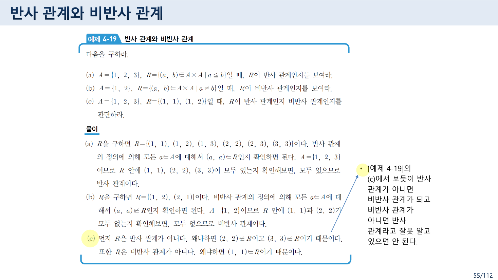
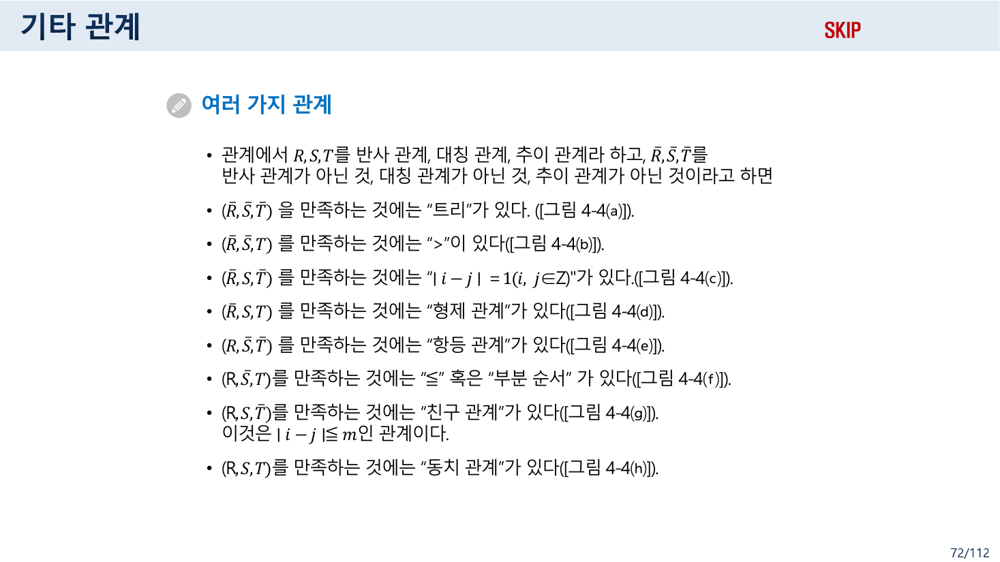
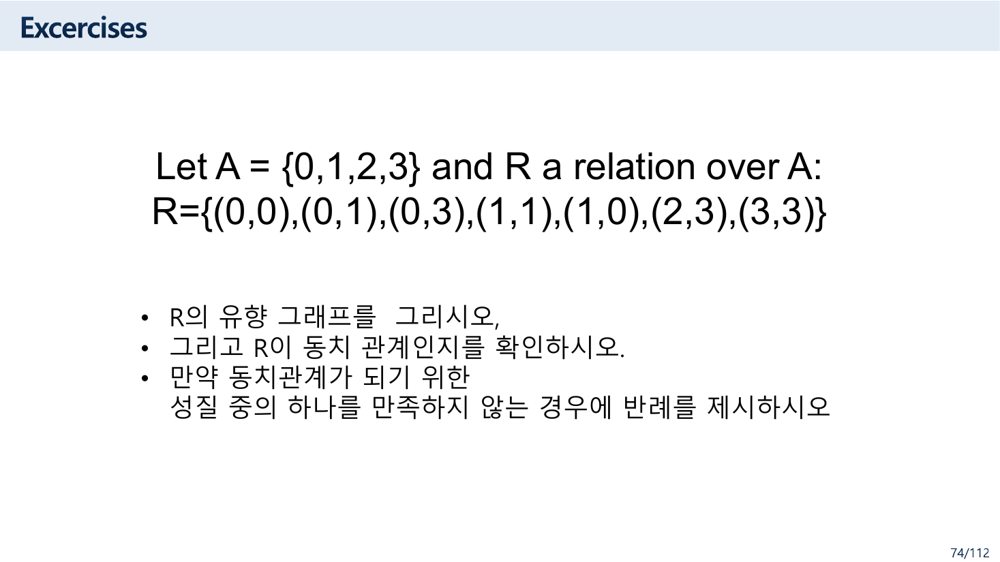
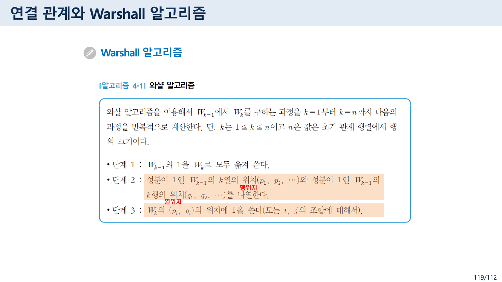
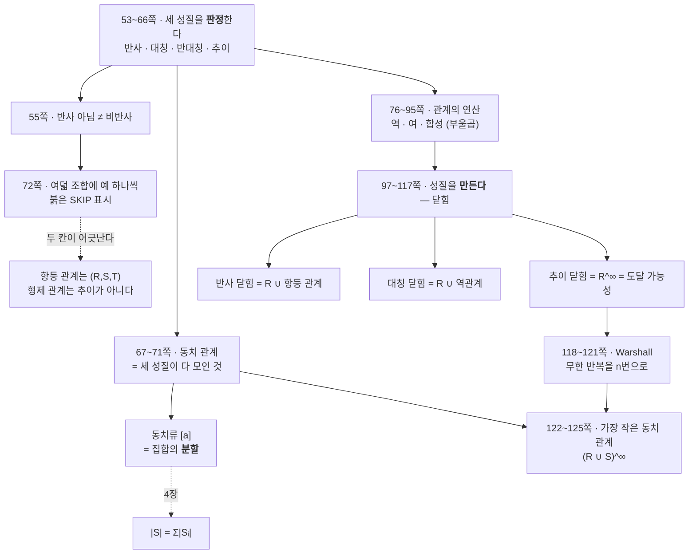

> [!abstract] 이 절이 실제로 하는 말
> 52쪽부터 125쪽까지는 관계 하나를 놓고 **성질**을 묻는다. 반사인가, 대칭인가, 추이인가.
>
> 그런데 이 일흔네 쪽은 도중에 질문을 바꾼다. 앞쪽(53~74쪽)은 **판정**한다 — 이 관계가 그 성질을 가졌는가. 뒤쪽(97~125쪽)은 **생성**한다 — 가지지 못했다면, 그 성질을 갖게 하려면 무엇을 최소한으로 더 넣어야 하는가. 그것이 **닫힘(closure)** 이고, 그 계산을 빠르게 하는 것이 **Warshall 알고리즘**이다.
>
> 그리고 그 두 부분을 잇는 것이 55쪽의 짧은 경고다.
>
> > **반사 관계가 아니면 비반사 관계가 되고 비반사 관계가 아니면 반사 관계라고 잘못 알고 있으면 안 된다.**
>
> 성질은 있음/없음의 스위치가 아니다. 셋 다 없을 수도 있고 일부만 있을 수도 있다. 72쪽이 그것을 표로 확정한다 — **세 성질의 여덟 가지 조합 각각에 예를 하나씩** 붙인 것이다. 이 정리는 그 여덟 칸을 직접 검사하는 데서 시작한다.

---

## 55쪽 — 반사가 아닌 것과 비반사인 것



예제 4-19가 세 경우를 나란히 놓는다.

| | $A$ | $R$ | 판정 |
| --- | --- | --- | --- |
| (a) | $\{1,2,3\}$ | $\{(a,b) \mid a \le b\}$ = `{(1,1),(1,2),(1,3),(2,2),(2,3),(3,3)}` | **반사** — `(1,1),(2,2),(3,3)` 이 모두 있다 |
| (b) | $\{1,2\}$ | $\{(a,b) \mid a \neq b\}$ = `{(1,2),(2,1)}` | **비반사** — `(1,1),(2,2)` 가 모두 없다 |
| (c) | $\{1,2,3\}$ | `{(1,1),(1,2)}` | **둘 다 아니다** |

(c)가 이 쪽의 전부다. `(1,1)` 이 있으므로 비반사가 아니고, `(2,2)` 와 `(3,3)` 이 없으므로 반사도 아니다.

- **반사(reflexive)** — 모든 $a$에 대해 $(a,a) \in R$
- **비반사(irreflexive)** — 모든 $a$에 대해 $(a,a) \notin R$

둘 사이에 **"일부만 있는" 넓은 중간지대**가 있다. 그리고 뒤에서 보듯, 이 구별이 72쪽 표의 한 칸이 채워질 수 있는지 없는지를 가른다.

---

## 여덟 조합

72쪽은 세 성질($R$ 반사, $S$ 대칭, $T$ 추이)과 그 부정($\bar R, \bar S, \bar T$)의 여덟 조합에 예를 하나씩 붙인다.



| 조합 | 원본이 든 예 | 그림 |
| --- | --- | --- |
| $(\bar R, \bar S, \bar T)$ | 트리 | 4-4(a) |
| $(\bar R, \bar S, T)$ | `>` | 4-4(b) |
| $(\bar R, S, \bar T)$ | $\lvert i-j \rvert = 1\;(i,j \in \mathbb{Z})$ | 4-4(c) |
| $(\bar R, S, T)$ | **형제 관계** | 4-4(d) |
| $(R, \bar S, \bar T)$ | **항등 관계** | 4-4(e) |
| $(R, \bar S, T)$ | `≤` 혹은 부분 순서 | 4-4(f) |
| $(R, S, \bar T)$ | 친구 관계 ($\lvert i-j \rvert \le m$) | 4-4(g) |
| $(R, S, T)$ | 동치 관계 | 4-4(h) |

이 표가 이 자료에서 가장 좋은 한 쪽이다. **여덟 칸이 다 채워져 있다면 세 성질은 서로 독립**이라는 뜻이고, 55쪽의 경고가 왜 필요한지도 설명된다.

그런데 이 쪽의 오른쪽 위에는 붉은 글씨로 **`SKIP`** 이 적혀 있다. 다음 쪽(73쪽)에도 같은 표시가 있다. 강의에서 건너뛴 부분이라는 표시다.

아래에서 여덟 칸을 하나씩 검사해 보라. 각 예를 세 원소짜리 집합 위에 실제 순서쌍으로 놓고 정의대로 판정한 것이다.

```html preview h=700px
<div style="font-family:system-ui,-apple-system,sans-serif;color:var(--foreground);padding:18px">
  <div style="font-size:11px;color:var(--muted-foreground);margin-bottom:8px">A = {1, 2, 3} 위에서 각 예를 순서쌍으로 놓고 정의대로 판정한다 — 칸을 눌러 보라</div>
  <div id="cells" style="display:grid;grid-template-columns:repeat(auto-fit,minmax(150px,1fr));gap:8px;margin-bottom:16px"></div>

  <div style="display:flex;gap:20px;flex-wrap:wrap;align-items:flex-start">
    <div>
      <div style="font-size:12px;font-weight:700;margin-bottom:6px" id="cname"></div>
      <table style="border-collapse:collapse;font-family:ui-monospace,monospace;font-size:14px"><tbody id="mx"></tbody></table>
      <div id="pairs" style="margin-top:8px;font-family:ui-monospace,monospace;font-size:12px;color:var(--muted-foreground);max-width:280px"></div>
    </div>
    <div style="flex:1;min-width:280px">
      <div id="verd" style="font-size:13px;line-height:2"></div>
      <div id="cmp" style="margin-top:12px;font-size:13px;line-height:1.7;padding:11px 13px;border-radius:6px;border:1px solid var(--border)"></div>
    </div>
  </div>
</div>
<script>
(function(){
  var A=[1,2,3];
  var CASES=[
    {c:"R̄ S̄ T̄", n:"트리 (부모 관계)", R:[[1,2],[2,3]], note:"1의 자식이 2, 2의 자식이 3"},
    {c:"R̄ S̄ T",  n:"&gt;", R:[[2,1],[3,1],[3,2]], note:""},
    {c:"R̄ S T̄",  n:"|i − j| = 1", R:[[1,2],[2,1],[2,3],[3,2]], note:""},
    {c:"R̄ S T",   n:"형제 관계", R:[[1,2],[2,1],[1,3],[3,1],[2,3],[3,2]], note:"셋이 서로 형제 (자기 자신은 자기 형제가 아니다)"},
    {c:"R S̄ T̄",  n:"항등 관계", R:[[1,1],[2,2],[3,3]], note:"원본 30쪽 정의 4-4: R = {(a, a) | 임의의 a ∈ A}"},
    {c:"R S̄ T",   n:"≤ (부분 순서)", R:[[1,1],[2,2],[3,3],[1,2],[1,3],[2,3]], note:""},
    {c:"R S T̄",   n:"친구 관계 |i − j| ≤ 1", R:[[1,1],[2,2],[3,3],[1,2],[2,1],[2,3],[3,2]], note:"원본의 m 을 1 로 두었다"},
    {c:"R S T",    n:"동치 관계", R:[[1,1],[2,2],[3,3],[1,2],[2,1],[1,3],[3,1],[2,3],[3,2]], note:"A 전체가 한 덩어리"}
  ];
  var cur=4;
  function has(R,a,b){ return R.some(function(p){return p[0]===a&&p[1]===b;}); }
  function props(R){
    var refl=A.every(function(a){return has(R,a,a);});
    var irr=A.every(function(a){return !has(R,a,a);});
    var sym=R.every(function(p){return has(R,p[1],p[0]);});
    var symBad=R.filter(function(p){return !has(R,p[1],p[0]);});
    var trBad=[];
    R.forEach(function(p){ R.forEach(function(q){ if(p[1]===q[0] && !has(R,p[0],q[1])) trBad.push([p,q]); }); });
    return {refl:refl, irr:irr, sym:sym, symBad:symBad, trans:trBad.length===0, trBad:trBad};
  }
  function draw(){
    var ch=document.getElementById('cells'); ch.innerHTML="";
    CASES.forEach(function(C,i){
      var b=document.createElement('button');
      b.innerHTML="<div style='font-family:ui-monospace,monospace;font-size:12px;opacity:.75'>"+C.c+"</div><div style='font-size:12.5px;font-weight:600;margin-top:2px'>"+C.n+"</div>";
      var on=(i===cur);
      b.style.cssText="padding:8px 10px;border-radius:7px;cursor:pointer;text-align:left;border:1px solid "+(on?"var(--chart-1)":"var(--border)")+
        ";background:"+(on?"var(--chart-1)":"var(--card)")+";color:"+(on?"var(--card)":"var(--foreground)");
      b.onclick=function(){ cur=i; draw(); };
      ch.appendChild(b);
    });
    var C=CASES[cur], P=props(C.R);
    document.getElementById('cname').innerHTML=C.n+" <span style='font-family:ui-monospace,monospace;color:var(--muted-foreground)'>("+C.c+" 칸)</span>";

    var head="<tr><th style='padding:4px 8px;border:1px solid var(--border);font-size:11px;color:var(--muted-foreground)'>＼</th>"+
      A.map(function(j){return "<th style='padding:4px 13px;border:1px solid var(--border)'>"+j+"</th>";}).join("")+"</tr>";
    var body=A.map(function(i){
      return "<tr><th style='padding:4px 10px;border:1px solid var(--border)'>"+i+"</th>"+
        A.map(function(j){
          var v=has(C.R,i,j), diag=(i===j);
          return "<td style='padding:5px 13px;border:1px solid var(--border);text-align:center;font-weight:"+(v?700:400)+
            ";background:"+(v? (diag?"var(--chart-3, var(--chart-1))":"var(--chart-1)") :"transparent")+
            ";color:"+(v?"var(--card)":"var(--muted-foreground)")+"'>"+(v?1:0)+"</td>";
        }).join("")+"</tr>";
    }).join("");
    document.getElementById('mx').innerHTML=head+body;
    document.getElementById('pairs').innerHTML =
      "R = {" + C.R.map(function(p){return "("+p[0]+","+p[1]+")";}).join(", ") + "}" + (C.note? "<br>"+C.note : "");

    function ln(ok,t,x){ return "<div style='color:"+(ok?"var(--chart-2, var(--foreground))":"var(--chart-1)")+"'>"+(ok?"✔":"✘")+" "+t+
      (x?" <span style='color:var(--muted-foreground)'>"+x+"</span>":"")+"</div>"; }
    var v=document.getElementById('verd');
    v.innerHTML =
      ln(P.refl,"반사 — 주대각선이 전부 1", P.refl?"":"("+A.filter(function(a){return !has(C.R,a,a);}).map(function(a){return "("+a+","+a+") 없음";}).join(", ")+")")+
      ln(P.irr,"비반사 — 주대각선이 전부 0", P.irr?"":"(대각선에 1이 있다)")+
      ln(P.sym,"대칭", P.sym?"":"(("+P.symBad[0][0]+","+P.symBad[0][1]+") 는 있는데 반대가 없다)")+
      ln(P.trans,"추이", P.trans?"":"(("+P.trBad[0][0][0]+","+P.trBad[0][0][1]+")·("+P.trBad[0][1][0]+","+P.trBad[0][1][1]+") → ("+P.trBad[0][0][0]+","+P.trBad[0][1][1]+") 없음)");

    var actual = (P.refl?"R":"R̄")+" "+(P.sym?"S":"S̄")+" "+(P.trans?"T":"T̄");
    var same = actual.replace(/\s/g,"")===C.c.replace(/\s/g,"");
    var cm=document.getElementById('cmp');
    cm.style.borderColor = same? "var(--chart-2, var(--border))":"var(--chart-1)";
    cm.innerHTML = same
      ? "원본이 배치한 칸 <b>"+C.c+"</b> 과 실제 판정이 일치한다."
      : "<b>원본은 "+C.c+" 칸에 두었지만, 실제 판정은 "+actual+" 이다.</b>";
  }
  draw();
})();
</script>
```

여덟 중 **여섯은 원본과 일치**한다. 두 칸이 갈린다.

> [!warning] 원본 오류 ① — 항등 관계는 $(R, \bar S, \bar T)$ 가 아니다
> 72쪽은 $(R, \bar S, \bar T)$ 칸, 즉 **반사이지만 대칭도 추이도 아닌** 관계의 예로 **항등 관계**를 든다.
>
> 그런데 같은 자료 30쪽이 항등 관계를 이렇게 정의한다.
>
> > **정의 4-4 항등 관계**: $A$를 임의의 집합이라 하자. 이때 $A$에 관한 관계 $R = \{(a, a) \mid \text{임의의 } a \in A\}$ 를 $A$에 관한 **항등 관계**(identity relation)라고 한다.
>
> 이 관계는 세 성질을 **모두** 만족한다.
>
> - **반사** — 정의 그대로 모든 $(a,a)$ 가 들어 있다
> - **대칭** — $R$ 안의 순서쌍은 전부 $(a,a)$ 꼴이므로 뒤집어도 자기 자신이다
> - **추이** — $(a,b), (b,c) \in R$ 이면 $a = b = c$ 이므로 $(a,c) = (a,a) \in R$
>
> 즉 항등 관계는 $(R, S, T)$ — **동치 관계**다. 그것도 122쪽이 다루는 **가장 작은 동치 관계**다. 72쪽의 배치는 여덟 칸 중 정반대에 가까운 칸에 놓았다.

두 번째 칸은 조금 더 미묘하다.

> [!warning] 원본 오류 ② — 형제 관계는 추이가 아니다
> 72쪽은 $(\bar R, S, T)$ 칸에 **형제 관계**를 둔다. 대칭인 것은 맞다 — a가 b의 형제이면 b도 a의 형제다. 문제는 추이다.
>
> a와 b가 형제이고 b와 a가 형제라면, 추이가 성립하려면 **a와 a가 형제**여야 한다. 그런데 자기 자신은 자기 형제가 아니다. 그러므로 형제 관계는 추이가 아니고, 실제 칸은 $(\bar R, S, \bar T)$ — **바로 위 줄의 $\lvert i-j \rvert = 1$ 과 같은 칸**이다.
>
> 이것은 사소한 실수가 아니라 **일반적인 사실**의 한 사례다. 관계가 대칭이고 추이이면서 순서쌍을 하나라도 가지면, 그 안에서 $(a,b) \Rightarrow (b,a) \Rightarrow (a,a)$ 가 강제된다. **대칭 + 추이 + 순서쌍 하나 이상 ⇒ 반드시 어떤 $(a,a)$ 를 갖는다.**
>
> 그래서 $\bar R$ 을 **비반사**로 읽으면 그 칸에는 공관계 $\varnothing$ 밖에 들어갈 수 없다. 세 원소짜리 집합 위의 512개 관계를 전부 검사해 확인했다 — 비어 있지 않으면서 비반사·대칭·추이인 관계는 **0개**다.
>
> 다만 원본은 $\bar R$ 을 "**반사 관계가 아닌 것**"이라 정의했으므로(72쪽 첫 줄), 그 칸이 완전히 비지는 않는다. $A = \{1,2,3\}$ 위의 $R = \{(1,1),(1,2),(2,1),(2,2)\}$ 처럼 **집합의 일부에서만 반사인** 관계가 들어간다. `3` 이 어디에도 참여하지 않아서 반사는 아니지만, 대칭이고 추이다.
>
> **55쪽의 경고가 여기서 실제로 결정적이다.** "반사가 아님"과 "비반사"를 같은 것으로 읽으면 이 칸은 텅 비고, 구별해서 읽으면 채워진다. 55쪽과 72쪽이 열일곱 쪽 떨어져 있고 72쪽에 `SKIP` 이 붙어 있어서, 두 쪽을 잇는 이 관계는 강의에서 드러나기 어렵다.

어긋난 두 칸을 짚었으니 나머지도 확인해 두자.

> [!tip] 원본이 맞힌 여섯 칸
> 나머지 여섯은 검사를 통과한다. 특히 세 개가 눈여겨볼 만하다.
>
> - **`>` 가 $(\bar R, \bar S, T)$** — 순서 관계는 반사가 아니면서 추이일 수 있다. `≤` 와 비교하면 반사 여부만 갈린다
> - **친구 관계 $\lvert i-j \rvert \le m$ 이 $(R, S, \bar T)$** — "가까움"은 추이가 아니다. 1과 2가 가깝고 2와 3이 가까워도 1과 3은 멀 수 있다. 이것이 동치 관계와 갈리는 가장 흔한 지점이다
> - **트리가 $(\bar R, \bar S, \bar T)$** — 부모-자식 관계는 셋 다 아니다. 조상-자손으로 바꾸면 추이가 붙어 `>` 와 같은 칸이 된다

---

## 동치 관계 — 세 성질이 다 모이면

67~71쪽. 세 성질이 모두 모인 관계가 동치 관계이고, 67쪽이 그 그래프의 모양을 셋으로 정리한다.

> (1) $R$는 반사 관계이므로 **모든 정점들은 길이가 1인 순환**을 가진다
> (2) $R$는 대칭 관계이므로 유향 그래프가 아닌 **무향 그래프**를 갖는다
> (3) $R$는 추이 관계이므로 $a$에서 $b$로 가는 간선이 있고 $b$에서 $c$로 가는 간선이 있으면 **$a$에서 $c$로 가는 간선이 존재**하게 된다
> — 원본 67쪽

세 조건을 합치면 그림이 정해진다 — **여러 개의 완전 그래프 덩어리**. 덩어리 안에서는 모든 점이 모든 점과 이어져 있고, 덩어리끼리는 전혀 이어지지 않는다.

71쪽이 그 덩어리에 이름을 준다.

> $a \in A$ 에 대해서 집합 $[a] = \{x \in A \mid x\,R\,a\}$ 를 $a$에 관한 **동치류**라 하고 $[a]$ 로 표시한다. 동치류 $[a]$ 는 결코 공집합(∅)이 될 수 없다. 왜냐하면 $R$가 반사 관계이므로 $a \in [a]$ 이기 때문이다.
> — 원본 71쪽

**여기서 [4장](<./04. 두 번 다시 정의되는 「센다」.md>)의 분할이 돌아온다.** 동치류들은 공집합이 아니고(71쪽), 서로 겹치지 않고, 다 합치면 $A$ 가 된다 — 정확히 32쪽의 분할 조건이다.

$$\text{집합 위의 동치 관계} \;\longleftrightarrow\; \text{그 집합의 분할}$$

두 장에서 따로 배운 개념이 같은 것의 두 얼굴이다. 관계 쪽에서 보면 "누구와 누가 같은가"이고, 집합 쪽에서 보면 "덩어리를 어떻게 나누는가"다. 그래서 [4장](<./04. 두 번 다시 정의되는 「센다」.md>)의 세기가 여기서도 통한다 — 동치류로 나눈 뒤에는 **그냥 더하면 된다.**

74쪽이 연습문제를 준다.



$$A = \{0,1,2,3\}, \quad R = \{(0,0),(0,1),(0,3),(1,1),(1,0),(2,3),(3,3)\}$$

세 성질을 모두 검사하면 이렇다.

| 성질 | 결과 | 반례 |
| --- | --- | --- |
| 반사 | ✘ | $(2,2) \notin R$ |
| 대칭 | ✘ | $(0,3) \in R$ 인데 $(3,0) \notin R$ / $(2,3) \in R$ 인데 $(3,2) \notin R$ |
| 추이 | ✘ | $(1,0), (0,3) \in R$ 인데 $(1,3) \notin R$ |

**셋 다 실패**한다. 72쪽 표의 맨 첫 칸 $(\bar R, \bar S, \bar T)$ 에 해당한다. 문제가 "동치 관계가 되기 위한 성질 중의 **하나**를 만족하지 않는 경우에 반례를 제시하시오"라고 물었지만, 실제로는 셋 다 반례가 있다.

---

## 성질을 만들어 붙이기 — 닫힘

97쪽부터 질문이 뒤집힌다.

> 이미 1장에서, 산술 연산에 대한 닫힘부터 집합에서의 닫힘 성질들을 설명했다.
> — 원본 97쪽

관계 $R$ 이 어떤 성질을 갖지 못했을 때, **그 성질을 갖는 관계 중 $R$ 을 포함하는 가장 작은 것**을 그 성질의 닫힘이라 한다. "가장 작은"이 핵심이다 — 아무거나 잔뜩 집어넣어 성질을 만족시키는 것은 쉽고, **꼭 필요한 것만** 넣는 것이 닫힘이다.

| 닫힘 | 쪽 | 무엇을 더하는가 |
| --- | --- | --- |
| 반사 닫힘 | 98·99 | 빠진 $(a,a)$ 를 전부 — 즉 $R \cup I_A$ (항등 관계와의 합집합) |
| 대칭 닫힘 | 100·101 | 빠진 반대 방향을 전부 — 즉 $R \cup R^{-1}$ (역관계와의 합집합) |
| 추이 닫힘 | 102~117 | 이어지는 것을 전부 — **여기가 어렵다** |

앞의 둘은 한 번에 끝난다. 반사 닫힘은 76~81쪽의 **역관계**와 82~95쪽의 **합성 관계**를 쓰면 한 줄로 적힌다. 추이 닫힘이 어려운 이유는 **더하면 또 더할 것이 생기기** 때문이다. $(a,b)$ 와 $(b,c)$ 때문에 $(a,c)$ 를 넣으면, 이제 $(a,c)$ 와 $(c,d)$ 때문에 $(a,d)$ 를 넣어야 한다.

105쪽이 그 끝을 짚는다.

> [정리 4-8]에 의하면 $R$의 **추이 닫힘은 연결 관계 $R^{\infty}$** 라는 것을 알았다.
> — 원본 105쪽

$R^\infty = R \cup R^2 \cup R^3 \cup \cdots$ — 길이가 1인 경로, 2인 경로, 3인 경로… 로 도달할 수 있는 모든 짝. [앞 글](<./05. 짝이 먼저이고 관계는 그 부분집합이다.md>)의 경로가 여기서 회수된다. **추이 닫힘 = 도달 가능성**이다.

118쪽이 문제를 정리한다.

> **연결 관계를 구하는 방법**
>
> 1. 유향 그래프를 이용하는 방법 : 복잡해지면 완전하게 구하는 것이 어려움
> 2. 관계 행렬을 이용하는 방법 : **무한번 반복 계산해야 한다는 문제점**
> ❖ 1)과 2)의 문제점을 해결하는 방법이 **Warshall 법칙**
> — 원본 118쪽

---

## Warshall — 무한을 $n$번으로



착상은 이렇다. $R^\infty$ 를 구하려고 $R^1, R^2, R^3, \ldots$ 을 끝없이 곱하는 대신, **중간에 거쳐 갈 수 있는 정점을 하나씩 늘려 간다.**

$W_k$ 를 "정점 $1$부터 $k$까지만 중간 경유지로 쓸 수 있을 때의 도달 관계"라고 하면, $W_0 = M_R$ (경유 없음)이고 $W_n = M_{R^\infty}$ (모든 정점을 경유지로 쓸 수 있음)이다. 그리고 $W_{k-1}$ 에서 $W_k$ 로 넘어갈 때 하는 일은 한 가지 — **$k$번 열에 1이 있는 행**과 **$k$번 행에 1이 있는 열**을 짝지어 1을 채운다. $i \to k \to j$ 로 갈 수 있다는 뜻이기 때문이다.

120·121쪽의 예제 4-41을 단계별로 따라가 보라.

```html preview h=660px
<div style="font-family:system-ui,-apple-system,sans-serif;color:var(--foreground);padding:18px">
  <div style="display:flex;gap:9px;align-items:center;flex-wrap:wrap;margin-bottom:16px">
    <button id="prev" style="padding:7px 14px;font-size:13px;border-radius:6px;cursor:pointer;border:1px solid var(--border);background:var(--card);color:var(--foreground)">← 이전</button>
    <button id="next" style="padding:7px 14px;font-size:13px;border-radius:6px;cursor:pointer;border:1px solid var(--chart-1);background:var(--chart-1);color:var(--card)">다음 →</button>
    <span id="stage" style="font-size:13px;font-family:ui-monospace,monospace;color:var(--muted-foreground)"></span>
  </div>

  <div style="display:flex;gap:24px;flex-wrap:wrap;align-items:flex-start">
    <div>
      <div style="font-size:12px;font-weight:700;margin-bottom:6px" id="mlabel"></div>
      <table style="border-collapse:collapse;font-family:ui-monospace,monospace;font-size:15px"><tbody id="wm"></tbody></table>
      <div style="margin-top:8px;font-size:11px;color:var(--muted-foreground)">
        <span style="display:inline-block;width:11px;height:11px;background:var(--chart-3, var(--chart-1));border-radius:2px;vertical-align:-1px"></span> 이번 단계에 새로 켜진 칸 &nbsp;
        <span style="display:inline-block;width:11px;height:11px;background:var(--muted, var(--border));border-radius:2px;vertical-align:-1px"></span> 경유지 k 의 행·열
      </div>
    </div>
    <div>
      <div style="font-size:12px;font-weight:700;margin-bottom:6px">유향 그래프</div>
      <svg id="gr" viewBox="0 0 230 190" style="width:230px;height:190px;border:1px solid var(--border);border-radius:var(--radius,8px);background:var(--card)"></svg>
    </div>
    <div style="flex:1;min-width:250px">
      <div id="say" style="font-size:13px;line-height:1.85"></div>
    </div>
  </div>
</div>
<script>
(function(){
  var N=4;
  var W0=[[0,1,0,0],[1,0,1,0],[0,0,0,1],[0,0,0,0]];   // 원본 120·121쪽 예제 4-41
  var steps=[{m:W0.map(function(r){return r.slice();}), k:0, added:[]}];
  for(var k=0;k<N;k++){
    var prev=steps[steps.length-1].m;
    var cur=prev.map(function(r){return r.slice();});
    var added=[];
    for(var i=0;i<N;i++) for(var j=0;j<N;j++){
      if(!prev[i][j] && prev[i][k] && prev[k][j]){ cur[i][j]=1; added.push([i,j]); }
    }
    steps.push({m:cur, k:k+1, added:added});
  }
  var EDGES=[[1,2],[2,1],[2,3],[3,4]];
  var pos={1:[45,50],2:[160,50],3:[160,145],4:[45,145]};
  var t=0;

  function draw(){
    var S=steps[t];
    document.getElementById('stage').textContent = "단계 " + t + " / " + (steps.length-1);
    document.getElementById('mlabel').innerHTML = t===0? "W<sub>0</sub> = M<sub>R</sub> (경유지 없음)" : "W<sub>"+t+"</sub> — 정점 1 ~ "+t+" 까지 경유 가능";

    var head="<tr><th style='padding:4px 8px;border:1px solid var(--border);font-size:11px;color:var(--muted-foreground)'>＼</th>";
    for(var j=1;j<=N;j++) head+="<th style='padding:4px 13px;border:1px solid var(--border);background:"+((S.k===j&&t>0)?"var(--muted, transparent)":"transparent")+"'>"+j+"</th>";
    head+="</tr>";
    var body="";
    for(var i=1;i<=N;i++){
      body+="<tr><th style='padding:4px 11px;border:1px solid var(--border);background:"+((S.k===i&&t>0)?"var(--muted, transparent)":"transparent")+"'>"+i+"</th>";
      for(var j2=1;j2<=N;j2++){
        var v=S.m[i-1][j2-1];
        var isNew=S.added.some(function(p){return p[0]===i-1&&p[1]===j2-1;});
        var kline=(t>0 && (S.k===i || S.k===j2));
        body+="<td style='padding:6px 13px;border:1px solid var(--border);text-align:center;font-weight:"+(v?700:400)+
          ";background:"+(isNew?"var(--chart-3, var(--chart-1))":(v?"var(--chart-1)":(kline?"var(--muted, transparent)":"transparent")))+
          ";color:"+(v?"var(--card)":"var(--muted-foreground)")+"'>"+v+"</td>";
      }
      body+="</tr>";
    }
    document.getElementById('wm').innerHTML=head+body;

    var s='<defs><marker id="w1" markerWidth="8" markerHeight="8" refX="7" refY="3" orient="auto"><path d="M0,0 L6,3 L0,6 z" fill="var(--muted-foreground)"/></marker>'+
          '<marker id="w2" markerWidth="8" markerHeight="8" refX="7" refY="3" orient="auto"><path d="M0,0 L6,3 L0,6 z" fill="var(--chart-1)"/></marker></defs>';
    for(var a=1;a<=N;a++) for(var b=1;b<=N;b++){
      if(!S.m[a-1][b-1]) continue;
      var orig=EDGES.some(function(e){return e[0]===a&&e[1]===b;});
      var col=orig?"var(--foreground)":"var(--chart-1)";
      var mk=orig?"w1":"w2";
      if(a===b){
        var p=pos[a];
        s+='<path d="M'+(p[0]+7)+','+(p[1]-9)+' a 12 12 0 1 1 -5 -11" fill="none" stroke="'+col+'" stroke-width="1.5" marker-end="url(#'+mk+')"/>';
      } else {
        var u=pos[a], w=pos[b];
        var dx=w[0]-u[0], dy=w[1]-u[1], L=Math.sqrt(dx*dx+dy*dy);
        var ox=-dy/L*4, oy=dx/L*4;
        s+='<line x1="'+(u[0]+dx/L*13+ox).toFixed(1)+'" y1="'+(u[1]+dy/L*13+oy).toFixed(1)+
           '" x2="'+(w[0]-dx/L*14+ox).toFixed(1)+'" y2="'+(w[1]-dy/L*14+oy).toFixed(1)+
           '" stroke="'+col+'" stroke-width="'+(orig?1.7:1.2)+'" marker-end="url(#'+mk+')"'+(orig?"":' stroke-dasharray="3 3"')+'/>';
      }
    }
    for(var v2=1;v2<=N;v2++){
      var p2=pos[v2];
      var isk=(t>0 && S.k===v2);
      s+='<circle cx="'+p2[0]+'" cy="'+p2[1]+'" r="12" fill="'+(isk?"var(--chart-1)":"var(--card)")+'" stroke="var(--foreground)"/>';
      s+='<text x="'+p2[0]+'" y="'+(p2[1]+4)+'" text-anchor="middle" font-size="12" fill="'+(isk?"var(--card)":"var(--foreground)")+'">'+v2+'</text>';
    }
    document.getElementById('gr').innerHTML=s;

    var txt;
    if(t===0){
      txt="<b>W₀ = M_R</b> — 원본 예제 4-41의 관계 행렬이다.<br>R = {(1,2), (2,1), (2,3), (3,4)}<br><br>실선 화살표가 원래 간선이고, 앞으로 추가되는 것은 <span style='color:var(--chart-1)'>점선</span>으로 표시된다.";
    } else {
      var lst=S.added.map(function(p){return "("+(p[0]+1)+","+(p[1]+1)+")";}).join(", ");
      txt="<b>k = "+S.k+"</b> — "+S.k+"번 정점을 경유지로 허용한다.<br><br>"+
        (S.added.length? "새로 켜진 칸: <b style='color:var(--chart-1)'>"+lst+"</b><br><span style='color:var(--muted-foreground)'>"+
          S.added.map(function(p){return (p[0]+1)+" → "+S.k+" → "+(p[1]+1);}).join("<br>")+"</span>"
        : "<b>새로 켜지는 칸이 없다.</b> <span style='color:var(--muted-foreground)'>"+S.k+"행에 1이 하나도 없어서 "+S.k+"를 거쳐 나갈 수가 없다 — 원본이 “W₄ = W₃ 이다”라고 적은 자리다.</span>");
      if(t===steps.length-1) txt+="<br><br><b style='color:var(--chart-2, var(--foreground))'>M_{R^∞} = W₄.</b> 원본 121쪽의 마지막 문장 그대로다.";
    }
    document.getElementById('say').innerHTML=txt;
  }
  document.getElementById('next').onclick=function(){ if(t<steps.length-1){t++;draw();} };
  document.getElementById('prev').onclick=function(){ if(t>0){t--;draw();} };
  draw();
})();
</script>
```


각 단계의 행렬이 121쪽에 적힌 것과 정확히 일치한다.

| 단계 | 행렬 | 원본의 설명 |
| --- | --- | --- |
| $W_0$ | `0100 / 1010 / 0001 / 0000` | 관계 행렬 |
| $W_1$ | `0100 / 1110 / 0001 / 0000` | "1열 위치 (2), 1행 위치 (2) → (2,2)" |
| $W_2$ | `1110 / 1110 / 0001 / 0000` | "2열 위치 (1,2), 2행 위치 (1,2,3) → (1,1),(1,2),(1,3),(2,1),(2,2),(2,3)" |
| $W_3$ | `1111 / 1111 / 0001 / 0000` | "3열 위치 (1,2), 3행 위치 (4) → (1,4),(2,4) 추가" |
| $W_4$ | $= W_3$ | "4행의 어느 열에도 1이 위치하지 않으므로 1이 더 이상 추가되지는 않는다" |

$k=2$ 단계가 가장 크게 움직인다. 2번 정점이 1과 3을 잇는 유일한 다리이기 때문이다. 그리고 $k=4$ 에서 아무 일도 일어나지 않는 이유가 분명하다 — **4번 정점에서 나가는 간선이 없다.** 들어오기만 하는 정점은 경유지가 될 수 없다.

이 알고리즘의 값어치는 118쪽이 말한 "무한번 반복 계산"이 **$n$번**으로 줄어든다는 데 있다. 정점이 $n$개면 $k$를 1부터 $n$까지 돌리면 끝이고, 각 단계가 $n^2$ 칸을 보므로 전체가 $O(n^3)$ 이다.

> [!tip] 이 알고리즘을 다시 만나는 곳
> 같은 구조가 `Appendix 1 Floyd Warshall Algorithm.pdf` 에서 **최단 경로**로 다시 나온다. 도달 가능성(있다/없다)을 거리(얼마나 먼가)로 바꾸면 `∨` 가 `min` 이 되고 `∧` 가 `+` 가 된다. [앞 글](<./05. 짝이 먼저이고 관계는 그 부분집합이다.md>)에서 본 45쪽의 **부울곱**이 왜 중요한지가 여기서 드러난다 — 곱과 합을 무엇으로 정하느냐에 따라 같은 삼중 루프가 다른 문제를 푼다.

---

## 마지막 네 쪽 — 가장 작은 동치 관계

122~125쪽이 이 자료의 끝이다.

> **정리 4-9 가장 작은 동치 관계**: $R$과 $S$를 집합 $A$에 관한 동치 관계라 할 때, $R$과 $S$를 둘 다 포함하는 가장 작은 동치 관계는 **연결 관계 $(R \cup S)^{\infty}$** 이다.
> — 원본 122쪽

두 동치 관계를 합치면 대칭과 반사는 유지되지만 **추이가 깨진다**. $R$ 로 $a \sim b$ 이고 $S$ 로 $b \sim c$ 일 때 합집합에는 $(a,c)$ 가 없기 때문이다. 그래서 추이 닫힘 $(\;)^\infty$ 을 한 번 씌워야 하고, 그것을 계산하는 것이 방금 본 Warshall이다.

**이 자료의 마지막 정리가 앞의 모든 것을 한 줄로 묶는다** — 성질(동치), 연산(합집합), 닫힘(추이), 알고리즘(Warshall).

같은 쪽에 정의가 하나 더 실려 있는데, 번호가 눈에 띈다.

> **정의 7-23 동치관계(Equivalence Relation)**: 반사관계, 대칭관계, 추이관계가 모두 성립하는 관계

**`정의 7-23`** 이다. 이 자료의 다른 정의들은 `정의 4-4`, `정리 4-8`, `정리 4-9` 처럼 4장 번호를 쓴다. 뒤에 덧붙인 네 쪽(122~125)이 **다른 교재의 7장에서 옮겨 온 것**임을 번호가 드러낸다. [앞 글](<./05. 짝이 먼저이고 관계는 그 부분집합이다.md>)에서 확인한 쪽 번호 이상(`113/112`~`125/112`)이 정확히 이 구간에서 시작하는 것과 맞아떨어진다.

---

## 이 절의 지도



---

## 원본에서 발견한 것

| # | 쪽 | 내용 |
| --- | --- | --- |
| ① | 72 | **항등 관계**를 $(R, \bar S, \bar T)$ 칸에 두었으나, 30쪽의 정의대로면 반사·대칭·추이를 모두 만족하는 $(R,S,T)$ — 동치 관계다 |
| ② | 72 | **형제 관계**를 $(\bar R, S, T)$ 칸에 두었으나 추이가 아니다. 실제로는 $(\bar R, S, \bar T)$ — $\lvert i-j\rvert = 1$ 과 같은 칸 |
| ③ | 122 | `정의 7-23` — 4장 자료에 7장 번호의 정의가 섞여 있다 (뒤에 덧붙인 네 쪽) |
| ④ | 74 | "동치 관계가 되기 위한 성질 중의 **하나**를 만족하지 않는 경우"라고 물었으나, 주어진 $R$ 은 **세 성질 모두** 실패한다 |

①과 ②가 같은 쪽에 몰려 있고, 그 쪽에 `SKIP` 이 붙어 있다는 점이 공교롭다. **여덟 칸이 다 채워진 표는 이 자료에서 가장 좋은 한 쪽인데, 두 칸이 어긋나 있고 강의에서는 건너뛰었다.**

> [!important] ②가 드러내는 더 큰 사실
> 형제 관계가 잘못 배치된 것 자체보다, **그 칸을 채우기가 원래 어렵다**는 사실이 중요하다.
>
> 대칭이고 추이인 관계는 자기가 건드리는 원소들 위에서 자동으로 반사가 된다. 그래서 $(\bar R, S, T)$ 칸에 들어가려면 **집합의 일부는 아예 건드리지 않는** 관계여야 한다. $A = \{1,2,3\}$ 에서 `3` 을 완전히 버려 두고 $R = \{(1,1),(1,2),(2,1),(2,2)\}$ 로 두면 된다.
>
> 이런 관계를 부분 동치 관계(partial equivalence relation)라 부르는데, 원본은 이 이름을 쓰지 않는다. 그래서 이 칸의 예를 찾기 어려웠고, 눈에 익은 "형제 관계"를 넣은 것으로 보인다.
>
> [4장](<./04. 두 번 다시 정의되는 「센다」.md>) 10쪽에서도 비슷한 일이 있었다 — `셀 수 없는 유한 집합` 이라는 **채울 수 없는 칸**을 만들어 놓았다. **두 자료 모두 격자를 그려 놓고 어려운 칸을 억지로 채웠다.** 격자가 깔끔할수록 한 번 더 의심해 볼 일이다.

---

## 근거 자료

- `sources/4 관계 및 함수.pdf` — 52~125쪽 (전체 125쪽 중 4.4~4.6절)
  - 55쪽 · 예제 4-19와 경고 (인용: `ch06-p55`)
  - 72쪽 · 여덟 가지 조합 (인용: `ch06-p72`) — **원본 오류 ①·②**
  - 74쪽 · 동치 관계 판별 연습 (인용: `ch06-p74`) — **원본 문제 ④**
  - 119쪽 · Warshall 알고리즘 (인용: `ch06-p119`)
  - 121쪽 · 단계별 계산 (인용: `ch06-p121`)
  - 30·53·54·56~71·73·76~118·120·122~125쪽 — 본문의 인용문과 표에 반영. **원본 문제 ③** 은 122쪽
- 72쪽 여덟 조합은 $A = \{1,2,3\}$ 위에 각 예를 순서쌍으로 놓고 정의대로 판정해 대조했다(위 인터랙티브가 같은 검사를 다시 수행한다). "비어 있지 않으면서 비반사·대칭·추이인 관계는 없다"는 주장은 $A$ 위의 관계 **512개를 전부 열거해** 확인했다
- 74쪽 연습문제의 세 반례와 121쪽의 $W_0 \sim W_4$ 는 파이썬으로 계산해 원본과 대조했으며, Warshall 인터랙티브는 원본 예제 4-41의 관계 $R = \{(1,2),(2,1),(2,3),(3,4)\}$ 에서 출발한다
- "부분 동치 관계"라는 용어와 Floyd-Warshall과의 연결은 원본에 없는 보충이며 그렇게 밝혔다

## 이어지는 글

- [05. 짝이 먼저이고, 관계는 그 부분집합이다](<./05. 짝이 먼저이고 관계는 그 부분집합이다.md>) — 같은 자료 1~51쪽
- [04. 두 번 다시 정의되는 「센다」](<./04. 두 번 다시 정의되는 「센다」.md>) — 동치류가 곧 분할이다
