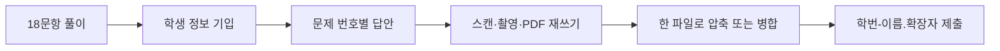

Homework I는 총 18문항, 문항당 10점으로 총점 180점이다. 답안에는 분반번호·학번·이름과 문제 번호별 답을 포함한다.



<Tabs>
  <Tab label="형식">수기 형태의 문서 또는 그와 유사한 답안 형식을 사용한다.</Tab>
  <Tab label="제출">스캔·촬영·PDF 위 재쓰기 후 하나의 파일로 합친다.</Tab>
  <Tab label="파일명">학번-이름.확장자명 규칙을 지킨다.</Tab>
</Tabs>

```html preview
<div style="font-family:system-ui,sans-serif;padding:20px;color:var(--foreground)">
<label for="amt" style="font-size:14px;font-weight:600">과제 점검</label>
<div id="out" style="font-size:30px;font-weight:700;color:var(--chart-1);margin:6px 0">1단계</div>
<input id="amt" type="range" min="1" max="4" step="1" value="1" style="width:100%;accent-color:var(--primary)" />
<p style="font-size:13px;color:var(--muted-foreground)">원본 장·절 순서를 움직여 현재 개념 묶음을 확인한다.</p>
<script>
var amt=document.getElementById('amt'); var out=document.getElementById('out');
amt.addEventListener('input',function(){out.textContent=Number(amt.value).toLocaleString()+'단계';});
</script>
</div>
```

> [!WARNING]
> 과제 원본은 출처를 남기지 않으면 0점 처리된다는 주의가 있다. 실제 제출 가능 여부와 최신 LMS 공지는 별도로 확인한다.

<details>
<summary>제출 전 체크</summary>

문항 누락 없음 → 학생 정보 기입 → 문제 번호 대응 확인 → 한 파일로 압축/병합 → 학번-이름 형식 확인.

</details>

<!-- source: Homework I PDF; 18-question scoring and submission rules preserved -->