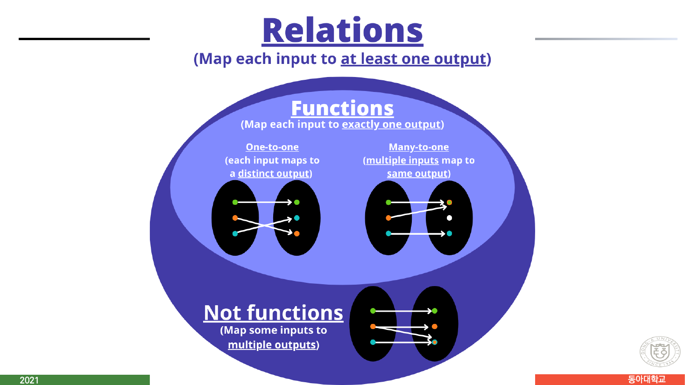
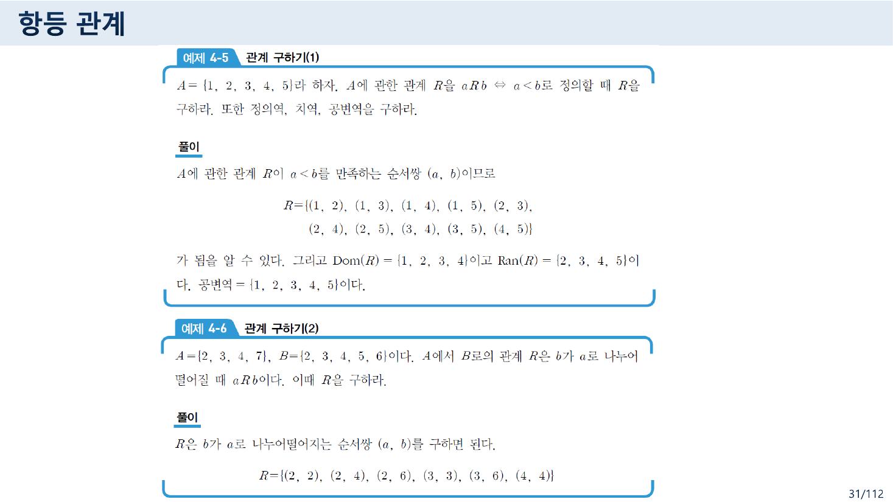
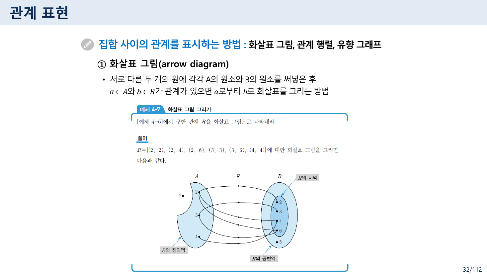
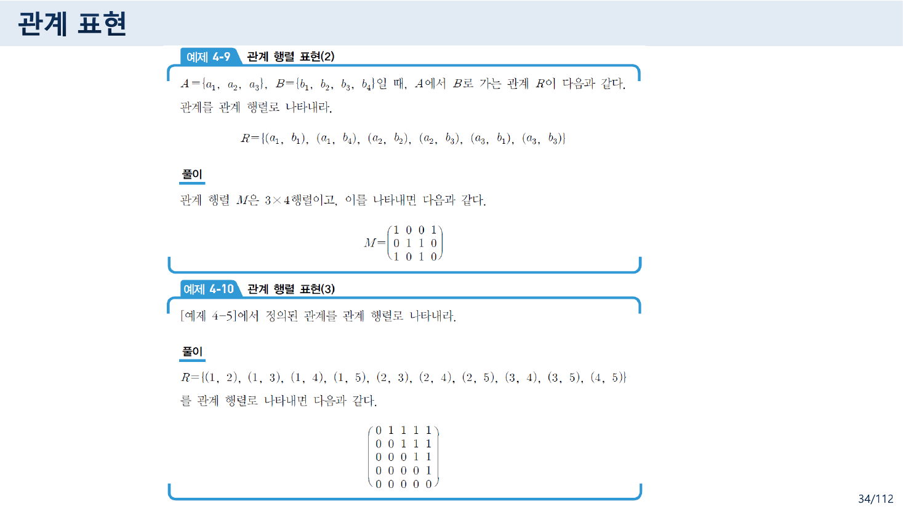
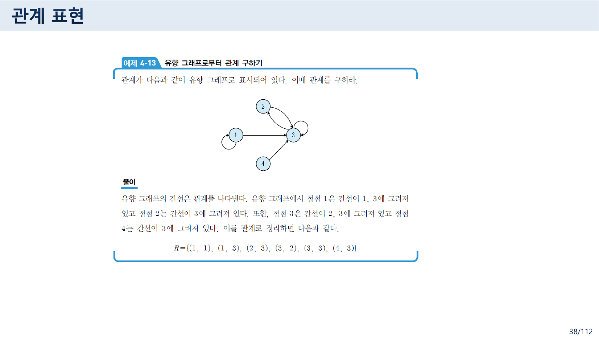
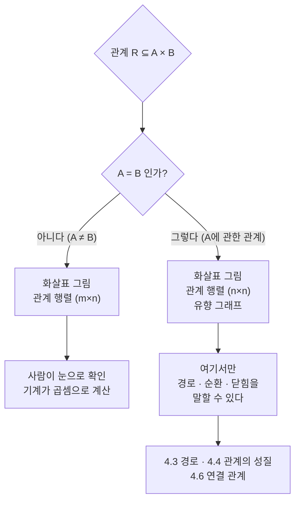

> [!abstract] 이 묶음이 실제로 하는 말
> 이 장은 **관계(relation)를 두 번 정의한다.** 3~4쪽은 인터넷에서 빌려 온 인포그래픽으로 정의하고, 26쪽은 교재의 정의 4-3으로 정의한다. 두 정의가 서로 다르고, **빌려 온 쪽이 틀렸다.**
>
> 4쪽은 이렇게 적는다 — *Relations (Map each input to **at least one** output).* 그런데 26쪽의 정의 4-3은 *"이항 관계 $R$은 $A \times B$의 부분집합들이다"*라고만 말한다. **부분집합이면 무엇이든 된다.** 공집합도 관계이고, 절반을 버린 것도 관계다.
>
> 어느 쪽이 이 장의 진짜 정의인가. 자료 자신이 답을 준다. **31~32쪽의 예제 4-6에서 원소 7은 상(image)을 하나도 갖지 않는다.** 32쪽 화살표 그림은 그 7을 정의역 타원 **바깥에** 점 하나로 찍어 둔다. 4쪽이 불가능하다고 말한 것을 32쪽이 그려 놓은 것이다.
>
> 이 어긋남이 장 전체의 척추다. 함수는 "모든 입력에 정확히 하나"를 요구하고, 관계는 **아무것도 요구하지 않는다.** 그 요구하지 않음이 곱집합($A \times B$)이라는 넓은 판을 깔아 놓고 거기서 **아무렇게나 골라도 된다**는 자유를 만들고, 그 자유 때문에 관계는 화살표·행렬·그래프 세 가지로 표현되어야 한다. 그런데 세 표현 중 하나는 $A = B$일 때만 쓸 수 있다(35쪽).

---

## 1. 3쪽이 그린 원과 4쪽이 쓴 문장

3쪽은 커다란 회색 원 안에 작은 녹색 원을 그린다. 바깥은 `Relations`, 안은 `Functions`. 포함 관계만 보면 정확하다 — 함수는 관계의 특수한 경우다. 문제는 다음 쪽이다.



4쪽이 같은 그림에 **글자를 붙인다.**

> **Relations** (Map each input to **at least one output**)
> └ **Functions** (Map each input to **exactly one output**)
> &nbsp;&nbsp;├ One-to-one (each input maps to a distinct output)
> &nbsp;&nbsp;└ Many-to-one (multiple inputs map to same output)
> └ **Not functions** (Map some inputs to multiple outputs)

함수 쪽 설명은 옳다. `exactly one`, `one-to-one`, `many-to-one` 모두 표준 용어다. 틀린 것은 **바깥 원의 설명**이다.

> [!caution] 원본 오류 — 4쪽: 관계는 "at least one output"을 요구하지 않는다
> 관계의 정의(정의 4-3, 26쪽)는 **$A \times B$의 부분집합**이다. 부분집합에는 아무런 조건이 없다.
>
> - $R = \varnothing$ 도 $A \times B$의 부분집합이므로 **공집합은 관계다.** 이 관계는 어떤 입력도 어떤 출력에 대응시키지 않는다.
> - $A = \{1, 2\}$, $B = \{x\}$, $R = \{(1, x)\}$ 도 관계다. 원소 $2$는 상이 없다.
>
> 4쪽의 설명대로라면 이 둘은 관계가 아니어야 한다. 그러나 같은 자료의 **정의 4-3과 예제 4-6이 정면으로 반박한다.**
>
> 4쪽의 문장이 참이 되려면 "전관계(total relation)" 혹은 "좌전(left-total)"이라는 **추가 조건**을 붙여야 한다. 관계 일반의 정의가 아니라 관계의 한 종류를 설명하는 문장인 셈인데, 슬라이드는 그 조건 이름을 적지 않았다.
>
> 세 번째 줄 `Not functions (Map some inputs to multiple outputs)`도 같은 병이다. 함수가 아닌 관계에는 "한 입력이 여러 출력으로 가는" 경우 말고 **"한 입력이 어떤 출력으로도 가지 않는" 경우**가 있다. 예제 4-6이 바로 그것이다.

5쪽은 이 흐름을 파이썬의 `def function_name(parameters): ... return expression` 도식으로 이어받고, 6쪽은 인스타그램 소개문을 붙여 *"Main functions?"*를 묻는다. 일상어의 *function*(기능·역할)과 수학의 함수를 나란히 놓은 도입인데, 2쪽이 사전 정의 두 줄을 같이 적어 그 이중성을 의도적으로 드러낸다.

> "an activity or purpose natural to or intended for a person or thing." — 사람이나 사물에 자연스럽거나 의도된 활동이나 목적
> "a relationship or expression involving one or more variables." — 한 개 이상의 변수를 포함하는 관계나 표현

두 번째 정의 안에 이미 **relationship**이라는 단어가 들어 있다. 이 장이 관계와 함수를 한 파일에 넣은 이유가 여기 있다.

---

## 2. 곱집합 — 고르기 전에 깔아 두는 판

관계를 "부분집합"이라고 정의하려면 **무엇의 부분집합인지**가 먼저 있어야 한다. 그것이 곱집합이고, 그래서 4.1절이 4.2절보다 앞에 온다.


18쪽의 정의 4-1·4-2가 순서쌍과 곱집합을 정의하고, 19쪽이 그것을 **격자**로 그린다. $A = \{x, y, z\}$와 $B = \{1, 2, 3\}$의 $A \times B$는 $3 \times 3$ 칸이 전부 채워진 표다.

$$A \times B = \{(a,\,b) \mid a \in A \text{ 이고 } b \in B\}$$

19쪽 예제 4-1이 곧바로 **교환법칙이 성립하지 않는다**는 것을 보인다.

| | 결과 |
| --- | --- |
| $A = \{1,2,3\},\ B = \{x,y\}$ | |
| $A \times B$ | $\{(1,x), (1,y), (2,x), (2,y), (3,x), (3,y)\}$ |
| $B \times A$ | $\{(x,1), (x,2), (x,3), (y,1), (y,2), (y,3)\}$ |

원소의 개수는 여섯으로 같지만 **순서쌍의 첫 자리에 오는 것이 다르다.** 23쪽의 참고 슬라이드(위키백과 인용)가 이 사실을 성질 목록으로 정리해 둔다 — `(교환 법칙의 실패) A × B ≠ B × A`, 그리고 곧바로 한 줄을 덧붙인다.

> 그러나, 이 둘 사이에는 자연스러운 전단사 함수 $(a, b) \mapsto (b, a)$가 존재한다.

같지는 않지만 **일대일로 갈아탈 수 있다**는 뜻이다. 이 구분 — *같다*와 *대응시킬 수 있다* — 는 [05번 노트](./05.%20%EC%A7%91%ED%95%A9%EC%9D%80%20%EC%88%9C%EC%84%9C%EC%99%80%20%EC%A4%91%EB%B3%B5%EC%9D%84%20%EB%B2%84%EB%A6%B0%EB%8B%A4%20%E2%80%94%20%EA%B7%B8%EB%A6%AC%EA%B3%A0%20%EB%B9%84%EC%96%B4%20%EC%9E%88%EB%8A%94%20%EC%B9%B8%20%ED%95%98%EB%82%98.md)에서 가산성을 판정할 때 썼던 바로 그 구분이다.

같은 참고 슬라이드가 곱집합의 크기 규칙도 준다.

$$|A \times B| = |A|\,|B|, \qquad \varnothing \times A = A \times \varnothing = \varnothing$$

20~21쪽은 이것을 $n$개로 확장한다. $A_1 \times A_2 \times \cdots \times A_n$, 같은 집합이면 $A^n$, 그래서 $\mathbf{R}^3 = \mathbf{R} \times \mathbf{R} \times \mathbf{R}$. **좌표평면이 곱집합이었다**는 사실이 여기서 회수된다.

---

## 3. 관계는 곱집합에서 고르는 일 — 그리고 7은 선택되지 않았다

26쪽 정의 4-3이 관계를 정의한다.

> 집합 $A$, $B$에 대해 $A$에서 $B$로 가는 관계를 **이항 관계**라 한다. 이항 관계 $R$은 $A \times B$의 부분집합들이다. $x \in A$와 $y \in B$에 대해 순서쌍 $(x, y) \in R$이면 $x$는 $y$에 대해서 $R$의 관계에 있다고 하며, $x\,R\,y$로 표시한다.

그리고 세 개의 이름을 붙인다.

| 이름 | 정의 | 표기 |
| --- | --- | --- |
| 정의역(domain) | $R$에 속한 순서쌍의 **모든 첫 번째 원소**의 집합 | $\mathrm{Dom}(R)$ |
| 치역(range) | $R$에 속한 순서쌍의 **모든 두 번째 원소**의 집합 | $\mathrm{Ran}(R)$ |
| 공변역(codomain) | $B$ 집합의 **전체 원소** | — |

여기서 결정적인 비대칭이 생긴다. **공변역은 $B$ 전체로 미리 정해지지만, 정의역은 $R$에서 계산된다.** 즉 정의역은 $A$ 전체일 필요가 없다. 함수라면 정의역 $=A$가 강제되지만, 관계에는 그런 강제가 없다.



31쪽의 두 예제가 그 자유를 실제로 쓴다.

**예제 4-5.** $A = \{1,2,3,4,5\}$, $a\,R\,b \Leftrightarrow a < b$.

$$R = \{(1,2),(1,3),(1,4),(1,5),(2,3),(2,4),(2,5),(3,4),(3,5),(4,5)\}$$

열 개다. $\mathrm{Dom}(R) = \{1,2,3,4\}$ — **5가 빠진다.** $\mathrm{Ran}(R) = \{2,3,4,5\}$ — **1이 빠진다.** 공변역은 그래도 $\{1,2,3,4,5\}$ 전체다.

**예제 4-6.** $A = \{2,3,4,7\}$, $B = \{2,3,4,5,6\}$, $a\,R\,b \Leftrightarrow b$가 $a$로 나누어떨어진다.

$$R = \{(2,2),(2,4),(2,6),(3,3),(3,6),(4,4)\}$$

$7$로 나누어떨어지는 수가 $B$ 안에 없다. 그래서 **$7$은 $R$의 어느 순서쌍에도 나타나지 않는다.**



32쪽이 이 관계를 화살표 그림으로 그리는데, 그림이 그 사실을 숨기지 않는다. 왼쪽 타원에는 $2, 3, 4$만 들어 있고 **$7$은 타원 밖에 점 하나로 찍혀 있다.** 그림에 `R의 정의역`이라는 라벨이 그 타원을 가리킨다.

4쪽의 문장과 32쪽의 그림을 나란히 놓으면 이 장의 성격이 드러난다. **관계는 원소를 버릴 수 있다.** 버린 자리를 그림은 타원 밖의 고아점으로, 행렬은 0만 있는 행으로, 유향 그래프는 나가는 간선이 없는 정점으로 기록한다.

### 곱집합에서 고르기 — 직접 해 보기

아래 격자는 예제 4-6의 $A \times B$다. 칸을 누르면 그 순서쌍을 관계에 넣거나 뺀다. 오른쪽이 정의역·치역·관계 행렬을 따라 바뀐다.

```html preview h=660px
<div id="rel-pick" style="font-family:system-ui,-apple-system,'Segoe UI',sans-serif;color:var(--foreground);padding:18px">
  <div style="font-size:13px;font-weight:600;margin-bottom:4px">예제 4-6의 곱집합 A×B에서 관계 고르기</div>
  <div style="font-size:12px;opacity:.75;margin-bottom:14px">
    A = {2, 3, 4, 7}, B = {2, 3, 4, 5, 6} · 칸을 눌러 순서쌍을 넣고 뺀다.
  </div>
  <div style="display:flex;gap:12px;margin-bottom:14px;flex-wrap:wrap">
    <button data-act="ex46" class="rp-btn">예제 4-6 (b가 a로 나누어떨어짐)</button>
    <button data-act="all" class="rp-btn">전체 A×B</button>
    <button data-act="none" class="rp-btn">공집합 ∅</button>
  </div>
  <div style="display:flex;gap:26px;flex-wrap:wrap;align-items:flex-start">
    <div>
      <table id="rp-grid" style="border-collapse:collapse;font-size:13px"></table>
      <div style="font-size:11px;opacity:.65;margin-top:6px">가로 = B, 세로 = A</div>
    </div>
    <div style="min-width:280px;flex:1">
      <div id="rp-out" style="font-size:13px;line-height:1.85"></div>
      <div style="margin-top:14px">
        <div style="font-size:12px;font-weight:600;margin-bottom:6px">관계 행렬 M<sub>R</sub> (A행 × B열)</div>
        <table id="rp-mat" style="border-collapse:collapse;font-size:12px;font-family:ui-monospace,monospace"></table>
      </div>
    </div>
  </div>
  <style>
    #rel-pick .rp-btn{background:var(--card);color:var(--foreground);border:1px solid var(--border);
      border-radius:7px;padding:6px 11px;font-size:12px;cursor:pointer;font-family:inherit}
    #rel-pick .rp-btn:hover{border-color:var(--chart-1)}
    #rel-pick td,#rel-pick th{border:1px solid var(--border);text-align:center}
    #rel-pick #rp-grid td{width:52px;height:36px;cursor:pointer;background:var(--card)}
    #rel-pick #rp-grid td.on{background:var(--chart-1);color:var(--card);font-weight:700}
    #rel-pick #rp-grid th{padding:5px 8px;opacity:.8;font-weight:600}
    #rel-pick #rp-mat td{width:26px;height:24px}
    #rel-pick #rp-mat th{padding:3px 6px;opacity:.7;font-weight:600}
  </style>
</div>
<script>
(function(){
  var root=document.getElementById('rel-pick');
  var A=[2,3,4,7], B=[2,3,4,5,6];
  var sel={};
  function key(a,b){return a+'|'+b;}
  function preset(kind){
    sel={};
    A.forEach(function(a){B.forEach(function(b){
      var on = kind==='all' ? true : (kind==='ex46' ? (b%a===0) : false);
      if(on) sel[key(a,b)]=1;
    });});
    draw();
  }
  function draw(){
    var g=root.querySelector('#rp-grid');
    var h='<tr><th></th>'+B.map(function(b){return '<th>'+b+'</th>';}).join('')+'</tr>';
    A.forEach(function(a){
      h+='<tr><th>'+a+'</th>';
      B.forEach(function(b){
        var on=sel[key(a,b)]?' on':'';
        h+='<td class="cell'+on+'" data-a="'+a+'" data-b="'+b+'">('+a+','+b+')</td>';
      });
      h+='</tr>';
    });
    g.innerHTML=h;
    g.querySelectorAll('td.cell').forEach(function(td){
      td.onclick=function(){
        var k=key(td.dataset.a,td.dataset.b);
        if(sel[k]) delete sel[k]; else sel[k]=1;
        draw();
      };
    });
    var pairs=[];
    A.forEach(function(a){B.forEach(function(b){ if(sel[key(a,b)]) pairs.push([a,b]); });});
    var dom=[],ran=[];
    pairs.forEach(function(p){ if(dom.indexOf(p[0])<0)dom.push(p[0]); if(ran.indexOf(p[1])<0)ran.push(p[1]); });
    dom.sort(function(x,y){return x-y;}); ran.sort(function(x,y){return x-y;});
    var lost=A.filter(function(a){return dom.indexOf(a)<0;});
    var o=root.querySelector('#rp-out');
    o.innerHTML=
      '<div><b>|R|</b> = '+pairs.length+' &nbsp;/&nbsp; |A×B| = 20</div>'+
      '<div style="margin-top:4px"><b>R</b> = {'+(pairs.length? pairs.map(function(p){return '('+p[0]+','+p[1]+')';}).join(', '):'&nbsp;')+'}</div>'+
      '<div style="margin-top:8px"><b>Dom(R)</b> = {'+dom.join(', ')+'}</div>'+
      '<div><b>Ran(R)</b> = {'+ran.join(', ')+'}</div>'+
      '<div><b>공변역</b> = {2, 3, 4, 5, 6} &nbsp;<span style="opacity:.6">(항상 B 전체)</span></div>'+
      '<div style="margin-top:10px;padding:9px 11px;border:1px solid var(--border);border-radius:7px;background:var(--card)">'+
        (lost.length
          ? '상(image)을 못 받은 A의 원소: <b>'+lost.join(', ')+'</b><br><span style="opacity:.75">4쪽의 “at least one output”이라면 이건 관계가 아니어야 한다. 정의 4-3에 따르면 관계다.</span>'
          : 'A의 모든 원소가 적어도 하나의 상을 갖는다. <span style="opacity:.75">이런 관계를 전관계(left-total)라 부른다 — 관계 일반이 아니라 한 종류다.</span>')+
      '</div>';
    var m=root.querySelector('#rp-mat');
    var mh='<tr><th></th>'+B.map(function(b){return '<th>'+b+'</th>';}).join('')+'</tr>';
    A.forEach(function(a){
      mh+='<tr><th>'+a+'</th>';
      B.forEach(function(b){
        var v=sel[key(a,b)]?1:0;
        mh+='<td style="background:'+(v?'var(--chart-2)':'var(--card)')+';color:'+(v?'var(--card)':'var(--foreground)')+'">'+v+'</td>';
      });
      mh+='</tr>';
    });
    m.innerHTML=mh;
  }
  root.querySelectorAll('.rp-btn').forEach(function(b){
    b.onclick=function(){preset(b.dataset.act);};
  });
  preset('ex46');
})();
</script>
```

격자가 20칸이므로 $A \times B$의 부분집합, 즉 **가능한 관계의 개수는 $2^{20} = 1{,}048{,}576$개**다. 그중 4쪽의 조건("A의 모든 원소가 적어도 하나의 상을 갖는다")을 만족하는 것은 각 $a$마다 $B$의 공집합 아닌 부분집합을 고르는 것이므로 $(2^5 - 1)^4 = 31^4 = 923{,}521$개다.

$$1{,}048{,}576 - 923{,}521 = 125{,}055$$

**12만 5천 개의 관계가 4쪽의 정의에서 빠진다.** 예제 4-6의 $R$은 그 12만 5천 개 중 하나다.

---

## 4. 세 가지 표현 — 그리고 하나는 조건부

32~38쪽이 관계를 표현하는 세 방법을 순서대로 준다.

> 집합 사이의 관계를 표시하는 방법 : 화살표 그림, 관계 행렬, 유향 그래프

### ① 화살표 그림 (arrow diagram)

두 개의 원(타원)에 $A$와 $B$의 원소를 써넣고, $a\,R\,b$이면 $a$에서 $b$로 화살표를 그린다. 32쪽이 예제 4-6을 이 방법으로 그렸고, 앞에서 본 대로 **$7$은 타원 밖에 남는다.**

### ② 관계 행렬 (relation matrix)

33쪽이 정의한다.

$$m_{ij} = \begin{cases} 1, & (a_i,\, b_j) \in R \\ 0, & (a_i,\, b_j) \notin R \end{cases}$$

그리고 **이 행렬은 0과 1만 갖는 부울 행렬**이라고 못 박는다. 이 한 줄이 4.3절 전체를 예고한다 — 부울 행렬이기 때문에 부울곱으로 경로를 셀 수 있게 된다.



그런데 33쪽 마지막 줄이 행과 열을 뒤바꿔 적는다.

> [!caution] 원본 오류 — 33쪽: 행과 열이 서로 바뀌었다
> 33쪽은 이렇게 쓴다.
>
> > 관계 행렬로 표시할 때 $A$에서 $B$로 가는 관계라 하면, **$A$의 원소들을 열에 나열하고 $B$의 원소들은 행에 나열**하여 표시한다.
>
> 그러나 바로 앞 줄의 정의는 $m_{ij} = 1 \Leftrightarrow (a_i, b_j) \in R$이고, 행렬 크기를 $m \times n$($m = |A|$, $n = |B|$)이라 적었다. 즉 **첫 번째 첨자 $i$가 행이고 그것이 $A$를 훑는다.**
>
> 34쪽의 예제 4-9가 이를 확정한다. $A = \{a_1, a_2, a_3\}$, $B = \{b_1, b_2, b_3, b_4\}$에 대해
>
> $$M = \begin{pmatrix} 1 & 0 & 0 & 1 \\ 0 & 1 & 1 & 0 \\ 1 & 0 & 1 & 0 \end{pmatrix}$$
>
> $3 \times 4$ 행렬이고 **세 개의 행이 $A$의 세 원소**다. 33쪽 문장대로 $A$를 열에 놓았다면 $4 \times 3$ 행렬이 나왔어야 한다.
>
> 이 과목에서 같은 종류의 실수가 벌써 세 번째다. [02번 노트](./02.%20%ED%95%9C%20%ED%8C%8C%EC%9D%BC%EC%97%90%20%EC%B1%85%20%EB%91%90%20%EA%B6%8C%20%E2%80%94%20%EC%9D%98%EB%AF%B8%EB%A1%9C%20%EA%B0%80%EB%A5%B4%EC%B9%98%EB%8A%94%20%EB%85%BC%EB%A6%AC%EC%99%80%20%ED%8C%8C%EC%8B%B1%EC%9C%BC%EB%A1%9C%20%EA%B0%80%EB%A5%B4%EC%B9%98%EB%8A%94%20%EB%85%BC%EB%A6%AC.md)에서 본 「수학적 모델과 논리」 26쪽의 연산자 우선순위표도 `[행] 입력`·`[열] 스택` 라벨이 뒤바뀌어 있었고, 이 자료 119쪽의 와샬 알고리즘에서는 **교수가 붉은 펜으로 「행위치」·「열위치」를 덧써서 직접 고쳐 놓았다**([10번 노트](./10.%20%EB%8B%AB%ED%9E%98%EC%9D%80%20%EB%B6%80%EC%A1%B1%ED%95%9C%20%EA%B2%83%EC%9D%84%20%EC%B5%9C%EC%86%8C%EB%A1%9C%20%EC%B1%84%EC%9A%B4%EB%8B%A4%20%E2%80%94%20%EA%B7%B8%EB%A6%AC%EA%B3%A0%20%EB%B6%89%EC%9D%80%20%ED%8E%9C%EC%9C%BC%EB%A1%9C%20%EA%B3%A0%EC%B3%90%20%EC%A0%81%EC%9D%80%20%ED%95%9C%20%EC%A4%84.md)에서 다룬다). 행렬을 말로 설명할 때 행과 열을 헷갈리는 것은 이 자료의 고질이다. **그림과 식이 항상 맞고, 그것을 풀어 쓴 한국어 문장이 틀린다.**

34쪽 아래의 예제 4-10은 예제 4-5($a < b$)를 행렬로 옮긴 것인데, 결과가 **주대각 위쪽만 1인 상삼각 행렬**이다.

$$M = \begin{pmatrix} 0&1&1&1&1\\ 0&0&1&1&1\\ 0&0&0&1&1\\ 0&0&0&0&1\\ 0&0&0&0&0 \end{pmatrix}$$

마지막 행이 전부 0인 것이 $5 \notin \mathrm{Dom}(R)$과 같은 말이고, 첫 열이 전부 0인 것이 $1 \notin \mathrm{Ran}(R)$과 같은 말이다. **버려진 원소가 행렬에서는 0만 있는 줄로 보인다.**

### ③ 유향 그래프 (directed graph)

35쪽이 유향 그래프를 정의하고 나서 조건을 붙인다.

> 관계를 유향 그래프로 표시하기 위해서는 **$A$에서 $A$로 가는 관계인 $A$에 관한 관계일 때만 가능**하다.

세 표현 중 이것만 전제가 붙는다. 두 집합이 다르면 정점 하나를 $A$의 원소로도 $B$의 원소로도 읽을 수 없기 때문이다. 26쪽이 미리 이름을 준비해 두었다 — $A = B$이면, 즉 $R \subseteq A \times A$이면 $R$를 **"$A$에 관한 관계"**라 한다.



37~38쪽의 두 예제가 양방향을 보여 준다. 예제 4-12는 관계에서 그래프로 가고, 예제 4-13은 그래프에서 관계로 되돌아온다.

**예제 4-12.** $X = \{1,2,3,4\}$, $R = \{(x,y) \mid x > y\}$.

$$R = \{(2,1),(3,1),(3,2),(4,1),(4,2),(4,3)\}, \qquad M_R = \begin{pmatrix} 0&0&0&0\\ 1&0&0&0\\ 1&1&0&0\\ 1&1&1&0 \end{pmatrix}$$

예제 4-10의 상삼각과 정확히 거울상이다. $<$와 $>$가 뒤집힌 관계라는 것이 행렬에서 **전치**로 보인다. 이 관찰이 4.5절의 역관계($M_{R^{-1}} = (M_R)^T$)를 미리 준비한다.

**예제 4-13.** 그림에서 읽어 낸 관계는 $R = \{(1,1),(1,3),(2,3),(3,2),(3,3),(4,3)\}$이다. 정점 1과 3에 **자기 자신으로 돌아오는 고리**가 있는데, 이것이 4.4절의 반사 관계와 4.3절의 "길이 1인 순환"으로 바로 연결된다.

### 세 표현을 언제 쓰는가



35쪽의 조건은 편의상의 제약이 아니다. **경로·순환·반사·추이·닫힘은 모두 $A = B$를 전제**로만 뜻이 생긴다. 4.3절부터 4.6절까지 이 장의 나머지 전부가 오른쪽 가지 위에서 일어난다.

---

## 5. 함수는 관계에 조건을 두 개 얹은 것

11~16쪽은 영어 슬라이드(로젠 계열)로 함수를 정의한다. 관계의 정의보다 **먼저** 나오는데, 12쪽이 그 순서를 뒤집어 관계 쪽으로 되돌린다.

> A function $f: A \to B$ can also be defined as **a subset of $A \times B$ (a relation)**. This subset is restricted to be a relation where no two elements of the relation have the same first element.

그리고 기호로 두 조건을 적는다.

$$\forall x\,[\,x \in A \to \exists y\,(y \in B \wedge (x,y) \in f)\,]$$
$$\forall x, y_1, y_2\,[\,(x,y_1) \in f \wedge (x,y_2) \in f \to y_1 = y_2\,]$$

첫 줄이 **"적어도 하나"**(존재), 둘째 줄이 **"많아야 하나"**(유일). 둘을 합치면 "정확히 하나"가 된다. 4쪽의 인포그래픽이 틀린 이유가 여기서 기호로 확인된다. **첫 줄은 함수의 조건이지 관계의 조건이 아니다.**

13쪽이 이름을 배분한다 — $A$는 domain, $B$는 codomain, $f(a) = b$일 때 $b$는 $a$의 image, $a$는 $b$의 preimage, 그리고 $f(A)$가 range. 26쪽의 한국어 정의(정의역·공변역·치역)와 같은 이름이지만 **함수 쪽에서는 정의역이 $A$ 전체로 고정**된다는 점이 다르다.

15~16쪽의 질문 슬라이드가 그 이름들을 한 그림에서 다 묻는다. $A = \{a,b,c,d\}$, $B = \{x,y,z\}$, 화살표는 $a \to z$, $b \to y$, $c \to z$, $d \to z$.

| 질문 | 답 |
| --- | --- |
| $f(a)$ | $z$ |
| the image of $d$ | $z$ |
| the domain of $f$ | $A$ |
| the codomain of $f$ | $B$ |
| the preimage of $y$ | $b$ |
| $f(A)$ | $\{y, z\}$ |
| the preimage(s) of $z$ | $\{a, c, d\}$ |
| $f\{a,b,c\}$ | $\{y, z\}$ |
| $f\{c,d\}$ | $\{z\}$ |

$f(A) = \{y,z\}$이고 공변역은 $\{x,y,z\}$이므로 **$x$는 아무 것의 상도 아니다.** 치역이 공변역의 진부분집합인 예이고, 26쪽이 *"치역은 공변역의 부분집합이 된다"*고 적어 둔 그 관계다.

### 얼마나 좁은 조건인가

$A$와 $B$가 각각 두 원소일 때를 세어 보면 함수 조건이 얼마나 강한지 바로 보인다.

```html preview h=520px
<div id="cnt" style="font-family:system-ui,-apple-system,'Segoe UI',sans-serif;color:var(--foreground);padding:18px">
  <div style="font-size:13px;font-weight:600;margin-bottom:4px">|A| = 2, |B| = 2 — 16개의 관계를 전부 세어 본다</div>
  <div style="font-size:12px;opacity:.75;margin-bottom:14px">
    A = {1, 2}, B = {x, y} · A×B는 네 칸이므로 관계는 2⁴ = 16개다. 각 칸을 눌러 필터를 바꾼다.
  </div>
  <div style="display:flex;gap:8px;flex-wrap:wrap;margin-bottom:14px">
    <button data-f="all" class="cf">전부 (16)</button>
    <button data-f="total" class="cf">모든 입력에 상이 있다 — 4쪽의 정의 (9)</button>
    <button data-f="func" class="cf">함수 (4)</button>
    <button data-f="inj" class="cf">일대일 함수 (2)</button>
  </div>
  <div id="cnt-grid" style="display:grid;grid-template-columns:repeat(auto-fill,minmax(120px,1fr));gap:9px"></div>
  <div id="cnt-note" style="margin-top:14px;font-size:12.5px;line-height:1.8;padding:11px 13px;border:1px solid var(--border);border-radius:8px;background:var(--card)"></div>
  <style>
    #cnt .cf{background:var(--card);color:var(--foreground);border:1px solid var(--border);
      border-radius:7px;padding:6px 11px;font-size:12px;cursor:pointer;font-family:inherit}
    #cnt .cf.sel{border-color:var(--chart-1);box-shadow:inset 0 0 0 1px var(--chart-1)}
    #cnt .card{border:1px solid var(--border);border-radius:8px;padding:8px;background:var(--card);
      font-size:11px;font-family:ui-monospace,monospace;text-align:center;transition:opacity .15s}
    #cnt .card.dim{opacity:.2}
  </style>
</div>
<script>
(function(){
  var root=document.getElementById('cnt');
  var pairs=[[1,'x'],[1,'y'],[2,'x'],[2,'y']];
  var rels=[];
  for(var m=0;m<16;m++){
    var r=[];
    for(var i=0;i<4;i++) if(m&(1<<i)) r.push(pairs[i]);
    rels.push(r);
  }
  function imgs(r,a){return r.filter(function(p){return p[0]===a;}).map(function(p){return p[1];});}
  function isTotal(r){return imgs(r,1).length>=1 && imgs(r,2).length>=1;}
  function isFunc(r){return imgs(r,1).length===1 && imgs(r,2).length===1;}
  function isInj(r){return isFunc(r) && imgs(r,1)[0]!==imgs(r,2)[0];}
  var tests={all:function(){return true;},total:isTotal,func:isFunc,inj:isInj};
  var notes={
    all:'A×B의 부분집합 전부. <b>정의 4-3이 관계라고 부르는 것은 이 16개 모두</b>다. 공집합(맨 왼쪽 위)도 관계다.',
    total:'4쪽이 “Relations”라고 부른 것. 각 입력이 B의 공집합 아닌 부분집합으로 가므로 (2²−1)² = <b>9개</b>. 나머지 7개는 이 정의에서 빠진다.',
    func:'각 입력이 정확히 하나로 간다. 2² = <b>4개</b>. 16개 중 네 개뿐이다.',
    inj:'함수이면서 서로 다른 출력. 2! = <b>2개</b>. |A| = |B| = 2이므로 전단사이기도 하다.'
  };
  function draw(f){
    root.querySelectorAll('.cf').forEach(function(b){b.classList.toggle('sel',b.dataset.f===f);});
    var g=root.querySelector('#cnt-grid'),h='';
    rels.forEach(function(r){
      var ok=tests[f](r);
      var label = r.length? r.map(function(p){return '('+p[0]+','+p[1]+')';}).join(' ') : '∅';
      h+='<div class="card'+(ok?'':' dim')+'" style="'+(ok?'border-color:var(--chart-1)':'')+'">'+label+'</div>';
    });
    g.innerHTML=h;
    var n=rels.filter(tests[f]).length;
    root.querySelector('#cnt-note').innerHTML='<b>'+n+' / 16</b> — '+notes[f];
  }
  root.querySelectorAll('.cf').forEach(function(b){b.onclick=function(){draw(b.dataset.f);};});
  draw('all');
})();
</script>
```

16개 중 함수는 **4개**뿐이고, 4쪽이 관계라고 부른 것은 **9개**다. 나머지 7개 — 공집합을 포함해 어느 입력 하나가 버려진 관계들 — 가 4쪽의 정의에서 사라진다. 3쪽의 벤 다이어그램에서 회색 원이 실제로는 **16개짜리**여야 하는데 4쪽의 글자는 그것을 9개짜리로 줄여 놓은 셈이다.

---

## 6. 항등 관계, 그리고 $n$항으로의 확장

30쪽의 정의 4-4가 **항등 관계(identity relation)**를 정의한다.

$$R = \{(a,\,a) \mid \text{임의의 } a \in A\}$$

예제 4-4는 $A$가 실수 집합일 때 $R = \{(x,x) \mid x$는 실수$\}$가 항등 관계임을 확인한다. 행렬로 보면 **단위 행렬**이고, 유향 그래프로 보면 **모든 정점에 고리 하나씩**이다. 4.4절의 반사 관계는 "항등 관계를 포함하는 관계"로 다시 쓸 수 있고, 4.6절의 반사 닫힘은 정확히 "$R \cup I$"가 된다.

27쪽은 이항을 넘어선다.

> 이항 관계를 확장하면 세 개의 집합 $A, B, C$에 대해 **삼항 관계** $R$은 $A \times B \times C$의 부분집합들이고 $\cdots$ 이런 관계는 $n$항 관계까지 확장 가능하다.
> 우리는 **이항 관계만을 다루므로** 앞으로 관계라고 하면 이항 관계를 말한다.

마지막 줄이 이 장의 범위를 확정한다. 그리고 이 한 줄이 왜 중요한지는 [12번 노트](./12.%20%EA%B0%95%EC%9D%98%20%ED%95%9C%EA%B0%80%EC%9A%B4%EB%8D%B0%20%EB%82%AF%EC%84%A0%20%EC%97%AC%EB%8D%9F%20%EC%9E%A5%20%E2%80%94%20%EC%A7%80%EC%8B%9D%EA%B7%B8%EB%9E%98%ED%94%84%EB%8A%94%20%EC%99%9C%20%EC%97%AC%EA%B8%B0%20%EC%9E%88%EB%8A%94%EA%B0%80.md)에서 드러난다 — 지식그래프의 **트리플 (주어, 술어, 목적어)**은 삼항 관계처럼 보이지만 실제로는 **술어마다 하나씩 만든 이항 관계들의 모음**이다. 27쪽이 "이항만 다룬다"고 못 박았기 때문에 그 우회가 필요해진다.

8~9쪽의 미리보기가 이 장의 쓰임새를 미리 적어 둔다.

> ❖ 페이스북과 같은 대부분의 소셜 네트워크 서비스에서는 사람들과의 관계를 이용하여 친구 추천이나 공통 성질을 가진 군 등 여러 가지 필요한 정보들을 추출하여 활용한다.
> ❖ 근현대 수학의 중요한 개념인 **함수도 이항 관계의 특별한 경우**이다.
> ❖ **그래프도 관계들을 표현하기 위한 개념**이다.

세 줄이 이 과목의 남은 절반을 예고한다. 함수는 이 장 안에서, 소셜 네트워크의 도달 가능성은 4.6절의 연결 관계에서, 그래프는 다음 장에서 각각 회수된다.

---

## 다음으로

- **[08번 노트](./08.%20%EA%B2%BD%EB%A1%9C%EB%8A%94%20%EA%B3%B1%ED%95%98%EA%B3%A0%20%EC%84%B1%EC%A7%88%EC%9D%80%20%EB%94%B0%EC%A7%84%EB%8B%A4%20%E2%80%94%20%E3%80%8C%EB%AA%A8%EB%93%A0%E3%80%8D%EC%9D%B4%EB%9D%BC%20%EC%8D%A8%EC%95%BC%20%ED%95%A0%20%EC%9E%90%EB%A6%AC%EC%9D%98%20%E3%80%8C%EC%96%B4%EB%96%A4%E3%80%8D.md)** — 4.3절 경로와 4.4절 관계의 성질. 관계 행렬의 부울곱이 길이 $n$의 경로를 세고, 정의 4-9와 4-10이 한정자를 잘못 쓴다.
- **[09번 노트](./09.%20%EA%B0%99%EC%9D%80%20%EC%97%B0%EC%82%B0%EC%9D%B4%20%EB%91%90%20%EC%9D%B4%EB%A6%84%EC%9C%BC%EB%A1%9C%20%EB%B6%88%EB%A6%B0%EB%8B%A4%20%E2%80%94%20R%E2%88%98S%EC%99%80%20S%E2%88%98R.md)** — 4.5절 역관계·여관계·합성 관계. 같은 파일이 같은 합성을 $R \circ S$로도 $S \circ R$로도 적는다.
- **[06번 노트](./06.%20%EC%A7%91%ED%95%A9%EC%9D%98%20%EB%8C%80%EC%88%98%EB%8A%94%20%EB%85%BC%EB%A6%AC%EC%9D%98%20%EB%8C%80%EC%88%98%EB%8B%A4%20%E2%80%94%20%EA%B0%99%EC%9D%80%20%EB%B2%95%EC%B9%99%EC%9D%84%20%EC%84%B8%20%EB%B2%88%20%EC%A6%9D%EB%AA%85%ED%95%98%EA%B8%B0.md)** — 이 장이 딛고 선 곱집합은 앞 장 21~24쪽에서 이미 정의되었다.

---

## 근거 자료

`4 관계 및 함수.pdf` 1~38쪽. 이 노트가 인용하거나 근거로 삼은 쪽은 다음과 같다.

| 쪽 | 내용 |
| --- | --- |
| 2 | `function`의 사전 정의 두 줄(활동·목적 / 변수를 포함하는 관계나 표현) |
| 3 | Relations ⊃ Functions 벤 다이어그램 |
| **4** | **빌려 온 인포그래픽 — "Map each input to at least one output" (원본 오류)** |
| 5~6 | 파이썬 `def` 도식, 인스타그램의 "Main functions?" |
| 7 | 목차 4.1~4.6 |
| 8~10 | 미리보기 — 관계의 응용, "함수도 이항 관계의 특별한 경우", "그래프도 관계들을 표현하기 위한 개념" |
| 11~14 | 함수의 정의, 부분집합으로서의 함수, domain/codomain/image/preimage/range |
| 15~16 | 질문 슬라이드 — $f(a)$, preimage, $f(A)$, $f(S)$ |
| 17 | 절 표지 4.1 Product Set (곱집합) |
| 18~21 | 정의 4-1 순서쌍, 정의 4-2 곱집합, $n$개로의 확장, $\mathbf{R}^3$ |
| 19 | 곱집합 격자 그림, 예제 4-1 ($A \times B \neq B \times A$) |
| 22~23 | 위키백과 참고 — 곱집합의 정의와 성질(교환·결합 법칙의 실패, 분배 법칙, $\|A \times B\| = \|A\|\|B\|$) |
| 24 | 절 표지 4.2 관계와 관계 표현 |
| 26~27 | **정의 4-3 이항 관계**, 정의역·치역·공변역, $n$항 관계로의 확장 |
| 28~29 | 위키백과 참고 — 이항 관계 |
| 30~31 | 정의 4-4 항등 관계, 예제 4-4·4-5·4-6 |
| **32** | **예제 4-7 화살표 그림 — 원소 7이 정의역 바깥에 있다** |
| **33** | **관계 행렬의 정의, 부울 행렬이라는 언급 (행·열 서술 오류)** |
| 34 | 예제 4-9·4-10 관계 행렬 |
| 35~36 | 유향 그래프의 정의와 "$A$에 관한 관계일 때만 가능" 제약, 위키백과 참고 |
| 37~38 | 예제 4-12(관계→그래프·행렬), 예제 4-13(그래프→관계) |

원본에 없는 내용 중 이 노트가 보충한 것은 **관계의 개수 계산**($2^{20}$, $31^4$, $2^4$, $5^4$)과 **전관계(left-total)라는 용어**뿐이며, 둘 다 본문에서 보충임을 밝혔다. 인터랙티브에 쓴 집합·순서쌍·행렬 값은 모두 원본 예제 4-5·4-6·4-9의 값을 그대로 옮긴 뒤 파이썬으로 재계산해 대조했다.
