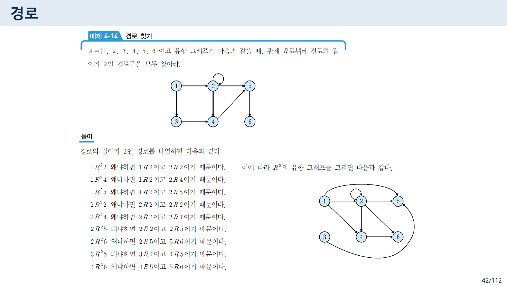
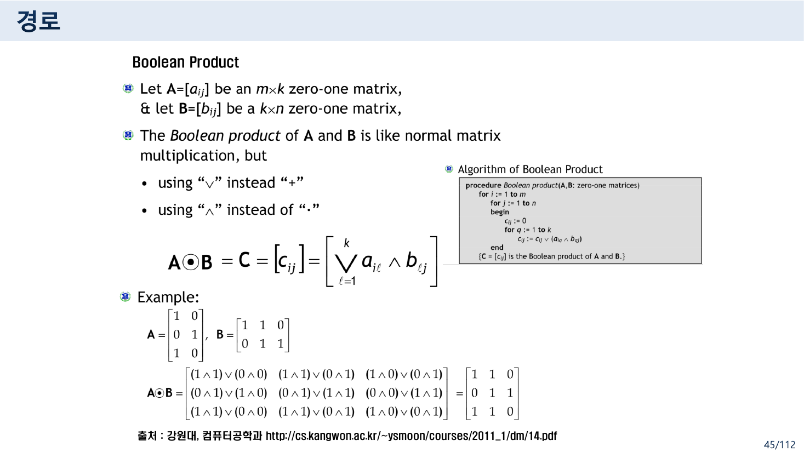
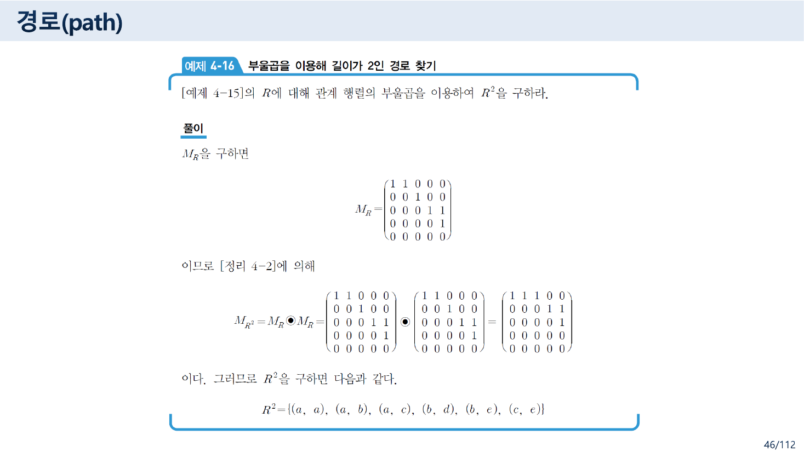
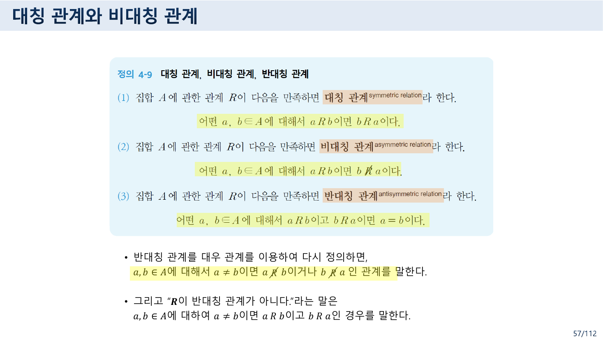
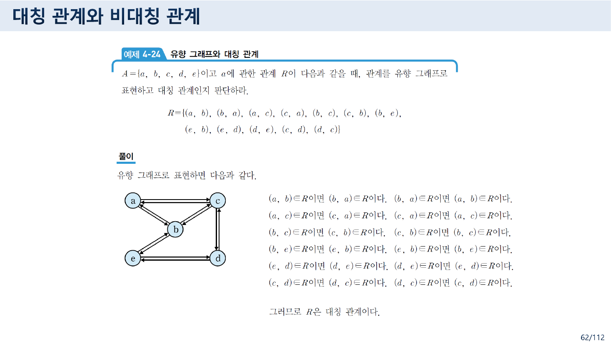
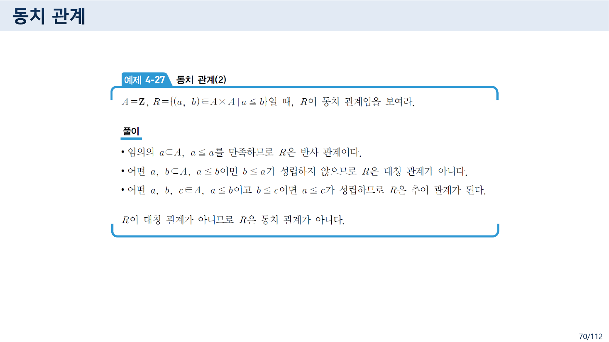
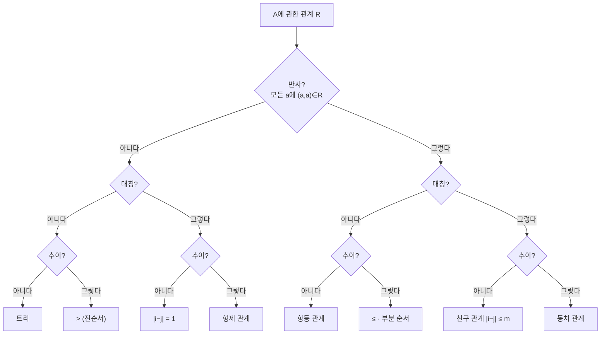

> [!abstract] 이 묶음이 실제로 하는 말
> 4.3절과 4.4절은 관계에게 서로 다른 두 종류의 질문을 던진다.
>
> **4.3절은 센다.** *$a$에서 $b$까지 길이 $n$인 경로가 있는가?* 이 질문은 유향 그래프를 눈으로 따라가며 답할 수도 있지만, 47쪽이 직접 못 박듯 *"유향 그래프를 이용할 때는 사람이 하나씩 찾아가므로 복잡한 그래프에서는 잘못 계산할 수도 있다."* 그래서 정리 4-2가 이 셈을 **관계 행렬의 부울곱**에 넘긴다. 사람이 손을 떼는 순간이다.
>
> **4.4절은 따진다.** *이 관계는 대칭인가?* 이 질문은 셈이 아니라 **한정자 문장**이다. "모든 $a, b$에 대하여 $a R b$이면 $b R a$"가 참인지 거짓인지를 묻는다. 반례가 하나만 있어도 거짓이 된다.
>
> 그리고 각 절이 자기 방식대로 넘어진다. **46쪽은 부울곱 행렬에서 1을 하나 빠뜨렸고**(그 아래 적힌 답 집합은 맞다), **57쪽과 66쪽은 「모든」이라 써야 할 자리에 「어떤」이라 썼다.** 54쪽의 정의 4-8은 「모든」을 정확히 쓰기 때문에 같은 파일 안에서 한정자가 오락가락한다. 바로 앞 장([03번 노트](./03.%20%EB%8C%80%EC%B2%B4%ED%95%A0%20%EC%88%98%20%EC%9E%88%EB%8A%94%20%EA%B2%83%EB%93%A4%20%E2%80%94%20%EC%88%A0%EC%96%B4%C2%B7%ED%95%9C%EC%A0%95%EC%9E%90%C2%B7%EC%B6%94%EB%A1%A0%2C%20%EA%B7%B8%EB%A6%AC%EA%B3%A0%20%EB%91%90%20%EB%B2%88%20%EC%A0%81%ED%9E%8C%20%ED%9B%84%EA%B1%B4%20%EB%B6%80%EC%A0%95.md))이 $\forall$와 $\exists$의 차이를 열 쪽에 걸쳐 가르친 과목에서다.
>
> 63쪽에도 하나 더 있다. **무향 그래프 [그림 4-2]가 관계에 없는 간선 $\{a, e\}$를 하나 더 그린다.** 바로 앞 쪽의 유향 그래프에는 그 간선이 없다.

---

## 1. 경로 — 세는 문제

### 정의는 "수열"이다

40쪽의 정의 4-6이 경로를 정의한다.

> $R$을 집합 $A$에 관한 관계라 하자. $a$에서 $b$까지의 **길이가 $n$인 경로**는 $a$부터 시작하여 $b$에서 끝나는 유한수열 $\pi = a,\, x_1,\, x_2,\, \cdots,\, x_{n-1},\, b$를 말한다. 각 원소들은 $a R x_1,\ x_1 R x_2,\ \cdots,\ x_{n-1} R b$이어야 한다.

정점이 겹쳐도 된다. 그래서 41쪽은 *"자신에서 시작하여 자신에서 끝나는 경로"*를 **순환(cycle)**이라 부르고, [그림 4-1]에서 $\pi_2 = 1, 2, 5, 1$과 $\pi_3 = 2, 2$를 예로 든다. **길이 1짜리 순환**($\pi_3$)이 있다는 것이 뒤에 반사 관계와 곧장 이어진다.

41쪽의 정의 4-7이 세 가지 이름을 한꺼번에 준다.

| 기호 | 이름 | 뜻 |
| --- | --- | --- |
| $R^n$ | 길이가 $n$인 관계 | $x R^n y$ ⟺ $x$에서 $y$로 가는 **길이가 정확히 $n$**인 경로가 있다 |
| $R^\infty$ | **연결 관계**(connectivity relation) | $x R^\infty y$ ⟺ 길이에 상관없이 $x$에서 $y$로 가는 **어떤** 경로가 있다 |
| $R^{*}$ | **도달 관계**(reachability relation) | $x = y$ **또는** $x R^\infty y$ |

세 번째가 미묘하다. $R^{*}$는 $R^\infty$에 **항등 관계를 얹은 것**이다. 41쪽이 그것을 행렬로도 적는다 — *"도달 관계는 관계 행렬의 단위 행렬($\mathrm{I}$) 혹은 $M_{R^\infty}$이다."* 그리고 유향 그래프에서 임의의 두 정점 사이에 도달 관계가 성립하면 **강하게 연결(strongly connected)**되었다고 한다.

> [!warning] 이 기호는 뒤에서 다른 뜻으로 다시 쓰인다
> 109쪽의 「Note」 슬라이드(한빛아카데미 교재 인용)는 **정의 7-22**에서 $R^{*}$를 이렇게 정의한다.
>
> $$R^{*} = \bigcup_{n=1}^{\infty} R^n = R^1 \cup R^2 \cup \cdots$$
>
> 이것은 41쪽의 $R^\infty$와 **같은 것**이고, 41쪽의 $R^{*}$(항등 관계를 포함하는 쪽)와는 **다른 것**이다. 같은 파일에서 같은 기호가 서로 다른 두 관계를 가리킨다. 자세한 것은 [10번 노트](./10.%20%EB%8B%AB%ED%9E%98%EC%9D%80%20%EB%B6%80%EC%A1%B1%ED%95%9C%20%EA%B2%83%EC%9D%84%20%EC%B5%9C%EC%86%8C%EB%A1%9C%20%EC%B1%84%EC%9A%B4%EB%8B%A4%20%E2%80%94%20%EA%B7%B8%EB%A6%AC%EA%B3%A0%20%EB%B6%89%EC%9D%80%20%ED%8E%9C%EC%9C%BC%EB%A1%9C%20%EA%B3%A0%EC%B3%90%20%EC%A0%81%EC%9D%80%20%ED%95%9C%20%EC%A4%84.md)에서 다룬다.

### 사람이 세면 틀린다



42쪽의 예제 4-14가 그 셈을 **손으로** 한다. $A = \{1,2,3,4,5,6\}$이고 간선이 여덟 개인 유향 그래프에서 길이 2인 경로를 전부 찾는데, 풀이가 아홉 줄이다.

> $1 R^2 2$ 왜냐하면 $1R2$이고 $2R2$이기 때문이다.
> $1 R^2 4$ 왜냐하면 $1R2$이고 $2R4$이기 때문이다.
> $\cdots$
> $4 R^2 6$ 왜냐하면 $4R5$이고 $5R6$이기 때문이다.

간선이 여덟 개이므로 확인해야 할 (간선, 간선) 짝이 최대 64가지다. 그림이 조금만 커져도 손으로는 감당이 안 된다. 47쪽이 그 사실을 인정한다.

> 유향 그래프를 이용할 때는 **사람이 하나씩 찾아가므로 복잡한 그래프에서는 잘못 계산할 수도 있다.**
> 반면에, 관계 행렬을 이용하면 프로그램을 이용해서 자동적으로 계산할 수 있다. 따라서 **관계 행렬을 이용하는 방법을 추천한다.**

### 부울곱 — 셈을 행렬에 넘긴다

44쪽의 정리 4-2가 넘기는 방법이다.

$$M_{R^2} = M_R \odot M_R$$



45쪽(강원대 자료 인용)이 부울곱을 정의한다. 보통의 행렬곱에서 **$+$를 $\vee$로, $\cdot$을 $\wedge$로** 바꾼 것뿐이다.

$$\mathbf{A} \odot \mathbf{B} = \left[\, \bigvee_{\ell=1}^{k} a_{i\ell} \wedge b_{\ell j} \,\right]$$

왜 이것이 경로를 세는가. $\bigvee_\ell (a_{i\ell} \wedge b_{\ell j})$는 *"$i$에서 어떤 중간 정점 $\ell$을 거쳐 $j$에 닿는 길이 하나라도 있는가"*를 묻는 식이다. **논리합이 "적어도 하나"를 뜻하기 때문에** 경로의 존재 판정이 곱셈 한 번으로 끝난다. 경로의 **개수**가 아니라 **존재**만 남긴다는 점에서 부울곱은 보통의 행렬곱보다 정보를 버리는데, 경로 문제에서는 그 버림이 딱 맞는다.

### 46쪽에서 1이 하나 사라진다



45쪽 예제 4-15가 손으로 $R^2$과 $R^\infty$를 구하고, 46쪽 예제 4-16이 **같은 관계를 부울곱으로 다시** 구한다. 같은 답이 나와야 한다.

$$A = \{a,b,c,d,e\}, \qquad R = \{(a,a),(a,b),(b,c),(c,d),(c,e),(d,e)\}$$

$$M_R = \begin{pmatrix} 1&1&0&0&0 \\ 0&0&1&0&0 \\ 0&0&0&1&1 \\ 0&0&0&0&1 \\ 0&0&0&0&0 \end{pmatrix}$$

> [!caution] 원본 오류 — 46쪽: $M_{R^2}$의 셋째 행에서 1이 빠졌다
> 46쪽이 적은 결과는 이렇다.
>
> $$M_{R^2} \;\overset{\text{원본}}{=}\; \begin{pmatrix} 1&1&1&0&0 \\ 0&0&0&1&1 \\ \mathbf{0}&\mathbf{0}&\mathbf{0}&\mathbf{0}&\mathbf{0} \\ 0&0&0&0&0 \\ 0&0&0&0&0 \end{pmatrix}$$
>
> 셋째 행(=$c$의 행)이 전부 0이다. 그러나 부울곱을 실제로 계산하면 $c$ 행은 $M_R$의 $d$ 행과 $e$ 행을 논리합한 것이므로
>
> $$(0\,0\,0\,0\,1) \vee (0\,0\,0\,0\,0) = (0\,0\,0\,0\,\mathbf{1})$$
>
> $$M_{R^2} \;\overset{\text{정정}}{=}\; \begin{pmatrix} 1&1&1&0&0 \\ 0&0&0&1&1 \\ 0&0&0&0&\mathbf{1} \\ 0&0&0&0&0 \\ 0&0&0&0&0 \end{pmatrix}$$
>
> **재미있는 것은 같은 쪽 맨 아래 줄이다.** 행렬 바로 밑에 적힌 답 집합은
>
> $$R^2 = \{(a,a),\,(a,b),\,(a,c),\,(b,d),\,(b,e),\,\mathbf{(c,e)}\}$$
>
> 로 **$(c, e)$를 정확히 포함한다.** 45쪽 예제 4-15가 손으로 구한 결과(*"$cRd$이고 $dRe$이므로 $cR^2e$이다"*)와도 일치한다. 즉 **답은 맞고 그 답을 낳았어야 할 행렬이 틀렸다.** 행렬을 슬라이드에 옮겨 적는 과정에서 한 칸이 떨어진 것으로 보인다.
>
> 이 오류가 특히 아픈 이유는 46쪽의 존재 이유 자체가 *"사람이 세면 틀리니까 행렬에 맡기자"*였다는 데 있다. **행렬에 맡기자고 주장하는 슬라이드에서 행렬을 손으로 옮겨 적다가 틀렸다.**

### 부울곱 직접 돌려 보기

아래는 예제 4-15·4-16의 $M_R$이다. 행렬을 고쳐 가며 $M_R \odot M_R$이 어떻게 바뀌는지 볼 수 있고, 46쪽이 적은 값과 정정값을 나란히 비교할 수 있다.

```html preview h=620px
<div id="bp" style="font-family:system-ui,-apple-system,'Segoe UI',sans-serif;color:var(--foreground);padding:18px">
  <div style="font-size:13px;font-weight:600;margin-bottom:4px">예제 4-15 / 4-16 — 부울곱으로 길이 2인 경로 찾기</div>
  <div style="font-size:12px;opacity:.75;margin-bottom:14px">
    왼쪽 M<sub>R</sub>의 칸을 눌러 간선을 넣고 뺀다. 오른쪽 결과 칸에 마우스를 올리면 어느 중간 정점을 거쳤는지 보인다.
  </div>
  <div style="display:flex;gap:8px;flex-wrap:wrap;margin-bottom:16px">
    <button class="bpb" data-a="orig">예제 4-15의 R로 되돌리기</button>
    <button class="bpb" data-a="pow">누적: R ∪ R² ∪ … (연결 관계 R<sup>∞</sup>)</button>
  </div>
  <div style="display:flex;gap:30px;flex-wrap:wrap;align-items:flex-start">
    <div>
      <div style="font-size:12px;font-weight:600;margin-bottom:6px">M<sub>R</sub></div>
      <table id="bp-in" class="bpm"></table>
    </div>
    <div style="font-size:26px;align-self:center;opacity:.5">⊙</div>
    <div>
      <div style="font-size:12px;font-weight:600;margin-bottom:6px">= M<sub>R²</sub> <span style="font-weight:400;opacity:.7">(계산값)</span></div>
      <table id="bp-out" class="bpm"></table>
    </div>
    <div>
      <div style="font-size:12px;font-weight:600;margin-bottom:6px">46쪽이 적은 값</div>
      <table id="bp-slide" class="bpm"></table>
      <div style="font-size:11px;opacity:.7;margin-top:6px;max-width:190px">붉은 칸이 원본과 다른 자리다.</div>
    </div>
  </div>
  <div id="bp-note" style="margin-top:16px;font-size:12.5px;line-height:1.8;padding:11px 13px;border:1px solid var(--border);border-radius:8px;background:var(--card)"></div>
  <style>
    #bp .bpb{background:var(--card);color:var(--foreground);border:1px solid var(--border);
      border-radius:7px;padding:6px 11px;font-size:12px;cursor:pointer;font-family:inherit}
    #bp .bpb:hover{border-color:var(--chart-1)}
    #bp table.bpm{border-collapse:collapse;font-size:12px;font-family:ui-monospace,monospace}
    #bp table.bpm td,#bp table.bpm th{border:1px solid var(--border);width:30px;height:28px;text-align:center}
    #bp table.bpm th{opacity:.7;font-weight:600;background:transparent}
    #bp table.bpm td{background:var(--card)}
    #bp table.bpm td.one{background:var(--chart-1);color:var(--card);font-weight:700}
    #bp table.bpm td.diff{background:var(--chart-5);color:var(--card);font-weight:700}
    #bp #bp-in td{cursor:pointer}
  </style>
</div>
<script>
(function(){
  var root=document.getElementById('bp');
  var N=['a','b','c','d','e'];
  var base=[[1,1,0,0,0],[0,0,1,0,0],[0,0,0,1,1],[0,0,0,0,1],[0,0,0,0,0]];
  var slide=[[1,1,1,0,0],[0,0,0,1,1],[0,0,0,0,0],[0,0,0,0,0],[0,0,0,0,0]];
  var M=base.map(function(r){return r.slice();});
  var mode='sq';
  function prod(A,B){
    return A.map(function(row,i){
      return row.map(function(_,j){
        for(var t=0;t<5;t++) if(A[i][t]&&B[t][j]) return 1;
        return 0;
      });
    });
  }
  function via(i,j){
    var v=[]; for(var t=0;t<5;t++) if(M[i][t]&&M[t][j]) v.push(N[t]);
    return v;
  }
  function closure(){
    var P=M.map(function(r){return r.slice();});
    var U=M.map(function(r){return r.slice();});
    for(var k=0;k<4;k++){
      P=prod(P,M);
      for(var i=0;i<5;i++)for(var j=0;j<5;j++) U[i][j]=U[i][j]||P[i][j];
    }
    return U;
  }
  function tbl(el,Mx,cmp,clickable){
    var h='<tr><th></th>'+N.map(function(n){return '<th>'+n+'</th>';}).join('')+'</tr>';
    for(var i=0;i<5;i++){
      h+='<tr><th>'+N[i]+'</th>';
      for(var j=0;j<5;j++){
        var v=Mx[i][j];
        var cls=v?'one':'';
        if(cmp && cmp[i][j]!==v) cls='diff';
        var title = (!clickable && mode==='sq') ? (' title="'+N[i]+'→'+N[j]+' 중간 정점: '+(via(i,j).join(', ')||'없음')+'"') : '';
        h+='<td class="'+cls+'" data-i="'+i+'" data-j="'+j+'"'+title+'>'+v+'</td>';
      }
      h+='</tr>';
    }
    el.innerHTML=h;
    if(clickable) el.querySelectorAll('td').forEach(function(td){
      td.onclick=function(){ M[+td.dataset.i][+td.dataset.j]^=1; draw(); };
    });
  }
  function draw(){
    var out = mode==='sq' ? prod(M,M) : closure();
    tbl(root.querySelector('#bp-in'),M,null,true);
    tbl(root.querySelector('#bp-out'),out,null,false);
    tbl(root.querySelector('#bp-slide'),slide,out,false);
    root.querySelector('#bp-out').previousElementSibling;
    var pairs=[];
    for(var i=0;i<5;i++)for(var j=0;j<5;j++) if(out[i][j]) pairs.push('('+N[i]+','+N[j]+')');
    var ndiff=0;
    for(i=0;i<5;i++)for(j=0;j<5;j++) if(slide[i][j]!==out[i][j]) ndiff++;
    root.querySelector('#bp-note').innerHTML=
      '<b>'+(mode==='sq'?'R²':'R<sup>∞</sup>')+'</b> = {'+pairs.join(', ')+'} &nbsp;<span style="opacity:.65">('+pairs.length+'개)</span>'+
      (mode==='sq'
        ? '<br><span style="opacity:.8">46쪽이 적은 행렬과 다른 칸: <b>'+ndiff+'</b>개'+(ndiff?' — (c, e) 자리다. 같은 쪽 아래에 적힌 답 집합에는 (c, e)가 들어 있다.':' — 지금 상태는 46쪽의 행렬과 일치한다.')+'</span>'
        : '<br><span style="opacity:.8">45쪽 예제 4-15가 손으로 구한 R<sup>∞</sup>도 정확히 이 11개다.</span>');
  }
  root.querySelectorAll('.bpb').forEach(function(b){
    b.onclick=function(){
      if(b.dataset.a==='orig'){ M=base.map(function(r){return r.slice();}); mode='sq'; }
      else { mode = mode==='sq' ? 'inf' : 'sq'; }
      draw();
    };
  });
  draw();
})();
</script>
```

`연결 관계` 버튼을 누르면 $R \cup R^2 \cup R^3 \cup R^4$의 누적 결과가 나오는데, 45쪽 예제 4-15가 손으로 구한 $R^\infty$의 열한 쌍과 정확히 같다.

$$R^\infty = \{(a,a),(a,b),(a,c),(a,d),(a,e),(b,c),(b,d),(b,e),(c,d),(c,e),(d,e)\}$$

### 경로의 합성과 역경로

48~50쪽이 두 개의 연산을 더 얹는다.

- **합성** $\pi_1 \cdot \pi_2$ — $\pi_1$의 끝점과 $\pi_2$의 시작점이 같을 때만 이어 붙일 수 있고, 길이는 $m + n$이 된다. 예제 4-17에서 $\pi_1 = 1,2,3$과 $\pi_2 = 3,5,6,2,4$를 이으면 $\pi_1 \cdot \pi_2 = 1,2,3,5,6,2,4$다. **정점 2가 두 번 나온다** — 정의 4-6이 겹침을 허용했으므로 문제가 없다. 48쪽이 이 결과를 「경로」가 아니라 **「통로」**라고 부르는데, 이 자료에서 이 단어는 여기 한 번만 나온다. 겹침을 허용한 경로를 따로 부르려던 흔적으로 보이나 용어가 정착되지 않았다.
- **역경로** $\pi^{-1}$ — 수열을 그냥 뒤집는다. 예제 4-18에서 $\pi_1^{-1} = 3, 2, 1$이고 $\pi_2^{-1} = 4, 2, 6, 5, 3$이다.

> [!note] 보충 — 역경로는 어디에 사는가
> 원본은 $\pi^{-1}$이 **$R$ 안의 경로인지**를 말하지 않는다. 실제로는 아니다. 예제 4-17의 그래프에 $3 \to 2$는 있지만 $2 \to 3$은 없으므로, $\pi_1^{-1} = 3,2,1$은 $R$의 경로가 아니다. **$\pi^{-1}$은 역관계 $R^{-1}$ 안의 경로**다. 그 $R^{-1}$이 4.5절에서 정식으로 정의된다([09번 노트](./09.%20%EA%B0%99%EC%9D%80%20%EC%97%B0%EC%82%B0%EC%9D%B4%20%EB%91%90%20%EC%9D%B4%EB%A6%84%EC%9C%BC%EB%A1%9C%20%EB%B6%88%EB%A6%B0%EB%8B%A4%20%E2%80%94%20R%E2%88%98S%EC%99%80%20S%E2%88%98R.md)).

---

## 2. 성질 — 따지는 문제

52쪽이 4.4절의 목차를 영어로 내놓는다 — Reflexive / Symmetric and Antisymmetric / Transitive / Combining Relations. 그리고 각 성질마다 **영어 슬라이드가 기호식을 주고 한국어 슬라이드가 정의를 준다.** 두 계열이 같은 것을 말하는지가 이 절의 관건이다.

### 정의 4-8은 「모든」을 쓴다

54쪽.

> (1) 집합 $A$에 관한 관계 $R$이 다음을 만족하면 **반사 관계**라 한다.
> &nbsp;&nbsp;&nbsp;&nbsp;**모든** $a \in A$에 대해서 $a R a$, 즉 **모든** $a \in A$에 대해서 $(a, a) \in R$이다.
> (2) $\cdots$ **모든** $a \in A$에 대해서 $a \not R a$ $\cdots$ **비반사 관계**

정확하다. 53쪽의 영어 슬라이드도 같은 말을 기호로 적는다.

$$\forall x\,[\,x \in U \to (x, x) \in R\,]$$


55쪽의 예제 4-19가 이 「모든」이 왜 필요한지를 (c)로 보여 준다.

| | $A$ | $R$ | 판정 |
| --- | --- | --- | --- |
| (a) | $\{1,2,3\}$ | $a \le b$ | 반사 — $(1,1),(2,2),(3,3)$이 모두 있다 |
| (b) | $\{1,2\}$ | $a \ne b$ | 비반사 — $(1,1),(2,2)$가 모두 없다 |
| (c) | $\{1,2,3\}$ | $\{(1,1),(1,2)\}$ | **반사도 비반사도 아니다** |

(c)에서 $(1,1)$은 있고 $(2,2),(3,3)$은 없다. 슬라이드 오른쪽에 교수가 붙인 말풍선이 이 점을 강조한다.

> [예제 4-19]의 (c)에서 보듯이 **반사 관계가 아니면 비반사 관계가 되고 비반사 관계가 아니면 반사 관계라고 잘못 알고 있으면 안 된다.**

반사와 비반사는 서로의 부정이 아니다. 둘 다 $\forall$ 문장이므로, 반사의 부정은 "**어떤** $a$에 대해 $(a,a) \notin R$"이지 "모든 $a$에 대해 $(a,a) \notin R$"이 아니다. **한정자를 정확히 읽어야만 나오는 결론**이고, 교수가 굳이 말풍선을 붙인 이유도 그것이다.

56쪽이 두 성질의 눈에 보이는 표시를 준다 — 반사 관계의 행렬은 **주대각 원소가 모두 1**, 비반사 관계는 **모두 0**. 그래프로는 반사 관계에서 모든 정점이 **길이 1인 순환**을 갖고, 비반사 관계에는 그런 정점이 하나도 없다. 41쪽의 $\pi_3 = 2,2$가 여기서 회수된다.

### 그런데 정의 4-9와 4-10은 「어떤」을 쓴다



57쪽.

> (1) $\cdots$ **어떤** $a, b \in A$에 대해서 $a R b$이면 $b R a$이다. → **대칭 관계**
> (2) $\cdots$ **어떤** $a, b \in A$에 대해서 $a R b$이면 $b \not R a$이다. → **비대칭 관계**
> (3) $\cdots$ **어떤** $a, b \in A$에 대해서 $a R b$이고 $b R a$이면 $a = b$이다. → **반대칭 관계**

66쪽의 정의 4-10도 같다.

> $\cdots$ **어떤** $a, b, c \in A$에 대해서 $a R b$이고 $b R c$이면 $a R c$이다. → **추이 관계**

네 정의가 모두 「어떤」으로 시작한다. 그런데 셋은 그러면 안 된다.

> [!caution] 원본 오류 — 57쪽·66쪽: 「어떤」이 아니라 「모든」이어야 한다
> 한국어에서 「어떤 $x$에 대해」는 존재 한정자 $\exists$를, 「모든 $x$에 대해」는 전칭 한정자 $\forall$를 뜻한다. 세 성질은 전부 $\forall$ 문장이다. 같은 슬라이드의 영어 계열이 그것을 정확히 적어 둔다.
>
> $$\text{58쪽: } \forall x \forall y\,[\,(x,y) \in R \to (y,x) \in R\,]$$
> $$\text{59쪽: } \forall x \forall y\,[\,(x,y) \in R \wedge (y,x) \in R \to x = y\,]$$
> $$\text{65쪽: } \forall x \forall y \forall z\,[\,(x,y) \in R \wedge (y,z) \in R \to (x,z) \in R\,]$$
>
> **영어 슬라이드는 $\forall$, 한국어 슬라이드는 「어떤」.** 54쪽의 정의 4-8은 한국어로도 「모든」을 썼으므로, 이것은 번역 관습의 문제가 아니라 **세 정의에서만 생긴 실수**다.
>
> 「어떤」으로 읽으면 판정이 무너진다. $A = \{1,2,3\}$, $R = \{(1,2),(2,1),(1,3)\}$을 보자. $(1,2)$와 $(2,1)$이 짝을 이루므로 **"어떤 $a,b$에 대해 $aRb$이면 $bRa$"는 참**이다. 그러면 이 $R$은 대칭 관계여야 한다. 그러나 $(1,3) \in R$인데 $(3,1) \notin R$이므로 **대칭이 아니다.**
>
> 이 과목은 바로 앞 장에서 한정자를 열 쪽에 걸쳐 가르쳤다. 「수학적 모델과 논리」 44쪽은 한정자의 드모르간 법칙($\neg \forall x P(x) \equiv \exists x \neg P(x)$)까지 다루었다(03번 노트). 그 법칙을 쓰면 55쪽의 말풍선이 왜 필요한지가 한 줄로 나온다 — 반사의 부정은 비반사가 아니라 **$\exists a\,[(a,a) \notin R]$**이다.

57쪽은 이어서 반대칭 관계를 대우로 다시 정의한다.

> $a, b \in A$에 대해서 $a \ne b$이면 $a \not R b$이거나 $b \not R a$인 관계
> 그리고 "$R$이 반대칭 관계가 아니다"라는 말은 $a \ne b$이면 $a R b$이고 $b R a$인 경우를 말한다.

대우 형태가 오히려 쓰기 편하다 — **서로 다른 두 원소가 양방향으로 연결되면 반대칭이 깨진다.** 행렬로 보면 주대각을 뺀 자리에서 $m_{ij}$와 $m_{ji}$가 둘 다 1인 자리가 없어야 한다는 뜻이다.

### 판정기 — 「모든」과 「어떤」을 바꿔 보기

```html preview h=700px
<div id="prop" style="font-family:system-ui,-apple-system,'Segoe UI',sans-serif;color:var(--foreground);padding:18px">
  <div style="font-size:13px;font-weight:600;margin-bottom:4px">A = {1, 2, 3} 위의 관계 — 성질 판정기</div>
  <div style="font-size:12px;opacity:.75;margin-bottom:14px">
    격자를 눌러 관계를 바꾼다. 아래 스위치로 정의의 한정자를 「모든」(원본 54쪽)과 「어떤」(원본 57·66쪽) 사이에서 바꿔 본다.
  </div>
  <div style="display:flex;gap:8px;flex-wrap:wrap;margin-bottom:14px">
    <button class="pb" data-p="426">예제 4-26 (동치 관계)</button>
    <button class="pb" data-p="419c">예제 4-19 (c)</button>
    <button class="pb" data-p="ce">반례: {(1,2),(2,1),(1,3)}</button>
    <button class="pb" data-p="id">항등 관계</button>
    <button class="pb" data-p="empty">공집합</button>
  </div>
  <div style="display:flex;gap:28px;flex-wrap:wrap;align-items:flex-start">
    <div>
      <table id="pr-grid"></table>
      <div style="font-size:11px;opacity:.65;margin-top:6px">M<sub>R</sub> — 행이 첫 원소, 열이 둘째 원소</div>
      <label style="display:flex;gap:7px;align-items:center;margin-top:14px;font-size:12.5px;cursor:pointer">
        <input type="checkbox" id="pr-q"> 정의의 한정자를 「어떤」으로 읽기
      </label>
    </div>
    <div style="flex:1;min-width:270px">
      <div id="pr-list" style="font-size:13px"></div>
    </div>
  </div>
  <div id="pr-note" style="margin-top:14px;font-size:12.5px;line-height:1.8;padding:11px 13px;border:1px solid var(--border);border-radius:8px;background:var(--card)"></div>
  <style>
    #prop .pb{background:var(--card);color:var(--foreground);border:1px solid var(--border);
      border-radius:7px;padding:6px 11px;font-size:12px;cursor:pointer;font-family:inherit}
    #prop .pb:hover{border-color:var(--chart-1)}
    #prop table{border-collapse:collapse;font-size:12px;font-family:ui-monospace,monospace}
    #prop td,#prop th{border:1px solid var(--border);width:34px;height:30px;text-align:center}
    #prop th{opacity:.7;font-weight:600}
    #prop td{cursor:pointer;background:var(--card)}
    #prop td.on{background:var(--chart-1);color:var(--card);font-weight:700}
    #prop .row{display:flex;justify-content:space-between;gap:10px;padding:6px 10px;border:1px solid var(--border);
      border-radius:7px;margin-bottom:6px;background:var(--card);align-items:center}
    #prop .yes{color:var(--chart-2);font-weight:700}
    #prop .no{opacity:.55}
  </style>
</div>
<script>
(function(){
  var root=document.getElementById('prop');
  var n=3, M=[[0,0,0],[0,0,0],[0,0,0]];
  var presets={
    '426':[[1,1,0],[1,1,0],[0,0,1]],
    '419c':[[1,1,0],[0,0,0],[0,0,0]],
    'ce':[[0,1,1],[1,0,0],[0,0,0]],
    'id':[[1,0,0],[0,1,0],[0,0,1]],
    'empty':[[0,0,0],[0,0,0],[0,0,0]]
  };
  function all(pred,k){
    var idx=[0,1,2], any=false;
    function rec(d,args){
      if(d===k){ var r=pred.apply(null,args); if(r===null) return true; if(r) any=true; return r; }
      for(var i=0;i<n;i++){ if(!rec(d+1,args.concat([i]))) return false; }
      return true;
    }
    return {all:rec(0,[]),any:any};
  }
  function some(pred,k){
    var found=false;
    (function rec(d,args){
      if(d===k){ var r=pred.apply(null,args); if(r===true) found=true; return; }
      for(var i=0;i<n;i++) rec(d+1,args.concat([i]));
    })(0,[]);
    return found;
  }
  function evals(loose){
    // 각 성질: [이름, arity, 술어]  술어는 true/false/null(전제 불성립)
    var defs=[
      ['반사 관계',1,function(a){return M[a][a]===1;}],
      ['비반사 관계',1,function(a){return M[a][a]===0;}],
      ['대칭 관계',2,function(a,b){ return M[a][b]? (M[b][a]===1) : null; }],
      ['비대칭 관계',2,function(a,b){ return M[a][b]? (M[b][a]===0) : null; }],
      ['반대칭 관계',2,function(a,b){ return (M[a][b]&&M[b][a])? (a===b) : null; }],
      ['추이 관계',3,function(a,b,c){ return (M[a][b]&&M[b][c])? (M[a][c]===1) : null; }]
    ];
    return defs.map(function(d){
      var name=d[0],k=d[1],p=d[2];
      if(loose){
        return [name, some(function(){ return p.apply(null,arguments)===true; },k)];
      }
      var ok=true;
      (function rec(dep,args){
        if(dep===k){ var r=p.apply(null,args); if(r===false) ok=false; return; }
        for(var i=0;i<n;i++) rec(dep+1,args.concat([i]));
      })(0,[]);
      return [name, ok];
    });
  }
  function draw(){
    var g=root.querySelector('#pr-grid');
    var h='<tr><th></th><th>1</th><th>2</th><th>3</th></tr>';
    for(var i=0;i<n;i++){
      h+='<tr><th>'+(i+1)+'</th>';
      for(var j=0;j<n;j++) h+='<td class="'+(M[i][j]?'on':'')+'" data-i="'+i+'" data-j="'+j+'">'+M[i][j]+'</td>';
      h+='</tr>';
    }
    g.innerHTML=h;
    g.querySelectorAll('td').forEach(function(td){
      td.onclick=function(){ M[+td.dataset.i][+td.dataset.j]^=1; draw(); };
    });
    var loose=root.querySelector('#pr-q').checked;
    var res=evals(loose), strict=evals(false);
    var l='';
    res.forEach(function(r,k){
      var changed = loose && (r[1]!==strict[k][1]);
      l+='<div class="row"'+(changed?' style="border-color:var(--chart-5)"':'')+'><span>'+r[0]+'</span>'+
         '<span class="'+(r[1]?'yes':'no')+'">'+(r[1]?'성립':'성립하지 않음')+(changed?' ←':'')+'</span></div>';
    });
    var eq = strict[0][1] && strict[2][1] && strict[5][1];
    l+='<div class="row" style="border-color:var(--chart-1);margin-top:10px"><span><b>동치 관계</b> <span style="opacity:.7">(반사 ∧ 대칭 ∧ 추이)</span></span>'+
       '<span class="'+(eq?'yes':'no')+'">'+(eq?'성립':'성립하지 않음')+'</span></div>';
    root.querySelector('#pr-list').innerHTML=l;
    var ndiff=0; res.forEach(function(r,k){ if(loose && r[1]!==strict[k][1]) ndiff++; });
    root.querySelector('#pr-note').innerHTML = loose
      ? (ndiff? '한정자를 「어떤」으로 읽으면 <b>'+ndiff+'개</b>의 판정이 뒤집힌다(붉은 테두리). 57·66쪽의 문장을 글자 그대로 읽으면 이런 일이 벌어진다.'
              : '지금 관계에서는 두 읽기가 같은 답을 준다. 「반례」 버튼을 눌러 보면 갈라지는 예가 나온다.')
      : '54쪽 정의 4-8이 쓴 대로 「모든」으로 읽은 결과다. 58·59·65쪽의 영어 기호식(∀)과도 일치한다.';
  }
  root.querySelectorAll('.pb').forEach(function(b){
    b.onclick=function(){ M=presets[b.dataset.p].map(function(r){return r.slice();}); draw(); };
  });
  root.querySelector('#pr-q').onchange=draw;
  M=presets['426'].map(function(r){return r.slice();});
  draw();
})();
</script>
```

`반례` 버튼($R = \{(1,2),(2,1),(1,3)\}$)에서 스위치를 켜면 대칭 관계의 판정이 뒤집힌다. **57쪽의 문장을 글자 그대로 읽으면 이 관계가 대칭이 된다.**

### 예제들이 성질을 나눠 갖는다

60~61쪽의 예제 세 개가 성질의 조합을 보여 준다.

| 예제 | 관계 | 대칭 | 비대칭 | 반대칭 |
| --- | --- | --- | --- | --- |
| 4-20 | $\mathbf{Z}$ 위의 $a < b$ | ✗ | ✓ | ✓ |
| 4-23 | $\mathbf{Z}^+$ 위의 "$b$가 $a$를 나눈다" | ✗ | ✗ | ✓ |

예제 4-23이 비대칭과 반대칭을 가르는 지점을 정확히 짚는다 — *"$a = b$일 때 $aRb$이고 $bRa$이기 때문에 $R$은 비대칭 관계가 아니다."* **$a = a$라는 한 경우가 비대칭을 깨고 반대칭은 깨지 않는다.** $<$에는 그 경우가 없고 $\mid$(나눗셈)에는 있다.

> [!note] 사소한 표기 불일치 — 61쪽
> 예제 4-23은 관계를 $R = \{(a,b) \mid b \mid a\}$, 즉 *"$a$는 $b$로 나누어떨어진다"*로 정의한다. 그런데 풀이 첫 줄은 *"$a \mid b$이지만 $b \mid a$가 아니기 때문에"*라고 써서 정의와 반대 방향으로 적는다. 논증의 구조가 대칭이라 결론은 영향을 받지 않지만, 정의와 풀이의 기호 방향이 어긋난다.

### 63쪽의 여분 간선



62쪽의 예제 4-24는 대칭 관계를 유향 그래프로 그린다.

$$R = \{(a,b),(b,a),(a,c),(c,a),(b,c),(c,b),(b,e),(e,b),(e,d),(d,e),(c,d),(d,c)\}$$

열두 개의 순서쌍이 **여섯 쌍**을 이룬다. 그림에도 여섯 개의 양방향 간선만 있다 — $a \leftrightarrow b$, $a \leftrightarrow c$, $b \leftrightarrow c$, $b \leftrightarrow e$, $c \leftrightarrow d$, $d \leftrightarrow e$.

63쪽이 이 그래프에서 화살표를 떼어 **무향 그래프**를 만든다.

> [예제 4-24]의 관계 $R$와 같이 순서쌍들의 정점 사이에 서로 간선이 있을 때 이 간선을 화살표가 없이 직선으로 연결한 결과의 그림을 무향 그래프라고 한다.
> **무향 그래프는 화살표가 없는 것이 아니라 양쪽 방향을 의미한다.**

![63쪽 — [그림 4-2]. a와 e 사이에 없어야 할 간선이 있다](../assets/ch04-p63-그림4-2-여분-간선-a-e.png)

> [!caution] 원본 오류 — 63쪽 [그림 4-2]: 관계에 없는 간선 $\{a, e\}$가 그려져 있다
> [그림 4-2]에는 간선이 **일곱 개** 있다.
>
> $$\{a,c\},\ \{a,b\},\ \{b,c\},\ \{b,e\},\ \{c,d\},\ \{d,e\},\ \mathbf{\{a,e\}}$$
>
> 마지막 $\{a, e\}$(그림 왼쪽의 세로 변)는 **$R$에 없다.** $(a,e)$도 $(e,a)$도 예제 4-24의 열두 쌍에 들어 있지 않고, 바로 앞 쪽인 62쪽의 유향 그래프에도 그 간선이 없다. 두 그림을 나란히 놓고 보면 왼쪽 세로 변 하나가 63쪽에만 새로 생겼다.
>
> 아마도 $a, c, d, e$를 사각형 꼭짓점에 놓고 $b$를 가운데 둔 배치를 그리다가 **사각형의 네 변을 습관적으로 모두 이은** 것으로 보인다. 실제 관계에서는 $a$–$e$ 변이 비어 있는, 변 세 개짜리 열린 사각형이어야 한다.
>
> 이 오류는 바로 다음 쪽의 논지에도 걸린다. 64쪽이 *"무향 그래프에서 임의의 원소로부터 다른 임의의 원소로의 통로가 있을 때 $R$를 연결(connected)되어 있다고 한다"*고 말하는데, 여분 간선 하나가 연결성 판정을 더 쉽게 만들어 버린다(원래 그래프도 연결이므로 결론은 같지만, 제거 실험을 해 보면 답이 달라진다).

---

## 3. 동치 관계 — 세 성질이 한꺼번에

67쪽의 정의 4-11이 셋을 묶는다.

> 집합 $A$에 관한 관계 $R$이 **반사 관계, 대칭 관계, 추이 관계**를 만족하면 $R$은 **동치 관계**라고 한다.

그리고 그 그래프가 어떻게 생기는지를 세 줄로 적는다.

1. 반사 관계이므로 **모든 정점이 길이 1인 순환**을 가진다.
2. 대칭 관계이므로 유향 그래프가 아닌 **무향 그래프**를 갖는다.
3. 추이 관계이므로 $a \to b$와 $b \to c$가 있으면 **$a \to c$도 존재**한다.

세 줄을 합치면 그림이 확정된다 — **모든 정점에 고리가 있고, 연결된 덩어리 안에서는 모든 쌍이 이어져 있다.** 즉 동치 관계의 그래프는 **완전 그래프들의 모임**이다. 이 사실이 71쪽의 동치류로 이어진다.

> $a \in A$에 대해서 집합 $[a] = \{x \in A \mid x R a\}$를 $a$에 관한 **동치류**라 한다.
> 동치류 $[a]$는 결코 공집합이 될 수 없다. 왜냐하면 **$R$가 반사 관계이므로 $a \in [a]$**이기 때문이다.

마지막 문장이 반사성의 쓰임새를 정확히 말한다. **반사성이 없으면 어떤 원소가 자기 동치류에서도 빠질 수 있다.**

### 68~69쪽 — 전이성을 열여섯 줄로 확인한다

예제 4-26이 $A = \{1,2,3,4\}$, $R = \{(1,1),(1,2),(2,1),(2,2),(3,3),(3,4),(4,3),(4,4)\}$가 동치 관계임을 보인다. 동치류는 $[1] = [2] = \{1,2\}$와 $[3] = [4] = \{3,4\}$다.

반사성과 대칭성은 짧게 끝나는데, 추이성 확인이 68쪽 마지막 줄에서 이렇게 시작한다.

> 추이 관계를 확인해보자. **모든 경우를 살펴봐야 하므로 매우 복잡하다.**

그리고 69쪽 한 쪽 전체가 열여섯 줄의 확인으로 채워진다. 그중 한 줄이 틀린다.

> [!caution] 원본 오류 — 69쪽: 한 줄의 결론이 잘못 적혔다
> 69쪽 열두 번째 줄.
>
> > $(3, 4) \in R$이고 $(4, 4) \in R$이면 **$(4, 4)$**$\in R$이다.
>
> 추이 관계는 $aRb \wedge bRc \to aRc$이다. $a = 3$, $b = 4$, $c = 4$이므로 결론은 **$(3, 4) \in R$**이어야 한다. 적힌 $(4,4)$는 $a$ 자리를 $b$로 잘못 가져온 것이다.
>
> $(4,4)$가 실제로 $R$에 들어 있기 때문에 **증명의 결론은 무너지지 않는다.** 그러나 그 줄은 더 이상 추이성의 사례가 아니다. $\{1,2\}$ 블록의 대응 줄은 *"$(1,2)$이고 $(2,2)$이면 $(1,2)$"*로 정확히 적혀 있어, 같은 형태의 열여섯 줄 가운데 **한 줄만** 어긋난 것임을 알 수 있다.
>
> 「모든 경우를 살펴봐야 하므로 매우 복잡하다」고 스스로 적은 자리에서 실제로 한 줄이 어긋났다는 점이, 이 절의 주제를 잘 보여 준다. **$\forall$ 문장의 확인은 지루하고, 지루한 확인은 틀린다.** 46쪽이 부울곱에 셈을 넘기려 했듯, 추이성 확인도 정리 7-1(94쪽, $R^n \subseteq R$)이 행렬 연산으로 대체한다.

### 70쪽 — 문제와 답이 반대로 말한다



> [!caution] 원본 오류 — 70쪽 예제 4-27: 문제 지시와 결론이 정면으로 충돌한다
> 문제는 이렇다.
>
> > $A = \mathbf{Z}$, $R = \{(a,b) \in A \times A \mid a \le b\}$일 때, $R$이 **동치 관계임을 보여라.**
>
> 풀이의 마지막 줄은 이렇다.
>
> > $R$이 대칭 관계가 아니므로 **$R$은 동치 관계가 아니다.**
>
> 풀이가 맞다. $\mathbf{Z}$ 위의 $\le$는 반사이고 추이이지만 대칭이 아니다($1 \le 2$이지만 $2 \not\le 1$). 틀린 것은 **문제 지시문**이다. 바로 앞 예제 4-26의 지시문(*"$R$이 동치 관계임을 보여라"*)을 그대로 복사한 흔적으로 보인다. 정확한 지시는 *"$R$이 동치 관계인지 판단하라"*여야 한다.
>
> 풀이 둘째 줄도 다듬을 데가 있다 — *"$a \le b$이면 $b \le a$가 성립하지 않으므로"*는 전칭 주장인데, $a = b$일 때는 둘 다 성립하므로 거짓이다. *"성립하지 않는 경우가 있으므로"*라 해야 정확하다. **여기서도 한정자가 문제다.**
>
> 덧붙이면, 이 $\le$는 반사·반대칭·추이를 모두 만족하는 **부분 순서(partial order)**다. 72쪽의 표가 그것을 정확히 적어 두는데($(R, \bar S, T)$에 "≦ 혹은 부분 순서"), 70쪽은 그 이름을 부르지 않고 지나간다.

---

## 4. 여덟 조합 — 성질을 좌표로 보기

![73쪽 — [그림 4-4], 여덟 가지 조합의 그래프](../assets/ch04-p73-그림4-4-여덟-가지-조합.png)

72~73쪽(교수가 `SKIP`이라 표시한 두 쪽)이 반사·대칭·추이 세 성질을 **2×2×2 = 8칸의 좌표**로 보고, 각 칸에 실제 예를 하나씩 채운다. 성질을 하나씩 배우다가 마지막에 전체 지도를 주는 구성이다.

| 반사 | 대칭 | 추이 | 원본이 든 예 |
| :---: | :---: | :---: | --- |
| ✗ | ✗ | ✗ | **트리** |
| ✗ | ✗ | ✓ | $>$ |
| ✗ | ✓ | ✗ | $\lvert i - j \rvert = 1$ ($i, j \in \mathbf{Z}$) |
| ✗ | ✓ | ✓ | **형제 관계** |
| ✓ | ✗ | ✗ | **항등 관계** |
| ✓ | ✗ | ✓ | $\le$ 혹은 **부분 순서** |
| ✓ | ✓ | ✗ | **친구 관계** ($\lvert i - j \rvert \le m$) |
| ✓ | ✓ | ✓ | **동치 관계** |



이 표가 특히 값진 이유는 **성질 하나가 빠진 자리마다 실물 예가 있다**는 점이다. 「친구 관계」가 좋은 예다 — 내 친구의 친구가 내 친구는 아니므로 추이성이 깨진다. $\lvert i - j \rvert \le m$이라는 수식으로 그것을 정확히 모형화한 것이 원본의 솜씨다.

그리고 첫 줄의 「트리」가 여기 있다는 사실이 [16번 노트](./16.%20%ED%8A%B8%EB%A6%AC%EB%8A%94%20%ED%8A%B9%EB%B3%84%ED%95%9C%20%EA%B4%80%EA%B3%84%EB%8B%A4%20%E2%80%94%20%EA%B7%B8%EB%9F%B0%EB%8D%B0%20%EC%88%9C%ED%9A%8C%20%EA%B2%B0%EA%B3%BC%EB%8A%94%20%ED%8A%B8%EB%A6%AC%EB%A5%BC%20%EB%90%98%EB%8F%8C%EB%A6%AC%EC%A7%80%20%EB%AA%BB%ED%95%9C%EB%8B%A4.md)를 미리 예고한다. 「6 트리」 3쪽이 트리를 *"특별한 형태의 한 관계(relation)"*라고 정의하는데, 그 "특별한 형태"가 바로 이 표의 첫 칸이다.

---

## 5. 74쪽 — 교수가 남긴 연습

74쪽이 절을 이렇게 닫는다.

> Let $A = \{0,1,2,3\}$ and $R$ a relation over $A$:
> $R = \{(0,0),(0,1),(0,3),(1,1),(1,0),(2,3),(3,3)\}$
>
> - $R$의 유향 그래프를 그리시오.
> - 그리고 $R$이 동치 관계인지를 확인하시오.
> - 만약 동치관계가 되기 위한 성질 중의 하나를 만족하지 않는 경우에 **반례를 제시하시오.**

세 번째 줄이 이 절의 요구를 정확히 말한다. **$\forall$ 문장을 부정하려면 반례 하나면 된다** — 03번 노트에서 본 한정자의 드모르간 법칙이 그대로 쓰인다. 위의 판정기에 이 관계를 넣어 보면 $(2,2) \notin R$ 하나로 반사성이 깨지고, $(0,3) \in R$이지만 $(3,0) \notin R$로 대칭성이 깨지며, $(2,3)$과 $(3,3)$에서 $(2,3)$은 있으니 추이성은 이 자리에서 살아남는다.

---

## 다음으로

- **09번 노트** — 4.5절. 역관계·여관계·합성 관계가 관계 행렬의 전치·여행렬·부울곱으로 각각 대응된다.
- **10번 노트** — 4.6절. 이 노트의 세 성질이 각각 「닫힘」을 낳고, 추이 닫힘이 와샬 알고리즘이 된다.
- **[07번 노트](./07.%20%EA%B4%80%EA%B3%84%EB%8A%94%20%EC%9B%90%EC%86%8C%EB%A5%BC%20%EB%B2%84%EB%A6%B4%20%EC%88%98%20%EC%9E%88%EB%8B%A4%20%E2%80%94%204%EC%AA%BD%EC%9D%98%20%EC%A0%95%EC%9D%98%EC%99%80%2032%EC%AA%BD%EC%9D%98%20%EA%B7%B8%EB%A6%BC%20%EC%82%AC%EC%9D%B4.md)** — 이 노트가 쓰는 관계 행렬과 유향 그래프의 정의는 4.2절에 있다.

---

## 근거 자료

`4 관계 및 함수.pdf` 39~74쪽.

| 쪽 | 내용 |
| --- | --- |
| 39 | 절 표지 4.3 경로 |
| 40~41 | 정의 4-6 경로, [그림 4-1], 순환, **정의 4-7 $R^n$ · $R^\infty$ · $R^{*}$** |
| **42** | **예제 4-14 — 길이 2인 경로를 손으로 아홉 줄에 걸쳐 찾는다** |
| 43 | 예제 4-15 — $R^2$과 $R^\infty$를 손으로 구하기 |
| 44 | 정리 4-2 — $M_{R^2} = M_R \odot M_R$ |
| **45** | **부울곱의 정의와 $3\times2 \odot 2\times3$ 계산 예 (강원대 자료 인용)** |
| **46** | **예제 4-16 — 부울곱 결과 행렬의 셋째 행에서 1이 빠졌다 (원본 오류)** |
| 47 | "사람이 하나씩 찾아가므로 잘못 계산할 수도 있다" / "관계 행렬을 이용하는 방법을 추천한다" |
| 48~50 | 경로의 합성($\pi_1 \cdot \pi_2$), 예제 4-17, 역경로($\pi^{-1}$), 예제 4-18 |
| 51~52 | 절 표지 4.4 관계의 성질, Section Summary |
| 53~54 | 영어 Reflexive Relations($\forall$), **정의 4-8 반사·비반사 (「모든」)** |
| **55** | **예제 4-19 — (c)는 반사도 비반사도 아니다 + 교수의 말풍선** |
| 56 | 반사·비반사의 행렬·그래프 특징 |
| **57** | **정의 4-9 대칭·비대칭·반대칭 (「어떤」 — 원본 오류)**, 반대칭의 대우 정의 |
| 58~59 | 영어 Symmetric / Antisymmetric ($\forall$ 기호식) |
| 60~61 | 예제 4-20·4-21·4-23 |
| **62** | **예제 4-24 — 대칭 관계의 유향 그래프(여섯 쌍)** |
| **63** | **[그림 4-2] 무향 그래프 — 관계에 없는 간선 $\{a,e\}$가 있다 (원본 오류)** |
| 64 | 연결 그래프의 정의 |
| 65~66 | 영어 Transitive($\forall$), **정의 4-10 추이 (「어떤」 — 원본 오류)**, 예제 4-25 |
| 67 | 정의 4-11 동치 관계, 동치 관계 그래프의 세 가지 성질 |
| 68~**69** | 예제 4-26 — **추이성 확인 열여섯 줄 중 한 줄의 결론이 틀림 (원본 오류)** |
| **70** | **예제 4-27 — 문제는 "동치 관계임을 보여라", 답은 "동치 관계가 아니다" (원본 오류)** |
| 71 | 동치류 $[a]$의 정의와 공집합이 될 수 없는 이유 |
| 72~**73** | **기타 관계 — 반사·대칭·추이 여덟 조합과 [그림 4-4] (교수 표시: SKIP)** |
| 74 | Excercises — 유향 그래프 그리기, 동치 관계 판정, 반례 제시 |

인터랙티브에 쓴 행렬과 관계는 모두 원본 예제 4-15·4-16·4-19·4-26의 값이며, 부울곱과 성질 판정을 파이썬으로 독립 계산해 원본과 대조했다. 63쪽 [그림 4-2]의 간선은 PDF를 200 dpi로 확대 렌더해 62쪽의 유향 그래프와 한 변씩 대조했다. 보충한 것은 $\pi^{-1}$이 $R^{-1}$ 안의 경로라는 관찰과 $\{(1,2),(2,1),(1,3)\}$이라는 반례이며, 둘 다 본문에서 보충임을 밝혔다.
