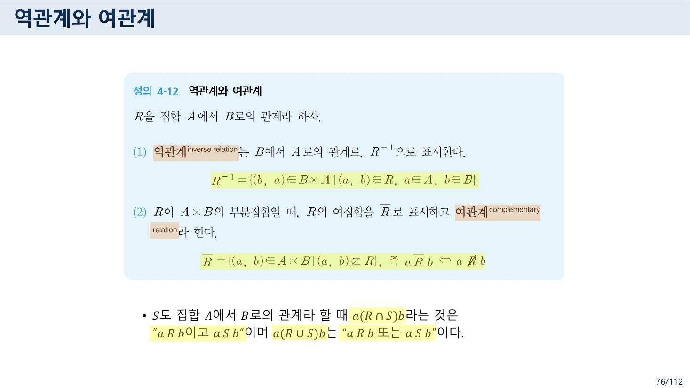
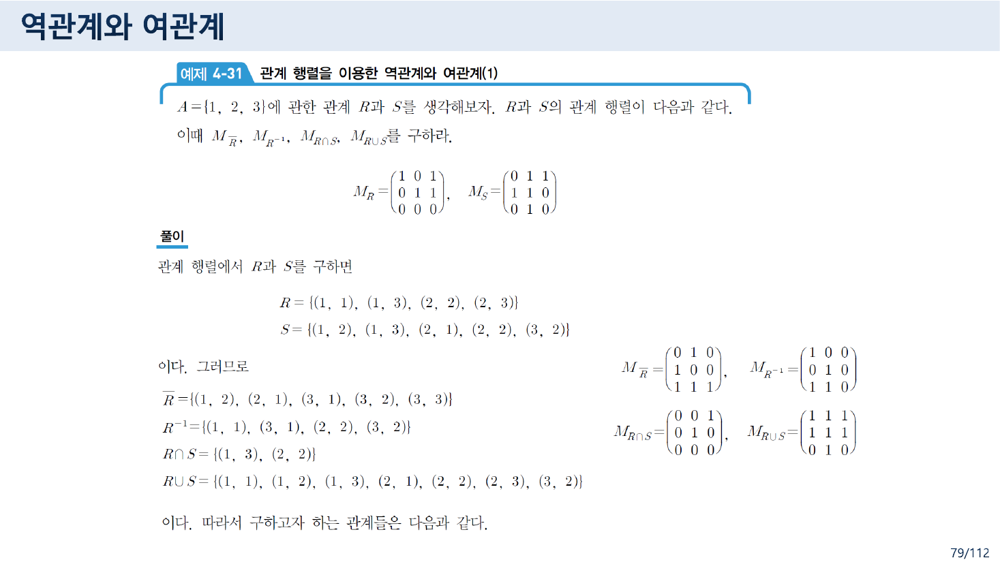
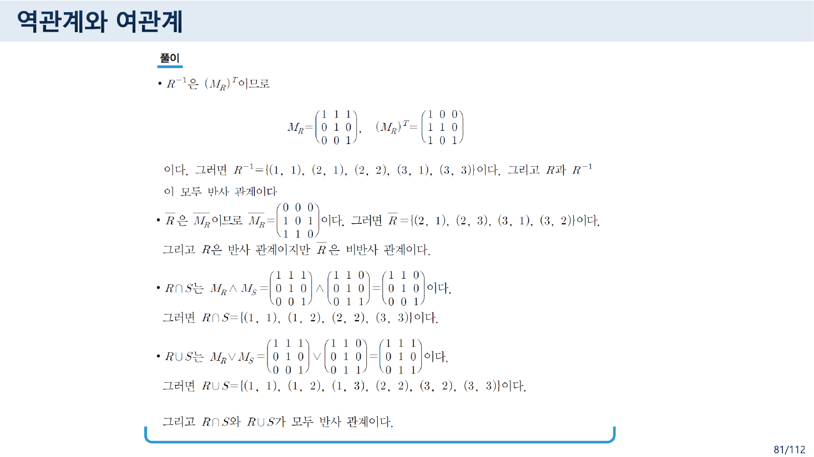
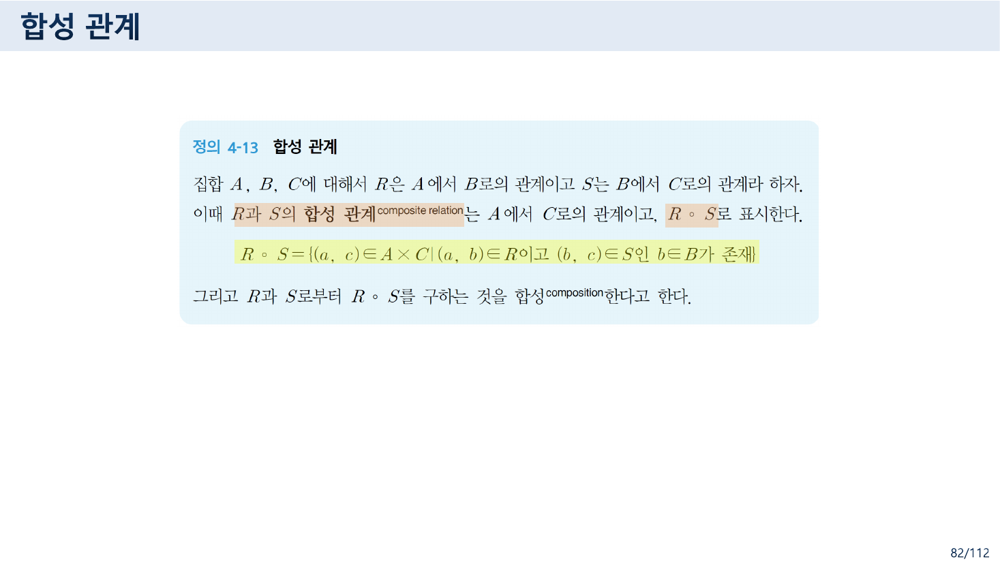
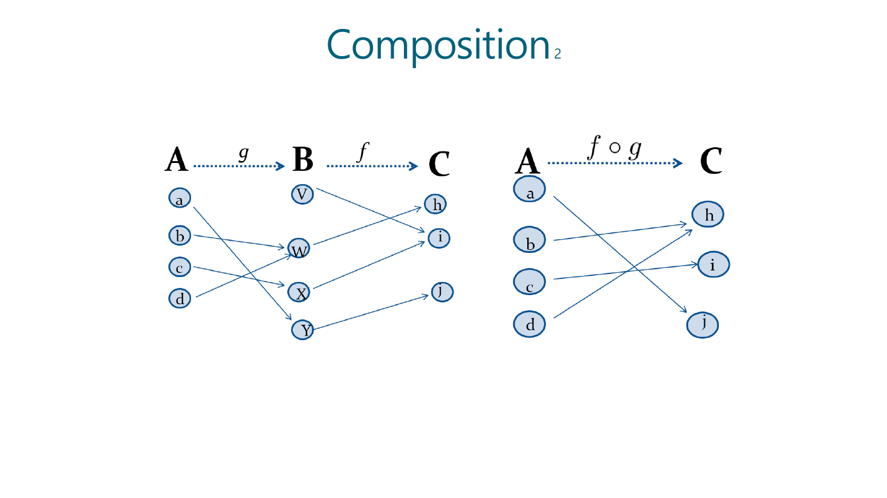
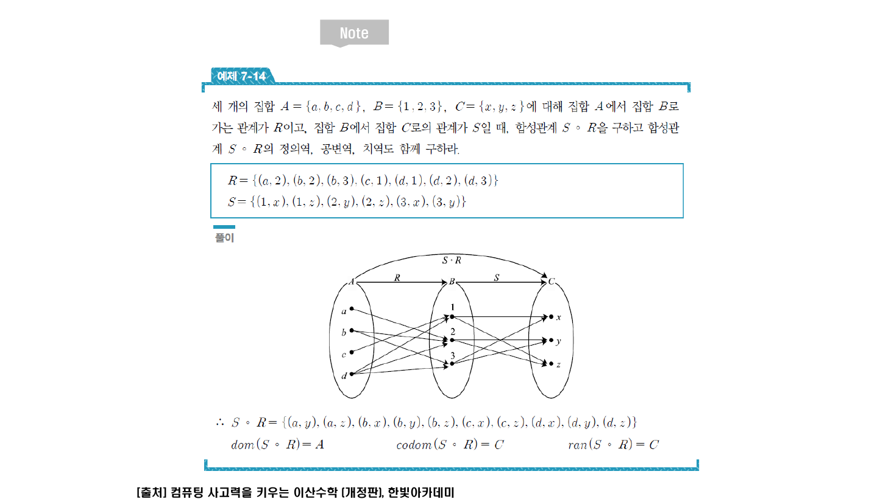
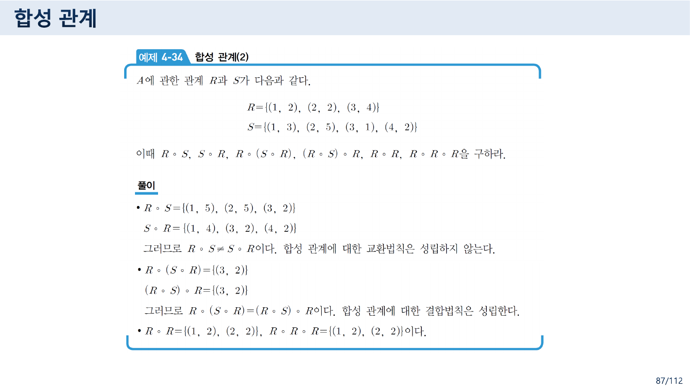
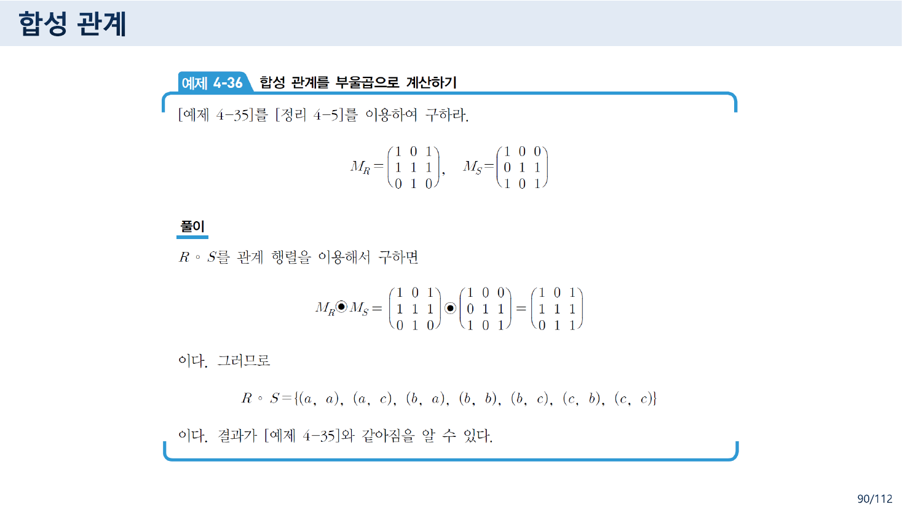
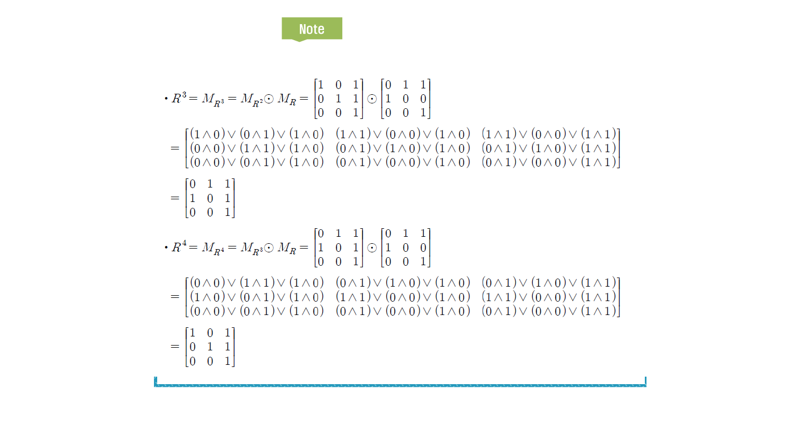

> [!abstract] 이 묶음이 실제로 하는 말
> 4.5절이 하는 일은 한 문장으로 요약된다. **관계에 대한 모든 연산을 관계 행렬의 연산으로 바꾼다.**
>
> 80쪽의 정리 4-4가 그 환전표다.
>
> | 관계의 연산 | 행렬의 연산 |
> | --- | --- |
> | $R \cap S$ | $M_R \wedge M_S$ |
> | $R \cup S$ | $M_R \vee M_S$ |
> | $R^{-1}$ | $(M_R)^{T}$ — **전치** |
> | $\overline{R}$ | $\overline{M_R}$ — **여행렬** |
> | $R \circ S$ | $M_R \odot M_S$ — **부울곱** (정리 4-5) |
>
> 다섯 줄이 전부다. 집합 연산은 원소별 논리연산으로, 방향 뒤집기는 전치로, 이어 붙이기는 곱으로. **관계를 다루는 일이 행렬을 다루는 일로 완전히 옮겨 간다.**
>
> 그런데 마지막 줄에서 이름이 갈라진다. 82쪽의 정의 4-13은 *"$R$ 다음 $S$"*를 **$R \circ S$**라 쓰고, 84·89쪽의 교재 인용 슬라이드는 **똑같은 것을 $S \circ R$**이라 쓴다. 83쪽의 영어 슬라이드는 함수의 관행대로 $f \circ g$가 *"$g$ 다음 $f$"*다. **한 파일 안에 세 개의 $\circ$가 있고, 그중 둘은 같은 연산을 반대로 적는다.**
>
> 이 어긋남이 사소하지 않은 이유는 87쪽에 있다. 예제 4-34가 *"합성 관계에 대한 교환법칙은 성립하지 않는다"*를 $R \circ S \ne S \circ R$로 증명하는데, **어느 쪽이 어느 쪽인지가 기호 관행에 달려 있기 때문이다.**

---

## 1. 역관계와 여관계 — 방향과 여집합



76쪽의 정의 4-12가 두 연산을 한꺼번에 정의한다.

> (1) **역관계**(inverse relation)는 $B$에서 $A$로의 관계로, $R^{-1}$으로 표시한다.
> $$R^{-1} = \{(b, a) \in B \times A \mid (a,b) \in R,\ a \in A,\ b \in B\}$$
> (2) $R$이 $A \times B$의 부분집합일 때, $R$의 여집합을 $\overline{R}$로 표시하고 **여관계**(complementary relation)라 한다.
> $$\overline{R} = \{(a,b) \in A \times B \mid (a,b) \notin R\},\quad \text{즉 } a\,\overline{R}\,b \Leftrightarrow a \not R b$$

두 연산이 서로 다른 것을 뒤집는다.

- **역관계**는 순서쌍의 **안쪽**을 뒤집는다. $A \times B$에서 $B \times A$로 옮겨 간다.
- **여관계**는 **바깥**을 뒤집는다. $A \times B$ 안에 머무르면서 선택된 것과 선택되지 않은 것을 맞바꾼다.

[07번 노트](./07.%20%EA%B4%80%EA%B3%84%EB%8A%94%20%EC%9B%90%EC%86%8C%EB%A5%BC%20%EB%B2%84%EB%A6%B4%20%EC%88%98%20%EC%9E%88%EB%8B%A4%20%E2%80%94%204%EC%AA%BD%EC%9D%98%20%EC%A0%95%EC%9D%98%EC%99%80%2032%EC%AA%BD%EC%9D%98%20%EA%B7%B8%EB%A6%BC%20%EC%82%AC%EC%9D%B4.md)에서 관계를 "곱집합에서 고르는 일"이라 했으므로, **여관계는 고르지 않은 것을 전부 고르는 것**이다. 그래서 $R$과 $\overline{R}$의 크기를 더하면 언제나 $|A||B|$가 된다.

같은 쪽 아래가 교집합·합집합을 덧붙인다.

> $S$도 집합 $A$에서 $B$로의 관계라 할 때 $a(R \cap S)b$라는 것은 "$a R b$이고 $a S b$"이며 $a(R \cup S)b$는 "$a R b$ 또는 $a S b$"이다.

관계가 집합이므로 집합 연산이 그대로 통한다. **관계 $\cap$·$\cup$가 논리 $\wedge$·$\vee$로 번역되는 이 한 줄**이 [06번 노트](./06.%20%EC%A7%91%ED%95%A9%EC%9D%98%20%EB%8C%80%EC%88%98%EB%8A%94%20%EB%85%BC%EB%A6%AC%EC%9D%98%20%EB%8C%80%EC%88%98%EB%8B%A4%20%E2%80%94%20%EA%B0%99%EC%9D%80%20%EB%B2%95%EC%B9%99%EC%9D%84%20%EC%84%B8%20%EB%B2%88%20%EC%A6%9D%EB%AA%85%ED%95%98%EA%B8%B0.md)의 결론(집합의 대수 = 논리의 대수)을 관계에서 다시 쓴 것이고, 곧 정리 4-4의 첫 두 줄이 된다.

### 77~78쪽 — 집합으로 직접 구해 보기

예제 4-29가 $A = \{1,2,3,4\}$, $B = \{a,b,c\}$에서 네 연산을 전부 구한다.

$$R = \{(1,a),(1,b),(2,b),(2,c),(3,b),(4,a)\}, \qquad S = \{(1,b),(2,c),(3,b),(4,b)\}$$

| 연산 | 결과 | 개수 |
| --- | --- | --- |
| $A \times B$ | 열두 쌍 전부 | 12 |
| $\overline{R} = (A \times B) - R$ | $\{(1,c),(2,a),(3,a),(3,c),(4,b),(4,c)\}$ | 6 |
| $R \cap S$ | $\{(1,b),(2,c),(3,b)\}$ | 3 |
| $R \cup S$ | $\{(1,a),(1,b),(2,b),(2,c),(3,b),(4,a),(4,b)\}$ | 7 |
| $R^{-1}$ | $\{(a,1),(b,1),(b,2),(c,2),(b,3),(a,4)\}$ | 6 |

$|R| + |\overline{R}| = 6 + 6 = 12 = |A \times B|$이고, $|R^{-1}| = |R|$이다. **역관계는 개수를 보존하고 여관계는 보수를 만든다.**

---

## 2. 정리 4-4 — 네 연산을 행렬로 옮긴다



79쪽의 예제 4-31이 같은 일을 관계 행렬로 한다. $A = \{1,2,3\}$에 관한 두 관계가 행렬로 주어진다.

$$M_R = \begin{pmatrix} 1&0&1\\ 0&1&1\\ 0&0&0 \end{pmatrix}, \qquad M_S = \begin{pmatrix} 0&1&1\\ 1&1&0\\ 0&1&0 \end{pmatrix}$$

행렬에서 관계를 읽어 내면 $R = \{(1,1),(1,3),(2,2),(2,3)\}$, $S = \{(1,2),(1,3),(2,1),(2,2),(3,2)\}$이다. 그리고 네 개의 답이 나온다.

| | 집합으로 | 행렬로 |
| --- | --- | --- |
| $\overline{R}$ | $\{(1,2),(2,1),(3,1),(3,2),(3,3)\}$ | $\begin{pmatrix} 0&1&0\\ 1&0&0\\ 1&1&1 \end{pmatrix}$ |
| $R^{-1}$ | $\{(1,1),(3,1),(2,2),(3,2)\}$ | $\begin{pmatrix} 1&0&0\\ 0&1&0\\ 1&1&0 \end{pmatrix}$ |
| $R \cap S$ | $\{(1,3),(2,2)\}$ | $\begin{pmatrix} 0&0&1\\ 0&1&0\\ 0&0&0 \end{pmatrix}$ |
| $R \cup S$ | $\{(1,1),(1,2),(1,3),(2,1),(2,2),(2,3),(3,2)\}$ | $\begin{pmatrix} 1&1&1\\ 1&1&1\\ 0&1&0 \end{pmatrix}$ |

$M_{R^{-1}}$이 $M_R$의 **전치**라는 것을 눈으로 확인할 수 있다. $M_R$의 셋째 행이 전부 0이었는데 $M_{R^{-1}}$에서는 셋째 **열**이 전부 0이 되었다. 07번 노트에서 본 예제 4-10($<$)과 예제 4-12($>$)의 상삼각·하삼각 관계가 여기서 정리로 승격된다.

80쪽의 정리 4-4가 그것을 못 박는다.

$$M_{R \cap S} = M_R \wedge M_S, \qquad M_{R \cup S} = M_R \vee M_S$$
$$M_{R^{-1}} = (M_R)^{T}, \qquad M_{\overline{R}} = \overline{M_R}$$

**네 줄이 4.5절 전반의 전부**다. 나머지는 예제로 확인하는 일뿐이다.



81쪽의 예제 4-32가 정리 4-4를 실제로 쓴다. $R = \{(1,1),(1,2),(1,3),(2,2),(3,3)\}$, $S = \{(1,1),(1,2),(2,2),(3,2),(3,3)\}$일 때

$$M_R = \begin{pmatrix} 1&1&1\\ 0&1&0\\ 0&0&1 \end{pmatrix}, \quad (M_R)^{T} = \begin{pmatrix} 1&0&0\\ 1&1&0\\ 1&0&1 \end{pmatrix}, \quad \overline{M_R} = \begin{pmatrix} 0&0&0\\ 1&0&1\\ 1&1&0 \end{pmatrix}$$

그리고 **성질이 어떻게 옮겨 가는지**를 관찰로 덧붙인다.

> - $R$과 $R^{-1}$이 모두 **반사** 관계이다.
> - $R$은 반사 관계이지만 $\overline{R}$은 **비반사** 관계이다.
> - $R \cap S$와 $R \cup S$가 모두 **반사** 관계이다.

주대각만 보면 전부 자명해진다. 전치는 주대각을 건드리지 않고($\Rightarrow$ 반사성 보존), 여행렬은 주대각을 뒤집으며($1 \to 0$, 그래서 반사 $\to$ 비반사), $\wedge$와 $\vee$는 둘 다 1인 자리를 1로 남긴다. **[08번 노트](./08.%20%EA%B2%BD%EB%A1%9C%EB%8A%94%20%EA%B3%B1%ED%95%98%EA%B3%A0%20%EC%84%B1%EC%A7%88%EC%9D%80%20%EB%94%B0%EC%A7%84%EB%8B%A4%20%E2%80%94%20%E3%80%8C%EB%AA%A8%EB%93%A0%E3%80%8D%EC%9D%B4%EB%9D%BC%20%EC%8D%A8%EC%95%BC%20%ED%95%A0%20%EC%9E%90%EB%A6%AC%EC%9D%98%20%E3%80%8C%EC%96%B4%EB%96%A4%E3%80%8D.md)에서 배운 성질이 여기서 행렬의 모양으로 환산된다.**

> [!note] 원본 오타 — 81쪽
> *"그리고 $R$과 $R^{-1}$이 모두 **바사** 관계이다"* — 반사(反射)의 오타다. 같은 쪽 아래 줄들은 「반사」로 정확히 적혀 있다.

---

## 3. 합성 관계 — 그리고 세 개의 $\circ$

### 정의 4-13은 왼쪽부터 읽는다



82쪽.

> 집합 $A$, $B$, $C$에 대해서 $R$은 $A$에서 $B$로의 관계이고 $S$는 $B$에서 $C$로의 관계라 하자. 이때 $R$과 $S$의 **합성 관계**는 $A$에서 $C$로의 관계이고, **$R \circ S$**로 표시한다.
> $$R \circ S = \{(a, c) \in A \times C \mid (a,b) \in R \text{ 이고 } (b,c) \in S \text{ 인 } b \in B \text{ 가 존재}\}$$

**$R$을 먼저 타고 $S$를 나중에 탄다.** 기호를 왼쪽에서 오른쪽으로 읽으면 그 순서가 그대로 나온다. 유향 그래프로 보면 화살표를 두 번 따라가는 일이고, 정의 4-6의 "길이 2인 경로"와 정확히 같은 모양이다 — 차이는 두 번의 걸음이 **서로 다른 관계**에서 온다는 점뿐이다.

### 83쪽은 오른쪽부터 읽는다



83쪽은 영어 슬라이드로 함수의 합성을 그린다.

$$A \xrightarrow{\ g\ } B \xrightarrow{\ f\ } C \qquad\Longrightarrow\qquad A \xrightarrow{\ f \circ g\ } C$$

**$g$를 먼저 타고 $f$를 나중에 탄다.** 기호는 $f \circ g$이므로 **오른쪽부터 읽어야** 순서가 맞다. 이것이 함수 합성의 표준 관행이고, $(f \circ g)(x) = f(g(x))$라는 식에서 자연스럽게 나온다.

### 84~85쪽과 89쪽은 정의 4-13과 같은 것을 반대로 적는다



84쪽의 「Note」 슬라이드(한빛아카데미 『컴퓨팅 사고력을 키우는 이산수학』 인용)가 예제 7-14를 싣는다.

> 세 개의 집합 $A = \{a,b,c,d\}$, $B = \{1,2,3\}$, $C = \{x,y,z\}$에 대해 집합 $A$에서 집합 $B$로 가는 관계가 $R$이고, 집합 $B$에서 집합 $C$로의 관계가 $S$일 때, **합성관계 $S \circ R$**을 구하고 $\cdots$

$R: A \to B$이고 $S: B \to C$이므로 **$R$을 먼저 타고 $S$를 나중에 탄다.** 82쪽이라면 이것을 $R \circ S$라 불렀을 상황이다. 같은 슬라이드가 답까지 낸다.

$$R = \{(a,2),(b,2),(b,3),(c,1),(d,1),(d,2),(d,3)\}, \quad S = \{(1,x),(1,z),(2,y),(2,z),(3,x),(3,y)\}$$
$$S \circ R = \{(a,y),(a,z),(b,x),(b,y),(b,z),(c,x),(c,z),(d,x),(d,y),(d,z)\}$$

$a \to 2 \to \{y, z\}$이므로 $(a,y)$와 $(a,z)$. 계산 자체는 정확하다. **이름만 반대다.**

89쪽의 「Note」가 한 번 더 못을 박는다.

> 관계 $S \circ R$은 이 두 관계행렬 $M_R$과 $M_S$의 **부울곱**으로 구함

즉 $M_{S \circ R} = M_R \odot M_S$다. 그런데 90쪽의 예제 4-36은 정확히 같은 식을 $R \circ S$로 쓴다.

> [!caution] 원본 불일치 — 82쪽 $R \circ S$ = 84·89쪽 $S \circ R$
> 한 파일 안에서 **같은 연산이 두 이름을 갖는다.**
>
> | 쪽 | 표기 | 뜻 | 행렬 |
> | --- | --- | --- | --- |
> | 82, 86~88, 90~91 | $R \circ S$ | $R$ 먼저, $S$ 나중 | $M_R \odot M_S$ |
> | 83 (영어) | $f \circ g$ | $g$ 먼저, $f$ 나중 | — |
> | 84~85, 89, 92~95 (한빛 인용) | $S \circ R$ | $R$ 먼저, $S$ 나중 | $M_R \odot M_S$ |
>
> 수학계에는 두 관행이 다 있다. 함수 합성은 오른쪽부터(83쪽), 관계 합성은 **왼쪽부터 쓰는 쪽**(82쪽)도 흔하다. 문제는 **한 강의자료가 둘을 섞었다**는 점이다.
>
> 어디서 물리는가. **87쪽의 예제 4-34**가 교환법칙의 실패를 보이는 자리다.
>
> $$R = \{(1,2),(2,2),(3,4)\}, \qquad S = \{(1,3),(2,5),(3,1),(4,2)\}$$
> $$R \circ S = \{(1,5),(2,5),(3,2)\}, \qquad S \circ R = \{(1,4),(3,2),(4,2)\}$$
>
> 82쪽 정의로 계산하면 위와 같고, 슬라이드에 적힌 값과 일치한다. 그런데 84쪽 관행으로 읽는 독자는 두 줄을 **서로 바꿔** 이해하게 된다. 결론($R \circ S \ne S \circ R$)은 어느 쪽이든 같지만, **각 줄이 어떤 경로를 센 것인지**는 정반대가 된다.
>
> 이 과목에서 「한 파일에 두 계열의 슬라이드가 번갈아 붙어 서로 다른 이름을 쓰는」 현상은 이번이 처음이 아니다. [02번 노트](./02.%20%ED%95%9C%20%ED%8C%8C%EC%9D%BC%EC%97%90%20%EC%B1%85%20%EB%91%90%20%EA%B6%8C%20%E2%80%94%20%EC%9D%98%EB%AF%B8%EB%A1%9C%20%EA%B0%80%EB%A5%B4%EC%B9%98%EB%8A%94%20%EB%85%BC%EB%A6%AC%EC%99%80%20%ED%8C%8C%EC%8B%B1%EC%9C%BC%EB%A1%9C%20%EA%B0%80%EB%A5%B4%EC%B9%98%EB%8A%94%20%EB%85%BC%EB%A6%AC.md)에서 본 「수학적 모델과 논리」 9쪽과 10쪽도 같은 연산을 `동치 ⇔`와 `Biconditional ↔`로 다르게 불렀다. **이 자료의 구조적 특징이다.**

### 합성 계산기 — 두 관행을 나란히

```html preview h=700px
<div id="cmp" style="font-family:system-ui,-apple-system,'Segoe UI',sans-serif;color:var(--foreground);padding:18px">
  <div style="font-size:13px;font-weight:600;margin-bottom:4px">예제 4-34 — 합성의 순서와 이름</div>
  <div style="font-size:12px;opacity:.75;margin-bottom:14px">
    R = {(1,2), (2,2), (3,4)} &nbsp;·&nbsp; S = {(1,3), (2,5), (3,1), (4,2)} &nbsp; 위의 원소를 눌러 경로를 따라가 본다.
  </div>
  <div style="display:flex;gap:8px;flex-wrap:wrap;margin-bottom:14px">
    <button class="cb" data-o="RS">R 먼저 → S 나중</button>
    <button class="cb" data-o="SR">S 먼저 → R 나중</button>
  </div>
  <div id="cmp-name" style="font-size:12.5px;margin-bottom:14px;padding:10px 12px;border:1px solid var(--border);border-radius:8px;background:var(--card)"></div>
  <div style="display:flex;gap:10px;flex-wrap:wrap;align-items:stretch;margin-bottom:16px">
    <div id="col1" class="cmpcol"></div>
    <div class="arrowcol"><div id="lab1"></div></div>
    <div id="col2" class="cmpcol"></div>
    <div class="arrowcol"><div id="lab2"></div></div>
    <div id="col3" class="cmpcol"></div>
  </div>
  <div id="cmp-out" style="font-size:13px;line-height:1.9"></div>
  <style>
    #cmp .cb{background:var(--card);color:var(--foreground);border:1px solid var(--border);
      border-radius:7px;padding:6px 11px;font-size:12px;cursor:pointer;font-family:inherit}
    #cmp .cb.sel{border-color:var(--chart-1);box-shadow:inset 0 0 0 1px var(--chart-1)}
    #cmp .cmpcol{display:flex;flex-direction:column;gap:6px;min-width:78px}
    #cmp .arrowcol{display:flex;align-items:center;padding:0 4px;font-size:12px;opacity:.75;font-weight:600}
    #cmp .node{border:1px solid var(--border);border-radius:7px;padding:7px 12px;background:var(--card);
      text-align:center;font-family:ui-monospace,monospace;font-size:13px;cursor:pointer}
    #cmp .node.hi{background:var(--chart-1);color:var(--card);border-color:var(--chart-1);font-weight:700}
    #cmp .node.mid{background:var(--chart-3);color:var(--card);border-color:var(--chart-3)}
    #cmp .node.end{background:var(--chart-2);color:var(--card);border-color:var(--chart-2);font-weight:700}
  </style>
</div>
<script>
(function(){
  var root=document.getElementById('cmp');
  var R=[[1,2],[2,2],[3,4]], S=[[1,3],[2,5],[3,1],[4,2]];
  var order='RS', pick=null;
  function step(rel,x){ return rel.filter(function(p){return p[0]===x;}).map(function(p){return p[1];}); }
  function compose(first,second){
    var out=[];
    first.forEach(function(p){
      step(second,p[1]).forEach(function(c){
        var t='('+p[0]+','+c+')'; if(out.indexOf(t)<0) out.push(t);
      });
    });
    return out.sort();
  }
  function draw(){
    root.querySelectorAll('.cb').forEach(function(b){b.classList.toggle('sel',b.dataset.o===order);});
    var first = order==='RS'? R : S, second = order==='RS'? S : R;
    var f1 = order==='RS'? 'R' : 'S', f2 = order==='RS'? 'S' : 'R';
    var starts=[]; first.forEach(function(p){ if(starts.indexOf(p[0])<0) starts.push(p[0]); }); starts.sort();
    var mids=[]; first.forEach(function(p){ if(mids.indexOf(p[1])<0) mids.push(p[1]); }); mids.sort();
    var ends=[]; second.forEach(function(p){ if(ends.indexOf(p[1])<0) ends.push(p[1]); }); ends.sort();
    var reach1 = pick!==null? step(first,pick) : [];
    var reach2 = []; reach1.forEach(function(m){ step(second,m).forEach(function(e){ if(reach2.indexOf(e)<0) reach2.push(e); }); });
    function col(id,items,cls,clickable){
      root.querySelector(id).innerHTML = items.map(function(v){
        var on = clickable ? (v===pick) : (cls==='mid'? reach1.indexOf(v)>=0 : reach2.indexOf(v)>=0);
        return '<div class="node'+(on?(clickable?' hi':(cls==='mid'?' mid':' end')):'')+'" data-v="'+v+'">'+v+'</div>';
      }).join('');
      if(clickable) root.querySelectorAll(id+' .node').forEach(function(n){
        n.onclick=function(){ pick = (pick===+n.dataset.v)? null : +n.dataset.v; draw(); };
      });
    }
    col('#col1',starts,'start',true);
    col('#col2',mids,'mid',false);
    col('#col3',ends,'end',false);
    root.querySelector('#lab1').textContent='— '+f1+' →';
    root.querySelector('#lab2').textContent='— '+f2+' →';
    var res=compose(first,second);
    var nameHere = order==='RS' ? 'R ∘ S' : 'S ∘ R';
    var nameThere = order==='RS' ? 'S ∘ R' : 'R ∘ S';
    root.querySelector('#cmp-name').innerHTML=
      '지금 고른 순서(<b>'+f1+' 먼저, '+f2+' 나중</b>)를 <br>'+
      '&nbsp;&nbsp;· <b>82쪽 정의 4-13</b>은 &nbsp;<code style="font-size:13px">'+nameHere+'</code>&nbsp; 라고 쓴다<br>'+
      '&nbsp;&nbsp;· <b>84·89쪽 Note</b>는 &nbsp;<code style="font-size:13px">'+nameThere+'</code>&nbsp; 라고 쓴다';
    root.querySelector('#cmp-out').innerHTML=
      '결과 = {'+res.join(', ')+'} &nbsp;<span style="opacity:.65">('+res.length+'쌍)</span>'+
      (pick!==null
        ? '<div style="margin-top:6px;opacity:.85">'+pick+' → '+f1+' → {'+(reach1.join(', ')||'없음')+'} → '+f2+' → {'+(reach2.join(', ')||'없음')+'}</div>'
        : '<div style="margin-top:6px;opacity:.65">왼쪽 열의 원소를 눌러 두 걸음을 따라가 보라.</div>');
  }
  root.querySelectorAll('.cb').forEach(function(b){b.onclick=function(){order=b.dataset.o;pick=null;draw();};});
  draw();
})();
</script>
```

두 버튼을 번갈아 눌러 보면 결과가 다르다는 것과, **같은 결과가 어느 쪽 관행에서 어떤 이름으로 불리는지**가 동시에 보인다.

$$R \circ S = \{(1,5),(2,5),(3,2)\} \ne \{(1,4),(3,2),(4,2)\} = S \circ R$$

$(3,2)$만 양쪽에 공통이다. $3 \to 4 \to 2$(R 먼저)와 $3 \to 1 \to 2$(S 먼저)로 **경유지가 다른데 출발과 도착이 우연히 같다.**

> [!note] 원본의 작은 빈틈 — 87쪽
> 예제 4-34는 *"$A$에 관한 관계 $R$과 $S$"*라고만 하고 **$A$가 무엇인지 말하지 않는다.** $S$에 $(2,5)$가 있으므로 $A \supseteq \{1,2,3,4,5\}$여야 한다. 답에는 영향이 없지만 합성 관계의 정의(정의 4-13)가 세 집합 $A, B, C$를 요구하므로, 정의를 그대로 적용하려면 $A$를 명시해야 한다.

---

## 4. 합성의 대수 — 결합은 되고 교환은 안 된다



예제 4-34는 두 법칙을 한꺼번에 시험한다.

$$R \circ (S \circ R) = \{(3,2)\} = (R \circ S) \circ R$$

> 그러므로 $R \circ (S \circ R) = (R \circ S) \circ R$이다. **합성 관계에 대한 결합법칙은 성립한다.**

91쪽의 정리 4-6이 그것을 일반화하고, 정리 4-7이 역관계와의 관계를 준다.

$$(R \circ S) \circ T = R \circ (S \circ T), \qquad (R \circ S)^{-1} = S^{-1} \circ R^{-1}$$

정리 4-7의 **순서가 뒤집힌다**는 점이 중요하다. $R: A \to B$, $S: B \to C$이면 $(R \circ S): A \to C$이고 그 역은 $C \to A$다. 되돌아오려면 $S^{-1}: C \to B$를 먼저 타고 $R^{-1}: B \to A$를 나중에 타야 하므로, 82쪽 관행으로 쓰면 $S^{-1} \circ R^{-1}$이 맞다. **옷을 벗을 때 겉옷부터 벗는 것과 같은 순서**다.

예제 4-34의 마지막 줄이 거듭제곱도 함께 계산한다.

$$R \circ R = \{(1,2),(2,2)\}, \qquad R \circ R \circ R = \{(1,2),(2,2)\}$$

$(3,4)$가 사라진 이유는 $4$에서 나가는 $R$의 간선이 없기 때문이다. 그리고 **두 번 합성한 결과가 세 번 합성해도 그대로**라는 것이 정리 7-1(94쪽)의 $R^n \subseteq R$ 조건과 이어진다.

---

## 5. 합성을 행렬로 — 그리고 거듭제곱의 주기



88쪽의 예제 4-35가 합성을 **손으로 아홉 줄에 걸쳐** 구하고, 90쪽의 예제 4-36이 **같은 것을 부울곱 한 번으로** 구한다. 08번 노트에서 본 예제 4-15 → 4-16의 구조가 그대로 반복된다.

$$M_R = \begin{pmatrix} 1&0&1\\ 1&1&1\\ 0&1&0 \end{pmatrix}, \quad M_S = \begin{pmatrix} 1&0&0\\ 0&1&1\\ 1&0&1 \end{pmatrix}, \quad M_R \odot M_S = \begin{pmatrix} 1&0&1\\ 1&1&1\\ 0&1&1 \end{pmatrix}$$

$$R \circ S = \{(a,a),(a,c),(b,a),(b,b),(b,c),(c,b),(c,c)\}$$

**손으로 구한 예제 4-35와 정확히 같다.** 이번에는 46쪽 같은 전사 오류가 없다.

92~93쪽의 「Note」가 거듭제곱을 정의한다.

$$R^n = \begin{cases} R, & n = 1 \\ R^{n-1} \circ R, & n > 1 \end{cases}$$

그리고 예제 7-17이 $A = \{1,2,3\}$, $M_R = \begin{pmatrix} 0&1&1\\ 1&0&0\\ 0&0&1 \end{pmatrix}$의 거듭제곱을 $R^4$까지 계산한다.



| | 행렬 |
| --- | --- |
| $R^1$ | $\begin{pmatrix} 0&1&1\\ 1&0&0\\ 0&0&1 \end{pmatrix}$ |
| $R^2$ | $\begin{pmatrix} 1&0&1\\ 0&1&1\\ 0&0&1 \end{pmatrix}$ |
| $R^3$ | $\begin{pmatrix} 0&1&1\\ 1&0&1\\ 0&0&1 \end{pmatrix}$ |
| $R^4$ | $\begin{pmatrix} 1&0&1\\ 0&1&1\\ 0&0&1 \end{pmatrix}$ |

**$R^4 = R^2$다.** 원본은 이 사실을 지적하지 않고 지나가지만, 이것이 4.6절 전체의 근거가 된다.

```html preview h=560px
<div id="pw" style="font-family:system-ui,-apple-system,'Segoe UI',sans-serif;color:var(--foreground);padding:18px">
  <div style="font-size:13px;font-weight:600;margin-bottom:4px">예제 7-17 — 거듭제곱이 주기에 갇힌다</div>
  <div style="font-size:12px;opacity:.75;margin-bottom:14px">
    Rⁿ = Rⁿ⁻¹ ∘ R 을 되풀이한다. 세 원소짜리 집합이므로 0·1 행렬은 2⁹ = 512가지밖에 없고, 언젠가는 반드시 되돌아온다.
  </div>
  <div style="display:flex;gap:10px;align-items:center;margin-bottom:16px;flex-wrap:wrap">
    <button id="pw-prev" class="pwb">◀</button>
    <div id="pw-n" style="font-size:15px;font-weight:700;min-width:52px;text-align:center"></div>
    <button id="pw-next" class="pwb">▶</button>
    <button id="pw-play" class="pwb">자동</button>
  </div>
  <div style="display:flex;gap:26px;flex-wrap:wrap;align-items:flex-start">
    <table id="pw-mat"></table>
    <div style="flex:1;min-width:250px">
      <div id="pw-set" style="font-size:12.5px;line-height:1.85"></div>
      <div id="pw-cycle" style="margin-top:12px;font-size:12.5px;line-height:1.8;padding:10px 12px;border:1px solid var(--border);border-radius:8px;background:var(--card)"></div>
    </div>
  </div>
  <style>
    #pw .pwb{background:var(--card);color:var(--foreground);border:1px solid var(--border);
      border-radius:7px;padding:6px 13px;font-size:12px;cursor:pointer;font-family:inherit}
    #pw .pwb:hover{border-color:var(--chart-1)}
    #pw table{border-collapse:collapse;font-family:ui-monospace,monospace;font-size:13px}
    #pw td,#pw th{border:1px solid var(--border);width:36px;height:32px;text-align:center}
    #pw th{opacity:.7;font-weight:600}
    #pw td{background:var(--card)}
    #pw td.one{background:var(--chart-1);color:var(--card);font-weight:700}
  </style>
</div>
<script>
(function(){
  var root=document.getElementById('pw');
  var M0=[[0,1,1],[1,0,0],[0,0,1]];
  function bp(A,B){return A.map(function(r,i){return r.map(function(_,j){
    for(var t=0;t<3;t++) if(A[i][t]&&B[t][j]) return 1; return 0;});});}
  var pows=[M0];
  for(var k=1;k<8;k++) pows.push(bp(pows[k-1],M0));
  var n=1, timer=null;
  function key(M){return M.map(function(r){return r.join('');}).join('');}
  function draw(){
    var M=pows[n-1];
    var h='<tr><th></th><th>1</th><th>2</th><th>3</th></tr>';
    for(var i=0;i<3;i++){
      h+='<tr><th>'+(i+1)+'</th>';
      for(var j=0;j<3;j++) h+='<td class="'+(M[i][j]?'one':'')+'">'+M[i][j]+'</td>';
      h+='</tr>';
    }
    root.querySelector('#pw-mat').innerHTML=h;
    root.querySelector('#pw-n').textContent='R'+['','¹','²','³','⁴','⁵','⁶','⁷','⁸'][n];
    var pairs=[];
    for(i=0;i<3;i++)for(j=0;j<3;j++) if(M[i][j]) pairs.push('('+(i+1)+','+(j+1)+')');
    root.querySelector('#pw-set').innerHTML='<b>R<sup>'+n+'</sup></b> = {'+pairs.join(', ')+'}';
    var same=[];
    for(var k=1;k<=8;k++) if(k!==n && key(pows[k-1])===key(M)) same.push('R'+'^'+k);
    root.querySelector('#pw-cycle').innerHTML= same.length
      ? '이 행렬은 <b>'+same.map(function(s){return s.replace('^','<sup>')+'</sup>';}).join(', ')+'</b> 와 같다. 주기 2로 갇혔다.'
        + '<br><span style="opacity:.75">따라서 R<sup>∞</sup>를 구하려면 R¹과 R²만 합치면 된다 — 무한히 계산할 필요가 없다.</span>'
      : '아직 되풀이되지 않았다. 다음으로 넘겨 보라.';
  }
  root.querySelector('#pw-prev').onclick=function(){n=n>1?n-1:8;draw();};
  root.querySelector('#pw-next').onclick=function(){n=n<8?n+1:1;draw();};
  root.querySelector('#pw-play').onclick=function(){
    if(timer){clearInterval(timer);timer=null;this.textContent='자동';return;}
    this.textContent='멈춤';
    timer=setInterval(function(){n=n<8?n+1:1;draw();},900);
  };
  draw();
})();
</script>
```

원소가 세 개면 $3 \times 3$ 부울 행렬은 $2^9 = 512$가지뿐이므로 거듭제곱은 **반드시 언젠가 되풀이된다.** 예제 7-17에서는 $R^2$부터 주기 2로 갇힌다. 그래서 $R^\infty = R \cup R^2 \cup R^3 \cup \cdots$는 **유한 번의 합집합**으로 끝난다. 4.6절이 "무한번 반복 계산해야 한다는 문제점"(118쪽)을 지적할 때, 실제로는 무한이 아니라 $|A|$번이면 된다는 사실이 여기서 이미 나와 있다.

### 94~95쪽 — 추이성을 거듭제곱으로 판정하기

94쪽의 정리 7-1이 08번 노트의 지루한 열여섯 줄을 대체한다.

> 기수가 $n$인 집합 $A$에 대한 관계 $R$이 추이관계인 필요충분조건은 **모든 양의 정수 $n$에 대하여 $R^n \subseteq R$**이다.

수학적 귀납법으로 증명하는데, 귀납 단계가 정확히 합성의 정의를 쓴다 — $(x,y) \in R^{k+1} = R^k \circ R$이면 $(x,z) \in R$이고 $(z,y) \in R^k$인 $z$가 존재하고, 귀납가정에서 $R^k \subseteq R$이므로 $(z,y) \in R$이며, 추이성으로 $(x,y) \in R$.

> [!note] 원본의 표기 결함 — 94쪽
> 정리 7-1은 **$n$을 두 가지로 쓴다.** 앞부분의 *"기수가 $n$인 집합 $A$"*에서는 $|A|$를 뜻하고, 뒷부분의 *"모든 양의 정수 $n$에 대하여 $R^n$"*에서는 거듭제곱의 지수를 뜻한다. 한 문장 안에서 같은 문자가 두 개의 값을 가리킨다. 정리의 내용에는 영향이 없으나(집합의 크기는 실제로 필요하지 않다), 같은 절의 예제 7-22(114쪽)가 *"$|A| = 4$이므로 거듭제곱을 네 번하여"*처럼 **크기를 반복 횟수로 쓰기 때문에** 혼동을 부른다.

95쪽의 예제 7-18이 $R = \{(1,1),(1,2),(1,3),(3,3)\}$에 대해 $R^2 = R^3 = R$임을 보이고 추이관계라고 결론짓는다. 앞의 인터랙티브를 쓰면 이 관계는 **거듭제곱이 곧바로 자기 자신에 고정**된다 — 추이 관계란 **거듭제곱해도 커지지 않는 관계**라는 뜻이다.

---

## 다음으로

- **[10번 노트](./10.%20%EB%8B%AB%ED%9E%98%EC%9D%80%20%EB%B6%80%EC%A1%B1%ED%95%9C%20%EA%B2%83%EC%9D%84%20%EC%B5%9C%EC%86%8C%EB%A1%9C%20%EC%B1%84%EC%9A%B4%EB%8B%A4%20%E2%80%94%20%EA%B7%B8%EB%A6%AC%EA%B3%A0%20%EB%B6%89%EC%9D%80%20%ED%8E%9C%EC%9C%BC%EB%A1%9C%20%EA%B3%A0%EC%B3%90%20%EC%A0%81%EC%9D%80%20%ED%95%9C%20%EC%A4%84.md)** — 4.6절. 거듭제곱이 주기에 갇힌다는 이 노트의 관찰이 곧 "$R^\infty$는 유한 번에 끝난다"가 되고, 그것을 $O(n^3)$으로 줄인 것이 와샬 알고리즘이다.
- **08번 노트** — 부울곱의 정의와 관계의 다섯 성질.
- **[13번 노트](./13.%20%EA%B7%B8%EB%9E%98%ED%94%84%EC%97%90%20%EC%9D%B4%EB%A6%84%EC%9D%84%20%EB%B6%99%EC%9D%B4%EB%8A%94%20%EC%97%B4%20%EA%B0%80%EC%A7%80%20%EB%B0%A9%EB%B2%95%20%E2%80%94%20%EA%B7%B8%EB%A6%AC%EA%B3%A0%20%ED%95%9C%20%EB%B2%88%EC%94%A9%EB%A7%8C%20%EC%93%B0%EC%9D%B4%EB%8A%94%20%EC%A0%95%EC%9D%98%EB%93%A4.md)** — 대칭 관계의 무향 그래프가 그래프 이론으로 넘어간다.

---

## 근거 자료

`4 관계 및 함수.pdf` 75~95쪽.

| 쪽 | 내용 |
| --- | --- |
| 75 | 절 표지 4.5 역관계와 합성 관계 |
| **76** | **정의 4-12 역관계·여관계**, $R \cap S$·$R \cup S$의 뜻 |
| 77~78 | 예제 4-29·4-30 — 집합으로 네 연산 구하기 |
| **79** | **예제 4-31 — 관계 행렬로 같은 네 연산** |
| 80 | **정리 4-4 — 네 연산의 행렬 대응**, 예제 4-32 문제 |
| **81** | **예제 4-32 풀이 — 성질의 보존/반전 관찰 (「바사」 오타)** |
| **82** | **정의 4-13 합성 관계 $R \circ S$ — 왼쪽부터** |
| **83** | **영어 슬라이드 Composition — $f \circ g$, 오른쪽부터** |
| **84~85** | **한빛아카데미 교재 인용 예제 7-14 — 같은 것을 $S \circ R$이라 쓴다** |
| 86 | 예제 4-33 — 화살표 그림으로 합성 |
| **87** | **예제 4-34 — 교환법칙 실패, 결합법칙 성립, $R \circ R$** |
| 88 | 예제 4-35 — 손으로 아홉 줄 |
| 89 | Note — "$S \circ R$은 $M_R$과 $M_S$의 부울곱" |
| **90** | **예제 4-36 — 부울곱 한 번으로 같은 답** |
| **91** | **정리 4-6 결합법칙, 정리 4-7 $(R \circ S)^{-1} = S^{-1} \circ R^{-1}$** |
| 92 | Note 정의 7-17 — 합성관계의 거듭제곱 $R^n$ |
| **93** | **Note 예제 7-17 — $R^4 = R^2$, 주기 2** |
| **94** | **Note 정리 7-1 — 추이관계 ⟺ 모든 $n$에 대해 $R^n \subseteq R$ (문자 $n$의 이중 사용)** |
| 95 | Note 예제 7-18 — $R^2 = R^3 = R$ |

인터랙티브에 쓴 관계와 행렬은 원본 예제 4-34·4-35·4-36·7-17의 값이며, 합성과 부울곱을 파이썬으로 독립 계산해 슬라이드의 답과 한 쌍씩 대조했다(예제 4-34의 여섯 개 답, 예제 4-35의 일곱 쌍, 예제 4-36의 행렬, 예제 7-17의 $R^2 \sim R^4$ 모두 일치). 81쪽의 오타는 250 dpi 확대 렌더로 확인했다. 보충한 것은 $2^9 = 512$라는 상한과 "옷 벗는 순서" 비유뿐이다.
